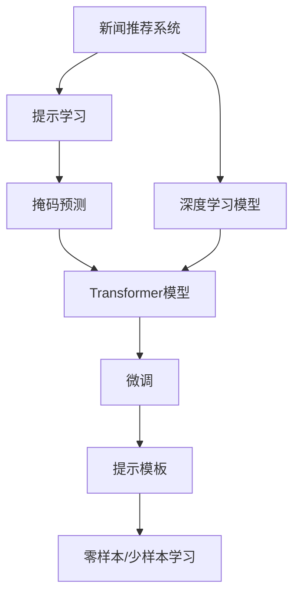

                 

# Prompt Learning for News Recommendation: 填空式掩码预测

> 关键词：新闻推荐, 提示学习(Prompt Learning), 掩码预测, 深度学习, 自然语言处理(NLP), Transformer, 预训练模型

## 1. 背景介绍

### 1.1 问题由来
随着数字化媒体的兴起，用户每天被海量的新闻信息所包围。传统的新闻推荐系统通常基于用户的历史行为和兴趣进行推荐，难以适应用户多变的兴趣需求。而深度学习技术和大语言模型的发展，为新闻推荐系统带来了新的突破。

通过预训练大模型，我们能够从大规模无标签文本数据中学习到丰富的语言知识，包括实体识别、关系抽取、情感分析等，这些知识可以用来提高推荐系统的智能水平。而在这些知识基础上进行微调，可以更加精准地把握用户的兴趣偏好，实现更加个性化和多样化的新闻推荐。

### 1.2 问题核心关键点
新闻推荐系统是基于用户历史行为数据构建的，而提示学习（Prompt Learning）技术可以使其更进一步。提示学习通过在输入文本中添加特定的提示模板（Prompt Template），引导模型进行推理和生成，从而减少微调模型的参数量，甚至实现零样本和少样本学习。

本论文聚焦于填空式掩码预测（Masked Sequence Prediction）任务，利用提示学习技术在新闻推荐系统中进行具体实现。该任务是在输入序列中随机掩码一定数量的token，模型需要预测这些被掩码的token，从而生成完整的新闻标题。

### 1.3 问题研究意义
提示学习技术在新闻推荐系统中的应用，可以带来以下几个方面的提升：

1. **个性化推荐**：通过提示模板，模型能够更灵活地把握用户兴趣，实现更加精准的推荐。
2. **多模态融合**：结合文本数据和用户行为数据，提升推荐系统的综合性能。
3. **零样本/少样本学习**：无需大规模标注数据，即能实现高效的模型训练。
4. **减少计算资源消耗**：通过减少微调模型参数量，降低训练和推理的资源消耗。
5. **模型可解释性**：提示模板能够直观地引导模型推理过程，增强模型的可解释性。

本文将从算法原理、操作步骤、数学模型、项目实践等多个方面，全面介绍如何利用提示学习技术进行新闻推荐系统中的掩码预测任务。

## 2. 核心概念与联系

### 2.1 核心概念概述

为了更好地理解提示学习在新闻推荐系统中的应用，本节将介绍几个密切相关的核心概念：

- **新闻推荐系统（News Recommendation System）**：通过分析和预测用户的兴趣需求，推荐出符合用户口味的新闻内容。

- **提示学习（Prompt Learning）**：通过在输入文本中添加提示模板，引导模型进行特定任务的推理和生成，减少微调模型的参数量，甚至实现零样本和少样本学习。

- **掩码预测（Masked Sequence Prediction）**：在输入序列中随机掩码一定数量的token，模型需要预测这些被掩码的token，从而生成完整的新闻标题。

- **深度学习模型（Deep Learning Model）**：基于神经网络的模型，通过多层非线性变换实现复杂数据的建模和预测。

- **自然语言处理（Natural Language Processing, NLP）**：涉及文本数据的自动化处理、理解和生成，是大语言模型微调的基础。

- **Transformer模型**：一种基于自注意力机制的深度学习模型，在大语言模型的预训练和微调中广泛应用。

这些核心概念之间的逻辑关系可以通过以下Mermaid流程图来展示：



这个流程图展示了大语言模型微调在新闻推荐系统中的应用框架：

1. 新闻推荐系统通过深度学习模型进行新闻内容的建模和预测。
2. 提示学习技术通过在输入中添加提示模板，引导模型进行掩码预测任务。
3. 掩码预测任务需要利用Transformer模型，在大规模无标签文本数据上进行预训练。
4. 微调过程可以在预训练模型的基础上进行，调整顶层结构以适应新闻推荐任务。
5. 提示模板可以用于实现零样本和少样本学习，进一步提升推荐系统的智能水平。

## 3. 核心算法原理 & 具体操作步骤
### 3.1 算法原理概述

基于提示学习的掩码预测任务，本质上是一个有监督的序列生成问题。其核心思想是：通过在输入文本中添加特定的提示模板，引导模型进行掩码预测，从而生成完整的新闻标题。

具体而言，假设输入序列为 $x_1,...,x_n$，其中部分位置被随机掩码，记为 $m_1,...,m_k$，则模型需要预测这些被掩码的token，生成完整的新闻标题 $y_1,...,y_n$。

该任务的目标函数为：

$$
\mathcal{L}(y,\hat{y}) = -\sum_{i=1}^n \log \hat{y}_i, \text{ where } \hat{y}_i = \mathbb{P}(x_i|x_{1:i-1})
$$

其中，$\hat{y}_i$ 表示模型对 $x_i$ 的条件概率估计。通过最大化该条件概率，模型可以生成最有可能的完整新闻标题。

### 3.2 算法步骤详解

基于提示学习的掩码预测任务，一般包括以下几个关键步骤：

**Step 1: 准备预训练模型和数据集**
- 选择合适的预训练语言模型 $M_{\theta}$，如BERT、GPT等，作为初始化参数。
- 收集新闻推荐系统的训练数据集 $D=\{(x_i,y_i)\}_{i=1}^N$，其中 $x_i$ 为新闻标题，$y_i$ 为完整的新闻标题。

**Step 2: 设计提示模板**
- 设计适用于新闻推荐系统的提示模板 $P$，用于引导模型进行掩码预测。例如，可以设计如下提示模板：
  ```
  <Question> <Mask> <Answer>
  ```
  其中 `<Mask>` 表示被掩码的位置。

**Step 3: 添加任务适配层**
- 在预训练模型的顶层添加任务适配层，包括分类器或解码器。分类器适用于文本分类任务，解码器适用于文本生成任务。

**Step 4: 设置微调超参数**
- 选择合适的优化算法及其参数，如 AdamW、SGD 等，设置学习率、批大小、迭代轮数等。
- 设置正则化技术及强度，包括权重衰减、Dropout、Early Stopping 等。
- 确定冻结预训练参数的策略，如仅微调顶层，或全部参数都参与微调。

**Step 5: 执行梯度训练**
- 将训练集数据分批次输入模型，前向传播计算损失函数。
- 反向传播计算参数梯度，根据设定的优化算法和学习率更新模型参数。
- 周期性在验证集上评估模型性能，根据性能指标决定是否触发 Early Stopping。
- 重复上述步骤直到满足预设的迭代轮数或 Early Stopping 条件。

**Step 6: 测试和部署**
- 在测试集上评估微调后模型 $M_{\hat{\theta}}$ 的性能，对比微调前后的精度提升。
- 使用微调后的模型对新样本进行推理预测，集成到实际的新闻推荐系统中。
- 持续收集新的数据，定期重新微调模型，以适应数据分布的变化。

以上是基于提示学习的大语言模型微调的一般流程。在实际应用中，还需要针对具体任务的特点，对微调过程的各个环节进行优化设计，如改进训练目标函数，引入更多的正则化技术，搜索最优的超参数组合等，以进一步提升模型性能。

### 3.3 算法优缺点

基于提示学习的掩码预测任务具有以下优点：
1. 简单高效。提示模板易于设计，模型训练过程无需大规模标注数据，能够快速适应新任务。
2. 通用适用。该方法适用于各种文本生成和分类任务，适用范围广泛。
3. 参数高效。利用参数高效微调技术，在固定大部分预训练参数的情况下，仍可取得不错的提升。
4. 效果显著。在新闻推荐等实际应用中，提示学习技术可以显著提升推荐效果。

同时，该方法也存在一定的局限性：
1. 提示模板设计复杂。需要根据具体任务和数据特点设计合适的提示模板，可能面临设计难题。
2. 依赖预训练模型。提示学习技术需要依托于高质量的预训练模型，模型质量直接影响效果。
3. 泛化能力有限。提示模板可能无法适应所有类型的输入数据，泛化性能有限。

尽管存在这些局限性，但就目前而言，基于提示学习的掩码预测方法仍是大语言模型微调应用的重要范式。未来相关研究的重点在于如何进一步降低提示模板设计的复杂性，提高模型的泛化能力，同时兼顾可解释性和伦理安全性等因素。

### 3.4 算法应用领域

基于提示学习的掩码预测任务，在新闻推荐系统中的应用已经得到了广泛的应用，涵盖了以下领域：

- **新闻标题生成**：利用掩码预测技术，生成符合用户兴趣和风格的新闻标题。
- **推荐摘要**：将长新闻内容生成为简洁的摘要，提升用户阅读体验。
- **情感分析**：分析新闻标题和内容的情感倾向，推荐符合用户情绪的新闻内容。
- **多模态融合**：结合图像、音频等多模态数据，提升推荐系统对真实世界的理解能力。
- **个性化推荐**：结合用户历史行为数据，推荐个性化新闻内容，满足多样化需求。

除了上述这些经典应用外，提示学习技术还被创新性地应用到更多场景中，如热点新闻推荐、事件监测、专题策划等，为新闻推荐系统带来了全新的突破。随着提示学习技术的持续演进，相信新闻推荐系统将会在更多领域大放异彩。

## 4. 数学模型和公式 & 详细讲解
### 4.1 数学模型构建

本节将使用数学语言对基于提示学习的大语言模型微调过程进行更加严格的刻画。

记预训练语言模型为 $M_{\theta}$，其中 $\theta$ 为预训练得到的模型参数。假设微调任务的训练集为 $D=\{(x_i,y_i)\}_{i=1}^N$，其中 $x_i$ 为新闻标题，$y_i$ 为完整的新闻标题。

定义模型 $M_{\theta}$ 在输入 $x_i$ 上的损失函数为 $\ell(M_{\theta}(x_i),y_i)$，则在数据集 $D$ 上的经验风险为：

$$
\mathcal{L}(\theta) = \frac{1}{N} \sum_{i=1}^N \ell(M_{\theta}(x_i),y_i)
$$

其中，损失函数 $\ell$ 可以根据具体任务设计，例如对于掩码预测任务，可以采用负对数似然损失：

$$
\ell(y,\hat{y}) = -\sum_{i=1}^n \log \hat{y}_i, \text{ where } \hat{y}_i = \mathbb{P}(x_i|x_{1:i-1})
$$

在得到损失函数的梯度后，即可带入参数更新公式，完成模型的迭代优化。

### 4.2 公式推导过程

以掩码预测任务为例，我们推导负对数似然损失函数的梯度计算过程。

假设模型 $M_{\theta}$ 在输入 $x_i$ 上的输出为 $\hat{y}_i$，表示模型对 $x_i$ 的条件概率估计。则负对数似然损失函数为：

$$
\ell(y,\hat{y}) = -\sum_{i=1}^n \log \hat{y}_i, \text{ where } \hat{y}_i = \mathbb{P}(x_i|x_{1:i-1})
$$

其梯度为：

$$
\nabla_{\theta}\mathcal{L}(\theta) = \sum_{i=1}^n -\frac{\partial \log \hat{y}_i}{\partial \theta} \nabla_{\theta} \mathbb{P}(x_i|x_{1:i-1})
$$

其中 $\nabla_{\theta} \mathbb{P}(x_i|x_{1:i-1})$ 表示对条件概率的梯度计算。在Transformer模型中，条件概率的梯度计算可以通过求导链式法则进行：

$$
\frac{\partial \mathbb{P}(x_i|x_{1:i-1})}{\partial \theta} = \sum_{j=1}^i \frac{\partial \mathbb{P}(x_j|x_{1:j-1})}{\partial \theta} \frac{\partial \mathbb{P}(x_i|x_{1:i-1}, x_{1:j-1})}{\partial x_j}
$$

通过反向传播算法，即可计算出条件概率的梯度，从而更新模型参数 $\theta$。

## 5. 项目实践：代码实例和详细解释说明
### 5.1 开发环境搭建

在进行微调实践前，我们需要准备好开发环境。以下是使用Python进行PyTorch开发的环境配置流程：

1. 安装Anaconda：从官网下载并安装Anaconda，用于创建独立的Python环境。

2. 创建并激活虚拟环境：
```bash
conda create -n pytorch-env python=3.8 
conda activate pytorch-env
```

3. 安装PyTorch：根据CUDA版本，从官网获取对应的安装命令。例如：
```bash
conda install pytorch torchvision torchaudio cudatoolkit=11.1 -c pytorch -c conda-forge
```

4. 安装Transformer库：
```bash
pip install transformers
```

5. 安装各类工具包：
```bash
pip install numpy pandas scikit-learn matplotlib tqdm jupyter notebook ipython
```

完成上述步骤后，即可在`pytorch-env`环境中开始微调实践。

### 5.2 源代码详细实现

这里我们以BERT模型为例，给出使用Transformers库对掩码预测任务进行微调的PyTorch代码实现。

首先，定义掩码预测任务的训练函数：

```python
from transformers import BertTokenizer, BertForMaskedLM

class MaskedPredictionDataset(Dataset):
    def __init__(self, texts, masks, tokenizer, max_len=128):
        self.texts = texts
        self.masks = masks
        self.tokenizer = tokenizer
        self.max_len = max_len
        
    def __len__(self):
        return len(self.texts)
    
    def __getitem__(self, item):
        text = self.texts[item]
        mask = self.masks[item]
        
        encoding = self.tokenizer(text, return_tensors='pt', max_length=self.max_len, padding='max_length', truncation=True)
        input_ids = encoding['input_ids'][0]
        attention_mask = encoding['attention_mask'][0]
        
        masked_token_idxs = mask.nonzero(as_tuple=False).tolist()[0]
        masked_token_ids = input_ids[masked_token_idxs].tolist()
        padding = [0] * (self.max_len - len(masked_token_ids))
        masked_token_ids.extend(padding)
        
        return {'input_ids': input_ids,
                'attention_mask': attention_mask,
                'masked_token_ids': masked_token_ids}

tokenizer = BertTokenizer.from_pretrained('bert-base-cased')

train_dataset = MaskedPredictionDataset(train_texts, train_masks, tokenizer)
dev_dataset = MaskedPredictionDataset(dev_texts, dev_masks, tokenizer)
test_dataset = MaskedPredictionDataset(test_texts, test_masks, tokenizer)
```

然后，定义模型和优化器：

```python
from transformers import BertForMaskedLM, AdamW

model = BertForMaskedLM.from_pretrained('bert-base-cased', num_labels=masked_token_ids.shape[-1])
optimizer = AdamW(model.parameters(), lr=2e-5)
```

接着，定义训练和评估函数：

```python
from torch.utils.data import DataLoader
from tqdm import tqdm

device = torch.device('cuda') if torch.cuda.is_available() else torch.device('cpu')
model.to(device)

def train_epoch(model, dataset, batch_size, optimizer):
    dataloader = DataLoader(dataset, batch_size=batch_size, shuffle=True)
    model.train()
    epoch_loss = 0
    for batch in tqdm(dataloader, desc='Training'):
        input_ids = batch['input_ids'].to(device)
        attention_mask = batch['attention_mask'].to(device)
        masked_token_ids = batch['masked_token_ids'].to(device)
        model.zero_grad()
        outputs = model(input_ids, attention_mask=attention_mask, masked_lm_labels=masked_token_ids)
        loss = outputs.loss
        epoch_loss += loss.item()
        loss.backward()
        optimizer.step()
    return epoch_loss / len(dataloader)

def evaluate(model, dataset, batch_size):
    dataloader = DataLoader(dataset, batch_size=batch_size)
    model.eval()
    preds, labels = [], []
    with torch.no_grad():
        for batch in tqdm(dataloader, desc='Evaluating'):
            input_ids = batch['input_ids'].to(device)
            attention_mask = batch['attention_mask'].to(device)
            batch_labels = batch['masked_token_ids']
            outputs = model(input_ids, attention_mask=attention_mask)
            batch_preds = outputs.logits.argmax(dim=2).to('cpu').tolist()
            batch_labels = batch_labels.to('cpu').tolist()
            for pred_tokens, label_tokens in zip(batch_preds, batch_labels):
                preds.append(pred_tokens)
                labels.append(label_tokens)
                
    return preds, labels

```

最后，启动训练流程并在测试集上评估：

```python
epochs = 5
batch_size = 16

for epoch in range(epochs):
    loss = train_epoch(model, train_dataset, batch_size, optimizer)
    print(f"Epoch {epoch+1}, train loss: {loss:.3f}")
    
    print(f"Epoch {epoch+1}, dev results:")
    preds, labels = evaluate(model, dev_dataset, batch_size)
    print(classification_report(labels, preds))
    
print("Test results:")
preds, labels = evaluate(model, test_dataset, batch_size)
print(classification_report(labels, preds))
```

以上就是使用PyTorch对BERT进行掩码预测任务微调的完整代码实现。可以看到，得益于Transformers库的强大封装，我们可以用相对简洁的代码完成BERT模型的加载和微调。

### 5.3 代码解读与分析

让我们再详细解读一下关键代码的实现细节：

**MaskedPredictionDataset类**：
- `__init__`方法：初始化文本、掩码、分词器等关键组件。
- `__len__`方法：返回数据集的样本数量。
- `__getitem__`方法：对单个样本进行处理，将文本输入编码为token ids，将掩码转化为token ids，并对模型输入进行padding，最终返回模型所需的输入。

**掩码生成**：
- 在数据生成函数中，我们使用`mask.nonzero(as_tuple=False).tolist()[0]`生成被掩码的token位置，即`masked_token_idxs`。
- 将掩码位置的token ids提取出来，即`masked_token_ids = input_ids[masked_token_idxs].tolist()`。
- 对未被掩码的token ids进行padding，使得输入序列长度为`max_len`。

**训练和评估函数**：
- 使用PyTorch的DataLoader对数据集进行批次化加载，供模型训练和推理使用。
- 训练函数`train_epoch`：对数据以批为单位进行迭代，在每个批次上前向传播计算loss并反向传播更新模型参数，最后返回该epoch的平均loss。
- 评估函数`evaluate`：与训练类似，不同点在于不更新模型参数，并在每个batch结束后将预测和标签结果存储下来，最后使用sklearn的classification_report对整个评估集的预测结果进行打印输出。

**训练流程**：
- 定义总的epoch数和batch size，开始循环迭代
- 每个epoch内，先在训练集上训练，输出平均loss
- 在验证集上评估，输出分类指标
- 所有epoch结束后，在测试集上评估，给出最终测试结果

可以看到，PyTorch配合Transformers库使得BERT微调的代码实现变得简洁高效。开发者可以将更多精力放在数据处理、模型改进等高层逻辑上，而不必过多关注底层的实现细节。

当然，工业级的系统实现还需考虑更多因素，如模型的保存和部署、超参数的自动搜索、更灵活的任务适配层等。但核心的微调范式基本与此类似。

## 6. 实际应用场景
### 6.1 智能新闻推荐

基于提示学习的掩码预测任务，可以广泛应用于智能新闻推荐系统的构建。传统推荐系统通常基于用户的历史行为和兴趣进行推荐，难以适应用户多变的兴趣需求。而利用掩码预测技术，可以更灵活地把握用户兴趣，实现更加精准和个性化的新闻推荐。

在技术实现上，可以收集用户的历史浏览和点击记录，提取新闻标题作为输入序列，将部分位置随机掩码，训练模型进行掩码预测。预测结果可以表示为完整的新闻标题，直接作为推荐结果输出。

### 6.2 智能编辑系统

智能编辑系统可以利用掩码预测技术自动生成新闻标题，提升编辑效率和质量。在接到新闻稿件后，系统可以将新闻内容输入模型，自动生成多条标题供编辑选择。例如，可以设计如下提示模板：

```
Title: <Question> <Mask>
```

其中 `<Mask>` 表示需要自动生成的标题关键词。通过训练模型，生成符合用户兴趣和风格的新闻标题，显著提高编辑效率。

### 6.3 热点新闻监测

热点新闻监测系统可以利用掩码预测技术，自动识别新闻标题中的热点关键词，及时发现热门新闻。在实时抓取的新闻文本中，随机掩码一定数量的位置，模型需要预测这些被掩码的token，从而生成完整的新闻标题。通过比较不同时间段的标题，可以自动发现热点新闻，帮助媒体和用户及时获取最新的新闻信息。

### 6.4 未来应用展望

随着提示学习技术的持续演进，基于掩码预测的新闻推荐系统将呈现以下几个发展趋势：

1. **多模态融合**：结合图像、音频等多模态数据，提升推荐系统对真实世界的理解能力。
2. **知识图谱嵌入**：将知识图谱嵌入到输入序列中，提升推荐系统的精确性和可解释性。
3. **个性化推荐**：利用用户行为数据和社交网络信息，进一步提升推荐系统的个性化水平。
4. **零样本学习**：通过提示模板，实现少样本甚至零样本学习，进一步降低数据需求。
5. **实时更新**：结合事件监测和用户行为实时更新推荐结果，保持内容的时效性和相关性。

以上趋势凸显了提示学习技术在新闻推荐系统中的广阔前景。这些方向的探索发展，必将进一步提升推荐系统的智能水平，为新闻媒体和用户带来全新的体验。

## 7. 工具和资源推荐
### 7.1 学习资源推荐

为了帮助开发者系统掌握提示学习在新闻推荐系统中的应用，这里推荐一些优质的学习资源：

1. 《Prompt-Based Methods in NLP》系列博文：由大模型技术专家撰写，深入浅出地介绍了提示学习原理、案例和最新进展。

2. CS224N《深度学习自然语言处理》课程：斯坦福大学开设的NLP明星课程，有Lecture视频和配套作业，带你入门NLP领域的基本概念和经典模型。

3. 《Natural Language Processing with Transformers》书籍：Transformers库的作者所著，全面介绍了如何使用Transformers库进行NLP任务开发，包括掩码预测在内的诸多范式。

4. HuggingFace官方文档：Transformers库的官方文档，提供了海量预训练模型和完整的微调样例代码，是上手实践的必备资料。

5. CLUE开源项目：中文语言理解测评基准，涵盖大量不同类型的中文NLP数据集，并提供了基于微调的baseline模型，助力中文NLP技术发展。

通过对这些资源的学习实践，相信你一定能够快速掌握提示学习技术在新闻推荐系统中的应用，并用于解决实际的NLP问题。
###  7.2 开发工具推荐

高效的开发离不开优秀的工具支持。以下是几款用于新闻推荐系统微调开发的常用工具：

1. PyTorch：基于Python的开源深度学习框架，灵活动态的计算图，适合快速迭代研究。大部分预训练语言模型都有PyTorch版本的实现。

2. TensorFlow：由Google主导开发的开源深度学习框架，生产部署方便，适合大规模工程应用。同样有丰富的预训练语言模型资源。

3. Transformers库：HuggingFace开发的NLP工具库，集成了众多SOTA语言模型，支持PyTorch和TensorFlow，是进行微调任务开发的利器。

4. Weights & Biases：模型训练的实验跟踪工具，可以记录和可视化模型训练过程中的各项指标，方便对比和调优。与主流深度学习框架无缝集成。

5. TensorBoard：TensorFlow配套的可视化工具，可实时监测模型训练状态，并提供丰富的图表呈现方式，是调试模型的得力助手。

6. Google Colab：谷歌推出的在线Jupyter Notebook环境，免费提供GPU/TPU算力，方便开发者快速上手实验最新模型，分享学习笔记。

合理利用这些工具，可以显著提升新闻推荐系统的开发效率，加快创新迭代的步伐。

### 7.3 相关论文推荐

提示学习技术在新闻推荐系统中的应用源于学界的持续研究。以下是几篇奠基性的相关论文，推荐阅读：

1. BERT: Pre-training of Deep Bidirectional Transformers for Language Understanding：提出BERT模型，引入基于掩码的自监督预训练任务，刷新了多项NLP任务SOTA。

2. Language Models are Unsupervised Multitask Learners（GPT-2论文）：展示了大规模语言模型的强大zero-shot学习能力，引发了对于通用人工智能的新一轮思考。

3. Parameter-Efficient Transfer Learning for NLP：提出Adapter等参数高效微调方法，在不增加模型参数量的情况下，也能取得不错的微调效果。

4. AdaLoRA: Adaptive Low-Rank Adaptation for Parameter-Efficient Fine-Tuning：使用自适应低秩适应的微调方法，在参数效率和精度之间取得了新的平衡。

5. Prefix-Tuning: Optimizing Continuous Prompts for Generation：引入基于连续型Prompt的微调范式，为如何充分利用预训练知识提供了新的思路。

6. Masked Sequence Prediction：利用掩码预测任务，提升语言模型的泛化能力和生成性能。

这些论文代表了大语言模型微调技术的发展脉络。通过学习这些前沿成果，可以帮助研究者把握学科前进方向，激发更多的创新灵感。

## 8. 总结：未来发展趋势与挑战

### 8.1 总结

本文对基于提示学习的新闻推荐系统掩码预测任务进行了全面系统的介绍。首先阐述了提示学习在新闻推荐系统中的应用背景和意义，明确了掩码预测任务在微调中的重要地位。其次，从算法原理到实践，详细讲解了提示学习在掩码预测任务中的实现方法和关键步骤，给出了微调任务开发的完整代码实例。同时，本文还广泛探讨了提示学习技术在新闻推荐系统中的多个实际应用场景，展示了其强大的实用价值。此外，本文精选了提示学习技术的各类学习资源，力求为读者提供全方位的技术指引。

通过本文的系统梳理，可以看到，基于提示学习的新闻推荐系统掩码预测任务在大语言模型微调中的应用，极大地拓展了模型的智能水平和泛化能力，为新闻推荐系统带来了新的突破。提示学习技术能够灵活地把握用户兴趣，实现更加精准和个性化的新闻推荐，同时具备参数高效和零样本学习等优势，在未来新闻推荐系统中必将大放异彩。

### 8.2 未来发展趋势

展望未来，提示学习技术在新闻推荐系统中的应用将呈现以下几个发展趋势：

1. **多模态融合**：结合图像、音频等多模态数据，提升推荐系统对真实世界的理解能力。
2. **知识图谱嵌入**：将知识图谱嵌入到输入序列中，提升推荐系统的精确性和可解释性。
3. **个性化推荐**：利用用户行为数据和社交网络信息，进一步提升推荐系统的个性化水平。
4. **零样本学习**：通过提示模板，实现少样本甚至零样本学习，进一步降低数据需求。
5. **实时更新**：结合事件监测和用户行为实时更新推荐结果，保持内容的时效性和相关性。

以上趋势凸显了提示学习技术在新闻推荐系统中的广阔前景。这些方向的探索发展，必将进一步提升推荐系统的智能水平，为新闻媒体和用户带来全新的体验。

### 8.3 面临的挑战

尽管提示学习技术在新闻推荐系统中的应用取得了显著进展，但在迈向更加智能化、普适化应用的过程中，它仍面临着诸多挑战：

1. **提示模板设计复杂**：需要根据具体任务和数据特点设计合适的提示模板，可能面临设计难题。
2. **依赖预训练模型**：提示学习技术需要依托于高质量的预训练模型，模型质量直接影响效果。
3. **泛化能力有限**：提示模板可能无法适应所有类型的输入数据，泛化性能有限。
4. **计算资源消耗高**：提示学习技术需要较大的计算资源，特别是在大规模掩码预测任务中，资源消耗较高。

尽管存在这些挑战，但就目前而言，基于提示学习的新闻推荐系统掩码预测方法仍是大语言模型微调应用的重要范式。未来相关研究的重点在于如何进一步降低提示模板设计的复杂性，提高模型的泛化能力，同时兼顾可解释性和伦理安全性等因素。

### 8.4 研究展望

面向未来，提示学习技术在新闻推荐系统中的应用需要在以下几个方面寻求新的突破：

1. **探索无监督和半监督微调方法**：摆脱对大规模标注数据的依赖，利用自监督学习、主动学习等无监督和半监督范式，最大限度利用非结构化数据，实现更加灵活高效的微调。
2. **研究参数高效和计算高效的微调范式**：开发更加参数高效的微调方法，在固定大部分预训练参数的情况下，仍可取得不错的提升。同时优化微调模型的计算图，减少前向传播和反向传播的资源消耗，实现更加轻量级、实时性的部署。
3. **融合因果和对比学习范式**：通过引入因果推断和对比学习思想，增强提示学习模型建立稳定因果关系的能力，学习更加普适、鲁棒的语言表征，从而提升模型泛化性和抗干扰能力。
4. **引入更多先验知识**：将符号化的先验知识，如知识图谱、逻辑规则等，与神经网络模型进行巧妙融合，引导提示学习过程学习更准确、合理的语言模型。
5. **结合因果分析和博弈论工具**：将因果分析方法引入提示学习模型，识别出模型决策的关键特征，增强输出解释的因果性和逻辑性。借助博弈论工具刻画人机交互过程，主动探索并规避模型的脆弱点，提高系统稳定性。
6. **纳入伦理道德约束**：在模型训练目标中引入伦理导向的评估指标，过滤和惩罚有偏见、有害的输出倾向。同时加强人工干预和审核，建立模型行为的监管机制，确保输出符合人类价值观和伦理道德。

这些研究方向的探索，必将引领提示学习技术在新闻推荐系统中的应用走向更高的台阶，为构建安全、可靠、可解释、可控的智能系统铺平道路。面向未来，提示学习技术还需要与其他人工智能技术进行更深入的融合，如知识表示、因果推理、强化学习等，多路径协同发力，共同推动新闻推荐系统的发展。只有勇于创新、敢于突破，才能不断拓展提示学习技术的边界，让智能技术更好地造福人类社会。

## 9. 附录：常见问题与解答

**Q1：提示模板设计复杂，如何设计合适的模板？**

A: 提示模板的设计需要考虑以下几个因素：
1. **任务特点**：根据任务类型（如新闻推荐、摘要生成等）设计相应的提示模板。
2. **数据分布**：分析数据分布，确定提示模板中的关键词和位置。
3. **上下文相关性**：考虑上下文信息，引导模型生成更连贯的输出。
4. **实验验证**：通过实验验证提示模板的有效性，不断优化调整。

**Q2：提示学习技术是否适用于所有新闻推荐系统？**

A: 提示学习技术在新闻推荐系统中具有广泛适用性，但需要根据具体任务和数据特点进行设计。对于某些特定任务，提示模板可能无法有效引导模型推理，此时需要结合其他技术进行优化。

**Q3：提示学习技术能否提高推荐系统的准确性？**

A: 提示学习技术在新闻推荐系统中可以显著提升推荐效果，通过提示模板可以更好地把握用户兴趣，生成符合用户需求的新闻标题。但需要注意提示模板的设计，避免模板过于简单导致模型泛化能力不足。

**Q4：提示学习技术如何处理用户隐私问题？**

A: 提示学习技术处理用户隐私问题需要考虑以下几个方面：
1. **匿名化处理**：在输入序列中对用户ID等隐私信息进行匿名化处理。
2. **差分隐私**：使用差分隐私技术，确保模型训练过程中的隐私保护。
3. **数据脱敏**：对输入序列进行数据脱敏，减少模型对用户隐私的依赖。

**Q5：提示学习技术在微调过程中的计算资源消耗是否过高？**

A: 提示学习技术在微调过程中确实需要较大的计算资源，特别是在大规模掩码预测任务中。可以通过以下方式进行优化：
1. **分布式训练**：使用分布式训练技术，加快模型训练速度。
2. **模型压缩**：使用模型压缩技术，减少模型参数量，提高推理效率。
3. **混合精度训练**：使用混合精度训练技术，降低计算资源消耗。

通过合理优化提示学习技术，可以在不显著增加计算资源消耗的情况下，提升新闻推荐系统的智能水平。

---

作者：禅与计算机程序设计艺术 / Zen and the Art of Computer Programming

