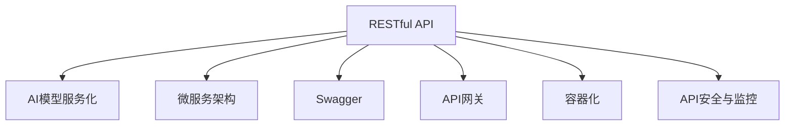

                 

# RESTful API设计：AI模型服务化的最佳实践

> 关键词：RESTful API, AI模型, 服务化, 微服务, Swagger, API网关, 容器化, 安全与监控, API设计原则

## 1. 背景介绍

### 1.1 问题由来
随着人工智能技术的不断进步，AI模型在各领域的应用日益广泛。从自然语言处理(NLP)、计算机视觉(CV)到推荐系统，AI模型已经成为许多应用的核心。然而，如何将AI模型高效、安全地融入到现有的业务架构中，仍然是一个挑战。服务化是现代企业架构的重要趋势，通过API设计实现AI模型的服务化，可以有效提升模型的可复用性和可用性，同时确保模型在不同环境下的稳定性。

### 1.2 问题核心关键点
本文聚焦于基于RESTful API设计的AI模型服务化方法，旨在通过简洁、易用的API接口，实现AI模型的标准化和模块化，使其可以方便地集成到各种业务场景中。本文将详细介绍RESTful API设计的核心概念、架构原则、操作步骤，并结合实际案例分析，展示AI模型服务化在具体项目中的应用。

### 1.3 问题研究意义
服务化是现代企业架构的重要趋势，通过API设计实现AI模型的服务化，可以有效提升模型的可复用性和可用性，同时确保模型在不同环境下的稳定性。RESTful API因其简单、灵活、易于理解的特点，成为AI模型服务化的首选架构风格。

本文通过深入剖析RESTful API设计的核心原理和操作步骤，结合实际案例分析，旨在帮助开发者更好地掌握API设计的技巧和方法，推动AI模型在更多场景中的落地应用。

## 2. 核心概念与联系

### 2.1 核心概念概述

为了更好地理解基于RESTful API的AI模型服务化方法，本节将介绍几个密切相关的核心概念：

- RESTful API：基于REST架构风格的API设计方法，通过标准化的HTTP请求和响应格式，实现资源的操作和查询。
- AI模型服务化：将AI模型封装成可调用的API服务，使其能够被不同的系统和业务场景调用，提升模型的可复用性和可用性。
- 微服务架构：将应用程序拆分成多个小型、自治的服务单元，每个服务单元可以独立部署、更新和扩展。
- Swagger：一种API文档工具，能够自动生成API文档，帮助开发者更好地理解和开发API。
- API网关：负责转发和管理多个微服务的请求，提供统一的接口，隐藏内部服务细节。
- 容器化：将应用和服务打包成容器，以便在不同的环境和平台上快速部署和扩展。
- API安全与监控：包括API请求的鉴权、授权、加密、日志等，确保API调用的安全性和可靠性。

这些核心概念之间的逻辑关系可以通过以下Mermaid流程图来展示：



这个流程图展示了两者的核心概念及其之间的关系：

1. RESTful API是AI模型服务化的重要工具，通过标准化的API设计，实现模型的调用和服务化。
2. 微服务架构支持API的设计和实现，通过服务拆分和组合，构建灵活、可扩展的系统。
3. Swagger提供API文档自动生成工具，帮助开发者更好地理解API接口。
4. API网关负责统一转发和管理请求，隐藏内部服务细节。
5. 容器化使得API服务能够快速部署和扩展。
6. API安全与监控确保API调用的安全和可靠性。

## 3. 核心算法原理 & 具体操作步骤

### 3.1 算法原理概述

基于RESTful API设计的AI模型服务化，本质上是一个将AI模型封装成Web服务的过程。其核心思想是：将AI模型封装成可调用的RESTful API接口，通过HTTP请求方式访问模型服务，实现模型的调用和服务化。

形式化地，假设AI模型为 $M$，则服务化的RESTful API $S$ 的输入为URL参数和请求体，输出为模型推理结果。即：

$$
S: URLParams \times RequestBody \rightarrow M: Outputs
$$

其中，URLParams表示API接口的URL参数，包括模型的输入数据、参数设置等；RequestBody表示API接口的请求体，包含模型输入的原始数据；Outputs表示模型推理的结果，包括预测结果、置信度、推理中间结果等。

### 3.2 算法步骤详解

基于RESTful API设计的AI模型服务化一般包括以下几个关键步骤：

**Step 1: 模型选择与优化**
- 选择合适的AI模型 $M$，如BERT、GPT等。
- 对模型进行优化和压缩，以便更高效地部署和调用。

**Step 2: 设计API接口**
- 定义API接口的URL格式，包括输入数据的格式、模型的参数设置等。
- 设计API接口的请求体和响应体格式，确保数据传递的准确性和高效性。

**Step 3: 实现API服务**
- 将优化后的模型 $M$ 部署成RESTful API服务。
- 使用HTTP框架（如Flask、FastAPI等）实现API接口的逻辑处理和调用。

**Step 4: 测试与部署**
- 对API服务进行单元测试和集成测试，确保服务的稳定性和可靠性。
- 将API服务部署到服务器或容器环境中，提供稳定的访问接口。

**Step 5: 监控与优化**
- 实时监控API服务的性能指标，如响应时间、吞吐量等。
- 根据监控结果优化API服务，提高其性能和稳定性。

### 3.3 算法优缺点

基于RESTful API设计的AI模型服务化方法具有以下优点：
1. 标准化、易用性强：RESTful API采用标准化的HTTP协议，易于理解和使用。
2. 灵活、可扩展：RESTful API可以方便地组合多个服务，构建灵活的系统。
3. 模块化、可复用：通过API接口，模型可以方便地集成到不同的业务场景中。
4. 可管理、可监控：API网关等工具能够提供统一的接口管理和监控，便于系统运维。

同时，该方法也存在一定的局限性：
1. 性能瓶颈：RESTful API采用HTTP协议，天然存在一定的性能瓶颈。
2. 网络延迟：RESTful API通过网络调用，存在一定的网络延迟。
3. 安全性问题：RESTful API的接口设计需要考虑安全性问题，防止恶意攻击和数据泄露。

尽管存在这些局限性，但就目前而言，基于RESTful API的AI模型服务化方法仍是大规模应用的首选。未来相关研究的重点在于如何进一步提升API接口的性能，确保系统的安全性和稳定性。

### 3.4 算法应用领域

基于RESTful API设计的AI模型服务化方法，已经在多个领域得到了广泛的应用，包括但不限于：

- 自然语言处理(NLP)：构建语音识别、机器翻译、情感分析等模型服务。
- 计算机视觉(CV)：构建图像识别、目标检测、人脸识别等模型服务。
- 推荐系统：构建个性化推荐、商品推荐等模型服务。
- 金融风控：构建信用评估、风险预测等模型服务。
- 医疗诊断：构建病理分析、诊断支持等模型服务。

## 4. 数学模型和公式 & 详细讲解 & 举例说明

### 4.1 数学模型构建

为了更好地理解RESTful API设计的核心原理，本节将通过数学语言对API接口的输入、输出和处理过程进行严格的刻画。

假设API接口的输入为 $\textit{inputs}$，输出为 $\textit{outputs}$，API服务的处理逻辑为 $\textit{process}$。则API服务的数学模型可以表示为：

$$
\textit{outputs} = \textit{process}(\textit{inputs})
$$

其中，$\textit{inputs}$ 可以是模型的输入数据、模型参数等；$\textit{outputs}$ 可以是模型的预测结果、置信度、中间结果等。

### 4.2 公式推导过程

以下我们以一个简单的分类任务为例，展示API接口的输入、输出和处理过程。

假设模型 $M$ 接收一个二分类问题的训练数据，输入为特征向量 $x$，输出为标签 $y$。则模型 $M$ 可以表示为：

$$
y = M(x)
$$

假设API接口的输入为 JSON 格式的特征向量，API接口的请求体格式为：

```json
{
    "features": [0.5, 0.3, 0.8]
}
```

API接口的响应体格式为：

```json
{
    "label": 1,
    "probability": 0.9
}
```

则API服务的处理逻辑可以表示为：

$$
\textit{outputs} = M(\textit{inputs})
$$

其中，$\textit{inputs}$ 为请求体中的特征向量，$\textit{outputs}$ 为响应体中的标签和置信度。

### 4.3 案例分析与讲解

假设我们要将一个基于BERT的情感分析模型服务化，实现API接口。API接口的URL格式为：

```
POST /classify/sentiment
```

API接口的请求体格式为：

```json
{
    "text": "I am very happy today."
}
```

API接口的响应体格式为：

```json
{
    "label": "positive",
    "probability": 0.95
}
```

假设我们使用Flask框架实现API服务，代码如下：

```python
from flask import Flask, request, jsonify
from transformers import BertForSequenceClassification, BertTokenizer

app = Flask(__name__)

model = BertForSequenceClassification.from_pretrained('bert-base-cased', num_labels=2)
tokenizer = BertTokenizer.from_pretrained('bert-base-cased')

@app.route('/classify/sentiment', methods=['POST'])
def classify_sentiment():
    data = request.json
    text = data['text']
    inputs = tokenizer(text, return_tensors='pt', padding=True, truncation=True, max_length=512)
    outputs = model(**inputs)
    label = outputs.logits.argmax().item()
    probability = outputs.logits[label].item()
    return jsonify({'label': label2str[label], 'probability': probability})

if __name__ == '__main__':
    app.run(host='0.0.0.0', port=5000)
```

该代码实现了API接口的逻辑处理和调用，其中：
- 使用Flask框架搭建API服务。
- 使用BERT模型进行情感分类。
- 将模型推理结果转化为JSON格式的响应体。

通过以上步骤，一个简单的情感分析API服务就构建完成了。开发者可以通过API接口，将任意文本进行情感分类，并获得分类的置信度。

## 5. 项目实践：代码实例和详细解释说明

### 5.1 开发环境搭建

在进行API服务实践前，我们需要准备好开发环境。以下是使用Python进行Flask开发的环境配置流程：

1. 安装Anaconda：从官网下载并安装Anaconda，用于创建独立的Python环境。

2. 创建并激活虚拟环境：
```bash
conda create -n flask-env python=3.8 
conda activate flask-env
```

3. 安装Flask：从官网下载并安装Flask，用于搭建RESTful API服务。

```bash
pip install flask
```

4. 安装transformers库：用于加载预训练的BERT模型。

```bash
pip install transformers
```

5. 安装各类工具包：
```bash
pip install numpy pandas scikit-learn matplotlib tqdm jupyter notebook ipython
```

完成上述步骤后，即可在`flask-env`环境中开始API服务开发。

### 5.2 源代码详细实现

下面我们以一个简单的二分类任务为例，展示如何使用Flask框架实现RESTful API服务。

首先，定义API接口的URL格式和请求体格式：

```python
from flask import Flask, request, jsonify

app = Flask(__name__)

@app.route('/classify/<model_name>', methods=['POST'])
def classify(model_name):
    data = request.json
    text = data['text']
    inputs = tokenizer(text, return_tensors='pt', padding=True, truncation=True, max_length=512)
    outputs = model(**inputs)
    label = outputs.logits.argmax().item()
    probability = outputs.logits[label].item()
    return jsonify({'label': label2str[label], 'probability': probability})
```

然后，定义模型加载和处理逻辑：

```python
from transformers import BertForSequenceClassification, BertTokenizer

model = BertForSequenceClassification.from_pretrained('bert-base-cased', num_labels=2)
tokenizer = BertTokenizer.from_pretrained('bert-base-cased')
label2str = {0: 'negative', 1: 'positive'}
```

最后，启动API服务：

```python
if __name__ == '__main__':
    app.run(host='0.0.0.0', port=5000)
```

以上代码实现了基于Flask的RESTful API服务，用户可以通过HTTP POST请求，输入文本数据，获得情感分类的标签和置信度。

### 5.3 代码解读与分析

让我们再详细解读一下关键代码的实现细节：

**Flask框架**：
- `Flask` 框架用于搭建RESTful API服务，支持多种HTTP请求方法。
- `@app.route` 装饰器用于定义API接口的URL格式和请求体格式。

**模型加载和处理逻辑**：
- 使用 `BertForSequenceClassification` 加载预训练的BERT模型。
- 使用 `BertTokenizer` 对输入文本进行分词和编码。
- 使用模型推理出标签和置信度，并将结果转化为JSON格式的响应体。

**API服务启动**：
- 使用 `app.run` 方法启动Flask服务，指定服务的主机和端口。

通过以上步骤，一个简单的情感分析API服务就构建完成了。开发者可以通过API接口，将任意文本进行情感分类，并获得分类的置信度。

## 6. 实际应用场景

### 6.1 智能客服系统

基于RESTful API设计的智能客服系统，可以广泛应用于企业的客户服务领域。通过API接口，系统能够快速响应客户的咨询，提供实时、准确的回复，提升客户满意度。

在技术实现上，可以收集企业内部的历史客服对话记录，构建API接口，实现自动回复和人工干预的结合。微调后的模型可以识别客户意图，匹配最合适的答案模板，生成回复。对于客户提出的新问题，系统可以实时搜索相关内容，动态组织生成回复。如此构建的智能客服系统，能够大幅提升客户咨询体验和问题解决效率。

### 6.2 金融风控

基于RESTful API设计的金融风控系统，可以帮助金融机构实时监控市场动态，预测风险，规避金融风险。

系统可以实时抓取网络上的金融新闻、评论等信息，通过API接口调用，进行情感分析和舆情监测。模型能够自动识别金融舆情中的负面信息，实时预警，帮助金融机构快速应对潜在风险。

### 6.3 推荐系统

基于RESTful API设计的推荐系统，可以根据用户的历史行为数据，生成个性化推荐结果，提升用户的购物体验。

系统可以通过API接口调用模型，对用户浏览、点击、分享等行为数据进行分析和建模，生成个性化的推荐列表。同时，系统还可以根据用户的反馈和行为变化，动态调整推荐策略，提升推荐的准确性和多样性。

### 6.4 未来应用展望

随着RESTful API和微服务架构的不断发展，基于AI模型服务化的应用将越来越广泛。未来，AI模型服务化技术将深入融合到各个行业领域，推动智能技术在更多场景中的应用。

在智慧医疗领域，基于RESTful API设计的AI模型可以辅助医生进行病理分析和诊断，提升医疗服务的智能化水平。

在智能教育领域，推荐系统API接口可以提供个性化的学习资源推荐，因材施教，促进教育公平。

在智慧城市治理中，基于API接口的智能服务可以提升城市管理的自动化和智能化水平，构建更安全、高效的未来城市。

## 7. 工具和资源推荐

### 7.1 学习资源推荐

为了帮助开发者掌握RESTful API设计的技巧和方法，这里推荐一些优质的学习资源：

1. 《RESTful API设计规范》系列博文：详细讲解RESTful API设计的核心概念和最佳实践。
2. CS224N《深度学习自然语言处理》课程：斯坦福大学开设的NLP明星课程，涵盖RESTful API设计的相关内容。
3. 《RESTful API设计与实现》书籍：全面介绍RESTful API设计的原理和实现方法，适合入门和进阶阅读。
4. Swagger官方文档：提供API文档自动生成工具，帮助开发者更好地理解和开发API。
5. SwaggerHub：一个开源的API管理平台，提供API开发、测试、部署和监控等功能，适合团队协作开发。

通过对这些资源的学习实践，相信你一定能够快速掌握RESTful API设计的精髓，并用于解决实际的API开发问题。

### 7.2 开发工具推荐

高效的API开发离不开优秀的工具支持。以下是几款用于RESTful API开发的常用工具：

1. Flask：基于Python的开源Web框架，简单易用，适合快速迭代研究。
2. FastAPI：基于Python的开源Web框架，支持异步编程，适用于高并发场景。
3. Swagger：提供API文档自动生成工具，帮助开发者更好地理解和开发API。
4. Postman：一款功能强大的API测试工具，支持自动化测试和断言，适合API调试和测试。
5. Insomnia：一款基于Web的API开发工具，提供API设计和测试的可视化界面，易于上手。

合理利用这些工具，可以显著提升RESTful API开发的效率，加快创新迭代的步伐。

### 7.3 相关论文推荐

RESTful API设计和微服务架构的发展源于学界的持续研究。以下是几篇奠基性的相关论文，推荐阅读：

1. REST架构风格：定义了REST的基本原则和核心概念，成为RESTful API设计的基础。
2. RESTful Web服务的架构和演化：详细讨论了REST架构风格的演变和最佳实践，为RESTful API设计提供了理论支持。
3. RESTful API设计规范：提供了一套详细的RESTful API设计规范，帮助开发者构建符合标准的API服务。
4. Microservices Architecture for Smart Cities：提出基于微服务的智慧城市架构，探讨了RESTful API在智慧城市中的应用。
5. A Survey on RESTful APIs: Architecture, Protocol, and Privacy：全面综述了RESTful API的设计、实现和安全性问题，为RESTful API开发提供了参考。

这些论文代表了大规模应用中的研究进展和经验积累，通过学习这些前沿成果，可以帮助研究者更好地理解RESTful API设计和微服务架构的实践和挑战。

## 8. 总结：未来发展趋势与挑战

### 8.1 总结

本文对基于RESTful API设计的AI模型服务化方法进行了全面系统的介绍。首先阐述了RESTful API设计和AI模型服务化的研究背景和意义，明确了服务化在提升模型可复用性和可用性方面的独特价值。其次，从原理到实践，详细讲解了RESTful API设计的核心概念和操作步骤，给出了API服务开发的完整代码实例。同时，本文还广泛探讨了RESTful API设计在智能客服、金融风控、推荐系统等多个行业领域的应用前景，展示了RESTful API设计的巨大潜力。

通过本文的系统梳理，可以看到，基于RESTful API设计的AI模型服务化技术正在成为AI模型落地应用的重要范式，极大地提升了模型的可复用性和可用性，推动了AI模型在更多场景中的落地应用。

### 8.2 未来发展趋势

展望未来，RESTful API设计和AI模型服务化技术将呈现以下几个发展趋势：

1. 服务化与容器化结合：通过容器化技术，可以实现API服务的快速部署和扩展，提升系统的可用性和可靠性。
2. 微服务与API网关结合：通过API网关，可以统一管理和调度多个微服务，提供统一的API接口，简化系统管理。
3. 服务化与自动化结合：通过自动化工具，如Helm、Kubernetes等，可以实现API服务的自动化部署和运维，提高开发效率。
4. API接口的标准化和规范化：通过统一API接口的规范和标准，可以提升API服务的可互操作性和可复用性。
5. API接口的安全性和隐私保护：通过加密、鉴权、审计等技术，提升API服务的安全性，保护用户隐私。

以上趋势凸显了RESTful API设计和AI模型服务化技术的广阔前景。这些方向的探索发展，必将进一步提升API服务的性能和可用性，推动AI模型在更多场景中的落地应用。

### 8.3 面临的挑战

尽管RESTful API设计和AI模型服务化技术已经取得了瞩目成就，但在迈向更加智能化、普适化应用的过程中，它仍面临着诸多挑战：

1. 性能瓶颈：RESTful API采用HTTP协议，天然存在一定的性能瓶颈。
2. 网络延迟：RESTful API通过网络调用，存在一定的网络延迟。
3. 安全性问题：RESTful API的接口设计需要考虑安全性问题，防止恶意攻击和数据泄露。
4. 接口标准化：不同系统和服务之间的API接口需要标准化，提高系统互操作性。
5. 接口复杂度：复杂的API接口设计会增加系统的维护成本和开发难度。

尽管存在这些挑战，但通过不断优化和改进，RESTful API设计和AI模型服务化技术仍然具有广阔的发展前景。

### 8.4 研究展望

面对RESTful API设计和AI模型服务化技术面临的挑战，未来的研究需要在以下几个方面寻求新的突破：

1. 探索更高效的API接口设计：通过API接口优化和设计，提高API调用的性能和稳定性。
2. 研究更安全、更可靠的服务化方法：通过加密、鉴权、审计等技术，提升API服务的安全性，保护用户隐私。
3. 融合微服务架构与API网关：通过API网关，实现多个微服务的统一管理和调度，提升系统的可用性和可靠性。
4. 结合自动化工具和持续集成：通过自动化工具，实现API服务的快速部署和运维，提高开发效率。
5. 推进API接口的标准化和规范化：通过统一API接口的规范和标准，提升API服务的可互操作性和可复用性。

这些研究方向将进一步推动RESTful API设计和AI模型服务化技术的进步，提升系统的性能、可用性和安全性，推动AI模型在更多场景中的应用。

## 9. 附录：常见问题与解答

**Q1：RESTful API设计和AI模型服务化有什么区别？**

A: RESTful API设计是一种架构风格，用于构建标准化的API接口；AI模型服务化是将AI模型封装成可调用的API服务，使其能够被不同的系统和业务场景调用。两者密切相关，但前者更关注接口的规范化，后者更关注模型的服务化。

**Q2：RESTful API接口如何设计？**

A: 设计RESTful API接口时，需要考虑接口的URL格式、请求体格式和响应体格式。API接口的URL格式需要简洁、易用，方便用户理解和使用。请求体格式需要符合标准的JSON或XML格式，便于数据的传递和处理。响应体格式也需要标准化，便于客户端解析和处理。

**Q3：如何提高RESTful API调用的性能？**

A: 提高RESTful API调用的性能，可以通过以下几种方式：
1. 采用异步编程：使用FastAPI等支持异步编程的框架，提高API调用的并发能力。
2. 缓存响应数据：使用缓存技术，减少重复请求，提高API调用的响应速度。
3. 压缩响应数据：使用数据压缩技术，减少数据传输量，提高API调用的传输效率。

**Q4：如何保证RESTful API调用的安全性？**

A: 保证RESTful API调用的安全性，可以通过以下几种方式：
1. 鉴权机制：使用鉴权技术，如JWT、OAuth等，验证API调用的合法性。
2. 加密机制：使用SSL/TLS等加密技术，保护数据传输的安全性。
3. 审计日志：记录API调用的日志信息，便于异常排查和问题定位。

**Q5：如何提高RESTful API接口的可维护性？**

A: 提高RESTful API接口的可维护性，可以通过以下几种方式：
1. 接口规范化：制定接口的标准和规范，便于接口的设计和维护。
2. 模块化设计：将API接口分解成多个模块，便于接口的扩展和维护。
3. 自动化测试：使用自动化测试工具，提高接口的测试覆盖率和准确性。

这些常见问题的解答，能够帮助开发者更好地理解RESTful API设计和AI模型服务化的核心概念和技术细节，推动API接口的设计和优化，提升系统的性能、可用性和安全性。

---

作者：禅与计算机程序设计艺术 / Zen and the Art of Computer Programming

