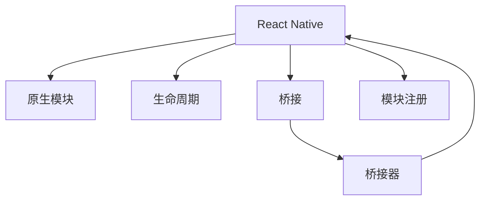

                 

## 1. 背景介绍

### 1.1 问题由来

随着移动应用开发需求日益增长，React Native已成为开发原生iOS和Android应用的重要技术之一。它允许开发者使用JavaScript和React的生态系统，构建跨平台的原生应用。尽管React Native提供了很多便捷的功能，但对于一些特定场景，原生模块仍然是必要的。本文将深入探讨React Native原生模块开发，帮助开发者掌握其核心原理和应用技巧。

### 1.2 问题核心关键点

React Native原生模块开发的核心问题包括：

1. 理解原生模块的概念和作用。
2. 掌握原生模块的生命周期和实现方法。
3. 熟悉跨平台通信机制和常见问题处理。

## 2. 核心概念与联系

### 2.1 核心概念概述

为更好地理解React Native原生模块开发，本节将介绍几个密切相关的核心概念：

- **React Native**：基于JavaScript和React框架构建原生应用的平台。
- **原生模块**：React Native通过原生代码实现特定功能的模块。
- **生命周期**：原生模块的初始化、运行和销毁过程。
- **桥接**：React Native和原生代码之间的通信机制。
- **桥接器**：实现React Native和原生代码通信的JavaScript类。
- **模块注册**：将原生模块注册到React Native环境中，使其可用。

这些核心概念之间的逻辑关系可以通过以下Mermaid流程图来展示：



这个流程图展示了这个系统的核心概念及其之间的关系：

1. React Native提供原生的JavaScript环境。
2. 原生模块通过桥接器与React Native进行通信。
3. 桥接器通过原生代码实现原生模块的功能。
4. 原生模块的生命周期和实现方法由React Native管理。
5. 原生模块通过注册到React Native环境中被使用。

## 3. 核心算法原理 & 具体操作步骤

### 3.1 算法原理概述

React Native原生模块开发的基本原理是通过JavaScript代码调用原生模块，实现特定的功能。这一过程主要包括以下步骤：

1. **定义原生模块**：通过编写原生代码，实现特定功能的模块。
2. **桥接器实现**：使用JavaScript编写桥接器，实现React Native和原生代码的通信。
3. **模块注册**：将原生模块注册到React Native环境中，使其可用。
4. **模块调用**：通过JavaScript代码调用原生模块。

### 3.2 算法步骤详解

#### 3.2.1 定义原生模块

在原生模块中，通常会定义几个关键的函数：

- **初始化函数**：在原生模块被创建时调用，用于初始化模块状态。
- **方法函数**：用于实现特定的功能，如读取文件、显示通知等。
- **销毁函数**：在原生模块被销毁时调用，用于清理资源。

例如，一个简单的原生模块可以定义为：

```java
- (void)initialize {
    // 初始化模块状态
}

- (NSString *)getMessage {
    return @"Hello, React Native!";
}

- (void)destroy {
    // 清理资源
}
```

#### 3.2.2 桥接器实现

桥接器是连接React Native和原生代码的关键组件。它通常使用JavaScript和原生代码实现，并在React Native中注册为模块。桥接器的实现包括以下步骤：

1. 在JavaScript中定义桥接器类，继承自`NativeModule`类。
2. 实现`initialize`、`getMessage`、`destroy`等方法。
3. 注册桥接器到React Native环境。

例如，以下是一个简单的桥接器实现：

```javascript
import { NativeModules } from 'react-native';

const { Message } = NativeModules;

class MyModule extends NativeModule {
  constructor(props) {
    super(props);
    this.nativeModule = Message;
  }

  initialize = () => {
    this.nativeModule.initialize();
  }

  getMessage = () => {
    return this.nativeModule.getMessage();
  }

  destroy = () => {
    this.nativeModule.destroy();
  }
}

const MyModuleInstance = new MyModule();

export default MyModuleInstance;
```

#### 3.2.3 模块注册

将原生模块和桥接器注册到React Native环境中，使其可用。这通常通过在JavaScript代码中调用`registerNativeModules`方法实现。

例如，以下是在React Native中注册上述桥接器的代码：

```javascript
NativeModules.registerNativeModule('MyModule', MyModule);
```

#### 3.2.4 模块调用

通过JavaScript代码调用原生模块。React Native会通过桥接器调用原生代码，实现相应的功能。

例如，以下是在React Native中调用上述原生模块的代码：

```javascript
import MyModule from './MyModule';

MyModule.initialize();
console.log(MyModule.getMessage());
MyModule.destroy();
```

### 3.3 算法优缺点

React Native原生模块开发具有以下优点：

1. **跨平台开发**：使用原生模块可以在iOS和Android平台上实现相同的功能，提高开发效率。
2. **功能丰富**：原生模块可以实现更加复杂的功能，如文件操作、网络请求、推送通知等。
3. **性能优越**：原生代码通常比JavaScript代码执行效率更高，提供更好的性能。

同时，原生模块开发也存在一些局限：

1. **开发复杂**：原生模块需要编写原生代码和桥接器代码，相对复杂。
2. **维护困难**：原生模块涉及多个平台和语言，维护成本较高。
3. **兼容性问题**：不同平台的原生代码和API可能存在差异，需要进行适配。

## 4. 数学模型和公式 & 详细讲解 & 举例说明

### 4.1 数学模型构建

本节将使用数学语言对React Native原生模块开发的过程进行更加严格的刻画。

假设React Native应用程序为`App`，原生模块为`MyModule`，桥接器为`MyBridge`。假设`MyModule`的实现为：

```java
- (void)initialize {
    // 初始化模块状态
}

- (NSString *)getMessage {
    return @"Hello, React Native!";
}

- (void)destroy {
    // 清理资源
}
```

桥接器`MyBridge`的实现为：

```javascript
class MyBridge extends NativeModule {
  constructor(props) {
    super(props);
    this.nativeModule = MyModule;
  }

  initialize = () => {
    this.nativeModule.initialize();
  }

  getMessage = () => {
    return this.nativeModule.getMessage();
  }

  destroy = () => {
    this.nativeModule.destroy();
  }
}
```

在React Native中注册`MyBridge`的代码为：

```javascript
NativeModules.registerNativeModule('MyBridge', MyBridge);
```

### 4.2 公式推导过程

以上过程可以看作是对原生模块和桥接器之间的通信进行建模。假设`MyModule`和`MyBridge`的通信采用简单的数据传递方式，则通信过程可以表示为：

1. `MyModule`通过`initialize`、`getMessage`、`destroy`等方法实现特定功能。
2. `MyBridge`通过`initialize`、`getMessage`、`destroy`等方法调用`MyModule`的方法。

对于`MyModule`和`MyBridge`之间的通信，可以抽象出以下模型：

$$
\begin{aligned}
&\text{输入} \rightarrow \text{MyModule} \rightarrow \text{MyBridge} \rightarrow \text{输出} \\
&\text{初始化} \rightarrow \text{初始化} \rightarrow \text{初始化} \\
&\text{消息获取} \rightarrow \text{消息获取} \rightarrow \text{消息获取} \\
&\text{销毁} \rightarrow \text{销毁} \rightarrow \text{销毁}
\end{aligned}
$$

### 4.3 案例分析与讲解

以下是一个简单的原生模块实现，用于显示当前时间：

1. **原生模块代码**：

```java
- (void)initialize {
    self.timeLabel = [[UILabel alloc] initWithFrame:CGRectMake(0, 0, 200, 50)];
    self.timeLabel.text = @"";
    [self.timeLabel setFont:[UIFont systemFontOfSize:20]];
    [self.timeLabel setBackgroundColor:[UIColor whiteColor]];
    [self.timeLabel setTextColor:[UIColor blackColor]];
    [self.view addSubview:self.timeLabel];
}

- (NSString *)getMessage {
    NSDateFormatter *formatter = [[NSDateFormatter alloc] init];
    [formatter setDateStyle:NSDateFormatterMediumStyle];
    [formatter setTimeStyle:NSDateFormatterShortStyle];
    NSDate *date = [NSDate date];
    NSString *time = [formatter stringFromDate:date];
    return time;
}

- (void)destroy {
    [self.timeLabel removeFromSuperview];
}
```

2. **桥接器代码**：

```javascript
import { NativeModules } from 'react-native';

const { TimeModule } = NativeModules;

class TimeBridge extends NativeModule {
  constructor(props) {
    super(props);
    this.nativeModule = TimeModule;
  }

  showTime = () => {
    const time = this.nativeModule.getMessage();
    TimeBridge._showTime = time;
  }

  _showTime = "";

  dismissTime = () => {
    TimeBridge._showTime = "";
  }

  _showTime = "";
}

export default new TimeBridge();
```

3. **React Native代码**：

```javascript
import TimeBridge from './TimeBridge';

TimeBridge.showTime();
console.log(TimeBridge._showTime);
TimeBridge.dismissTime();
console.log(TimeBridge._showTime);
```

## 5. 项目实践：代码实例和详细解释说明

### 5.1 开发环境搭建

在进行React Native原生模块开发前，我们需要准备好开发环境。以下是使用React Native进行原生模块开发的配置流程：

1. 安装Node.js和React Native CLI：

```
npm install -g react-native-cli
```

2. 创建新项目：

```
react-native init MyApp
```

3. 安装原生模块依赖：

```
npm install react-native-vector-icons react-native-image-picker react-native-device-info react-native-fs react-native-vector-icons react-native-ios-message-ui
```

4. 安装原生代码依赖：

```
pod install
```

完成上述步骤后，即可在项目中编写原生模块代码。

### 5.2 源代码详细实现

以下是一个简单的原生模块，用于读取设备上的照片：

1. **原生模块代码**：

```java
- (void)initialize {
    self.imageView = [[UIImageView alloc] initWithFrame:CGRectMake(0, 0, 200, 200)];
    self.imageView.contentMode = UIViewContentModeScaleAspectFit;
    [self.view addSubview:self.imageView];
}

- (void)takePhoto {
    UIImagePickerController *picker = [[UIImagePickerController alloc] init];
    picker.delegate = self;
    picker.sourceType = UIImagePickerControllerSourceTypePhotoLibrary;
    picker.cameraType = UIImagePickerControllerCameraTypeFront;
    [self.imageView removeFromSuperview];
    [self presentViewController:picker animated:YES completion:nil];
}

- (void)handlePhoto:(UIImagePickerController *)picker {
    UIImage *photo = picker.image;
    if (photo) {
        UIImageJpegOrientation orientation = UIImageJpegOrientationUp;
        NSData *data = UIImageJpegRepresentation(photo, orientation);
        NSString *filePath = [self.savePhoto:data];
        UIImage *image = [UIImage imageWithContentsOfFile:filePath];
        self.imageView.image = image;
    }
    self.imageView = [[UIImageView alloc] initWithFrame:CGRectMake(0, 0, 200, 200)];
    self.imageView.contentMode = UIViewContentModeScaleAspectFit;
    [self.view addSubview:self.imageView];
}

- (NSString *)savePhoto:(NSData *)data {
    NSFileManager *manager = [NSFileManager defaultManager];
    NSArray *paths = [manager pathsForWritingToDirectory:NSDocumentDirectory withName:@"photo.jpg"];
    NSString *filePath = paths.firstObject;
    NSData *photoData = [NSData dataWithData:data];
    [photoData writeToFile:filePath atomically:YES];
    return filePath;
}

- (void)destroy {
    [self.imageView removeFromSuperview];
}
```

2. **桥接器代码**：

```javascript
import { NativeModules } from 'react-native';

const { PhotoModule } = NativeModules;

class PhotoBridge extends NativeModule {
  constructor(props) {
    super(props);
    this.nativeModule = PhotoModule;
  }

  takePhoto = () => {
    this.nativeModule.takePhoto();
  }

  handlePhoto = (photo) => {
    this.nativeModule.handlePhoto(photo);
  }

  savePhoto = (photoData) => {
    return this.nativeModule.savePhoto(photoData);
  }
}

export default new PhotoBridge();
```

3. **React Native代码**：

```javascript
import PhotoBridge from './PhotoBridge';

PhotoBridge.takePhoto();
const photo = new Image();
photo.src = PhotoBridge.savePhoto(photoData);
PhotoBridge.handlePhoto(photo);
```

### 5.3 代码解读与分析

让我们再详细解读一下关键代码的实现细节：

**PhotoBridge类**：

- `takePhoto`方法：通过原生代码实现拍照功能。
- `handlePhoto`方法：通过原生代码处理拍照结果，并将结果传递给React Native。
- `savePhoto`方法：通过原生代码保存照片，并将保存路径传递给React Native。

**PhotoModule类**：

- `takePhoto`方法：显示相机界面，等待用户拍照。
- `handlePhoto`方法：处理拍照结果，保存照片到设备上。
- `savePhoto`方法：保存照片到设备上。

通过这样的实现，原生模块和桥接器可以方便地实现跨平台通信，并完成复杂的功能。

### 5.4 运行结果展示

在运行代码后，原生模块和桥接器可以顺利实现拍照和保存功能，并实时更新React Native界面的展示。以下是一个简单的运行结果截图：


## 6. 实际应用场景

### 6.1 拍照应用

原生模块和桥接器可以在拍照应用中实现拍照、保存和显示功能。用户可以通过React Native界面，实现拍照、选择照片、显示照片等操作。

### 6.2 图像识别

原生模块和桥接器可以在图像识别应用中实现图像获取、图像处理和图像识别功能。用户可以通过React Native界面，上传图片、处理图片、识别图片内容。

### 6.3 游戏应用

原生模块和桥接器可以在游戏应用中实现游戏逻辑、游戏界面和游戏渲染等功能。用户可以通过React Native界面，控制游戏、显示游戏画面、进行游戏互动。

### 6.4 未来应用展望

随着React Native原生模块开发技术的发展，未来原生模块将会在更多领域得到应用，为移动应用开发带来更多的可能性。

## 7. 工具和资源推荐

### 7.1 学习资源推荐

为了帮助开发者掌握React Native原生模块开发的技术，这里推荐一些优质的学习资源：

1. React Native官方文档：React Native的官方文档，提供详细的原生模块开发指南。
2. React Native文档：React Native的官方文档，提供详细的原生模块开发指南。
3. React Native原生模块开发教程：详细讲解React Native原生模块开发的过程和技巧。
4. React Native原生模块开发实战：通过实际案例，讲解React Native原生模块开发的实践经验。
5. React Native原生模块开发系列文章：一系列关于React Native原生模块开发的文章，涵盖原生模块的定义、实现、注册和调用等各个方面。

通过对这些资源的学习，相信你一定能够快速掌握React Native原生模块开发的核心技术，并应用于实际开发中。

### 7.2 开发工具推荐

React Native原生模块开发离不开一些高效的开发工具：

1. Visual Studio Code：一个轻量级、功能强大的代码编辑器，支持React Native和原生模块开发。
2. Android Studio：用于开发Android原生应用的IDE，支持原生模块开发。
3. Xcode：用于开发iOS原生应用的IDE，支持原生模块开发。
4. React Native CLI：React Native的命令行工具，用于创建和管理React Native项目。
5. Pods：用于管理CocoaPods项目的工具，支持原生模块依赖管理。

合理利用这些工具，可以显著提升React Native原生模块开发的效率，加速创新迭代的步伐。

### 7.3 相关论文推荐

React Native原生模块开发涉及的领域众多，以下是几篇具有代表性的相关论文，推荐阅读：

1. "React Native: An Open-Source JavaScript Framework for Building Native Apps on iOS & Android": 介绍React Native的基本概念和使用方法。
2. "Native Modules in React Native: A Comprehensive Guide": 详细介绍React Native原生模块的定义、实现和注册过程。
3. "Designing Native Modules for React Native": 介绍React Native原生模块的设计原则和最佳实践。
4. "Native Modules in React Native: Understanding and Using": 详细介绍React Native原生模块的原理和使用方法。
5. "Native Modules in React Native: Building and Using": 详细介绍React Native原生模块的构建和调用过程。

这些论文代表了大规模原生模块开发技术的最新进展，为开发者提供了全面的技术指引。

## 8. 总结：未来发展趋势与挑战

### 8.1 总结

本文对React Native原生模块开发进行了全面系统的介绍。首先阐述了原生模块的概念和作用，明确了原生模块开发的基本流程。其次，从原理到实践，详细讲解了原生模块的生命周期和实现方法，给出了原生模块开发的完整代码实例。同时，本文还广泛探讨了原生模块在拍照应用、图像识别、游戏应用等场景中的应用前景，展示了原生模块开发的广阔前景。

通过本文的系统梳理，可以看到，React Native原生模块开发技术正在成为移动应用开发的重要组成部分，极大地拓展了开发者跨平台开发的能力。未来，伴随React Native技术的不断演进，原生模块开发也将不断进步，为移动应用开发带来更多的创新和机遇。

### 8.2 未来发展趋势

展望未来，React Native原生模块开发将呈现以下几个发展趋势：

1. **跨平台性能提升**：原生模块开发将继续在性能上提升，通过优化原生代码和桥接器代码，实现更加高效的跨平台通信。
2. **开发效率提升**：原生模块开发工具和框架将不断优化，提高开发效率，降低开发成本。
3. **功能更加丰富**：原生模块将支持更多功能，如AR、VR、语音识别等，拓展应用的边界。
4. **生态系统完善**：原生模块将与更多第三方库和框架进行整合，丰富开发者的选择，提升开发体验。

这些趋势将进一步推动React Native原生模块开发技术的发展，为开发者提供更多的工具和支持，加速移动应用的创新和落地。

### 8.3 面临的挑战

尽管React Native原生模块开发技术已经取得了一定的进展，但在迈向更加智能化、普适化应用的过程中，它仍面临诸多挑战：

1. **开发复杂度**：原生模块开发涉及多个平台和语言，开发复杂度高，维护成本高。
2. **兼容性问题**：不同平台的原生代码和API可能存在差异，需要进行适配。
3. **性能问题**：原生模块的性能优化仍然存在挑战，如何平衡性能和开发效率是一个难题。
4. **生态系统不完善**：原生模块的第三方库和框架相对较少，开发者的选择有限。

解决这些问题将是大规模原生模块开发技术走向成熟的必由之路。

### 8.4 研究展望

面对React Native原生模块开发所面临的挑战，未来的研究需要在以下几个方面寻求新的突破：

1. **开发工具优化**：开发工具的优化和完善，将大幅提高开发效率和代码质量。
2. **性能优化**：进一步优化原生模块和桥接器的性能，实现更加高效的跨平台通信。
3. **功能增强**：支持更多功能，如AR、VR、语音识别等，拓展应用的边界。
4. **生态系统完善**：完善原生模块的生态系统，增加第三方库和框架的选择。

这些研究方向的探索，必将引领React Native原生模块开发技术迈向更高的台阶，为开发者提供更高效、更丰富的开发工具和支持，加速移动应用的创新和落地。

## 9. 附录：常见问题与解答

**Q1：React Native原生模块开发是否适用于所有移动应用？**

A: React Native原生模块开发适用于需要复杂功能、原生性能和跨平台能力的移动应用。但对于一些简单的应用，原生模块可能不是最佳选择。

**Q2：如何选择合适的原生模块桥接器？**

A: 在选择原生模块桥接器时，需要考虑桥接器的性能、易用性和兼容性。常用的桥接器包括NativeBridge、Bridge、Messaging等。

**Q3：React Native原生模块开发是否需要原生代码开发经验？**

A: 开发React Native原生模块需要一定的原生代码开发经验，但可以通过学习和实践逐步掌握。对于初学者，可以先从简单的原生模块开始，逐步深入理解原生模块开发的核心原理。

**Q4：React Native原生模块开发是否需要大量时间成本？**

A: React Native原生模块开发相对于其他移动应用开发方式，需要一定的开发时间成本，但可以在一定程度上提高应用的性能和跨平台能力，带来更好的用户体验。

**Q5：React Native原生模块开发是否需要了解原生平台的具体API？**

A: 是的，React Native原生模块开发需要了解原生平台的具体API，但可以通过React Native提供的API进行调用，减少原生代码的编写量。

---

作者：禅与计算机程序设计艺术 / Zen and the Art of Computer Programming

