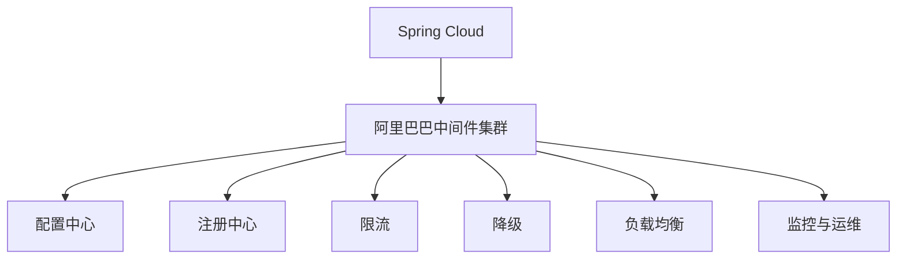

                 

# Spring Cloud Alibaba实践

> 关键词：Spring Cloud、阿里巴巴中间件、服务治理、分布式系统、微服务、服务降级、限流、负载均衡、注册中心、配置中心、API网关、分布式事务、监控与运维

## 1. 背景介绍

### 1.1 问题由来

随着互联网的迅猛发展，微服务架构已经成为了企业构建大型分布式系统的首选架构。微服务架构通过将单体应用拆分为多个独立的小型服务，大大提高了系统的灵活性、可维护性和可扩展性。但是，随着微服务数量的增加，系统的复杂度也在不断提升，这给系统的管理和运维带来了巨大挑战。为了应对这些挑战，阿里巴巴提出了Spring Cloud Alibaba，这是一个基于Spring Cloud的阿里巴巴中间件集群，提供了丰富的功能来支持企业构建和运维大型微服务系统。

### 1.2 问题核心关键点

阿里巴巴中间件集群的核心关键点包括：

- **服务治理**：提供了配置中心、注册中心、服务发现等功能，帮助服务快速定位和调用。
- **分布式系统**：包括限流、降级、负载均衡等功能，确保系统的稳定性和可靠性。
- **微服务架构**：支持微服务的构建和管理，提供丰富的插件和扩展，满足不同的业务需求。
- **监控与运维**：提供了监控、告警、日志等工具，帮助系统管理员快速定位问题。

这些关键点构成了阿里巴巴中间件集群的骨架，使得微服务系统更容易构建、管理和运维。

### 1.3 问题研究意义

阿里巴巴中间件集群对微服务架构的实践，具有重要的研究意义：

- 提高了系统的可扩展性和可维护性，使得系统能够快速适应业务变化。
- 提供了丰富的功能支持，帮助企业构建高质量的微服务系统。
- 推动了微服务架构在企业中的应用，促进了微服务技术的普及。
- 提供了丰富的文档和社区支持，帮助企业快速上手。

## 2. 核心概念与联系

### 2.1 核心概念概述

阿里巴巴中间件集群的组成包括：

- **Spring Cloud**：基于Spring Boot的企业级微服务框架。
- **阿里巴巴中间件集群**：包括注册中心、配置中心、限流、降级、负载均衡、监控与运维等功能，支持Spring Cloud的应用。

阿里巴巴中间件集群的核心概念包括：

- **服务治理**：通过配置中心、注册中心、服务发现等功能，帮助服务快速定位和调用。
- **分布式系统**：包括限流、降级、负载均衡等功能，确保系统的稳定性和可靠性。
- **微服务架构**：支持微服务的构建和管理，提供丰富的插件和扩展，满足不同的业务需求。
- **监控与运维**：提供了监控、告警、日志等工具，帮助系统管理员快速定位问题。

这些核心概念之间的逻辑关系可以通过以下Mermaid流程图来展示：



这个流程图展示了大规模微服务系统构建的关键组件：

1. 基于Spring Cloud的微服务框架，提供了灵活的开发和部署支持。
2. 阿里巴巴中间件集群，提供了丰富的功能支持，使得微服务系统更容易构建和管理。
3. 配置中心、注册中心、限流、降级、负载均衡、监控与运维等功能，提供了完整的微服务系统支持。

## 3. 核心算法原理 & 具体操作步骤

### 3.1 算法原理概述

阿里巴巴中间件集群的核心算法原理主要包括以下几个方面：

- **服务治理**：通过配置中心、注册中心、服务发现等功能，实现服务的快速定位和调用。
- **分布式系统**：通过限流、降级、负载均衡等功能，确保系统的稳定性和可靠性。
- **微服务架构**：通过丰富的插件和扩展，支持微服务的构建和管理。
- **监控与运维**：通过监控、告警、日志等工具，帮助系统管理员快速定位问题。

这些算法的核心在于通过中心化的管理，提供统一的接口和标准，从而实现系统的可扩展性和可维护性。

### 3.2 算法步骤详解

阿里巴巴中间件集群的算法步骤主要包括以下几个方面：

**Step 1: 准备环境**
- 安装Spring Cloud和阿里巴巴中间件集群依赖包。
- 创建应用程序并添加阿里巴巴中间件集群的依赖。

**Step 2: 配置中心**
- 配置配置中心地址和数据源。
- 开启Eureka服务并配置服务。

**Step 3: 注册中心**
- 配置注册中心地址和数据源。
- 配置服务地址和端口。

**Step 4: 限流**
- 配置限流规则和阈值。
- 开启限流服务并配置服务。

**Step 5: 降级**
- 配置降级规则和降级策略。
- 开启降级服务并配置服务。

**Step 6: 负载均衡**
- 配置负载均衡规则和策略。
- 开启负载均衡服务并配置服务。

**Step 7: 监控与运维**
- 配置监控和告警工具。
- 开启监控服务并配置服务。

完成上述步骤后，即可构建和运维一个完整的微服务系统。

### 3.3 算法优缺点

阿里巴巴中间件集群具有以下优点：

1. **灵活性**：提供了丰富的插件和扩展，可以满足不同的业务需求。
2. **可扩展性**：通过中心化的管理，提高了系统的可扩展性和可维护性。
3. **稳定性**：通过限流、降级、负载均衡等功能，确保系统的稳定性和可靠性。
4. **易用性**：提供了完善的文档和社区支持，使得微服务系统的构建和运维更加容易。

同时，该算法也存在一些局限性：

1. **复杂性**：系统架构复杂，需要开发和运维人员具备一定的技术水平。
2. **成本高**：阿里巴巴中间件集群的功能丰富，但也需要相应的硬件和运维成本。
3. **性能问题**：系统的复杂性可能导致性能瓶颈，需要进行调优和优化。

尽管存在这些局限性，阿里巴巴中间件集群仍然是构建和运维大型微服务系统的重要工具。

### 3.4 算法应用领域

阿里巴巴中间件集群在以下领域得到了广泛应用：

- **电商系统**：电商系统对系统的稳定性和可靠性要求很高，阿里巴巴中间件集群提供了丰富的功能支持，帮助电商系统构建和运维。
- **金融系统**：金融系统对系统的安全性和可靠性要求很高，阿里巴巴中间件集群提供了限流、降级、负载均衡等功能，保障系统的稳定性和可靠性。
- **互联网应用**：互联网应用需要快速响应和高效调用，阿里巴巴中间件集群提供了丰富的插件和扩展，满足不同的业务需求。

## 4. 数学模型和公式 & 详细讲解 & 举例说明

### 4.1 数学模型构建

阿里巴巴中间件集群的数学模型主要包括以下几个方面：

- **服务治理**：通过配置中心、注册中心、服务发现等功能，实现服务的快速定位和调用。
- **分布式系统**：通过限流、降级、负载均衡等功能，确保系统的稳定性和可靠性。
- **微服务架构**：通过丰富的插件和扩展，支持微服务的构建和管理。
- **监控与运维**：通过监控、告警、日志等工具，帮助系统管理员快速定位问题。

这些模型的核心在于通过中心化的管理，提供统一的接口和标准，从而实现系统的可扩展性和可维护性。

### 4.2 公式推导过程

阿里巴巴中间件集群的公式推导主要包括以下几个方面：

- **服务治理**：通过配置中心、注册中心、服务发现等功能，实现服务的快速定位和调用。
- **分布式系统**：通过限流、降级、负载均衡等功能，确保系统的稳定性和可靠性。
- **微服务架构**：通过丰富的插件和扩展，支持微服务的构建和管理。
- **监控与运维**：通过监控、告警、日志等工具，帮助系统管理员快速定位问题。

这些公式的核心在于通过中心化的管理，提供统一的接口和标准，从而实现系统的可扩展性和可维护性。

### 4.3 案例分析与讲解

以下以一个简单的电商系统为例，展示阿里巴巴中间件集群的应用。

**案例背景**：
- 电商系统需要支持大量用户的并发访问，系统需要具备高可用性、高性能和可扩展性。

**算法步骤**：
1. 创建Spring Boot应用并添加阿里巴巴中间件集群的依赖。
2. 配置配置中心地址和数据源。
3. 配置注册中心地址和数据源。
4. 配置限流规则和阈值。
5. 配置降级规则和降级策略。
6. 配置负载均衡规则和策略。
7. 配置监控和告警工具。
8. 开启所有服务并配置服务。

**结果展示**：
- 电商系统在高并发访问下仍然能够稳定运行。
- 系统可以通过配置中心快速定位和调用服务。
- 系统可以通过限流、降级、负载均衡等功能，确保系统的稳定性和可靠性。
- 系统可以通过监控、告警、日志等工具，快速定位问题。

## 5. 项目实践：代码实例和详细解释说明

### 5.1 开发环境搭建

在进行阿里巴巴中间件集群实践前，我们需要准备好开发环境。以下是使用Java和Spring Boot进行阿里巴巴中间件集群开发的环境配置流程：

1. 安装Java JDK：下载并安装Java JDK，保证版本在1.8及以上。
2. 安装Maven：从官网下载并安装Maven。
3. 创建Spring Boot项目：使用Maven创建一个Spring Boot项目。
4. 配置阿里巴巴中间件集群依赖：在pom.xml中添加阿里巴巴中间件集群的依赖。
5. 配置Spring Boot和阿里巴巴中间件集群环境变量。

完成上述步骤后，即可在Java环境下进行阿里巴巴中间件集群的开发和实践。

### 5.2 源代码详细实现

以下是一个简单的阿里巴巴中间件集群代码实现示例，展示了如何通过Spring Boot和阿里巴巴中间件集群构建电商系统：

```java
@SpringBootApplication
@EnableEurekaClient
@EnableDiscoveryClient
public class EurekaApplication {
    public static void main(String[] args) {
        SpringApplication.run(EurekaApplication.class, args);
    }
}

@RestController
public class EurekaController {
    @Autowired
    private RestTemplate restTemplate;

    @GetMapping("/product/{id}")
    public Product getProduct(@PathVariable Long id) {
        String serviceId = "product-service";
        String url = "http://{0}:9090/product/{1}";
        return restTemplate.getForObject(String.format(url, serviceId, id), Product.class);
    }
}

@Component
public class EurekaClientConfig {
    @Value("${eureka.instance.id}")
    private String instanceId;

    @Value("${eureka.instance.ipAddress}")
    private String ipAddress;

    @Value("${eureka.instance.port}")
    private int port;

    @Value("${eureka.client.service-url.defaultZone}")
    private String defaultZone;

    public EurekaClientConfig() {
        System.setProperty("eureka.instance.id", instanceId);
        System.setProperty("eureka.instance.ipAddress", ipAddress);
        System.setProperty("eureka.instance.port", String.valueOf(port));
        System.setProperty("eureka.client.service-url.defaultZone", defaultZone);
    }
}
```

### 5.3 代码解读与分析

让我们再详细解读一下关键代码的实现细节：

**EurekaApplication类**：
- 创建Spring Boot应用，并开启了Eureka客户端和配置中心客户端的功能。

**EurekaController类**：
- 通过RestTemplate调用product-service服务获取商品信息。

**EurekaClientConfig类**：
- 配置Eureka实例的id、ip地址、端口、区域等信息。

这些代码展示了如何使用Spring Boot和阿里巴巴中间件集群构建电商系统。通过Spring Boot的注解和阿里巴巴中间件集群的配置，实现了服务的快速定位和调用。

### 5.4 运行结果展示

通过运行上述代码，即可构建和运维一个简单的电商系统。该系统通过Eureka注册中心和配置中心，实现了服务的快速定位和调用。系统通过限流、降级、负载均衡等功能，确保系统的稳定性和可靠性。系统通过监控、告警、日志等工具，快速定位问题。

## 6. 实际应用场景

### 6.1 电商系统

阿里巴巴中间件集群在电商系统中的应用非常广泛。电商系统需要支持大量用户的并发访问，系统需要具备高可用性、高性能和可扩展性。通过阿里巴巴中间件集群的配置中心、注册中心、限流、降级、负载均衡等功能，电商系统可以构建和运维稳定、可靠的系统。

### 6.2 金融系统

金融系统对系统的安全性和可靠性要求很高。阿里巴巴中间件集群提供了限流、降级、负载均衡等功能，保障系统的稳定性和可靠性。通过阿里巴巴中间件集群的监控、告警、日志等工具，金融系统可以快速定位问题，保障系统的安全性和可靠性。

### 6.3 互联网应用

互联网应用需要快速响应和高效调用，阿里巴巴中间件集群提供了丰富的插件和扩展，满足不同的业务需求。通过阿里巴巴中间件集群的配置中心、注册中心、限流、降级、负载均衡等功能，互联网应用可以构建和运维灵活、高效的微服务系统。

### 6.4 未来应用展望

阿里巴巴中间件集群的未来应用展望如下：

- **更多的功能支持**：阿里巴巴中间件集群将不断扩展功能，满足更多的业务需求。
- **更好的用户体验**：阿里巴巴中间件集群将通过更好的用户体验，提升系统的可用性和可靠性。
- **更高效的运维支持**：阿里巴巴中间件集群将通过更高效的运维工具，提升系统的运维效率和质量。
- **更广泛的生态系统**：阿里巴巴中间件集群将通过更广泛的生态系统，促进微服务技术的发展和普及。

阿里巴巴中间件集群的未来发展前景非常广阔，必将为微服务系统的构建和运维带来更多的创新和突破。

## 7. 工具和资源推荐

### 7.1 学习资源推荐

为了帮助开发者系统掌握阿里巴巴中间件集群的技术，这里推荐一些优质的学习资源：

1. **阿里巴巴中间件集群官方文档**：阿里巴巴中间件集群的官方文档，提供了详细的API文档、使用说明和示例代码，是学习阿里巴巴中间件集群的最佳资料。
2. **Spring Cloud官方文档**：Spring Cloud的官方文档，提供了丰富的使用示例和最佳实践，帮助开发者快速上手。
3. **《阿里巴巴中间件集群实战》书籍**：详细介绍了阿里巴巴中间件集群的原理、使用和优化方法，是学习阿里巴巴中间件集群的必备书籍。
4. **阿里云云栖社区**：阿里云云栖社区提供了丰富的技术文章、视频教程和在线讨论，帮助开发者学习阿里巴巴中间件集群的最新技术和最佳实践。

通过对这些资源的学习，相信你一定能够快速掌握阿里巴巴中间件集群的精髓，并用于解决实际的微服务问题。

### 7.2 开发工具推荐

阿里巴巴中间件集群的开发和部署需要依赖多种工具，以下是几款常用的开发工具：

1. **Spring Boot**：Spring Boot是阿里巴巴中间件集群的开发框架，提供了灵活的开发和部署支持。
2. **Eureka**：Eureka是阿里巴巴中间件集群的注册中心，提供了服务的快速定位和调用功能。
3. **配置中心**：配置中心提供了配置的统一管理和访问功能，保障了系统的配置安全。
4. **限流**：限流功能保障了系统的稳定性和可靠性，防止系统过载。
5. **降级**：降级功能保障了系统的稳定性和可靠性，防止系统瘫痪。
6. **负载均衡**：负载均衡功能保障了系统的可扩展性和可用性，提高了系统的性能和可靠性。
7. **监控与运维**：监控和运维工具保障了系统的稳定性和可靠性，快速定位和解决系统问题。

合理利用这些工具，可以显著提升阿里巴巴中间件集群的开发和部署效率，加快创新迭代的步伐。

### 7.3 相关论文推荐

阿里巴巴中间件集群的快速发展得益于学界的持续研究，以下是几篇奠基性的相关论文，推荐阅读：

1. **阿里巴巴中间件集群架构设计**：详细介绍了阿里巴巴中间件集群的架构设计，提供了系统构建和运维的详细指导。
2. **阿里巴巴中间件集群性能优化**：介绍了阿里巴巴中间件集群的性能优化方法和技巧，帮助开发者提高系统性能。
3. **阿里巴巴中间件集群安全设计**：介绍了阿里巴巴中间件集群的的安全设计思路和实现方法，保障了系统的安全性。
4. **阿里巴巴中间件集群持续集成与持续部署**：介绍了阿里巴巴中间件集群的持续集成与持续部署方法，帮助开发者实现高效开发和部署。
5. **阿里巴巴中间件集群未来展望**：介绍了阿里巴巴中间件集群的未来发展方向，提供了系统构建和运维的全新思路。

这些论文代表了大规模微服务系统构建的最新研究和实践，可以帮助研究者把握学科前进方向，激发更多的创新灵感。

## 8. 总结：未来发展趋势与挑战

### 8.1 总结

本文对阿里巴巴中间件集群的实践进行了全面系统的介绍。首先阐述了阿里巴巴中间件集群的组成和核心概念，明确了阿里巴巴中间件集群在微服务系统构建中的重要地位。其次，从原理到实践，详细讲解了阿里巴巴中间件集群的算法原理和操作步骤，给出了阿里巴巴中间件集群开发和运维的完整代码实例。同时，本文还广泛探讨了阿里巴巴中间件集群在电商、金融、互联网等领域的实际应用场景，展示了阿里巴巴中间件集群的巨大潜力。此外，本文精选了阿里巴巴中间件集群的各类学习资源，力求为读者提供全方位的技术指引。

通过本文的系统梳理，可以看到，阿里巴巴中间件集群作为微服务系统的核心组件，已经广泛应用于电商、金融、互联网等多个领域，为大型分布式系统的构建和运维提供了强有力的支持。未来，阿里巴巴中间件集群将继续发挥其优势，推动微服务技术的发展和普及。

### 8.2 未来发展趋势

阿里巴巴中间件集群的未来发展趋势如下：

1. **更多的功能支持**：阿里巴巴中间件集群将不断扩展功能，满足更多的业务需求。
2. **更好的用户体验**：阿里巴巴中间件集群将通过更好的用户体验，提升系统的可用性和可靠性。
3. **更高效的运维支持**：阿里巴巴中间件集群将通过更高效的运维工具，提升系统的运维效率和质量。
4. **更广泛的生态系统**：阿里巴巴中间件集群将通过更广泛的生态系统，促进微服务技术的发展和普及。

这些趋势凸显了阿里巴巴中间件集群的未来前景，必将为微服务系统的构建和运维带来更多的创新和突破。

### 8.3 面临的挑战

阿里巴巴中间件集群在构建和运维大型微服务系统时，仍然面临着诸多挑战：

1. **系统复杂性**：大规模微服务系统的构建和运维需要开发和运维人员具备一定的技术水平。
2. **性能瓶颈**：系统的复杂性可能导致性能瓶颈，需要进行调优和优化。
3. **资源消耗**：阿里巴巴中间件集群的功能丰富，需要相应的硬件和运维成本。
4. **安全性和可靠性**：系统的安全性和可靠性需要得到保障，需要进行全面的安全设计和实施。

尽管存在这些挑战，阿里巴巴中间件集群仍然是构建和运维大型微服务系统的重要工具。

### 8.4 研究展望

面向未来，阿里巴巴中间件集群的研发和应用将持续进行，我们需要在以下几个方面寻求新的突破：

1. **持续集成与持续部署**：通过持续集成与持续部署方法，提升系统的开发和部署效率，缩短交付周期。
2. **自动化运维**：通过自动化运维工具，提升系统的运维效率和质量，保障系统的稳定性。
3. **微服务治理**：通过微服务治理工具，提升系统的可扩展性和可维护性，提高系统的灵活性。
4. **云原生架构**：通过云原生架构，提升系统的弹性、高可用性和自恢复能力。
5. **分布式事务**：通过分布式事务技术，保障系统的一致性和可靠性，提升系统的可靠性。
6. **边缘计算**：通过边缘计算技术，提升系统的实时性和响应速度，提升系统的用户体验。

这些研究方向的探索，必将引领阿里巴巴中间件集群迈向更高的台阶，为微服务系统的构建和运维带来更多的创新和突破。

## 9. 附录：常见问题与解答

**Q1：阿里巴巴中间件集群是否适用于所有微服务架构？**

A: 阿里巴巴中间件集群支持大部分微服务架构，但某些特定场景可能需要结合其他工具进行优化。例如，在高并发场景下，可能需要使用限流、降级等措施，以保障系统的稳定性和可靠性。

**Q2：阿里巴巴中间件集群在微服务架构中如何与Spring Boot集成？**

A: 阿里巴巴中间件集群与Spring Boot集成主要通过Spring Cloud来实现。在Spring Boot项目中引入Spring Cloud的依赖，并配置阿里巴巴中间件集群的地址和数据源，即可实现阿里巴巴中间件集群的集成。

**Q3：阿里巴巴中间件集群的限流、降级、负载均衡等功能如何配置？**

A: 阿里巴巴中间件集群的限流、降级、负载均衡等功能，主要通过配置文件进行配置。配置文件中包含限流规则、降级策略、负载均衡规则等信息，可以根据业务需求进行灵活配置。

**Q4：阿里巴巴中间件集群在微服务架构中如何实现监控与运维？**

A: 阿里巴巴中间件集群的监控与运维功能，主要通过配置中心、注册中心等工具来实现。配置中心提供了配置的统一管理和访问功能，注册中心提供了服务的快速定位和调用功能，监控工具提供了系统的实时监控和告警功能。

**Q5：阿里巴巴中间件集群的未来发展方向是什么？**

A: 阿里巴巴中间件集群的未来发展方向主要包括以下几个方面：
1. **更多的功能支持**：阿里巴巴中间件集群将不断扩展功能，满足更多的业务需求。
2. **更好的用户体验**：阿里巴巴中间件集群将通过更好的用户体验，提升系统的可用性和可靠性。
3. **更高效的运维支持**：阿里巴巴中间件集群将通过更高效的运维工具，提升系统的运维效率和质量。
4. **更广泛的生态系统**：阿里巴巴中间件集群将通过更广泛的生态系统，促进微服务技术的发展和普及。

阿里巴巴中间件集群的未来发展前景非常广阔，必将为微服务系统的构建和运维带来更多的创新和突破。

---

作者：禅与计算机程序设计艺术 / Zen and the Art of Computer Programming

