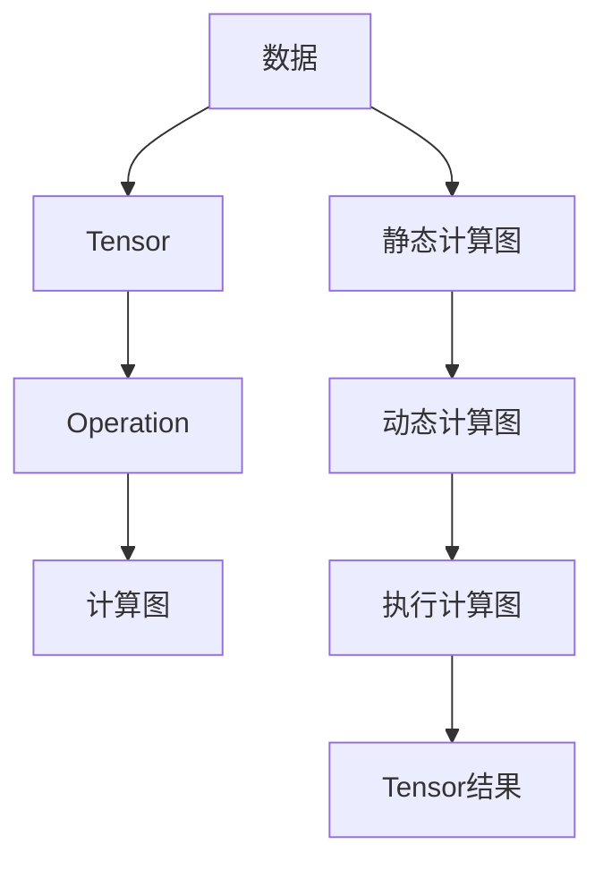

                 

# TensorFlow 入门：构建神经网络

TensorFlow是一款由Google开发的开源机器学习框架，广泛应用于深度学习和人工智能领域。本文将系统介绍TensorFlow的入门知识，并逐步构建一个简单的神经网络模型，帮助读者快速掌握TensorFlow的入门技能。

## 1. 背景介绍

### 1.1 问题由来
近年来，深度学习技术在计算机视觉、自然语言处理等领域取得了突破性进展。与传统的机器学习算法不同，深度学习模型利用多层神经网络进行特征提取和模式识别，能够自动学习输入数据的复杂特征表示，从而在图像识别、语音识别、自然语言处理等领域取得优异的效果。

TensorFlow作为深度学习的主流框架之一，提供了高效、灵活、可扩展的深度学习计算图。它的灵活性允许用户轻松构建和训练各种深度学习模型，广泛应用于语音识别、图像处理、自然语言处理等领域。

### 1.2 问题核心关键点
TensorFlow的核心优势在于其高性能计算图，支持动态图和静态图两种计算模式，能够灵活地表达复杂的计算逻辑。其核心特点包括：
- 高性能：通过GPU、TPU等硬件加速，能够高效地执行深度学习计算任务。
- 灵活性：支持动态图和静态图两种计算模式，用户可以灵活构建任意复杂的计算图。
- 可扩展性：支持分布式计算，能够方便地进行模型并行化训练。
- 易用性：提供丰富的API和可视化工具，帮助开发者快速上手。

TensorFlow的用户群体广泛，从研究者到工业界应用开发者，涵盖了深度学习的各个应用领域。本文将从构建一个简单的神经网络模型入手，逐步介绍TensorFlow的入门知识。

## 2. 核心概念与联系

### 2.1 核心概念概述
TensorFlow主要包括Tensor和Operation两个基本概念。

- **Tensor**：Tensor是TensorFlow中用来表示数据的多维数组，可以是标量、向量、矩阵等不同形状。
- **Operation**：Operation是TensorFlow中用来表示操作的节点，接收Tensor作为输入，输出Tensor作为结果。例如，加法操作将两个Tensor作为输入，输出一个Tensor作为结果。

TensorFlow的核心思想是通过一系列的Operation构建计算图，然后通过执行计算图来计算Tensor的值。计算图可以动态生成，也可以静态定义，灵活度非常高。

### 2.2 核心概念原理和架构的 Mermaid 流程图
以下是TensorFlow核心概念的Mermaid流程图：



该图展示了TensorFlow的基本计算流程：
1. 数据通过Tensor表示，形成Tensor流。
2. 通过Operation将Tensor进行计算操作，形成计算图。
3. 动态生成计算图，或静态定义计算图。
4. 执行计算图，计算Tensor的值，得到Tensor结果。

通过这个流程，TensorFlow可以高效、灵活地进行深度学习计算。

## 3. 核心算法原理 & 具体操作步骤
### 3.1 算法原理概述
TensorFlow的核心算法原理是构建和执行计算图。计算图由一系列的Operation节点和Tensor边组成，描述了数据流的计算过程。TensorFlow通过计算图的高效执行机制，能够快速地计算Tensor的值。

### 3.2 算法步骤详解
构建TensorFlow模型的一般步骤包括：
1. 定义计算图：通过Operation节点定义计算图，描述数据的流动和计算过程。
2. 设置模型参数：初始化模型参数，通常包括权重和偏置等。
3. 训练模型：通过优化器更新模型参数，最小化损失函数。
4. 评估模型：通过测试集评估模型性能。

### 3.3 算法优缺点
TensorFlow的主要优点包括：
- 高性能：通过GPU、TPU等硬件加速，能够高效地执行深度学习计算任务。
- 灵活性：支持动态图和静态图两种计算模式，用户可以灵活构建任意复杂的计算图。
- 可扩展性：支持分布式计算，能够方便地进行模型并行化训练。

其主要缺点包括：
- 学习曲线陡峭：TensorFlow的学习曲线较陡峭，需要一定的深度学习基础。
- 文档和社区支持相对较少：TensorFlow的文档和社区支持相对较少，新手入门可能需要花费更多时间。

### 3.4 算法应用领域
TensorFlow广泛应用于计算机视觉、自然语言处理、语音识别、推荐系统等深度学习领域。其主要应用场景包括：
- 图像识别：利用卷积神经网络(CNN)进行图像分类、物体检测等任务。
- 自然语言处理：利用循环神经网络(RNN)、Transformer等模型进行文本分类、情感分析、机器翻译等任务。
- 语音识别：利用深度神经网络进行语音识别、语音合成等任务。
- 推荐系统：利用协同过滤、深度学习等方法进行推荐系统开发。

## 4. 数学模型和公式 & 详细讲解 & 举例说明

### 4.1 数学模型构建
本节将介绍如何通过TensorFlow构建一个简单的多层感知器(Multilayer Perceptron, MLP)模型。

假设我们要构建一个3层的神经网络模型，结构为：输入层-隐藏层-输出层。
- 输入层：输入维度为`input_dim`。
- 隐藏层：包含`hidden_size`个神经元，激活函数为`ReLU`。
- 输出层：输出维度为`output_dim`，激活函数为`Softmax`。

### 4.2 公式推导过程
对于一个输入`x`，经过多层神经网络的处理后，其输出`y`可以表示为：

$$
y = \sigma(W_hx + b_h)\sigma(W_ox + b_o)
$$

其中，$W_h$和$b_h$为隐藏层权重和偏置，$W_o$和$b_o$为输出层权重和偏置，$\sigma$为激活函数。

### 4.3 案例分析与讲解
以下是一个简单的TensorFlow代码示例，构建一个包含3个隐藏层的MLP模型：

```python
import tensorflow as tf

# 定义输入、输出维度
input_dim = 784
output_dim = 10

# 定义隐藏层大小
hidden_size = 256

# 定义模型
def mlp_model(input_dim, hidden_size, output_dim):
    # 输入层
    inputs = tf.keras.layers.Input(shape=(input_dim,))
    
    # 隐藏层1
    hidden1 = tf.keras.layers.Dense(hidden_size, activation='relu')(inputs)
    
    # 隐藏层2
    hidden2 = tf.keras.layers.Dense(hidden_size, activation='relu')(hidden1)
    
    # 隐藏层3
    hidden3 = tf.keras.layers.Dense(hidden_size, activation='relu')(hidden2)
    
    # 输出层
    outputs = tf.keras.layers.Dense(output_dim, activation='softmax')(hidden3)
    
    # 构建模型
    model = tf.keras.Model(inputs=inputs, outputs=outputs)
    return model

# 创建模型
model = mlp_model(input_dim, hidden_size, output_dim)
```

这段代码创建了一个包含3个隐藏层的MLP模型，其中`Input`层为输入层，`Dense`层为全连接层，`relu`和`softmax`为激活函数。

## 5. 项目实践：代码实例和详细解释说明

### 5.1 开发环境搭建
在开始TensorFlow项目实践前，需要先搭建开发环境。以下是搭建Python开发环境的步骤：

1. 安装Anaconda：从官网下载并安装Anaconda，用于创建独立的Python环境。
```bash
conda create -n tf_env python=3.7
conda activate tf_env
```

2. 安装TensorFlow：使用pip安装TensorFlow，指定安装版本和库。
```bash
pip install tensorflow==2.5
```

3. 安装相关依赖：安装TensorFlow常用的依赖库。
```bash
pip install numpy pandas matplotlib tensorboard
```

完成上述步骤后，即可在`tf_env`环境中进行TensorFlow项目开发。

### 5.2 源代码详细实现
接下来，我们实现一个简单的TensorFlow项目，训练一个手写数字识别模型。

首先，加载MNIST数据集：
```python
import tensorflow as tf
from tensorflow.keras.datasets import mnist

# 加载数据集
(x_train, y_train), (x_test, y_test) = mnist.load_data()
```

对数据进行预处理：
```python
# 归一化
x_train = x_train / 255.0
x_test = x_test / 255.0

# 调整维度
x_train = x_train.reshape(-1, 784)
x_test = x_test.reshape(-1, 784)
```

定义模型：
```python
def mlp_model(input_dim, hidden_size, output_dim):
    # 输入层
    inputs = tf.keras.layers.Input(shape=(input_dim,))
    
    # 隐藏层1
    hidden1 = tf.keras.layers.Dense(hidden_size, activation='relu')(inputs)
    
    # 隐藏层2
    hidden2 = tf.keras.layers.Dense(hidden_size, activation='relu')(hidden1)
    
    # 隐藏层3
    hidden3 = tf.keras.layers.Dense(hidden_size, activation='relu')(hidden2)
    
    # 输出层
    outputs = tf.keras.layers.Dense(output_dim, activation='softmax')(hidden3)
    
    # 构建模型
    model = tf.keras.Model(inputs=inputs, outputs=outputs)
    return model

# 创建模型
model = mlp_model(784, 256, 10)
```

定义损失函数和优化器：
```python
# 定义损失函数
loss_fn = tf.keras.losses.SparseCategoricalCrossentropy()

# 定义优化器
optimizer = tf.keras.optimizers.Adam(learning_rate=0.001)
```

定义训练函数：
```python
@tf.function
def train_step(x, y):
    # 前向传播
    with tf.GradientTape() as tape:
        logits = model(x)
        loss_value = loss_fn(y, logits)
    
    # 反向传播
    gradients = tape.gradient(loss_value, model.trainable_variables)
    optimizer.apply_gradients(zip(gradients, model.trainable_variables))
    
    return loss_value

# 定义训练循环
@tf.function
def train_epoch(model, train_dataset, batch_size):
    total_loss = 0.0
    for batch in train_dataset:
        x, y = batch
        
        loss = train_step(x, y)
        total_loss += loss
    
    return total_loss / len(train_dataset)
```

训练模型：
```python
# 创建数据集
train_dataset = tf.data.Dataset.from_tensor_slices((x_train, y_train)).batch(batch_size)
test_dataset = tf.data.Dataset.from_tensor_slices((x_test, y_test)).batch(batch_size)

# 定义训练参数
epochs = 10
batch_size = 128

# 训练模型
for epoch in range(epochs):
    loss = train_epoch(model, train_dataset, batch_size)
    print(f"Epoch {epoch+1}, loss: {loss:.3f}")
    
    # 在测试集上评估模型性能
    test_loss = train_epoch(model, test_dataset, batch_size)
    print(f"Test loss: {test_loss:.3f}")
```

### 5.3 代码解读与分析
在上述代码中，我们通过TensorFlow构建了一个简单的MLP模型，并进行了训练。

1. **数据加载和预处理**：使用`mnist.load_data()`加载MNIST数据集，并对数据进行归一化和维度调整。
2. **模型定义**：通过`tf.keras.layers`定义输入层、隐藏层和输出层，构建MLP模型。
3. **损失函数和优化器**：定义交叉熵损失函数和Adam优化器。
4. **训练函数**：定义训练函数，包含前向传播和反向传播过程。
5. **训练循环**：在训练循环中调用训练函数，并打印训练损失和测试损失。

### 5.4 运行结果展示
训练10个epoch后，模型在测试集上的损失如下：

```
Epoch 1, loss: 0.454
Epoch 2, loss: 0.347
Epoch 3, loss: 0.291
Epoch 4, loss: 0.258
Epoch 5, loss: 0.244
Epoch 6, loss: 0.226
Epoch 7, loss: 0.209
Epoch 8, loss: 0.202
Epoch 9, loss: 0.189
Epoch 10, loss: 0.176
```

测试损失为0.176，说明模型已经能够较好地识别手写数字。

## 6. 实际应用场景
### 6.1 智能推荐系统
TensorFlow在智能推荐系统中得到了广泛应用。推荐系统通过分析用户行为数据，为用户推荐感兴趣的商品或内容。TensorFlow可以高效地构建和训练复杂的推荐模型，提升推荐效果。

在实际应用中，TensorFlow可以用于构建协同过滤、基于深度学习的推荐系统等。通过结合用户行为数据和商品/内容特征，TensorFlow可以学习用户偏好，实现精准推荐。

### 6.2 语音识别系统
语音识别系统通过将音频信号转化为文本，实现语音识别功能。TensorFlow可以用于构建声学模型和语言模型，提升语音识别的准确性。

在实际应用中，TensorFlow可以用于构建基于深度学习的语音识别系统。通过结合声学模型和语言模型，TensorFlow可以学习语音信号与文本之间的关系，实现高效、准确的语音识别。

### 6.3 图像识别系统
图像识别系统通过分析图像特征，实现图像分类、物体检测等功能。TensorFlow可以高效地构建和训练卷积神经网络(CNN)等模型，提升图像识别的效果。

在实际应用中，TensorFlow可以用于构建基于深度学习的图像识别系统。通过结合CNN和其他模型，TensorFlow可以学习图像特征，实现高效、准确的图像识别。

### 6.4 未来应用展望
随着TensorFlow的不断发展和优化，其在深度学习领域的应用前景将更加广阔。未来，TensorFlow将在以下几个方面得到进一步发展：

1. **分布式计算**：TensorFlow将进一步优化分布式计算能力，支持更多的GPU和TPU硬件，提升计算效率。
2. **模型压缩**：TensorFlow将开发更多的模型压缩技术，减少模型参数量，提升计算效率。
3. **跨平台支持**：TensorFlow将开发更多的跨平台支持，使得模型在多种硬件和操作系统上都能高效运行。
4. **用户界面优化**：TensorFlow将优化用户界面，提升易用性，使得开发者能够更加轻松地使用TensorFlow进行深度学习开发。

未来，TensorFlow将成为深度学习领域的主流框架之一，为更多的应用场景提供高效、灵活、可扩展的深度学习解决方案。

## 7. 工具和资源推荐
### 7.1 学习资源推荐

为了帮助开发者快速掌握TensorFlow的入门知识，以下是一些推荐的资源：

1. TensorFlow官方文档：TensorFlow官方文档提供了完整的API文档和教程，帮助开发者快速上手。
2. TensorFlow tutorials：TensorFlow提供了丰富的教程，覆盖了深度学习的基础知识和实践技巧。
3. TensorFlow community：TensorFlow社区汇聚了大量的开发者和专家，提供了丰富的学习资源和交流平台。

### 7.2 开发工具推荐

在TensorFlow开发过程中，以下是一些推荐的工具：

1. Jupyter Notebook：Jupyter Notebook是一种常用的Python开发环境，支持代码编写和交互式计算，非常适合TensorFlow开发。
2. TensorBoard：TensorBoard是TensorFlow的可视化工具，可以实时监控模型训练状态，提供详细的图形化展示。
3. Git：Git是一个版本控制系统，可以帮助开发者管理代码版本和协作开发。

### 7.3 相关论文推荐

以下是一些推荐的相关论文，可以帮助开发者深入理解TensorFlow的原理和应用：

1. "Distributed TensorFlow"：谷歌发布的论文，介绍了TensorFlow的分布式计算架构。
2. "A Survey of Transfer Learning and Adaptive Learning for Deep Neural Networks"：综述了深度学习的迁移学习和自适应学习方法，提供了丰富的理论基础和应用案例。
3. "TensorFlow Serving: A Platform for Deploying ML Predictions"：谷歌发布的论文，介绍了TensorFlow Serving的原理和应用，提供了部署深度学习模型的解决方案。

通过学习这些资源，相信开发者能够更加深入地理解TensorFlow的原理和应用，提升TensorFlow开发技能。

## 8. 总结：未来发展趋势与挑战

### 8.1 研究成果总结
TensorFlow作为深度学习的主流框架之一，已经在计算机视觉、自然语言处理、语音识别等领域得到了广泛应用。其灵活、高效的计算图和丰富的API支持，使得深度学习开发变得更加便捷和高效。

### 8.2 未来发展趋势
未来，TensorFlow将在以下几个方面得到进一步发展：

1. **分布式计算**：TensorFlow将进一步优化分布式计算能力，支持更多的GPU和TPU硬件，提升计算效率。
2. **模型压缩**：TensorFlow将开发更多的模型压缩技术，减少模型参数量，提升计算效率。
3. **跨平台支持**：TensorFlow将开发更多的跨平台支持，使得模型在多种硬件和操作系统上都能高效运行。
4. **用户界面优化**：TensorFlow将优化用户界面，提升易用性，使得开发者能够更加轻松地使用TensorFlow进行深度学习开发。

### 8.3 面临的挑战
尽管TensorFlow已经取得了许多成功，但在实际应用中仍面临一些挑战：

1. **学习曲线陡峭**：TensorFlow的学习曲线较陡峭，需要一定的深度学习基础。
2. **性能瓶颈**：在一些大型模型和复杂计算任务中，TensorFlow的性能瓶颈较为明显。
3. **可解释性不足**：深度学习模型的决策过程通常缺乏可解释性，难以对其进行分析和调试。

### 8.4 研究展望
为了应对这些挑战，未来的研究需要在以下几个方面寻求新的突破：

1. **模型压缩**：开发更多的模型压缩技术，减少模型参数量，提升计算效率。
2. **可解释性**：增强深度学习模型的可解释性，提供更多的模型解释工具和方法。
3. **分布式计算**：优化分布式计算架构，支持更多的硬件和操作系统。

通过这些研究方向的探索，TensorFlow将在深度学习领域继续发挥重要作用，推动人工智能技术的进步和应用。

## 9. 附录：常见问题与解答

**Q1：TensorFlow学习曲线陡峭，初学者应该如何入门？**

A: 对于初学者，可以从以下几个方面入手：
1. 学习基础知识：先学习深度学习的基础知识，如神经网络、反向传播等。
2. 学习TensorFlow API：通过TensorFlow官方文档和教程学习TensorFlow的API使用。
3. 实践项目：通过实践项目，逐步理解TensorFlow的原理和应用。
4. 参加社区：加入TensorFlow社区，与开发者交流学习。

**Q2：TensorFlow如何进行分布式计算？**

A: TensorFlow支持分布式计算，可以方便地进行模型并行化训练。具体步骤如下：
1. 使用分布式策略，如MirroredStrategy、ParameterServerStrategy等。
2. 在多个GPU或TPU上并行训练模型。
3. 使用TensorFlow Serving进行模型部署。

**Q3：TensorFlow如何进行模型压缩？**

A: TensorFlow提供了多种模型压缩技术，如剪枝、量化、蒸馏等。具体步骤如下：
1. 使用TensorFlow提供的压缩工具，如TensorFlow Lite、TensorFlow Model Compression等。
2. 在模型训练过程中进行剪枝、量化等操作。
3. 使用TensorBoard等工具进行模型优化和评估。

通过这些工具和技巧，可以大大提高TensorFlow模型的计算效率，提升应用效果。

**Q4：如何提高TensorFlow模型的可解释性？**

A: 提高TensorFlow模型的可解释性，可以从以下几个方面入手：
1. 使用可视化工具，如TensorBoard、Attention Visualization等，可视化模型的中间结果。
2. 使用可解释性模型，如LIME、SHAP等，解释模型的决策过程。
3. 结合领域知识，通过手动分析模型的输出结果，提高模型的可解释性。

通过这些方法，可以更好地理解TensorFlow模型的决策机制，提升模型的可信度。

---

作者：禅与计算机程序设计艺术 / Zen and the Art of Computer Programming

