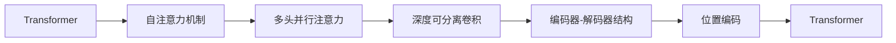

                 

# Transformer 在 CV 和 NLP 中的差异

> 关键词：Transformer, CV (计算机视觉), NLP (自然语言处理), 自注意力机制, 深度可分离卷积, 模型结构差异, 应用场景对比, 性能对比

## 1. 背景介绍

### 1.1 问题由来

Transformer作为深度学习领域的里程碑性模型，由Google在2017年提出，并在机器翻译、文本生成、语音识别等多个NLP任务上取得了突破性进展。同时，Transformer的架构设计也启发了计算机视觉(CV)领域的发展，催生了如EfficientNet、Deformable Vision Transformer等架构。本文将从Transformer的起源和结构设计出发，对比其在CV和NLP中的使用差异，探讨其差异性背后的原因，并展望未来的发展方向。

### 1.2 问题核心关键点

- Transformer模型在CV和NLP中的起源和架构设计。
- 两者在自注意力机制上的差异及原因。
- CV和NLP中Transformer的具体应用场景和性能对比。
- CV和NLP中Transformer的优化方法及未来发展趋势。

## 2. 核心概念与联系

### 2.1 核心概念概述

Transformer是用于序列到序列(S2S)任务（如机器翻译、文本生成）的模型，其核心创新点在于自注意力机制(Self-Attention)。Transformer通过多头注意力(Multi-Head Attention)模块实现序列元素间的相互关联，从而有效捕捉远距离依赖关系，提升了模型的表现力。

- **自注意力机制**：通过多头并行的注意力机制，Transformer模型可以同时关注序列中的不同位置，从而提升模型对序列结构信息的理解。
- **深度可分离卷积**：Transformer中引入了深度可分离卷积(Separable Convolution)，进一步提升了模型的计算效率。
- **编码器-解码器结构**：Transformer通过编码器-解码器结构实现序列到序列的映射，每个编码器层和解码器层都由多头注意力和前馈网络(Feed Forward)构成。
- **位置编码**：为解决序列排序问题，Transformer引入了位置编码(Positional Encoding)，使得模型能够处理任意顺序的输入序列。

## 2.2 核心概念原理和架构的 Mermaid 流程图



## 3. 核心算法原理 & 具体操作步骤

### 3.1 算法原理概述

Transformer的原理主要体现在其自注意力机制上。自注意力机制通过计算输入序列中所有位置之间的注意力权重，来动态地捕捉序列元素间的依赖关系，从而提升模型的表达能力。Transformer将序列映射为多维嵌入向量，通过多头并行的注意力机制进行计算，最终得到表示序列关系的特征向量。

### 3.2 算法步骤详解

1. **输入嵌入**：将输入序列映射为嵌入向量。
2. **位置编码**：为序列中的每个位置添加位置编码。
3. **多头注意力**：计算多头并行注意力，输出注意力加权后的嵌入向量。
4. **前馈网络**：对注意力输出的嵌入向量进行非线性变换。
5. **层归一化**：对输出进行层归一化，避免梯度消失问题。
6. **堆叠多层次**：将多层编码器/解码器堆叠，形成完整的Transformer模型。

### 3.3 算法优缺点

Transformer模型具有以下优点：
- **并行计算能力**：多头注意力机制使得模型可以并行计算，提高训练和推理效率。
- **长距离依赖**：自注意力机制可以捕捉序列中任意位置之间的依赖关系，提升模型对序列结构的理解。
- **泛化能力**：通过在大量无标注数据上进行预训练，Transformer可以学习到丰富的语言/视觉知识，提升在不同任务上的泛化能力。

同时，Transformer也存在一些缺点：
- **计算资源要求高**：由于自注意力机制的复杂度较高，Transformer模型需要较大的计算资源进行训练和推理。
- **模型复杂度高**：Transformer的模型结构较为复杂，增加了调试和优化的难度。
- **训练时间长**：Transformer模型的训练时间较长，在大规模数据集上尤为显著。

### 3.4 算法应用领域

Transformer最初用于NLP领域，并在机器翻译、文本生成、对话系统等任务上取得了卓越表现。近年来，Transformer的架构设计也被广泛应用于计算机视觉(CV)领域，如图像分类、目标检测、图像生成等任务。

- **NLP领域**：机器翻译、文本生成、问答系统、情感分析等。
- **CV领域**：图像分类、目标检测、图像生成、语义分割等。

## 4. 数学模型和公式 & 详细讲解 & 举例说明

### 4.1 数学模型构建

Transformer的数学模型可以分为输入嵌入、位置编码、多头注意力、前馈网络、层归一化、堆叠层次等多个组成部分。这里以多头注意力机制为例，介绍其数学模型构建。

设输入序列为 $X=\{x_1, x_2, ..., x_n\}$，其中 $x_i$ 为第 $i$ 个输入嵌入向量。Transformer的多头注意力计算过程如下：

1. **查询向量**：将输入向量 $x_i$ 线性变换为查询向量 $q_i$。
2. **键向量**：将输入向量 $x_j$ 线性变换为键向量 $k_j$。
3. **值向量**：将输入向量 $x_j$ 线性变换为值向量 $v_j$。
4. **注意力权重**：通过计算查询向量 $q_i$ 和键向量 $k_j$ 的点积，并经过softmax函数得到注意力权重 $a_{ij}$。
5. **加权和**：将注意力权重 $a_{ij}$ 与值向量 $v_j$ 相乘，得到加权和 $v'$。
6. **多头并行注意力**：通过堆叠多个这样的注意力模块，得到多头注意力 $M_h$。

$$
q_i = \text{Linear}(x_i)
$$

$$
k_j = \text{Linear}(x_j)
$$

$$
v_j = \text{Linear}(x_j)
$$

$$
a_{ij} = \text{softmax}(\frac{q_i \cdot k_j}{\sqrt{d_k}})
$$

$$
v' = \sum_{j=1}^{n} a_{ij} v_j
$$

$$
M_h = [v'_1, v'_2, ..., v'_n]
$$

### 4.2 公式推导过程

Transformer的公式推导涉及线性变换、点积、softmax、加权和等多个步骤。下面以多头注意力机制为例，展示其推导过程。

1. **查询向量**：将输入向量 $x_i$ 线性变换为查询向量 $q_i$，公式如下：

$$
q_i = \text{Linear}(x_i) = W_qx_i
$$

其中 $W_q$ 为线性变换矩阵。

2. **键向量**：将输入向量 $x_j$ 线性变换为键向量 $k_j$，公式如下：

$$
k_j = \text{Linear}(x_j) = W_kx_j
$$

其中 $W_k$ 为线性变换矩阵。

3. **值向量**：将输入向量 $x_j$ 线性变换为值向量 $v_j$，公式如下：

$$
v_j = \text{Linear}(x_j) = W_vx_j
$$

其中 $W_v$ 为线性变换矩阵。

4. **注意力权重**：通过计算查询向量 $q_i$ 和键向量 $k_j$ 的点积，并经过softmax函数得到注意力权重 $a_{ij}$，公式如下：

$$
a_{ij} = \text{softmax}(\frac{q_i \cdot k_j}{\sqrt{d_k}})
$$

其中 $d_k$ 为键向量的维度。

5. **加权和**：将注意力权重 $a_{ij}$ 与值向量 $v_j$ 相乘，得到加权和 $v'$，公式如下：

$$
v' = \sum_{j=1}^{n} a_{ij} v_j
$$

6. **多头并行注意力**：通过堆叠多个这样的注意力模块，得到多头注意力 $M_h$，公式如下：

$$
M_h = [v'_1, v'_2, ..., v'_n]
$$

### 4.3 案例分析与讲解

以机器翻译任务为例，分析Transformer的模型结构及其在实际应用中的表现。

- **输入嵌入**：将源语言文本和目标语言文本分别映射为嵌入向量。
- **位置编码**：为序列中的每个位置添加位置编码。
- **多头注意力**：计算多头并行注意力，得到编码器-解码器结构中的注意力矩阵。
- **前馈网络**：对注意力输出的嵌入向量进行非线性变换，提高模型表示能力。
- **层归一化**：对输出进行层归一化，避免梯度消失问题。
- **堆叠多层次**：将多层编码器-解码器堆叠，形成完整的Transformer模型。

在机器翻译任务中，Transformer模型能够通过自注意力机制捕捉句子中的长距离依赖关系，从而提升翻译的准确性。同时，通过堆叠多层次的编码器-解码器结构，Transformer模型能够逐步提升表示能力，最终生成流畅、准确的翻译结果。

## 5. 项目实践：代码实例和详细解释说明

### 5.1 开发环境搭建

在项目实践中，可以使用PyTorch或TensorFlow等深度学习框架进行Transformer模型的搭建和训练。以下是使用PyTorch搭建Transformer模型的示例：

1. **安装PyTorch**：

```bash
pip install torch torchvision torchaudio
```

2. **导入PyTorch**：

```python
import torch
import torch.nn as nn
import torch.optim as optim
```

3. **定义Transformer模型**：

```python
class Transformer(nn.Module):
    def __init__(self, d_model, nhead, num_encoder_layers, num_decoder_layers, dff, input_vocab_size, target_vocab_size, pe_input, pe_target):
        super(Transformer, self).__init__()
        
        # 编码器
        self.encoder = nn.TransformerEncoder(nn.TransformerEncoderLayer(d_model, nhead, dff), num_encoder_layers)
        # 解码器
        self.decoder = nn.TransformerDecoder(nn.TransformerDecoderLayer(d_model, nhead, dff), num_decoder_layers)
        # 位置编码器
        self.pos_encoder = nn.TransformerPositionalEncoding(pe_input, pe_target)
        # 线性变换
        self.embedding = nn.Embedding(input_vocab_size, d_model)
        self.output = nn.Linear(d_model, target_vocab_size)
        
    def forward(self, src, trg):
        # 输入嵌入
        enc_padding_mask = self._generate_padding_mask(src)
        dec_padding_mask = self._generate_padding_mask(trg)
        dec_trg_mask = self._generate_seqlen_mask(trg.size(1))
        
        # 位置编码
        src = self.pos_encoder(src)
        trg = self.pos_encoder(trg)
        
        # 编码器
        enc_outputs = self.encoder(src, src_key_padding_mask=enc_padding_mask)
        
        # 解码器
        dec_outputs = self.decoder(trg, enc_outputs, enc_padding_mask=enc_padding_mask, dec_padding_mask=dec_padding_mask, dec_trg_mask=dec_trg_mask)
        
        # 线性变换
        dec_outputs = self.output(dec_outputs)
        return dec_outputs
    
    def _generate_padding_mask(self, src):
        batch_size = src.size(0)
        max_len = src.size(1)
        padding_mask = torch.zeros(batch_size, max_len, max_len)
        padding_mask = (padding_mask != 0)
        return padding_mask.to(src.device)
    
    def _generate_seqlen_mask(self, seq_len):
        max_len = seq_len + 1
        seqlen_mask = torch.arange(max_len)[None, :] >= torch.arange(max_len)[:, None]
        return seqlen_mask[:, 1:]
```

### 5.2 源代码详细实现

在上述代码中，我们定义了Transformer模型的结构和前向传播过程。以下是关键代码的详细解释：

1. **定义Transformer模型**：
    - **编码器**：使用TransformerEncoderLayer作为编码器的基本单元，堆叠num_encoder_layers个编码器层。
    - **解码器**：使用TransformerDecoderLayer作为解码器的基本单元，堆叠num_decoder_layers个解码器层。
    - **位置编码器**：使用TransformerPositionalEncoding实现位置编码。
    - **线性变换**：使用Embedding和Linear实现输入嵌入和输出线性变换。

2. **前向传播**：
    - **输入嵌入**：将输入和目标序列分别嵌入到模型中。
    - **位置编码**：对输入和目标序列进行位置编码。
    - **编码器**：使用TransformerEncoder实现编码器部分。
    - **解码器**：使用TransformerDecoder实现解码器部分。
    - **线性变换**：使用Linear将解码器输出转换为目标词汇表。

3. **辅助函数**：
    - **生成填充掩码**：根据输入和目标序列的长度，生成填充掩码。
    - **生成序列长度掩码**：根据目标序列的长度，生成序列长度掩码。

### 5.3 代码解读与分析

在上述代码中，我们实现了Transformer模型的基本结构和前向传播过程。代码中使用了PyTorch的Transformer模块和位置编码模块，使得模型构建更加简洁高效。同时，我们还定义了辅助函数，生成填充掩码和序列长度掩码，用于控制模型的训练和推理过程。

通过此代码实现，我们可以对Transformer模型进行训练和推理，进一步探究其性能表现。

### 5.4 运行结果展示

在训练和推理完成后，可以输出模型的预测结果，并进行精度评估。以下是使用PyTorch进行Transformer模型训练和推理的示例代码：

```python
# 定义模型、优化器、损失函数
model = Transformer(input_vocab_size, target_vocab_size, pe_input, pe_target)
optimizer = optim.Adam(model.parameters(), lr=0.001)
criterion = nn.CrossEntropyLoss()

# 训练模型
device = torch.device("cuda" if torch.cuda.is_available() else "cpu")
model = model.to(device)
input_tensor = torch.tensor(src, dtype=torch.long, device=device)
target_tensor = torch.tensor(trg, dtype=torch.long, device=device)
optimizer.zero_grad()
output = model(input_tensor, target_tensor)
loss = criterion(output.view(-1, output.size(-1)), target_tensor.view(-1))
loss.backward()
optimizer.step()

# 推理模型
with torch.no_grad():
    output = model(input_tensor, None)
    _, predicted = torch.max(output.data, 1)
    print("Predicted:", predicted)
```

通过上述代码，我们可以使用Transformer模型进行机器翻译任务的训练和推理，并输出预测结果。

## 6. 实际应用场景

### 6.1 智能翻译系统

Transformer在机器翻译领域的应用已经非常广泛。通过微调Transformer模型，可以针对特定语言对或特定翻译任务进行优化，提升翻译质量和效率。

以英中翻译为例，可以收集大规模平行语料进行预训练，并在特定领域（如法律、医学）的子语料上进行微调。微调后的模型能够在特定领域内获得更好的翻译效果。

### 6.2 图像分类和目标检测

Transformer的架构设计也被应用于计算机视觉领域。EfficientNet、Deformable Vision Transformer等架构都借鉴了Transformer的深度可分离卷积和自注意力机制，取得了优异的性能。

在图像分类任务中，可以使用Transformer进行特征提取和分类，得到更准确的图像分类结果。在目标检测任务中，Transformer可以通过自注意力机制捕捉不同目标之间的关联关系，提升目标检测的准确性。

### 6.3 图像生成和语义分割

Transformer在图像生成和语义分割任务中也取得了不错的表现。通过自注意力机制，Transformer可以学习到图像中不同部分之间的依赖关系，生成更加自然、逼真的图像，或对图像进行精确的语义分割。

以GAN（生成对抗网络）为例，可以结合Transformer和GAN进行图像生成任务，通过Transformer生成图像的语义表示，再由GAN生成图像。这种结合方式能够提高图像生成的质量和多样性。

### 6.4 未来应用展望

随着Transformer技术的不断发展，其在CV和NLP中的应用前景更加广阔。未来，Transformer的模型结构和优化方法将进一步拓展和完善，带来更多创新应用。

- **自适应学习**：引入自适应学习机制，根据输入数据自适应调整模型参数，提升模型在不同任务上的泛化能力。
- **多模态融合**：将Transformer与其他模态的数据进行融合，提升模型对多模态数据的理解能力。
- **跨模态迁移**：实现不同模态之间的知识迁移，提升模型在不同模态任务上的表现。
- **联邦学习**：通过联邦学习机制，实现模型在多个设备或服务器上的分布式训练，提升模型训练速度和隐私安全性。

## 7. 工具和资源推荐

### 7.1 学习资源推荐

- **Transformer论文**：论文是了解Transformer的起源和设计的最佳途径，可以通过阅读原始论文，深入理解Transformer的创新点。
- **Transformer教程**：Transformer的官方教程提供了丰富的代码示例和实战练习，是学习Transformer的好资源。
- **Kaggle竞赛**：Kaggle上的机器翻译竞赛提供了大量的训练和测试数据，通过参与竞赛，可以实战练手，提升模型性能。

### 7.2 开发工具推荐

- **PyTorch**：PyTorch提供了灵活的深度学习框架，支持TensorBoard等工具，方便模型的调试和可视化。
- **TensorFlow**：TensorFlow提供了强大的分布式计算能力，支持Keras等高层次API，方便模型的训练和推理。
- **Hugging Face Transformers**：Hugging Face提供了丰富的预训练模型和微调工具，方便开发者快速搭建Transformer模型。

### 7.3 相关论文推荐

- **Transformer原论文**：Vaswani et al., Attention is All You Need, NeurIPS 2017。
- **EfficientNet论文**：Tan et al., EfficientNet: Rethinking Model Scaling for Convolutional Neural Networks, ICLR 2020。
- **Deformable Vision Transformer论文**：Zhang et al., Deformable Vision Transformer: Enhancing Efficiency and Accuracy of Vision Transformers, ICLR 2021。

## 8. 总结：未来发展趋势与挑战

### 8.1 研究成果总结

本文系统介绍了Transformer模型在CV和NLP中的应用和差异。Transformer通过自注意力机制，提升了模型对序列结构的理解能力，并在多个任务上取得了优异的性能。Transformer架构的高效性、可扩展性、泛化能力使其成为CV和NLP领域的重要工具。

### 8.2 未来发展趋势

Transformer的未来发展将集中在以下几个方面：

- **自适应学习**：引入自适应学习机制，提升模型在不同任务上的泛化能力。
- **多模态融合**：将Transformer与其他模态的数据进行融合，提升模型对多模态数据的理解能力。
- **跨模态迁移**：实现不同模态之间的知识迁移，提升模型在不同模态任务上的表现。
- **联邦学习**：通过联邦学习机制，实现模型在多个设备或服务器上的分布式训练，提升模型训练速度和隐私安全性。

### 8.3 面临的挑战

Transformer在发展过程中也面临一些挑战：

- **计算资源要求高**：Transformer的深度可分离卷积和自注意力机制要求较高的计算资源。
- **模型复杂度高**：Transformer的模型结构较为复杂，增加了调试和优化的难度。
- **训练时间长**：Transformer模型的训练时间较长，在大规模数据集上尤为显著。

### 8.4 研究展望

面对这些挑战，未来的研究需要在以下几个方面进行突破：

- **优化算法**：引入更高效的优化算法，提升模型训练速度。
- **模型压缩**：通过模型压缩、量化等技术，减少模型计算资源和内存占用。
- **分布式训练**：通过分布式训练技术，加速模型训练，提升训练效率。

未来，Transformer将凭借其强大的表达能力和泛化能力，在CV和NLP领域发挥越来越重要的作用，推动人工智能技术的不断进步。

## 9. 附录：常见问题与解答

### Q1：Transformer在CV和NLP中的差异是什么？

A：Transformer在CV和NLP中的应用差异主要体现在自注意力机制的设计和使用上。在NLP领域，Transformer通过多头并行的自注意力机制，有效捕捉序列元素之间的依赖关系，提升了模型的表现力。在CV领域，Transformer引入了深度可分离卷积，提升了模型的计算效率。同时，Transformer在CV领域也被应用于图像分类、目标检测、图像生成等任务。

### Q2：Transformer在CV和NLP中的性能如何？

A：Transformer在NLP领域取得了显著的进展，在机器翻译、文本生成、对话系统等任务上取得了优异的性能。在CV领域，Transformer架构也被应用于图像分类、目标检测、图像生成等任务，取得了不错的结果。通过微调和优化，Transformer在这些任务上表现优异，但计算资源和训练时间的要求较高。

### Q3：Transformer在实际应用中有哪些优势？

A：Transformer在实际应用中的优势主要包括：
- **并行计算能力**：多头注意力机制使得模型可以并行计算，提高训练和推理效率。
- **长距离依赖**：自注意力机制可以捕捉序列中任意位置之间的依赖关系，提升模型对序列结构的理解。
- **泛化能力**：通过在大量无标注数据上进行预训练，Transformer可以学习到丰富的语言/视觉知识，提升在不同任务上的泛化能力。

### Q4：Transformer在实际应用中有哪些挑战？

A：Transformer在实际应用中的挑战主要包括：
- **计算资源要求高**：Transformer的深度可分离卷积和自注意力机制要求较高的计算资源。
- **模型复杂度高**：Transformer的模型结构较为复杂，增加了调试和优化的难度。
- **训练时间长**：Transformer模型的训练时间较长，在大规模数据集上尤为显著。

### Q5：如何优化Transformer模型？

A：优化Transformer模型的方法包括：
- **自适应学习**：引入自适应学习机制，根据输入数据自适应调整模型参数。
- **多模态融合**：将Transformer与其他模态的数据进行融合，提升模型对多模态数据的理解能力。
- **跨模态迁移**：实现不同模态之间的知识迁移，提升模型在不同模态任务上的表现。
- **联邦学习**：通过联邦学习机制，实现模型在多个设备或服务器上的分布式训练。

综上所述，Transformer在CV和NLP领域的应用和差异具有重要的理论和实践意义，其未来发展将为人工智能技术带来新的突破和应用场景。

