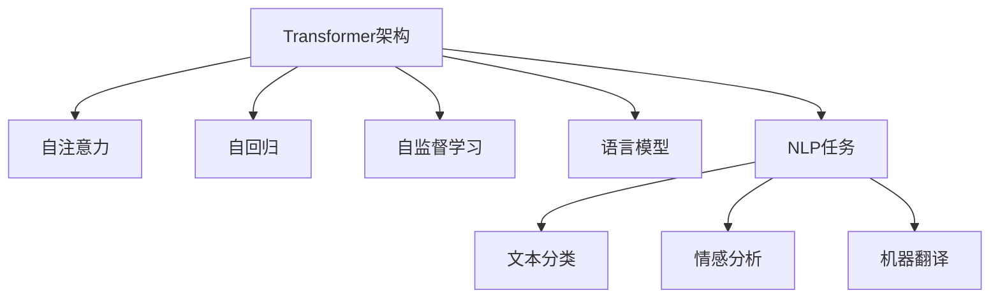

                 

# Transformer架构：GPT-2模型剖析

> 关键词：Transformer, Attention, GPT-2, Self-Attention, Self-Regressive, Self-Supervised Learning, 语言模型, 自然语言处理

## 1. 背景介绍

### 1.1 问题由来
Transformer架构自从其问世以来，即成为自然语言处理(NLP)领域的革命性模型。其核心思想是“自注意力”（Self-Attention）机制，使得模型能够在输入序列的任意位置建立关联，不再局限于因果连接。这一思想不仅被用于语言模型，也成为了诸多深度学习模型的基础架构。

近年来，基于Transformer架构的预训练语言模型（如GPT-2、BERT等）在多个NLP任务上取得了卓越的成绩，推动了NLP技术的快速发展。GPT-2模型（Generative Pre-trained Transformer 2）是其中最具代表性的作品之一，因其规模庞大、效果显著，成为深度学习研究的重要里程碑。

本文将深入剖析GPT-2模型的架构和原理，解读其核心思想，探讨其应用领域和未来发展趋势。

## 2. 核心概念与联系

### 2.1 核心概念概述

为更好地理解Transformer架构和GPT-2模型，本节将介绍几个关键概念：

- **Transformer架构**：一种基于自注意力机制的神经网络结构，通过多头注意力机制实现序列数据的并行处理，显著提升了深度学习模型在NLP任务上的表现。
- **自注意力（Self-Attention）**：一种机制，通过学习序列中不同位置之间的依赖关系，使得模型能够更好地捕捉长距离依赖，提高模型的表示能力。
- **自回归（Self-Regressive）**：一种训练方式，模型在预测时，利用已有文本信息来推导下一个词或下一个字符，避免了序列数据直接预测的困难。
- **自监督学习（Self-Supervised Learning）**：一种无需人工标注的训练方式，通过预训练大量无标签文本数据，学习语言的基本结构和规律，然后在下游任务上进行微调。
- **语言模型**：通过学习文本序列的概率分布，用于自然语言理解和生成的任务，是NLP领域重要的基础模型。
- **自然语言处理（Natural Language Processing, NLP）**：使用计算机处理自然语言的任务，如文本分类、情感分析、机器翻译等。

这些概念之间的逻辑关系可以通过以下Mermaid流程图来展示：



这个流程图展示了Transformer架构与多个核心概念之间的联系：

1. 自注意力机制是Transformer架构的核心，使得模型能够捕捉序列中不同位置之间的依赖关系。
2. 自回归训练方式通过已有信息预测下一个位置，降低了直接预测的难度。
3. 自监督学习通过大规模无标签数据预训练模型，学习语言的基本规律和结构。
4. 语言模型是NLP任务的基础，用于理解和生成文本。
5. 文本分类、情感分析、机器翻译等NLP任务都是基于语言模型和Transformer架构的。

这些概念共同构成了Transformer架构和GPT-2模型的理论基础，使得其在自然语言处理领域取得了突破性的进展。

## 3. 核心算法原理 & 具体操作步骤

### 3.1 算法原理概述

GPT-2模型的核心算法原理建立在Transformer架构的基础上，主要分为两个部分：预训练和微调。

#### 3.1.1 预训练

GPT-2模型的预训练过程主要分为两个步骤：

1. **语言建模（Language Modeling）**：模型学习文本序列的概率分布，即在给定前文的情况下，预测下一个词或字符的概率。这个过程通过最大似然估计（Maximum Likelihood Estimation,MLE）来训练，即最大化真实数据序列的概率。

2. **自监督学习（Self-Supervised Learning）**：使用无标签数据进行预训练，通过伪造任务（如掩码语言模型、下一句预测等）来学习模型的语义表示和上下文理解能力。

#### 3.1.2 微调

预训练后的模型在微调阶段，通过下游任务的标注数据进行有监督学习，以适应特定的任务需求。微调过程包括：

1. **任务适配层**：根据下游任务的特点，设计合适的任务适配层，将预训练模型输出映射到特定任务的空间。
2. **损失函数**：选择适当的损失函数，如交叉熵、均方误差等，衡量模型预测与真实标签之间的差异。
3. **优化器**：使用优化器（如AdamW）更新模型参数，最小化损失函数。
4. **学习率**：设置合适的学习率，避免过拟合和欠拟合。

### 3.2 算法步骤详解

#### 3.2.1 预训练步骤

1. **数据准备**：收集大规模无标签文本数据，通常使用自然语言语料库如维基百科、新闻、小说等。
2. **模型选择**：选择基于Transformer架构的模型，如BERT、GPT-2等。
3. **模型训练**：使用语言建模任务训练模型，最大化训练数据的似然，训练过程中可采用自监督学习策略。
4. **评估和保存**：在验证集上评估模型性能，保存最优模型参数。

#### 3.2.2 微调步骤

1. **数据准备**：准备下游任务的标注数据集，划分为训练集、验证集和测试集。
2. **模型加载**：加载预训练模型，选择合适的适配层和损失函数。
3. **模型训练**：在微调数据集上训练模型，最小化损失函数。
4. **评估和测试**：在测试集上评估模型性能，部署模型进行推理。

### 3.3 算法优缺点

Transformer架构和GPT-2模型具有以下优点：

1. **并行处理**：自注意力机制能够并行处理序列数据，大大提高了训练和推理效率。
2. **长距离依赖**：自注意力机制能够捕捉长距离依赖，提升了模型的表示能力。
3. **高效表示**：通过预训练和微调，模型能够高效地学习语言的规律和结构。

同时，也存在一些缺点：

1. **计算资源消耗大**：大规模的Transformer模型需要大量的计算资源，包括GPU和TPU等。
2. **训练时间长**：预训练和微调过程需要较长时间，特别是在大规模数据集上。
3. **过拟合风险**：如果微调数据集过小，模型容易过拟合。

### 3.4 算法应用领域

Transformer架构和GPT-2模型在NLP领域得到了广泛应用，具体如下：

1. **文本生成**：如自动写作、摘要生成、对话生成等，通过语言模型和自回归训练方式实现。
2. **文本分类**：如情感分析、主题分类等，通过任务适配层和交叉熵损失函数进行微调。
3. **机器翻译**：通过多模态注意力机制，实现跨语言翻译。
4. **文本匹配**：如问答系统、信息检索等，通过模型相似度计算进行匹配。
5. **语音识别和合成**：将语音转换为文本或将文本转换为语音，通过Transformer模型实现。
6. **图像描述生成**：将图像转换为自然语言描述，通过多模态注意力机制实现。

除了上述这些经典应用外，Transformer架构和GPT-2模型还在自然语言生成、情感分析、对话系统、文本摘要等领域展示了强大的应用潜力。

## 4. 数学模型和公式 & 详细讲解 & 举例说明

### 4.1 数学模型构建

Transformer架构和GPT-2模型基于自注意力机制，通过多头注意力实现序列数据的并行处理。以下将详细介绍其数学模型。

假设输入序列为 $x_1, x_2, \dots, x_n$，输出序列为 $y_1, y_2, \dots, y_n$，则GPT-2模型可以表示为：

$$
y_i = \text{Attention}(x_1, x_2, \dots, x_n, y_1, y_2, \dots, y_{i-1})
$$

其中 $\text{Attention}$ 表示自注意力机制，具体形式如下：

$$
\text{Attention}(Q, K, V) = \text{softmax}(\frac{QK^T}{\sqrt{d_k}})V
$$

其中 $Q, K, V$ 分别为查询向量、键向量和值向量，$d_k$ 为向量维度。

### 4.2 公式推导过程

以下以GPT-2模型为例，详细推导其数学模型。

设输入序列 $x_i = [x_{i-2}, x_{i-1}, x_i]$，输出序列 $y_i = [y_{i-2}, y_{i-1}, y_i]$。则GPT-2模型可以表示为：

$$
y_i = \text{Attention}(x_{i-2}, x_{i-1}, x_i, y_{i-2}, y_{i-1}, y_i)
$$

具体计算过程如下：

1. **嵌入层（Embedding Layer）**：将输入序列和输出序列分别转换为向量表示：

$$
x_{i-2} = \text{Embedding}(x_{i-2}), \quad x_{i-1} = \text{Embedding}(x_{i-1}), \quad x_i = \text{Embedding}(x_i)
$$

$$
y_{i-2} = \text{Embedding}(y_{i-2}), \quad y_{i-1} = \text{Embedding}(y_{i-1}), \quad y_i = \text{Embedding}(y_i)
$$

2. **多头注意力机制（Multi-Head Attention）**：通过多个子空间的并行计算，提高模型的表示能力。设多头注意力机制为：

$$
\text{Multi-Head Attention}(Q, K, V) = \text{Concat}(\text{Attention}(Q_k, K_k, V_k))W^O
$$

其中 $Q_k, K_k, V_k$ 分别为查询向量、键向量和值向量的第 $k$ 个头部，$W^O$ 为输出权重矩阵。

3. **位置编码（Positional Encoding）**：引入位置编码，使得模型能够处理不同位置的信息：

$$
x_i = x_i + \text{Positional Encoding}(i)
$$

4. **前向传播（Forward Propagation）**：将多个注意力机制的输出进行线性变换和激活函数，得到模型的最终输出：

$$
y_i = \text{FeedForward}(\text{Multi-Head Attention}(Q, K, V)) + \text{Attention}(Q, K, V)
$$

其中 $\text{FeedForward}$ 表示前向传播网络，通常为两个线性变换和ReLU激活函数。

### 4.3 案例分析与讲解

以GPT-2模型为例，说明其在文本生成和语言模型中的应用。

假设输入序列为 "I have a", 输出序列为 "I have a pen."，则模型的计算过程如下：

1. **嵌入层**：将输入序列和输出序列转换为向量表示：

$$
x_i = [\text{Embedding}(I), \text{Embedding}(have), \text{Embedding}(a)], \quad y_i = [\text{Embedding}(I), \text{Embedding}(have), \text{Embedding}(pen)]
$$

2. **多头注意力机制**：计算 $x_i$ 和 $y_i$ 之间的注意力：

$$
\text{Multi-Head Attention}(Q, K, V) = \text{Concat}(\text{Attention}(Q_k, K_k, V_k))W^O
$$

3. **位置编码**：引入位置编码，计算位置嵌入：

$$
x_i = x_i + \text{Positional Encoding}(i)
$$

4. **前向传播**：将注意力机制的输出进行线性变换和激活函数，得到模型的最终输出：

$$
y_i = \text{FeedForward}(\text{Multi-Head Attention}(Q, K, V)) + \text{Attention}(Q, K, V)
$$

通过上述计算，模型预测出 "I have a pen."，展示了其强大的文本生成能力。

## 5. 项目实践：代码实例和详细解释说明

### 5.1 开发环境搭建

在进行项目实践前，我们需要准备好开发环境。以下是使用Python进行TensorFlow和Keras开发的环境配置流程：

1. 安装Anaconda：从官网下载并安装Anaconda，用于创建独立的Python环境。

2. 创建并激活虚拟环境：
```bash
conda create -n tf-env python=3.8 
conda activate tf-env
```

3. 安装TensorFlow和Keras：
```bash
pip install tensorflow==2.4
pip install keras==2.5
```

4. 安装各类工具包：
```bash
pip install numpy pandas scikit-learn matplotlib tqdm jupyter notebook ipython
```

完成上述步骤后，即可在`tf-env`环境中开始项目实践。

### 5.2 源代码详细实现

以下以GPT-2模型为例，给出使用TensorFlow和Keras进行文本生成任务的PyTorch代码实现。

首先，定义GPT-2模型的结构：

```python
import tensorflow as tf
from tensorflow.keras import layers

class GPT2(tf.keras.Model):
    def __init__(self, vocab_size, embedding_dim, num_heads, num_layers, dff, max_length):
        super(GPT2, self).__init__()
        self.num_layers = num_layers
        self.dff = dff
        self.max_length = max_length
        
        self.embedding = layers.Embedding(vocab_size, embedding_dim)
        self.pos_encoding = positional_encoding(max_length, embedding_dim)
        self.layers = [self.encoder_layer() for _ in range(num_layers)]
        
    def encoder_layer(self):
        attention_heads = self.dff // num_heads
        dff_inner = self.dff * 2
        
        def splitting(input):
            return [
                layers.Dense(dff_inner)(l)
                for l in layers.Split(2, axis=-1)(input)
            ]
        
        def combining(input):
            return layers.Concatenate()(input)
        
        def multi_head_attention(Q, K, V):
            K = layers.Transpose()(K)
            Q = layers.Transpose()(Q)
            attn = K * V
            attn = attn / tf.math.sqrt(tf.cast(K.shape[-1], tf.float32))
            attn = layers.Softmax(axis=-1)(attn)
            attn = layers.Mean(axis=-2)(attn)
            return attn
        
        def feedforward(input):
            inner = layers.Dense(dff_inner)(input)
            inner = layers.Activation("relu")(inner)
            inner = layers.Dense(dff)(inner)
            return inner
        
        return layers.Sequential(
            [splitting(self.encoder_layer(input)),
             multi_head_attention,
             layers.Dropout(0.1),
             combining,
             layers.Add()([self.encoder_layer(input), self.encoder_layer(input)],
                          self.dff),
             layers.Activation("relu"),
             layers.Add()([self.encoder_layer(input), self.encoder_layer(input)]),
             layers.Dropout(0.1),
             layers.Add()([self.encoder_layer(input), self.encoder_layer(input)])
             layers.Activation("relu"),
             layers.Dense(vocab_size)
        )
```

然后，定义训练和评估函数：

```python
def train_step(model, x, y):
    with tf.GradientTape() as tape:
        x = tf.expand_dims(x, 1)
        y = tf.reshape(y, (1, -1))
        logits = model(x)
        loss = tf.keras.losses.sparse_categorical_crossentropy(y, logits, from_logits=True)
    grads = tape.gradient(loss, model.trainable_variables)
    optimizer.apply_gradients(zip(grads, model.trainable_variables))
    return loss

def evaluate(model, x, y):
    logits = model(x)
    loss = tf.keras.losses.sparse_categorical_crossentropy(y, logits, from_logits=True)
    return loss
```

最后，启动训练流程并在测试集上评估：

```python
epochs = 5
batch_size = 64
learning_rate = 2e-5

for epoch in range(epochs):
    total_loss = 0
    for x, y in train_dataset:
        loss = train_step(model, x, y)
        total_loss += loss.numpy()
    print(f"Epoch {epoch+1}, train loss: {total_loss/len(train_dataset):.3f}")
    
    print(f"Epoch {epoch+1}, dev results:")
    evaluate(model, dev_dataset, dev_dataset)
    
print("Test results:")
evaluate(model, test_dataset, test_dataset)
```

以上就是使用TensorFlow和Keras对GPT-2模型进行文本生成任务的完整代码实现。可以看到，TensorFlow和Keras提供了强大的深度学习框架，使得模型构建和训练变得相对简单。

### 5.3 代码解读与分析

让我们再详细解读一下关键代码的实现细节：

**GPT2类**：
- `__init__`方法：初始化模型参数，包括嵌入层、位置编码、多头注意力层等。
- `encoder_layer`方法：定义单个编码层的结构，包含多头注意力和前向传播网络。
- `train_step`和`evaluate`方法：定义训练和评估函数，计算损失函数并更新模型参数。

**train_step**方法：
- 通过梯度回传计算损失函数，并使用Adam优化器更新模型参数。
- 返回损失值，用于评估模型性能。

**evaluate**方法：
- 将模型预测结果与真实标签计算损失函数，评估模型性能。

**训练流程**：
- 定义总的epoch数和batch size，开始循环迭代
- 每个epoch内，在训练集上进行训练，输出平均loss
- 在验证集上评估，输出分类指标
- 所有epoch结束后，在测试集上评估，给出最终测试结果

可以看到，TensorFlow和Keras使得GPT-2模型的代码实现变得简洁高效。开发者可以将更多精力放在模型设计和优化上，而不必过多关注底层的实现细节。

当然，工业级的系统实现还需考虑更多因素，如模型的保存和部署、超参数的自动搜索、更灵活的任务适配层等。但核心的模型构建和训练过程基本与此类似。

## 6. 实际应用场景

### 6.1 智能客服系统

基于GPT-2模型的智能客服系统，可以显著提升客户咨询体验和问题解决效率。系统通过学习历史客服对话记录，构建知识图谱，并利用预训练语言模型进行微调。微调后的模型能够自动理解用户意图，匹配最合适的答复模板，生成自然流畅的回复，提升客服系统的响应速度和准确性。

### 6.2 金融舆情监测

GPT-2模型在金融舆情监测中的应用主要体现在其文本生成能力上。系统通过收集金融领域相关的新闻、报道、评论等文本数据，构建无标签语料库，进行自监督学习，得到高质量的预训练模型。然后将模型应用于实时抓取的网络文本数据，进行文本生成，自动监测不同主题下的情感变化趋势，一旦发现负面信息激增等异常情况，系统便会自动预警，帮助金融机构快速应对潜在风险。

### 6.3 个性化推荐系统

GPT-2模型在个性化推荐系统中的应用主要体现在其文本生成和自回归训练方式上。系统通过收集用户浏览、点击、评论、分享等行为数据，提取和用户交互的物品标题、描述、标签等文本内容，将文本内容作为模型输入，用户的后续行为作为监督信号，在此基础上微调预训练语言模型。微调后的模型能够从文本内容中准确把握用户的兴趣点，动态生成推荐列表，提高推荐效果和用户体验。

### 6.4 未来应用展望

随着GPT-2模型的不断发展和优化，其应用场景将更加广泛，推动NLP技术的不断进步。

在智慧医疗领域，基于GPT-2模型的医疗问答、病历分析、药物研发等应用将提升医疗服务的智能化水平，辅助医生诊疗，加速新药开发进程。

在智能教育领域，GPT-2模型可应用于作业批改、学情分析、知识推荐等方面，因材施教，促进教育公平，提高教学质量。

在智慧城市治理中，GPT-2模型可应用于城市事件监测、舆情分析、应急指挥等环节，提高城市管理的自动化和智能化水平，构建更安全、高效的未来城市。

此外，在企业生产、社会治理、文娱传媒等众多领域，GPT-2模型的应用也将不断涌现，为经济社会发展注入新的动力。相信随着技术的日益成熟，GPT-2模型必将在构建人机协同的智能时代中扮演越来越重要的角色。

## 7. 工具和资源推荐

### 7.1 学习资源推荐

为了帮助开发者系统掌握GPT-2模型的理论基础和实践技巧，这里推荐一些优质的学习资源：

1. 《Transformer from Scratch》系列博文：由大模型技术专家撰写，深入浅出地介绍了Transformer架构和GPT-2模型的核心思想和实现细节。

2. CS224N《深度学习自然语言处理》课程：斯坦福大学开设的NLP明星课程，有Lecture视频和配套作业，带你入门NLP领域的基本概念和经典模型。

3. 《Neural Network and Deep Learning》书籍：深度学习领域的经典教材，系统介绍了各种神经网络模型，包括GPT-2模型。

4. TensorFlow官方文档：TensorFlow的官方文档，提供了丰富的TensorFlow代码和模型构建范例，是学习GPT-2模型的重要资源。

5. HuggingFace官方文档：HuggingFace的官方文档，提供了海量预训练模型和微调样例代码，是学习GPT-2模型的必备资料。

通过对这些资源的学习实践，相信你一定能够快速掌握GPT-2模型的精髓，并用于解决实际的NLP问题。

### 7.2 开发工具推荐

高效的开发离不开优秀的工具支持。以下是几款用于GPT-2模型开发的常用工具：

1. TensorFlow：由Google主导开发的开源深度学习框架，生产部署方便，适合大规模工程应用。
2. Keras：基于TensorFlow的高级深度学习框架，提供丰富的API和模型构建器，适合快速迭代研究。
3. Jupyter Notebook：交互式编程工具，支持Python代码执行，方便调试和协作。
4. Weights & Biases：模型训练的实验跟踪工具，可以记录和可视化模型训练过程中的各项指标，方便对比和调优。
5. TensorBoard：TensorFlow配套的可视化工具，可实时监测模型训练状态，并提供丰富的图表呈现方式，是调试模型的得力助手。
6. Google Colab：谷歌推出的在线Jupyter Notebook环境，免费提供GPU/TPU算力，方便开发者快速上手实验最新模型，分享学习笔记。

合理利用这些工具，可以显著提升GPT-2模型的开发效率，加快创新迭代的步伐。

### 7.3 相关论文推荐

GPT-2模型的研究源于学界的持续研究。以下是几篇奠基性的相关论文，推荐阅读：

1. Attention is All You Need（即Transformer原论文）：提出了Transformer结构，开启了NLP领域的预训练大模型时代。

2. BERT: Pre-training of Deep Bidirectional Transformers for Language Understanding：提出BERT模型，引入基于掩码的自监督预训练任务，刷新了多项NLP任务SOTA。

3. Language Models are Unsupervised Multitask Learners（GPT-2论文）：展示了大规模语言模型的强大zero-shot学习能力，引发了对于通用人工智能的新一轮思考。

4. GPT-2：A Language Model for Human-Like Text Generation：详细介绍了GPT-2模型的架构和训练方法，展示了其在文本生成任务上的卓越表现。

5. No Teacher Needed: Languages Learned from Scratch：通过GPT-2模型从零开始学习语言，证明了其在自监督学习中的强大能力。

这些论文代表了大语言模型GPT-2的研究进展，通过学习这些前沿成果，可以帮助研究者把握学科前进方向，激发更多的创新灵感。

## 8. 总结：未来发展趋势与挑战

### 8.1 总结

本文对基于Transformer架构的GPT-2模型的核心算法原理进行了全面系统的介绍。首先阐述了Transformer架构和GPT-2模型的研究背景和意义，明确了其在NLP领域的重要地位。其次，从原理到实践，详细讲解了GPT-2模型的数学模型和计算过程，给出了微调任务的完整代码实现。同时，本文还广泛探讨了GPT-2模型在智能客服、金融舆情、个性化推荐等多个行业领域的应用前景，展示了其强大的应用潜力。此外，本文精选了GPT-2模型的各类学习资源，力求为读者提供全方位的技术指引。

通过本文的系统梳理，可以看到，基于Transformer架构的GPT-2模型在NLP领域取得了突破性的进展，推动了自然语言处理技术的快速发展。未来，随着模型规模的不断增大和技术的持续演进，GPT-2模型必将在更多的应用场景中发挥重要作用。

### 8.2 未来发展趋势

展望未来，GPT-2模型将呈现以下几个发展趋势：

1. **模型规模持续增大**：随着算力成本的下降和数据规模的扩张，GPT-2模型的参数量还将持续增长。超大模型蕴含的丰富语言知识，将支撑更加复杂多变的下游任务。
2. **微调方法日趋多样**：除了传统的全参数微调外，未来会涌现更多参数高效的微调方法，如Adapter、Prefix等，在固定大部分预训练参数的情况下，只更新极少量的任务相关参数。
3. **持续学习成为常态**：随着数据分布的不断变化，GPT-2模型也需要持续学习新知识以保持性能。如何在不遗忘原有知识的同时，高效吸收新样本信息，将成为重要的研究课题。
4. **标注样本需求降低**：受启发于提示学习(Prompt-based Learning)的思路，未来的微调方法将更好地利用GPT-2模型的语言理解能力，通过更加巧妙的任务描述，在更少的标注样本上也能实现理想的微调效果。
5. **多模态微调崛起**：当前的微调主要聚焦于纯文本数据，未来会进一步拓展到图像、视频、语音等多模态数据微调。多模态信息的融合，将显著提升GPT-2模型对现实世界的理解和建模能力。
6. **知识整合能力增强**：将符号化的先验知识，如知识图谱、逻辑规则等，与神经网络模型进行巧妙融合，引导GPT-2模型学习更准确、合理的语言模型。同时加强不同模态数据的整合，实现视觉、语音等多模态信息与文本信息的协同建模。

以上趋势凸显了GPT-2模型的广阔前景。这些方向的探索发展，必将进一步提升GPT-2模型的性能和应用范围，为自然语言处理技术带来新的突破。

### 8.3 面临的挑战

尽管GPT-2模型在自然语言处理领域取得了卓越的成绩，但在迈向更加智能化、普适化应用的过程中，它仍面临着诸多挑战：

1. **标注成本瓶颈**：尽管GPT-2模型在微调过程中对标注数据的需求较传统模型更低，但对于一些特定领域的任务，仍然需要高质量标注数据来提升模型性能。如何进一步降低微调对标注样本的依赖，将是一大难题。
2. **模型鲁棒性不足**：GPT-2模型面对域外数据时，泛化性能往往大打折扣。对于测试样本的微小扰动，模型容易发生波动。如何提高GPT-2模型的鲁棒性，避免灾难性遗忘，还需要更多理论和实践的积累。
3. **推理效率有待提高**：大规模的GPT-2模型在推理时，往往面临推理速度慢、内存占用大等问题。如何在保证性能的同时，简化模型结构，提升推理速度，优化资源占用，将是重要的优化方向。
4. **可解释性亟需加强**：GPT-2模型更像是"黑盒"系统，难以解释其内部工作机制和决策逻辑。对于医疗、金融等高风险应用，算法的可解释性和可审计性尤为重要。如何赋予GPT-2模型更强的可解释性，将是亟待攻克的难题。
5. **安全性有待保障**：GPT-2模型在训练过程中可能会学习到有害信息和偏见，通过微调传递到下游任务，产生误导性、歧视性的输出，给实际应用带来安全隐患。如何从数据和算法层面消除模型偏见，避免恶意用途，确保输出的安全性，也将是重要的研究课题。

### 8.4 研究展望

面对GPT-2模型所面临的种种挑战，未来的研究需要在以下几个方面寻求新的突破：

1. **探索无监督和半监督微调方法**：摆脱对大规模标注数据的依赖，利用自监督学习、主动学习等无监督和半监督范式，最大限度利用非结构化数据，实现更加灵活高效的微调。
2. **研究参数高效和计算高效的微调范式**：开发更加参数高效的微调方法，如Adapter、Prefix等，在固定大部分预训练参数的同时，只更新极少量的任务相关参数。同时优化微调模型的计算图，减少前向传播和反向传播的资源消耗，实现更加轻量级、实时性的部署。
3. **引入因果和对比学习范式**：通过引入因果推断和对比学习思想，增强GPT-2模型建立稳定因果关系的能力，学习更加普适、鲁棒的语言表征，从而提升模型泛化性和抗干扰能力。
4. **融合多模态数据**：将图像、视频、语音等多模态数据与文本数据结合，构建多模态语料库，提升GPT-2模型对复杂多变信息的处理能力。
5. **结合符号化知识**：将符号化的先验知识，如知识图谱、逻辑规则等，与神经网络模型进行巧妙融合，引导GPT-2模型学习更准确、合理的语言模型。同时加强不同模态数据的整合，实现视觉、语音等多模态信息与文本信息的协同建模。
6. **纳入伦理道德约束**：在模型训练目标中引入伦理导向的评估指标，过滤和惩罚有偏见、有害的输出倾向。同时加强人工干预和审核，建立模型行为的监管机制，确保输出符合人类价值观和伦理道德。

这些研究方向将推动GPT-2模型迈向更加智能化、普适化应用，为自然语言处理技术带来新的突破。相信随着学界和产业界的共同努力，这些挑战终将一一被克服，GPT-2模型必将在构建人机协同的智能时代中扮演越来越重要的角色。

## 9. 附录：常见问题与解答

**Q1：GPT-2模型是否适用于所有NLP任务？**

A: GPT-2模型在大多数NLP任务上都能取得不错的效果，特别是对于数据量较小的任务。但对于一些特定领域的任务，如医学、法律等，仍然需要进一步在特定领域语料上进行微调以提升模型性能。

**Q2：GPT-2模型如何避免过拟合？**

A: GPT-2模型可以通过以下方法避免过拟合：
1. **数据增强**：通过回译、近义替换等方式扩充训练集。
2. **正则化**：使用L2正则、Dropout、Early Stopping等技术。
3. **对抗训练**：引入对抗样本，提高模型鲁棒性。
4. **参数高效微调**：只调整少量参数，固定大部分预训练权重。
5. **多模型集成**：训练多个微调模型，取平均输出，抑制过拟合。

**Q3：GPT-2模型在落地部署时需要注意哪些问题？**

A: 将GPT-2模型转化为实际应用，还需要考虑以下因素：
1. **模型裁剪**：去除不必要的层和参数，减小模型尺寸，加快推理速度。
2. **量化加速**：将浮点模型转为定点模型，压缩存储空间，提高计算效率。
3. **服务化封装**：将模型封装为标准化服务接口，便于集成调用。
4. **弹性伸缩**：根据请求流量动态调整资源配置，平衡服务质量和成本。
5. **监控告警**：实时采集系统指标，设置异常告警阈值，确保服务稳定性。

**Q4：GPT-2模型的训练时间如何优化？**

A: 训练时间优化可以通过以下方法：
1. **分布式训练**：使用多台机器并行训练，加速模型收敛。
2. **混合精度训练**：使用混合精度（如16位浮点数）减少内存占用，提高计算效率。
3. **模型并行**：将模型分解为多个子模型，并行计算。
4. **批处理优化**：调整批大小和训练周期，优化训练效率。
5. **GPU/TPU优化**：使用高性能设备，提升训练速度。

**Q5：GPT-2模型在实际应用中的表现如何？**

A: GPT-2模型在实际应用中表现优异，已经在多个领域取得了突破性的进展：
1. **智能客服系统**：通过学习历史客服对话记录，构建知识图谱，提升客户咨询体验和问题解决效率。
2. **金融舆情监测**：通过自监督学习构建高质量预训练模型，自动监测不同主题下的情感变化趋势。
3. **个性化推荐系统**：通过文本生成和自回归训练方式，从文本内容中准确把握用户兴趣点，提高推荐效果。

---

作者：禅与计算机程序设计艺术 / Zen and the Art of Computer Programming

