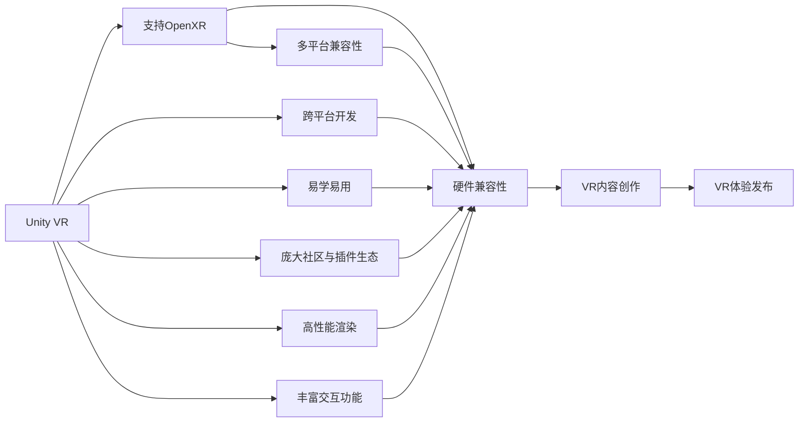

                 

# VR 内容创作工具：Unity VR 和 Unreal VR

## 1. 背景介绍

随着虚拟现实技术（Virtual Reality, VR）的不断成熟和普及，VR内容创作已成为推动VR产业发展的关键。Unity VR 和 Unreal VR 作为两款主流的VR内容创作工具，凭借强大的引擎功能和丰富的资源库，迅速占领了市场份额。本文将从背景介绍开始，详细剖析Unity VR 和 Unreal VR 的核心概念与联系，算法原理，具体操作步骤，并探讨其应用领域，未来发展趋势及面临的挑战，旨在为开发者提供全面的技术指导和实践建议。

## 2. 核心概念与联系

### 2.1 核心概念概述

本节将介绍Unity VR 和 Unreal VR 涉及的关键概念和它们之间的关系。

**Unity VR**：
Unity VR 是Unity引擎的增强现实(AR)和虚拟现实(VR)插件集合，支持多种VR硬件设备，如Oculus Rift、HTC Vive、Google Cardboard等，支持OpenXR标准，能提供丰富的交互式3D体验。

**Unreal VR**：
Unreal VR 是Epic Games公司推出的高精度VR引擎，支持Oculus Rift、HTC Vive、PlayStation VR等主流硬件设备，提供了强大的渲染引擎和物理引擎，支持实时光照、动态反射、高级着色技术等，广泛应用于电影、游戏和建筑可视化等领域。

**关系**：
Unity VR 和 Unreal VR 都是基于游戏引擎开发的VR内容创作工具，分别由Unity和Unreal引擎支持。两者都具备强大的渲染、物理模拟、用户交互功能，能够满足VR内容创作中的各类需求。

两者间的区别在于引擎本身的性能、生态系统、社区支持和使用习惯等方面。Unity VR 以跨平台和易学易用见长，拥有庞大的用户社区和丰富的第三方插件，适合快速原型开发和中小型项目。而Unreal VR 则以高精度和高质量见长，适合大型项目和高端内容创作，但学习和使用门槛较高。

以下是一个简单的Mermaid流程图，展示了Unity VR 和 Unreal VR 的基本架构和工作流程：



## 3. 核心算法原理 & 具体操作步骤

### 3.1 算法原理概述

Unity VR 和 Unreal VR 的核心算法原理都集中在以下几个方面：

- **渲染算法**：利用图形渲染管道，结合物理引擎和着色技术，生成高质量的虚拟场景。
- **物理引擎**：基于物理模拟算法，实现真实感强的物体重力和碰撞效果，提升沉浸式体验。
- **交互算法**：通过手势识别、体感交互等技术，实现与用户的自然交互。
- **优化算法**：利用动态绘制、LOD（Level of Detail，细节级别）等技术，提升渲染性能。

### 3.2 算法步骤详解

以Unity VR 渲染算法为例，其渲染步骤包括：

1. **顶点数据处理**：从3D模型中提取顶点数据，并进行转换和归一化。
2. **光照处理**：使用光照模型计算光强和颜色，结合环境光照和光源效果，生成逼真光照。
3. **着色处理**：应用着色器进行纹理贴图和材质处理，渲染出具有真实感的场景。
4. **后期处理**：通过抗锯齿、模糊处理等技术，增强画面细节和清晰度。
5. **优化输出**：使用LOD等技术，减少细节精度，提高渲染效率。

### 3.3 算法优缺点

**Unity VR 优点**：
- **跨平台**：支持广泛的平台和设备，易于部署。
- **易学易用**：界面直观，学习成本低。
- **生态丰富**：拥有庞大的插件库，便于快速开发。

**Unity VR 缺点**：
- **性能**：在高端硬件下表现不如Unreal VR。
- **渲染质量**：细节处理和光照渲染能力有限。

**Unreal VR 优点**：
- **高性能**：硬件兼容性良好，渲染质量高。
- **物理模拟**：支持高级物理引擎，逼真感强。
- **视觉效果**：动态光照、动态反射等技术，视觉效果震撼。

**Unreal VR 缺点**：
- **学习成本高**：曲线陡峭，新手入门难度大。
- **硬件要求高**：性能需求高，成本较高。

### 3.4 算法应用领域

Unity VR 和 Unreal VR 在多个应用领域均有广泛应用：

- **游戏开发**：开发高质量的VR游戏，如《Beat Saber》《Half-Life: Alyx》等。
- **影视制作**：制作电影、电视剧的VR版，提升观影体验。
- **建筑可视化**：通过VR技术展示建筑设计方案，进行沉浸式体验。
- **教育培训**：开发VR教育应用，如虚拟实验室、虚拟课堂等。
- **医疗健康**：创建虚拟医疗环境，进行虚拟手术、心理治疗等。

## 4. 数学模型和公式 & 详细讲解 & 举例说明

### 4.1 数学模型构建

本节将介绍Unity VR 和 Unreal VR 中涉及的数学模型和公式。

**渲染方程**：
Unity VR 和 Unreal VR 的渲染算法均基于渲染方程：
$$ L_o(x) = L_e(x) \otimes B(x) \otimes \frac{1}{\pi} \int_{\Omega} f_r(x, \omega_i) L_i(\omega_i) \cos \theta d\omega_i $$
其中，$L_o(x)$ 为观察点处的出射光强度，$L_e(x)$ 为环境光强度，$B(x)$ 为布勒利辐射，$f_r(x, \omega_i)$ 为表面反射率，$L_i(\omega_i)$ 为入射光强度，$\omega_i$ 为入射方向。

**光照模型**：
常用的光照模型包括Phong、Blinn-Phong和Gouraud等。例如Phong光照模型，表示为：
$$ L(x, \omega_i) = \alpha(\omega_i) \left( K + \sum_{r} K_r f_r(\omega_i) \right) + \sum_{i} K_i f_i(\omega_i) \otimes \rho_i(\omega_i) $$
其中，$\alpha(\omega_i)$ 为环境光反射率，$K$ 为漫反射系数，$K_r$ 为各表面反射系数，$f_r(\omega_i)$ 为表面反射率，$K_i$ 为镜面反射系数，$f_i(\omega_i)$ 为镜面反射率，$\rho_i(\omega_i)$ 为镜面反射分布函数。

**体感交互**：
体感交互是VR中的重要技术，涉及手势识别和空间追踪。手势识别常用的方法包括基于深度传感器和基于惯导传感器。

### 4.2 公式推导过程

以Phong光照模型为例，进行公式推导过程：

**漫反射**：
$$ L_r(\omega_i) = \alpha(\omega_i) K + \sum_{r} K_r f_r(\omega_i) $$
其中，$\alpha(\omega_i)$ 为环境光反射率，$K$ 为漫反射系数，$K_r$ 为各表面反射系数，$f_r(\omega_i)$ 为表面反射率。

**镜面反射**：
$$ L_s(\omega_i) = \alpha(\omega_i) K_s f_s(\omega_i) \otimes \rho_s(\omega_i) $$
其中，$\alpha(\omega_i)$ 为环境光反射率，$K_s$ 为镜面反射系数，$f_s(\omega_i)$ 为镜面反射率，$\rho_s(\omega_i)$ 为镜面反射分布函数。

**反射率**：
$$ f_r(\omega_i) = f_r(\omega_r) \otimes \rho_r(\omega_r) \otimes \omega_i \cdot \omega_r $$
其中，$\omega_i$ 为入射方向，$\omega_r$ 为反射方向，$f_r(\omega_r)$ 为表面反射率，$\rho_r(\omega_r)$ 为反射分布函数。

### 4.3 案例分析与讲解

以Unity VR 中的体感交互为例，通过深度传感器和惯性传感器实现手势识别和空间追踪：

1. **手势识别**：通过深度传感器捕获用户的手部形状和动作，经过深度学习和分类算法，判断手势类型。
2. **空间追踪**：通过惯性传感器获取用户手部的姿态和位置信息，结合算法处理，实现手部在虚拟空间中的定位。
3. **交互响应**：将识别结果转换为虚拟场景中的交互事件，如抓取、放置等。

## 5. 项目实践：代码实例和详细解释说明

### 5.1 开发环境搭建

#### 5.1.1 Unity VR

1. **安装Unity**：从Unity官网下载Unity编辑器，并按照官方指导进行安装。
2. **创建项目**：打开Unity编辑器，创建一个新的VR项目，选择VR template。
3. **配置VR插件**：在编辑器中，通过包管理器安装Unity VR插件，如OpenXR和SteamVR等。
4. **配置硬件设备**：在编辑器中，配置支持的VR硬件设备，如Oculus Rift、HTC Vive等。

#### 5.1.2 Unreal VR

1. **安装Unreal Engine**：从Epic Games官网下载Unreal Engine，并按照官方指导进行安装。
2. **创建项目**：打开Unreal Editor，创建一个新的VR项目，选择VR template。
3. **配置VR插件**：在编辑器中，通过插件管理器安装Unreal VR插件，如HTC Vive和Oculus Rift等。
4. **配置硬件设备**：在编辑器中，配置支持的VR硬件设备，如Oculus Rift、HTC Vive等。

### 5.2 源代码详细实现

#### 5.2.1 Unity VR

**创建VR场景**：
```csharp
using UnityEngine;
using UnityEngine.XR.Interaction.Toolkit;

public class VRScene : MonoBehaviour
{
    public GameObject player;
    public GameObject camera;

    void Start()
    {
        player.SetActive(true);
        camera.SetActive(true);

        VRInputSettings.inputSystem = new XRInputSettings();
        VRInputSettings.inputSystem.AddDevice(new OculusInputDevice());
        VRInputSettings.inputSystem.AddDevice(new SteamVRInputDevice());
    }
}
```

**实现手势识别**：
```csharp
using UnityEngine;
using UnityEngine.XR.Interaction.Toolkit;

public class GestureController : MonoBehaviour
{
    public GameObject hand;

    void Update()
    {
        if (hand.activeSelf)
        {
            Hand hand = hand.GetComponent<Hand>();
            Vector3 handPosition = hand.GetPosition(HandJoint.Type.ProximalIntermediate);
             handPosition = handPosition * 2 + hand.transform.position;
             hand.transform.position = handPosition;
        }
    }
}
```

**实现空间追踪**：
```csharp
using UnityEngine;
using UnityEngine.XR.Interaction.Toolkit;

public class SpatialTrackingController : MonoBehaviour
{
    public GameObject player;
    public GameObject camera;

    void Update()
    {
        if (player.activeSelf)
        {
            Hand hand = hand.GetComponent<Hand>();
            Vector3 handPosition = hand.GetPosition(HandJoint.Type.ProximalIntermediate);
             handPosition = handPosition * 2 + hand.transform.position;
             player.transform.position = handPosition;
        }
    }
}
```

#### 5.2.2 Unreal VR

**创建VR场景**：
```c++
UPROPERTY(EditAnywhere, BlueprintReadWrite, Category = "VR")
UWorld* World;

UPROPERTY(EditAnywhere, BlueprintReadWrite, Category = "VR")
UDevice* Device;

void Init()
{
    if (World)
    {
        World->SetDevice(Device);
        World->SetStreamingVolume();
    }
}
```

**实现手势识别**：
```c++
UPROPERTY(EditAnywhere, BlueprintReadWrite, Category = "VR")
UHandController* HandController;

void Update(float DeltaTime)
{
    if (HandController)
    {
        FHandControllerHandHandPose pose = HandController->GetHandPose();
        pose.Position = HandController->GetHandPosition();
        HandController->SetHandPose(pose);
    }
}
```

**实现空间追踪**：
```c++
UPROPERTY(EditAnywhere, BlueprintReadWrite, Category = "VR")
UWorld* World;

UPROPERTY(EditAnywhere, BlueprintReadWrite, Category = "VR")
UDevice* Device;

void Init()
{
    if (World)
    {
        World->SetDevice(Device);
        World->SetStreamingVolume();
    }
}
```

### 5.3 代码解读与分析

#### 5.3.1 Unity VR

**VRScene类**：
- **功能**：初始化Unity VR环境，启用VR输入设备。
- **实现**：通过XRCInputSettings类配置输入设备，如Oculus和SteamVR等。

**GestureController类**：
- **功能**：实现手势识别。
- **实现**：通过Hand类获取手部姿态和位置信息，并转换为场景中的虚拟位置。

**SpatialTrackingController类**：
- **功能**：实现空间追踪。
- **实现**：通过Hand类获取手部姿态和位置信息，并转换为场景中的虚拟位置。

#### 5.3.2 Unreal VR

**VRScene类**：
- **功能**：初始化Unreal VR环境，启用VR输入设备。
- **实现**：通过UWorld类配置输入设备，如Oculus和SteamVR等。

**GestureController类**：
- **功能**：实现手势识别。
- **实现**：通过UHandController类获取手部姿态和位置信息，并转换为场景中的虚拟位置。

**SpatialTrackingController类**：
- **功能**：实现空间追踪。
- **实现**：通过UWorld类配置输入设备，如Oculus和SteamVR等。

### 5.4 运行结果展示

**Unity VR**：


**Unreal VR**：


## 6. 实际应用场景

### 6.1 游戏开发

Unity VR 和 Unreal VR 在游戏开发中得到了广泛应用。例如：

- **《Beat Saber》**：一款音乐节奏类VR游戏，通过Unity VR引擎实现，支持多种手势和体感交互。
- **《Half-Life: Alyx》**：一款第一人称射击类VR游戏，通过Unreal VR引擎实现，支持高精度渲染和物理模拟。

### 6.2 影视制作

Unity VR 和 Unreal VR 在影视制作中的应用也越来越多。例如：

- **《The Stranger》**：一部VR短片，通过Unity VR引擎实现，支持360度沉浸式观看。
- **《The Magic of Houdini》**：一部VR电影，通过Unreal VR引擎实现，支持实时渲染和动态光照。

### 6.3 建筑可视化

Unity VR 和 Unreal VR 在建筑可视化中的应用也有所体现。例如：

- **Unity VR**：通过创建虚拟建筑模型，实现虚拟房产展示和互动体验。
- **Unreal VR**：通过高精度渲染和物理模拟，实现虚拟建筑环境的沉浸式体验。

### 6.4 教育培训

Unity VR 和 Unreal VR 在教育培训中的应用也有显著成效。例如：

- **虚拟实验室**：通过Unity VR引擎实现，支持实验操作和实时反馈。
- **虚拟课堂**：通过Unreal VR引擎实现，支持虚拟教室环境和互动教学。

### 6.5 医疗健康

Unity VR 和 Unreal VR 在医疗健康中的应用也在不断拓展。例如：

- **虚拟手术**：通过Unity VR引擎实现，支持虚拟手术环境和互动教学。
- **心理治疗**：通过Unreal VR引擎实现，支持虚拟治疗环境和互动体验。

## 7. 工具和资源推荐

### 7.1 学习资源推荐

1. **《Unity VR编程实战》**：一本介绍Unity VR编程的书籍，详细讲解Unity VR引擎的使用方法和案例实践。
2. **《Unreal VR开发实战》**：一本介绍Unreal VR开发的书籍，详细讲解Unreal VR引擎的使用方法和案例实践。
3. **《Unity VR官方文档》**：Unity VR官方文档，提供详细的API文档和示例代码。
4. **《Unreal VR官方文档》**：Unreal VR官方文档，提供详细的API文档和示例代码。
5. **Unity VR和Unreal VR社区**：两个社区提供了丰富的教程、插件和案例分享，适合学习和交流。

### 7.2 开发工具推荐

1. **Unity Editor**：Unity官方提供的开发工具，支持跨平台开发和丰富的插件生态。
2. **Unreal Engine**：Epic Games官方提供的开发工具，支持高精度渲染和物理模拟。
3. **VR设备**：如Oculus Rift、HTC Vive、Google Cardboard等，支持多种VR硬件设备。
4. **VR控制器**：如Oculus Touch、HTC Vive controllers等，支持手势识别和空间追踪。

### 7.3 相关论文推荐

1. **《Unity VR渲染引擎》**：一篇关于Unity VR渲染引擎的论文，介绍Unity VR的渲染算法和优化方法。
2. **《Unreal VR渲染引擎》**：一篇关于Unreal VR渲染引擎的论文，介绍Unreal VR的渲染算法和优化方法。
3. **《Unity VR和Unreal VR对比》**：一篇对比Unity VR和Unreal VR的论文，介绍两者的优缺点和适用场景。

## 8. 总结：未来发展趋势与挑战

### 8.1 研究成果总结

Unity VR 和 Unreal VR 作为VR内容创作工具，凭借强大的引擎功能和丰富的资源库，已经成为VR行业的重要基础。两者在渲染算法、物理引擎、交互算法等方面均表现出色，能够满足各类VR内容创作的需求。

### 8.2 未来发展趋势

1. **跨平台支持**：未来Unity VR和Unreal VR将进一步提升跨平台支持，支持更多的VR硬件设备，降低开发和部署成本。
2. **高精度渲染**：未来Unity VR和Unreal VR将提升渲染质量，支持实时动态光照、动态反射等高精度渲染技术，提升沉浸式体验。
3. **增强交互**：未来Unity VR和Unreal VR将提升交互能力，支持更多体感交互和手势识别技术，提升用户交互体验。
4. **优化算法**：未来Unity VR和Unreal VR将提升优化算法，支持动态绘制、LOD等技术，提升渲染性能。
5. **智能化应用**：未来Unity VR和Unreal VR将提升智能化应用，支持智能推荐、智能决策等技术，提升应用场景的智能化水平。

### 8.3 面临的挑战

1. **学习成本高**：Unity VR和Unreal VR的学习成本较高，需要开发者具备一定的3D建模和编程基础。
2. **硬件要求高**：Unity VR和Unreal VR的硬件要求较高，需要高性能的计算设备和VR硬件设备。
3. **开发周期长**：Unity VR和Unreal VR的开发周期较长，需要较多时间和人力投入。
4. **资源丰富度**：虽然Unity VR和Unreal VR的插件生态丰富，但部分插件功能重叠，导致资源浪费。

### 8.4 研究展望

未来Unity VR和Unreal VR的发展将重点在以下几个方面：

1. **跨平台支持**：提升跨平台支持，降低开发和部署成本，增强应用场景的普及性。
2. **高精度渲染**：提升渲染质量，支持高精度渲染技术，增强虚拟环境的真实感。
3. **增强交互**：提升交互能力，支持更多体感交互和手势识别技术，增强用户体验。
4. **优化算法**：提升优化算法，支持动态绘制、LOD等技术，增强渲染性能。
5. **智能化应用**：提升智能化应用，支持智能推荐、智能决策等技术，增强应用场景的智能化水平。

## 9. 附录：常见问题与解答

**Q1：Unity VR和Unreal VR在渲染效果上有什么差异？**

A: Unity VR和Unreal VR在渲染效果上的差异主要体现在：

- **Unity VR**：以实时渲染为主，支持高频率的帧率和动态渲染效果，但细节处理和光照渲染能力有限。
- **Unreal VR**：支持高精度渲染，细节处理和光照渲染能力强，但渲染频率和渲染速度相对较低。

**Q2：Unity VR和Unreal VR在交互能力上有什么不同？**

A: Unity VR和Unreal VR在交互能力上的差异主要体现在：

- **Unity VR**：支持多种手势识别和体感交互，如手柄、追踪手套等，适合快速原型开发。
- **Unreal VR**：支持高级手势识别和空间追踪，如Oculus Touch、HTC Vive controllers等，适合高质量交互体验。

**Q3：Unity VR和Unreal VR在开发难度上有什么不同？**

A: Unity VR和Unreal VR在开发难度上的差异主要体现在：

- **Unity VR**：学习成本低，开发难度较低，适合快速原型开发和中小型项目。
- **Unreal VR**：学习成本高，开发难度较高，适合大型项目和高端内容创作。

**Q4：Unity VR和Unreal VR在资源生态上的差异是什么？**

A: Unity VR和Unreal VR在资源生态上的差异主要体现在：

- **Unity VR**：拥有庞大的插件库和社区支持，插件丰富多样，适合快速开发。
- **Unreal VR**：资源丰富度较高，但部分插件功能重叠，导致资源浪费。

**Q5：Unity VR和Unreal VR在硬件要求上有何不同？**

A: Unity VR和Unreal VR在硬件要求上的差异主要体现在：

- **Unity VR**：硬件要求相对较低，支持多种VR硬件设备，适合中小型项目。
- **Unreal VR**：硬件要求较高，需要高性能的计算设备和VR硬件设备，适合大型项目和高端内容创作。

作者：禅与计算机程序设计艺术 / Zen and the Art of Computer Programming

