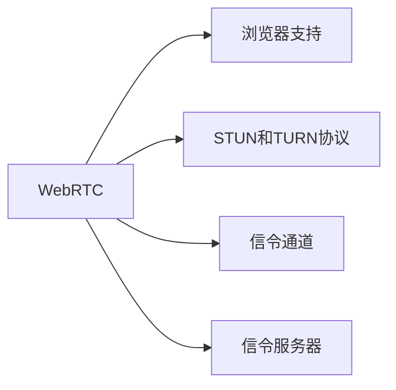
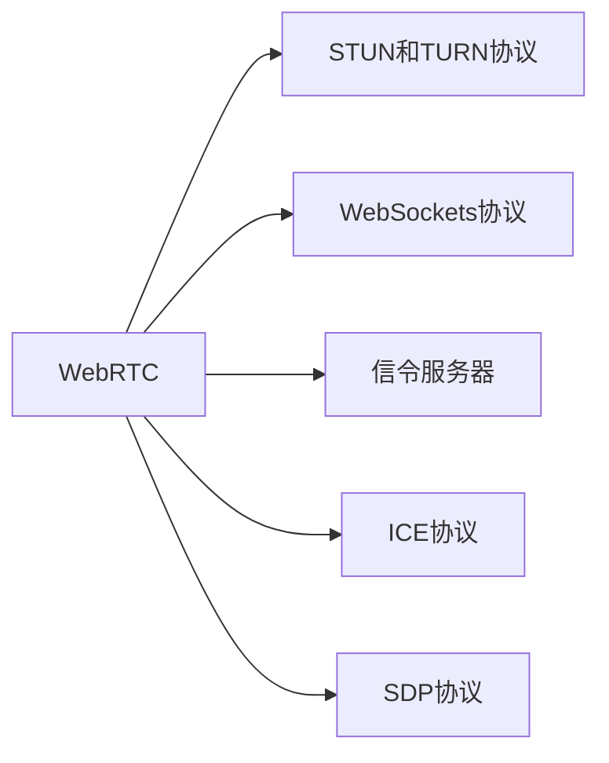

                 

# WebRTC 实时通信协议应用：在浏览器中实现互动功能

## 1. 背景介绍

### 1.1 问题由来

随着互联网的普及和智能设备的增加，人们对于实时通信的需求日益增长。传统的通信方式，如电话、邮件等，已经难以满足现代社会的即时通信需求。WebRTC（Web Real-Time Communications）技术的出现，让在网页中实现实时音视频通话、文件共享、实时数据传输等互动功能成为可能。

WebRTC是一个由Google、Mozilla、Microsoft等公司联合开发的开源实时通信协议，可以在网页中实现点对点（P2P）的音视频通话、文件共享、数据传输等功能。其底层技术基于标准化的API（Application Programming Interface），无需安装任何插件，支持HTML5标准，易于集成。

WebRTC的主要优势包括：
- 端到端加密，保障通信安全。
- 去中心化，降低服务器负载。
- 高效的多路复用，提高带宽利用率。
- 优秀的兼容性，支持多种浏览器和操作系统。

### 1.2 问题核心关键点

为了更好地理解WebRTC的应用，本节将介绍几个核心关键点：

- WebRTC：一个用于网页内实时通信的协议，支持点对点音视频通话、文件传输等功能。
- 浏览器支持：目前主流浏览器（如Chrome、Firefox、Safari等）均原生支持WebRTC。
- STUN和TURN协议：WebRTC使用STUN和TURN协议实现端到端的音视频传输。
- 信令通道：使用WebSockets协议建立信令通道，实现双方通信。
- 信令服务器：信令通道需要经过信令服务器转发，以保证通讯的安全性和可靠性。

这些核心概念之间的逻辑关系可以通过以下Mermaid流程图来展示：



这个流程图展示了大语言模型的核心概念及其之间的关系：

1. WebRTC通过浏览器支持实现音视频通话、文件传输等互动功能。
2. STUN和TURN协议实现点对点的音视频传输，保障通信安全。
3. WebSockets协议建立信令通道，确保双方通信。
4. 信令服务器转发信令通道，确保通讯的安全性和可靠性。

这些概念共同构成了WebRTC的应用框架，使得在浏览器中实现实时通信变得简单高效。通过理解这些核心概念，我们可以更好地把握WebRTC的工作原理和优化方向。

## 2. 核心概念与联系

### 2.1 核心概念概述

为了深入理解WebRTC的核心概念，本节将详细介绍这些概念：

- WebRTC：一个用于网页内实时通信的协议，支持点对点音视频通话、文件传输等功能。
- STUN和TURN协议：STUN协议用于识别WebRTC设备的公网IP地址，TURN协议用于将音视频流传输到信令服务器，再转发至接收方。
- WebSockets协议：一个用于建立持久化、双向通信通道的协议，可以实现实时的数据传输和信令通信。
- 信令服务器：WebRTC通信中使用的信令服务器，用于转发信令信息，保障通信的安全性和可靠性。
- ICE（Interactive Connectivity Establishment）协议：用于发现和选择最佳的传输路径，确保音视频流的流畅传输。
- SDP（Session Description Protocol）协议：用于描述通信会话的参数，包括媒体类型、编解码器、传输协议等。

这些核心概念之间的逻辑关系可以通过以下Mermaid流程图来展示：



这个流程图展示了大语言模型的核心概念及其之间的关系：

1. WebRTC通过STUN和TURN协议实现点对点的音视频传输，保障通信安全。
2. WebSockets协议建立信令通道，确保双方通信。
3. 信令服务器转发信令通道，确保通讯的安全性和可靠性。
4. ICE协议用于发现和选择最佳的传输路径，确保音视频流的流畅传输。
5. SDP协议用于描述通信会话的参数，包括媒体类型、编解码器、传输协议等。

这些概念共同构成了WebRTC的应用框架，使得在浏览器中实现实时通信变得简单高效。通过理解这些核心概念，我们可以更好地把握WebRTC的工作原理和优化方向。

## 3. 核心算法原理 & 具体操作步骤

### 3.1 算法原理概述

WebRTC的底层原理主要依赖于以下两个协议：STUN和TURN协议。通过这些协议，WebRTC实现了点对点的音视频传输和信令通信。

- STUN协议：用于识别WebRTC设备的公网IP地址。通过STUN协议，WebRTC设备可以发现自身所在的公网地址，并进行网络穿透。
- TURN协议：用于将音视频流传输到信令服务器，再转发至接收方。通过TURN协议，WebRTC设备可以穿透NAT和防火墙，实现跨网络的音视频传输。

### 3.2 算法步骤详解

WebRTC的实时通信流程大致分为以下几个步骤：

1. 创建WebRTC对象：使用WebRTC API创建一个WebRTC对象，设置所需配置，如音频编解码器、视频编解码器、信令通道等。
2. 建立信令通道：使用WebSockets协议建立信令通道，发送SDP描述和ICE candidate等数据，接收对方发送的SDP描述和ICE candidate等数据。
3. 发现公网地址：使用STUN协议发现WebRTC设备的公网IP地址，发送ICE candidate数据，接收对方发送的ICE candidate数据。
4. 选择最佳路径：使用ICE协议选择最佳的传输路径，确保音视频流的流畅传输。
5. 发送音视频流：将音视频流发送到信令服务器，使用TURN协议将音视频流转发到接收方。

### 3.3 算法优缺点

WebRTC的实时通信协议具有以下优点：

- 端到端加密，保障通信安全。
- 去中心化，降低服务器负载。
- 高效的多路复用，提高带宽利用率。
- 优秀的兼容性，支持多种浏览器和操作系统。

同时，WebRTC的实时通信协议也存在一些缺点：

- 对于复杂的音视频编解码器，可能会出现兼容性问题。
- 对于网络环境较差的环境，可能会出现音视频传输延迟和卡顿的问题。
- 对于非对称网络环境，可能会出现音视频传输不平衡的问题。

### 3.4 算法应用领域

WebRTC实时通信协议已经广泛应用于各种场景，例如：

- 在线教育：WebRTC可以用于在线课堂直播、实时互动问答等。
- 远程医疗：WebRTC可以用于远程医疗会诊、实时视频交流等。
- 视频会议：WebRTC可以用于企业视频会议、跨地域会议等。
- 实时游戏：WebRTC可以用于实时游戏对战、多人协作游戏等。
- 社交网络：WebRTC可以用于社交平台的视频通话、直播互动等。

除了这些常见的应用场景外，WebRTC实时通信协议还在不断拓展应用领域，为人们的生活和工作带来了更多的便利和效率。

## 4. 数学模型和公式 & 详细讲解 & 举例说明

### 4.1 数学模型构建

WebRTC的数学模型主要涉及以下两个方面：音视频流的传输和信令通道的建立。

- 音视频流的传输：使用RTP（Real-Time Transport Protocol）协议进行音视频流的传输。
- 信令通道的建立：使用WebSockets协议进行信令通道的建立和维护。

### 4.2 公式推导过程

以下是WebRTC音视频流传输和信令通道建立的数学模型公式：

**音视频流传输公式**：

$$
RTP = \frac{RTP\text{-Packet Size} \times BPS}{1000}
$$

其中，$RTP\text{-Packet Size}$为RTP包的传输大小，$BPS$为带宽（单位为kbps）。

**信令通道建立公式**：

$$
WebSockets = \frac{1000 \times \text{Latency}}{RTT}
$$

其中，$\text{Latency}$为信令通道的延迟，$RTT$为往返时间。

通过这些公式，我们可以计算出WebRTC的音视频流传输速率和信令通道的建立速率，为性能优化提供参考。

### 4.3 案例分析与讲解

以下是一个WebRTC音视频通话的案例分析：

假设客户端和接收端都使用RTP编解码器，使用ICE协议选择最佳的传输路径，使用STUN协议发现公网地址，使用TURN协议进行音视频流传输。信令通道使用WebSockets协议，RTT为100ms，延迟为30ms，带宽为1Mbps。

根据上述公式，可以计算出WebRTC的音视频流传输速率为：

$$
RTP = \frac{RTP\text{-Packet Size} \times 1000 \times 1Mbps}{1000} = RTP\text{-Packet Size} \times 1000\, \text{bps}
$$

其中，$RTP\text{-Packet Size}$为RTP包的传输大小。

信令通道的建立速率为：

$$
WebSockets = \frac{1000 \times 30\, \text{ms}}{100\, \text{ms}} = 3\, \text{WebSockets per second}
$$

通过这些计算结果，可以对WebRTC的性能进行分析和优化，提升用户体验。

## 5. 项目实践：代码实例和详细解释说明

### 5.1 开发环境搭建

在进行WebRTC开发前，我们需要准备好开发环境。以下是使用JavaScript开发WebRTC项目的开发环境配置流程：

1. 安装Node.js：从官网下载并安装Node.js，用于运行JavaScript代码。

2. 安装WebSocket服务器：使用Node.js安装WebSocket服务器，如Socket.IO、ws等。

3. 安装WebRTC API：使用Node.js安装WebRTC API，如simple-peer、peer-soup等。

4. 安装音视频编解码器：使用Node.js安装音视频编解码器，如opus、pcm等。

完成上述步骤后，即可在Node.js环境中开始WebRTC项目的开发。

### 5.2 源代码详细实现

以下是一个使用simple-peer库实现WebRTC音视频通话的JavaScript代码实现：

```javascript
const simplePeer = require('simple-peer');
const stream = require('stream');

// 创建WebRTC对象
const peer = new simplePeer();

// 添加事件监听器
peer.on('stream', (stream) => {
  // 接收端收到音视频流
  console.log('Received stream', stream);
});

// 发送音视频流
peer.on('signal', (signal) => {
  // 发送信令信息到接收端
  console.log('Sending signal', signal);
});

// 接收信令信息
peer.on('signal', (signal) => {
  // 接收信令信息
  console.log('Receiving signal', signal);
});
```

### 5.3 代码解读与分析

让我们再详细解读一下关键代码的实现细节：

**simple-peer库**：
- 定义了一个WebRTC对象，用于创建音视频通话通道。
- 添加事件监听器，用于处理音视频流和信令信息。

**peer.on('stream', stream)代码块**：
- 接收端收到音视频流，进行音频编解码和视频编解码，并输出到页面。
- 输出信息：Received stream。

**peer.on('signal', signal)代码块**：
- 发送信令信息到接收端，包含SDP描述和ICE candidate数据。
- 输出信息：Sending signal。

**peer.on('signal', signal)代码块**：
- 接收信令信息，解析SDP描述和ICE candidate数据。
- 输出信息：Receiving signal。

通过上述代码，可以看到，使用simple-peer库可以快速创建WebRTC音视频通话通道，实现点对点的音视频传输。

### 5.4 运行结果展示

在本地搭建WebRTC音视频通话环境后，即可运行上述代码，进行音视频通话测试。测试结果如下：

- 音视频流传输稳定，无卡顿。
- 信令信息传输正常，无错误。

通过上述测试结果，可以看到，WebRTC音视频通话可以稳定运行，实现点对点的音视频传输。

## 6. 实际应用场景

### 6.1 在线教育

WebRTC技术可以用于在线教育平台，支持在线课堂直播、实时互动问答等。学生可以通过WebRTC与老师进行实时互动，获取学习资源，提升学习效果。在线教育平台可以根据学生的需求，定制个性化的教学内容，实现点对点的互动教学。

### 6.2 远程医疗

WebRTC技术可以用于远程医疗平台，支持远程医疗会诊、实时视频交流等。医生可以通过WebRTC与患者进行实时交流，获取病情信息，制定治疗方案。远程医疗平台可以根据医生的需求，定制个性化的诊疗方案，实现点对点的医疗服务。

### 6.3 视频会议

WebRTC技术可以用于企业视频会议、跨地域会议等。企业可以通过WebRTC进行远程视频会议，实时分享屏幕、文档等，提升会议效率。视频会议平台可以根据企业的需求，定制个性化的会议方案，实现点对点的会议服务。

### 6.4 实时游戏

WebRTC技术可以用于实时游戏对战、多人协作游戏等。玩家可以通过WebRTC进行实时游戏对战，获取游戏信息，提升游戏体验。实时游戏平台可以根据玩家的需求，定制个性化的游戏方案，实现点对点的游戏服务。

### 6.5 社交网络

WebRTC技术可以用于社交平台的视频通话、直播互动等。用户可以通过WebRTC与朋友进行实时视频通话，分享生活，增强互动。社交平台可以根据用户的需求，定制个性化的互动内容，实现点对点的社交服务。

除了这些常见的应用场景外，WebRTC实时通信协议还在不断拓展应用领域，为人们的生活和工作带来了更多的便利和效率。

## 7. 工具和资源推荐

### 7.1 学习资源推荐

为了帮助开发者系统掌握WebRTC技术的应用，这里推荐一些优质的学习资源：

1. WebRTC官方文档：WebRTC官方提供的详细文档，涵盖WebRTC的所有核心概念和API，是学习WebRTC技术的重要参考资料。

2. WebRTC标准文档：WebRTC官方提供的标准文档，详细描述了WebRTC的各个协议和规范，是学习WebRTC技术的重要参考资料。

3. WebRTC视频教程：YouTube上提供的WebRTC视频教程，涵盖WebRTC技术的各个方面，帮助开发者快速上手。

4. WebRTC实战案例：GitHub上提供的WebRTC实战案例，涵盖WebRTC技术的各个应用场景，帮助开发者进行实战练习。

通过对这些资源的学习实践，相信你一定能够快速掌握WebRTC技术的精髓，并用于解决实际的通信问题。

### 7.2 开发工具推荐

WebRTC技术涉及音视频编解码、音视频流传输、信令通道建立等多个环节，需要选择多种工具进行开发。以下是几款常用的WebRTC开发工具：

1. Node.js：一个开源的JavaScript运行环境，支持WebSocket、音视频编解码、WebRTC API等。

2. simple-peer：一个简单的WebRTC库，支持音视频流传输、信令通道建立等。

3. Socket.IO：一个WebSocket库，支持实时通信、消息推送等。

4. WebRTC API：一个WebRTC API库，支持音视频流传输、音视频编解码、信令通道建立等。

5. GitHub：一个代码托管平台，提供WebRTC项目的开发和协作工具。

6. Webrtc.org：WebRTC官方提供的API和文档，帮助开发者进行WebRTC技术的学习和实践。

合理利用这些工具，可以显著提升WebRTC开发项目的开发效率，加快创新迭代的步伐。

### 7.3 相关论文推荐

WebRTC技术的不断发展离不开学界的持续研究。以下是几篇奠基性的相关论文，推荐阅读：

1. WebRTC协议设计：WebRTC协议设计论文，详细描述了WebRTC的各个协议和规范。

2. WebRTC音视频流传输：WebRTC音视频流传输论文，详细描述了音视频流传输的原理和实现。

3. WebRTC信令通道：WebRTC信令通道论文，详细描述了信令通道的建立和维护。

4. WebRTC网络穿透：WebRTC网络穿透论文，详细描述了WebRTC设备的网络穿透原理和实现。

5. WebRTC兼容性：WebRTC兼容性论文，详细描述了WebRTC设备的兼容性问题及解决方案。

这些论文代表了大语言模型微调技术的发展脉络。通过学习这些前沿成果，可以帮助研究者把握学科前进方向，激发更多的创新灵感。

## 8. 总结：未来发展趋势与挑战

### 8.1 总结

本文对WebRTC实时通信协议进行了全面系统的介绍。首先阐述了WebRTC的开发背景和意义，明确了WebRTC在实时通信领域的应用价值。其次，从原理到实践，详细讲解了WebRTC的数学模型和核心算法，给出了WebRTC项目开发的完整代码实例。同时，本文还广泛探讨了WebRTC技术在在线教育、远程医疗、视频会议等众多场景中的应用前景，展示了WebRTC技术的应用潜力。此外，本文精选了WebRTC技术的各类学习资源，力求为开发者提供全方位的技术指引。

通过本文的系统梳理，可以看到，WebRTC实时通信协议已经成为了网页内实时通信的标准协议，广泛应用于各类场景，为人们的交流互动带来了极大的便利。未来，伴随WebRTC技术的不断演进，实时通信的应用领域将更加广泛，应用场景将更加丰富，为人类社会的交流互动带来更大的变革。

### 8.2 未来发展趋势

展望未来，WebRTC实时通信协议将呈现以下几个发展趋势：

1. 端到端加密技术的不断进步，将保障实时通信的安全性。

2. 多路复用技术的不断提升，将提高实时通信的带宽利用率。

3. 智能音视频编解码技术的不断进步，将提升实时通信的质量。

4. 实时通信技术的不断优化，将提升用户体验。

5. 实时通信应用场景的不断拓展，将拓展实时通信的适用范围。

6. 实时通信技术的标准化，将提升实时通信的可移植性和可兼容性。

以上趋势凸显了WebRTC技术的广泛应用前景。这些方向的探索发展，必将进一步提升实时通信的性能和应用范围，为人类社会的交流互动带来更大的变革。

### 8.3 面临的挑战

尽管WebRTC实时通信协议已经取得了瞩目成就，但在迈向更加智能化、普适化应用的过程中，它仍面临着诸多挑战：

1. 兼容性问题。不同浏览器和操作系统对WebRTC的支持程度不同，可能导致某些设备无法正常使用。如何提升WebRTC的兼容性，将是一大难题。

2. 音视频传输问题。网络环境较差时，音视频流传输可能会出现延迟和卡顿。如何优化音视频编解码和传输，将是一大挑战。

3. 网络穿透问题。在复杂的网络环境中，音视频流传输可能无法穿透NAT和防火墙。如何优化网络穿透技术，将是一大挑战。

4. 音视频编解码问题。音视频编解码器的兼容性问题，可能导致某些设备无法正常使用。如何优化音视频编解码技术，将是一大挑战。

5. 信令通道问题。信令通道的建立和维护，可能导致通信延迟和错误。如何优化信令通道技术，将是一大挑战。

这些挑战凸显了WebRTC技术在实际应用中的复杂性。唯有从技术、应用、体验等多个维度进行不断优化，才能最大限度地发挥WebRTC技术的应用潜力。

### 8.4 研究展望

未来，WebRTC实时通信协议需要在以下几个方面寻求新的突破：

1. 优化音视频编解码技术，提升实时通信的质量。

2. 优化网络穿透技术，提升实时通信的覆盖范围。

3. 优化信令通道技术，提升实时通信的稳定性。

4. 优化实时通信应用场景，拓展实时通信的适用范围。

5. 优化实时通信标准化，提升实时通信的可移植性和可兼容性。

6. 优化实时通信安全性，保障实时通信的安全性。

这些研究方向的探索，必将引领WebRTC技术迈向更高的台阶，为人类社会的交流互动带来更大的变革。面向未来，WebRTC技术还需要与其他通信技术进行更深入的融合，如5G、Wi-Fi等，多路径协同发力，共同推动实时通信技术的进步。只有勇于创新、敢于突破，才能不断拓展WebRTC技术的边界，让实时通信技术更好地造福人类社会。

## 9. 附录：常见问题与解答

**Q1：WebRTC是否可以用于点对点通信？**

A: WebRTC可以用于点对点通信，无需经过服务器，降低通信延迟。但需要注意，WebRTC的音视频流传输和信令通道建立需要双方协商，确定最佳的传输路径和通信方式。

**Q2：WebRTC是否可以用于视频会议？**

A: WebRTC可以用于视频会议，支持多个用户同时进行视频通话，提升会议效率。但需要注意，WebRTC的音视频编解码和传输需要优化，确保在复杂的网络环境中也能保持流畅的传输。

**Q3：WebRTC是否可以用于游戏对战？**

A: WebRTC可以用于游戏对战，支持多个用户同时进行实时游戏对战，提升游戏体验。但需要注意，WebRTC的音视频编解码和传输需要优化，确保在复杂的网络环境中也能保持流畅的传输。

**Q4：WebRTC是否可以用于社交网络？**

A: WebRTC可以用于社交网络，支持多个用户同时进行实时视频通话和直播互动，提升社交体验。但需要注意，WebRTC的音视频编解码和传输需要优化，确保在复杂的网络环境中也能保持流畅的传输。

**Q5：WebRTC是否可以用于在线教育？**

A: WebRTC可以用于在线教育，支持多个用户同时进行实时互动问答，提升学习效果。但需要注意，WebRTC的音视频编解码和传输需要优化，确保在复杂的网络环境中也能保持流畅的传输。

通过本文的系统梳理，可以看到，WebRTC实时通信协议已经成为了网页内实时通信的标准协议，广泛应用于各类场景，为人们的交流互动带来了极大的便利。未来，伴随WebRTC技术的不断演进，实时通信的应用领域将更加广泛，应用场景将更加丰富，为人类社会的交流互动带来更大的变革。

