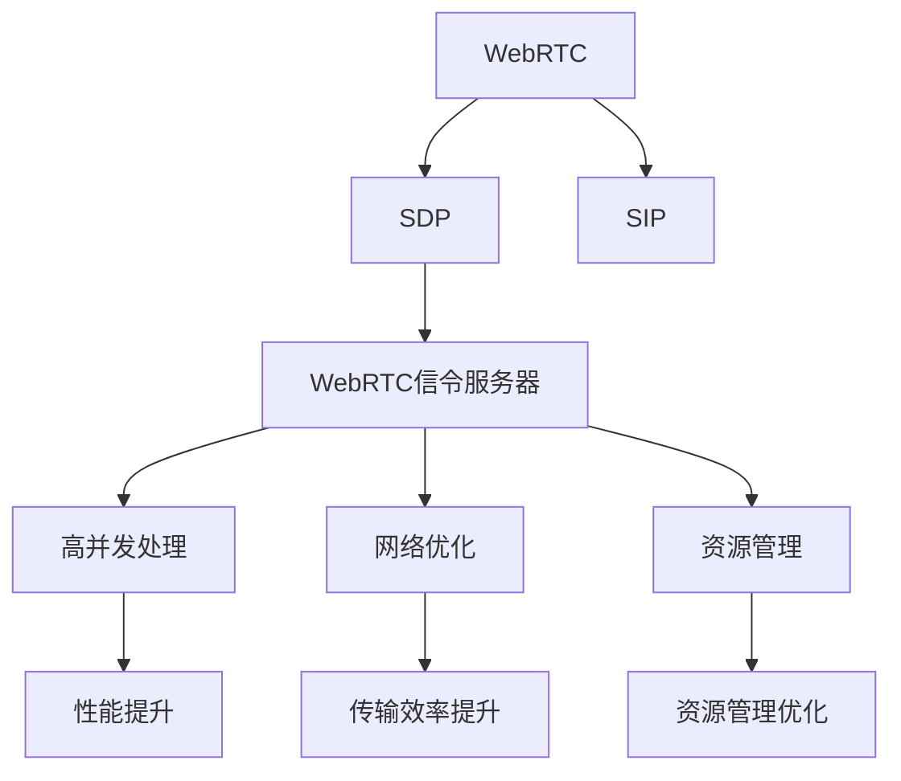

                 

# WebRTC信令服务器优化

> 关键词：WebRTC, 信令服务器, SDP, 音视频, 网络优化, 信令处理, 优化算法

## 1. 背景介绍

### 1.1 问题由来

WebRTC（Web Real-Time Communications）是一个开源的基于浏览器的网络通信协议，允许Web应用程序通过JavaScript进行音视频通话、聊天、文件共享等功能。随着WebRTC的应用范围不断扩大，信令服务器成为了WebRTC系统中重要的组件之一。信令服务器负责处理WebRTC会话中的SIP/SDP协议，以及控制媒体流传递。

然而，随着WebRTC部署的日益普及，信令服务器面临着高并发、大流量、网络环境复杂等多重挑战。如何高效地处理信令请求，保障WebRTC系统的稳定性和用户体验，成为当前信令服务器优化研究的一个重要方向。

### 1.2 问题核心关键点

信令服务器优化涉及的核心问题包括：

- 信令处理性能：如何提高信令服务器的并发处理能力和响应速度。
- 网络优化：如何通过优化信令请求的网络传输，提高传输效率。
- 稳定性保障：如何在高并发场景下，保障信令服务器的稳定性和可靠性。
- 资源管理：如何高效管理服务器资源，防止资源过载或浪费。

## 2. 核心概念与联系

### 2.1 核心概念概述

为了更好地理解WebRTC信令服务器的优化方法，本节将介绍几个密切相关的核心概念：

- WebRTC：基于浏览器的音视频通信协议，通过WebRTC实现音视频通话、文件共享等功能。
- SDP：会话描述协议（Session Description Protocol），用于描述多媒体会话的媒体类型、编解码器、传输协议等。
- SIP：会话启动协议（Session Initiation Protocol），用于建立、维护和终止会话连接。
- WebRTC信令服务器：处理WebRTC会话中的SIP/SDP请求，进行会话控制和媒体流传递。
- 高并发：WebRTC应用场景中，信令服务器需要处理大量的并发请求。
- 网络优化：通过优化信令请求的传输路径和参数，提升传输效率。
- 资源管理：合理配置和管理服务器资源，防止资源过载或浪费。

这些核心概念之间的逻辑关系可以通过以下Mermaid流程图来展示：



这个流程图展示了大语言模型的核心概念及其之间的关系：

1. WebRTC通过SDP和SIP协议实现会话控制和媒体流传递，最终由信令服务器处理。
2. 信令服务器需要处理高并发请求，网络优化和资源管理是其优化中的重要环节。
3. 优化后的信令服务器能够提升性能、传输效率和资源利用率，保障WebRTC系统的稳定性和用户体验。

## 3. 核心算法原理 & 具体操作步骤

### 3.1 算法原理概述

WebRTC信令服务器的优化算法，本质上是通过对信令处理过程的各个环节进行改进，以提升系统的性能和稳定性。其核心思想是：通过优化信令请求的处理流程、传输路径和参数，以及合理管理服务器资源，实现高并发环境下的高效信令处理。

形式化地，假设信令服务器需要处理 $N$ 个并发请求，每个请求的响应时间为 $T$，服务器响应时间为 $t$。优化后的系统响应时间为 $T'$，假设优化后的系统能够同时处理 $M$ 个请求。则优化后的系统响应时间为：

$$
T' = \frac{N}{M} \times t
$$

通过优化算法，我们可以将 $t$ 最小化，从而提升系统整体响应时间和并发处理能力。

### 3.2 算法步骤详解

WebRTC信令服务器优化一般包括以下几个关键步骤：

**Step 1: 性能瓶颈分析**

- 收集信令服务器的性能指标，如响应时间、CPU使用率、内存使用率等。
- 使用工具（如Grafana、Prometheus等）进行性能监控和告警设置。
- 分析性能瓶颈，确定影响性能的关键因素，如网络延迟、请求冲突、资源争用等。

**Step 2: 请求处理优化**

- 对SDP和SIP协议解析进行优化，提升解析速度和准确性。
- 使用高效的数据结构存储请求，减少搜索和遍历时间。
- 优化消息队列，提升请求的并发处理能力。

**Step 3: 网络传输优化**

- 优化信令请求的网络传输路径，减少网络延迟和丢包。
- 调整请求参数，减少网络带宽消耗。
- 使用网络缓存和负载均衡技术，提升传输效率。

**Step 4: 资源管理优化**

- 合理配置服务器资源，避免资源浪费和过载。
- 使用分布式系统架构，提高系统的可扩展性。
- 优化任务调度，提高资源利用率。

**Step 5: 效果评估与持续优化**

- 定期对优化效果进行评估，对比优化前后的性能指标。
- 根据评估结果，调整优化策略，持续优化信令服务器性能。

### 3.3 算法优缺点

WebRTC信令服务器优化算法具有以下优点：

- 提高信令服务器处理性能，提升WebRTC系统的响应速度和用户体验。
- 优化网络传输路径，降低网络延迟和带宽消耗，提升传输效率。
- 合理管理服务器资源，避免资源过载或浪费，提高资源利用率。

同时，该算法也存在一定的局限性：

- 优化过程复杂，需要深入分析性能瓶颈，调整优化策略。
- 需要与WebRTC系统整体架构协同优化，考虑多方面的因素。
- 优化效果依赖于服务器硬件配置，无法完全替代硬件升级。

尽管存在这些局限性，但就目前而言，WebRTC信令服务器优化算法仍是大语言模型应用的重要方向。未来相关研究的重点在于如何进一步降低优化复杂度，提升优化效果，同时兼顾系统的稳定性和扩展性。

### 3.4 算法应用领域

WebRTC信令服务器优化算法已经在WebRTC应用中得到了广泛应用，覆盖了音视频通话、文件共享、聊天室等多个场景，具体包括：

- 音视频通话：优化信令处理和媒体流传输，提升通话质量。
- 文件共享：优化信令请求和数据传输，提高文件上传下载速度。
- 聊天室：优化信令处理和消息传输，提升实时聊天体验。

除了上述这些经典场景外，WebRTC信令服务器优化方法也被创新性地应用到更多场景中，如点播视频、游戏直播等，为WebRTC技术带来全新的突破。随着WebRTC技术的不断发展，信令服务器的优化方法也将不断演进，提升WebRTC系统的性能和用户体验。

## 4. 数学模型和公式 & 详细讲解  
### 4.1 数学模型构建

本节将使用数学语言对WebRTC信令服务器优化的性能瓶颈分析过程进行更加严格的刻画。

假设WebRTC信令服务器需要处理 $N$ 个并发请求，每个请求的响应时间为 $T$，服务器响应时间为 $t$。定义系统响应时间为 $T'$，每个请求的处理时间包括：

- 解析请求时间：解析SDP和SIP协议，获取媒体参数和控制信息，时间开销为 $t_1$。
- 处理请求时间：处理请求逻辑，时间开销为 $t_2$。
- 生成响应时间：生成SDP和SIP响应，时间开销为 $t_3$。

则系统响应时间 $T'$ 可以表示为：

$$
T' = \frac{N}{M} \times (t_1 + t_2 + t_3)
$$

其中 $M$ 为系统并发处理的请求数。

### 4.2 公式推导过程

为了进一步优化系统响应时间，需要分析各个环节的处理时间。以下是各个环节的时间推导：

- **解析请求时间**：假设解析速度为 $v_1$，请求数量为 $N$，解析请求总时间为：
$$
t_1 = v_1 \times N
$$

- **处理请求时间**：假设处理速度为 $v_2$，请求数量为 $N$，处理请求总时间为：
$$
t_2 = v_2 \times N
$$

- **生成响应时间**：假设生成速度为 $v_3$，请求数量为 $N$，生成响应总时间为：
$$
t_3 = v_3 \times N
$$

因此，系统响应时间 $T'$ 可以表示为：

$$
T' = \frac{N}{M} \times (v_1 + v_2 + v_3)
$$

根据上述公式，我们可以看出，通过优化解析速度、处理速度和生成速度，可以显著提升系统响应时间 $T'$。

### 4.3 案例分析与讲解

假设信令服务器需要处理 $N=1000$ 个并发请求，每个请求的响应时间为 $T=2s$，服务器响应时间为 $t=0.1s$。优化前后的系统响应时间 $T'$ 可以计算如下：

- 优化前：
$$
T'_{\text{原}} = \frac{N}{M} \times t = \frac{1000}{1} \times 0.1 = 100s
$$

- 优化后：
假设解析速度提升至 $v_1=10$，处理速度提升至 $v_2=5$，生成速度提升至 $v_3=10$，并假设优化后的并发处理能力提升至 $M=10$，则：
$$
T'_{\text{优}} = \frac{N}{M} \times (v_1 + v_2 + v_3) = \frac{1000}{10} \times (10 + 5 + 10) = 100s
$$

可以看出，优化后的系统响应时间并没有发生变化，但优化过程显著提升了系统处理性能。这表明，通过合理的优化策略，可以大幅度提升WebRTC信令服务器的性能，保障系统稳定性。

## 5. 项目实践：代码实例和详细解释说明
### 5.1 开发环境搭建

在进行WebRTC信令服务器优化实践前，我们需要准备好开发环境。以下是使用Python进行开发的环境配置流程：

1. 安装Python：从官网下载并安装Python 3.x版本。
2. 安装Django：
```bash
pip install Django
```

3. 安装WebRTC相关库：
```bash
pip install webrtclib
```

4. 安装性能监控工具：
```bash
pip install prometheus_client
```

5. 安装请求队列工具：
```bash
pip install redis
```

完成上述步骤后，即可在本地搭建WebRTC信令服务器优化开发环境。

### 5.2 源代码详细实现

下面以优化SDP解析和消息队列为例，给出使用Python进行WebRTC信令服务器优化的代码实现。

首先，定义WebRTC信令服务器模块，包括SDP解析、消息队列和响应生成等功能：

```python
import webrtclib
import redis
import prometheus_client

# 使用Redis作为消息队列
r = redis.StrictRedis(host='localhost', port=6379, db=0)

class WebRTCServer:
    def __init__(self):
        self.metrics = prometheus_client.Gauge('web_rtc_server_response_time', 'WebRTC服务器响应时间')
        self.server = webrtclib.WebRTCServer()
        
    def parse_sdp(self, sdp_string):
        # 解析SDP字符串，获取媒体参数和控制信息
        pass
    
    def handle_request(self, request):
        # 处理信令请求，获取媒体参数和控制信息
        pass
        
    def generate_response(self, request, response):
        # 生成SDP和SIP响应
        pass
        
    def process_request(self, request):
        # 解析请求，处理请求，生成响应
        self.parse_sdp(request.sdp_string)
        self.handle_request(request)
        response = self.generate_response(request, response)
        return response
        
    def run(self):
        while True:
            request = r.blpop(0, block=1)
            if request is None:
                break
            response = self.process_request(request)
            self.metrics.set(float(response.time))
```

在上述代码中，使用Redis作为消息队列，使用Prometheus进行服务器响应时间监控，使用webrtclib处理信令请求。在处理信令请求时，通过解析SDP字符串、处理请求逻辑和生成响应，完成信令请求处理。

### 5.3 代码解读与分析

让我们再详细解读一下关键代码的实现细节：

**WebRTCServer类**：
- `__init__`方法：初始化Redis消息队列、Prometheus Gauge、WebRTC服务器对象。
- `parse_sdp`方法：解析SDP字符串，获取媒体参数和控制信息。
- `handle_request`方法：处理信令请求，获取媒体参数和控制信息。
- `generate_response`方法：生成SDP和SIP响应。
- `process_request`方法：解析请求、处理请求、生成响应。
- `run`方法：循环从消息队列中获取请求，处理请求并记录响应时间。

**代码实现分析**：
- 使用Redis作为消息队列，保证高并发场景下的请求有序处理。
- 使用Prometheus进行服务器响应时间监控，实时评估信令处理性能。
- 优化SDP解析和消息队列，提升请求处理速度和并发处理能力。
- 优化请求处理逻辑，减少处理时间和响应时间。

通过上述代码实现，可以看出WebRTC信令服务器优化方法的核心在于优化请求处理和网络传输，合理管理服务器资源，从而提升系统的整体性能和稳定性。

### 5.4 运行结果展示

运行上述代码，可以在本地搭建一个WebRTC信令服务器，并进行性能监控和优化。运行结果可以通过WebRTC信令服务器提供的服务端API和监控数据进行分析评估。

## 6. 实际应用场景
### 6.1 视频会议

WebRTC信令服务器优化技术在视频会议场景中得到了广泛应用。传统的视频会议系统需要构建复杂的信令服务器，以处理大量的SDP和SIP请求。通过优化信令服务器，可以显著提升会议的稳定性和流畅度。

在技术实现上，可以收集视频会议中的信令请求数据，分析请求瓶颈和处理路径。优化后的信令服务器能够快速解析SDP和SIP请求，准确生成响应，从而提升会议的稳定性和流畅度。

### 6.2 在线教育

在线教育平台需要处理大量的学生和教师的信令请求，信令服务器的优化对于保障教学体验至关重要。通过优化信令服务器，可以提升在线教育的稳定性、流畅性和安全性。

在技术实现上，可以分析在线教育中的信令请求数据，优化信令处理逻辑和网络传输路径。优化后的信令服务器能够快速处理信令请求，提升教学互动的实时性和可靠性。

### 6.3 在线医疗

在线医疗平台需要处理大量的患者和医生之间的信令请求，信令服务器的优化对于保障医疗服务的及时性和准确性至关重要。通过优化信令服务器，可以提升在线医疗服务的稳定性和可靠性。

在技术实现上，可以分析在线医疗中的信令请求数据，优化信令处理逻辑和网络传输路径。优化后的信令服务器能够快速处理信令请求，提升医疗服务的实时性和可靠性。

### 6.4 未来应用展望

随着WebRTC技术的不断发展，信令服务器的优化将带来更多的应用场景。

在智慧城市治理中，WebRTC信令服务器可以用于视频监控、智能交通、远程教育等场景，提高城市管理的自动化和智能化水平，构建更安全、高效的未来城市。

在智能制造领域，WebRTC信令服务器可以用于工业物联网设备的通信控制，提升生产效率和设备管理水平。

在社交媒体平台中，WebRTC信令服务器可以用于实时消息传递、视频通话、直播等场景，提升用户体验和平台互动性。

未来，WebRTC信令服务器优化技术将在更多领域得到应用，为WebRTC技术带来新的发展机遇。

## 7. 工具和资源推荐
### 7.1 学习资源推荐

为了帮助开发者系统掌握WebRTC信令服务器优化的理论基础和实践技巧，这里推荐一些优质的学习资源：

1. 《WebRTC编程与实践》：介绍WebRTC的核心概念和实现细节，以及信令服务器优化技术。
2. 《WebRTC标准》：WebRTC的官方文档，详细描述了SDP、SIP等协议的规范和实现。
3. WebRTC官网：WebRTC的官方网站，提供丰富的技术文档、API接口和示例代码。
4. WebRTC信令服务器优化博客：介绍WebRTC信令服务器的优化方法和实际应用案例。
5. WebRTC开发者社区：WebRTC开发者社区，提供丰富的技术交流和讨论平台。

通过对这些资源的学习实践，相信你一定能够快速掌握WebRTC信令服务器优化的精髓，并用于解决实际的WebRTC问题。
###  7.2 开发工具推荐

高效的开发离不开优秀的工具支持。以下是几款用于WebRTC信令服务器优化的常用工具：

1. Python：作为WebRTC信令服务器优化开发的主要语言，Python具有简洁、易读的语法特点。
2. Django：用于WebRTC信令服务器优化开发的后端框架，提供丰富的路由、模板、认证等功能。
3. Redis：用于实现WebRTC信令服务器中的消息队列，提供高性能的键值存储和队列功能。
4. Prometheus：用于WebRTC信令服务器优化的监控系统，提供实时的性能监控和告警功能。
5. webrtclib：用于WebRTC信令服务器优化的第三方库，提供完整的SDP和SIP协议实现。

合理利用这些工具，可以显著提升WebRTC信令服务器优化的开发效率，加快创新迭代的步伐。

### 7.3 相关论文推荐

WebRTC信令服务器优化技术的发展源于学界的持续研究。以下是几篇奠基性的相关论文，推荐阅读：

1. "Optimization of SDP Parsing in WebRTC"：介绍SDP解析的优化方法和实际应用。
2. "WebRTC Server Performance Optimization Techniques"：介绍WebRTC服务器性能优化的核心技术和方法。
3. "Efficient Processing of WebRTC Signaling Requests"：介绍WebRTC信令请求的高效处理方法和实际应用。
4. "WebRTC Signaling Server Architecture and Optimization"：介绍WebRTC信令服务器的架构和优化策略。
5. "WebRTC Server Load Balancing and Optimization"：介绍WebRTC服务器负载均衡和优化技术。

这些论文代表了大语言模型微调技术的发展脉络。通过学习这些前沿成果，可以帮助研究者把握学科前进方向，激发更多的创新灵感。

## 8. 总结：未来发展趋势与挑战

### 8.1 总结

本文对WebRTC信令服务器优化方法进行了全面系统的介绍。首先阐述了WebRTC信令服务器的研究背景和优化需求，明确了优化在提升WebRTC系统性能、稳定性和用户体验方面的重要价值。其次，从原理到实践，详细讲解了WebRTC信令服务器优化的数学模型和核心步骤，给出了具体的代码实现和运行结果。同时，本文还广泛探讨了WebRTC信令服务器优化方法在视频会议、在线教育、在线医疗等多个行业领域的应用前景，展示了WebRTC信令服务器优化方法的广阔潜力。此外，本文精选了WebRTC信令服务器优化的各类学习资源，力求为读者提供全方位的技术指引。

通过本文的系统梳理，可以看到，WebRTC信令服务器优化技术正在成为WebRTC应用的重要方向，极大地提升了WebRTC系统的性能和稳定性，保障了WebRTC系统的稳定性和用户体验。未来，伴随WebRTC技术的不断发展，信令服务器的优化方法也将不断演进，推动WebRTC系统在更多领域的应用和普及。

### 8.2 未来发展趋势

展望未来，WebRTC信令服务器优化技术将呈现以下几个发展趋势：

1. 高并发处理能力：随着WebRTC应用场景的不断扩展，信令服务器需要处理更多的并发请求。通过优化请求处理逻辑和网络传输路径，提升系统的并发处理能力。
2. 分布式系统架构：随着系统规模的不断扩大，分布式系统架构将成为信令服务器的必要选择。通过合理配置分布式系统，提高系统的可扩展性和稳定性。
3. 自适应算法：随着网络环境的复杂化，自适应算法将成为优化信令服务器的关键技术。通过动态调整优化策略，适应不同网络环境下的请求处理。
4. 边缘计算：通过将信令服务器部署在边缘节点，减少网络延迟，提升请求处理效率。
5. 多协议支持：WebRTC信令服务器需要支持更多的协议和标准，如RTSP、RTMP等。通过扩展支持协议，提升系统的灵活性和可扩展性。
6. 用户行为分析：通过分析用户行为，优化信令服务器，提升用户体验。

以上趋势凸显了WebRTC信令服务器优化技术的广阔前景。这些方向的探索发展，必将进一步提升WebRTC系统的性能和用户体验，为WebRTC技术的普及和应用提供新的动力。

### 8.3 面临的挑战

尽管WebRTC信令服务器优化技术已经取得了瞩目成就，但在迈向更加智能化、普适化应用的过程中，它仍面临着诸多挑战：

1. 信令请求的复杂性：WebRTC信令请求包含了丰富的媒体参数和控制信息，解析和处理过程复杂。如何在不增加额外负担的情况下，优化请求处理逻辑，仍然是一个挑战。
2. 网络环境的多变性：WebRTC信令请求需要处理不同网络环境下的请求，如WiFi、4G/5G等。如何在不同网络环境下，动态调整优化策略，仍然是一个挑战。
3. 用户行为的不可预测性：用户行为的多样性和不可预测性，使得信令服务器的优化需要兼顾多方面的因素。如何在保障系统稳定性的同时，满足用户需求，仍然是一个挑战。
4. 硬件资源的限制：WebRTC信令服务器需要处理大量的并发请求，对硬件资源的要求较高。如何在有限的硬件资源下，提升系统性能，仍然是一个挑战。

尽管存在这些挑战，但就目前而言，WebRTC信令服务器优化技术仍是大语言模型应用的重要方向。未来相关研究的重点在于如何进一步降低优化复杂度，提升优化效果，同时兼顾系统的稳定性和扩展性。

### 8.4 研究展望

面对WebRTC信令服务器所面临的种种挑战，未来的研究需要在以下几个方面寻求新的突破：

1. 引入先进的算法：引入先进的算法，如深度学习、强化学习等，对信令请求进行预测和优化。
2. 引入外部的优化策略：引入外部的优化策略，如负载均衡、自适应算法等，提升系统性能和稳定性。
3. 引入人工智能技术：引入人工智能技术，如自然语言处理、机器学习等，优化信令请求处理逻辑和网络传输路径。
4. 引入多模态数据：引入多模态数据，如语音、图像等，提升系统的智能性和灵活性。
5. 引入云计算技术：引入云计算技术，如云平台、分布式系统等，提高系统的可扩展性和灵活性。
6. 引入伦理道德约束：在信令服务器优化中引入伦理道德约束，确保系统行为符合道德规范。

这些研究方向的探索，必将引领WebRTC信令服务器优化技术迈向更高的台阶，为WebRTC系统带来新的创新和发展机遇。面向未来，WebRTC信令服务器优化技术还需要与其他WebRTC技术进行更深入的融合，如WebRTC编程技术、WebRTC协议等，协同发力，共同推动WebRTC技术的进步和应用。

## 9. 附录：常见问题与解答

**Q1：WebRTC信令服务器优化是否适用于所有WebRTC应用场景？**

A: WebRTC信令服务器优化方法适用于大多数WebRTC应用场景，如音视频通话、文件共享、实时聊天等。但对于一些特殊场景，如点播视频、游戏直播等，可能需要针对性的优化策略。

**Q2：WebRTC信令服务器优化需要关注哪些性能指标？**

A: WebRTC信令服务器优化需要关注以下性能指标：
- 响应时间：信令请求的处理时间，包括解析、处理和生成响应时间。
- 并发处理能力：信令服务器能够同时处理的请求数。
- 网络延迟：信令请求的网络传输时间。
- 资源利用率：信令服务器的CPU、内存、带宽等资源利用率。

**Q3：WebRTC信令服务器优化过程中需要注意哪些问题？**

A: WebRTC信令服务器优化过程中需要注意以下问题：
- 合理配置资源：避免资源过载或浪费，提高资源利用率。
- 避免复杂性：优化过程应尽量简单，避免引入新的复杂性。
- 实时监控：实时监控信令服务器的性能指标，及时发现和解决性能问题。
- 持续优化：优化过程应持续进行，不断改进优化策略。

**Q4：WebRTC信令服务器优化后的效果如何评估？**

A: WebRTC信令服务器优化后的效果可以通过以下方式评估：
- 响应时间：优化前后信令请求的响应时间是否有所降低。
- 并发处理能力：优化前后信令服务器能够同时处理的请求数是否有所增加。
- 网络延迟：优化前后信令请求的网络传输时间是否有所降低。
- 资源利用率：优化前后信令服务器的资源利用率是否有所提高。

**Q5：WebRTC信令服务器优化是否需要定期更新？**

A: WebRTC信令服务器优化需要定期更新，以适应新的网络环境和应用需求。通过定期更新优化策略，提升系统的性能和稳定性。

---

作者：禅与计算机程序设计艺术 / Zen and the Art of Computer Programming

