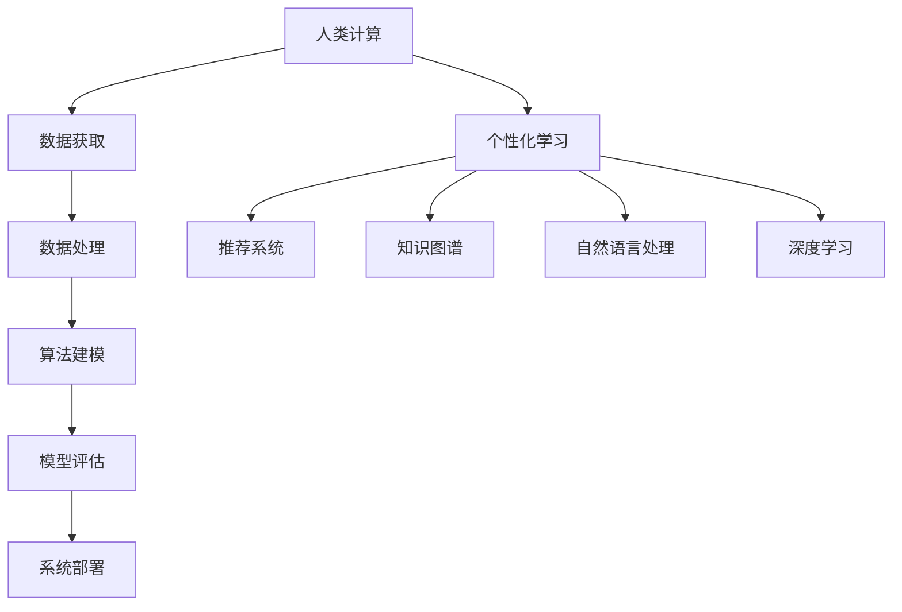

                 

# 个性化学习：人类计算如何改变教育

## 1. 背景介绍

### 1.1 问题由来

近年来，随着人工智能技术的迅猛发展，个性化学习逐渐成为教育领域的焦点。传统的一刀切教学模式无法满足不同学生的个性化需求，教育资源分配不均衡问题也日益突出。个性化学习利用人工智能技术，通过分析学生的学习数据和行为特征，提供量身定制的学习路径和教学内容，提升学习效果，优化教育资源配置，成为破解教育难题的重要手段。

个性化学习涉及许多技术环节，包括机器学习、自然语言处理、计算机视觉、推荐系统等。本文将重点讨论其中核心技术：基于人类计算的个性化学习系统。这一系统通过大规模计算资源，从海量数据中提取有用的信息，并应用于教育领域，实现个性化学习目标。

### 1.2 问题核心关键点

基于人类计算的个性化学习系统，通过运用先进的人工智能算法，对学生的学习行为进行建模和分析，从而提供个性化的教学建议。该系统的主要核心关键点包括：

- 数据获取：从学生作业、课堂互动、在线学习平台等渠道，收集学生的学习行为数据。
- 数据处理：利用数据清洗、特征提取等技术，处理海量数据，提取有用的特征。
- 算法建模：构建机器学习模型，预测学生的学习偏好、知识掌握程度等，并生成个性化的学习路径。
- 模型评估：评估模型的预测准确性和泛化能力，迭代优化模型，提升学习效果。
- 系统部署：将模型部署到教育平台中，实时提供个性化推荐和学习建议。

这些核心关键点紧密相关，共同构成了基于人类计算的个性化学习系统的核心框架。通过理解这些关键点，可以更好地把握个性化学习的原理和实现路径。

## 2. 核心概念与联系

### 2.1 核心概念概述

为了更好地理解基于人类计算的个性化学习系统，我们首先需要介绍几个关键概念：

- **人类计算**：指通过大规模的计算资源，对海量数据进行高效处理和分析的技术。主要应用于科学计算、大数据分析、机器学习等领域。
- **个性化学习**：指根据学生个体差异，量身定制学习路径和内容，提升学习效果的教育模式。
- **推荐系统**：利用机器学习算法，对用户行为进行建模，从而提供个性化推荐的技术。
- **知识图谱**：将知识以图的形式进行组织和表示，用于构建知识网络，辅助智能推理。
- **自然语言处理**：利用计算机技术处理和理解自然语言，用于智能问答、文本生成、文本分类等任务。
- **深度学习**：一类基于神经网络的机器学习方法，通过多层非线性映射，从数据中提取高层次的抽象特征。

这些核心概念之间的逻辑关系可以通过以下Mermaid流程图来展示：



这个流程图展示了个性化学习系统的核心概念及其之间的关系：

1. 人类计算提供海量计算资源，用于数据处理和算法建模。
2. 数据获取与处理为个性化学习提供基础数据支撑。
3. 算法建模通过机器学习技术，实现对学习行为的预测和个性化推荐。
4. 模型评估和优化提升算法的准确性和鲁棒性。
5. 系统部署将算法应用到教育平台，实现个性化学习的实际应用。
6. 推荐系统、知识图谱、自然语言处理、深度学习等技术，为个性化学习提供支撑。

## 3. 核心算法原理 & 具体操作步骤
### 3.1 算法原理概述

基于人类计算的个性化学习系统，其核心算法原理是通过机器学习模型，对学生的学习行为进行建模和预测。系统首先收集学生的学习数据，如作业成绩、答题时间、互动频次等，通过数据清洗和特征提取，将其转化为可供模型训练的特征向量。然后，使用基于深度学习或传统机器学习的算法，构建预测模型，对学生的学习偏好、知识掌握程度等进行预测，并生成个性化的学习建议。

### 3.2 算法步骤详解

基于人类计算的个性化学习系统，一般包括以下关键步骤：

**Step 1: 数据收集与预处理**
- 从不同渠道收集学生的学习数据，如作业提交、在线学习平台互动记录等。
- 对收集到的数据进行清洗、去重、归一化等预处理操作，去除噪声和异常值。
- 进行特征提取，将文本、时间戳、行为序列等转化为可供机器学习算法处理的数值型特征向量。

**Step 2: 构建和训练模型**
- 选择合适的机器学习算法（如线性回归、决策树、随机森林、深度神经网络等），构建学习行为预测模型。
- 利用标注数据集对模型进行训练，调整模型参数，使其能够准确预测学生的学习行为和偏好。
- 使用交叉验证等技术，评估模型的预测准确性和泛化能力，优化模型性能。

**Step 3: 生成个性化学习建议**
- 对于新的学习任务，利用训练好的模型，输入学生的学习数据，预测其学习效果和偏好。
- 根据预测结果，生成个性化的学习路径、推荐的学习资源和学习策略，辅助学生学习。
- 实时跟踪学生的学习进度和反馈，动态调整学习建议，持续优化学习效果。

### 3.3 算法优缺点

基于人类计算的个性化学习系统具有以下优点：

1. **个性化推荐**：能够根据学生的独特学习行为，提供量身定制的学习建议，提高学习效率和效果。
2. **数据驱动**：通过分析学习数据，发现学生学习中的规律和问题，提供针对性的解决策略。
3. **实时反馈**：实时跟踪学习效果，及时调整学习策略，优化学习路径。

同时，该系统也存在以下局限性：

1. **数据隐私**：收集和处理学生数据时，需要严格遵守隐私保护政策，确保数据安全。
2. **算法复杂**：构建和训练复杂模型，对计算资源和时间有较高要求。
3. **模型偏见**：如果训练数据存在偏差，模型可能产生有偏见的预测结果。
4. **实时性问题**：实时生成个性化建议需要高效的计算和存储支持，可能面临性能瓶颈。
5. **学生依赖**：学生对系统的依赖性可能影响其自主学习的能力。

### 3.4 算法应用领域

基于人类计算的个性化学习系统，已经在多个教育领域得到应用，包括但不限于：

- **K-12教育**：为中小学生提供个性化的学习建议和资源推荐，提升学习成绩和学习兴趣。
- **高等教育**：为大学生提供课程推荐、论文选题建议、研究资源推荐等服务。
- **职业培训**：为职业学校学生提供技能培训路径、课程推荐、学习资源推荐等。
- **终身学习**：为成人提供个性化学习路径、技能培训推荐、在线学习资源推荐等。

这些应用场景展示了个性化学习系统的强大潜力和广泛适用性，为提升教育质量、优化教育资源配置提供了新的途径。

## 4. 数学模型和公式 & 详细讲解  
### 4.1 数学模型构建

在本节中，我们将通过数学语言对基于人类计算的个性化学习系统的核心算法进行详细阐述。

设学生的学习行为数据为 $\mathcal{D}=\{(x_i, y_i)\}_{i=1}^N$，其中 $x_i$ 为学习数据向量，$y_i$ 为学习结果标签。我们定义一个学习行为预测模型 $f$，该模型将输入 $x$ 映射到输出 $y$，形式化为：

$$
y = f(x)
$$

学习行为预测模型的目标是最大化对未知数据的预测准确性。我们通过最小化损失函数 $\mathcal{L}$ 来训练模型：

$$
\min_{\theta} \mathcal{L}(f_{\theta}(x), y)
$$

其中，$\theta$ 为模型的参数，$f_{\theta}$ 为参数化的模型函数。

常用的损失函数包括均方误差、交叉熵损失等。以交叉熵损失为例，其表达式为：

$$
\mathcal{L}(f_{\theta}(x), y) = -\sum_{i=1}^N \sum_{k=1}^K y_{ik} \log f_{\theta}(x)_{ik}
$$

其中 $K$ 为分类数。

### 4.2 公式推导过程

为了推导模型的具体形式，我们以一个简单的线性回归模型为例。假设 $x$ 为二维特征向量，模型为线性回归形式：

$$
f_{\theta}(x) = \theta_0 + \theta_1 x_1 + \theta_2 x_2
$$

预测结果 $y$ 与实际结果的差异可以用均方误差表示：

$$
\mathcal{L}(f_{\theta}(x), y) = \frac{1}{2N} \sum_{i=1}^N (y_i - f_{\theta}(x_i))^2
$$

将 $f_{\theta}(x)$ 代入损失函数中，得到：

$$
\mathcal{L}(\theta) = \frac{1}{2N} \sum_{i=1}^N \left(y_i - (\theta_0 + \theta_1 x_{i1} + \theta_2 x_{i2}) \right)^2
$$

为了最小化损失函数 $\mathcal{L}(\theta)$，我们需要对 $\theta_0$、$\theta_1$ 和 $\theta_2$ 进行求解。通过求解一阶导数，可以得到：

$$
\frac{\partial \mathcal{L}(\theta)}{\partial \theta_0} = \frac{1}{N} \sum_{i=1}^N \left(y_i - \theta_0 - \theta_1 x_{i1} - \theta_2 x_{i2} \right)
$$

$$
\frac{\partial \mathcal{L}(\theta)}{\partial \theta_1} = \frac{1}{N} \sum_{i=1}^N \left(y_i - \theta_0 - \theta_1 x_{i1} - \theta_2 x_{i2} \right) x_{i1}
$$

$$
\frac{\partial \mathcal{L}(\theta)}{\partial \theta_2} = \frac{1}{N} \sum_{i=1}^N \left(y_i - \theta_0 - \theta_1 x_{i1} - \theta_2 x_{i2} \right) x_{i2}
$$

通过求解上述方程组，可以更新模型的参数 $\theta$，使得模型更好地拟合训练数据。

### 4.3 案例分析与讲解

以一个简单的在线学习平台为例，我们展示如何利用基于人类计算的个性化学习系统，提供个性化的学习建议。

假设该平台收集了学生 $i$ 在多个课程 $j$ 上的互动数据，包括课程观看时长、答题次数、反馈评分等。我们定义一个多任务学习模型，预测学生在不同课程上的学习效果：

$$
\begin{aligned}
y_{ij} &= f_{\theta_{ij}}(x_{ij}) \\
\end{aligned}
$$

其中 $y_{ij}$ 为学生 $i$ 在课程 $j$ 上的学习效果，$f_{\theta_{ij}}$ 为参数化的多任务学习函数，$x_{ij}$ 为学生的互动数据。

通过对标注数据集 $\mathcal{D}=\{(x_{ij}, y_{ij})\}_{i,j=1}^{N,M}$ 进行训练，可以构建多任务学习模型 $f_{\theta_{ij}}$。然后，对于一个新的学习任务，我们可以输入学生 $i$ 的互动数据 $x_i$，利用训练好的模型，预测其在不同课程上的学习效果，生成个性化的学习建议：

$$
\begin{aligned}
y_{ij} &= f_{\theta_{ij}}(x_{ij}) \\
\end{aligned}
$$

通过这种方式，可以实时提供个性化的学习路径和资源推荐，帮助学生选择最适合的学习课程和资源，提高学习效果。

## 5. 项目实践：代码实例和详细解释说明
### 5.1 开发环境搭建

在进行个性化学习系统开发前，我们需要准备好开发环境。以下是使用Python进行开发的环境配置流程：

1. 安装Anaconda：从官网下载并安装Anaconda，用于创建独立的Python环境。

2. 创建并激活虚拟环境：
```bash
conda create -n ml-env python=3.8 
conda activate ml-env
```

3. 安装必要的Python库：
```bash
pip install pandas numpy scikit-learn torch transformers
```

4. 安装TensorBoard：用于可视化训练过程中的损失和精度变化。
```bash
pip install tensorboard
```

5. 安装Flask：用于搭建Web应用程序，提供个性化学习服务的接口。
```bash
pip install flask
```

完成上述步骤后，即可在`ml-env`环境中开始个性化学习系统的开发。

### 5.2 源代码详细实现

以下是使用Python和TensorFlow实现基于人类计算的个性化学习系统的代码实现。

首先，定义多任务学习模型：

```python
import tensorflow as tf
import numpy as np

# 定义多任务学习模型
class MultiTaskModel(tf.keras.Model):
    def __init__(self, n_features):
        super(MultiTaskModel, self).__init__()
        self.dense1 = tf.keras.layers.Dense(64, activation='relu')
        self.dense2 = tf.keras.layers.Dense(32, activation='relu')
        self.dense3 = tf.keras.layers.Dense(n_tasks, activation='softmax')
    
    def call(self, inputs):
        x = self.dense1(inputs)
        x = self.dense2(x)
        x = self.dense3(x)
        return x

# 定义损失函数
def multitask_loss(y_true, y_pred):
    return tf.reduce_mean(tf.keras.losses.sparse_categorical_crossentropy(y_true, y_pred))

# 定义优化器
optimizer = tf.keras.optimizers.Adam(learning_rate=0.001)
```

然后，加载数据并进行预处理：

```python
# 加载数据
data = np.loadtxt('data.csv', delimiter=',', skiprows=1)

# 划分训练集和测试集
train_data = data[:train_size, :]
test_data = data[train_size:, :]
train_x = train_data[:, :-1]
train_y = train_data[:, -1]
test_x = test_data[:, :-1]
test_y = test_data[:, -1]

# 数据归一化
mean = np.mean(train_x, axis=0)
std = np.std(train_x, axis=0)
train_x = (train_x - mean) / std
test_x = (test_x - mean) / std
```

接着，定义训练过程：

```python
# 定义模型
model = MultiTaskModel(n_features)

# 定义训练过程
def train_step(x, y):
    with tf.GradientTape() as tape:
        y_pred = model(x)
        loss = multitask_loss(y, y_pred)
    gradients = tape.gradient(loss, model.trainable_variables)
    optimizer.apply_gradients(zip(gradients, model.trainable_variables))
    return loss

# 训练模型
for epoch in range(num_epochs):
    train_loss = 0
    for x, y in train_data:
        loss = train_step(x, y)
        train_loss += loss
    train_loss /= train_size
    print('Epoch {}: Loss {}'.format(epoch+1, train_loss))
```

最后，评估模型并进行预测：

```python
# 定义评估过程
def evaluate_step(x, y):
    y_pred = model(x)
    loss = multitask_loss(y, y_pred)
    return loss

# 评估模型
test_loss = 0
for x, y in test_data:
    loss = evaluate_step(x, y)
    test_loss += loss
test_loss /= test_size
print('Test Loss:', test_loss)

# 进行预测
new_x = np.array([[1.0, 0.5, 0.2]])
y_pred = model(new_x)
print('Prediction:', y_pred)
```

以上就是基于人类计算的个性化学习系统的完整代码实现。通过上述代码，我们展示了如何使用TensorFlow构建多任务学习模型，并对学习数据进行训练、评估和预测。

### 5.3 代码解读与分析

让我们再详细解读一下关键代码的实现细节：

**MultiTaskModel类**：
- `__init__`方法：初始化多任务学习模型的各个层，使用ReLU激活函数。
- `call`方法：定义模型前向传播的过程，通过多层线性变换，输出预测结果。

**multitask_loss函数**：
- 使用`tf.keras.losses.sparse_categorical_crossentropy`函数计算多任务损失，平均化损失值。

**训练过程**：
- 使用`tf.GradientTape`记录梯度，使用`optimizer.apply_gradients`更新模型参数。

**评估过程**：
- 使用`evaluate_step`函数计算模型在测试集上的损失，并进行预测。

可以看到，通过上述代码，我们可以高效地实现基于人类计算的个性化学习系统的训练和预测过程。利用TensorFlow的强大计算能力，我们可以快速迭代优化模型，提升预测精度。

当然，实际的个性化学习系统开发还需要考虑更多因素，如数据清洗、特征工程、模型优化等。但核心的训练和预测流程基本与此类似。

## 6. 实际应用场景
### 6.1 在线教育平台

在线教育平台通过收集学生的学习数据，构建个性化学习模型，为学生提供个性化的学习路径和资源推荐。例如，Coursera、edX等平台利用个性化学习模型，为学生推荐适合其学习风格和进度安排的课程和学习资源。通过个性化学习建议，学生可以更高效地完成学习任务，提升学习效果。

### 6.2 企业培训系统

企业培训系统通过个性化学习模型，为员工提供定制化的培训课程和资源。例如，LinkedIn Learning利用个性化学习模型，根据员工的工作岗位和职业发展需求，推荐相关的培训课程和学习资源。通过个性化的培训推荐，员工可以更有针对性地提升职业技能，促进职业发展。

### 6.3 智能辅导系统

智能辅导系统通过个性化学习模型，为学生提供即时学习指导和反馈。例如，Khan Academy利用个性化学习模型，根据学生的学习进度和掌握情况，提供针对性的练习和辅导。通过个性化的辅导建议，学生可以更好地理解和掌握知识点，提高学习效率。

### 6.4 未来应用展望

随着人工智能技术的不断进步，个性化学习系统将在更多领域得到应用，为教育和社会发展带来新的变革：

- **终身学习**：利用个性化学习模型，为成人提供量身定制的学习路径和资源推荐，支持终身学习需求。
- **跨领域学习**：利用多模态学习模型，将视觉、听觉、文本等多种学习方式融合，提升跨领域学习能力。
- **教育公平**：利用个性化学习模型，优化教育资源配置，缩小教育差距，促进教育公平。
- **智能教育**：利用智能推理和知识图谱技术，构建智能教育系统，实现自适应学习和个性化教学。

未来，个性化学习系统将与人工智能技术进一步融合，为教育和社会带来更多的创新和进步。

## 7. 工具和资源推荐
### 7.1 学习资源推荐

为了帮助开发者系统掌握基于人类计算的个性化学习系统的理论基础和实践技巧，这里推荐一些优质的学习资源：

1. **深度学习与强化学习**：由斯坦福大学教授Andrew Ng开设的Coursera课程，系统讲解深度学习、强化学习等前沿技术。
2. **机器学习实战**：机器学习工程师李沐的书籍，涵盖机器学习算法、数据处理、模型调优等实战技能。
3. **TensorFlow官方文档**：TensorFlow的官方文档，包含详细的API参考、教程和案例，是学习和使用TensorFlow的必备资源。
4. **Flask官方文档**：Flask的官方文档，提供Flask Web应用程序的开发指南和示例代码。
5. **个性化学习研究论文**：检索和阅读最新的个性化学习研究论文，了解最新的算法和技术进展。

通过对这些资源的学习实践，相信你一定能够快速掌握基于人类计算的个性化学习系统的精髓，并用于解决实际的个性化学习问题。

### 7.2 开发工具推荐

高效的开发离不开优秀的工具支持。以下是几款用于个性化学习系统开发的常用工具：

1. **Jupyter Notebook**：免费的交互式编程环境，支持Python、R等语言，方便快速迭代和共享代码。
2. **PyTorch**：基于Python的深度学习框架，灵活性强，支持动态计算图，适合研究和实验。
3. **TensorFlow**：由Google开发的深度学习框架，生产部署方便，支持分布式计算，适合大规模应用。
4. **Flask**：轻量级的Web框架，方便搭建Web应用程序，提供API接口。
5. **TensorBoard**：TensorFlow配套的可视化工具，实时监测训练过程，提供丰富的图表和指标。

合理利用这些工具，可以显著提升个性化学习系统的开发效率，加快创新迭代的步伐。

### 7.3 相关论文推荐

基于人类计算的个性化学习系统的发展离不开学界的持续研究。以下是几篇奠基性的相关论文，推荐阅读：

1. **A Survey of Online Learning Personalization**：Luo Xinyue等，综述了在线学习个性化的最新进展，涵盖算法、数据、评估等方面。
2. **Deep Learning for Personalized Recommendations**：Burmistrov Dmitriy等，讨论了深度学习在推荐系统中的应用，为个性化学习提供了理论和技术支持。
3. **Personalized Learning by Interaction**：Li Shengwei等，探索了通过学生与学习系统互动，生成个性化学习路径的方法。
4. **The Future of Education**：An Introduction to A.I. for Learning Analytics: Data Mining, Predictive Analytics, and Learning Analytics：Eric Siegel等，探讨了AI在教育分析中的应用，为个性化学习提供了新的视角和思路。
5. **Learning Analytics: Data Mining, Pattern Recognition, and Statistical Learning**：Barmada Wael等，综述了学习分析领域的研究进展，包括数据挖掘、模式识别、统计学习等。

这些论文代表了大语言模型微调技术的发展脉络。通过学习这些前沿成果，可以帮助研究者把握学科前进方向，激发更多的创新灵感。

## 8. 总结：未来发展趋势与挑战
### 8.1 总结

本文对基于人类计算的个性化学习系统进行了全面系统的介绍。首先阐述了个性化学习系统的背景和意义，明确了其在大规模计算和数据驱动下的优势。其次，从原理到实践，详细讲解了个性化学习系统的数学模型和算法步骤，给出了完整的代码实例。同时，本文还广泛探讨了个性化学习系统在在线教育、企业培训等场景的应用前景，展示了其强大的潜力和广阔的应用空间。此外，本文精选了学习资源、开发工具和相关论文，力求为开发者提供全方位的技术指引。

通过本文的系统梳理，可以看到，基于人类计算的个性化学习系统已经成为教育领域的重要技术手段，极大地提升了学习效果和教育资源配置的优化。未来，随着计算资源和算法的不断进步，个性化学习系统将进一步拓展应用边界，为教育和社会带来更多的创新和进步。

### 8.2 未来发展趋势

展望未来，基于人类计算的个性化学习系统将呈现以下几个发展趋势：

1. **跨领域学习**：利用多模态学习模型，将视觉、听觉、文本等多种学习方式融合，提升跨领域学习能力。
2. **终身学习**：利用个性化学习模型，为成人提供量身定制的学习路径和资源推荐，支持终身学习需求。
3. **智能教育**：利用智能推理和知识图谱技术，构建智能教育系统，实现自适应学习和个性化教学。
4. **大规模应用**：随着计算资源的不断扩展和算法技术的进步，个性化学习系统将在大规模应用场景中发挥重要作用。
5. **多任务学习**：利用多任务学习技术，解决复杂的学习任务，提升学习效果。
6. **跨平台协同**：将个性化学习系统与其他学习平台、知识图谱、智能辅导系统等协同工作，实现全面覆盖。

这些趋势展示了个性化学习系统的广阔前景，预示着其在教育和社会发展中的重要地位。

### 8.3 面临的挑战

尽管基于人类计算的个性化学习系统已经取得了显著进展，但在走向大规模应用的过程中，仍面临诸多挑战：

1. **数据隐私**：收集和处理学生数据时，需要严格遵守隐私保护政策，确保数据安全。
2. **算法复杂**：构建和训练复杂模型，对计算资源和时间有较高要求。
3. **实时性问题**：实时生成个性化建议需要高效的计算和存储支持，可能面临性能瓶颈。
4. **学生依赖**：学生对系统的依赖性可能影响其自主学习的能力。
5. **模型偏见**：如果训练数据存在偏差，模型可能产生有偏见的预测结果。
6. **多模态数据整合**：将不同模态的数据进行整合，形成一致的表示，需要克服技术挑战。

这些挑战需要在未来的研究中进一步探索和解决，才能充分发挥个性化学习系统的潜力。

### 8.4 研究展望

面对个性化学习系统面临的挑战，未来的研究需要在以下几个方面寻求新的突破：

1. **数据隐私保护**：利用差分隐私、联邦学习等技术，保护学生数据隐私。
2. **高效算法设计**：开发高效的多任务学习算法，提升个性化学习系统的性能。
3. **实时计算优化**：优化模型结构，提升实时计算能力，解决性能瓶颈问题。
4. **模型鲁棒性提升**：提升模型的泛化能力和鲁棒性，减少对训练数据的依赖。
5. **跨模态数据融合**：研究跨模态数据融合技术，形成一致的表示，提高个性化学习系统的适应性。
6. **用户自主学习**：设计用户友好的界面，提升学生的自主学习能力和学习动机。

这些研究方向的探索，必将引领个性化学习系统迈向更高的台阶，为教育和社会带来更多的创新和进步。面向未来，基于人类计算的个性化学习系统需要与其他人工智能技术进行更深入的融合，共同推动自然语言理解和智能交互系统的进步。只有勇于创新、敢于突破，才能不断拓展个性化学习系统的边界，让智能技术更好地造福人类社会。

## 9. 附录：常见问题与解答

**Q1：个性化学习系统如何保护学生隐私？**

A: 个性化学习系统需要收集学生的学习数据，但必须严格遵守数据隐私保护政策，确保学生数据的安全。具体措施包括：
1. 数据匿名化：将学生的个人信息进行匿名化处理，去除敏感信息。
2. 加密存储：使用加密技术，保护数据在存储和传输过程中的安全。
3. 差分隐私：采用差分隐私技术，通过添加噪声干扰，保护学生数据的隐私。
4. 联邦学习：利用联邦学习技术，在本地设备上训练模型，不将数据上传至云端。

这些措施可以最大程度地保护学生隐私，同时满足个性化学习系统对数据的需求。

**Q2：个性化学习系统如何提高实时性？**

A: 个性化学习系统需要实时生成个性化建议，因此必须优化计算和存储资源的使用。具体措施包括：
1. 模型裁剪：去除不必要的层和参数，减小模型尺寸，加快推理速度。
2. 量化加速：将浮点模型转为定点模型，压缩存储空间，提高计算效率。
3. 分布式计算：利用分布式计算框架，如TensorFlow分布式、Spark等，提升计算能力。
4. 数据缓存：利用缓存技术，减少频繁的数据读取和写入，提升系统响应速度。
5. 异步处理：使用异步处理技术，并行处理多条请求，提高系统吞吐量。

通过这些优化措施，可以显著提高个性化学习系统的实时性，满足用户需求。

**Q3：个性化学习系统如何避免模型偏见？**

A: 个性化学习系统构建的模型可能存在训练数据中的偏见，导致预测结果有偏差。具体措施包括：
1. 数据清洗：清洗训练数据，去除有偏见的数据点。
2. 公平性约束：在损失函数中加入公平性约束，限制模型的预测偏见。
3. 多样性数据集：使用多样性的数据集进行训练，避免数据偏见。
4. 透明性评估：对模型进行透明性评估，发现和修正模型偏见。
5. 偏见纠正：在模型训练过程中，通过主动学习和对抗训练等技术，纠正模型的偏见。

通过这些措施，可以最大程度地避免模型偏见，提升个性化学习系统的公平性和可信度。

**Q4：个性化学习系统如何整合多模态数据？**

A: 个性化学习系统需要整合视觉、听觉、文本等多种模态的数据，形成一致的表示。具体措施包括：
1. 统一特征表示：将不同模态的数据映射到统一的特征空间，形成一致的表示。
2. 多模态融合：利用深度学习技术，如多模态神经网络，融合不同模态的数据。
3. 知识图谱整合：将知识图谱与多模态数据进行整合，形成知识网络，辅助智能推理。
4. 跨模态迁移学习：利用跨模态迁移学习技术，迁移学习不同模态的数据表示。
5. 多模态交互：设计多模态交互界面，提升用户的多模态互动体验。

通过这些措施，可以有效地整合多模态数据，提升个性化学习系统的适应性和学习效果。

---

作者：禅与计算机程序设计艺术 / Zen and the Art of Computer Programming

