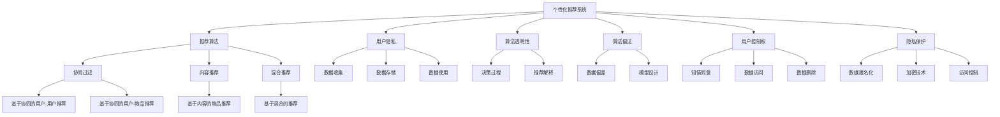

                 

## 1. 背景介绍

### 1.1 问题由来

随着互联网的普及和数字技术的迅猛发展，个性化推荐系统（Personalized Recommendation Systems, PRS）成为了各大平台不可或缺的核心功能。从电商网站的商品推荐，到视频网站的影视剧推荐，再到社交媒体的资讯推荐，个性化推荐系统在提升用户体验、增加平台黏性、促进商业变现等方面发挥了重要作用。

然而，个性化推荐系统并非完美的。在数据驱动的推荐算法背后，隐含着复杂的伦理和隐私问题。用户数据被大量收集和分析，涉及隐私泄露、信息不对称、算法偏见等风险。这些问题不仅影响用户对平台和产品的信任，还可能带来法律和道德上的风险。

### 1.2 问题核心关键点

个性化推荐系统的伦理和隐私问题，主要体现在以下几个方面：

1. **数据隐私**：用户行为数据、兴趣偏好等敏感信息被收集和存储，可能被不当使用或泄露。
2. **算法透明性**：推荐算法的决策过程不透明，用户难以理解算法是如何做出推荐的，可能导致信息不对称和误解。
3. **算法偏见**：推荐算法可能因训练数据偏差或模型设计不当，导致对某些群体或类别的推荐不公。
4. **用户控制权**：用户对个人数据的控制权不足，难以拒绝推荐算法的不合理推荐或控制推荐结果的范围。
5. **公平性**：个性化推荐算法可能加剧信息鸿沟，对弱势群体产生不公平的影响。

这些问题不仅仅是个别平台需要关注的问题，而是整个行业需要共同面对和解决的挑战。本文旨在从伦理和隐私保护的角度，探讨个性化推荐系统的设计原则和优化方法，以期构建更公平、透明、可控的推荐系统。

## 2. 核心概念与联系

### 2.1 核心概念概述

为更好地理解个性化推荐系统的伦理和隐私保护，本节将介绍几个密切相关的核心概念：

- **个性化推荐系统（PRS）**：利用用户行为数据和兴趣偏好，通过算法模型向用户推荐可能感兴趣的商品、内容等。
- **推荐算法**：包括协同过滤、内容推荐、混合推荐等多种算法，用于计算用户和物品之间的相似度，生成推荐列表。
- **用户隐私**：指用户在使用推荐系统时，其个人数据（如浏览记录、搜索历史等）被收集、存储和使用的过程和方式。
- **算法透明性**：指推荐算法的决策过程是否公开、易于理解和解释，用户是否能够理解算法的工作原理和推荐逻辑。
- **算法偏见**：指推荐算法可能因数据偏差、模型设计等因素，导致对某些群体或类别的推荐不公平。
- **用户控制权**：指用户对其个人数据的控制权，包括知情同意、数据访问、数据删除等权利。
- **隐私保护**：指在推荐系统设计和运行过程中，如何最小化用户隐私风险，保护用户数据安全。

这些核心概念之间的逻辑关系可以通过以下Mermaid流程图来展示：



这个流程图展示了个性化推荐系统的核心概念及其之间的关系：

1. 个性化推荐系统通过推荐算法计算用户兴趣，基于用户隐私数据生成推荐列表。
2. 推荐算法包含多种子算法，如协同过滤、内容推荐等。
3. 用户隐私涉及数据收集、存储和使用等环节。
4. 算法透明性关注决策过程和推荐解释。
5. 算法偏见源于数据偏差和模型设计。
6. 用户控制权涉及知情同意、数据访问等权利。
7. 隐私保护涉及数据匿名化、加密技术等。

这些概念共同构成了个性化推荐系统的伦理和隐私框架，是设计和优化推荐系统的重要依据。

## 3. 核心算法原理 & 具体操作步骤
### 3.1 算法原理概述

个性化推荐系统的核心在于推荐算法，通过用户行为数据和物品属性数据，计算用户与物品之间的相似度，生成推荐列表。推荐算法的关键在于如何平衡用户满意度与推荐多样性，同时确保推荐过程的公平性和透明性。

### 3.2 算法步骤详解

个性化推荐系统的设计和优化，一般包括以下几个关键步骤：

**Step 1: 数据收集与预处理**
- 收集用户行为数据，包括浏览记录、点击行为、评分等。
- 收集物品属性数据，如商品属性、视频标签等。
- 对数据进行清洗、去重、归一化等预处理。

**Step 2: 用户建模**
- 通过协同过滤、内容推荐等算法，计算用户与物品之间的相似度。
- 建立用户兴趣模型，如基于用户的隐式反馈、显式反馈、社交网络等。
- 用户模型通常包含用户特征向量、物品特征向量等。

**Step 3: 物品推荐**
- 基于用户模型和物品模型，计算推荐分数。
- 通过排序算法（如倒排索引、TF-IDF等）对推荐结果进行排序。
- 生成推荐列表，并反馈给用户。

**Step 4: 推荐效果评估**
- 在测试集上评估推荐效果，如准确率、召回率、F1分数等。
- 根据用户反馈，调整算法参数，优化推荐策略。

**Step 5: 用户反馈与反馈循环**
- 收集用户对推荐结果的反馈，如点击率、评分等。
- 根据反馈数据，不断调整推荐策略，形成反馈循环。

### 3.3 算法优缺点

个性化推荐系统具有以下优点：
1. 提升用户体验。个性化推荐系统能够根据用户行为和偏好，提供个性化的推荐，提高用户满意度和粘性。
2. 增加平台收益。个性化推荐系统能够提高转化率、复购率等关键指标，增加平台收益。
3. 降低运营成本。个性化推荐系统可以替代人工推荐，减少人工成本。
4. 数据驱动决策。个性化推荐系统通过数据分析，为运营决策提供数据支撑。

同时，该方法也存在一些局限性：
1. 数据隐私问题。个性化推荐系统需要收集大量用户数据，存在隐私泄露风险。
2. 算法偏见问题。推荐算法可能因训练数据偏差或模型设计不当，导致对某些群体或类别的推荐不公。
3. 用户控制权问题。用户对其个人数据的控制权不足，难以拒绝推荐算法的不合理推荐或控制推荐结果的范围。
4. 推荐算法复杂度。推荐算法需要处理大量数据，计算复杂度高，可能影响实时性。

### 3.4 算法应用领域

个性化推荐系统在多个领域得到了广泛应用，包括：

- 电商推荐：根据用户浏览和购买行为，推荐商品和活动。
- 视频推荐：根据用户观看行为，推荐影视剧和视频。
- 新闻推荐：根据用户阅读行为，推荐新闻和文章。
- 社交推荐：根据用户互动行为，推荐好友和内容。
- 音乐推荐：根据用户听歌行为，推荐歌曲和播放列表。
- 广告推荐：根据用户行为，推荐广告和定向活动。

除了上述这些经典应用外，个性化推荐系统还被创新性地应用到更多场景中，如个性化搜索、内容聚合、知识推荐等，为各行业带来了新的商业价值。

## 4. 数学模型和公式 & 详细讲解
### 4.1 数学模型构建

个性化推荐系统的核心数学模型是协同过滤模型和内容推荐模型。这里以协同过滤模型为例，介绍其数学模型构建。

设用户集为 $U=\{u_1,u_2,\dots,u_m\}$，物品集为 $I=\{i_1,i_2,\dots,i_n\}$，用户与物品的交互矩阵为 $M \in \mathbb{R}^{m \times n}$，其中 $M_{ui}$ 表示用户 $u$ 对物品 $i$ 的评分或行为。协同过滤模型的目标是通过用户-物品交互矩阵，推断用户对未交互物品的评分，生成推荐列表。

协同过滤模型的基本假设是：用户对未交互物品的评分，可以通过已交互物品的评分推断。设用户 $u$ 对物品 $i$ 的预测评分为 $\hat{r}_{ui}$，协同过滤模型的目标是最小化预测评分与真实评分之间的差异。常用的协同过滤模型包括矩阵分解模型和用户-物品共现矩阵模型。

### 4.2 公式推导过程

#### 4.2.1 矩阵分解模型

矩阵分解模型假设用户-物品交互矩阵 $M$ 可以分解为两个低秩矩阵 $P$ 和 $Q$ 的乘积，即 $M \approx P \times Q$，其中 $P \in \mathbb{R}^{m \times r}$，$Q \in \mathbb{R}^{r \times n}$，$r$ 为因子数。根据矩阵分解模型，用户 $u$ 对物品 $i$ 的预测评分为：

$$
\hat{r}_{ui} = \sum_{k=1}^{r} p_{uk}q_{ki}
$$

其中 $p_{uk}$ 和 $q_{ki}$ 为矩阵 $P$ 和 $Q$ 中的元素。

#### 4.2.2 用户-物品共现矩阵模型

用户-物品共现矩阵模型假设用户-物品交互矩阵 $M$ 的每一行向量与每一列向量分别表示用户的兴趣向量和物品的属性向量。设用户 $u$ 的兴趣向量为 $p_u$，物品 $i$ 的属性向量为 $q_i$，则用户 $u$ 对物品 $i$ 的预测评分为：

$$
\hat{r}_{ui} = p_u^T \times q_i
$$

其中 $p_u^T$ 和 $q_i$ 分别为用户 $u$ 和物品 $i$ 的兴趣向量和属性向量。

### 4.3 案例分析与讲解

以电商推荐为例，介绍个性化推荐系统的实际应用和模型优化。

假设用户 $u$ 在电商平台上浏览了多项商品 $i_1,i_2,\dots,i_k$，并购买了其中 $i_j$，未购买但浏览过的商品为 $i_l$。电商平台的推荐系统可以通过协同过滤模型，预测用户 $u$ 对未购买但浏览过的商品 $i_l$ 的评分，生成推荐列表。

设用户 $u$ 对商品 $i$ 的评分 $r_{ui}$ 为 1 或 0，根据用户-物品共现矩阵模型，用户 $u$ 对商品 $i_l$ 的预测评分为：

$$
\hat{r}_{ul} = p_u^T \times q_l
$$

其中 $p_u$ 为电商平台为用户 $u$ 生成的兴趣向量，$q_l$ 为电商平台为商品 $i_l$ 生成的属性向量。电商平台可以根据预测评分 $\hat{r}_{ul}$，生成推荐列表，推荐给用户 $u$。

在实际应用中，电商平台需要不断收集用户行为数据和商品属性数据，实时更新用户模型和商品模型，以提高推荐效果。同时，电商平台还需要考虑隐私保护和算法偏见等伦理问题，确保推荐系统的公平性和透明性。

## 5. 项目实践：代码实例和详细解释说明
### 5.1 开发环境搭建

在进行个性化推荐系统开发前，我们需要准备好开发环境。以下是使用Python进行TensorFlow开发的环境配置流程：

1. 安装Anaconda：从官网下载并安装Anaconda，用于创建独立的Python环境。

2. 创建并激活虚拟环境：
```bash
conda create -n tf-env python=3.8 
conda activate tf-env
```

3. 安装TensorFlow：根据CUDA版本，从官网获取对应的安装命令。例如：
```bash
conda install tensorflow -c tf -c conda-forge
```

4. 安装各类工具包：
```bash
pip install numpy pandas scikit-learn matplotlib tqdm jupyter notebook ipython
```

完成上述步骤后，即可在`tf-env`环境中开始推荐系统开发。

### 5.2 源代码详细实现

这里我们以电商推荐系统为例，给出使用TensorFlow对协同过滤模型进行推荐预测的代码实现。

首先，定义协同过滤模型的数据处理函数：

```python
import tensorflow as tf
import numpy as np

def load_data(file_path):
    with open(file_path, 'r') as f:
        data = [line.strip().split('\t') for line in f.readlines()]
    interactions = np.array(data, dtype=np.float32)
    return interactions
```

然后，定义协同过滤模型的构建函数：

```python
def build_model(interactions, latent_factor):
    user_size, item_size, interaction_size = interactions.shape
    
    # 构建用户兴趣矩阵P
    user_embeddings = tf.Variable(tf.random.normal(shape=(user_size, latent_factor), stddev=0.01))
    user_matrix = tf.matmul(interactions, user_embeddings)
    
    # 构建物品属性矩阵Q
    item_embeddings = tf.Variable(tf.random.normal(shape=(item_size, latent_factor), stddev=0.01))
    item_matrix = tf.matmul(interactions.T, item_embeddings)
    
    # 计算预测评分
    user_predictions = tf.matmul(user_matrix, item_matrix)
    predictions = user_predictions.numpy() 
    
    return user_predictions, predictions
```

接着，定义推荐函数：

```python
def recommend(user_predictions, user_id, num_recommends=10):
    user_predictions = np.array(user_predictions)[:, user_id]
    rankings = np.argsort(user_predictions)[::-1]
    top_recommends = rankings[:num_recommends]
    return top_recommends
```

最后，启动推荐流程：

```python
interactions = load_data('interactions.txt')
user_predictions, predictions = build_model(interactions, latent_factor=50)
user_id = 1
top_recommends = recommend(user_predictions, user_id)
print(top_recommends)
```

以上就是使用TensorFlow对协同过滤模型进行电商推荐预测的完整代码实现。可以看到，TensorFlow提供了强大的计算图支持，使得模型构建和训练变得非常简便。

### 5.3 代码解读与分析

让我们再详细解读一下关键代码的实现细节：

**load_data函数**：
- 从文本文件中加载用户-物品交互数据。
- 将数据转换为浮点型数组，便于后续模型计算。

**build_model函数**：
- 定义用户和物品的兴趣向量矩阵。
- 通过矩阵乘法计算用户对物品的预测评分。
- 返回用户预测评分矩阵和预测评分数组。

**recommend函数**：
- 根据用户预测评分数组，生成推荐列表。
- 返回推荐列表。

**推荐流程**：
- 加载数据集
- 构建协同过滤模型
- 获取用户预测评分
- 根据用户ID生成推荐列表

可以看到，TensorFlow的强大工具支持，使得个性化推荐系统的开发变得异常高效。开发者可以将更多精力放在模型优化和业务逻辑上，而不必过多关注底层的实现细节。

## 6. 实际应用场景

### 6.1 电商推荐

电商推荐系统是典型应用场景之一。用户通过浏览、点击、购买等行为，形成用户兴趣模型。平台根据用户兴趣模型，为用户推荐可能感兴趣的商品，提高用户购买意愿和平台收益。

在实际应用中，电商推荐系统需要考虑以下伦理和隐私问题：
1. 用户隐私：电商推荐系统需要收集用户浏览和购买行为数据，可能涉及隐私泄露风险。
2. 算法透明性：用户难以理解推荐算法的具体逻辑和推荐结果的生成过程。
3. 用户控制权：用户对其个人数据的控制权不足，难以拒绝平台的不合理推荐。

为了解决这些问题，电商推荐系统需要采取以下措施：
1. 数据匿名化：对用户行为数据进行去标识化处理，确保用户隐私。
2. 推荐透明性：通过界面展示推荐算法的核心参数和推荐依据，增强用户对推荐结果的理解。
3. 用户控制权：提供用户拒绝推荐和删除个人数据的权利，增强用户控制权。

### 6.2 视频推荐

视频推荐系统是另一个典型应用场景。用户通过观看视频内容，形成视频兴趣模型。平台根据用户兴趣模型，为用户推荐可能感兴趣的视频，提高用户观看时长和平台收益。

在实际应用中，视频推荐系统需要考虑以下伦理和隐私问题：
1. 用户隐私：视频推荐系统需要收集用户观看行为数据，可能涉及隐私泄露风险。
2. 算法透明性：用户难以理解推荐算法的具体逻辑和推荐结果的生成过程。
3. 用户控制权：用户对其个人数据的控制权不足，难以拒绝平台的不合理推荐。

为了解决这些问题，视频推荐系统需要采取以下措施：
1. 数据匿名化：对用户观看数据进行去标识化处理，确保用户隐私。
2. 推荐透明性：通过界面展示推荐算法的核心参数和推荐依据，增强用户对推荐结果的理解。
3. 用户控制权：提供用户拒绝推荐和删除个人数据的权利，增强用户控制权。

### 6.3 新闻推荐

新闻推荐系统主要应用场景是新闻APP和网站。用户通过阅读新闻文章，形成新闻兴趣模型。平台根据用户兴趣模型，为用户推荐可能感兴趣的新闻，提高用户阅读时长和平台流量。

在实际应用中，新闻推荐系统需要考虑以下伦理和隐私问题：
1. 用户隐私：新闻推荐系统需要收集用户阅读行为数据，可能涉及隐私泄露风险。
2. 算法透明性：用户难以理解推荐算法的具体逻辑和推荐结果的生成过程。
3. 用户控制权：用户对其个人数据的控制权不足，难以拒绝平台的不合理推荐。

为了解决这些问题，新闻推荐系统需要采取以下措施：
1. 数据匿名化：对用户阅读数据进行去标识化处理，确保用户隐私。
2. 推荐透明性：通过界面展示推荐算法的核心参数和推荐依据，增强用户对推荐结果的理解。
3. 用户控制权：提供用户拒绝推荐和删除个人数据的权利，增强用户控制权。

### 6.4 未来应用展望

随着技术的不断进步，个性化推荐系统的应用领域将更加广泛，为各行业带来新的商业价值。

在智慧医疗领域，个性化推荐系统可以根据患者的历史诊疗记录，推荐合适的治疗方案和药物。通过推荐系统，可以优化医疗资源分配，提高诊疗效率。

在智能教育领域，个性化推荐系统可以根据学生的学习行为和成绩，推荐合适的学习资料和作业。通过推荐系统，可以因材施教，提升教育效果。

在智能家居领域，个性化推荐系统可以根据用户的日常生活习惯，推荐合适的智能设备和服务。通过推荐系统，可以提升用户生活便利性和舒适度。

在交通出行领域，个性化推荐系统可以根据用户的出行习惯和偏好，推荐合适的交通方式和时间。通过推荐系统，可以优化出行路线，提高出行效率。

此外，在金融、旅游、体育、娱乐等多个领域，个性化推荐系统都将发挥重要作用，推动各行业的数字化转型升级。相信随着技术的不断创新和应用，个性化推荐系统将在未来大放异彩。

## 7. 工具和资源推荐

### 7.1 学习资源推荐

为了帮助开发者系统掌握个性化推荐系统的理论和实践，这里推荐一些优质的学习资源：

1. 《推荐系统实战》系列博文：由大模型技术专家撰写，深入浅出地介绍了推荐系统的原理和实践。

2. 《推荐系统》书籍：系统地介绍了推荐系统的理论基础和经典算法，是学习推荐系统的必读之作。

3. 《TensorFlow实战推荐系统》课程：由TensorFlow官方提供，涵盖推荐系统的构建和优化，适合初学者学习。

4. 《深度学习推荐系统》书籍：深入介绍深度学习在推荐系统中的应用，涵盖协同过滤、深度神经网络等算法。

5. 《推荐系统实战案例》课程：由斯坦福大学提供，通过实际案例讲解推荐系统的设计和优化，适合深入学习。

通过对这些资源的学习实践，相信你一定能够快速掌握个性化推荐系统的精髓，并用于解决实际的推荐问题。

### 7.2 开发工具推荐

高效的开发离不开优秀的工具支持。以下是几款用于个性化推荐系统开发的常用工具：

1. TensorFlow：由Google主导开发的开源深度学习框架，生产部署方便，适合大规模工程应用。

2. PyTorch：基于Python的开源深度学习框架，灵活动态的计算图，适合快速迭代研究。

3. Keras：高层神经网络API，支持多种深度学习模型和优化算法，使用便捷。

4. Scikit-learn：Python科学计算库，支持多种机器学习算法和模型评估，适合数据处理和模型构建。

5. Apache Spark：分布式计算框架，支持大规模数据处理和机器学习算法，适合大规模数据集的处理。

6. Apache Hadoop：分布式存储和计算框架，支持大数据量的存储和处理，适合大规模数据集的处理。

合理利用这些工具，可以显著提升个性化推荐系统的开发效率，加快创新迭代的步伐。

### 7.3 相关论文推荐

个性化推荐系统的研究源于学界的持续研究。以下是几篇奠基性的相关论文，推荐阅读：

1. "Collaborative Filtering for Implicit Feedback Datasets"（Bengio, Charlin, Hinton, 2006）：介绍了协同过滤模型的基本原理和应用。

2. "Survey of Recommendation Techniques in E-Commerce"（Ricco, Narsa, Soni, 2007）：综述了电商推荐系统中的多种推荐算法和应用。

3. "Recommender Systems with Explicit Feedback"（Koren, 2008）：介绍了显式反馈推荐算法的基本原理和应用。

4. "Content-Based Recommender Systems"（Liu, 2011）：介绍了基于内容的推荐算法的基本原理和应用。

5. "Hybrid Recommender Systems"（Ding, He, Liao, Li, 2010）：介绍了混合推荐算法的基本原理和应用。

这些论文代表了个性化推荐系统的发展脉络。通过学习这些前沿成果，可以帮助研究者把握学科前进方向，激发更多的创新灵感。

## 8. 总结：未来发展趋势与挑战

### 8.1 总结

本文对个性化推荐系统的伦理和隐私问题进行了全面系统的介绍。首先阐述了个性化推荐系统在各行业中的应用背景和挑战，明确了推荐系统在数据隐私、算法透明性、用户控制权等方面的伦理和隐私问题。其次，从原理到实践，详细讲解了协同过滤和内容推荐模型的构建过程，给出了完整的代码实例和详细解释说明。同时，本文还探讨了推荐系统在实际应用中面临的伦理和隐私问题，并提出了相应的解决措施。

通过本文的系统梳理，可以看到，个性化推荐系统在提升用户体验、增加平台收益等方面具有重要价值，但同时也面临着严峻的伦理和隐私挑战。开发者需要在设计和优化推荐系统时，充分考虑这些问题，确保推荐系统的公平性、透明性和用户控制权，以构建更加可信赖和安全的推荐系统。

### 8.2 未来发展趋势

展望未来，个性化推荐系统的发展趋势如下：

1. **数据驱动决策**：推荐系统将更多地依赖数据驱动的决策，通过不断学习用户行为和偏好，生成更加个性化的推荐。
2. **跨领域应用**：个性化推荐系统将拓展到更多领域，如医疗、教育、家居等，为各行业带来新的商业价值。
3. **多模态融合**：推荐系统将融合多模态信息，如图像、视频、语音等，提升推荐精度和多样化。
4. **实时推荐**：推荐系统将实现实时推荐，提高推荐速度和效果。
5. **隐私保护**：推荐系统将更加注重隐私保护，通过数据匿名化、加密等技术，确保用户隐私安全。
6. **公平性**：推荐系统将更加注重公平性，通过消除算法偏见、优化推荐策略等措施，实现推荐公平。
7. **透明性**：推荐系统将更加注重算法透明性，通过推荐解释、用户反馈等机制，增强用户对推荐结果的理解和信任。

以上趋势凸显了个性化推荐系统的发展方向。这些方向的探索发展，必将进一步提升推荐系统的性能和应用范围，为各行业带来新的商业价值。

### 8.3 面临的挑战

尽管个性化推荐系统已经取得了不小的进步，但在迈向更加智能化、普适化应用的过程中，仍面临以下挑战：

1. **数据隐私问题**：推荐系统需要收集大量用户数据，存在隐私泄露风险。如何保护用户隐私，确保数据安全，将是未来的主要挑战之一。
2. **算法偏见问题**：推荐算法可能因训练数据偏差或模型设计不当，导致对某些群体或类别的推荐不公。如何消除算法偏见，实现推荐公平，将是未来的重要课题。
3. **用户控制权问题**：用户对其个人数据的控制权不足，难以拒绝推荐算法的不合理推荐或控制推荐结果的范围。如何增强用户控制权，提高用户满意度，将是未来的关键挑战。
4. **推荐算法复杂度**：推荐算法需要处理大量数据，计算复杂度高，可能影响实时性。如何优化算法，提高推荐效率，将是未来的技术挑战。

### 8.4 研究展望

面对个性化推荐系统面临的伦理和隐私挑战，未来的研究需要在以下几个方面寻求新的突破：

1. **数据隐私保护**：探索新的数据匿名化技术和加密技术，确保用户隐私安全。
2. **算法偏见消除**：研究新的算法设计和技术，消除推荐算法中的数据偏见和模型偏见。
3. **用户控制权增强**：研究新的用户控制机制，增强用户对其个人数据的控制权。
4. **推荐算法优化**：研究新的推荐算法和技术，提高推荐效率和效果。
5. **推荐透明度提升**：研究新的推荐解释技术和用户反馈机制，增强推荐系统的透明性。
6. **跨模态推荐**：研究新的跨模态推荐算法和技术，提升推荐系统的多样性和精度。

这些研究方向将引领个性化推荐系统迈向更高的台阶，为构建安全、可靠、可控的推荐系统铺平道路。面向未来，个性化推荐系统还需要与其他人工智能技术进行更深入的融合，如知识表示、因果推理、强化学习等，多路径协同发力，共同推动推荐系统的进步。只有勇于创新、敢于突破，才能不断拓展推荐系统的边界，让智能推荐更好地造福用户和社会。

## 9. 附录：常见问题与解答

**Q1：推荐系统如何处理新用户和物品？**

A: 对于新用户，推荐系统可以采用基于内容的推荐方法，根据用户画像和物品属性进行推荐。对于新物品，推荐系统可以采用基于用户的协同过滤方法，根据用户的历史行为进行推荐。同时，推荐系统还可以引入新用户和新物品的推荐种子，加速推荐效果的提升。

**Q2：推荐系统如何优化推荐效果？**

A: 推荐系统可以通过以下方法优化推荐效果：
1. 收集更多的用户行为数据和物品属性数据，提高推荐模型的准确率。
2. 引入多模态信息，如图像、视频、语音等，提升推荐的多样性和精准度。
3. 采用协同过滤、内容推荐、混合推荐等算法，综合多种推荐策略，提高推荐效果。
4. 引入用户反馈机制，不断调整推荐策略，形成反馈循环，优化推荐结果。

**Q3：推荐系统如何处理推荐偏见问题？**

A: 推荐系统可以采用以下方法处理推荐偏见问题：
1. 引入用户性别、年龄、地域等敏感特征，减少模型偏见。
2. 采用数据去偏方法，如删除具有偏见的数据，平衡数据集。
3. 优化模型设计，如使用公平性优化算法，消除模型中的偏见。
4. 进行推荐结果的公平性评估，确保推荐结果的公平性。

**Q4：推荐系统如何保护用户隐私？**

A: 推荐系统可以采用以下方法保护用户隐私：
1. 对用户行为数据进行去标识化处理，确保用户隐私。
2. 采用数据加密技术，保护用户数据的机密性。
3. 实施严格的访问控制，确保用户数据的访问权限。
4. 提供用户隐私控制选项，如数据删除、访问日志等，增强用户控制权。

通过本文的系统梳理，可以看到，个性化推荐系统在提升用户体验、增加平台收益等方面具有重要价值，但同时也面临着严峻的伦理和隐私挑战。开发者需要在设计和优化推荐系统时，充分考虑这些问题，确保推荐系统的公平性、透明性和用户控制权，以构建更加可信赖和安全的推荐系统。

---

作者：禅与计算机程序设计艺术 / Zen and the Art of Computer Programming

