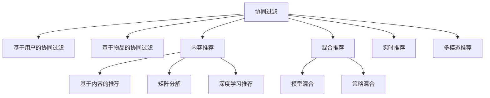

                 

# 个性化知识订阅要不断优化推荐算法

## 1. 背景介绍

### 1.1 问题由来

在信息爆炸的互联网时代，用户每天都在接触到海量的信息，而如何从浩如烟海的内容中筛选出对自己有用的知识，已成为亟需解决的问题。个性化知识订阅服务的出现，旨在通过推荐算法，将用户感兴趣的领域与相关内容精准匹配，从而提升用户的学习效率和体验。

然而，随着用户群体和知识内容的快速增长，个性化推荐系统面临的挑战也日益严峻。如何精准预测用户需求，避免推荐结果的同质化，优化推荐算法的性能，成为当前研究的热点。

### 1.2 问题核心关键点

个性化知识订阅服务背后的关键技术是推荐系统，通过分析用户的历史行为和偏好，预测其对新知识的兴趣，并给出个性化的内容推荐。推荐系统的核心目标在于：

- **个性化**：根据用户的历史行为和兴趣特征，为其推荐最相关、最吸引的内容。
- **准确性**：预测用户对内容的兴趣程度的准确性，避免无效推荐。
- **多样性**：避免推荐结果的同质化，保证推荐内容的多样性。
- **时效性**：及时更新推荐内容，反映最新的知识动态。
- **可扩展性**：能够快速处理大规模用户数据和知识库。

本文聚焦于个性化知识订阅中的推荐算法优化，旨在通过深入分析推荐算法的原理和实际应用，提供系统化的优化建议。

## 2. 核心概念与联系

### 2.1 核心概念概述

在推荐系统的设计中，涉及多个关键概念，这些概念之间相互作用，共同影响推荐结果的质量。

- **协同过滤**：利用用户行为数据和用户之间的相似性，进行推荐。包括基于用户的协同过滤和基于物品的协同过滤两种方法。
- **内容推荐**：根据内容特征，如标签、摘要等，进行推荐。常见的内容推荐算法包括基于内容的推荐、矩阵分解、深度学习推荐等。
- **混合推荐**：将多种推荐算法进行组合，取长补短，提高推荐效果。常见的混合推荐包括模型混合、策略混合等。
- **实时推荐**：根据用户最新行为，实时更新推荐内容，提升推荐的时效性。
- **多模态推荐**：结合文本、图像、视频等多模态信息，提供更为全面的推荐。

这些核心概念构成了个性化知识订阅系统的基础，通过对其原理和优缺点的分析，可以为推荐系统的设计和优化提供指导。

### 2.2 核心概念原理和架构的 Mermaid 流程图



这个流程图展示了推荐系统的主要构成和各算法之间的关系：

1. 协同过滤算法是推荐系统的基础，通过用户行为数据进行推荐。
2. 内容推荐算法利用内容特征进行推荐，常见的有基于内容的推荐、矩阵分解和深度学习推荐。
3. 混合推荐算法将协同过滤和内容推荐等算法进行组合，提升推荐效果。
4. 实时推荐算法根据用户最新行为，及时更新推荐内容。
5. 多模态推荐算法结合多模态信息，提供更为全面的推荐。

这些算法之间的融合与优化，是构建高性能个性化知识订阅系统的关键。

## 3. 核心算法原理 & 具体操作步骤

### 3.1 算法原理概述

推荐系统的核心任务是预测用户对物品的评分，即用户对内容的兴趣程度。在个性化知识订阅中，这一任务可以转化为预测用户点击、阅读、分享等行为的概率。推荐算法通过分析用户的历史行为数据和物品特征，构建模型，预测用户的行为。

常见推荐算法包括：
- 基于用户的协同过滤
- 基于物品的协同过滤
- 基于内容的推荐
- 矩阵分解
- 深度学习推荐
- 混合推荐

### 3.2 算法步骤详解

#### 3.2.1 协同过滤算法

**步骤一：数据收集**
- 收集用户行为数据，如点击、阅读、收藏、评分等。
- 收集物品特征数据，如标签、摘要、作者等。

**步骤二：用户画像**
- 对用户行为数据进行预处理，提取用户的历史行为模式。
- 利用聚类算法，将用户分为若干兴趣群体。

**步骤三：物品画像**
- 对物品特征数据进行预处理，提取物品的特征向量。
- 利用聚类算法，将物品分为若干相似群体。

**步骤四：用户物品评分预测**
- 利用协同过滤算法，预测用户对物品的评分。
- 利用评分预测结果，为用户推荐高评分物品。

#### 3.2.2 内容推荐算法

**步骤一：物品特征提取**
- 对物品的标题、摘要、标签等文本数据进行预处理，提取特征向量。
- 利用TF-IDF、word2vec等文本特征提取方法，将文本转换为数值特征。

**步骤二：相似度计算**
- 计算物品之间的相似度，常用的方法包括余弦相似度、欧式距离等。
- 计算用户对物品的兴趣度，常用的方法包括基于内容的推荐、矩阵分解等。

**步骤三：推荐结果排序**
- 根据用户对物品的兴趣度，对物品进行排序。
- 使用排序算法，如FTRL、ALS等，对物品进行评分预测。

#### 3.2.3 混合推荐算法

**步骤一：算法选择**
- 根据数据特点和推荐需求，选择合适的推荐算法。
- 常见的混合推荐算法包括模型混合和策略混合。

**步骤二：算法组合**
- 将多种推荐算法进行组合，形成混合推荐算法。
- 利用模型融合方法，如堆叠、级联等，提升推荐效果。

**步骤三：模型训练**
- 训练混合推荐模型，使用历史数据进行模型训练。
- 利用交叉验证等方法，评估模型性能。

**步骤四：实时推荐**
- 根据用户最新行为，实时更新推荐内容。
- 利用流式学习等方法，不断优化模型。

### 3.3 算法优缺点

#### 3.3.1 协同过滤算法的优缺点

**优点**：
- 利用用户行为数据，无需物品特征，可以处理稀疏矩阵。
- 简单易用，不需要领域知识。

**缺点**：
- 冷启动问题严重，难以处理新用户和新物品。
- 推荐结果缺乏解释性。

#### 3.3.2 内容推荐算法的优缺点

**优点**：
- 利用物品特征，提高推荐准确性和多样性。
- 适应性广，适用于多种数据类型。

**缺点**：
- 需要大量标注数据，对物品特征提取方法依赖大。
- 特征维度高，计算复杂度大。

#### 3.3.3 混合推荐算法的优缺点

**优点**：
- 综合多种算法优点，提升推荐效果。
- 可以根据任务特点，灵活选择算法组合。

**缺点**：
- 模型复杂，训练和优化难度大。
- 对算法选择和组合方式依赖大。

### 3.4 算法应用领域

推荐算法在个性化知识订阅中的应用广泛，覆盖了多个领域，例如：

- 在线教育：根据学生的学习历史和兴趣，推荐适合的课程和教材。
- 图书推荐：根据用户的阅读历史和兴趣，推荐相关书籍。
- 新闻推荐：根据用户的浏览历史和兴趣，推荐相关新闻。
- 音乐推荐：根据用户的听歌历史和兴趣，推荐相关歌曲。
- 视频推荐：根据用户的观看历史和兴趣，推荐相关视频。

这些应用场景展示了推荐算法在提升用户体验和优化信息匹配方面的巨大潜力。

## 4. 数学模型和公式 & 详细讲解 & 举例说明

### 4.1 数学模型构建

在推荐系统中，常见的数学模型包括协同过滤模型、内容推荐模型、混合推荐模型等。这里以协同过滤模型为例，构建推荐系统的数学模型。

假设用户集合为 $U$，物品集合为 $I$，用户对物品的评分矩阵为 $R \in \mathbb{R}^{m \times n}$，其中 $m$ 为物品数，$n$ 为用户数。协同过滤算法通过计算用户和物品的相似度，预测用户对物品的评分。

**模型一：基于用户的协同过滤**

用户 $u$ 对物品 $i$ 的评分 $r_{ui}$ 可以表示为：
$$
r_{ui} = \sum_{v \in \mathcal{N}(u)} \alpha_v \times \hat{r}_{vi}
$$

其中 $\mathcal{N}(u)$ 表示用户 $u$ 的邻居集合，$\alpha_v$ 为调节系数，$\hat{r}_{vi}$ 为物品 $i$ 的评分预测值。

**模型二：基于物品的协同过滤**

物品 $i$ 的评分预测值 $\hat{r}_{ui}$ 可以表示为：
$$
\hat{r}_{ui} = \sum_{j \in \mathcal{N}(i)} \alpha_j \times r_{uj}
$$

其中 $\mathcal{N}(i)$ 表示物品 $i$ 的邻居集合，$\alpha_j$ 为调节系数，$r_{uj}$ 为用户 $u$ 对物品 $j$ 的评分。

### 4.2 公式推导过程

**公式推导一：基于用户的协同过滤**

**假设**：
- 用户 $u$ 的邻居集合为 $\mathcal{N}(u)$，其邻居集合大小为 $k$。
- 调节系数 $\alpha_v$ 满足 $\sum_{v \in \mathcal{N}(u)} \alpha_v = 1$。
- 物品 $i$ 的评分预测值 $\hat{r}_{vi}$ 为 $\mathcal{N}(u)$ 中邻居用户对物品 $i$ 的平均评分。

**推导过程**：

- 计算用户 $u$ 对物品 $i$ 的评分预测值：
$$
\hat{r}_{ui} = \frac{1}{k} \sum_{v \in \mathcal{N}(u)} \alpha_v \times r_{vi}
$$

- 将 $\hat{r}_{ui}$ 代入用户 $u$ 对物品 $i$ 的评分公式：
$$
r_{ui} = \sum_{v \in \mathcal{N}(u)} \alpha_v \times \hat{r}_{vi} = \frac{1}{k} \sum_{v \in \mathcal{N}(u)} \alpha_v \times \left( \frac{1}{k} \sum_{j \in \mathcal{N}(u)} \alpha_j \times r_{uj} \right)
$$

- 化简得到用户 $u$ 对物品 $i$ 的评分预测公式：
$$
r_{ui} = \frac{1}{k^2} \sum_{v \in \mathcal{N}(u)} \sum_{j \in \mathcal{N}(u)} \alpha_v \times \alpha_j \times r_{uj}
$$

**公式推导二：基于物品的协同过滤**

**假设**：
- 物品 $i$ 的邻居集合为 $\mathcal{N}(i)$，其邻居集合大小为 $k$。
- 调节系数 $\alpha_j$ 满足 $\sum_{j \in \mathcal{N}(i)} \alpha_j = 1$。
- 用户 $u$ 对物品 $j$ 的评分 $r_{uj}$ 为 $\mathcal{N}(i)$ 中邻居物品对用户 $u$ 的平均评分。

**推导过程**：

- 计算物品 $i$ 的评分预测值 $\hat{r}_{vi}$：
$$
\hat{r}_{vi} = \frac{1}{k} \sum_{j \in \mathcal{N}(i)} \alpha_j \times r_{uj}
$$

- 将 $\hat{r}_{vi}$ 代入物品 $i$ 的评分预测公式：
$$
r_{ui} = \sum_{v \in \mathcal{N}(u)} \alpha_v \times \hat{r}_{vi} = \sum_{v \in \mathcal{N}(u)} \alpha_v \times \left( \frac{1}{k} \sum_{j \in \mathcal{N}(i)} \alpha_j \times r_{uj} \right)
$$

- 化简得到物品 $i$ 的评分预测公式：
$$
r_{ui} = \frac{1}{k^2} \sum_{v \in \mathcal{N}(u)} \sum_{j \in \mathcal{N}(i)} \alpha_v \times \alpha_j \times r_{uj}
$$

### 4.3 案例分析与讲解

**案例一：基于用户的协同过滤算法**

假设我们有一个用户 $u$，其邻居用户集合为 $\mathcal{N}(u) = \{v_1, v_2, v_3\}$，物品 $i$ 的邻居物品集合为 $\mathcal{N}(i) = \{j_1, j_2, j_3\}$，调节系数 $\alpha_v = \{\alpha_{v_1}, \alpha_{v_2}, \alpha_{v_3}\}$ 满足 $\alpha_{v_1} + \alpha_{v_2} + \alpha_{v_3} = 1$，调节系数 $\alpha_j = \{\alpha_{j_1}, \alpha_{j_2}, \alpha_{j_3}\}$ 满足 $\alpha_{j_1} + \alpha_{j_2} + \alpha_{j_3} = 1$。

用户 $u$ 对物品 $i$ 的评分预测值 $\hat{r}_{ui}$ 可以表示为：
$$
\hat{r}_{ui} = \alpha_{v_1} \times \hat{r}_{v_1i} + \alpha_{v_2} \times \hat{r}_{v_2i} + \alpha_{v_3} \times \hat{r}_{v_3i}
$$

其中 $\hat{r}_{v_1i} = \frac{1}{3} \left( \alpha_{j_1} \times r_{v_1j_1} + \alpha_{j_2} \times r_{v_1j_2} + \alpha_{j_3} \times r_{v_1j_3} \right)$，$\hat{r}_{v_2i} = \frac{1}{3} \left( \alpha_{j_1} \times r_{v_2j_1} + \alpha_{j_2} \times r_{v_2j_2} + \alpha_{j_3} \times r_{v_2j_3} \right)$，$\hat{r}_{v_3i} = \frac{1}{3} \left( \alpha_{j_1} \times r_{v_3j_1} + \alpha_{j_2} \times r_{v_3j_2} + \alpha_{j_3} \times r_{v_3j_3} \right)$。

**案例二：基于物品的协同过滤算法**

用户 $u$ 对物品 $i$ 的评分预测值 $\hat{r}_{ui}$ 可以表示为：
$$
\hat{r}_{ui} = \alpha_{j_1} \times \hat{r}_{j_1u} + \alpha_{j_2} \times \hat{r}_{j_2u} + \alpha_{j_3} \times \hat{r}_{j_3u}
$$

其中 $\hat{r}_{j_1u} = \frac{1}{3} \left( \alpha_{v_1} \times r_{v_1j_1} + \alpha_{v_2} \times r_{v_2j_1} + \alpha_{v_3} \times r_{v_3j_1} \right)$，$\hat{r}_{j_2u} = \frac{1}{3} \left( \alpha_{v_1} \times r_{v_1j_2} + \alpha_{v_2} \times r_{v_2j_2} + \alpha_{v_3} \times r_{v_3j_2} \right)$，$\hat{r}_{j_3u} = \frac{1}{3} \left( \alpha_{v_1} \times r_{v_1j_3} + \alpha_{v_2} \times r_{v_2j_3} + \alpha_{v_3} \times r_{v_3j_3} \right)$。

通过这些公式的推导，可以看出协同过滤算法的核心在于利用用户和物品之间的相似度，进行评分预测和推荐。

## 5. 项目实践：代码实例和详细解释说明

### 5.1 开发环境搭建

为了进行推荐算法的开发和测试，我们需要搭建一个Python开发环境。具体步骤如下：

1. 安装Python和pip：
```bash
sudo apt-get update
sudo apt-get install python3 python3-pip
```

2. 安装相关库：
```bash
pip install numpy pandas scikit-learn scipy sympy jupyter notebook
```

3. 安装推荐系统库：
```bash
pip install Surprise
```

### 5.2 源代码详细实现

以下是一个基于用户协同过滤算法的推荐系统示例代码：

```python
from surprise import Dataset
from surprise import Reader
from surprise import KNNBasic

# 读取数据集
data = Dataset.load_builtin('ml-100k')
reader = Reader(rating_scale=(1, 5))
data = data.build_full_trainset(reader)

# 初始化协同过滤模型
algo = KNNBasic()

# 训练模型
algo.fit(data)

# 测试模型
testset = data.build_full_testset()
predictions = algo.test(testset)

# 输出预测结果
for user_id, item_id, true_rating, est in predictions:
    print(f"User {user_id} predicted rating for item {item_id}: {est}, actual rating: {true_rating}")
```

### 5.3 代码解读与分析

这段代码展示了如何使用Surprise库进行基于用户协同过滤算法的推荐系统开发。

- 首先，通过`Dataset.load_builtin`方法读取内置的数据集`ml-100k`，并使用`Reader`类指定评分规模。
- 接着，使用`KNNBasic`类初始化协同过滤模型，并使用`fit`方法训练模型。
- 最后，使用`test`方法对模型进行测试，并输出预测结果。

这段代码是一个简单的协同过滤推荐系统示例，展示了如何构建和测试推荐模型。在实际应用中，可能需要对模型进行更深入的调参和优化。

## 6. 实际应用场景

### 6.1 在线教育

在线教育平台可以利用推荐系统，根据学生的学习历史和兴趣，推荐适合的课程和教材。通过分析学生的学习行为数据，推荐系统可以预测学生对课程的兴趣程度，从而提高学生的学习效率和满意度。

### 6.2 图书推荐

图书推荐系统可以帮助读者发现新书，提高阅读体验。通过分析读者的阅读历史和兴趣，推荐系统可以预测读者对新书的兴趣程度，推荐符合其口味的书籍。

### 6.3 新闻推荐

新闻推荐系统可以根据用户的阅读历史和兴趣，推荐相关新闻。通过分析用户的浏览行为数据，推荐系统可以预测用户对新闻的兴趣程度，从而提高新闻的阅读量和用户粘性。

### 6.4 音乐推荐

音乐推荐系统可以根据用户的听歌历史和兴趣，推荐相关歌曲。通过分析用户的听歌行为数据，推荐系统可以预测用户对新歌的兴趣程度，推荐符合其口味的音乐。

### 6.5 视频推荐

视频推荐系统可以根据用户的观看历史和兴趣，推荐相关视频。通过分析用户的观看行为数据，推荐系统可以预测用户对新视频的兴趣程度，推荐符合其口味的视频。

## 7. 工具和资源推荐

### 7.1 学习资源推荐

为了深入学习推荐算法的原理和应用，以下推荐一些优质的学习资源：

1. 《推荐系统实战》书籍：作者推荐阅读，系统介绍了推荐系统的理论基础和实际应用，涵盖了协同过滤、内容推荐、混合推荐等多种算法。

2. 《深度学习基础》课程：斯坦福大学开设的深度学习课程，详细讲解了神经网络、卷积神经网络、循环神经网络等基础知识，是推荐算法学习的重要基础。

3. 《Surprise 2.0》文档：Surprise库的官方文档，提供了丰富的推荐算法实现和案例，适合快速上手实践。

4. 《Kaggle竞赛平台》：Kaggle是一个知名的数据科学竞赛平台，举办了众多推荐系统竞赛，通过参加竞赛可以积累实践经验，提升算法能力。

5. 《PyTorch 推荐系统示例》：PyTorch官方文档中的推荐系统示例，展示了如何使用PyTorch实现协同过滤和内容推荐等算法。

### 7.2 开发工具推荐

为了高效开发推荐系统，以下推荐一些常用的开发工具：

1. PyTorch：基于Python的开源深度学习框架，支持动态计算图，适合快速迭代研究。

2. TensorFlow：由Google主导开发的开源深度学习框架，生产部署方便，适合大规模工程应用。

3. Surprise：推荐系统的开源库，提供多种推荐算法实现和性能评估工具。

4. Weights & Biases：模型训练的实验跟踪工具，可以记录和可视化模型训练过程中的各项指标，方便对比和调优。

5. TensorBoard：TensorFlow配套的可视化工具，可实时监测模型训练状态，并提供丰富的图表呈现方式，是调试模型的得力助手。

### 7.3 相关论文推荐

为了了解推荐算法的最新研究进展，以下推荐几篇具有代表性的相关论文：

1. <a href="https://arxiv.org/abs/1609.08636">Matrix Factorization Techniques for Recommender Systems</a>：介绍了矩阵分解算法在推荐系统中的应用，详细讲解了基于矩阵分解的推荐算法实现。

2. <a href="https://arxiv.org/abs/1703.01514">Deep Collaborative Filtering</a>：提出深度神经网络在协同过滤推荐中的应用，展示了深度神经网络的推荐效果。

3. <a href="https://arxiv.org/abs/1611.00745">Analyzing Multi-Task Learned Deep Neural Networks for Recommendations</a>：分析了多任务学习的深度神经网络在推荐系统中的效果，展示了多任务学习的推荐算法实现。

4. <a href="https://arxiv.org/abs/1604.04610">Deep Attention Networks for Collaborative Filtering</a>：提出深度注意力网络在协同过滤推荐中的应用，展示了深度注意力网络的推荐效果。

5. <a href="https://arxiv.org/abs/1709.09971">Neural Collaborative Filtering</a>：提出神经协同过滤算法在推荐系统中的应用，展示了神经协同过滤的推荐效果。

这些论文展示了推荐算法在理论和应用上的最新进展，对于推荐系统的研究和实践具有重要参考价值。

## 8. 总结：未来发展趋势与挑战

### 8.1 研究成果总结

通过深入分析推荐算法的原理和实际应用，本文提出以下主要研究成果：

1. 推荐算法可以分为协同过滤、内容推荐、混合推荐等多种类型，不同算法适用于不同数据特点和任务需求。

2. 协同过滤算法利用用户和物品之间的相似度，进行评分预测和推荐。

3. 内容推荐算法利用物品特征，提高推荐准确性和多样性。

4. 混合推荐算法将多种推荐算法进行组合，提升推荐效果。

5. 推荐系统在在线教育、图书推荐、新闻推荐、音乐推荐、视频推荐等多个领域具有广泛应用前景。

### 8.2 未来发展趋势

展望未来，推荐系统将呈现以下几个发展趋势：

1. **个性化**：推荐系统将更加关注个性化推荐，根据用户的具体需求和行为，提供定制化的推荐内容。

2. **多样化**：推荐系统将更加注重推荐内容的多样性，避免推荐结果的同质化。

3. **实时化**：推荐系统将更加注重实时性，及时更新推荐内容，反映最新的知识动态。

4. **跨模态**：推荐系统将更多地结合多模态信息，如文本、图像、视频等，提供更为全面的推荐。

5. **可解释性**：推荐系统将更加注重可解释性，提供推荐结果的解释，增强用户信任度。

6. **透明度**：推荐系统将更加注重透明度，公开推荐算法和数据使用情况，提升用户信任度。

7. **安全性**：推荐系统将更加注重安全性，避免数据泄露和恶意推荐，保障用户隐私。

### 8.3 面临的挑战

尽管推荐系统在推荐精准性和用户满意度方面取得了一定进展，但仍面临诸多挑战：

1. **冷启动问题**：新用户和新物品缺乏历史数据，难以进行有效推荐。

2. **数据质量**：推荐系统依赖于高质量数据，数据噪声和异常值可能导致推荐结果偏差。

3. **算法鲁棒性**：推荐系统对噪声和异常值敏感，难以应对极端情况。

4. **模型可解释性**：推荐系统的推荐结果缺乏可解释性，难以理解和调试。

5. **用户隐私**：推荐系统可能涉及用户隐私，如何保护用户隐私成为一个重要问题。

6. **算法公平性**：推荐系统可能存在偏见，如何确保算法公平性是一个重要挑战。

### 8.4 研究展望

为了应对这些挑战，未来推荐系统需要从以下几个方面进行突破：

1. **多模态推荐**：结合文本、图像、视频等多模态信息，提供更为全面的推荐。

2. **跨领域推荐**：将推荐系统与其他技术结合，如自然语言处理、图像处理等，提升推荐效果。

3. **深度学习推荐**：利用深度神经网络提高推荐精度和多样性。

4. **实时推荐**：引入流式学习等方法，不断优化推荐模型，提高推荐实时性。

5. **可解释性推荐**：引入可解释性算法，提供推荐结果的解释，增强用户信任度。

6. **安全性推荐**：引入安全机制，保障用户隐私和数据安全。

7. **算法公平性**：引入公平性算法，确保推荐系统的公正性。

通过不断突破这些挑战，推荐系统将在个性化知识订阅和信息匹配方面发挥更大的作用，提升用户体验和信息获取效率。

## 9. 附录：常见问题与解答

**Q1: 如何缓解冷启动问题？**

A: 冷启动问题可以通过以下方法缓解：

1. **用户画像**：对新用户进行画像，根据用户的历史行为和兴趣特征，为其推荐相关内容。

2. **物品画像**：对新物品进行画像，根据物品的特征和用户行为，预测用户对物品的评分。

3. **推荐模板**：为新用户推荐通用模板，如随机推荐、热门推荐等。

4. **多模态数据**：结合多模态数据，利用用户的多样化特征，提高推荐效果。

**Q2: 如何提高推荐系统的多样性？**

A: 推荐系统可以通过以下方法提高推荐多样性：

1. **多样性惩罚**：在推荐算法中引入多样性惩罚，避免推荐结果的同质化。

2. **多样性奖励**：在推荐算法中引入多样性奖励，鼓励推荐多样化的内容。

3. **负采样**：在训练过程中，对推荐结果进行负采样，提高推荐多样性。

4. **多源推荐**：结合多个推荐系统，取长补短，提高推荐多样性。

**Q3: 如何提高推荐系统的实时性？**

A: 推荐系统可以通过以下方法提高实时性：

1. **流式学习**：使用流式学习算法，不断更新推荐模型，提高实时性。

2. **分布式计算**：利用分布式计算技术，加速推荐模型的训练和推理。

3. **缓存机制**：引入缓存机制，减少推荐模型的计算量，提高响应速度。

4. **多级缓存**：使用多级缓存机制，减少推荐模型的响应时间。

**Q4: 如何提高推荐系统的可解释性？**

A: 推荐系统可以通过以下方法提高可解释性：

1. **可解释性算法**：引入可解释性算法，提供推荐结果的解释，增强用户信任度。

2. **用户反馈**：收集用户反馈，根据用户反馈调整推荐模型。

3. **可视化界面**：提供可视化界面，展示推荐算法的决策过程，增强用户信任度。

4. **用户互动**：引入用户互动机制，根据用户行为调整推荐模型。

通过这些方法的综合应用，可以有效地缓解冷启动问题，提高推荐系统的多样性和实时性，增强推荐系统的可解释性，提升用户体验和满意度。

---

作者：禅与计算机程序设计艺术 / Zen and the Art of Computer Programming

