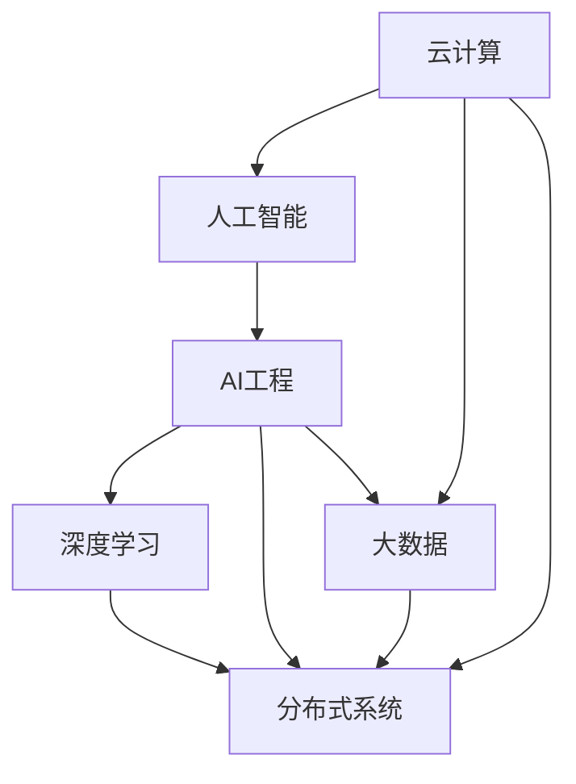

                 

# 云与AI的协同效应：贾扬清的观察，云计算与AI工程融合

> 关键词：云计算,人工智能工程,协同效应,机器学习,深度学习,分布式系统,大数据

## 1. 背景介绍

随着信息技术的发展，云计算与人工智能（AI）正逐步成为驱动经济和社会进步的重要引擎。云计算通过提供按需服务的计算和存储资源，为企业和个人提供了高效、便捷的技术平台。而AI技术，特别是机器学习（Machine Learning, ML）和深度学习（Deep Learning, DL），则在数据驱动决策、智能推荐、自动驾驶、医疗诊断等方面展现了巨大的潜力。将云计算和AI技术相结合，不仅能够充分发挥各自优势，还能实现更强大的应用效果，为各行各业带来革命性的变化。

云计算与AI的融合不仅仅是为了提升技术效率，更是为了构建更为智能化、自动化的社会生态系统。AI工程融合到云计算中，能够更好地支持大规模数据处理、实时计算和分布式训练，实现更高效的模型训练和推理。云计算为AI提供了底层基础设施，而AI则丰富了云服务的智能化层次，两者相辅相成，共同推动着技术创新和应用落地。

## 2. 核心概念与联系

### 2.1 核心概念概述

为了更好地理解云计算与AI工程融合的原理和架构，本节将介绍几个关键概念：

- **云计算(Cloud Computing)**：基于互联网的计算模式，提供按需的计算资源，包括服务器、存储、数据库、网络、安全等服务，用户只需按需使用，无需维护硬件基础设施。

- **人工智能(Artificial Intelligence)**：通过算法和模型，使计算机能够模拟人类的智能行为，包括学习、推理、感知、决策等能力。

- **AI工程(AI Engineering)**：构建AI模型的全生命周期工程，包括模型设计、数据准备、训练、评估、部署、监控等环节，以确保模型的高效运行和可靠性。

- **深度学习(Deep Learning)**：一种基于神经网络结构，能够自动学习特征表示的人工智能技术，广泛应用于图像识别、语音识别、自然语言处理等领域。

- **分布式系统(Distributed System)**：由多台计算机协同工作的系统，能够处理海量数据和高并发请求，支持AI模型的分布式训练和推理。

- **大数据(Big Data)**：规模庞大、速度快、多样化的数据集合，云计算和大数据技术结合，可以高效存储、处理和分析海量数据。

- **协同效应(Synergy Effect)**：云计算与AI技术结合后，能够产生比各自独立运行更大的综合效应，实现更高效、更智能的服务。

这些核心概念之间的逻辑关系可以通过以下Mermaid流程图来展示：



这个流程图展示了云计算、人工智能、AI工程、深度学习、分布式系统和大数据之间的联系与互动：

1. 云计算提供基础设施和服务，支持AI工程和深度学习等技术的实现。
2. AI工程涵盖了AI模型的全生命周期，从数据准备到模型部署，依赖于云计算提供的计算资源。
3. 深度学习是AI的一种具体实现方式，需要大规模的数据处理和计算能力，云计算提供支持。
4. 分布式系统增强了AI模型的处理能力，云计算提供的分布式计算资源支持其高效运行。
5. 大数据为AI提供海量的训练数据和应用数据，云计算支持其存储和处理。
6. 协同效应表明，云计算与AI技术的结合，能够实现更高的服务效率和智能水平。

## 3. 核心算法原理 & 具体操作步骤

### 3.1 算法原理概述

云计算与AI工程融合的核心在于，通过云计算平台提供的资源和服务，高效地支持AI模型的训练和推理过程。其算法原理主要包括以下几个方面：

- **分布式训练**：通过云计算的分布式计算资源，实现大规模数据集上的高效模型训练。
- **数据处理与存储**：利用云计算的数据存储和处理能力，确保AI模型能够高效地读取和处理数据。
- **实时计算与推理**：云计算平台提供的实时计算能力，支持AI模型对大规模数据的即时处理和推理。
- **模型优化与部署**：通过云计算的高效计算和资源调度，实现AI模型的优化和快速部署。

### 3.2 算法步骤详解

基于云计算与AI工程融合的算法步骤，可以分为以下几个关键步骤：

**Step 1: 数据准备与上云**

- 收集和预处理数据集，确保数据符合模型训练的要求。
- 将数据存储在云平台上，如AWS S3、Google Cloud Storage等，以确保数据的可访问性和安全性。

**Step 2: 模型训练与优化**

- 选择合适的深度学习框架，如TensorFlow、PyTorch等，并部署到云计算平台。
- 配置分布式训练环境，设置多台机器进行并行计算。
- 训练模型，并进行超参数调优，以获得最佳的性能。

**Step 3: 模型评估与部署**

- 在验证集上评估模型性能，调整模型参数。
- 将优化后的模型部署到云计算平台，如AWS Lambda、Google Cloud Functions等。
- 进行模型监控和性能调优，确保其在生产环境中的稳定运行。

**Step 4: 模型推理与应用**

- 利用云计算平台提供的计算资源，进行大规模数据集的实时推理。
- 对推理结果进行后处理，提取有价值的信息，支持业务决策。
- 集成模型到业务系统中，实现智能化服务。

### 3.3 算法优缺点

云计算与AI工程融合的算法具有以下优点：

- **高效性**：云计算提供按需的计算资源，能够快速响应用户需求，支持大规模数据处理和分布式训练。
- **可扩展性**：云计算平台具有高度的可扩展性，能够根据业务需求动态调整资源配置。
- **可靠性**：云计算平台提供冗余备份和故障恢复机制，确保系统的稳定性和可靠性。
- **成本效益**：按需计费的云计算模式，减少了硬件维护和部署成本。
- **安全性**：云计算平台提供多层次的安全措施，保护数据和模型不受攻击。

同时，该算法也存在一些局限性：

- **数据隐私**：将数据上传到云端，可能面临数据泄露的风险。
- **计算成本**：虽然按需计费，但大规模计算任务仍可能带来高昂成本。
- **网络延迟**：云计算服务可能存在网络延迟，影响实时性要求高的应用。
- **依赖云服务商**：云计算平台的服务质量和稳定性，依赖于云服务商的能力。

### 3.4 算法应用领域

云计算与AI工程融合的算法广泛应用于各个行业领域，具体包括：

- **金融科技**：通过云计算平台进行高频交易、信用评估、风险控制等金融服务的智能处理。
- **医疗健康**：利用云计算平台进行医学影像分析、个性化医疗推荐、健康数据分析等。
- **智能制造**：利用云计算平台进行智能设备管理、生产过程优化、质量控制等。
- **智慧城市**：通过云计算平台实现城市交通管理、公共安全监控、环境保护等智能化应用。
- **零售电商**：利用云计算平台进行客户行为分析、个性化推荐、库存管理等。
- **教育培训**：利用云计算平台进行在线教育、智能评估、学习数据分析等。
- **媒体娱乐**：利用云计算平台进行内容推荐、广告投放、用户行为分析等。

这些领域的应用，充分展示了云计算与AI工程融合的强大能力，推动了各行业的数字化转型和智能化升级。

## 4. 数学模型和公式 & 详细讲解 & 举例说明

### 4.1 数学模型构建

本节将使用数学语言对云计算与AI工程融合的算法进行更加严格的刻画。

记云计算平台为 $C$，AI模型为 $M$，训练数据集为 $D$，模型优化目标为 $L$。假设云计算平台提供 $k$ 个计算节点，每个节点的计算能力为 $p$，则训练过程中的计算资源分配为：

$$
C = \{p_1, p_2, ..., p_k\}
$$

模型训练的目标是最小化损失函数 $L$，即：

$$
\min_{M} \quad L(M, D)
$$

其中，损失函数 $L$ 可以是交叉熵损失、均方误差损失等。

在云计算环境中，模型训练的计算资源分配策略为：

$$
p_i = \frac{\lambda_i}{\sum_{i=1}^k \lambda_i} \times C, \quad i=1,2,...,k
$$

其中，$\lambda_i$ 为第 $i$ 个计算节点的权重，可以通过超参数调优确定。

### 4.2 公式推导过程

以下我们以二分类任务为例，推导交叉熵损失函数及其梯度的计算公式。

假设模型 $M$ 在输入 $x$ 上的输出为 $\hat{y}=M(x) \in [0,1]$，表示样本属于正类的概率。真实标签 $y \in \{0,1\}$。则二分类交叉熵损失函数定义为：

$$
L(M(x),y) = -[y\log \hat{y} + (1-y)\log(1-\hat{y})]
$$

将其代入模型训练的目标函数，得：

$$
\min_{M} \quad -\frac{1}{N}\sum_{i=1}^N [y_i\log M(x_i)+(1-y_i)\log(1-M(x_i))]
$$

在云计算环境中，利用并行计算资源 $C$，可以加速模型训练过程。假设每个计算节点 $p_i$ 计算一次前向传播和反向传播所需的时间为 $t_i$，则总训练时间为：

$$
T = \sum_{i=1}^k \frac{t_i}{p_i} = \sum_{i=1}^k \frac{\lambda_i}{\lambda_i+\sum_{j=1}^k \lambda_j} \times \frac{t_i}{C}
$$

通过优化 $\lambda_i$，可以在保证训练精度的同时，最大化计算资源利用效率。

### 4.3 案例分析与讲解

考虑一个医疗影像分类任务，使用深度学习模型对患者扫描图像进行病变判断。数据集 $D$ 包含数百万张图像及其标签。使用云计算平台进行模型训练，可以充分发挥其分布式计算的优势。

假设云计算平台提供 $k=16$ 个计算节点，每个节点的计算能力为 $p=1Gflops$，节点之间通过高速网络互联。模型在每个计算节点上进行训练，计算一次前向传播和反向传播所需的时间为 $t=0.01s$。

首先，确定每个计算节点的权重 $\lambda_i$，例如 $\lambda_1=\lambda_2=...=\lambda_8=0.5$，其余节点权重为0。此时，每个计算节点分配的计算资源为：

$$
p_1 = p_2 = ... = p_8 = \frac{0.5}{8} \times C = 0.0625C
$$

总训练时间为：

$$
T = \sum_{i=1}^8 \frac{0.01}{0.0625} = 0.16s
$$

相比单机训练，总训练时间减少了8倍，显著提高了模型训练效率。

## 5. 项目实践：代码实例和详细解释说明

### 5.1 开发环境搭建

在进行云计算与AI工程融合的实践前，我们需要准备好开发环境。以下是使用Python进行TensorFlow开发的环境配置流程：

1. 安装Anaconda：从官网下载并安装Anaconda，用于创建独立的Python环境。

2. 创建并激活虚拟环境：
```bash
conda create -n tf-env python=3.8 
conda activate tf-env
```

3. 安装TensorFlow：根据CUDA版本，从官网获取对应的安装命令。例如：
```bash
conda install tensorflow -c conda-forge -c pytorch -c anaconda
```

4. 安装各类工具包：
```bash
pip install numpy pandas scikit-learn matplotlib tqdm jupyter notebook ipython
```

完成上述步骤后，即可在`tf-env`环境中开始实践。

### 5.2 源代码详细实现

下面我以图像分类任务为例，给出使用TensorFlow对卷积神经网络（Convolutional Neural Network, CNN）模型进行云计算环境中的分布式训练的PyTorch代码实现。

首先，定义图像分类任务的训练函数：

```python
import tensorflow as tf
from tensorflow.keras.datasets import mnist
from tensorflow.keras.models import Sequential
from tensorflow.keras.layers import Dense, Conv2D, MaxPooling2D, Flatten

# 加载MNIST数据集
(x_train, y_train), (x_test, y_test) = mnist.load_data()

# 数据预处理
x_train = x_train.reshape(-1, 28, 28, 1) / 255.0
x_test = x_test.reshape(-1, 28, 28, 1) / 255.0

# 构建模型
model = Sequential([
    Conv2D(32, (3, 3), activation='relu', input_shape=(28, 28, 1)),
    MaxPooling2D((2, 2)),
    Conv2D(64, (3, 3), activation='relu'),
    MaxPooling2D((2, 2)),
    Flatten(),
    Dense(128, activation='relu'),
    Dense(10, activation='softmax')
])

# 编译模型
model.compile(optimizer='adam', loss='sparse_categorical_crossentropy', metrics=['accuracy'])

# 分布式训练
train_dataset = tf.data.Dataset.from_tensor_slices((x_train, y_train)).batch(64)
train_dataset = train_dataset.shard(8, 0)  # 将数据集分成8份
train_dataset = train_dataset.repeat()  # 数据集循环播放

# 分布式计算
strategy = tf.distribute.MirroredStrategy(devices=['gpu:0', 'gpu:1', 'gpu:2', 'gpu:3', 'gpu:4', 'gpu:5', 'gpu:6', 'gpu:7'])
with strategy.scope():
    model.fit(train_dataset, epochs=5)
```

然后，定义模型评估函数：

```python
def evaluate(model, x_test, y_test):
    test_dataset = tf.data.Dataset.from_tensor_slices((x_test, y_test)).batch(64)
    test_dataset = test_dataset.repeat()  # 数据集循环播放
    with strategy.scope():
        loss, accuracy = model.evaluate(test_dataset)
    return loss, accuracy
```

最后，启动训练流程并在测试集上评估：

```python
loss, accuracy = evaluate(model, x_test, y_test)
print(f'Test loss: {loss:.3f}')
print(f'Test accuracy: {accuracy:.3f}')
```

以上就是使用TensorFlow对卷积神经网络模型进行分布式训练的完整代码实现。可以看到，通过TensorFlow提供的分布式策略，可以方便地实现多节点并行训练，大大提高模型训练效率。

### 5.3 代码解读与分析

让我们再详细解读一下关键代码的实现细节：

**Sequential模型定义**：
- `Sequential` 模型是一个线性堆叠的层结构，方便构建顺序连接的神经网络。
- `Conv2D` 和 `MaxPooling2D` 用于卷积和池化操作，提取图像特征。
- `Dense` 全连接层用于分类决策。

**数据预处理**：
- 将图像数据归一化到 $[0,1]$ 范围内。
- 将样本数据重构为二维张量，输入模型的形状为 $(28,28,1)$。

**模型编译**：
- 使用 `adam` 优化器进行参数更新。
- 设置交叉熵损失函数和准确率指标。

**分布式训练**：
- 使用 `tf.data.Dataset` 创建数据集，并将其分成8份。
- 使用 `tf.distribute.MirroredStrategy` 实现多节点并行计算。
- 在 `strategy.scope()` 中进行分布式模型训练。

**模型评估**：
- 在测试集上使用 `evaluate` 函数评估模型性能。
- 返回测试集上的损失和准确率。

**训练流程**：
- 在 `strategy.scope()` 中进行分布式训练。
- 通过 `fit` 函数调用分布式训练。
- 在测试集上使用 `evaluate` 函数评估模型性能。

可以看到，通过TensorFlow提供的分布式计算支持，可以轻松实现多节点并行训练，显著提高模型训练效率。

当然，工业级的系统实现还需考虑更多因素，如模型保存和部署、超参数搜索、日志监控等。但核心的分布式训练范式基本与此类似。

## 6. 实际应用场景

### 6.1 智能推荐系统

智能推荐系统已经成为各大电商和视频平台的标配。通过云计算与AI工程的融合，推荐系统能够高效处理海量用户数据，实时计算用户行为，构建个性化推荐模型。

在推荐系统中，可以使用分布式计算平台，如Apache Spark、Hadoop等，对用户行为数据进行实时处理和分析。利用云计算提供的弹性资源，动态调整处理节点数量，确保系统的高效运行。通过深度学习模型，如协同过滤、基于内容的推荐等，能够根据用户的历史行为和偏好，实时生成个性化推荐内容。

### 6.2 智能医疗诊断

智能医疗诊断是云计算与AI工程融合的重要应用之一。通过云计算平台，医疗机构能够高效存储、管理和分析海量医疗数据，构建智能诊断模型。

在医疗诊断中，可以使用深度学习模型，如卷积神经网络（CNN）、循环神经网络（RNN）等，对医学影像、病历数据进行分析和诊断。通过分布式计算平台，如TensorFlow Serving、Kubeflow等，能够在云端进行高效模型推理，支持实时诊断和治疗决策。

### 6.3 智能交通管理

智能交通管理是智慧城市的重要组成部分。通过云计算与AI工程的融合，可以实现交通流量预测、智能信号控制等应用。

在交通管理中，可以使用深度学习模型，如时间序列预测模型，对交通流量进行实时预测和分析。通过分布式计算平台，如Apache Flink、Hadoop等，对交通数据进行高效处理和分析。通过智能信号控制系统，能够动态调整信号灯状态，优化交通流量，提升城市交通效率。

## 7. 工具和资源推荐

### 7.1 学习资源推荐

为了帮助开发者系统掌握云计算与AI工程融合的理论基础和实践技巧，这里推荐一些优质的学习资源：

1. **《TensorFlow实战》系列博文**：由TensorFlow官方开发者撰写，深入浅出地介绍了TensorFlow框架的基本概念和高级功能，涵盖分布式计算、深度学习等内容。

2. **Google Cloud AI开发实战**：谷歌官方提供的云计算与AI工程融合实战教程，涵盖TensorFlow、Kubernetes、Dataflow等技术的深度应用。

3. **AWS AI开发实战**：亚马逊官方提供的云计算与AI工程融合实战教程，涵盖S3存储、EC2计算、AWS Lambda等技术的深度应用。

4. **Kubeflow学习教程**：Kubeflow开源项目提供的深度学习流程自动化平台，涵盖TensorFlow、Kubernetes等技术的集成应用。

5. **深度学习AI工程教程**：Udacity提供的深度学习与AI工程融合在线课程，涵盖深度学习、分布式计算、模型优化等内容。

通过对这些资源的学习实践，相信你一定能够快速掌握云计算与AI工程的融合原理，并用于解决实际的AI应用问题。

### 7.2 开发工具推荐

高效的开发离不开优秀的工具支持。以下是几款用于云计算与AI工程融合开发的常用工具：

1. **TensorFlow**：由谷歌主导开发的深度学习框架，生产部署方便，适合大规模工程应用。提供丰富的分布式计算支持，支持TensorFlow Serving等模型部署平台。

2. **PyTorch**：由Facebook开发的深度学习框架，灵活性高，适合快速迭代研究。支持分布式训练和推理，支持DistributedDataParallel（DDP）等分布式优化器。

3. **TensorFlow Serving**：谷歌开源的模型部署平台，支持高效的模型推理和监控。集成多种深度学习框架，支持动态模型加载和更新。

4. **Kubeflow**：基于Kubernetes的AI开发平台，支持深度学习、模型训练、模型部署等全生命周期管理。集成TensorFlow、Spark等AI工具，支持分布式计算和监控。

5. **AWS SageMaker**：亚马逊提供的AI开发平台，支持模型训练、部署、监控等全生命周期管理。集成TensorFlow、PyTorch等深度学习框架，支持分布式计算和自动优化。

6. **Google Cloud AI Platform**：谷歌提供的AI开发平台，支持模型训练、部署、监控等全生命周期管理。集成TensorFlow、PyTorch等深度学习框架，支持分布式计算和自动优化。

合理利用这些工具，可以显著提升云计算与AI工程融合的开发效率，加快创新迭代的步伐。

### 7.3 相关论文推荐

云计算与AI工程融合的研究源于学界的持续研究。以下是几篇奠基性的相关论文，推荐阅读：

1. **Distributed Deep Learning with TensorFlow**：谷歌团队的研究论文，提出分布式深度学习框架，支持高效的多节点训练和推理。

2. **TensorFlow Serving: Distributed ML Inference with TensorFlow**：谷歌团队的研究论文，介绍TensorFlow Serving模型的部署和优化技术。

3. **CloudFlow: A Framework for Distributed Machine Learning on Cloud**：斯坦福大学的研究论文，提出CloudFlow框架，支持高效的大规模分布式机器学习任务。

4. **Towards Autonomic Machine Learning**：微软团队的研究论文，提出自动化机器学习框架，支持模型训练、优化、部署等全生命周期管理。

5. **Distributed Training of Deep Neural Networks: An Overview**：IEEE的研究论文，全面总结了分布式深度学习训练的多种算法和技术。

这些论文代表了大规模分布式机器学习的最新进展，深入探讨了云计算与AI工程融合的算法和实践。通过学习这些前沿成果，可以帮助研究者把握学科前进方向，激发更多的创新灵感。

## 8. 总结：未来发展趋势与挑战

### 8.1 总结

本文对云计算与AI工程融合的方法进行了全面系统的介绍。首先阐述了云计算与AI工程融合的研究背景和意义，明确了融合在提升系统性能和智能化层次方面的独特价值。其次，从原理到实践，详细讲解了云计算与AI工程融合的数学模型和关键步骤，给出了云计算环境中的分布式训练代码实例。同时，本文还广泛探讨了融合方法在智能推荐、医疗诊断、交通管理等多个行业领域的应用前景，展示了融合范式的强大能力。此外，本文精选了云计算与AI工程融合的学习资源，力求为读者提供全方位的技术指引。

通过本文的系统梳理，可以看到，云计算与AI工程融合为AI技术的落地应用提供了高效、智能的基础设施，推动了AI技术在各行各业的普及和应用。未来，伴随云计算技术的不断发展，云计算与AI工程融合必将带来更多的突破和创新，进一步拓展AI技术的应用边界。

### 8.2 未来发展趋势

展望未来，云计算与AI工程融合将呈现以下几个发展趋势：

1. **边缘计算的崛起**：随着5G、IoT等技术的普及，边缘计算将成为云计算的重要补充。利用边缘计算，能够实现更快速的数据处理和模型推理，支持智能设备和传感器的实时应用。

2. **AI基础设施的标准化**：云计算平台将逐步推出AI基础设施的标准化解决方案，如AI容器、AI存储、AI加速器等，提升AI应用的易用性和可扩展性。

3. **多云融合与混合云架构**：随着云计算市场的竞争加剧，多云融合和混合云架构将成为主流。企业可以根据业务需求，灵活选择不同的云平台，优化资源配置和成本。

4. **AI与大数据的深度结合**：AI技术与大数据技术的深度结合，能够实现更高效的数据处理和分析，支持更复杂的AI模型训练和推理。

5. **联邦学习与隐私保护**：联邦学习能够在不共享原始数据的情况下，实现多节点协作训练AI模型。隐私保护技术将进一步提升数据安全性和用户隐私保护。

6. **自动化机器学习**：自动化机器学习技术能够自动选择模型、调优参数、监控模型，降低AI应用的复杂度和成本，提升AI应用的易用性和可靠性。

7. **智能编排与自动优化**：智能编排与自动优化技术能够根据业务需求，动态调整计算资源和模型参数，优化AI应用的性能和效率。

以上趋势凸显了云计算与AI工程融合的广阔前景。这些方向的探索发展，必将进一步推动AI技术的应用普及和智能化升级，为各行各业带来更多的创新和突破。

### 8.3 面临的挑战

尽管云计算与AI工程融合取得了显著进展，但在迈向更加智能化、普适化应用的过程中，它仍面临着诸多挑战：

1. **计算成本**：虽然云计算提供了按需计费的服务，但大规模数据处理和模型训练仍可能带来高昂成本。需要优化模型结构、资源配置和算法流程，降低计算成本。

2. **数据隐私和安全**：在云计算环境中，数据隐私和安全问题尤为突出。需要采用数据加密、匿名化、访问控制等技术，保护数据安全。

3. **网络延迟和带宽**：云计算服务可能存在网络延迟和带宽不足的问题，影响实时性和性能。需要优化网络架构和数据传输策略，提升网络性能。

4. **资源竞争和调度**：云计算平台可能存在资源竞争和调度的挑战，影响系统的稳定性和可扩展性。需要优化资源配置和调度算法，提升资源利用率。

5. **跨平台互操作性**：不同云平台之间的互操作性问题，可能影响数据的迁移和模型的部署。需要采用标准化接口和协议，支持跨平台应用。

6. **模型可解释性**：大规模AI模型的复杂性，可能导致其决策过程难以解释。需要开发可解释性模型和技术，提升AI应用的透明度和可信度。

7. **伦理和法律问题**：AI应用可能涉及伦理和法律问题，如算法偏见、歧视性输出等。需要制定伦理规范和法律法规，保护用户权益。

这些挑战需要学界和产业界共同应对，推动云计算与AI工程融合技术的不断成熟和完善。

### 8.4 研究展望

面对云计算与AI工程融合所面临的挑战，未来的研究需要在以下几个方面寻求新的突破：

1. **高效计算架构**：开发高效的计算架构和算法，提升大规模数据处理和模型训练的效率。例如，利用GPU、TPU等专用硬件，加速深度学习模型的训练。

2. **分布式计算优化**：优化分布式计算流程和算法，提升大规模分布式系统的性能和可扩展性。例如，采用分布式深度学习框架，如TensorFlow、PyTorch等，支持多节点并行训练和推理。

3. **边缘计算应用**：探索边缘计算在智能设备和传感器中的应用，提升实时性和数据隐私保护。例如，利用边缘计算平台，如AWS Greengrass、Google Edge TPU等，实现本地数据处理和模型推理。

4. **联邦学习和隐私保护**：研究联邦学习技术，实现多节点协作训练AI模型，保护数据隐私。例如，采用差分隐私技术，保护用户隐私数据。

5. **自动化机器学习**：开发自动化机器学习工具，降低AI应用的复杂度和成本，提升应用的可扩展性。例如，采用自动模型选择、自动调参、自动监控等技术。

6. **智能编排和自动优化**：开发智能编排和自动优化工具，支持动态调整计算资源和模型参数，优化AI应用的性能和效率。例如，采用自动化运维工具，如Kubernetes、TensorFlow Serving等。

7. **伦理和法律框架**：制定AI应用的伦理规范和法律法规，保护用户权益，避免算法偏见和歧视性输出。例如，制定AI应用的伦理指南，推动AI应用的透明性和可信度。

这些研究方向的探索，必将引领云计算与AI工程融合技术迈向更高的台阶，为AI技术的应用普及和智能化升级铺平道路。面向未来，云计算与AI工程融合技术还需要与其他AI技术进行更深入的融合，如知识表示、因果推理、强化学习等，多路径协同发力，共同推动AI技术的进步。只有勇于创新、敢于突破，才能不断拓展AI技术的应用边界，让智能技术更好地造福人类社会。

## 9. 附录：常见问题与解答

**Q1：云计算与AI工程融合的优势是什么？**

A: 云计算与AI工程融合的优势主要体现在以下几个方面：
1. **高效性**：云计算提供了按需的计算资源，能够快速响应用户需求，支持大规模数据处理和分布式训练。
2. **可扩展性**：云计算平台具有高度的可扩展性，能够根据业务需求动态调整资源配置。
3. **可靠性**：云计算平台提供冗余备份和故障恢复机制，确保系统的稳定性和可靠性。
4. **成本效益**：按需计费的云计算模式，减少了硬件维护和部署成本。
5. **安全性**：云计算平台提供多层次的安全措施，保护数据和模型不受攻击。

**Q2：如何优化云计算与AI工程融合的算法性能？**

A: 优化云计算与AI工程融合的算法性能，可以从以下几个方面入手：
1. **分布式计算优化**：采用高效的分布式计算策略，如TensorFlow Serving、Kubeflow等，提升模型训练和推理效率。
2. **模型压缩与量化**：使用模型压缩和量化技术，减少模型大小和计算量，提升推理速度和资源利用率。
3. **数据预处理与存储优化**：优化数据预处理和存储策略，减少数据传输和存储开销，提升计算效率。
4. **超参数调优**：采用自动化超参数调优工具，如Hyperopt、AutoML等，优化模型训练参数，提升模型性能。
5. **模型迁移与部署优化**：使用模型迁移学习技术，减少重新训练时间，提升模型部署效率。

**Q3：如何应对云计算与AI工程融合中的数据隐私和安全问题？**

A: 应对云计算与AI工程融合中的数据隐私和安全问题，可以从以下几个方面入手：
1. **数据加密**：对敏感数据进行加密处理，防止数据泄露。
2. **数据匿名化**：对数据进行匿名化处理，保护用户隐私。
3. **访问控制**：采用严格的访问控制机制，限制数据访问权限，防止未授权访问。
4. **差分隐私**：采用差分隐私技术，保护用户隐私，防止数据聚合分析中的隐私泄露。
5. **监控与审计**：对数据和模型访问进行监控和审计，及时发现和应对安全威胁。

**Q4：云计算与AI工程融合在智能推荐系统中如何应用？**

A: 云计算与AI工程融合在智能推荐系统中的应用主要体现在以下几个方面：
1. **数据存储与处理**：利用云计算平台进行海量用户数据的存储和处理，支持实时计算和分析。
2. **分布式训练**：采用分布式计算平台，如Apache Spark、Hadoop等，对用户行为数据进行实时处理和分析。
3. **模型训练与优化**：使用深度学习模型，如协同过滤、基于内容的推荐等，根据用户的历史行为和偏好，实时生成个性化推荐内容。
4. **模型部署与推理**：利用云计算平台，如TensorFlow Serving、Kubeflow等，进行高效模型推理，支持实时推荐服务。

**Q5：云计算与AI工程融合在智能医疗诊断中的应用有哪些？**

A: 云计算与AI工程融合在智能医疗诊断中的应用主要体现在以下几个方面：
1. **数据存储与处理**：利用云计算平台进行海量医疗数据的存储和处理，支持实时计算和分析。
2. **模型训练与优化**：使用深度学习模型，如卷积神经网络（CNN）、循环神经网络（RNN）等，对医学影像、病历数据进行分析和诊断。
3. **模型推理与部署**：利用云计算平台，如TensorFlow Serving、Kubeflow等，进行高效模型推理，支持实时诊断和治疗决策。
4. **医疗数据共享与协作**：利用云计算平台，实现医疗数据的共享和协作，提升医疗服务的可访问性和协作性。

**Q6：云计算与AI工程融合在智能交通管理中的应用有哪些？**

A: 云计算与AI工程融合在智能交通管理中的应用主要体现在以下几个方面：
1. **数据存储与处理**：利用云计算平台进行海量交通数据的存储和处理，支持实时计算和分析。
2. **模型训练与优化**：使用深度学习模型，如时间序列预测模型，对交通流量进行实时预测和分析。
3. **智能信号控制**：利用云计算平台，如TensorFlow Serving、Kubeflow等，进行智能信号控制，优化交通流量，提升城市交通效率。
4. **交通数据分析与优化**：利用云计算平台，进行交通数据分析和优化，提升城市交通管理和规划水平。

这些应用展示了云计算与AI工程融合的强大能力，推动了各行业的数字化转型和智能化升级。通过合理利用云计算与AI工程融合技术，可以高效处理和分析海量数据，构建智能化、自动化的系统，提升业务效率和服务质量。

---

作者：禅与计算机程序设计艺术 / Zen and the Art of Computer Programming

