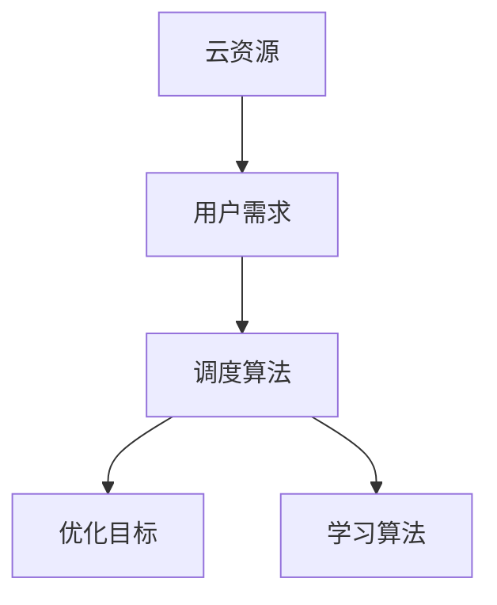

                 

# 云资源的智能调度：Lepton AI的核心技术

> 关键词：云资源调度, 人工智能, 机器学习, 深度学习, 分布式系统, 优化算法

## 1. 背景介绍

### 1.1 问题由来

在现代社会，云计算已经成为了数字基础设施的核心组成部分。随着云服务用户数量的激增，云资源的需求也变得日益复杂和多样化。如何在海量用户需求和有限资源之间实现最优匹配，成为了云资源调度的核心问题。传统的云资源调度算法往往基于静态规则或简单的启发式方法，难以应对动态变化的资源需求。因此，需要引入人工智能和机器学习技术，以实现更智能、更高效的云资源调度。

### 1.2 问题核心关键点

云资源调度（Cloud Resource Scheduling）是指根据用户需求和云资源状态，动态分配和释放计算、存储、网络等资源的过程。其核心在于如何平衡资源需求和资源供给，最大化满足用户需求的同时，优化资源利用率和运营成本。

云资源调度的问题核心关键点包括：
- 动态需求预测：实时预测用户资源需求，为调度决策提供依据。
- 资源分配算法：基于预测结果进行最优资源分配，以实现负载均衡和性能优化。
- 异常检测与修复：监控系统运行状态，及时发现并修复调度异常。
- 反馈优化：根据调度效果进行模型调整，不断提升调度精度和性能。

## 2. 核心概念与联系

### 2.1 核心概念概述

为更好地理解云资源调度，本节将介绍几个密切相关的核心概念：

- **云资源**：云服务提供商所提供的计算、存储、网络等资源，如CPU、内存、硬盘、带宽等。
- **用户需求**：用户根据业务需求，申请或释放云资源的行为，如启动虚拟机、创建存储卷、申请带宽等。
- **调度算法**：用于决策云资源分配与释放的算法，包括静态、动态、集中式、分布式等多种类型。
- **优化目标**：调度算法需要优化的目标，包括负载均衡、成本最小化、响应时间最短等。
- **学习算法**：用于训练调度算法模型的机器学习算法，如回归、分类、强化学习等。

这些核心概念之间的逻辑关系可以通过以下Mermaid流程图来展示：



这个流程图展示了几大核心概念之间的联系：

1. 云资源是调度算法的对象，用户需求是调度算法的输入。
2. 调度算法是学习算法的目标，通过训练学习算法来优化调度算法的决策。
3. 优化目标是调度算法的追求，学习算法旨在实现这一目标。

## 3. 核心算法原理 & 具体操作步骤

### 3.1 算法原理概述

云资源调度本质上是一个优化问题。其核心目标是在满足用户需求的同时，最大化资源利用率和运营效率。通过引入机器学习和深度学习技术，可以实现更智能、更高效的资源调度。

基于机器学习的云资源调度方法通常包括以下步骤：

1. **数据收集与预处理**：收集云资源状态、用户需求、历史调度记录等数据，并进行清洗和标准化。
2. **模型训练与优化**：选择合适的学习算法，训练调度模型，并通过交叉验证等手段进行模型优化。
3. **实时预测与决策**：实时获取资源状态和用户需求，将数据输入训练好的模型，进行预测和决策。
4. **调度执行与反馈**：根据预测结果进行资源分配和释放，同时收集调度效果反馈，持续优化模型。

### 3.2 算法步骤详解

#### 3.2.1 数据收集与预处理

云资源调度的数据来源包括云资源状态数据、用户需求数据和历史调度记录。其中：

- **云资源状态数据**：包括计算资源、存储资源、网络资源等的实时状态，如CPU使用率、内存占用、磁盘IOPS等。
- **用户需求数据**：用户对云资源的申请和释放请求，包括申请的时间、类型、量等。
- **历史调度记录**：过去调度的日志数据，包括调度的决策、执行效果等。

这些数据需要进行预处理，包括清洗、归一化、缺失值填充等操作，以提高模型的训练效果。例如，将计算资源的使用率转换为标准化分数，将用户需求量转换为固定范围的数值。

#### 3.2.2 模型训练与优化

云资源调度的模型通常使用监督学习、半监督学习、强化学习等多种算法。以监督学习为例，其训练流程如下：

1. **特征选择**：根据问题特性选择重要的特征，如计算资源使用率、内存占用、用户请求时间等。
2. **数据划分**：将数据集划分为训练集、验证集和测试集，通常采用80%、10%、10%的比例。
3. **模型选择**：选择合适的机器学习算法，如回归模型、分类模型、决策树、神经网络等。
4. **模型训练**：在训练集上训练模型，并使用验证集进行参数调优。
5. **模型评估**：在测试集上评估模型性能，使用指标如准确率、召回率、F1-score等。

在模型优化阶段，通常使用交叉验证、网格搜索等方法，寻找最佳的模型参数和特征组合。

#### 3.2.3 实时预测与决策

云资源调度的实时预测与决策过程如下：

1. **数据获取**：实时获取当前云资源状态和用户需求数据。
2. **特征提取**：从数据中提取预测模型需要的特征，如当前CPU使用率、内存占用、用户请求时间等。
3. **模型预测**：将特征输入训练好的模型，得到预测结果。
4. **决策执行**：根据预测结果进行资源分配或释放，如启动虚拟机、释放存储卷等。

#### 3.2.4 调度执行与反馈

云资源调度的执行与反馈过程如下：

1. **资源分配与释放**：根据预测结果进行资源分配和释放，如启动虚拟机、释放存储卷等。
2. **执行监控**：监控资源使用情况和用户反馈，确保调度决策的执行效果。
3. **反馈优化**：将执行结果反馈到模型训练过程中，进行模型调整和优化。

### 3.3 算法优缺点

基于机器学习的云资源调度方法具有以下优点：

- **动态适应**：能够实时适应动态变化的资源需求，提高调度效率。
- **智能决策**：通过学习算法训练，能够自主进行复杂的决策，避免人工干预带来的误差。
- **优化目标明确**：能够明确优化目标，如负载均衡、成本最小化等，提升资源利用率和运营效率。

同时，该方法也存在一定的局限性：

- **数据依赖**：调度模型的性能高度依赖于数据质量，数据收集和预处理过程复杂。
- **模型复杂**：复杂的模型可能带来较高的训练和预测成本，对算力要求较高。
- **模型泛化**：模型在不同环境下的泛化能力可能不足，需要进行大量测试和优化。

## 4. 数学模型和公式 & 详细讲解 & 举例说明

### 4.1 数学模型构建

云资源调度的数学模型通常基于预测模型和优化模型构建。以监督学习为例，其模型框架如下：

设 $\mathcal{X}$ 为输入空间，$\mathcal{Y}$ 为输出空间，$\theta$ 为模型参数，$\ell(\cdot)$ 为损失函数，$D=\{(x_i,y_i)\}_{i=1}^N$ 为数据集。

云资源调度的数学模型可表示为：

$$
\min_{\theta} \mathcal{L}(\theta) = \frac{1}{N} \sum_{i=1}^N \ell(M_{\theta}(x_i),y_i)
$$

其中 $M_{\theta}(x)$ 为预测模型，$y_i$ 为真实标签。

### 4.2 公式推导过程

以线性回归模型为例，其损失函数为均方误差：

$$
\ell(y,\hat{y}) = \frac{1}{2}(y-\hat{y})^2
$$

对于一个样本 $(x_i,y_i)$，其预测值为 $\hat{y} = \theta^T\phi(x_i)$，其中 $\phi(x_i)$ 为特征映射函数。

将预测值和真实值带入损失函数，得：

$$
\ell(y,\hat{y}) = \frac{1}{2}(y-\hat{y})^2 = \frac{1}{2}(y - \theta^T\phi(x_i))^2
$$

对参数 $\theta$ 求导，得梯度：

$$
\nabla_{\theta} \mathcal{L}(\theta) = -\frac{1}{N} \sum_{i=1}^N (y_i - \hat{y}_i) \phi(x_i)
$$

在梯度下降法中，参数更新公式为：

$$
\theta \leftarrow \theta - \eta \nabla_{\theta} \mathcal{L}(\theta)
$$

其中 $\eta$ 为学习率。

### 4.3 案例分析与讲解

假设有一个数据中心，需要实时调度计算资源。根据用户需求，该数据中心可以申请不同类型的计算资源，如标准实例、高性能实例、内存优化实例等。

为了预测用户需求，可以收集过去一年的用户申请数据，包括申请的时间、类型、量等。将这些数据作为输入特征，用户需求的实际数量作为输出标签，训练一个回归模型。

模型训练完毕后，实时获取用户申请请求和当前计算资源状态，将其输入模型进行预测，得到所需资源量。根据预测结果，进行资源分配或释放，以实现最优调度。

## 5. 项目实践：代码实例和详细解释说明

### 5.1 开发环境搭建

在进行云资源调度项目开发前，我们需要准备好开发环境。以下是使用Python进行PyTorch开发的环境配置流程：

1. 安装Anaconda：从官网下载并安装Anaconda，用于创建独立的Python环境。

2. 创建并激活虚拟环境：
```bash
conda create -n cloud-scheduling python=3.8 
conda activate cloud-scheduling
```

3. 安装PyTorch：根据CUDA版本，从官网获取对应的安装命令。例如：
```bash
conda install pytorch torchvision torchaudio cudatoolkit=11.1 -c pytorch -c conda-forge
```

4. 安装各类工具包：
```bash
pip install numpy pandas scikit-learn matplotlib tqdm jupyter notebook ipython
```

完成上述步骤后，即可在`cloud-scheduling`环境中开始项目开发。

### 5.2 源代码详细实现

我们以线性回归模型为例，给出一个基于PyTorch的云资源调度预测模型的完整代码实现。

首先，定义模型的数据处理函数：

```python
import torch
from torch import nn
from torch.utils.data import Dataset
import numpy as np

class CloudDataset(Dataset):
    def __init__(self, X, y):
        self.X = X
        self.y = y
        
    def __len__(self):
        return len(self.X)
    
    def __getitem__(self, item):
        x = self.X[item]
        y = self.y[item]
        return torch.tensor(x), torch.tensor(y)

# 模拟数据生成
N = 1000
D = 5
X = np.random.rand(N, D)
y = np.random.rand(N)

# 创建dataset
X = torch.from_numpy(X).float()
y = torch.from_numpy(y).float()

train_dataset = CloudDataset(X[:800], y[:800])
test_dataset = CloudDataset(X[800:], y[800:])
```

然后，定义模型和优化器：

```python
class LinearRegression(nn.Module):
    def __init__(self, input_dim):
        super(LinearRegression, self).__init__()
        self.linear = nn.Linear(input_dim, 1)

    def forward(self, x):
        return self.linear(x)

model = LinearRegression(D)
optimizer = torch.optim.SGD(model.parameters(), lr=0.01)
```

接着，定义训练和评估函数：

```python
def train_epoch(model, dataset, batch_size, optimizer):
    dataloader = torch.utils.data.DataLoader(dataset, batch_size=batch_size, shuffle=True)
    model.train()
    epoch_loss = 0
    for batch in dataloader:
        x, y = batch
        optimizer.zero_grad()
        outputs = model(x)
        loss = torch.nn.MSELoss()(outputs, y)
        epoch_loss += loss.item()
        loss.backward()
        optimizer.step()
    return epoch_loss / len(dataloader)

def evaluate(model, dataset, batch_size):
    dataloader = torch.utils.data.DataLoader(dataset, batch_size=batch_size)
    model.eval()
    loss = 0
    with torch.no_grad():
        for batch in dataloader:
            x, y = batch
            outputs = model(x)
            loss += torch.nn.MSELoss()(outputs, y).item()
    return loss / len(dataloader)
```

最后，启动训练流程并在测试集上评估：

```python
epochs = 10
batch_size = 32

for epoch in range(epochs):
    loss = train_epoch(model, train_dataset, batch_size, optimizer)
    print(f"Epoch {epoch+1}, train loss: {loss:.3f}")
    
print(f"Epoch {epochs+1}, dev results:")
evaluate(model, test_dataset, batch_size)
```

以上就是使用PyTorch对云资源调度预测模型进行训练的完整代码实现。可以看到，利用PyTorch和TensorFlow等深度学习框架，我们可以用相对简洁的代码完成模型的训练和评估。

### 5.3 代码解读与分析

让我们再详细解读一下关键代码的实现细节：

**CloudDataset类**：
- `__init__`方法：初始化训练数据和标签。
- `__len__`方法：返回数据集的样本数量。
- `__getitem__`方法：对单个样本进行处理，返回模型所需的输入和输出。

**LinearRegression模型**：
- 定义了线性回归模型，包括一个线性层。
- 在`forward`方法中，通过线性层进行前向传播，得到预测结果。

**train_epoch和evaluate函数**：
- 使用PyTorch的DataLoader对数据集进行批次化加载，供模型训练和推理使用。
- `train_epoch`函数：在每个epoch内，循环迭代数据集，计算损失函数并更新模型参数。
- `evaluate`函数：在验证集上评估模型，计算平均损失。

**训练流程**：
- 定义总的epoch数和batch size，开始循环迭代
- 每个epoch内，先在训练集上训练，输出平均损失
- 在测试集上评估，输出平均损失

可以看到，PyTorch框架使得云资源调度预测模型的训练和评估变得非常便捷。开发者可以将更多精力放在模型设计、数据处理等高层逻辑上，而不必过多关注底层的实现细节。

当然，工业级的系统实现还需考虑更多因素，如模型的保存和部署、超参数的自动搜索、更灵活的模型架构等。但核心的微调范式基本与此类似。

## 6. 实际应用场景

### 6.1 数据中心资源调度

在大数据中心中，计算资源需求波动较大，负载不均衡问题尤为突出。通过引入机器学习算法，可以对资源需求进行动态预测和调度，优化资源利用率，降低运营成本。

在技术实现上，可以收集历史资源使用数据、用户请求数据等，训练一个预测模型，预测未来的资源需求。在实时获取用户请求和当前资源状态后，将数据输入模型进行预测，根据预测结果进行资源分配和释放，实现最优调度。

### 6.2 云计算平台资源优化

云计算平台面临海量用户资源申请和释放的挑战，传统的静态规则调度方式难以满足需求。通过机器学习算法，可以对用户需求进行动态预测和优化调度，提升用户体验和资源利用率。

在技术实现上，可以收集用户历史申请和释放数据、资源状态数据等，训练一个预测模型。在实时获取用户请求和当前资源状态后，将数据输入模型进行预测，根据预测结果进行资源分配和释放，实现最优调度。

### 6.3 云存储资源调度

云存储资源调度面临资源异构、访问模式复杂等问题，传统调度方法难以应对。通过引入机器学习算法，可以对存储资源进行动态预测和优化调度，提升存储资源的利用效率和用户体验。

在技术实现上，可以收集历史存储请求数据、资源状态数据等，训练一个预测模型。在实时获取用户请求和当前存储资源状态后，将数据输入模型进行预测，根据预测结果进行资源分配和释放，实现最优调度。

### 6.4 未来应用展望

随着机器学习算法的不断进步，云资源调度将呈现以下几个发展趋势：

1. **自适应学习**：引入自适应学习算法，根据实时环境数据动态调整模型参数，提高预测精度。
2. **跨模态融合**：将文本、图像、语音等多模态数据融合到调度模型中，提高调度决策的全面性和准确性。
3. **分布式调度**：引入分布式调度算法，提高系统可扩展性和负载均衡能力。
4. **边缘计算**：将计算任务分布到边缘节点，提高响应速度和系统鲁棒性。
5. **隐私保护**：引入隐私保护算法，确保用户数据和资源调度的安全性。

以上趋势将进一步提升云资源调度的智能化和自动化水平，为云计算系统带来更大的灵活性和可靠性。

## 7. 工具和资源推荐

### 7.1 学习资源推荐

为了帮助开发者系统掌握云资源调度的理论基础和实践技巧，这里推荐一些优质的学习资源：

1. 《云计算：分布式系统原理与实践》：介绍云计算的基本原理和分布式系统设计，是云计算领域的经典教材。
2. 《机器学习实战》：详细讲解机器学习算法及其应用，包括监督学习、回归分析、分类等。
3. 《深度学习与TensorFlow》：介绍深度学习的基本概念和TensorFlow的使用，是深度学习领域的经典教材。
4. 《人工智能：原理与技术》：全面介绍人工智能的基本原理和技术，涵盖机器学习、深度学习、自然语言处理等领域。
5. 《大数据技术与应用》：介绍大数据的基本概念和处理技术，涵盖数据采集、存储、分析和可视化等领域。

通过对这些资源的学习实践，相信你一定能够快速掌握云资源调度的精髓，并用于解决实际的资源调度问题。

### 7.2 开发工具推荐

高效的开发离不开优秀的工具支持。以下是几款用于云资源调度开发的常用工具：

1. PyTorch：基于Python的开源深度学习框架，灵活动态的计算图，适合快速迭代研究。
2. TensorFlow：由Google主导开发的开源深度学习框架，生产部署方便，适合大规模工程应用。
3. Keras：高层次的深度学习API，易于上手，适合快速原型开发。
4. Scikit-learn：基于Python的机器学习库，包含多种经典算法，易于集成和部署。
5. Jupyter Notebook：交互式开发环境，支持实时显示代码执行结果，适合数据处理和模型训练。

合理利用这些工具，可以显著提升云资源调度任务的开发效率，加快创新迭代的步伐。

### 7.3 相关论文推荐

云资源调度技术的发展源于学界的持续研究。以下是几篇奠基性的相关论文，推荐阅读：

1. "Adaptive Resource Scheduling in Cloud Computing"：介绍基于机器学习的云资源调度方法。
2. "Deep Learning for Resource Allocation in Data Centers"：介绍深度学习在数据中心资源调度和预测中的应用。
3. "A Survey on Resource Allocation and Scheduling in Cloud Computing"：综述云计算资源调度和分配算法。
4. "A Generalized Game Theory Approach for Cloud Resource Allocation"：介绍基于博弈论的云资源调度算法。
5. "Machine Learning-Based Cloud Workload Scheduler"：介绍机器学习在云工作负载调度中的应用。

这些论文代表了大规模云资源调度的最新进展。通过学习这些前沿成果，可以帮助研究者把握学科前进方向，激发更多的创新灵感。

## 8. 总结：未来发展趋势与挑战

### 8.1 总结

本文对基于机器学习的云资源调度方法进行了全面系统的介绍。首先阐述了云资源调度的研究背景和意义，明确了机器学习在云资源调度中的重要价值。其次，从原理到实践，详细讲解了机器学习在云资源调度中的应用，给出了具体的代码实现和实例分析。同时，本文还探讨了云资源调度在实际应用中的多种场景，展示了其广阔的应用前景。

通过本文的系统梳理，可以看到，基于机器学习的云资源调度方法正在成为云计算系统的重要组成部分，极大地提升了资源利用率和运营效率。未来，伴随机器学习算法的不断进步，云资源调度将逐步实现更智能化、自动化的目标。

### 8.2 未来发展趋势

展望未来，云资源调度技术将呈现以下几个发展趋势：

1. **自适应学习**：引入自适应学习算法，根据实时环境数据动态调整模型参数，提高预测精度。
2. **跨模态融合**：将文本、图像、语音等多模态数据融合到调度模型中，提高调度决策的全面性和准确性。
3. **分布式调度**：引入分布式调度算法，提高系统可扩展性和负载均衡能力。
4. **边缘计算**：将计算任务分布到边缘节点，提高响应速度和系统鲁棒性。
5. **隐私保护**：引入隐私保护算法，确保用户数据和资源调度的安全性。

以上趋势将进一步提升云资源调度的智能化和自动化水平，为云计算系统带来更大的灵活性和可靠性。

### 8.3 面临的挑战

尽管机器学习在云资源调度中取得了显著进展，但在实践中仍面临一些挑战：

1. **数据隐私**：用户数据和资源调度的隐私保护问题，需要引入隐私保护技术，确保数据安全。
2. **模型泛化**：模型在不同环境下的泛化能力可能不足，需要进行大量测试和优化。
3. **实时响应**：实时调度对计算资源的要求较高，如何提高调度算法的响应速度和准确性，还需进一步探索。
4. **算法复杂**：复杂的模型可能带来较高的训练和预测成本，对算力要求较高。

### 8.4 研究展望

面对云资源调度面临的挑战，未来的研究需要在以下几个方面寻求新的突破：

1. **自适应学习算法**：引入自适应学习算法，提高模型对实时环境数据的适应能力。
2. **多模态融合**：将文本、图像、语音等多模态数据融合到调度模型中，提升调度决策的全面性和准确性。
3. **分布式调度算法**：引入分布式调度算法，提高系统可扩展性和负载均衡能力。
4. **边缘计算技术**：引入边缘计算技术，将计算任务分布到边缘节点，提高响应速度和系统鲁棒性。
5. **隐私保护算法**：引入隐私保护算法，确保用户数据和资源调度的安全性。

这些研究方向将推动云资源调度技术迈向更高的台阶，为云计算系统带来更大的灵活性和可靠性。

## 9. 附录：常见问题与解答

**Q1：云资源调度的数据依赖有哪些？**

A: 云资源调度的数据依赖主要包括以下几个方面：

1. **历史数据**：包括过去的用户申请数据、资源状态数据等，用于训练预测模型。
2. **实时数据**：包括当前用户申请请求、资源状态等，用于实时调度决策。
3. **环境数据**：包括系统状态、负载情况等，用于模型训练和预测。

这些数据的质量和完整性对调度模型的性能有着重要影响，需要确保数据收集和预处理的准确性和及时性。

**Q2：云资源调度的优化目标有哪些？**

A: 云资源调度的优化目标主要包括：

1. **负载均衡**：通过调度算法实现资源均衡分配，避免部分资源过载。
2. **成本最小化**：优化资源使用，降低运营成本。
3. **响应时间最短**：提高资源的响应速度，提升用户体验。
4. **利用率最大化**：提高资源利用率，减少资源浪费。

这些优化目标需要在实际应用中根据具体情况进行权衡和调整，以实现最优调度效果。

**Q3：云资源调度的算法有哪些？**

A: 云资源调度的算法主要包括以下几种：

1. **静态调度**：基于静态规则和经验进行调度，适合资源需求变化较小的情况。
2. **动态调度**：基于实时数据和模型预测进行动态调度，适合资源需求变化较大的情况。
3. **集中式调度**：集中管理调度决策，适合大规模数据中心和云平台。
4. **分布式调度**：分布式管理调度决策，适合大规模、高并发的场景。
5. **强化学习调度**：引入强化学习算法，通过奖励机制优化调度决策。

这些调度算法各有优缺点，需要根据实际需求选择合适的调度方法。

**Q4：云资源调度的实现难点有哪些？**

A: 云资源调度的实现难点主要包括：

1. **数据采集和处理**：需要实时收集和处理大规模数据，对系统架构和计算资源提出了较高要求。
2. **模型训练和优化**：模型训练和优化过程复杂，需要大量的数据和计算资源。
3. **实时预测和决策**：实时预测和决策对算力和响应速度要求较高，需要高效的计算和数据处理能力。
4. **异常检测和修复**：实时监控系统运行状态，及时发现和修复调度异常，需要可靠的监控和告警系统。

这些难点需要在实际应用中不断优化和改进，才能实现高效、可靠、智能的云资源调度。

---

作者：禅与计算机程序设计艺术 / Zen and the Art of Computer Programming

