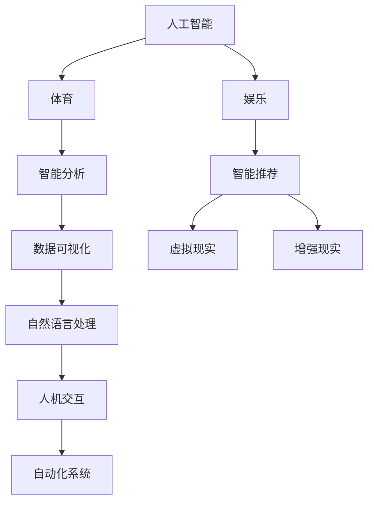

                 

# 人工智能在体育和娱乐中的应用

## 1. 背景介绍

### 1.1 问题由来
随着人工智能技术的飞速发展，AI已经开始广泛渗透到各行各业，体育和娱乐作为人类日常生活的重要组成部分，AI的介入带来了诸多创新。传统体育和娱乐领域大多依赖于人工经验，在数据处理、赛事分析、赛事编排等方面往往难以快速响应，AI技术的引入极大地提升了效率和准确性。

体育领域包括竞技体育和群众体育，竞技体育如足球、篮球、乒乓球等，以及田径、游泳等奥运会项目。群众体育则涵盖健身、旅游、休闲等。娱乐领域包括音乐、影视、游戏等。AI在体育和娱乐中应用广泛，例如智能分析、数据预测、智能推荐、虚拟现实、增强现实等技术，为这些领域带来了深刻变革。

### 1.2 问题核心关键点
AI在体育和娱乐中应用的核心关键点包括：
- **智能分析**：基于数据挖掘和机器学习，对比赛结果、趋势、选手状态等进行智能预测和分析。
- **数据可视化**：将复杂的数据通过图表、动画等形式呈现，帮助用户快速理解信息。
- **虚拟现实与增强现实**：利用虚拟现实技术重现体育赛事，或提供沉浸式娱乐体验。
- **智能推荐**：根据用户的历史数据和行为，进行个性化内容推荐。
- **人机交互**：通过自然语言处理技术，提升人机互动的友好度和效率。
- **赛事项目自动化**：如自动判罚、自动重播等，提升赛事公平性和观赏性。

## 2. 核心概念与联系

### 2.1 核心概念概述

为更好地理解AI在体育和娱乐中的应用，本节将介绍几个核心概念：

- **人工智能**：以数据为基础，通过算法和模型进行智能决策和预测。
- **体育**：包含竞技体育和群众体育，包括各类体育项目和比赛。
- **娱乐**：包含音乐、影视、游戏等文化产品。
- **智能分析**：通过对体育赛事和娱乐产品数据进行分析，预测未来趋势。
- **数据可视化**：利用图形、动画等手段呈现数据分析结果。
- **虚拟现实**：通过计算机生成的仿真环境，提供沉浸式体验。
- **增强现实**：在现实世界中叠加虚拟信息，增强用户感知。
- **自然语言处理**：使计算机能够理解、处理和生成人类语言。
- **推荐系统**：根据用户行为和偏好，推荐相关产品或内容。
- **自动化系统**：利用AI技术实现赛事项目、娱乐项目的自动化。

这些概念之间的逻辑关系可以通过以下Mermaid流程图来展示：



这个流程图展示了几者之间的关系：

1. 人工智能通过数据处理和算法分析，对体育和娱乐进行智能分析和预测。
2. 数据可视化帮助用户理解复杂数据，便于分析和决策。
3. 虚拟现实和增强现实提供沉浸式体验，提升观赏性。
4. 智能推荐系统根据用户行为推荐相关内容，提升用户体验。
5. 自然语言处理技术改善人机交互，提升系统友好度。
6. 自动化系统利用AI实现赛事、项目自动化，提升效率和公平性。

## 3. 核心算法原理 & 具体操作步骤
### 3.1 算法原理概述

AI在体育和娱乐中的应用主要基于以下几个核心算法：

- **数据预处理**：数据清洗、归一化、特征提取等。
- **机器学习模型**：如回归、分类、聚类、深度学习等。
- **深度学习模型**：如卷积神经网络（CNN）、循环神经网络（RNN）、变分自编码器（VAE）、生成对抗网络（GAN）等。
- **强化学习**：通过试错学习，优化决策策略。
- **自然语言处理技术**：如词向量模型、序列到序列模型、预训练语言模型等。
- **推荐算法**：如协同过滤、矩阵分解、基于深度学习的推荐系统等。

这些算法通过处理体育和娱乐数据，结合不同场景，实现智能分析和预测、智能推荐、虚拟现实、增强现实等功能。

### 3.2 算法步骤详解

以体育赛事的智能分析为例，其操作步骤如下：

**Step 1: 数据收集和预处理**
- 收集体育赛事的历史数据，包括比赛时间、比分、队员信息等。
- 对数据进行清洗、去重、归一化、特征提取等预处理操作，以便后续分析。

**Step 2: 模型选择和训练**
- 选择合适的机器学习或深度学习模型，如线性回归、决策树、神经网络等。
- 使用历史数据训练模型，得到赛事预测模型。

**Step 3: 特征工程**
- 根据赛事特点，提取并优化特征，如队伍实力、队员状态、战术安排等。
- 使用降维技术如主成分分析（PCA）、t-SNE等，减少特征数量。

**Step 4: 模型评估与优化**
- 使用交叉验证等技术，评估模型性能。
- 根据评估结果，调整模型参数、增加正则化等，优化模型。

**Step 5: 应用与反馈**
- 将模型应用到实际比赛分析中，进行实时预测。
- 收集比赛结果和用户反馈，持续改进模型。

### 3.3 算法优缺点

AI在体育和娱乐中的应用，存在以下优缺点：

**优点：**
- 提升决策效率和准确性，减少人为错误。
- 提供数据驱动的智能分析和预测，提升赛事公平性和观赏性。
- 增强用户体验，提升娱乐产品的个性化和互动性。
- 降低人力成本，提升运营效率。

**缺点：**
- 数据质量和获取难度较高，影响模型效果。
- 算法复杂度较高，对计算资源要求较高。
- 需要持续优化和维护，防止模型过时或退化。
- 对伦理和隐私问题需额外关注。

### 3.4 算法应用领域

AI在体育和娱乐中的应用，涵盖了多个领域，具体如下：

- **智能分析**：如足球比赛结果预测、乒乓球冠军预测、体育项目趋势分析等。
- **数据可视化**：如球赛统计数据可视化、赛事影响因素分析、用户行为数据分析等。
- **虚拟现实和增强现实**：如足球比赛的虚拟重播、篮球比赛的高清回放、电影场景的重现等。
- **智能推荐**：如体育赛事的推荐、音乐歌单的推荐、影视作品的推荐等。
- **人机交互**：如智能客服、虚拟教练、自然语言聊天机器人等。
- **自动化系统**：如裁判辅助系统、比赛自动重播、自动计分系统等。

## 4. 数学模型和公式 & 详细讲解 & 举例说明

### 4.1 数学模型构建

本节将使用数学语言对AI在体育和娱乐中的应用进行更加严格的刻画。

以体育赛事的智能分析为例，构建如下数学模型：

假设体育赛事的历史数据集为 $D=\{(x_i,y_i)\}_{i=1}^N$，其中 $x_i$ 为比赛特征向量，$y_i$ 为比赛结果。模型为线性回归模型：

$$
y_i = \theta_0 + \sum_{j=1}^m \theta_j x_{ij} + \epsilon_i
$$

其中 $\theta_0, \theta_j$ 为模型参数，$\epsilon_i$ 为随机误差。

### 4.2 公式推导过程

将数据集 $D$ 划分为训练集 $D_{train}$ 和验证集 $D_{valid}$。使用最小二乘法拟合模型参数：

$$
\hat{\theta} = \mathop{\arg\min}_{\theta} \frac{1}{2} \sum_{i=1}^N (y_i - f(x_i;\theta))^2
$$

其中 $f(x_i;\theta) = \theta_0 + \sum_{j=1}^m \theta_j x_{ij}$。

根据梯度下降法，最小化损失函数：

$$
\frac{\partial \mathcal{L}(\theta)}{\partial \theta} = \frac{1}{N} \sum_{i=1}^N (y_i - f(x_i;\theta))
$$

使用随机梯度下降（SGD）更新参数：

$$
\theta \leftarrow \theta - \eta \nabla_{\theta}\mathcal{L}(\theta)
$$

其中 $\eta$ 为学习率。

### 4.3 案例分析与讲解

以足球比赛结果预测为例，假设有历史数据集 $D=\{(x_i,y_i)\}_{i=1}^N$，其中 $x_i$ 为比赛特征向量，$y_i$ 为比赛结果。模型为线性回归模型：

$$
y_i = \theta_0 + \sum_{j=1}^m \theta_j x_{ij} + \epsilon_i
$$

使用最小二乘法拟合模型参数：

$$
\hat{\theta} = \mathop{\arg\min}_{\theta} \frac{1}{2} \sum_{i=1}^N (y_i - f(x_i;\theta))^2
$$

其中 $f(x_i;\theta) = \theta_0 + \sum_{j=1}^m \theta_j x_{ij}$。

使用随机梯度下降（SGD）更新参数：

$$
\theta \leftarrow \theta - \eta \nabla_{\theta}\mathcal{L}(\theta)
$$

其中 $\eta$ 为学习率。

## 5. 项目实践：代码实例和详细解释说明

### 5.1 开发环境搭建

在进行体育和娱乐应用开发前，我们需要准备好开发环境。以下是使用Python进行Scikit-Learn开发的环境配置流程：

1. 安装Anaconda：从官网下载并安装Anaconda，用于创建独立的Python环境。

2. 创建并激活虚拟环境：
```bash
conda create -n sports-env python=3.8 
conda activate sports-env
```

3. 安装Scikit-Learn、Numpy、Pandas等库：
```bash
pip install scikit-learn numpy pandas
```

4. 安装各类工具包：
```bash
pip install matplotlib seaborn tqdm jupyter notebook ipython
```

完成上述步骤后，即可在` sports-env`环境中开始项目实践。

### 5.2 源代码详细实现

下面我们以足球比赛结果预测为例，给出使用Scikit-Learn库进行线性回归的PyTorch代码实现。

首先，定义线性回归模型：

```python
from sklearn.linear_model import LinearRegression

model = LinearRegression()
```

然后，定义数据处理函数：

```python
import pandas as pd
from sklearn.model_selection import train_test_split

def load_data():
    data = pd.read_csv('match_data.csv')
    X = data[['home_team', 'away_team', 'home_score', 'away_score', 'match_time']]
    y = data['match_result']
    return train_test_split(X, y, test_size=0.2, random_state=42)

X_train, X_test, y_train, y_test = load_data()
```

接着，定义训练和评估函数：

```python
from sklearn.metrics import mean_squared_error

def train(model, X_train, y_train, X_test, y_test):
    model.fit(X_train, y_train)
    y_pred = model.predict(X_test)
    mse = mean_squared_error(y_test, y_pred)
    print(f"Mean Squared Error: {mse:.3f}")

train(model, X_train, y_train, X_test, y_test)
```

最后，启动训练流程并在测试集上评估：

```python
train(model, X_train, y_train, X_test, y_test)
```

以上就是使用Scikit-Learn库对足球比赛结果进行线性回归预测的完整代码实现。可以看到，Scikit-Learn库提供了简单易用的API，使得线性回归模型的实现变得非常简便。

### 5.3 代码解读与分析

让我们再详细解读一下关键代码的实现细节：

**数据处理函数**：
- 使用Pandas库读取CSV格式的数据，提取所需特征和标签。
- 使用`train_test_split`函数将数据集划分为训练集和测试集。

**训练函数**：
- 使用`fit`方法训练模型，使用`predict`方法进行预测。
- 使用均方误差（MSE）评估模型预测结果与真实结果之间的差异。

**训练流程**：
- 定义线性回归模型，读取数据集，划分数据集，进行模型训练和评估。
- 在训练集上训练模型，在测试集上评估模型的预测效果。
- 输出预测结果和评估指标。

可以看到，Scikit-Learn库使得线性回归模型的实现变得非常简便，开发者可以将更多精力放在模型改进和数据处理上，而不必过多关注底层的实现细节。

当然，工业级的系统实现还需考虑更多因素，如模型的保存和部署、超参数的自动搜索、更灵活的任务适配层等。但核心的模型训练流程基本与此类似。

## 6. 实际应用场景
### 6.1 智能分析

在体育赛事中，智能分析发挥了重要作用。通过大数据分析和机器学习技术，可以实时预测比赛结果，分析比赛趋势，优化训练和战术。

例如，在足球比赛中，可以收集历史数据，建立回归模型，预测未来比赛结果。同时，可以分析球员的表现，预测比赛趋势，优化训练和战术。

**案例**：
- 欧洲五大联赛的比赛结果预测，帮助体育赛事预测和投注。
- 足球比赛的趋势分析，预测未来比赛结果。

**应用**：
- 赛事预测和投注：利用比赛结果预测，帮助用户制定投资策略。
- 教练决策辅助：利用球员表现和比赛趋势分析，辅助教练制定训练和战术。

### 6.2 数据可视化

数据可视化是体育和娱乐中重要的应用之一。通过数据可视化，用户可以直观理解复杂的数据，快速做出决策。

例如，在足球比赛中，可以通过数据可视化技术，展示球员表现、比赛数据等，帮助用户快速理解比赛情况。

**案例**：
- 足球比赛的可视化分析，展示球员表现、球队实力等。
- 篮球比赛的可视化分析，展示球员得分、篮板等。

**应用**：
- 教练决策辅助：展示球员表现和球队实力，辅助教练制定战术。
- 观众互动：展示比赛数据，增强观众参与感。

### 6.3 虚拟现实与增强现实

虚拟现实（VR）和增强现实（AR）技术在体育和娱乐中的应用越来越广泛。通过VR和AR技术，用户可以沉浸式体验体育赛事和娱乐活动。

例如，在足球比赛中，可以通过VR技术，让用户在家中观看高清比赛回放，提升观赛体验。

**案例**：
- 足球比赛的虚拟重播，提供沉浸式观赛体验。
- 篮球比赛的增强现实应用，展示球员实时数据和分析。

**应用**：
- 用户观赛体验：通过VR和AR技术，提升观赛体验。
- 比赛分析：展示球员实时数据和分析，辅助教练和观众理解比赛。

### 6.4 智能推荐

智能推荐系统在体育和娱乐领域应用广泛，通过分析用户历史数据和行为，推荐相关内容，提升用户体验。

例如，在音乐应用中，可以推荐用户喜欢的音乐、歌手等，提升用户黏性。

**案例**：
- 音乐应用的智能推荐，推荐用户喜欢的音乐和歌手。
- 视频应用的智能推荐，推荐用户感兴趣的视频内容。

**应用**：
- 提高用户黏性：推荐用户感兴趣的内容，提升用户活跃度。
- 个性化内容推荐：通过分析用户行为，提供个性化内容推荐。

### 6.5 人机交互

人机交互技术在体育和娱乐领域应用广泛，通过自然语言处理技术，提升人机互动的友好度和效率。

例如，在智能客服系统中，可以通过自然语言处理技术，理解用户问题，提供精准答案。

**案例**：
- 智能客服系统：理解用户问题，提供精准答案。
- 虚拟教练系统：与用户交互，辅助用户训练。

**应用**：
- 提升用户体验：通过自然语言处理技术，提升人机互动的友好度和效率。
- 决策辅助：通过理解用户问题，辅助用户制定决策。

## 7. 工具和资源推荐
### 7.1 学习资源推荐

为了帮助开发者系统掌握AI在体育和娱乐中的应用，这里推荐一些优质的学习资源：

1. 《机器学习实战》书籍：通过大量案例，深入浅出地介绍了机器学习在体育和娱乐中的应用。

2. 《Python数据科学手册》书籍：详细介绍了Python在数据处理、可视化、建模等方面的应用。

3. Coursera《数据科学与机器学习》课程：斯坦福大学开设的课程，涵盖数据科学和机器学习的基础知识和应用。

4. Kaggle竞赛：参与数据竞赛，锻炼数据处理和机器学习技能，了解最新应用趋势。

5. GitHub开源项目：阅读和学习开源项目，了解实际应用案例，提升实战能力。

通过对这些资源的学习实践，相信你一定能够快速掌握AI在体育和娱乐中的应用技巧，并用于解决实际的NLP问题。

### 7.2 开发工具推荐

高效的开发离不开优秀的工具支持。以下是几款用于体育和娱乐应用的常用工具：

1. Jupyter Notebook：基于Python的交互式开发环境，支持代码编写、数据可视化、模型评估等。

2. Matplotlib和Seaborn：Python的数据可视化库，支持绘制各种图表和数据展示。

3. Pandas和Numpy：Python的数据处理库，支持大规模数据的处理和分析。

4. Scikit-Learn：Python的机器学习库，支持各种经典机器学习算法和模型。

5. TensorFlow和PyTorch：Python的深度学习库，支持构建和训练各种深度学习模型。

6. PyTorch和TensorFlow：支持构建和训练各种深度学习模型，是当前深度学习领域的主流框架。

合理利用这些工具，可以显著提升体育和娱乐应用的开发效率，加快创新迭代的步伐。

### 7.3 相关论文推荐

AI在体育和娱乐中的应用，源于学界的持续研究。以下是几篇奠基性的相关论文，推荐阅读：

1. AlphaGo论文：DeepMind开发的围棋AI程序，展示了AI在决策方面的优势。

2. GAN生成图像论文：提出的生成对抗网络（GAN），展示了AI在图像生成方面的应用。

3. 语音识别论文：提出的深度学习模型，展示了AI在语音识别方面的应用。

4. 智能推荐系统论文：提出了协同过滤、矩阵分解等推荐算法，展示了AI在推荐系统方面的应用。

5. 自然语言处理论文：提出了序列到序列模型、预训练语言模型等技术，展示了AI在自然语言处理方面的应用。

这些论文代表了大语言模型在体育和娱乐领域的发展脉络。通过学习这些前沿成果，可以帮助研究者把握学科前进方向，激发更多的创新灵感。

## 8. 总结：未来发展趋势与挑战

### 8.1 总结

本文对AI在体育和娱乐中的应用进行了全面系统的介绍。首先阐述了AI技术在体育和娱乐领域的应用背景和意义，明确了智能分析、数据可视化、虚拟现实、智能推荐、人机交互等核心概念。其次，从原理到实践，详细讲解了线性回归模型的数学原理和关键步骤，给出了体育比赛结果预测的代码实例。同时，本文还广泛探讨了AI技术在体育和娱乐领域的应用前景，展示了AI技术的广阔前景。

通过本文的系统梳理，可以看到，AI技术在体育和娱乐领域的应用已经取得了丰硕的成果，极大地提升了用户体验和赛事公平性。未来，伴随AI技术的持续演进，AI在体育和娱乐领域的应用将更加广泛和深入，为体育和娱乐产业带来深刻的变革。

### 8.2 未来发展趋势

展望未来，AI在体育和娱乐中的应用将呈现以下几个发展趋势：

1. **智能化程度提升**：随着深度学习、强化学习等技术的不断进步，AI在体育和娱乐中的应用将更加智能化，实现更高水平的决策和预测。

2. **跨模态融合**：AI将打破不同模态数据的壁垒，实现视觉、语音、文本等多种模态数据的融合，提升用户体验和系统性能。

3. **个性化服务**：基于用户行为和偏好，提供更加个性化的内容和推荐，提升用户满意度。

4. **实时化应用**：AI系统将实现实时响应和决策，提升赛事和娱乐的即时性和互动性。

5. **全息互动**：通过虚拟现实和增强现实技术，实现全息互动，提升用户体验。

6. **隐私保护**：随着AI应用的广泛普及，隐私保护将越来越重要，需要更多的隐私保护技术支持。

以上趋势凸显了AI在体育和娱乐领域的广阔前景，这些方向的探索发展，将进一步提升体育和娱乐产业的智能化水平，带来更多创新应用。

### 8.3 面临的挑战

尽管AI在体育和娱乐领域的应用已经取得了丰硕的成果，但在迈向更加智能化、普适化应用的过程中，仍面临诸多挑战：

1. **数据获取和处理难度大**：体育和娱乐领域的数据获取难度大，且数据质量难以保证，影响模型效果。
2. **计算资源消耗大**：深度学习模型对计算资源要求高，需要高性能的计算设备。
3. **模型复杂度高**：深度学习模型结构复杂，难以优化和维护。
4. **伦理和隐私问题**：AI系统的决策过程不透明，可能带来伦理和隐私问题。
5. **鲁棒性和安全性不足**：AI系统面对攻击和干扰时，可能出现性能退化或错误。

这些挑战需要学术界和产业界共同努力，持续改进AI技术，提升系统鲁棒性和安全性，保障用户隐私和权益。

### 8.4 研究展望

面对AI在体育和娱乐领域面临的诸多挑战，未来的研究需要在以下几个方面寻求新的突破：

1. **数据质量和获取**：提升数据质量，降低数据获取难度，建立数据共享机制。
2. **计算资源优化**：研究高效的计算资源优化技术，提升模型训练和推理效率。
3. **模型简化和优化**：研究模型简化和优化技术，降低模型复杂度，提升模型可解释性和可维护性。
4. **伦理和隐私保护**：研究隐私保护和可解释性技术，提升系统的透明性和可信度。
5. **鲁棒性和安全性**：研究鲁棒性和安全性技术，提升系统的稳定性和抗干扰能力。

这些研究方向的探索，必将引领AI在体育和娱乐领域的进一步发展，推动智能技术在更多领域的应用。

## 9. 附录：常见问题与解答

**Q1：AI在体育和娱乐中的应用是否仅限于体育和娱乐领域？**

A: AI技术在体育和娱乐中的应用虽然最为广泛，但其实用性和普适性远超这些领域。AI技术可以在医疗、金融、制造等众多行业进行应用，提升效率和精度。

**Q2：AI在体育和娱乐中的应用是否存在数据隐私和伦理问题？**

A: 是的，AI在体育和娱乐中的应用，尤其是涉及用户行为和偏好分析时，可能涉及数据隐私和伦理问题。为避免这些问题，需要在数据收集和使用过程中，严格遵守法律法规，保护用户隐私。

**Q3：AI在体育和娱乐中的应用是否容易受到攻击和干扰？**

A: 是的，AI系统可能会受到各种攻击和干扰，如对抗样本攻击、梯度泄露等。需要研究鲁棒性和安全性技术，提升系统的抗干扰能力。

**Q4：AI在体育和娱乐中的应用是否需要考虑实时性？**

A: 是的，AI在体育和娱乐中的应用，尤其是赛事预测、智能推荐等，对实时性要求很高。需要优化模型和系统，实现实时响应和决策。

**Q5：AI在体育和娱乐中的应用是否需要考虑跨模态融合？**

A: 是的，AI在体育和娱乐中的应用，需要打破视觉、语音、文本等不同模态数据的壁垒，实现跨模态融合，提升用户体验和系统性能。

通过本文的系统梳理，可以看到，AI在体育和娱乐领域的应用已经取得了丰硕的成果，为体育和娱乐产业带来了深刻的变革。未来，伴随AI技术的持续演进，AI在体育和娱乐领域的应用将更加广泛和深入，为体育和娱乐产业带来更多的创新应用，推动智能化和普适化的发展。

