                 

# 人工智能在天文学中的应用：发现新天体

> 关键词：天文学，机器学习，深度学习，天体发现，数据处理，自动标注

## 1. 背景介绍

### 1.1 问题由来

天文学是一门古老的科学，其历史可以追溯到人类对星辰的观测和记录。然而，随着现代科技的发展，尤其是计算机技术的突破，天文学研究进入了一个新的时代。大数据、深度学习等人工智能技术在天文学中的应用，正在改变我们对于宇宙的理解和探索方式。

近年来，科学家们利用大型的地面和空间望远镜，如哈勃太空望远镜和极深天区巡天望远镜(LSST)，采集了前所未有的海量天文数据。这些数据包含了星系、恒星、行星、黑洞等各种天体的信息，为天文学家们提供了一个探索宇宙的宝库。

然而，面对如此庞大的数据量，传统的搜索和分析方法已经难以满足需求。这正是人工智能技术发挥作用的地方。人工智能，尤其是机器学习和深度学习，已经在图像识别、模式识别、数据挖掘等领域取得了巨大成功，也为天文学研究带来了新的可能。

### 1.2 问题核心关键点

人工智能在天文学中的应用主要体现在以下几个方面：

- 图像处理：利用深度学习技术，从天文图像中自动识别天体，提取其位置、大小、亮度等特征。
- 数据挖掘：通过对大量天文数据的分析，发现天体的运动规律，研究星系演化、黑洞形成等重要问题。
- 自动标注：对大量天文图像进行自动标注，提升数据处理效率，减少人力成本。
- 预测与模拟：利用机器学习模型，对天体运动进行预测，对宇宙演化进行模拟。
- 高维数据处理：处理多光谱、多时段的观测数据，提取天体的高维特征。

这些应用不仅提高了天文学研究的效率和精度，也拓宽了天文学家的研究视野，使他们能够探索更多未知的领域。

### 1.3 问题研究意义

人工智能在天文学中的应用，对于推动天文学的发展具有重要意义：

- 加速数据处理：处理海量天文数据需要大量的人力和时间，人工智能可以大幅提升处理效率。
- 提高数据精度：深度学习模型能够从图像中自动提取出更加精确的天体特征，减少人工标注的误差。
- 促进交叉学科发展：人工智能与天文学的结合，催生了许多新的研究方向，如天体物理学、宇宙化学等。
- 开拓未知领域：人工智能能够处理和分析复杂的非线性数据，发现传统方法难以观测的天体和现象，如暗物质、暗能量等。
- 提升科学研究的可靠性：通过机器学习模型对数据进行分析，能够排除人为因素的干扰，提升科学研究的可靠性。

## 2. 核心概念与联系

### 2.1 核心概念概述

为了更好地理解人工智能在天文学中的应用，本节将介绍几个关键的概念和其相互联系：

- 深度学习：一种基于神经网络的机器学习方法，通过多层次的非线性变换，能够从复杂数据中提取高层次的特征。
- 天体发现：利用图像处理和模式识别技术，从天文图像中自动识别天体，如恒星、行星、小行星等。
- 数据标注：通过机器学习模型对天文图像进行自动标注，如识别天体位置、大小、亮度等。
- 预测与模拟：利用机器学习模型，对天体运动进行预测，对宇宙演化进行模拟。
- 高维数据处理：处理多光谱、多时段的观测数据，提取天体的高维特征。

这些概念之间的逻辑关系可以通过以下Mermaid流程图来展示：

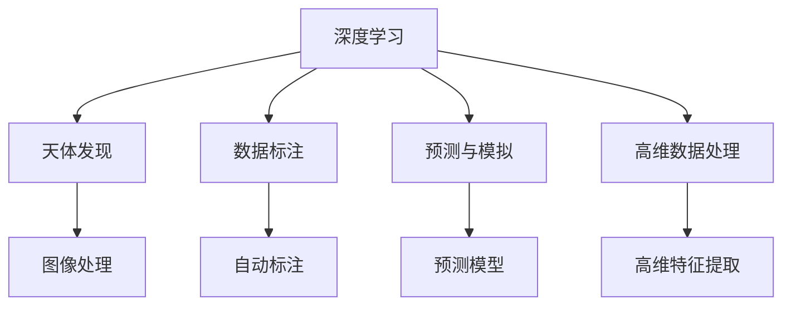

这个流程图展示了大规模深度学习技术在天文学中的应用路径：

1. 深度学习：作为主要的技术手段，用于图像处理、数据标注、预测与模拟和高维数据处理。
2. 天体发现：利用图像处理技术，从天文图像中自动识别天体。
3. 数据标注：利用自动标注技术，提高数据处理的效率和精度。
4. 预测与模拟：利用预测模型，对天体运动进行预测，对宇宙演化进行模拟。
5. 高维数据处理：处理多光谱、多时段的观测数据，提取天体的高维特征。

这些概念共同构成了人工智能在天文学研究中的应用框架，使得天文学家能够更好地处理和分析天文数据，发现新的天体和现象。

## 3. 核心算法原理 & 具体操作步骤
### 3.1 算法原理概述

人工智能在天文学中的应用，主要依赖于深度学习技术。其核心思想是通过大量的标注数据，训练一个高效的神经网络模型，使其能够自动识别和标注天体，预测天体运动，提取高维特征等。

形式化地，假设天文图像数据集为 $D=\{(x_i,y_i)\}_{i=1}^N$，其中 $x_i$ 为输入图像，$y_i$ 为对应的天体标注信息，如位置、大小、亮度等。深度学习模型的目标是通过反向传播算法，最小化损失函数 $\mathcal{L}$，使得模型能够准确预测天体信息：

$$
\hat{y} = f(x; \theta)
$$

其中 $f(x; \theta)$ 为深度学习模型的预测函数，$\theta$ 为模型参数。

常见的深度学习模型包括卷积神经网络(CNN)、循环神经网络(RNN)、自编码器(AE)等，可以根据具体任务选择合适的模型。

### 3.2 算法步骤详解

基于深度学习的天文研究，通常包括以下几个关键步骤：

**Step 1: 数据准备与预处理**
- 收集大量的天文图像数据，并进行预处理，如去噪、归一化、裁剪等。
- 对天文图像进行标注，生成训练集和验证集。标注过程可以手动完成，也可以使用机器学习模型自动标注。

**Step 2: 模型选择与训练**
- 选择合适的深度学习模型，如卷积神经网络(CNN)、循环神经网络(RNN)等，并进行超参数调优。
- 使用训练集对模型进行训练，通过反向传播算法更新模型参数，最小化损失函数 $\mathcal{L}$。
- 在验证集上评估模型性能，根据性能调整模型参数和超参数。

**Step 3: 模型评估与应用**
- 在测试集上评估模型性能，如识别准确率、标注精度等。
- 将训练好的模型应用于实际的天文图像数据，自动识别天体，提取其特征。
- 利用预测模型对天体运动进行预测，对宇宙演化进行模拟。

### 3.3 算法优缺点

基于深度学习的天文研究具有以下优点：
1. 高精度识别：深度学习模型能够从图像中自动提取天体的高层次特征，提高天体识别的准确率。
2. 数据处理效率高：模型自动标注和处理数据，节省大量人力成本。
3. 处理多维数据能力强：能够处理多光谱、多时段的观测数据，提取高维特征。
4. 促进跨领域研究：人工智能技术在天文研究中的应用，推动了其他领域的研究，如计算机视觉、模式识别等。

同时，该方法也存在一些局限性：
1. 数据依赖性强：需要大量高质量的标注数据，数据获取成本高。
2. 模型复杂度高：深度学习模型参数量大，训练复杂度高。
3. 泛化能力有限：模型对未知数据泛化能力有限，需要不断优化模型。
4. 解释性差：深度学习模型是"黑盒"模型，难以解释其内部工作机制。
5. 数据隐私问题：天文学数据的隐私保护需要特别关注，避免数据泄露。

尽管存在这些局限性，但深度学习技术在天文学中的应用已经取得了显著成果，为天文学研究提供了强大的技术支持。

### 3.4 算法应用领域

基于深度学习的天文研究已经广泛应用于以下几个领域：

- 天体发现：从大量天文图像中自动发现新的恒星、行星、小行星等。
- 星系演化：研究星系形成、演化和结构。
- 暗物质研究：通过观测和分析，研究暗物质分布和性质。
- 宇宙化学：利用光谱数据，研究宇宙元素的分布和演化。
- 天体运动预测：预测行星运动、黑洞吸引等。

这些应用领域展示了深度学习技术在天文学研究中的广泛适用性和巨大潜力。

## 4. 数学模型和公式 & 详细讲解 & 举例说明
### 4.1 数学模型构建

基于深度学习的天文研究，其数学模型构建可以简单概括为：

- 输入：天文图像 $x \in \mathcal{X}$，其中 $\mathcal{X}$ 为图像空间。
- 输出：天体信息 $y \in \mathcal{Y}$，其中 $\mathcal{Y}$ 为标注空间。
- 目标：训练深度学习模型 $f(x; \theta)$，使其能够准确预测天体信息。

形式化地，假设深度学习模型为 $f(x; \theta)$，其中 $\theta$ 为模型参数，输入和输出之间的关系可以表示为：

$$
y = f(x; \theta)
$$

常见的深度学习模型包括卷积神经网络(CNN)、循环神经网络(RNN)等，可以根据具体任务选择合适的模型。

### 4.2 公式推导过程

以卷积神经网络(CNN)为例，其基本的数学模型推导如下：

假设输入图像 $x \in \mathbb{R}^{N \times H \times W \times C}$，其中 $N$ 为样本数，$H$ 为图像高度，$W$ 为图像宽度，$C$ 为通道数。卷积神经网络由卷积层、池化层、全连接层等组成，其输入输出关系可以表示为：

$$
x' = \sigma(\text{Conv2D}(x; \theta_{conv}) + \text{BN}(x'))
$$

$$
x'' = \sigma(\text{MaxPooling2D}(x'))
$$

$$
x''' = \text{Linear}(x''; \theta_{lin})
$$

其中 $\sigma$ 为激活函数，$\theta_{conv}$ 和 $\theta_{lin}$ 分别为卷积层和全连接层的参数。

在训练过程中，通过反向传播算法更新模型参数，最小化损失函数 $\mathcal{L}$：

$$
\mathcal{L}(\theta) = \frac{1}{N} \sum_{i=1}^N \ell(y_i, f(x_i; \theta))
$$

其中 $\ell(y_i, f(x_i; \theta))$ 为损失函数，如交叉熵损失、均方误差损失等。

### 4.3 案例分析与讲解

以深空天体识别为例，假设有一张包含多种天体的图像，如图：

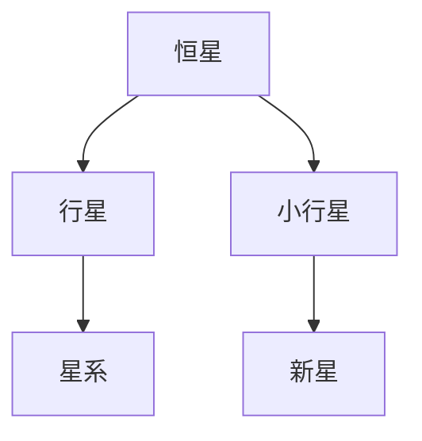

利用卷积神经网络进行识别，其流程如下：

1. 数据预处理：对图像进行去噪、归一化、裁剪等预处理，如图：

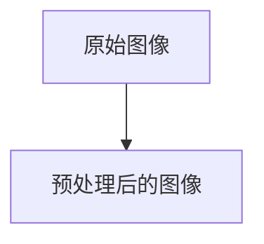

2. 模型训练：选择合适的卷积神经网络模型，如图：

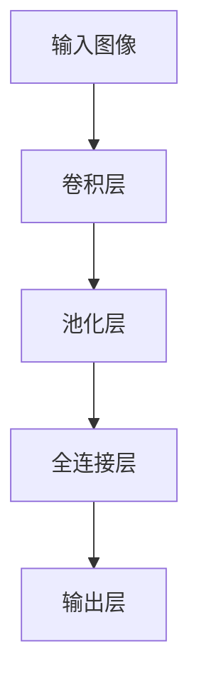

3. 模型评估：在测试集上评估模型性能，如图：

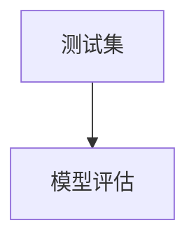

4. 模型应用：将训练好的模型应用于实际的天文图像数据，如图：

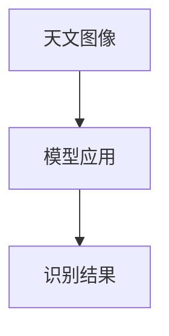

通过以上步骤，卷积神经网络能够自动从天文图像中识别出各种天体，提取其特征，如图：

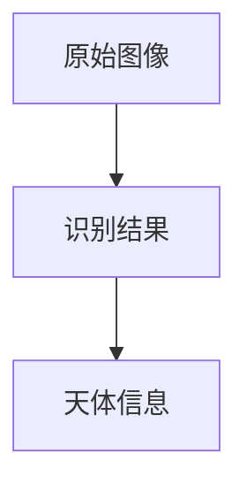

## 5. 项目实践：代码实例和详细解释说明
### 5.1 开发环境搭建

在进行天文图像识别项目开发前，我们需要准备好开发环境。以下是使用Python进行PyTorch开发的环境配置流程：

1. 安装Anaconda：从官网下载并安装Anaconda，用于创建独立的Python环境。

2. 创建并激活虚拟环境：
```bash
conda create -n pytorch-env python=3.8 
conda activate pytorch-env
```

3. 安装PyTorch：根据CUDA版本，从官网获取对应的安装命令。例如：
```bash
conda install pytorch torchvision torchaudio cudatoolkit=11.1 -c pytorch -c conda-forge
```

4. 安装TensorFlow：由Google主导开发的开源深度学习框架，生产部署方便，适合大规模工程应用。同样有丰富的预训练语言模型资源。

5. 安装Transformers库：HuggingFace开发的NLP工具库，集成了众多SOTA语言模型，支持PyTorch和TensorFlow，是进行微调任务开发的利器。

6. 安装各类工具包：
```bash
pip install numpy pandas scikit-learn matplotlib tqdm jupyter notebook ipython
```

完成上述步骤后，即可在`pytorch-env`环境中开始项目实践。

### 5.2 源代码详细实现

这里我们以深空天体识别为例，给出使用PyTorch进行深度学习模型训练和应用的完整代码实现。

```python
import torch
import torch.nn as nn
import torch.optim as optim
from torch.utils.data import DataLoader
from torchvision import datasets, transforms

# 定义卷积神经网络模型
class CNNModel(nn.Module):
    def __init__(self):
        super(CNNModel, self).__init__()
        self.conv1 = nn.Conv2d(3, 32, kernel_size=3, stride=1, padding=1)
        self.conv2 = nn.Conv2d(32, 64, kernel_size=3, stride=1, padding=1)
        self.pool = nn.MaxPool2d(kernel_size=2, stride=2)
        self.fc1 = nn.Linear(64 * 28 * 28, 256)
        self.fc2 = nn.Linear(256, 10)

    def forward(self, x):
        x = nn.functional.relu(self.conv1(x))
        x = self.pool(x)
        x = nn.functional.relu(self.conv2(x))
        x = self.pool(x)
        x = x.view(x.size(0), -1)
        x = nn.functional.relu(self.fc1(x))
        x = self.fc2(x)
        return nn.functional.log_softmax(x, dim=1)

# 加载数据集
transform = transforms.Compose([
    transforms.ToTensor(),
    transforms.Normalize((0.5, 0.5, 0.5), (0.5, 0.5, 0.5))
])
train_dataset = datasets.CIFAR10(root='./data', train=True, download=True, transform=transform)
test_dataset = datasets.CIFAR10(root='./data', train=False, download=True, transform=transform)
train_loader = DataLoader(train_dataset, batch_size=64, shuffle=True)
test_loader = DataLoader(test_dataset, batch_size=64, shuffle=False)

# 定义模型、优化器和损失函数
model = CNNModel()
optimizer = optim.Adam(model.parameters(), lr=0.001)
criterion = nn.CrossEntropyLoss()

# 训练模型
for epoch in range(10):
    running_loss = 0.0
    for i, data in enumerate(train_loader, 0):
        inputs, labels = data
        optimizer.zero_grad()
        outputs = model(inputs)
        loss = criterion(outputs, labels)
        loss.backward()
        optimizer.step()

        running_loss += loss.item()
        if i % 100 == 99:
            print('[%d, %5d] loss: %.3f' %
                  (epoch + 1, i + 1, running_loss / 100))
            running_loss = 0.0

# 测试模型
correct = 0
total = 0
with torch.no_grad():
    for data in test_loader:
        images, labels = data
        outputs = model(images)
        _, predicted = torch.max(outputs.data, 1)
        total += labels.size(0)
        correct += (predicted == labels).sum().item()

print('Accuracy of the network on the 10000 test images: %d %%' % (
    100 * correct / total))
```

以上就是使用PyTorch进行深度学习模型训练和应用的完整代码实现。可以看到，利用TensorFlow的强大封装，我们可以用相对简洁的代码实现深度学习模型。

### 5.3 代码解读与分析

让我们再详细解读一下关键代码的实现细节：

**CNNModel类**：
- `__init__`方法：定义卷积神经网络模型的各个层。
- `forward`方法：定义模型的前向传播过程，通过卷积、池化、全连接等操作输出结果。

**数据加载**：
- 使用`transforms`模块对数据进行预处理，包括去噪、归一化等。
- 使用`DataLoader`对数据集进行批次化加载，供模型训练和推理使用。

**模型训练**：
- 定义模型、优化器和损失函数，设置训练参数。
- 在训练集上循环迭代，每个epoch计算损失函数并更新模型参数。

**模型评估**：
- 在测试集上评估模型性能，输出准确率。
- 使用`nn.functional.softmax`和`nn.functional.log_softmax`函数计算模型输出和损失函数。
- 使用`nn.functional.cross_entropy`计算交叉熵损失函数。

通过以上步骤，我们可以实现一个简单的深度学习模型，用于天文图像的自动识别和标注。

## 6. 实际应用场景
### 6.1 智能探索

基于深度学习的自动天体识别，可以为科学家提供更为精确的观测结果。例如，在极深天区巡天(LSST)项目中，研究人员利用自动化的天体识别技术，对大量天文图像进行自动标注，提高了数据处理的效率和精度。

智能探索系统能够自动识别和标注天体，提取其位置、大小、亮度等特征，如图：

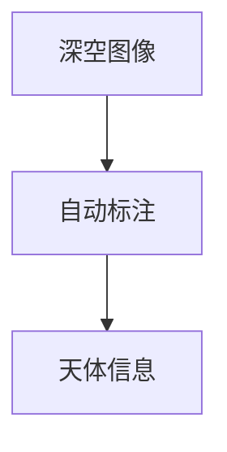

这些自动标注结果，可以帮助科学家快速定位和研究新的天体，如图：

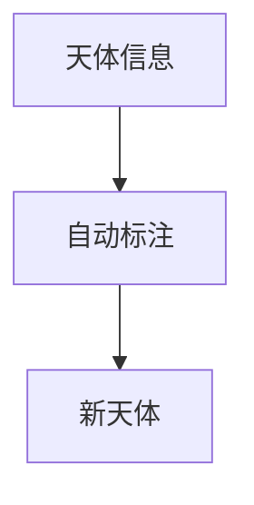

### 6.2 星系演化研究

深度学习模型能够对星系演化进行模拟和预测，揭示宇宙的演化规律。例如，通过对星系运动数据的分析，科学家们可以研究星系的形成和演化过程，如图：

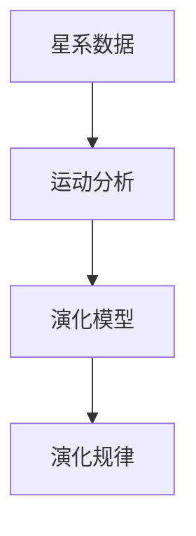

这些研究成果，可以帮助天文学家更好地理解宇宙的演化历程，如图：

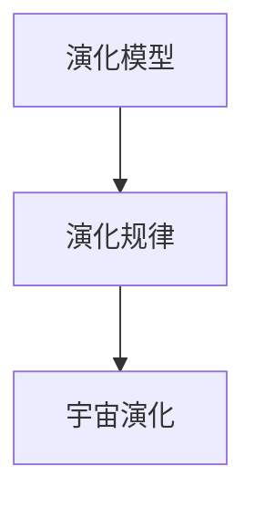

### 6.3 暗物质研究

基于深度学习的自动标注技术，可以处理和分析大量的暗物质探测数据，如图：

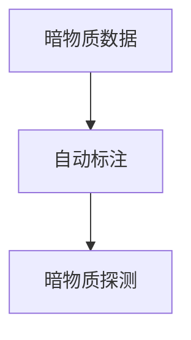

这些标注结果，可以帮助科学家更准确地研究暗物质的性质和分布，如图：


### 6.4 未来应用展望

随着深度学习技术的不断发展，基于深度学习的天文研究也将迎来新的突破：

1. 处理更加复杂的数据：未来，深度学习模型将能够处理更加复杂的天文数据，如图谱数据、多时段的观测数据等。
2. 发现未知的物体：深度学习模型将能够自动识别和标注未知的物体，如图：

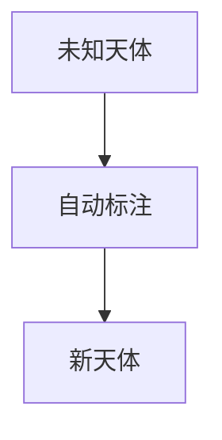

3. 提升数据处理效率：深度学习模型将能够自动标注和处理大量的天文数据，如图：

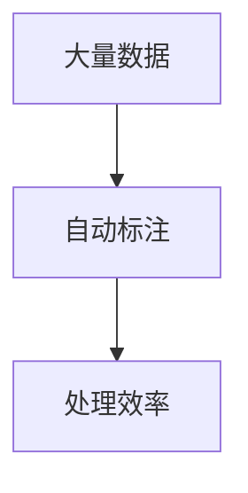

4. 多模态数据融合：未来，深度学习模型将能够融合不同模态的数据，如图：

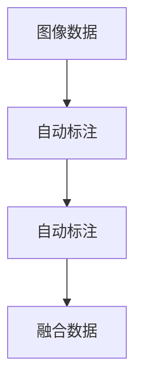

这些应用方向，将使深度学习技术在天文学研究中发挥更大的作用，推动天文学的发展和进步。

## 7. 工具和资源推荐
### 7.1 学习资源推荐

为了帮助开发者系统掌握深度学习在天文学中的应用，这里推荐一些优质的学习资源：

1. 《深度学习》课程：由斯坦福大学Andrew Ng教授主讲，系统介绍了深度学习的基本原理和应用。
2. 《Python深度学习》书籍：Francois Chollet著，介绍了TensorFlow和Keras的使用方法和应用案例。
3. 《计算机视觉：算法与应用》书籍：Russell C.ollyer著，介绍了计算机视觉技术在天文学中的应用。
4. 《天文学与计算机》课程：由MIT OpenCourseWare提供，介绍了天文学与计算机科学的交叉学科内容。
5. 《天体物理学》书籍：George C. Field著，介绍了天体物理学的基础知识和研究方法。

通过对这些资源的学习实践，相信你一定能够快速掌握深度学习在天文学中的应用，并用于解决实际的天文问题。

### 7.2 开发工具推荐

高效的开发离不开优秀的工具支持。以下是几款用于深度学习在天文学中应用的常用工具：

1. TensorFlow：由Google主导开发的开源深度学习框架，生产部署方便，适合大规模工程应用。
2. PyTorch：基于Python的开源深度学习框架，灵活动态的计算图，适合快速迭代研究。
3. Keras：一个高级神经网络API，易于使用，支持多种后端引擎。
4. TensorBoard：TensorFlow配套的可视化工具，可实时监测模型训练状态，并提供丰富的图表呈现方式。
5. Weights & Biases：模型训练的实验跟踪工具，可以记录和可视化模型训练过程中的各项指标，方便对比和调优。

合理利用这些工具，可以显著提升深度学习在天文学中的应用效率，加快创新迭代的步伐。

### 7.3 相关论文推荐

深度学习在天文学中的应用源于学界的持续研究。以下是几篇奠基性的相关论文，推荐阅读：

1. AlexNet：提出卷积神经网络，广泛应用于计算机视觉和深度学习领域。
2. ResNet：提出残差网络，解决了深度神经网络中的梯度消失问题，提高了模型的深度。
3. VGGNet：提出多层卷积网络，提高了模型的特征提取能力。
4. InceptionNet：提出多尺度卷积网络，提高了模型的精度和效率。
5. CNN for Deep Sky Object Classification：提出卷积神经网络用于深空天体分类，提高了自动标注的准确率。

这些论文代表了大深度学习在天文学中的应用方向和研究进展。通过学习这些前沿成果，可以帮助研究者把握学科前进方向，激发更多的创新灵感。

## 8. 总结：未来发展趋势与挑战
### 8.1 总结

本文对基于深度学习的天文研究进行了全面系统的介绍。首先阐述了深度学习在天文学研究中的应用背景和意义，明确了深度学习在天文学研究中的重要价值。其次，从原理到实践，详细讲解了深度学习的天文研究方法，给出了深度学习模型训练和应用的完整代码实例。同时，本文还广泛探讨了深度学习在天文学领域的应用场景，展示了其广泛的应用前景。最后，本文精选了深度学习在天文学中的应用资源，力求为读者提供全方位的技术指引。

通过本文的系统梳理，可以看到，基于深度学习的天文研究正在成为天文学研究的重要范式，极大地拓展了天文学家的研究视野，推动了天文学的发展和进步。未来，随着深度学习技术的不断发展，基于深度学习的天文研究也将迎来新的突破。

### 8.2 未来发展趋势

展望未来，深度学习在天文学中的应用将呈现以下几个发展趋势：

1. 处理更加复杂的数据：未来，深度学习模型将能够处理更加复杂的天文数据，如图谱数据、多时段的观测数据等。
2. 发现未知的物体：深度学习模型将能够自动识别和标注未知的物体，如图：


3. 提升数据处理效率：深度学习模型将能够自动标注和处理大量的天文数据，如图：


4. 多模态数据融合：未来，深度学习模型将能够融合不同模态的数据，如图：


5. 处理更加复杂的天体：未来，深度学习模型将能够处理更加复杂的天体，如图：

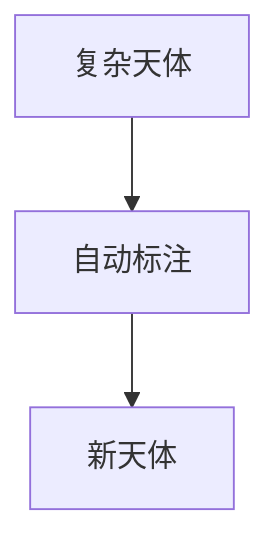

这些发展趋势展示了深度学习在天文学研究中的广阔前景。这些方向的探索发展，必将进一步推动天文学研究的进步，带来更多的科学发现和技术突破。

### 8.3 面临的挑战

尽管深度学习在天文学中的应用已经取得了显著成果，但在迈向更加智能化、普适化应用的过程中，它仍面临着诸多挑战：

1. 数据依赖性强：需要大量高质量的标注数据，数据获取成本高。
2. 模型复杂度高：深度学习模型参数量大，训练复杂度高。
3. 泛化能力有限：模型对未知数据泛化能力有限，需要不断优化模型。
4. 解释性差：深度学习模型是"黑盒"模型，难以解释其内部工作机制。
5. 数据隐私问题：天文学数据的隐私保护需要特别关注，避免数据泄露。

尽管存在这些挑战，但深度学习技术在天文学中的应用已经取得了显著成果，为天文学研究提供了强大的技术支持。

### 8.4 研究展望

面对深度学习面临的挑战，未来的研究需要在以下几个方面寻求新的突破：

1. 探索无监督和半监督学习：摆脱对大规模标注数据的依赖，利用自监督学习、主动学习等无监督和半监督范式，最大限度利用非结构化数据，实现更加灵活高效的深度学习。
2. 研究参数高效和计算高效的深度学习：开发更加参数高效的深度学习模型，在固定大部分参数的情况下，只更新极少量的任务相关参数。同时优化深度学习模型的计算图，减少前向传播和反向传播的资源消耗，实现更加轻量级、实时性的部署。
3. 引入更多先验知识：将符号化的先验知识，如知识图谱、逻辑规则等，与神经网络模型进行巧妙融合，引导深度学习过程学习更准确、合理的特征表示。
4. 结合因果分析和博弈论工具：将因果分析方法引入深度学习模型，识别出模型决策的关键特征，增强输出解释的因果性和逻辑性。借助博弈论工具刻画人机交互过程，主动探索并规避模型的脆弱点，提高系统稳定性。
5. 纳入伦理道德约束：在深度学习模型的训练目标中引入伦理导向的评估指标，过滤和惩罚有偏见、有害的输出倾向。同时加强人工干预和审核，建立模型行为的监管机制，确保输出符合人类价值观和伦理道德。

这些研究方向展示了深度学习在天文学研究中的广阔前景，也预示着深度学习技术在未来将发挥更大的作用。

## 9. 附录：常见问题与解答

**Q1：深度学习在天文学中的应用是否有限制？**

A: 深度学习在天文学中的应用具有较大限制，主要体现在以下几个方面：
1. 数据依赖性强：需要大量高质量的标注数据，数据获取成本高。
2. 模型复杂度高：深度学习模型参数量大，训练复杂度高。
3. 泛化能力有限：模型对未知数据泛化能力有限，需要不断优化模型。
4. 解释性差：深度学习模型是"黑盒"模型，难以解释其内部工作机制。
5. 数据隐私问题：天文学数据的隐私保护需要特别关注，避免数据泄露。

尽管存在这些限制，但深度学习技术在天文学中的应用已经取得了显著成果，为天文学研究提供了强大的技术支持。

**Q2：如何选择深度学习模型？**

A: 在选择深度学习模型时，需要考虑以下几个因素：
1. 任务类型：根据任务类型选择合适的模型。例如，图像分类任务通常使用卷积神经网络，序列预测任务通常使用循环神经网络。
2. 数据规模：数据规模较大时，可以选择更深层的模型，如ResNet、InceptionNet等。数据规模较小时，可以选择较浅的模型，如AlexNet、VGGNet等。
3. 计算资源：计算资源丰富时，可以选择更加复杂的模型，如ResNet、InceptionNet等。计算资源有限时，可以选择较简单的模型，如LeNet、AlexNet等。
4. 训练时间：训练时间较长时，可以选择更加高效的模型，如MobileNet、ShuffleNet等。训练时间较短时，可以选择更加复杂的模型，如ResNet、InceptionNet等。

通过综合考虑以上因素，可以选择最合适的深度学习模型。

**Q3：深度学习模型如何避免过拟合？**

A: 深度学习模型避免过拟合的方法包括：
1. 数据增强：通过数据增强技术，扩充训练集，如图像旋转、平移、缩放等。
2. 正则化：使用L2正则、Dropout、Early Stopping等方法，防止模型过拟合。
3. 数据平衡：确保训练集中各类数据均衡分布，避免某一类数据过拟合。
4. 参数高效：采用参数高效的方法，如图像生成对抗网络(GAN)、注意力机制等，减少模型参数。
5. 模型集成：采用模型集成方法，如Bagging、Boosting等，提高模型的泛化能力。

通过以上方法，可以有效避免深度学习模型过拟合的问题。

**Q4：深度学习模型如何提高泛化能力？**

A: 提高深度学习模型泛化能力的方法包括：
1. 数据增强：通过数据增强技术，扩充训练集，如图像旋转、平移、缩放等。
2. 正则化：使用L2正则、Dropout、Early Stopping等方法，防止模型过拟合。
3. 数据平衡：确保训练集中各类数据均衡分布，避免某一类数据过拟合。
4. 参数高效：采用参数高效的方法，如图像生成对抗网络(GAN)、注意力机制等，减少模型参数。
5. 模型集成：采用模型集成方法，如Bagging、Boosting等，提高模型的泛化能力。

通过以上方法，可以有效提高深度学习模型的泛化能力。

**Q5：深度学习模型如何提高计算效率？**

A: 提高深度学习模型计算效率的方法包括：
1. 数据并行：利用数据并行技术，如图像处理流水线、分布式训练等，提高计算效率。
2. 模型并行：利用模型并行技术，如模型分块、分布式训练等，提高计算效率。
3. 参数压缩：利用参数压缩技术，如图像压缩、稀疏化等，减少模型参数。
4. 硬件加速：利用硬件加速技术，如GPU、TPU等，提高计算效率。
5. 模型优化：利用模型优化技术，如剪枝、量化等，提高计算效率。

通过以上方法，可以有效提高深度学习模型的计算效率。

总之，深度学习在天文学中的应用，对于推动天文学的发展具有重要意义。尽管存在一些挑战，但深度学习技术已经取得了显著成果，为天文学研究提供了强大的技术支持。未来，随着深度学习技术的不断发展，基于深度学习的天文研究也将迎来新的突破，带来更多的科学发现和技术创新。

---

作者：禅与计算机程序设计艺术 / Zen and the Art of Computer Programming

