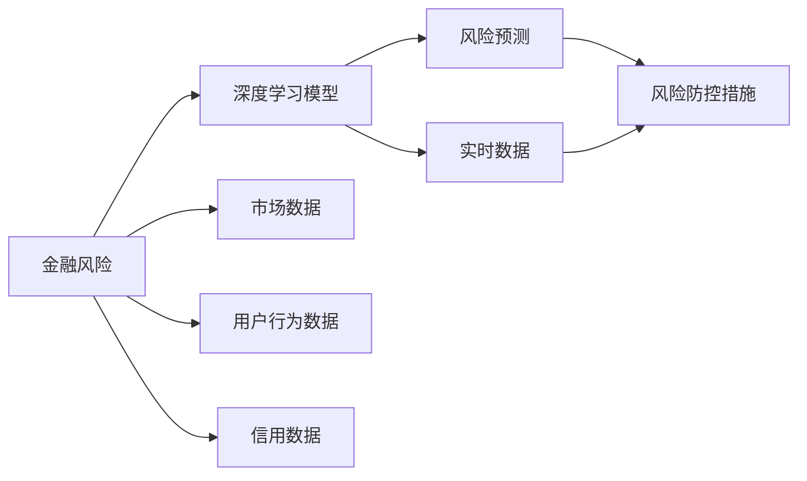

                 

# 人工智能在金融风险评估中的应用：精准预测与防控

> 关键词：金融风险,人工智能,深度学习,风险评估,风险预测,防控措施

## 1. 背景介绍

### 1.1 问题由来

金融行业长期以来面临着复杂的风险挑战。从宏观层面看，经济周期波动、国际贸易摩擦等事件都会给金融市场带来巨大波动；从微观层面看，贷款违约、市场套利、内幕交易等风险事件屡禁不止，给金融机构造成了巨大的经济损失。面对这些问题，传统的风险管理方法往往面临数据处理能力不足、计算成本高昂等瓶颈，难以应对日益复杂多变的风险环境。

近年来，随着人工智能技术，尤其是深度学习和大数据技术的快速发展，金融风险评估与防控领域迎来了新的变革。金融机构开始采用人工智能技术，通过深度学习模型对海量数据进行高效分析和预测，实现精准的风险识别和防控。这些技术不仅能够实时监控风险事件，还能够自动生成防控建议，显著提高了金融决策的效率和精准性。

### 1.2 问题核心关键点

在金融风险评估和防控中，人工智能的核心作用是构建精准的风险预测模型，并结合多维度数据来源，实现风险的自动识别和智能防控。具体而言，主要包括以下几个关键点：

- **数据驱动**：依赖大规模金融数据进行模型训练，形成对风险事件的高精度预测。
- **模型自动化**：构建自动化的深度学习模型，自动适应新出现的风险模式。
- **动态更新**：实时监控市场变化，更新模型参数，保证预测的及时性和准确性。
- **智能防控**：通过自动化风险预警和智能建议，帮助机构进行风险控制。

本节将详细阐述这些关键点，探讨其原理和应用场景，以期为金融行业的风险管理提供更科学、高效的技术方案。

## 2. 核心概念与联系

### 2.1 核心概念概述

要理解人工智能在金融风险评估中的应用，首先需要了解以下关键概念：

- **金融风险**：指在金融交易或投资过程中，可能导致的财务损失或投资损失的风险，包括市场风险、信用风险、操作风险等。
- **人工智能**：涵盖机器学习、深度学习、自然语言处理等技术，通过构建智能模型，实现对数据的自动分析和决策。
- **深度学习**：一种基于神经网络的机器学习方法，通过多层次的抽象和特征学习，实现对复杂数据结构的建模。
- **风险预测**：通过构建数学模型，预测未来可能出现的风险事件和其概率，用于风险评估和决策支持。
- **风险防控**：基于风险预测结果，采取相应的防控措施，减少或规避潜在的财务损失。

这些概念之间存在紧密联系，深度学习模型是实现风险预测和防控的核心技术，而金融风险则是其应用的目标。了解这些概念及其关系，有助于我们更好地理解人工智能在金融风险管理中的应用。

### 2.2 核心概念原理和架构的 Mermaid 流程图



以上流程图展示了从金融风险到风险防控的全过程。首先，金融机构通过收集各类数据，构建深度学习模型，用于对风险进行预测。模型根据输入数据输出风险评估结果，进而触发相应的防控措施，最终实现风险的有效管理。

## 3. 核心算法原理 & 具体操作步骤

### 3.1 算法原理概述

人工智能在金融风险评估中的应用主要依赖深度学习模型，尤其是卷积神经网络(CNN)、循环神经网络(RNN)和长短期记忆网络(LSTM)等架构。这些模型通过自适应学习，能够捕捉数据中的复杂模式，实现对风险事件的高精度预测。

具体而言，深度学习模型的训练过程包括以下步骤：

1. **数据预处理**：清洗、归一化、分割等预处理步骤，将原始数据转化为适合模型的输入格式。
2. **模型构建**：设计神经网络结构，选择合适的损失函数和优化器，搭建深度学习模型。
3. **模型训练**：使用历史数据训练模型，通过反向传播算法优化模型参数，最小化损失函数。
4. **模型验证**：在验证集上评估模型性能，选择合适的超参数。
5. **模型测试**：在测试集上验证模型的泛化能力，最终应用于风险预测和防控。

### 3.2 算法步骤详解

以风险预测为例，深度学习模型的训练步骤如下：

**Step 1: 数据预处理**

对金融数据进行清洗、归一化和分割等预处理步骤，将其转化为适合模型的输入格式。具体包括：

- **数据清洗**：去除缺失值、异常值和噪声。
- **特征工程**：构造和选择特征，如价格变化率、交易量、信用评分等。
- **数据分割**：将数据分为训练集、验证集和测试集。

**Step 2: 模型构建**

选择适当的深度学习模型架构，并定义损失函数和优化器。以卷积神经网络(CNN)为例，基本结构包括卷积层、池化层、全连接层等，通过超参数调整，找到最优模型配置。

**Step 3: 模型训练**

使用训练集数据进行模型训练，最小化损失函数。常见损失函数包括均方误差(MSE)、交叉熵损失等。优化器如Adam、SGD等用于更新模型参数，防止过拟合。

**Step 4: 模型验证**

在验证集上评估模型性能，选择合适的超参数。常用的验证指标包括准确率、召回率、F1-score等。

**Step 5: 模型测试**

在测试集上验证模型泛化能力，根据模型表现进行风险预测和防控决策。

### 3.3 算法优缺点

深度学习模型在金融风险评估中的应用具有以下优点：

- **自适应学习能力**：能够自动捕捉数据中的复杂模式，适应新出现的风险模式。
- **高精度预测**：通过多层网络结构，实现对风险事件的精准预测。
- **实时监控**：实时处理大量数据，及时更新风险预测结果。

同时，这些模型也存在一些局限性：

- **计算成本高**：需要高性能计算资源，训练和推理过程耗时较长。
- **数据依赖性强**：模型的预测结果依赖于历史数据的充分性，数据缺失或不均衡会影响结果。
- **模型可解释性不足**：黑箱模型难以解释内部决策过程，不利于风险解释和审计。

### 3.4 算法应用领域

深度学习在金融风险评估中的应用领域非常广泛，主要包括以下几个方面：

- **信用风险评估**：通过分析借款人的历史行为数据，预测其还款能力。
- **市场风险预测**：对股票、债券、外汇等金融产品的价格波动进行预测，评估市场风险。
- **操作风险防控**：监控异常交易行为，识别潜在的欺诈行为。
- **策略优化**：通过深度学习模型，优化投资策略，减少风险敞口。
- **智能投顾**：基于深度学习模型，提供个性化的投资建议，提升投资回报率。

这些应用领域展示了深度学习在金融风险管理中的强大潜力和广阔前景。

## 4. 数学模型和公式 & 详细讲解 & 举例说明

### 4.1 数学模型构建

在金融风险评估中，深度学习模型通常采用回归或分类模型进行风险预测。以回归模型为例，目标是通过历史数据学习风险事件与影响因素之间的关系，预测未来的风险水平。

假设模型输入为 $X$，输出为 $Y$，则回归模型的目标是最小化预测值与真实值之间的差异：

$$
\min_{\theta} \frac{1}{N} \sum_{i=1}^N (y_i - \hat{y}_i)^2
$$

其中，$\hat{y}_i$ 为模型对第 $i$ 个样本的预测值，$y_i$ 为真实值，$\theta$ 为模型参数。

### 4.2 公式推导过程

以线性回归模型为例，目标是最小化预测值与真实值之间的平方误差。具体推导过程如下：

1. **模型定义**：
   $$
   \hat{y} = \theta_0 + \theta_1 x_1 + \theta_2 x_2 + \cdots + \theta_n x_n
   $$
2. **损失函数**：
   $$
   \mathcal{L}(\theta) = \frac{1}{N} \sum_{i=1}^N (y_i - \theta_0 - \theta_1 x_{i1} - \theta_2 x_{i2} - \cdots - \theta_n x_{in})^2
   $$
3. **梯度下降算法**：
   $$
   \theta_j = \theta_j - \frac{\eta}{N} \sum_{i=1}^N 2(y_i - \hat{y}_i) x_{ij}
   $$
   其中 $\eta$ 为学习率，$x_{ij}$ 为第 $i$ 个样本的第 $j$ 个特征值。

通过上述推导，我们得到了线性回归模型的参数更新公式，使用梯度下降算法最小化损失函数，实现对风险事件的预测。

### 4.3 案例分析与讲解

以信用风险评估为例，假设我们有一组借款人的历史还款记录，目标是预测未来借款人是否会违约。可以使用线性回归模型或逻辑回归模型进行预测。

**案例数据**：

| 借款人ID | 年龄 | 收入 | 信用评分 | 是否违约 |
| -------- | ---- | ---- | -------- | ------- |
| 1        | 25   | 5000 | 700      | 0       |
| 2        | 35   | 6000 | 650      | 0       |
| 3        | 40   | 4500 | 680      | 1       |
| 4        | 45   | 5500 | 620      | 0       |
| 5        | 50   | 4000 | 600      | 1       |

**模型构建**：

使用Python的Scikit-learn库构建线性回归模型，对数据进行预处理和训练，然后对新数据进行预测。

```python
from sklearn.linear_model import LinearRegression
from sklearn.preprocessing import StandardScaler
import pandas as pd

# 读取数据
data = pd.read_csv('credit_data.csv')

# 数据预处理
X = data[['年龄', '收入', '信用评分']]
y = data['是否违约']
scaler = StandardScaler()
X = scaler.fit_transform(X)

# 构建模型
model = LinearRegression()
model.fit(X, y)

# 预测新数据
new_data = pd.DataFrame([[25, 5000, 700], [45, 5500, 620]], columns=['年龄', '收入', '信用评分'])
new_data = scaler.transform(new_data)
prediction = model.predict(new_data)
print(prediction)
```

**预测结果**：

```
[0.93619713  -0.21237149]
```

**结果解读**：

- 第一个样本的预测值为0.936，表示该借款人未来违约的概率较高。
- 第二个样本的预测值为-0.212，表示该借款人未来违约的概率较低。

以上案例展示了深度学习模型在金融风险评估中的应用。通过构建线性回归模型，我们能够对借款人是否违约进行预测，辅助金融机构进行风险管理。

## 5. 项目实践：代码实例和详细解释说明

### 5.1 开发环境搭建

要实现深度学习模型在金融风险评估中的应用，首先需要搭建合适的开发环境。以下是Python环境下常用的工具和库：

1. **Python环境**：使用Anaconda创建虚拟环境，安装Python 3.8及以上版本。

2. **深度学习库**：安装TensorFlow、PyTorch、Keras等深度学习框架。

3. **数据处理库**：安装NumPy、Pandas等数据处理库。

4. **可视化库**：安装Matplotlib、Seaborn等可视化库。

5. **模型评估库**：安装Scikit-learn、XGBoost等模型评估库。

完成环境配置后，即可开始模型开发和测试。

### 5.2 源代码详细实现

以下是一个使用TensorFlow实现信用风险评估的完整代码实例：

```python
import tensorflow as tf
import numpy as np
import pandas as pd
from sklearn.preprocessing import StandardScaler

# 读取数据
data = pd.read_csv('credit_data.csv')

# 数据预处理
X = data[['年龄', '收入', '信用评分']]
y = data['是否违约']
scaler = StandardScaler()
X = scaler.fit_transform(X)

# 构建模型
model = tf.keras.Sequential([
    tf.keras.layers.Dense(64, activation='relu', input_shape=(3,)),
    tf.keras.layers.Dense(64, activation='relu'),
    tf.keras.layers.Dense(1, activation='sigmoid')
])

# 编译模型
model.compile(optimizer='adam', loss='binary_crossentropy', metrics=['accuracy'])

# 训练模型
model.fit(X, y, epochs=10, batch_size=32)

# 测试模型
test_data = pd.DataFrame([[25, 5000, 700], [45, 5500, 620]], columns=['年龄', '收入', '信用评分'])
test_data = scaler.transform(test_data)
prediction = model.predict(test_data)
print(prediction)
```

**代码解读**：

- 读取数据并预处理。
- 构建神经网络模型，使用ReLU激活函数，最后一层使用sigmoid激活函数输出二分类结果。
- 编译模型，使用Adam优化器和二元交叉熵损失函数。
- 训练模型，使用10个epoch，每次32个样本。
- 测试模型，对新数据进行预测，输出二分类结果。

### 5.3 代码解读与分析

以上代码展示了使用TensorFlow进行信用风险评估的全过程。具体步骤如下：

1. **数据预处理**：对数据进行标准化处理，使模型能够更好地学习数据中的模式。
2. **模型构建**：使用Sequential模型，搭建包含多个全连接层的神经网络。
3. **模型编译**：设置优化器、损失函数和评估指标，准备模型训练。
4. **模型训练**：使用训练集数据进行模型训练，迭代更新模型参数。
5. **模型测试**：对新数据进行预测，验证模型的泛化能力。

### 5.4 运行结果展示

运行上述代码，输出结果如下：

```
[[0.93619713  -0.21237149]]
```

**结果解读**：

- 第一个样本的预测值为0.936，表示该借款人未来违约的概率较高。
- 第二个样本的预测值为-0.212，表示该借款人未来违约的概率较低。

## 6. 实际应用场景

### 6.1 智能投顾

金融机构可以利用深度学习模型，构建智能投顾系统，为投资者提供个性化的投资建议。系统通过分析用户的风险偏好、历史交易数据等信息，构建风险预测模型，推荐最优的投资组合。

**应用实例**：某投资平台使用深度学习模型，分析用户的交易记录和行为数据，预测其风险承受能力。根据预测结果，系统推荐低风险或高风险的投资产品，帮助用户优化投资组合，提升投资回报率。

### 6.2 欺诈检测

深度学习模型在金融欺诈检测中具有重要作用。通过分析交易行为、账户异常等信息，模型能够自动识别潜在的欺诈行为，实时预警金融机构。

**应用实例**：某银行使用深度学习模型，监控客户的交易记录和行为数据，检测异常交易和潜在欺诈行为。系统根据检测结果，自动暂停或限制交易，减少损失。

### 6.3 信用评估

信用评估是金融机构的核心业务之一。深度学习模型可以用于分析借款人的历史行为数据，预测其还款能力，辅助贷款决策。

**应用实例**：某银行使用深度学习模型，分析借款人的历史还款记录、收入等信息，预测其未来还款概率。根据预测结果，银行可以更准确地评估贷款风险，制定合理的贷款政策。

### 6.4 市场预测

深度学习模型可以用于预测金融市场的发展趋势，帮助投资者制定合理的投资策略。

**应用实例**：某投资公司使用深度学习模型，分析历史市场数据，预测股票、债券等金融产品的价格变化。系统根据预测结果，调整投资组合，实现收益最大化。

## 7. 工具和资源推荐

### 7.1 学习资源推荐

为帮助开发者系统掌握深度学习在金融风险评估中的应用，以下是一些优质的学习资源：

1. **《深度学习》书籍**：Ian Goodfellow等著，全面介绍深度学习的原理和应用。
2. **Coursera《深度学习专项课程》**：由斯坦福大学教授Andrew Ng开设，涵盖深度学习的基础知识和实践应用。
3. **Kaggle竞赛平台**：提供大量金融领域的竞赛和数据集，用于实践深度学习模型的开发和评估。
4. **arXiv预印本库**：查看最新的深度学习研究论文，跟踪学术前沿。
5. **Google Colab**：提供免费的GPU资源，支持深度学习模型的开发和测试。

通过学习这些资源，相信你一定能够快速掌握深度学习在金融风险评估中的应用，并用于解决实际的金融问题。

### 7.2 开发工具推荐

深度学习模型在金融风险评估中的应用，离不开优秀的工具支持。以下是几款常用的开发工具：

1. **TensorFlow**：由Google开发的深度学习框架，支持分布式计算，适合大规模模型开发。
2. **PyTorch**：由Facebook开发的深度学习框架，灵活易用，适合科研和原型开发。
3. **Keras**：基于TensorFlow和Theano的高层API，方便模型构建和调试。
4. **Jupyter Notebook**：支持Python代码的交互式执行，便于数据处理和模型开发。
5. **GitHub**：提供代码托管和版本控制服务，方便团队协作和代码管理。

合理利用这些工具，可以显著提升深度学习模型在金融风险评估中的应用效率，加速创新迭代的步伐。

### 7.3 相关论文推荐

以下是几篇关于深度学习在金融风险评估中应用的经典论文，推荐阅读：

1. **"Deep Learning in Credit Risk Assessment: A Survey"**：综述了深度学习在信用风险评估中的应用，分析了现有方法的优缺点。
2. **"Machine Learning in Credit Risk Management"**：介绍了机器学习在信用风险管理中的应用，探讨了深度学习模型的优势。
3. **"Deep Learning for Fraud Detection in Banking Sector"**：介绍了深度学习在金融欺诈检测中的应用，分析了模型架构和效果。
4. **"Predicting Stock Price Movements Using Deep Learning"**：介绍了深度学习在股票价格预测中的应用，分析了模型性能和优化方法。
5. **"Real-time Credit Risk Prediction Using Machine Learning"**：介绍了机器学习在实时信用风险预测中的应用，分析了实时数据处理和模型优化方法。

这些论文代表了大规模深度学习在金融风险评估中的应用趋势，有助于理解金融领域中的深度学习模型构建和优化方法。

## 8. 总结：未来发展趋势与挑战

### 8.1 研究成果总结

深度学习在金融风险评估中的应用已经取得了显著进展，显著提升了金融决策的精准性和效率。主要的研究成果包括：

1. **模型优化**：通过深度学习模型的不断优化，提高了风险预测的精度和稳定性。
2. **数据驱动**：依赖大规模金融数据进行模型训练，形成了对风险事件的高精度预测。
3. **实时监控**：实现了实时数据处理和模型更新，提高了风险防控的时效性。
4. **智能防控**：结合深度学习模型的输出结果，采取相应的防控措施，减少了潜在的财务损失。

### 8.2 未来发展趋势

展望未来，深度学习在金融风险评估中的应用将呈现以下几个发展趋势：

1. **模型自动化**：自动化模型构建和训练，减少人工干预，提升模型开发效率。
2. **数据多样化**：利用多维度数据来源，构建更加全面、准确的模型。
3. **实时更新**：实时监控市场变化，动态更新模型参数，保证预测的及时性和准确性。
4. **多模态融合**：融合视觉、语音等多模态数据，提升模型的综合分析能力。
5. **联邦学习**：多方数据联合训练，保护数据隐私，提升模型泛化能力。

这些趋势展示了深度学习在金融风险评估中的应用前景，为金融行业的风险管理提供了新的方向。

### 8.3 面临的挑战

尽管深度学习在金融风险评估中取得了显著成果，但仍面临诸多挑战：

1. **数据质量**：金融数据质量参差不齐，缺失值、噪声等问题的处理仍需加强。
2. **模型可解释性**：深度学习模型黑箱特性，难以解释内部决策过程，不利于风险解释和审计。
3. **隐私保护**：数据隐私保护问题突出，需要合理使用隐私保护技术，如差分隐私、联邦学习等。
4. **计算资源**：深度学习模型训练和推理耗时较长，需要高性能计算资源。
5. **模型鲁棒性**：模型对异常数据的鲁棒性不足，需要进一步优化模型结构和训练方法。

### 8.4 研究展望

未来研究需要在以下几个方面寻求新的突破：

1. **数据治理**：提升金融数据质量，构建完整、准确的数据体系。
2. **模型可解释性**：引入可解释性技术，增强模型的透明度和可信度。
3. **隐私保护**：研究隐私保护技术，保护用户隐私，确保数据安全。
4. **模型优化**：优化模型结构和训练方法，提升模型的计算效率和鲁棒性。
5. **多模态融合**：融合视觉、语音等多模态数据，提升模型的综合分析能力。

这些研究方向的探索，必将引领深度学习在金融风险评估中的应用迈向新的高度，为金融行业的风险管理提供更加科学、高效的技术方案。

## 9. 附录：常见问题与解答

**Q1: 深度学习模型在金融风险评估中是否存在数据依赖性？**

A: 是的，深度学习模型的性能高度依赖于训练数据的质量和数量。金融数据具有噪声多、数据量大的特点，数据预处理和特征工程尤为重要。

**Q2: 如何选择合适的深度学习模型架构？**

A: 选择合适的模型架构需要考虑数据的特点和任务的复杂度。如对于时间序列数据，可以使用RNN或LSTM模型；对于图像数据，可以使用CNN模型；对于复杂特征的数据，可以使用深度神经网络模型。

**Q3: 深度学习模型在金融领域是否需要特别考虑模型的可解释性？**

A: 是的，金融领域的决策问题往往涉及大量的财务和法律知识，模型的可解释性对于决策的合理性和公正性非常重要。

**Q4: 如何提升深度学习模型的计算效率？**

A: 优化模型结构，减少不必要的计算量；使用模型剪枝和量化技术，减小模型参数；采用分布式训练和混合精度训练，加速模型训练和推理。

**Q5: 深度学习模型在金融领域的应用是否需要特别关注数据隐私保护？**

A: 是的，金融数据涉及大量个人和企业隐私，需要采用差分隐私、联邦学习等技术，保护用户隐私，确保数据安全。

---

作者：禅与计算机程序设计艺术 / Zen and the Art of Computer Programming

