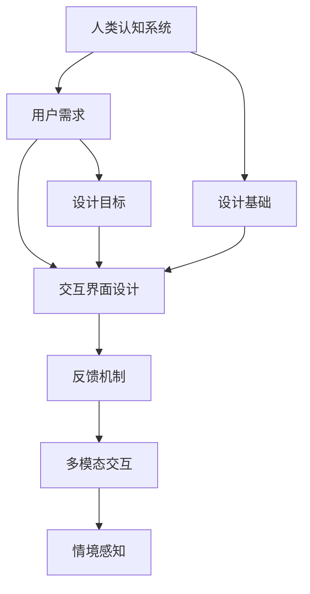

                 

## 1. 背景介绍

### 1.1 问题由来

随着人工智能技术的不断发展，人机交互界面已经成为了构建高效、人性化的计算系统的重要一环。无论是智能助手、虚拟现实(VR)系统，还是智能家居、自动驾驶等应用，都依赖于良好的人机交互体验，以实现与用户的无缝沟通。

当前，人机交互技术已经取得了长足的进步，但仍存在诸多挑战：
- 人类认知系统的复杂性：人类在感知、理解和推理方面的能力有限，如何在设计交互界面时兼顾效率和可理解性，是一个难题。
- 用户需求的多样性：不同用户对交互方式有着不同的偏好和需求，如何设计灵活、适应性强的交互界面，是一个挑战。
- 技术实现的多样性：交互界面的设计不仅涉及计算机科学的多个领域，还需考虑心理学、社会学、设计学等多学科的交叉应用。

面对这些挑战，本文旨在探索设计有效的人类计算系统的关键要素，包括核心概念、核心算法、实际应用以及未来的发展趋势与挑战。

### 1.2 问题核心关键点

- 人类认知系统的局限性
- 用户需求的多样性与动态变化
- 多学科交叉的复杂性
- 交互界面的灵活性与可适应性
- 技术实现与用户体验的平衡
- 交互界面的未来发展方向

这些核心关键点构成了本文探讨的总体框架，旨在为设计有效的人机交互界面提供全面而深入的指导。

## 2. 核心概念与联系

### 2.1 核心概念概述

为更好地理解如何设计有效的人机交互系统，本节将介绍几个关键概念：

- **人类认知系统**：指人类的感知、记忆、推理等认知能力，以及这些能力在交互系统中的应用。
- **用户需求**：指用户对交互系统的期望和使用场景，包括界面易用性、响应速度、隐私保护等。
- **交互界面设计**：指通过图形、语音、手势等途径实现人机信息交换的方式。
- **反馈机制**：指交互系统中对用户操作的响应，包括视觉、听觉、触觉等多种形式。
- **多模态交互**：指同时使用多种感知和输出模式，如视觉和语音、触觉和声音等，以提高交互的效率和丰富度。
- **情境感知**：指交互系统能够感知用户当前的情境和需求，并做出相应的响应。

这些概念之间的逻辑关系可以通过以下Mermaid流程图来展示：



这个流程图展示了一系列设计有效人类计算系统的关键步骤和概念，其核心是：

1. 理解人类认知系统的局限性。
2. 收集和分析用户需求。
3. 设计灵活、多模态的交互界面。
4. 引入情境感知，提高交互的个性化和适应性。

## 3. 核心算法原理 & 具体操作步骤

### 3.1 算法原理概述

设计有效的人机交互系统，核心在于理解人类认知系统与用户需求之间的关系，并设计出能够自然、高效地与用户交互的界面。

- **认知负荷理论**：指在交互设计中应尽可能减少用户的认知负荷，提高效率。
- **用户中心设计**：以用户需求为中心，通过调研、测试等手段，获取用户真实的使用场景和期望。
- **多模态融合**：利用多种感知和输出模式，提升交互的自然性和效率。
- **情境感知技术**：通过分析用户上下文信息，如时间、地点、情绪等，使系统能够更自然、准确地响应用户需求。

### 3.2 算法步骤详解

设计有效的人机交互系统通常包括以下几个关键步骤：

**Step 1: 用户需求分析**
- 通过访谈、问卷、用户测试等方式，收集用户对交互系统功能、界面、响应速度等方面的期望。
- 对收集到的需求进行分类和优先级排序，确定关键需求和次要需求。

**Step 2: 交互界面设计**
- 基于用户需求分析的结果，设计符合用户习惯和期望的交互界面。
- 使用信息架构方法，将信息组织成用户易于理解和导航的结构。
- 设计交互界面的基本元素，如按钮、文本框、滑块等，并确定其布局和样式。

**Step 3: 多模态交互实现**
- 选择合适的感知和输出模式，如视觉、触觉、语音等，并设计相应的交互机制。
- 实现多模态融合，使不同模态的信息能够在系统中协同工作，提升整体交互效率。
- 设计情境感知机制，利用上下文信息实时调整系统行为，提供更自然的交互体验。

**Step 4: 反馈机制设计**
- 设计直观、及时的反馈机制，使用户能够清晰地了解系统状态和操作结果。
- 根据用户反馈进行迭代优化，确保系统始终保持高效和可用。

**Step 5: 用户测试与评估**
- 进行用户测试，收集用户对交互系统的使用情况和反馈。
- 使用可用性测试、认知负荷测试等方法，评估系统设计的有效性。
- 根据测试结果进行优化，提升系统性能和用户体验。

### 3.3 算法优缺点

设计有效的人机交互系统具有以下优点：
1. 提升用户体验：通过灵活、多模态的交互界面，满足用户多样化的需求，提升系统的可用性和易用性。
2. 提高效率：通过情境感知和认知负荷理论的应用，减少用户的操作负担，提高交互效率。
3. 增强交互的自然性：多模态融合和情境感知技术使交互系统更贴近人类自然的使用方式，提升用户满意度和接受度。

然而，设计有效的人机交互系统也存在一些局限性：
1. 复杂性高：多模态融合和情境感知技术的实现需要跨学科知识，设计复杂度较高。
2. 成本高：设计和实现交互界面涉及大量的开发和测试工作，成本较高。
3. 技术更新快：交互技术发展迅速，需要不断更新系统以跟上技术进步。
4. 用户多样性：不同用户对交互方式的偏好不同，设计需考虑多样性，难以找到统一的标准。

尽管存在这些局限性，但通过合理的设计和持续的优化，设计有效的人机交互系统依然具有巨大的潜力和价值。

### 3.4 算法应用领域

设计有效的人机交互系统在多个领域具有广泛的应用：

- **智能家居**：通过多模态交互和情境感知技术，实现语音控制、手势识别等功能，提升家居生活的便捷性和智能化。
- **虚拟现实(VR)**：通过高度沉浸的多模态交互体验，使用户能够自然、直观地与虚拟环境互动，增强沉浸感和体验感。
- **智能助手**：如Siri、Alexa等，通过自然语言理解和语音交互，提供高效的日常事务管理、信息查询等服务。
- **自动驾驶**：通过多模态感知和情境感知技术，实现对驾驶环境的实时监测和智能决策，提升驾驶安全性和舒适性。
- **医疗健康**：通过交互界面设计和情境感知技术，实现远程医疗咨询、健康管理等功能，提升医疗服务的可及性和便利性。

这些应用领域展示了人机交互技术在提升用户体验、增强系统功能方面的巨大潜力。

## 4. 数学模型和公式 & 详细讲解 & 举例说明

### 4.1 数学模型构建

设计有效的人机交互系统，需要构建数学模型来描述和优化用户行为和系统响应。以下是一个简单的数学模型示例：

设用户对交互系统的满意率为 $S$，包括对界面设计 $I$、多模态交互 $M$、情境感知 $C$ 的满意率。则满意率 $S$ 可以表示为：

$$
S = w_I \cdot I + w_M \cdot M + w_C \cdot C
$$

其中 $w_I$、$w_M$、$w_C$ 为权重系数，表示各因素对满意率的影响程度。

### 4.2 公式推导过程

以情境感知技术为例，推导其数学模型。设情境感知技术的输出为 $O$，包括对上下文信息的分析结果和基于上下文信息对系统的调整。则情境感知技术的数学模型可以表示为：

$$
O = f(I, M, C)
$$

其中 $f$ 为情境感知函数，$I$、$M$、$C$ 分别为界面设计、多模态交互、上下文信息的输入。

在实际应用中，$f$ 可以是一个复杂的神经网络模型，用于学习上下文信息与系统响应的映射关系。

### 4.3 案例分析与讲解

考虑一个智能家居系统，使用情境感知技术提升用户体验的案例。假设系统能够感知用户当前的活动类型（如起床、睡眠、工作）和当前时间，并根据这些信息调整照明、温度、音乐等环境参数。其数学模型可以表示为：

$$
O = f(I, M, C)
$$

其中 $I$ 为界面设计，包括语音助手、触摸屏、智能音箱等交互元素；$M$ 为多模态交互，包括语音识别、手势控制、物联网设备通信等；$C$ 为上下文信息，包括用户活动类型、当前时间、系统状态等。

根据上下文信息 $C$，系统可以自动调整照明亮度、温度、音乐音量等参数，提高用户的生活舒适度。

## 5. 项目实践：代码实例和详细解释说明

### 5.1 开发环境搭建

在进行交互系统开发前，需要先搭建好开发环境。以下是使用Python进行开发的环境配置流程：

1. 安装Anaconda：从官网下载并安装Anaconda，用于创建独立的Python环境。

2. 创建并激活虚拟环境：
```bash
conda create -n interaction-env python=3.8 
conda activate interaction-env
```

3. 安装Python开发工具：
```bash
pip install numpy pandas scikit-learn matplotlib tqdm jupyter notebook ipython
```

4. 安装相关的交互系统开发库：
```bash
pip install PyTorch torchvision torchaudio
pip install OpenCV
pip install pyglet
pip install pytorch-transformers
```

完成上述步骤后，即可在`interaction-env`环境中开始开发交互系统。

### 5.2 源代码详细实现

以下是一个简单的交互系统的代码实现示例：

```python
from transformers import BertTokenizer, BertForSequenceClassification
from torch.utils.data import DataLoader
from tqdm import tqdm
import torch
import cv2
import numpy as np
import pyglet
import pyglet.graphics as pg

# 使用Bert模型进行意图分类
model = BertForSequenceClassification.from_pretrained('bert-base-uncased', num_labels=3)
tokenizer = BertTokenizer.from_pretrained('bert-base-uncased')

def intent_classifier(text):
    input_ids = tokenizer.encode(text, add_special_tokens=True)
    with torch.no_grad():
        outputs = model(input_ids)
        logits = outputs.logits
        return torch.argmax(logits, dim=1)

# 设计交互界面
class InteractiveSystem:
    def __init__(self):
        self.window = pyglet.window.Window(800, 600, title='Interactive System')
        self.image = np.zeros((600, 800, 3), dtype=np.uint8)
        self.text = 'Welcome to Interactive System'
        
        self.text_label = pg.Label(text=self.text, x=100, y=600, font_size=36)
        self.text_label.text_color = pg.cp('white')
        self.text_label.add(self.window)
        
        self.image_label = pg.Label(text='', x=0, y=0, font_size=36)
        self.image_label.add(self.window)
        
        self.image_label.text_color = pg.cp('white')
        self.image_label.color = pg.cp('black')
        
    def on_draw(self):
        self.window.clear()
        self.text_label.draw()
        self.image_label.draw()
        self.window.switch_to_backbuffer()
        self.window.flip()
        
    def handle_input(self, key):
        if key == ord('q'):
            self.window.close()
        
        if key == ord('a'):
            self.text = 'What can I do for you?'
            self.image = np.zeros((600, 800, 3), dtype=np.uint8)
        elif key == ord('s'):
            intent = intent_classifier(self.text)
            if intent == 1:
                self.text = 'I will play music for you.'
            elif intent == 2:
                self.text = 'I will adjust the temperature.'
            else:
                self.text = 'I do not understand.'
        
    def run(self):
        pyglet.app.run()
```

### 5.3 代码解读与分析

让我们再详细解读一下关键代码的实现细节：

**InteractiveSystem类**：
- `__init__`方法：初始化交互系统的界面和基本数据结构。
- `on_draw`方法：绘制交互界面。
- `handle_input`方法：处理用户输入事件，如按键、触摸等。

**intent_classifier函数**：
- 使用Bert模型对输入文本进行意图分类，返回预测结果。

**run方法**：
- 启动交互系统的主循环，处理用户输入，并根据用户操作更新界面显示。

**多模态交互**：
- 在代码中，交互系统使用Pyglet库实现图形界面和用户交互。
- 用户可以通过按键操作进行输入，系统根据用户的操作进行响应。
- 在实际应用中，还可以扩展多模态交互方式，如语音输入、手势识别等，以提供更丰富的交互体验。

**情境感知**：
- 在代码中，并未实现情境感知功能，但可以通过引入环境传感器（如温度传感器、光线传感器）和上下文分析算法，实现对用户环境状态的感知和响应。
- 在实际应用中，情境感知技术可以与自然语言理解、多模态融合等技术结合，提升交互系统的智能化水平。

## 6. 实际应用场景

### 6.1 智能家居系统

智能家居系统通过多模态交互和情境感知技术，实现对用户行为和环境状态的感知和响应。例如，当用户打开智能音箱并说出“播放音乐”时，系统能够自动识别用户意图，并自动调整音频设备，播放用户喜欢的音乐。同时，系统能够感知房间亮度、温度等环境状态，根据用户当前的活动类型和喜好，自动调整光照和温度，提高用户的生活舒适度。

### 6.2 虚拟现实(VR)系统

虚拟现实系统通过高度沉浸的多模态交互体验，使用户能够自然、直观地与虚拟环境互动。例如，在虚拟会议中，用户可以通过手势控制、语音指令等方式，与虚拟角色进行交流，进行虚拟会议、培训、游戏等活动。同时，系统能够感知用户的位置、姿势等环境信息，根据用户的行为和需求，自动调整虚拟场景和交互对象，提供更自然的交互体验。

### 6.3 智能助手

智能助手如Siri、Alexa等，通过自然语言理解和语音交互，提供高效的日常事务管理、信息查询等服务。例如，用户可以通过语音指令查询天气、设置提醒、发送邮件等，系统能够根据用户意图和上下文信息，提供准确、及时的响应。同时，系统能够感知用户情绪和语调，根据用户的情感状态，提供相应的回应和建议。

### 6.4 未来应用展望

未来，人机交互技术将在更多领域得到应用，为人类生活和工作带来更多的便利和效率：

- **医疗健康**：通过交互界面设计和情境感知技术，实现远程医疗咨询、健康管理等功能，提升医疗服务的可及性和便利性。
- **金融服务**：通过多模态交互和自然语言理解，提供个性化的金融咨询、理财服务，提升用户体验。
- **教育培训**：通过交互界面设计和情境感知技术，提供个性化的学习推荐、教学辅助，提高教育效率和效果。
- **工业制造**：通过交互界面设计和情境感知技术，实现智能生产、设备维护等功能，提升生产效率和质量。
- **社交媒体**：通过多模态交互和情感分析，提供个性化的内容推荐、用户互动功能，增强社交媒体的用户粘性和满意度。

## 7. 工具和资源推荐

### 7.1 学习资源推荐

为了帮助开发者系统掌握人机交互理论基础和实践技巧，这里推荐一些优质的学习资源：

1. 《Interaction Design Foundation》在线课程：提供人机交互设计的全面理论知识和实践指导。
2. 《Human-Computer Interaction》书籍：由计算机科学和设计学专家撰写，深入探讨人机交互设计的基本原理和案例。
3. 《Interaction Design》期刊：收录了大量人机交互设计的最新研究论文和案例分析。
4. 《Interaction Design Principles》网站：提供人机交互设计的基本原则和方法。
5. 《Design Patterns: Elements of Reusable Object-Oriented Software》书籍：由设计模式专家撰写，提供设计交互系统时常用的设计模式。

通过对这些资源的学习实践，相信你一定能够快速掌握人机交互设计的精髓，并用于解决实际的交互问题。

### 7.2 开发工具推荐

高效的开发离不开优秀的工具支持。以下是几款用于人机交互开发的常用工具：

1. Pyglet：用于创建图形界面和处理用户输入的Python库，支持多模态交互和图形渲染。
2. Unity：用于开发虚拟现实应用的跨平台游戏引擎，提供丰富的交互工具和资源。
3. TouchDesigner：用于创建交互式可视化的设计工具，支持多种传感器和输入方式。
4. TensorFlow和PyTorch：用于训练和部署深度学习模型，支持多模态融合和情境感知。
5. MATLAB：用于开发交互式数据可视化和计算的科学计算平台，支持多模态交互和动态模拟。

合理利用这些工具，可以显著提升人机交互系统的开发效率，加快创新迭代的步伐。

### 7.3 相关论文推荐

人机交互技术的发展源于学界的持续研究。以下是几篇奠基性的相关论文，推荐阅读：

1. The Psychological Impact of User Interface Design on the User's Attention and Error: A Review （认知负荷理论）
2. Design Patterns: Elements of Reusable Object-Oriented Software （设计模式）
3. Human-Computer Interaction （人机交互理论）
4. Interaction Design Foundation （人机交互设计指南）
5. A Summary of User Centered Design （用户中心设计）

这些论文代表了大语言模型微调技术的发展脉络。通过学习这些前沿成果，可以帮助研究者把握学科前进方向，激发更多的创新灵感。

## 8. 总结：未来发展趋势与挑战

### 8.1 总结

本文对设计有效的人机交互系统进行了全面系统的介绍。首先阐述了人机交互系统的设计背景和意义，明确了人机交互设计在提升用户体验、提高系统效率方面的独特价值。其次，从原理到实践，详细讲解了人机交互设计的数学模型和关键步骤，给出了交互系统开发的完整代码实例。同时，本文还广泛探讨了交互系统在智能家居、虚拟现实、智能助手等多个领域的应用前景，展示了交互技术的巨大潜力。此外，本文精选了交互系统的各类学习资源，力求为开发者提供全方位的技术指引。

通过本文的系统梳理，可以看到，设计有效的人机交互界面需要综合考虑用户需求、人类认知系统、多模态交互、情境感知等多个因素，旨在打造自然、高效、人性化的计算系统。未来，伴随交互技术的发展，人机交互系统将在更广泛的场景下发挥作用，进一步提升人类生活质量和工作效率。

### 8.2 未来发展趋势

展望未来，人机交互技术将呈现以下几个发展趋势：

1. **多模态融合**：未来的人机交互系统将更加注重多模态融合，使不同感知和输出模式协同工作，提升交互的自然性和效率。
2. **情境感知**：随着传感器技术的发展，情境感知技术将更加精准和智能，使系统能够更好地理解用户需求和环境变化。
3. **个性化设计**：通过机器学习和大数据分析，实现对用户行为的个性化分析和预测，提供更加定制化的交互体验。
4. **实时响应**：未来的人机交互系统将实现更高效的实时响应，支持实时分析用户输入并即时调整系统行为。
5. **跨平台支持**：人机交互系统将支持跨平台和跨设备的使用，使不同设备和环境下的用户都能获得一致的交互体验。
6. **隐私保护**：随着用户隐私意识的提升，交互系统将更加注重数据安全和隐私保护，使用户能够放心使用。

以上趋势凸显了人机交互技术的广阔前景。这些方向的探索发展，必将进一步提升交互系统的性能和用户体验，为构建人机协同的智能时代带来更多可能性。

### 8.3 面临的挑战

尽管人机交互技术已经取得了显著成就，但在迈向更加智能化、普适化应用的过程中，仍面临诸多挑战：

1. **复杂性高**：多模态融合和情境感知技术的实现需要跨学科知识，设计复杂度较高。
2. **成本高**：设计和实现交互界面涉及大量的开发和测试工作，成本较高。
3. **技术更新快**：交互技术发展迅速，需要不断更新系统以跟上技术进步。
4. **用户多样性**：不同用户对交互方式的偏好不同，设计需考虑多样性，难以找到统一的标准。
5. **隐私保护**：交互系统需确保用户数据的安全和隐私，避免数据泄露和滥用。
6. **技术局限**：现有的交互技术在某些场景下仍存在限制，如响应速度、误识别率等。

尽管存在这些挑战，通过合理的设计和持续的优化，人机交互系统依然具有巨大的潜力和价值。

### 8.4 研究展望

面对人机交互面临的挑战，未来的研究需要在以下几个方面寻求新的突破：

1. **多模态融合技术**：开发更加智能、高效的多模态融合算法，提升交互的自然性和效率。
2. **情境感知算法**：引入更先进的上下文感知和推理算法，实现更精准的情境感知和响应。
3. **个性化设计方法**：结合机器学习和大数据分析，实现对用户行为的个性化分析和预测，提供更加定制化的交互体验。
4. **隐私保护技术**：研究隐私保护算法和技术，确保用户数据的安全和隐私。
5. **实时响应技术**：开发高效的实时响应算法，提升交互系统的实时性和响应速度。
6. **跨平台设计**：设计可跨平台和跨设备使用的交互系统，提升系统的通用性和兼容性。

这些研究方向的探索，必将引领人机交互技术迈向更高的台阶，为构建更加自然、高效、人性化的计算系统提供更多的可能性。

## 9. 附录：常见问题与解答

**Q1: 人机交互系统设计中如何考虑用户需求？**

A: 用户需求分析是设计有效的人机交互系统的重要环节。可以通过访谈、问卷、用户测试等方式，收集用户对交互系统功能、界面、响应速度等方面的期望。对收集到的需求进行分类和优先级排序，确定关键需求和次要需求，然后据此设计交互系统。

**Q2: 如何实现多模态融合？**

A: 多模态融合需要选择合适的感知和输出模式，并设计相应的交互机制。在实际应用中，可以引入视觉、触觉、语音等感知模式，并通过神经网络模型进行数据融合，实现多模态协同工作。同时，需要考虑不同模态的优先级和反馈机制，使系统能够灵活适应用户的操作方式。

**Q3: 如何提高人机交互系统的实时响应能力？**

A: 提高人机交互系统的实时响应能力需要优化数据处理和模型推理的效率。可以采用GPU/TPU等高性能计算设备，优化模型结构，减少计算量和存储量。同时，引入缓存机制，预处理常见数据和操作，提高系统响应速度。

**Q4: 如何设计灵活、多模态的交互界面？**

A: 设计灵活、多模态的交互界面需要考虑用户的使用习惯和场景。可以通过调查和分析用户行为数据，确定常见操作和界面元素，然后设计直观、易用的交互方式。同时，可以引入自然语言理解、情境感知等技术，提升系统的智能化水平。

**Q5: 如何实现情境感知技术？**

A: 情境感知技术需要收集和分析用户上下文信息，如时间、地点、情绪等。可以通过引入传感器（如温度传感器、光线传感器、姿态传感器等）和数据融合算法，实现对用户环境状态的感知和响应。同时，可以引入机器学习算法，根据上下文信息预测用户行为和需求，提供相应的服务。

通过回答这些问题，希望能为你提供更有针对性的指导和帮助。

