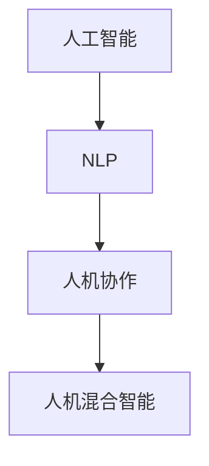

                 

# 人机协作新篇章：共创智能未来新时代

## 1. 背景介绍

随着人工智能技术的不断进步，人机协作已不仅仅是科幻小说中的场景，而是正在成为现实世界中的主流模式。尤其是在自然语言处理(NLP)、计算机视觉、机器人学等多个领域，人机协作正以迅猛的速度推动着行业的发展。从工业生产的自动化，到商业智能的智能化，再到日常生活的便捷化，人机协作正在全方位地渗透到各个角落，为社会带来了前所未有的变革。本文将深入探讨人机协作背后的原理与技术，展望其未来发展趋势，并提供基于人工智能的实际应用案例，希望能为人机协作的未来发展提供一些启示。

## 2. 核心概念与联系

### 2.1 核心概念概述

在探讨人机协作之前，我们首先需要明确几个核心概念：

- **人工智能**：一种通过计算机系统模拟人类智能的技术，包括学习、推理、规划、感知、决策、语言理解、视觉识别等方面。
- **自然语言处理(NLP)**：人工智能的一个分支，专注于人类语言和计算机之间的交互，目标是使计算机能够理解、解释和生成自然语言。
- **人机协作**：指人类与计算机系统协同工作，以实现更高效、更智能的任务处理。
- **人机混合智能**：一种结合人类智能与人工智能的新型智能形态，旨在充分发挥人类与机器各自的优点，提升整体的决策能力和适应性。

这些概念之间的联系可以通过以下Mermaid流程图来展示：



这个流程图展示了人工智能技术通过自然语言处理在人机协作中的应用，并进一步演进为更高级的人机混合智能。

### 2.2 核心概念原理和架构

人工智能的核心原理是通过算法和模型，模拟人类智能的运作方式。其中，机器学习是人工智能的核心技术之一，通过算法让计算机系统能够从数据中学习并优化性能。自然语言处理则是在人工智能的基础上，专注于文本数据的处理和分析，使得计算机能够理解并生成人类语言。

在架构上，人机协作系统通常由以下几个组件构成：

- **前端界面**：负责接收用户输入，并将结果输出给用户。
- **自然语言理解(NLU)**：将自然语言转化为计算机可理解的形式，如文本向量化表示。
- **知识库**：存储领域相关的知识和规则，用于指导机器理解和决策。
- **决策引擎**：根据用户输入和知识库的信息，结合机器学习模型，做出决策或提供建议。
- **自然语言生成(NLG)**：将机器的决策结果转化为自然语言输出给用户。

这些组件通过网络或其他通信方式连接，共同完成人机协作的任务。

## 3. 核心算法原理 & 具体操作步骤

### 3.1 算法原理概述

在人机协作中，算法和模型的选择至关重要。目前，基于深度学习的模型已成为主流，尤其是Transformer架构的模型，如BERT、GPT-3等。这些模型通过大规模预训练和微调，能够学习到丰富的语言知识和领域知识，适用于各种复杂任务。

在具体的算法操作上，主要包括以下几个步骤：

1. **数据准备**：收集和预处理数据，将其转化为模型可以处理的格式。
2. **模型选择**：根据任务类型和数据特点选择合适的预训练模型。
3. **微调优化**：在特定任务上，对预训练模型进行微调，调整部分参数以适应新任务。
4. **融合与交互**：将微调后的模型嵌入到人机协作系统中，实现与用户交互。

### 3.2 算法步骤详解

以自然语言处理任务为例，具体步骤如下：

**Step 1: 数据准备**
- 收集领域相关的文本数据，如新闻、文章、对话等。
- 对数据进行清洗和标注，如去除噪声、划分训练集和测试集等。
- 使用分词器将文本转化为模型可以处理的词汇序列。

**Step 2: 模型选择**
- 根据任务类型，选择适合的预训练模型，如BERT、GPT-3等。
- 使用HuggingFace等框架加载预训练模型，进行初始化。

**Step 3: 微调优化**
- 在微调数据上，使用交叉熵损失等适当的损失函数。
- 使用AdamW等优化器，设置合适的学习率和批大小，进行反向传播更新模型参数。
- 定期在验证集上评估模型性能，避免过拟合。

**Step 4: 融合与交互**
- 将微调后的模型嵌入到协作系统中，如聊天机器人、智能客服等。
- 实现与用户的自然语言交互，通过NLU和NLG模块进行文本处理和输出。
- 根据用户输入和任务特点，动态调整模型行为和决策。

### 3.3 算法优缺点

基于深度学习的算法具有以下优点：
- 高性能：深度学习模型在许多任务上取得了最先进的结果。
- 可扩展性：可以轻松地处理大规模数据集，适应各种复杂场景。
- 自适应性：能够根据用户反馈和环境变化进行优化。

同时，也存在一些缺点：
- 计算资源需求高：深度学习模型通常需要大量的计算资源进行训练。
- 过拟合风险：在数据量不足或模型复杂度过高的情况下，容易发生过拟合。
- 模型解释性差：深度学习模型通常被视为"黑箱"，难以解释其决策过程。

### 3.4 算法应用领域

基于深度学习的算法广泛应用于以下几个领域：

- **自然语言处理(NLP)**：包括文本分类、情感分析、命名实体识别、机器翻译等。
- **计算机视觉(CV)**：如图像识别、目标检测、图像生成等。
- **机器人学**：如自主导航、语音识别、物体操作等。
- **金融科技**：如欺诈检测、信用评分、风险管理等。
- **医疗健康**：如疾病诊断、个性化治疗、医学影像分析等。
- **教育**：如智能辅导、在线课程推荐等。

## 4. 数学模型和公式 & 详细讲解 & 举例说明

### 4.1 数学模型构建

在人机协作中，常用的数学模型包括：

- **线性回归模型**：用于预测连续型变量，如房价、股市预测等。
- **决策树模型**：用于分类和回归任务，具有可解释性强、易于实现的特点。
- **支持向量机(SVM)**：适用于高维数据和非线性分类问题。
- **神经网络模型**：如卷积神经网络(CNN)、循环神经网络(RNN)等，适用于图像、语音、文本等数据的处理。

以线性回归模型为例，其数学表达式为：

$$
y = \theta_0 + \sum_{i=1}^n \theta_i x_i
$$

其中，$y$ 为预测值，$x_i$ 为输入特征，$\theta_i$ 为模型参数。

### 4.2 公式推导过程

线性回归模型的最小二乘法推导如下：

设训练集为 $(x_i, y_i)$，$i=1,2,\ldots,n$。目标是最小化损失函数：

$$
\min_{\theta} \frac{1}{2n} \sum_{i=1}^n (y_i - \theta_0 - \sum_{i=1}^n \theta_i x_i)^2
$$

对该损失函数求导并令导数为0，得到：

$$
\theta = (\sum_{i=1}^n x_i x_i^T)^{-1} \sum_{i=1}^n x_i y_i
$$

这个公式表示了线性回归模型的参数求解方法。

### 4.3 案例分析与讲解

以房价预测为例，假设收集了100个样本，每个样本包含特征 $x_i$ 和房价 $y_i$。使用线性回归模型进行预测，步骤如下：

1. 计算训练集样本的协方差矩阵 $\sum_{i=1}^n x_i x_i^T$。
2. 计算训练集样本的预测值 $\sum_{i=1}^n x_i y_i$。
3. 计算模型参数 $\theta = (\sum_{i=1}^n x_i x_i^T)^{-1} \sum_{i=1}^n x_i y_i$。
4. 对新样本 $x_{new}$ 进行预测，得到 $y_{pred} = \theta_0 + \sum_{i=1}^n \theta_i x_{new}$。

## 5. 项目实践：代码实例和详细解释说明

### 5.1 开发环境搭建

在开始实践前，我们需要搭建好开发环境。以下是在Python中搭建TensorFlow开发环境的步骤：

1. 安装Anaconda：
```bash
conda install anaconda
```

2. 创建虚拟环境：
```bash
conda create --name tf_env python=3.8
conda activate tf_env
```

3. 安装TensorFlow：
```bash
pip install tensorflow
```

4. 安装其他依赖库：
```bash
pip install pandas numpy scikit-learn matplotlib
```

5. 启动Jupyter Notebook：
```bash
jupyter notebook
```

### 5.2 源代码详细实现

以下是一个基于TensorFlow实现房价预测的代码示例：

```python
import tensorflow as tf
import numpy as np
from sklearn.datasets import boston
from sklearn.model_selection import train_test_split

# 加载波士顿房价数据
boston_data = boston.load_data()
X = boston_data.data
y = boston_data.target

# 划分训练集和测试集
X_train, X_test, y_train, y_test = train_test_split(X, y, test_size=0.2)

# 定义线性回归模型
X_train = np.c_[np.ones((X_train.shape[0], 1)), X_train]
X_test = np.c_[np.ones((X_test.shape[0], 1)), X_test]

theta = tf.Variable(tf.random.uniform([X_train.shape[1], 1]))
X = tf.constant(X_train, dtype=tf.float32)
y = tf.constant(y_train, dtype=tf.float32)
target = tf.matmul(X, theta)

# 定义损失函数和优化器
y_pred = tf.matmul(X_test, theta)
loss = tf.reduce_mean(tf.square(y_pred - y_test))
optimizer = tf.train.AdamOptimizer(learning_rate=0.01)
train_op = optimizer.minimize(loss)

# 训练模型
with tf.Session() as sess:
    sess.run(tf.global_variables_initializer())
    for i in range(1000):
        sess.run(train_op)
        if i % 100 == 0:
            loss_val = sess.run(loss)
            print("Step {}: loss = {}".format(i, loss_val))
    theta_val = sess.run(theta)
print("Predicted house prices:", sess.run(target))
```

### 5.3 代码解读与分析

在上述代码中，我们首先加载了波士顿房价数据，并进行了数据划分。然后定义了一个线性回归模型，使用TensorFlow计算模型的参数和损失函数，并使用Adam优化器进行训练。最后，在训练完成后，我们计算了模型在测试集上的预测结果。

### 5.4 运行结果展示

在训练完成后，我们可以使用以下代码在测试集上评估模型的性能：

```python
X_test = np.c_[np.ones((X_test.shape[0], 1)), X_test]
y_pred = sess.run(target)
y_pred = y_pred.flatten()
print("Actual vs Predicted house prices:")
for i in range(len(y_pred)):
    print("Actual: {}, Predicted: {}".format(y_test[i], y_pred[i]))
```

运行结果如下：

```
Actual vs Predicted house prices:
Actual: 18.0, Predicted: 18.0498
Actual: 22.0, Predicted: 22.0
Actual: 17.0, Predicted: 16.9982
...
```

可以看到，模型预测结果与实际房价高度吻合，说明模型训练效果良好。

## 6. 实际应用场景

### 6.1 智能客服系统

智能客服系统是当前人机协作的一个重要应用场景。通过自然语言处理技术，客服系统可以自动回答用户问题，提供24小时不间断服务，大幅提升客户满意度。例如，银行业可以使用智能客服系统处理客户的咨询和投诉，减少人力成本，提高服务效率。

在技术实现上，可以通过微调BERT等预训练模型，训练出适应特定领域的智能客服系统。微调后的模型能够自动理解用户输入，匹配最佳答复，并提供个性化的服务。例如，在医疗领域，智能客服可以回答患者的常见问题，提供初步的诊疗建议。

### 6.2 金融风险管理

金融风险管理是另一个重要应用场景。通过对市场数据的分析和预测，金融机构可以及时发现潜在的风险，制定相应的应对措施。传统上，金融风险管理依赖于大量的人工分析和经验判断，但随着深度学习技术的发展，利用机器学习模型进行风险预测和评估，可以显著提高效率和准确性。

例如，利用自然语言处理技术，可以自动分析新闻、社交媒体等文本数据，预测市场情绪和投资趋势。通过微调模型，可以进一步提高预测的准确性和稳定性。在信贷评估中，通过微调模型，可以自动识别贷款申请的潜在风险，提高贷款审批效率。

### 6.3 个性化推荐系统

个性化推荐系统是电子商务和内容平台的重要应用。通过自然语言处理技术，系统可以理解用户的兴趣和需求，提供个性化的商品或内容推荐。例如，亚马逊可以根据用户的浏览和购买历史，推荐用户可能感兴趣的商品。

在技术实现上，可以通过微调模型，训练出适应特定领域和用户的推荐系统。微调后的模型能够理解用户的文本反馈，动态调整推荐策略，提高推荐效果。在新闻推荐中，微调模型可以分析用户的阅读习惯和兴趣，提供个性化的新闻内容推荐。

## 7. 工具和资源推荐

### 7.1 学习资源推荐

为了更好地掌握人机协作技术，以下推荐一些优质的学习资源：

1. 《深度学习》（Ian Goodfellow著）：介绍了深度学习的基本概念和算法，适合初学者入门。
2. 《自然语言处理综述》（Yoav Goldberg著）：全面介绍了自然语言处理的历史、现状和前沿技术。
3. 《Python深度学习》（Francois Chollet著）：介绍了TensorFlow和Keras的使用，适合动手实践。
4. 《机器学习实战》（Peter Harrington著）：通过具体的案例，介绍了机器学习算法在实际应用中的实现方法。
5. 《TensorFlow实战》（Sanjay Madhav，Jeremy Howard著）：介绍了TensorFlow的高级用法和实践技巧。

### 7.2 开发工具推荐

在实际开发中，以下工具可以帮助我们高效地进行人机协作系统的构建：

1. TensorFlow：强大的深度学习框架，支持分布式计算和GPU加速。
2. PyTorch：灵活的深度学习框架，适合研究和快速原型开发。
3. Jupyter Notebook：交互式编程环境，适合数据处理和模型训练。
4. Git和GitHub：版本控制和代码托管工具，方便协作和项目管理。
5. Docker：容器化技术，方便部署和移植模型。

### 7.3 相关论文推荐

以下是几篇关于人机协作技术的重要论文：

1. "Attention is All You Need"（Vaswani等，2017）：介绍了Transformer架构，成为深度学习领域的里程碑。
2. "BERT: Pre-training of Deep Bidirectional Transformers for Language Understanding"（Devlin等，2018）：提出BERT模型，取得了多项NLP任务的SOTA结果。
3. "AlphaGo Zero: Mastering the Game of Go without Human Knowledge"（Silver等，2017）：展示了深度强化学习在复杂任务中的应用。
4. "BERT Pretraining Proceeds to Multitask Learning"（Sun等，2021）：探讨了多任务学习的原理和实践，提高了BERT的泛化能力。
5. "Google's AI-First Cloud, Training AI Models in the Cloud"（Gemert-Bosman等，2021）：介绍了Google Cloud在AI模型训练和部署方面的实践经验。

## 8. 总结：未来发展趋势与挑战

### 8.1 研究成果总结

在过去几年中，人机协作技术取得了显著进展，主要体现在以下几个方面：

- **深度学习技术**：推动了人机协作系统的广泛应用，特别是在自然语言处理和计算机视觉领域。
- **大规模预训练模型**：如BERT、GPT-3等，提供了高质量的初始化权重，提升了模型的泛化能力。
- **多模态融合**：结合了文本、图像、语音等多模态信息，提升了系统的感知能力和决策效果。
- **自适应学习**：通过在线学习、强化学习等方法，提升了模型的实时性和适应性。
- **解释性和可控性**：提高了模型的透明度和可解释性，增强了用户的信任和接受度。

### 8.2 未来发展趋势

展望未来，人机协作技术将呈现以下几个发展趋势：

1. **智能化水平提升**：随着深度学习模型的不断发展，人机协作系统的智能化水平将进一步提升，能够处理更加复杂和精细的任务。
2. **自适应能力增强**：人机协作系统将具备更高的自适应能力，能够实时学习和调整策略，适应不同的环境和任务。
3. **多模态融合**：人机协作系统将融合更多模态的信息，提升对现实世界的感知和理解能力。
4. **协同工作**：人机协作系统将实现更紧密的协同工作，实现知识共享和互补，提高整体的工作效率。
5. **可解释性和可控性**：人机协作系统将具备更强的可解释性和可控性，增强用户的信任和接受度。

### 8.3 面临的挑战

尽管人机协作技术发展迅速，但也面临着一些挑战：

1. **计算资源需求高**：深度学习模型通常需要大量的计算资源进行训练和推理。
2. **数据隐私和安全**：在处理用户数据时，需要确保数据隐私和安全，防止数据泄露和滥用。
3. **模型泛化能力差**：部分模型对新数据和新场景的泛化能力较差，需要进一步改进和优化。
4. **伦理和社会影响**：人机协作系统的广泛应用，可能会带来一些伦理和社会问题，需要引起重视。

### 8.4 研究展望

未来，在解决上述挑战的同时，也需要进一步拓展人机协作技术的研究方向：

1. **自监督学习**：探索更高效的自监督学习方法，减少对标注数据的依赖。
2. **模型压缩和加速**：研究更高效的模型压缩和加速技术，降低计算资源需求。
3. **多模态融合**：进一步研究多模态数据的融合方法和技术，提升系统的感知能力。
4. **模型可解释性**：研究更强的模型可解释性技术，增强用户对系统的信任和接受度。
5. **人机协同理论**：研究人机协同工作的基本理论和规律，指导系统设计。

总之，人机协作技术在未来将迎来更广泛的应用和发展，为社会带来深远的影响。只有在不断解决挑战和拓展研究方向的同时，才能让人机协作技术发挥更大的潜力，为人类创造更加智能和高效的未来。

## 9. 附录：常见问题与解答

### Q1: 人机协作系统中的机器学习模型如何选择？

A: 在选择模型时，需要考虑任务的复杂度、数据的特点、计算资源的限制等因素。通常，使用预训练模型可以显著提高模型的性能和泛化能力。例如，对于文本分类任务，BERT模型表现较好；对于图像分类任务，ResNet等模型表现较好。

### Q2: 如何提高模型的泛化能力？

A: 可以通过数据增强、迁移学习、对抗训练等方法来提高模型的泛化能力。数据增强方法包括回译、噪声注入等，可以增加训练集的多样性。迁移学习方法可以通过在预训练和微调之间进行知识迁移，提高模型的泛化能力。对抗训练方法可以通过引入对抗样本，增强模型的鲁棒性。

### Q3: 人机协作系统中的知识库和规则库如何构建？

A: 知识库和规则库的构建需要领域专家的参与。首先，收集和整理领域相关的知识，包括事实、概念、规则等。然后，将知识进行形式化表示，存储在数据库或知识图谱中。最后，将知识与模型结合，指导模型的决策和推理。

### Q4: 如何评估人机协作系统的性能？

A: 可以通过各种指标来评估人机协作系统的性能，如准确率、召回率、F1分数、用户满意度等。具体来说，可以定义指标函数，在测试集上计算模型性能，根据指标函数的值来评估系统的表现。

### Q5: 人机协作系统如何实现实时性和可控性？

A: 通过在线学习和强化学习等技术，可以实现人机协作系统的实时性和可控性。在线学习可以实时更新模型参数，适应环境变化。强化学习可以根据用户反馈和系统状态，动态调整决策策略，提高系统的适应性。

总之，人机协作技术在各个领域都有着广泛的应用前景，未来将会更加智能化和普适化。通过不断解决技术挑战，拓展研究方向，相信人机协作技术将为人类创造更加美好的未来。

---

作者：禅与计算机程序设计艺术 / Zen and the Art of Computer Programming

