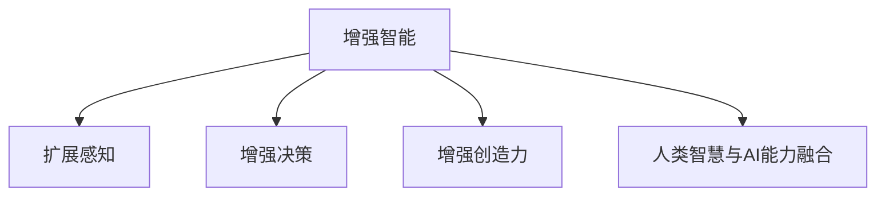

                 

## 1. 背景介绍

### 1.1 问题的提出
在人类历史的长河中，科技的每一次重大进步都深刻地改变了我们的生产和生活方式。从农耕文明的兴起，到工业革命的爆发，再到信息时代的到来，技术始终是人类社会前进的强大动力。然而，随着信息技术的飞速发展，人工智能(AI)技术逐渐崭露头角，引领了新一轮的科技革命。

人工智能，尤其是深度学习和自然语言处理(NLP)技术的突破，极大地提升了数据处理和信息理解的效率，为人类的智慧增长带来了新的机遇和挑战。机器不仅在计算和信息处理上超越了人类，甚至在一些特定领域展现出与人类不相上下的能力。例如，AlphaGo在围棋对弈中的胜利，不仅展示了AI的强大潜力，更引发了人类对智能机器能否全面超越人类的深刻思考。

### 1.2 问题核心关键点
人工智能与人类智慧的结合，主要体现在以下几个方面：
1. **增强智能**：利用AI技术提升人类智慧，使人类能够处理更多、更复杂的数据和信息。
2. **扩展感知**：通过AI感知技术，延伸人类的感官，拓展知觉范围。
3. **增强决策**：借助AI的深度学习、推理和预测能力，辅助人类进行科学决策。
4. **增强创造力**：AI在艺术、设计、文学等领域展现出一定的创造力，推动人类文化创新。

这些关键点共同构成了人类-AI协作的核心概念，即在智能增强的基础上，构建一个更加智能、高效、安全、可持续发展的未来社会。

## 2. 核心概念与联系

### 2.1 核心概念概述

为了更好地理解人类-AI协作的概念框架，我们将介绍几个密切相关的核心概念：

- **增强智能**：利用AI技术提升人类的智慧和认知能力，帮助人类处理大量复杂的信息，进行高效决策和创新。
- **扩展感知**：AI通过各种传感器和计算技术，拓展人类的感知范围，如机器视觉、语音识别、远程感知等，使人类能够更加全面地感知世界。
- **增强决策**：AI通过大数据分析和深度学习，提供预测、推理和优化决策支持，帮助人类在复杂环境中进行科学决策。
- **增强创造力**：AI在艺术创作、设计优化、文本生成等领域展现出一定的创造力，助力人类文化创新和科技发展。
- **人类智慧与AI能力融合**：通过将AI与人类智慧结合，构建协同工作、智能辅助的人机交互系统，推动技术进步和社会进步。

这些概念之间的逻辑关系可以通过以下Mermaid流程图来展示：



这个流程图展示了一个基本的人类-AI协作模型，其中每个环节都依赖于前一个环节，共同构成一个完整的协作系统。

## 3. 核心算法原理 & 具体操作步骤

### 3.1 算法原理概述

人类-AI协作的算法原理，主要涉及以下几个方面：

- **数据驱动**：通过大数据和AI算法，提取和分析信息，提升决策和创造能力。
- **知识驱动**：利用符号化知识库和推理系统，增强AI的逻辑推理能力。
- **协同优化**：结合人类的智慧和AI的算法，共同优化问题求解过程，提高系统整体效率。

### 3.2 算法步骤详解

1. **数据收集与预处理**：
   - 收集与协作任务相关的数据，如历史数据、传感器数据、用户反馈等。
   - 进行数据清洗、特征提取和预处理，确保数据的质量和可用性。

2. **算法模型构建**：
   - 选择合适的AI算法，如深度学习、强化学习、规则推理等。
   - 构建模型框架，设计模型结构，确定模型参数。

3. **协同优化**：
   - 将AI算法与人类智慧相结合，共同参与问题求解过程。
   - 利用人机交互界面，实时调整和优化算法模型。

4. **效果评估与迭代**：
   - 对协同系统进行效果评估，包括性能指标、用户满意度等。
   - 根据评估结果，进行模型迭代和优化，提升系统性能。

### 3.3 算法优缺点

人类-AI协作算法的优点在于：

- **协同高效**：结合人类的智慧和AI的算法，可以更高效地解决问题。
- **适应性强**：可以根据任务需求和数据特点，灵活调整算法和策略。
- **创新潜力大**：AI算法和人类智慧的结合，可以激发新的思维模式和创新路径。

但同时，该算法也存在一些局限性：

- **资源消耗大**：协同系统中，需要同时处理大量的数据和信息，对计算资源和存储空间要求较高。
- **数据隐私问题**：在协同过程中，可能涉及敏感数据的传输和存储，需注意数据隐私和安全。
- **人机交互复杂**：人机协作中，需要设计良好的人机交互界面，确保用户友好和便捷。

### 3.4 算法应用领域

人类-AI协作算法在多个领域得到了广泛应用：

- **医疗健康**：AI辅助诊断、个性化治疗、健康管理等。
- **金融科技**：智能投顾、风险预测、欺诈检测等。
- **智能制造**：生产过程优化、质量控制、设备维护等。
- **智慧城市**：交通管理、环境监测、智能安防等。
- **教育培训**：个性化学习、智能辅导、在线教育等。

## 4. 数学模型和公式 & 详细讲解 & 举例说明

### 4.1 数学模型构建

为了更好地理解人类-AI协作的算法原理，我们将引入一些数学模型进行详细讲解。

假设协作系统由N个参与者组成，其中A个是AI算法，B个是人类智慧，每个参与者都有自己特定的算法和知识库。设X为任务集合，Y为结果集合。

协作过程可以表示为一个多智能体系统，其中每个参与者都有自身的目标和策略，需要共同优化问题求解过程。设每个参与者的目标函数为$f_i$，则整个系统的目标函数为：

$$ f(X,Y) = \sum_{i=1}^N f_i(X,Y) $$

### 4.2 公式推导过程

为了方便推导，我们假设每个参与者的目标函数可以写成线性形式：

$$ f_i(X,Y) = a_i(X) + b_i(Y) $$

其中$a_i$和$b_i$分别表示参与者对输入和输出的影响权重。

系统目标函数可以表示为：

$$ f(X,Y) = \sum_{i=1}^N (a_i(X) + b_i(Y)) $$

简化后得到：

$$ f(X,Y) = \sum_{i=1}^N a_i(X) + \sum_{i=1}^N b_i(Y) $$

### 4.3 案例分析与讲解

以智能医疗为例，协作系统中包括医生、AI算法和患者。医生和AI算法都有各自的目标和策略，需要共同优化诊断和治疗过程。

- **医生目标**：诊断准确度高，治疗效果佳。
- **AI算法目标**：预测诊断结果准确度高，治疗方案合理。

设医生的目标函数为$f_d$，AI算法的目标函数为$f_a$，系统的总目标函数为$f_m$。通过人机协作，共同优化问题求解过程，使得系统的总目标函数最小化：

$$ f_m(X,Y) = f_d(X,Y) + f_a(X,Y) $$

具体而言，医生可以根据AI的预测结果，调整自己的诊断和治疗策略，从而提升系统的总目标函数。

## 5. 项目实践：代码实例和详细解释说明

### 5.1 开发环境搭建

为了进行人类-AI协作系统的开发，需要搭建相应的开发环境。以下是使用Python进行深度学习开发的环境配置流程：

1. 安装Anaconda：从官网下载并安装Anaconda，用于创建独立的Python环境。

2. 创建并激活虚拟环境：
```bash
conda create -n my_env python=3.8 
conda activate my_env
```

3. 安装必要的深度学习库：
```bash
pip install torch torchvision torchaudio
```

4. 安装TensorFlow和TensorBoard：
```bash
pip install tensorflow==2.6
pip install tensorboard
```

5. 安装PyTorch和相关工具：
```bash
pip install torch torchvision torchaudio
pip install tqdm sklearn pandas numpy
```

完成上述步骤后，即可在`my_env`环境中开始协作系统的开发。

### 5.2 源代码详细实现

以智能投顾系统为例，展示如何使用TensorFlow和Keras进行协作系统的开发。

```python
import tensorflow as tf
from tensorflow.keras import layers, models

# 定义模型结构
model = models.Sequential([
    layers.Dense(64, activation='relu', input_shape=(10,)),
    layers.Dense(1, activation='sigmoid')
])

# 编译模型
model.compile(optimizer='adam', loss='binary_crossentropy', metrics=['accuracy'])

# 训练模型
model.fit(X_train, y_train, epochs=10, batch_size=32)

# 评估模型
model.evaluate(X_test, y_test)

# 使用模型进行预测
predictions = model.predict(X_test)
```

以上代码展示了使用TensorFlow和Keras进行协作系统开发的流程。包括定义模型结构、编译模型、训练模型、评估模型和使用模型进行预测等步骤。

### 5.3 代码解读与分析

以下是关键代码的实现细节：

- `Sequential`模型：使用Keras的`Sequential`模型定义一个简单的多层神经网络，包括一个64个神经元的全连接层和一个输出层。
- `Dense`层：定义全连接层，使用ReLU激活函数和sigmoid激活函数。
- `compile`方法：编译模型，指定优化器为Adam，损失函数为二元交叉熵，评估指标为准确率。
- `fit`方法：训练模型，使用训练数据`X_train`和标签`y_train`，设置迭代轮数为10，批次大小为32。
- `evaluate`方法：评估模型，使用测试数据`X_test`和标签`y_test`，计算模型的损失和准确率。
- `predict`方法：使用模型进行预测，得到测试数据的预测结果。

## 6. 实际应用场景

### 6.1 智能医疗

智能医疗是人工智能与人类智慧结合的重要领域。AI算法可以辅助医生进行疾病诊断、治疗方案制定、患者管理等，提升医疗服务的质量和效率。

- **智能诊断**：AI算法通过分析患者症状、历史数据和医学文献，辅助医生进行疾病诊断，提供快速准确的诊断结果。
- **个性化治疗**：AI算法可以根据患者的基因信息、生活习惯和医疗记录，制定个性化治疗方案，提升治疗效果。
- **健康管理**：AI算法可以通过远程监测设备，实时监控患者的健康状况，提供个性化的健康建议和干预措施。

### 6.2 金融科技

金融科技是人工智能与人类智慧结合的另一重要领域。AI算法可以辅助金融机构进行风险预测、智能投顾、欺诈检测等，提升金融服务的质量和效率。

- **风险预测**：AI算法可以分析大量的金融数据，预测市场趋势和风险，帮助金融机构制定合理的投资策略。
- **智能投顾**：AI算法可以根据用户的历史交易数据和偏好，提供个性化的投资建议，优化投资组合。
- **欺诈检测**：AI算法可以实时监控交易行为，检测异常交易，防范金融欺诈。

### 6.3 智能制造

智能制造是人工智能与人类智慧结合的重要应用场景之一。AI算法可以辅助制造企业进行生产过程优化、质量控制、设备维护等，提升生产效率和产品质量。

- **生产过程优化**：AI算法可以通过分析生产数据，优化生产流程，提高生产效率。
- **质量控制**：AI算法可以通过图像识别和数据分析，实时监控产品质量，及时发现和修复缺陷。
- **设备维护**：AI算法可以通过预测性维护，减少设备故障率，延长设备使用寿命。

### 6.4 未来应用展望

随着人工智能技术的不断进步，人类-AI协作将在更多领域得到应用，为社会进步和经济发展带来新的动力。

- **智慧城市**：AI算法可以辅助城市管理，优化交通、环保、安防等系统，提升城市运行效率和居民生活质量。
- **教育培训**：AI算法可以提供个性化的学习推荐和智能辅导，提升教育质量和学习效率。
- **文化创新**：AI算法可以在艺术创作、设计优化、文学生成等领域展现出创新潜力，推动文化创新和产业发展。

## 7. 工具和资源推荐

### 7.1 学习资源推荐

为了帮助开发者系统掌握人工智能与人类智慧结合的理论基础和实践技巧，这里推荐一些优质的学习资源：

1. **《深度学习》课程**：由斯坦福大学开设，介绍了深度学习的理论基础和实践技术，包括神经网络、卷积神经网络、循环神经网络等。
2. **《机器学习实战》书籍**：通过大量实例，介绍了机器学习的基本原理和实现方法，适合初学者入门。
3. **《人工智能伦理》课程**：介绍了人工智能伦理的基本概念和伦理挑战，帮助开发者理解人工智能的应用和风险。
4. **Google AI课程**：由Google提供的在线课程，涵盖了机器学习、深度学习、自然语言处理等前沿技术，适合进阶学习。
5. **Kaggle竞赛**：通过参加Kaggle竞赛，可以积累实战经验，提升数据处理和模型优化能力。

通过这些资源的学习实践，相信你一定能够全面掌握人工智能与人类智慧结合的技术框架和应用场景。

### 7.2 开发工具推荐

高效的开发离不开优秀的工具支持。以下是几款用于人工智能与人类智慧结合开发的工具：

1. **PyTorch**：基于Python的开源深度学习框架，灵活高效的计算图，适合快速迭代研究。
2. **TensorFlow**：由Google主导开发的开源深度学习框架，生产部署方便，适合大规模工程应用。
3. **Keras**：高层次的神经网络API，支持多种后端框架，易于上手和调试。
4. **Scikit-learn**：Python数据科学库，提供多种机器学习算法和工具，适合快速原型开发。
5. **TensorBoard**：TensorFlow配套的可视化工具，实时监测模型训练状态，提供丰富的图表呈现方式。

这些工具可以显著提升人工智能与人类智慧结合开发的工作效率，加速技术的创新迭代。

### 7.3 相关论文推荐

人工智能与人类智慧结合的研究源于学界的持续探索。以下是几篇奠基性的相关论文，推荐阅读：

1. **《深度学习》论文**：Yann LeCun等著，介绍了深度学习的基本原理和应用场景，为人工智能技术奠定了基础。
2. **《AlphaGo论文》**：David Silver等著，展示了AI在围棋对弈中的胜利，揭示了深度强化学习的潜力。
3. **《机器学习：理论与算法》论文**：Tom Mitchell著，介绍了机器学习的基本概念和算法，为人工智能技术提供了理论基础。
4. **《GPT-3论文》**：OpenAI团队发布，展示了GPT-3模型在语言生成、推理、翻译等方面的卓越性能。
5. **《TensorFlow论文》**：Jeff Dean等著，介绍了TensorFlow框架的设计理念和实现方法，为深度学习提供了计算平台。

这些论文代表了大规模人工智能与人类智慧结合技术的发展脉络。通过学习这些前沿成果，可以帮助研究者把握学科前进方向，激发更多的创新灵感。

## 8. 总结：未来发展趋势与挑战

### 8.1 总结

本文对人工智能与人类智慧结合的协作模型进行了全面系统的介绍。首先阐述了协作模型的工作原理和核心概念，明确了协作模型在智能增强、扩展感知、增强决策和增强创造力方面的重要价值。其次，从原理到实践，详细讲解了协作模型的数学模型构建和公式推导过程，给出了协作系统开发的完整代码实例。同时，本文还广泛探讨了协作模型在医疗、金融、制造、智慧城市等众多行业领域的应用前景，展示了协作模型在构建智能未来中的巨大潜力。

通过本文的系统梳理，可以看到，人工智能与人类智慧的结合，正在成为推动技术进步和社会发展的强大力量。未来，伴随技术的不断进步和应用场景的不断扩展，这种协作模型必将在更多领域大放异彩。

### 8.2 未来发展趋势

展望未来，人工智能与人类智慧结合的协作模型将呈现以下几个发展趋势：

1. **智能化水平提升**：随着技术的发展，协作系统的智能化水平将进一步提升，能够处理更加复杂和多样化的任务。
2. **系统鲁棒性增强**：协作系统将在面对各种异常和干扰时，具备更强的鲁棒性和适应性，保障系统的稳定性和可靠性。
3. **人机协同优化**：人机协作将更加智能和高效，能够协同优化问题求解过程，提升系统的整体性能。
4. **跨领域应用拓展**：协作模型将在更多领域得到应用，推动技术进步和社会发展。

### 8.3 面临的挑战

尽管人工智能与人类智慧结合的协作模型已经取得了瞩目成就，但在迈向更加智能化、普适化应用的过程中，它仍面临诸多挑战：

1. **数据质量问题**：协作系统的训练和优化依赖大量高质量数据，但数据收集和处理往往存在质量问题。
2. **隐私和安全问题**：协作过程中涉及大量敏感数据，需要关注数据隐私和系统安全。
3. **人机交互复杂性**：协作系统需要设计良好的人机交互界面，确保用户友好和便捷。
4. **算法透明性**：协作系统的决策过程缺乏透明性，难以解释和调试。

### 8.4 研究展望

面对协作模型面临的挑战，未来的研究需要在以下几个方面寻求新的突破：

1. **数据增强技术**：引入数据增强技术，提升数据质量和系统鲁棒性。
2. **隐私保护技术**：开发隐私保护技术，确保数据安全和用户隐私。
3. **人机协同算法**：研究人机协同算法，提高协作系统的智能水平和协同效率。
4. **透明化技术**：开发透明化技术，提升系统的可解释性和可信任性。

这些研究方向将推动人工智能与人类智慧结合的协作模型向更高的台阶发展，构建更加智能、高效、安全、可持续发展的未来社会。

## 9. 附录：常见问题与解答

**Q1：人工智能与人类智慧结合的意义是什么？**

A: 人工智能与人类智慧结合，可以发挥各自优势，互补不足，提升整体系统性能。AI擅长处理大量数据和信息，快速高效地进行决策和创新；人类智慧具有丰富的经验、情感和逻辑推理能力，能够进行科学决策和创新。

**Q2：如何优化人工智能与人类智慧结合的系统？**

A: 优化人工智能与人类智慧结合的系统需要考虑多个方面：
1. **数据质量**：确保数据的高质量和多样性，提升系统的鲁棒性。
2. **算法优化**：选择合适的算法和模型，优化参数设置，提升系统的智能水平。
3. **人机交互**：设计良好的人机交互界面，确保用户友好和便捷。
4. **系统透明性**：提升系统的可解释性和可信任性，确保决策过程透明。

**Q3：人工智能与人类智慧结合的系统面临哪些挑战？**

A: 人工智能与人类智慧结合的系统面临以下挑战：
1. **数据质量问题**：数据收集和处理存在质量问题，影响系统的性能。
2. **隐私和安全问题**：系统涉及大量敏感数据，需要关注数据隐私和系统安全。
3. **人机交互复杂性**：系统需要设计良好的人机交互界面，确保用户友好和便捷。
4. **算法透明性**：系统决策过程缺乏透明性，难以解释和调试。

**Q4：人工智能与人类智慧结合的未来发展方向是什么？**

A: 人工智能与人类智慧结合的未来发展方向包括：
1. **智能化水平提升**：系统智能化水平将进一步提升，能够处理更加复杂和多样化的任务。
2. **系统鲁棒性增强**：系统将在面对各种异常和干扰时，具备更强的鲁棒性和适应性。
3. **人机协同优化**：人机协作将更加智能和高效，能够协同优化问题求解过程。
4. **跨领域应用拓展**：协作模型将在更多领域得到应用，推动技术进步和社会发展。

**Q5：如何实现人工智能与人类智慧的协同优化？**

A: 实现人工智能与人类智慧的协同优化需要考虑多个方面：
1. **数据共享和融合**：共享和融合多种数据源，提升系统的综合能力。
2. **算法协同**：设计协同算法，使AI算法和人类智慧能够共同参与问题求解过程。
3. **协同界面设计**：设计良好的协同界面，确保人机协同的效率和效果。

通过这些方法的实施，可以实现更加智能、高效、安全、可持续的人工智能与人类智慧结合系统，推动技术进步和社会发展。

---

作者：禅与计算机程序设计艺术 / Zen and the Art of Computer Programming

