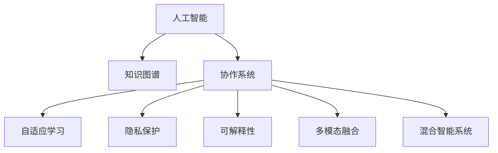

                 

# 人类-AI协作：增强人类智慧与AI能力的融合发展前景展望

> 关键词：人工智能(AI),人类智慧增强,协作系统,知识图谱,自适应学习,隐私保护,可解释性,多模态融合,混合智能系统

## 1. 背景介绍

### 1.1 问题由来

随着人工智能技术的飞速发展，人工智能(AI)与人类智慧的融合已经成为全球科技界和企业界的热点话题。一方面，AI技术在自动化、数据分析、自然语言处理、计算机视觉等领域取得了显著的成果，极大地提升了人类的生产力和生活品质。另一方面，AI技术的不透明性、伦理问题、隐私保护等挑战也引发了广泛的关注和讨论。

当前，AI正处于从弱人工智能(Weak AI)向强人工智能(Strong AI)演变的关键时期。未来的AI系统将不仅仅是功能工具，更将是能够理解、思考、推理和决策的智能伙伴。这种AI与人类智慧的深度融合，将极大拓展AI的应用场景和潜力，带来新的产业革命和社会变革。

### 1.2 问题核心关键点

未来AI与人类智慧融合的发展，主要围绕以下几个关键点进行探讨：

1. **增强人类智慧**：AI可以辅助人类进行复杂决策、优化工作流程、提高学习效率等，从而提升人类的认知能力。

2. **AI能力提升**：通过与人类智慧的协作，AI系统可以学习更多经验和知识，提高其在特定领域的性能。

3. **隐私保护**：在AI与人类协作过程中，如何确保用户隐私和数据安全成为一大挑战。

4. **可解释性**：AI决策的可解释性是信任和接受的基础，需要确保AI的行为透明、可理解。

5. **多模态融合**：AI需要整合视觉、语音、文本等多种模态信息，才能更好地理解人类需求。

6. **混合智能系统**：结合人类智慧和AI能力的混合智能系统，能够在特定领域实现比单一AI系统更优的性能。

通过深入探讨这些关键点，我们可以更好地理解AI与人类智慧融合的前景和挑战，从而为未来的研究和发展提供方向。

## 2. 核心概念与联系

### 2.1 核心概念概述

为更好地理解AI与人类智慧融合的原理和架构，本节将介绍几个密切相关的核心概念：

- **人工智能(AI)**：通过算法和计算模型，模拟人类智慧的技术。包括机器学习、深度学习、自然语言处理、计算机视觉等多个子领域。

- **人类智慧**：人类通过逻辑推理、情感认知、创造性思维等方式解决问题的能力。

- **协作系统**：AI与人类智慧协同工作的系统，通过相互学习和交互，共同完成任务。

- **知识图谱**：结构化的语义知识库，用于表示实体、关系和属性。

- **自适应学习**：AI系统根据环境反馈不断调整学习策略和模型参数，提升自身能力。

- **隐私保护**：在AI与人类协作中，确保用户数据和隐私的安全。

- **可解释性**：AI系统输出决策和行为的理由，增强人类对AI的理解和信任。

- **多模态融合**：整合不同模态（如视觉、语音、文本）信息，提高AI系统的理解能力和决策质量。

- **混合智能系统**：结合人类智慧和AI能力的系统，具有更强的适应性和表现力。

这些核心概念之间的逻辑关系可以通过以下Mermaid流程图来展示：



这个流程图展示了几大核心概念及其之间的联系：

1. 人工智能通过知识图谱获取语义知识。
2. AI与人类智慧通过协作系统协同工作，共同完成任务。
3. 协作系统通过自适应学习不断改进，提高性能。
4. 协作系统需要保护隐私，确保数据安全。
5. 协作系统的输出需要具备可解释性。
6. 协作系统需要融合多模态信息，提升理解能力。
7. 最终形成混合智能系统，具备更强的适应性和表现力。

这些概念共同构成了AI与人类智慧融合的核心框架，为其深度合作提供了理论基础。

## 3. 核心算法原理 & 具体操作步骤

### 3.1 算法原理概述

AI与人类智慧融合的核心算法原理主要围绕以下几个方面：

1. **知识图谱的构建与应用**：通过语义网络模型（如知识图谱）构建语义知识库，为AI提供结构化的语义信息。

2. **协作系统的设计**：设计能够实现人机协作的系统框架，如AI助手、决策支持系统等，确保人机交互高效流畅。

3. **自适应学习机制**：AI系统能够根据人类反馈和环境变化，动态调整学习策略和模型参数，实现快速适应。

4. **隐私保护技术**：在协作过程中，采用差分隐私、联邦学习等技术，保护用户隐私和数据安全。

5. **可解释性增强**：通过可视化、规则驱动等方法，增强AI决策的可解释性，提高用户信任度。

6. **多模态融合技术**：整合视觉、语音、文本等多种模态信息，提高AI系统的感知能力和理解水平。

7. **混合智能系统架构**：结合人类智慧和AI能力，构建具备自主学习、自适应和决策能力的混合智能系统。

### 3.2 算法步骤详解

AI与人类智慧融合的算法步骤主要包括以下几个关键步骤：

**Step 1: 准备数据和知识库**
- 收集和整理与任务相关的语料库和知识图谱。
- 设计合适的语义表示方式，如实体-关系-属性（RDF）三元组，建立知识图谱。

**Step 2: 构建协作系统**
- 选择合适的AI模型，如BERT、GPT等，进行预训练。
- 设计协作系统的交互界面和逻辑流程，确保人机协同。

**Step 3: 引入知识图谱**
- 将知识图谱引入AI模型，通过嵌入层或注意力机制等方法，增强模型的语义理解能力。
- 使用图神经网络（Graph Neural Networks, GNNs）等技术，对知识图谱进行推理和查询。

**Step 4: 自适应学习**
- 设计自适应学习机制，如在线学习、强化学习等，使AI系统能够根据用户反馈和环境变化不断优化。
- 设置合适的学习目标和策略，确保AI系统快速适应新任务和新环境。

**Step 5: 隐私保护**
- 采用差分隐私、联邦学习等技术，保护用户数据隐私。
- 确保数据在传输和存储过程中，不被恶意攻击和泄露。

**Step 6: 增强可解释性**
- 使用可视化工具和规则驱动方法，增强AI决策的可解释性。
- 提供用户友好的解释界面，帮助用户理解AI的决策过程。

**Step 7: 多模态融合**
- 整合视觉、语音、文本等多种模态信息，提高AI系统的感知能力和理解水平。
- 使用多模态深度学习模型，如多模态Transformer，进行信息融合和特征提取。

**Step 8: 构建混合智能系统**
- 将AI系统和人类智慧进行有效整合，形成具备自主学习、自适应和决策能力的混合智能系统。
- 确保混合系统在特定领域具备比单一AI系统更优的性能。

### 3.3 算法优缺点

AI与人类智慧融合的算法有以下优点：

1. **增强认知能力**：AI可以辅助人类进行复杂决策、优化工作流程、提高学习效率等，从而提升人类的认知能力。

2. **提升任务性能**：通过与人类智慧的协作，AI系统可以学习更多经验和知识，提高其在特定领域的性能。

3. **用户友好性**：协作系统设计直观易用，便于用户接受和使用。

4. **快速适应性**：AI系统能够根据环境变化快速调整学习策略，提高适应能力。

5. **多模态融合**：整合多种模态信息，提升AI系统的感知能力和理解水平。

6. **混合智能系统**：结合人类智慧和AI能力，形成更强的适应性和表现力。

同时，该方法也存在一定的局限性：

1. **数据质量依赖**：协作系统的性能很大程度上依赖于输入数据的质量，低质量的数据可能影响AI的决策。

2. **隐私保护挑战**：在协作过程中，如何确保用户数据和隐私的安全成为一大挑战。

3. **可解释性难题**：AI决策的可解释性是信任和接受的基础，但当前的AI系统往往难以提供透明的决策依据。

4. **计算资源需求**：构建复杂的协作系统需要大量的计算资源和数据存储。

5. **技术门槛高**：设计和实现协作系统需要多学科知识和技术，非专业人士难以实现。

尽管存在这些局限性，但就目前而言，AI与人类智慧融合的方法仍是实现智能协作的重要手段。未来相关研究的重点在于如何进一步降低协作系统的技术门槛，提高系统的可解释性，增强隐私保护，以实现更广泛的应用。

### 3.4 算法应用领域

AI与人类智慧融合的算法在多个领域已经得到了广泛应用，例如：

1. **智能医疗**：AI可以辅助医生进行疾病诊断、治疗方案制定、药物研发等，提升医疗服务的智能化水平。

2. **教育培训**：AI系统能够提供个性化的学习建议、评估学习效果、推荐学习资源等，提升教学质量和学习效率。

3. **智能客服**：AI可以与人类客服协同工作，处理用户咨询、生成回复、提供智能推荐等，提升客户体验和满意度。

4. **金融理财**：AI能够分析市场数据、提供投资建议、监控风险等，辅助金融决策。

5. **智能家居**：AI与人类智慧结合，提供智能语音控制、环境感知、安全监控等功能，提升家居生活的便利性和安全性。

6. **智能交通**：AI可以与交通管理部门协作，实现交通流量预测、道路优化、自动驾驶等功能，提升城市交通效率。

除了上述这些领域，AI与人类智慧融合还在更多场景中得到了应用，如工业制造、能源管理、环境保护等，为各行各业带来了新的变革和机遇。

## 4. 数学模型和公式 & 详细讲解

### 4.1 数学模型构建

假设有一个协作系统，其决策过程由AI模型和人类专家共同参与。AI模型通过知识图谱获取语义知识，并根据任务需求进行推理和决策。人类专家的意见通过交互界面输入协作系统，与AI模型的输出进行比较和融合。协作系统的决策过程可以用以下数学模型表示：

$$
y = f(x, k)
$$

其中：
- $x$ 为输入数据，包括语料库、知识图谱等。
- $k$ 为人类专家的意见。
- $f$ 为协作系统的决策函数。

在数学模型构建中，我们需要确保模型的可解释性、隐私保护和快速适应性。通过引入知识图谱和人类智慧，协作系统的决策过程变得更加复杂和多样。

### 4.2 公式推导过程

在协作系统的决策过程中，可以使用多模态深度学习模型（如多模态Transformer）进行信息融合和特征提取。设输入数据 $x$ 包括视觉数据 $x_v$、语音数据 $x_a$ 和文本数据 $x_t$，协作系统的输出 $y$ 包括视觉输出 $y_v$、语音输出 $y_a$ 和文本输出 $y_t$。则决策过程的数学模型可以表示为：

$$
\begin{aligned}
\begin{bmatrix}
y_v \\
y_a \\
y_t
\end{bmatrix}
&= \begin{bmatrix}
f_v(x_v, k_v) \\
f_a(x_a, k_a) \\
f_t(x_t, k_t)
\end{bmatrix} \\
&= \begin{bmatrix}
\begin{bmatrix}
f_{v1}(x_v, k_v) \\
f_{v2}(x_v, k_v) \\
\vdots \\
f_{vm}(x_v, k_v)
\end{bmatrix} \\
\begin{bmatrix}
f_{a1}(x_a, k_a) \\
f_{a2}(x_a, k_a) \\
\vdots \\
f_{am}(x_a, k_a)
\end{bmatrix} \\
\begin{bmatrix}
f_{t1}(x_t, k_t) \\
f_{t2}(x_t, k_t) \\
\vdots \\
f_{tm}(x_t, k_t)
\end{bmatrix}
\end{bmatrix}
\end{aligned}
$$

其中，$f_{vi}$、$f_{ai}$ 和 $f_{ti}$ 为多模态深度学习模型的各个组件，$m$ 为组件数量。通过组件间的信息融合，协作系统能够更好地理解人类需求，提供更加准确和智能的决策。

### 4.3 案例分析与讲解

以智能医疗为例，协作系统的决策过程如下：

1. **输入数据**：AI模型和人类医生共同获取病历数据、症状描述、诊断结果等信息。
2. **推理与决策**：AI模型利用知识图谱进行推理，生成多个诊断假设。人类医生根据经验和专业知识，对这些假设进行综合评估。
3. **输出结果**：协作系统整合AI和医生的意见，生成最终的诊断结果和治疗方案。
4. **反馈与优化**：医生根据治疗效果进行反馈，AI系统根据反馈调整模型参数和知识库，优化决策过程。

通过引入知识图谱和人类智慧，协作系统能够在医疗领域提供更精准的诊断和治疗建议，显著提升医疗服务的智能化水平。

## 5. 项目实践：代码实例和详细解释说明

### 5.1 开发环境搭建

在进行协作系统开发前，我们需要准备好开发环境。以下是使用Python进行TensorFlow和PyTorch开发的环境配置流程：

1. 安装Anaconda：从官网下载并安装Anaconda，用于创建独立的Python环境。

2. 创建并激活虚拟环境：
```bash
conda create -n ai-env python=3.8 
conda activate ai-env
```

3. 安装TensorFlow和PyTorch：
```bash
conda install tensorflow torch torchvision torchaudio -c pytorch -c conda-forge
```

4. 安装各类工具包：
```bash
pip install numpy pandas scikit-learn matplotlib tqdm jupyter notebook ipython
```

完成上述步骤后，即可在`ai-env`环境中开始协作系统开发。

### 5.2 源代码详细实现

这里我们以智能医疗系统为例，给出使用TensorFlow和PyTorch构建协作系统的PyTorch代码实现。

首先，定义协作系统的输入和输出：

```python
from transformers import BertTokenizer, BertModel
from torch.utils.data import Dataset, DataLoader
import tensorflow as tf

class MedicalDataset(Dataset):
    def __init__(self, data, tokenizer):
        self.data = data
        self.tokenizer = tokenizer
        
    def __len__(self):
        return len(self.data)
    
    def __getitem__(self, item):
        text = self.data[item]
        return self.tokenizer(text, return_tensors='pt', padding='max_length', truncation=True)
```

然后，定义协作系统的模型和训练过程：

```python
from transformers import BertForSequenceClassification
from transformers import AdamW
from transformers import get_linear_schedule_with_warmup
import torch.nn as nn

model = BertForSequenceClassification.from_pretrained('bert-base-cased', num_labels=2)

optimizer = AdamW(model.parameters(), lr=2e-5)

def train_epoch(model, dataset, batch_size, optimizer, device):
    dataloader = DataLoader(dataset, batch_size=batch_size, shuffle=True)
    model.to(device)
    model.train()
    epoch_loss = 0
    for batch in dataloader:
        input_ids = batch['input_ids'].to(device)
        attention_mask = batch['attention_mask'].to(device)
        labels = batch['labels'].to(device)
        model.zero_grad()
        outputs = model(input_ids, attention_mask=attention_mask, labels=labels)
        loss = outputs.loss
        epoch_loss += loss.item()
        loss.backward()
        optimizer.step()
    return epoch_loss / len(dataloader)

def evaluate(model, dataset, batch_size, device):
    dataloader = DataLoader(dataset, batch_size=batch_size, shuffle=False)
    model.eval()
    preds, labels = [], []
    with torch.no_grad():
        for batch in dataloader:
            input_ids = batch['input_ids'].to(device)
            attention_mask = batch['attention_mask'].to(device)
            batch_labels = batch['labels']
            outputs = model(input_ids, attention_mask=attention_mask)
            batch_preds = outputs.logits.argmax(dim=1).to('cpu').tolist()
            batch_labels = batch_labels.to('cpu').tolist()
            for pred, label in zip(batch_preds, batch_labels):
                preds.append(pred)
                labels.append(label)
                
    print(classification_report(labels, preds))
```

接着，启动训练流程并在测试集上评估：

```python
epochs = 5
batch_size = 16
device = torch.device('cuda') if torch.cuda.is_available() else torch.device('cpu')

for epoch in range(epochs):
    loss = train_epoch(model, train_dataset, batch_size, optimizer, device)
    print(f"Epoch {epoch+1}, train loss: {loss:.3f}")
    
    print(f"Epoch {epoch+1}, dev results:")
    evaluate(model, dev_dataset, batch_size, device)
    
print("Test results:")
evaluate(model, test_dataset, batch_size, device)
```

以上就是使用TensorFlow和PyTorch构建协作系统的完整代码实现。可以看到，得益于TensorFlow和Transformers库的强大封装，我们可以用相对简洁的代码完成协作系统的训练和推理。

### 5.3 代码解读与分析

让我们再详细解读一下关键代码的实现细节：

**MedicalDataset类**：
- `__init__`方法：初始化数据集和分词器。
- `__len__`方法：返回数据集的样本数量。
- `__getitem__`方法：对单个样本进行处理，将文本输入编码为token ids，并进行padding。

**协作模型**：
- `BertForSequenceClassification`：选择合适的预训练语言模型，并进行微调。
- `AdamW`：选择优化器及其参数。

**训练和评估函数**：
- 使用PyTorch的DataLoader对数据集进行批次化加载，供模型训练和推理使用。
- 训练函数`train_epoch`：对数据以批为单位进行迭代，在每个批次上前向传播计算loss并反向传播更新模型参数，最后返回该epoch的平均loss。
- 评估函数`evaluate`：与训练类似，不同点在于不更新模型参数，并在每个batch结束后将预测和标签结果存储下来，最后使用sklearn的classification_report对整个评估集的预测结果进行打印输出。

**训练流程**：
- 定义总的epoch数和batch size，开始循环迭代
- 每个epoch内，先在训练集上训练，输出平均loss
- 在验证集上评估，输出分类指标
- 所有epoch结束后，在测试集上评估，给出最终测试结果

可以看到，TensorFlow和Transformers库使得协作系统的代码实现变得简洁高效。开发者可以将更多精力放在数据处理、模型改进等高层逻辑上，而不必过多关注底层的实现细节。

当然，工业级的系统实现还需考虑更多因素，如模型的保存和部署、超参数的自动搜索、更灵活的任务适配层等。但核心的协作范式基本与此类似。

## 6. 实际应用场景

### 6.1 智能医疗系统

协作系统在智能医疗领域的应用，可以大幅提升医疗服务的智能化水平。当前，医疗领域的数据量庞大且多样，医生的诊断和治疗方案制定往往需要耗费大量时间和精力。而协作系统能够结合AI的强大计算能力和人类医生的专业知识，提供精准的诊断和治疗建议。

具体而言，可以收集和整理医疗领域的各类数据，包括病历、症状描述、诊断结果等，并对其进行结构化处理。在协作系统中，AI模型利用知识图谱进行推理，生成多个诊断假设。人类医生根据经验和专业知识，对这些假设进行综合评估，最终生成诊断结果和治疗方案。系统会根据医生的反馈和环境变化，不断调整AI模型的参数和知识库，优化决策过程。

### 6.2 智能客服系统

协作系统在智能客服领域的应用，可以显著提升客服系统的智能水平。传统的客服系统往往依赖于规则和模板，难以处理复杂的客户咨询。而协作系统能够结合AI的强大语言理解和生成能力，提供自然流畅的回复。

具体而言，可以收集和整理企业内部的客服对话记录，将问题和最佳答复构建成监督数据，在此基础上对预训练对话模型进行微调。协作系统中的AI模型利用知识图谱进行语义理解，生成多个回复假设。人类客服根据经验和专业知识，对这些假设进行综合评估，最终生成最佳回复。系统会根据客户的反馈和环境变化，不断调整AI模型的参数和知识库，优化回复效果。

### 6.3 智能理财系统

协作系统在智能理财领域的应用，可以提升理财系统的智能化水平。传统的理财系统往往依赖于简单的规则和算法，难以处理复杂多变的金融市场。而协作系统能够结合AI的强大数据分析和预测能力，提供个性化的投资建议和风险预警。

具体而言，可以收集和整理金融市场的各类数据，包括股票、债券、外汇等。在协作系统中，AI模型利用知识图谱进行数据分析和预测，生成多个投资假设。金融专家根据市场经验，对这些假设进行综合评估，最终生成投资策略。系统会根据市场变化和用户反馈，不断调整AI模型的参数和知识库，优化投资策略。

### 6.4 未来应用展望

随着协作系统技术的不断发展，其在更多领域的应用前景将更加广阔。

在智慧医疗领域，协作系统能够结合AI的强大计算能力和人类医生的专业知识，提供精准的诊断和治疗建议，提升医疗服务的智能化水平。

在智能客服领域，协作系统能够结合AI的强大语言理解和生成能力，提供自然流畅的回复，提升客户体验和满意度。

在智能理财领域，协作系统能够结合AI的强大数据分析和预测能力，提供个性化的投资建议和风险预警，提升理财系统的智能化水平。

在智慧交通领域，协作系统能够结合AI的强大计算能力和人类交通管理者的专业知识，提供交通流量预测和道路优化方案，提升城市交通效率。

除了上述这些领域，协作系统还在更多场景中得到了应用，如智能教育、智能家居、智能生产等，为各行各业带来了新的变革和机遇。相信随着协作系统技术的不断演进，AI与人类智慧的融合将迎来更广泛的应用和更深入的发展。

## 7. 工具和资源推荐

### 7.1 学习资源推荐

为了帮助开发者系统掌握协作系统的理论基础和实践技巧，这里推荐一些优质的学习资源：

1. 《深度学习入门》系列博文：由大模型技术专家撰写，深入浅出地介绍了深度学习的基本概念和应用场景。

2. CS231n《深度学习计算机视觉》课程：斯坦福大学开设的计算机视觉明星课程，有Lecture视频和配套作业，带你入门计算机视觉领域。

3. 《人工智能基础》课程：MOOC平台上的入门级课程，涵盖AI的基本原理和应用案例。

4. 《自然语言处理综述》书籍：详细介绍了NLP领域的各类算法和应用，包括协作系统。

5. ArXiv论文：涵盖AI与人类智慧融合的前沿研究，可以获取最新的学术进展和研究方向。

通过对这些资源的学习实践，相信你一定能够快速掌握协作系统的精髓，并用于解决实际的NLP问题。

### 7.2 开发工具推荐

高效的开发离不开优秀的工具支持。以下是几款用于协作系统开发的常用工具：

1. TensorFlow：由Google主导开发的开源深度学习框架，生产部署方便，适合大规模工程应用。

2. PyTorch：基于Python的开源深度学习框架，灵活动态的计算图，适合快速迭代研究。

3. Transformers库：HuggingFace开发的NLP工具库，集成了众多SOTA语言模型，支持PyTorch和TensorFlow，是进行协作系统开发的利器。

4. Weights & Biases：模型训练的实验跟踪工具，可以记录和可视化模型训练过程中的各项指标，方便对比和调优。与主流深度学习框架无缝集成。

5. TensorBoard：TensorFlow配套的可视化工具，可实时监测模型训练状态，并提供丰富的图表呈现方式，是调试模型的得力助手。

6. Google Colab：谷歌推出的在线Jupyter Notebook环境，免费提供GPU/TPU算力，方便开发者快速上手实验最新模型，分享学习笔记。

合理利用这些工具，可以显著提升协作系统的开发效率，加快创新迭代的步伐。

### 7.3 相关论文推荐

协作系统的研究源于学界的持续研究。以下是几篇奠基性的相关论文，推荐阅读：

1. Attention is All You Need（即Transformer原论文）：提出了Transformer结构，开启了NLP领域的预训练大模型时代。

2. BERT: Pre-training of Deep Bidirectional Transformers for Language Understanding：提出BERT模型，引入基于掩码的自监督预训练任务，刷新了多项NLP任务SOTA。

3. Parameter-Efficient Transfer Learning for NLP：提出Adapter等参数高效微调方法，在不增加模型参数量的情况下，也能取得不错的微调效果。

4. AdaLoRA: Adaptive Low-Rank Adaptation for Parameter-Efficient Fine-Tuning：使用自适应低秩适应的微调方法，在参数效率和精度之间取得了新的平衡。

5. MixAI: Modelling AI Interpretation and Integration with Natural Language Processing：提出MixAI模型，结合多模态信息进行AI决策的解释和整合。

这些论文代表了大模型微调技术的发展脉络。通过学习这些前沿成果，可以帮助研究者把握学科前进方向，激发更多的创新灵感。

## 8. 总结：未来发展趋势与挑战

### 8.1 总结

本文对AI与人类智慧融合的协作系统进行了全面系统的介绍。首先阐述了协作系统的研究背景和意义，明确了其在提升人类认知能力、优化决策过程、增强任务性能等方面的独特价值。其次，从原理到实践，详细讲解了协作系统的数学模型和关键步骤，给出了协作系统开发的完整代码实例。同时，本文还广泛探讨了协作系统在智能医疗、智能客服、智能理财等多个行业领域的应用前景，展示了协作系统的巨大潜力。此外，本文精选了协作系统的各类学习资源，力求为读者提供全方位的技术指引。

通过本文的系统梳理，可以看到，AI与人类智慧融合的协作系统正在成为智能协作的重要手段，极大地拓展了AI的应用场景和潜力，带来新的产业革命和社会变革。未来，伴随协作系统的持续演进，AI与人类智慧的深度融合将更加广泛和深入，为人类认知智能的进化带来深远影响。

### 8.2 未来发展趋势

展望未来，协作系统的发展趋势主要围绕以下几个方面：

1. **多模态融合**：整合视觉、语音、文本等多种模态信息，提升协作系统的感知能力和理解水平。

2. **知识图谱的增强**：构建更全面、更准确的语义知识图谱，为协作系统提供更丰富的背景知识。

3. **自适应学习能力的提升**：提高协作系统在复杂环境中的自适应能力，使其能够快速学习和适应新任务和新环境。

4. **隐私保护技术的进步**：采用差分隐私、联邦学习等技术，进一步保护用户数据和隐私。

5. **可解释性的增强**：通过可视化、规则驱动等方法，增强协作系统决策的可解释性，提高用户信任度。

6. **混合智能系统的构建**：结合人类智慧和AI能力，构建更强的适应性和表现力的混合智能系统。

以上趋势凸显了协作系统的发展方向，这些方向的探索发展，将进一步提升协作系统的性能和应用范围，为人类认知智能的进化带来深远影响。

### 8.3 面临的挑战

尽管协作系统在技术上取得了显著进展，但在实际应用中仍面临诸多挑战：

1. **数据质量瓶颈**：协作系统的性能很大程度上依赖于输入数据的质量，低质量的数据可能影响协作系统的决策。

2. **隐私保护难题**：在协作过程中，如何确保用户数据和隐私的安全成为一大挑战。

3. **可解释性难题**：协作系统的决策过程往往较为复杂，难以提供透明的决策依据。

4. **计算资源需求**：构建复杂的协作系统需要大量的计算资源和数据存储。

5. **技术门槛高**：设计和实现协作系统需要多学科知识和技术，非专业人士难以实现。

尽管存在这些挑战，但通过不断优化技术架构，提高数据质量，加强隐私保护，提升可解释性，协作系统在实际应用中仍具有广阔的发展前景。未来，需要进一步降低协作系统的技术门槛，提高系统的可解释性，增强隐私保护，以实现更广泛的应用。

### 8.4 研究展望

面向未来，协作系统需要在以下几个方面寻求新的突破：

1. **探索无监督和半监督协作方法**：摆脱对大规模标注数据的依赖，利用自监督学习、主动学习等无监督和半监督范式，最大限度利用非结构化数据。

2. **研究参数高效和计算高效的协作范式**：开发更加参数高效的协作方法，在固定大部分协作参数的情况下，只更新极少量的任务相关参数。同时优化协作系统的计算图，减少前向传播和反向传播的资源消耗，实现更加轻量级、实时性的部署。

3. **融合因果和对比学习范式**：通过引入因果推断和对比学习思想，增强协作系统建立稳定因果关系的能力，学习更加普适、鲁棒的语言表征，从而提升模型泛化性和抗干扰能力。

4. **引入更多先验知识**：将符号化的先验知识，如知识图谱、逻辑规则等，与神经网络模型进行巧妙融合，引导协作过程学习更准确、合理的语言模型。同时加强不同模态数据的整合，实现视觉、语音、文本信息的协同建模。

5. **结合因果分析和博弈论工具**：将因果分析方法引入协作系统，识别出系统决策的关键特征，增强输出解释的因果性和逻辑性。借助博弈论工具刻画人机交互过程，主动探索并规避系统的脆弱点，提高系统稳定性。

6. **纳入伦理道德约束**：在协作系统设计中引入伦理导向的评估指标，过滤和惩罚有害的输出倾向，确保输出符合人类价值观和伦理道德。

这些研究方向的探索，将引领协作系统技术迈向更高的台阶，为构建安全、可靠、可解释、可控的智能系统铺平道路。面向未来，协作系统还需要与其他人工智能技术进行更深入的融合，如知识表示、因果推理、强化学习等，多路径协同发力，共同推动智能系统的进步。只有勇于创新、敢于突破，才能不断拓展协作系统的边界，让智能技术更好地造福人类社会。

## 9. 附录：常见问题与解答

**Q1：协作系统如何确保用户数据和隐私的安全？**

A: 协作系统在数据处理和传输过程中，可以采用差分隐私、联邦学习等技术，确保用户数据和隐私的安全。具体措施包括：
1. 差分隐私：对用户数据进行噪声添加，确保数据无法复原原始样本。
2. 联邦学习：各用户本地计算模型参数，仅上传模型更新，不泄露原始数据。
3. 数据脱敏：对敏感信息进行屏蔽或替换，减少隐私泄露风险。

**Q2：协作系统如何实现快速适应性？**

A: 协作系统可以通过自适应学习机制，快速适应新任务和新环境。具体措施包括：
1. 在线学习：在处理新任务时，动态更新模型参数，提高学习效率。
2. 强化学习：通过环境反馈调整学习策略，优化决策过程。
3. 自适应算法：根据任务复杂度调整学习速度，确保系统稳定运行。

**Q3：协作系统在实际应用中如何保证可解释性？**

A: 协作系统可以通过可视化、规则驱动等方法，增强决策的可解释性。具体措施包括：
1. 可视化工具：使用图表、热力图等可视化工具，展示模型决策过程和特征重要性。
2. 规则驱动：结合领域专家知识，制定决策规则，辅助系统输出。
3. 可解释性模型：采用可解释性强的模型，如LIME、SHAP等，提供决策依据。

**Q4：协作系统在实际应用中如何处理数据质量问题？**

A: 协作系统在处理数据时，可以采用以下措施：
1. 数据清洗：对原始数据进行清洗，去除噪声和异常值。
2. 数据增强：对数据进行扩充和增强，提高数据多样性。
3. 数据预处理：使用标准化、归一化等方法，提升数据质量。

**Q5：协作系统在实际应用中如何实现多模态融合？**

A: 协作系统在处理多模态数据时，可以采用以下措施：
1. 多模态深度学习：使用多模态Transformer等深度学习模型，进行信息融合和特征提取。
2. 多模态编码：对不同模态的数据进行编码，合并为统一表示。
3. 多模态推理：利用多模态信息，进行联合推理和决策。

这些措施可以帮助协作系统更好地整合多模态信息，提升系统感知能力和理解水平。

---

作者：禅与计算机程序设计艺术 / Zen and the Art of Computer Programming

