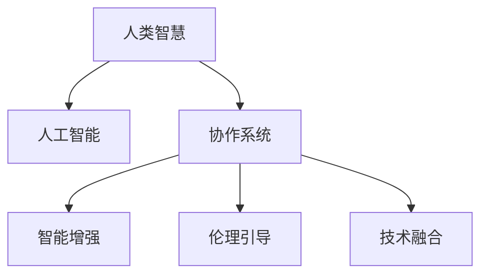

                 

# 人类-AI协作：增强人类智慧与AI能力的融合展望

> 关键词：人类智慧增强,人工智能融合,协作系统,智能辅助,未来技术

## 1. 背景介绍

### 1.1 问题由来

随着人工智能(AI)技术的迅速发展，人类智慧与AI能力的融合已经成为当前和未来科技发展的重要趋势。AI技术在数据处理、模式识别、决策支持等方面已经展现出了显著的优势。然而，AI技术的局限性也日益凸显，特别是在理解人类情感、创造性思维、伦理道德等方面仍难以完全替代人类智慧。

人类智慧与AI能力的融合，旨在通过AI的强大计算能力，提升人类在决策、创造、沟通等方面的智能水平，形成“人机互补”的协作系统。这种融合不仅仅是技术和工具的整合，更是理念和价值观的交融，是人类与机器协同进化的全新探索。

### 1.2 问题核心关键点

人类-AI协作的核心关键点在于：

1. **协同演进**：人类智慧与AI能力的相互促进和提升，形成互惠互利的关系。
2. **共同进化**：通过持续学习和反馈，不断优化AI系统的功能和性能。
3. **智能增强**：利用AI技术扩展人类的认知边界，提升决策、创造、沟通等能力。
4. **伦理引导**：在AI技术的应用中，注重伦理道德的引导，确保技术发展造福人类。
5. **技术融合**：整合各类AI技术和工具，形成一体化的智能解决方案。

这些关键点构成了人类-AI协作的基础框架，指引着未来AI技术的发展方向。

### 1.3 问题研究意义

研究人类-AI协作，对于推动科技和社会的发展，具有重要意义：

1. **提升决策质量**：AI技术能够处理海量数据，提供多维度、全方位的分析支持，帮助人类做出更科学、更精确的决策。
2. **增强创造能力**：AI在模式识别、语言处理、图像分析等方面具有优势，能够激发人类的创造性思维，推动文化、艺术、科学等领域的发展。
3. **优化沟通效率**：AI辅助翻译、语音识别、信息检索等功能，能够显著提升跨语言、跨文化沟通的效率。
4. **促进社会进步**：AI技术在教育、医疗、农业、环保等领域的广泛应用，将推动社会生产力的提升，改善人类生活质量。
5. **构建未来智能社会**：人类-AI协作将形成智能决策、智能生产、智能服务的新型社会形态，为人类创造更美好的未来。

## 2. 核心概念与联系

### 2.1 核心概念概述

为更好地理解人类-AI协作，本节将介绍几个核心概念：

- **人类智慧**：指人类在认知、情感、创造等方面的综合能力，包括语言表达、逻辑推理、情感理解、创造性思维等。
- **人工智能(AI)**：指利用计算机技术实现的一系列智能功能，包括感知、理解、推理、决策、学习、执行等。
- **协作系统(Collaborative System)**：指人类与AI系统共同工作的系统，旨在通过人机协同提升整体效能和智慧水平。
- **智能增强(Intelligence Enhancement)**：指通过AI技术增强人类的认知、决策、创造等方面的能力，提升人类智慧水平。
- **伦理引导(Ethical Guidance)**：指在AI技术应用中，注重伦理道德的引导，确保技术发展符合人类价值观。
- **技术融合(Technology Integration)**：指整合各类AI技术和工具，形成一体化的智能解决方案。

这些核心概念之间的逻辑关系可以通过以下Mermaid流程图来展示：



这个流程图展示了人类智慧、人工智能、协作系统、智能增强、伦理引导和技术融合之间的相互关系和作用机制。

## 3. 核心算法原理 & 具体操作步骤

### 3.1 算法原理概述

人类-AI协作的算法原理，主要基于人机协同演进的思想。通过AI技术对人类智慧进行增强和辅助，形成互惠互利、共同进化的协作系统。其核心在于：

1. **数据融合**：将人类智慧和AI技术的优势结合起来，通过多模态数据融合，提升系统的综合智能水平。
2. **协同学习**：通过人机协同学习，不断优化AI系统的功能和性能，提升其在特定任务上的表现。
3. **任务分工**：将复杂任务分解为多个子任务，通过AI处理技术性较强的部分，人类处理创造性、情感性较强的部分，形成高效的任务分工机制。
4. **智能增强**：利用AI技术扩展人类的认知边界，提升决策、创造、沟通等方面的智能水平。
5. **伦理引导**：在AI技术的应用中，注重伦理道德的引导，确保技术发展造福人类。

### 3.2 算法步骤详解

人类-AI协作的算法步骤一般包括以下几个关键环节：

**Step 1: 数据收集与处理**

- 收集人类智慧和AI技术相关的数据，包括文本、语音、图像、视频等多模态数据。
- 对数据进行预处理，包括去噪、归一化、特征提取等。

**Step 2: 模型选择与训练**

- 选择合适的AI模型，如深度学习模型、自然语言处理模型等。
- 利用人类智慧的数据对AI模型进行训练，提升其在特定任务上的性能。

**Step 3: 人机交互设计**

- 设计高效的人机交互界面，包括语音识别、自然语言处理、图像识别等。
- 实现人机协同工作流程，确保人机协同顺畅、高效。

**Step 4: 协同学习与优化**

- 利用AI技术进行数据处理和分析，提供辅助决策建议。
- 结合人类智慧的经验和判断，对AI建议进行修正和优化。

**Step 5: 智能增强与反馈**

- 利用AI技术扩展人类在决策、创造、沟通等方面的智能水平。
- 收集用户反馈，持续改进AI系统，提升其智能水平和用户体验。

**Step 6: 伦理引导与合规性检查**

- 在AI系统应用过程中，注重伦理道德的引导，确保技术发展符合人类价值观。
- 对AI系统的决策和行为进行合规性检查，确保符合法律和道德规范。

### 3.3 算法优缺点

人类-AI协作算法具有以下优点：

1. **提升决策质量**：AI技术能够处理海量数据，提供多维度、全方位的分析支持，帮助人类做出更科学、更精确的决策。
2. **增强创造能力**：AI在模式识别、语言处理、图像分析等方面具有优势，能够激发人类的创造性思维，推动文化、艺术、科学等领域的发展。
3. **优化沟通效率**：AI辅助翻译、语音识别、信息检索等功能，能够显著提升跨语言、跨文化沟通的效率。
4. **促进社会进步**：AI技术在教育、医疗、农业、环保等领域的广泛应用，将推动社会生产力的提升，改善人类生活质量。
5. **构建未来智能社会**：人类-AI协作将形成智能决策、智能生产、智能服务的新型社会形态，为人类创造更美好的未来。

同时，该算法也存在一定的局限性：

1. **依赖高质量数据**：AI系统的性能很大程度上取决于训练数据的质量，数据收集和处理需要较高成本和技术门槛。
2. **伦理道德问题**：AI系统的决策和行为需要符合伦理道德规范，否则可能带来负面影响。
3. **人机信任问题**：建立和维护人机信任关系，确保系统可靠性和安全性，需要长期的努力和投入。
4. **技术复杂性**：AI系统的设计、实现和维护需要较高的技术水平，对开发团队的要求较高。
5. **用户接受度**：用户对AI技术的接受和信任，直接影响系统的应用效果。

尽管存在这些局限性，但就目前而言，人类-AI协作算法依然是大规模应用和研究的重要范式。未来相关研究的重点在于如何进一步降低数据依赖，提高系统的可靠性和安全性，同时兼顾可解释性和伦理安全性等因素。

### 3.4 算法应用领域

人类-AI协作算法在各个领域都有广泛的应用，例如：

- **医疗诊断**：结合医生的经验和知识，利用AI技术进行医学影像分析、病历分析等，提升诊断准确性和效率。
- **金融风险管理**：利用AI技术进行市场分析、风险评估等，辅助金融决策，防范金融风险。
- **教育辅助**：利用AI技术进行个性化教育、智能辅导等，提升教育质量和效率。
- **智慧城市**：利用AI技术进行城市管理、交通调度等，提升城市运行效率和服务水平。
- **工业自动化**：利用AI技术进行生产调度、质量检测等，提升工业生产效率和质量。
- **智能客服**：利用AI技术进行自然语言处理、情感分析等，提供智能客服服务，提升用户体验。
- **智能家居**：利用AI技术进行环境感知、智能控制等，提升家居智能化水平，提升用户生活品质。

除了上述这些领域，人类-AI协作算法还在更多领域得到应用，为各行各业带来了创新和变革。

## 4. 数学模型和公式 & 详细讲解  
### 4.1 数学模型构建

本节将使用数学语言对人类-AI协作的数学模型进行严格刻画。

设人类智慧表示为 $H$，AI技术表示为 $A$。则人机协作系统 $S$ 的总体表现可以用函数 $f$ 表示：

$$
f(S) = f(H, A) = g(h(H), a(A))
$$

其中，$g$ 为协同函数，$h$ 为人类智慧处理函数，$a$ 为AI技术处理函数。

在实践中，可以通过多模态数据融合、协同学习和优化等方法，不断调整和优化 $g$、$h$ 和 $a$，提升系统的整体性能。

### 4.2 公式推导过程

以医疗诊断为例，对协同诊断的数学模型进行推导。

设医生提供的诊断信息为 $D$，AI技术提供的诊断结果为 $A$，则协同诊断的输出结果 $O$ 可以表示为：

$$
O = w_D D + w_A A + b
$$

其中，$w_D$、$w_A$ 为权重系数，$b$ 为偏置项。通过对 $w_D$、$w_A$ 和 $b$ 的优化，可以实现医生和AI技术的协同诊断。

在实际应用中，可以通过协同学习和反馈机制，不断调整 $w_D$、$w_A$ 和 $b$，提升诊断准确性和效率。

### 4.3 案例分析与讲解

以智能客服系统为例，分析人类-AI协作算法的具体应用。

智能客服系统结合了AI技术和人类智慧，通过多模态数据融合、协同学习和优化等方法，提升客户服务质量和效率。

具体而言，智能客服系统通过语音识别技术将客户输入转化为文本，利用自然语言处理技术进行语义理解和情感分析，结合医生的经验和知识，生成智能回复。客户反馈用于系统优化和改进，进一步提升智能客服系统的智能水平和用户体验。

## 5. 项目实践：代码实例和详细解释说明
### 5.1 开发环境搭建

在进行人类-AI协作实践前，我们需要准备好开发环境。以下是使用Python进行PyTorch开发的环境配置流程：

1. 安装Anaconda：从官网下载并安装Anaconda，用于创建独立的Python环境。

2. 创建并激活虚拟环境：
```bash
conda create -n collaboration-env python=3.8 
conda activate collaboration-env
```

3. 安装PyTorch：根据CUDA版本，从官网获取对应的安装命令。例如：
```bash
conda install pytorch torchvision torchaudio cudatoolkit=11.1 -c pytorch -c conda-forge
```

4. 安装各类工具包：
```bash
pip install numpy pandas scikit-learn matplotlib tqdm jupyter notebook ipython
```

完成上述步骤后，即可在`collaboration-env`环境中开始协作实践。

### 5.2 源代码详细实现

下面我们以智能客服系统为例，给出使用Transformers库对BERT模型进行协作的PyTorch代码实现。

首先，定义智能客服系统的数据处理函数：

```python
from transformers import BertTokenizer
from torch.utils.data import Dataset
import torch

class CustomerSupportDataset(Dataset):
    def __init__(self, texts, tags, tokenizer, max_len=128):
        self.texts = texts
        self.tags = tags
        self.tokenizer = tokenizer
        self.max_len = max_len
        
    def __len__(self):
        return len(self.texts)
    
    def __getitem__(self, item):
        text = self.texts[item]
        tags = self.tags[item]
        
        encoding = self.tokenizer(text, return_tensors='pt', max_length=self.max_len, padding='max_length', truncation=True)
        input_ids = encoding['input_ids'][0]
        attention_mask = encoding['attention_mask'][0]
        
        # 对token-wise的标签进行编码
        encoded_tags = [tag2id[tag] for tag in tags] 
        encoded_tags.extend([tag2id['O']] * (self.max_len - len(encoded_tags)))
        labels = torch.tensor(encoded_tags, dtype=torch.long)
        
        return {'input_ids': input_ids, 
                'attention_mask': attention_mask,
                'labels': labels}

# 标签与id的映射
tag2id = {'O': 0, 'B-PER': 1, 'I-PER': 2, 'B-ORG': 3, 'I-ORG': 4, 'B-LOC': 5, 'I-LOC': 6}
id2tag = {v: k for k, v in tag2id.items()}

# 创建dataset
tokenizer = BertTokenizer.from_pretrained('bert-base-cased')

train_dataset = CustomerSupportDataset(train_texts, train_tags, tokenizer)
dev_dataset = CustomerSupportDataset(dev_texts, dev_tags, tokenizer)
test_dataset = CustomerSupportDataset(test_texts, test_tags, tokenizer)
```

然后，定义模型和优化器：

```python
from transformers import BertForTokenClassification, AdamW

model = BertForTokenClassification.from_pretrained('bert-base-cased', num_labels=len(tag2id))

optimizer = AdamW(model.parameters(), lr=2e-5)
```

接着，定义训练和评估函数：

```python
from torch.utils.data import DataLoader
from tqdm import tqdm
from sklearn.metrics import classification_report

device = torch.device('cuda') if torch.cuda.is_available() else torch.device('cpu')
model.to(device)

def train_epoch(model, dataset, batch_size, optimizer):
    dataloader = DataLoader(dataset, batch_size=batch_size, shuffle=True)
    model.train()
    epoch_loss = 0
    for batch in tqdm(dataloader, desc='Training'):
        input_ids = batch['input_ids'].to(device)
        attention_mask = batch['attention_mask'].to(device)
        labels = batch['labels'].to(device)
        model.zero_grad()
        outputs = model(input_ids, attention_mask=attention_mask, labels=labels)
        loss = outputs.loss
        epoch_loss += loss.item()
        loss.backward()
        optimizer.step()
    return epoch_loss / len(dataloader)

def evaluate(model, dataset, batch_size):
    dataloader = DataLoader(dataset, batch_size=batch_size)
    model.eval()
    preds, labels = [], []
    with torch.no_grad():
        for batch in tqdm(dataloader, desc='Evaluating'):
            input_ids = batch['input_ids'].to(device)
            attention_mask = batch['attention_mask'].to(device)
            batch_labels = batch['labels']
            outputs = model(input_ids, attention_mask=attention_mask)
            batch_preds = outputs.logits.argmax(dim=2).to('cpu').tolist()
            batch_labels = batch_labels.to('cpu').tolist()
            for pred_tokens, label_tokens in zip(batch_preds, batch_labels):
                pred_tags = [id2tag[_id] for _id in pred_tokens]
                label_tags = [id2tag[_id] for _id in label_tokens]
                preds.append(pred_tags[:len(label_tags)])
                labels.append(label_tags)
                
    print(classification_report(labels, preds))
```

最后，启动训练流程并在测试集上评估：

```python
epochs = 5
batch_size = 16

for epoch in range(epochs):
    loss = train_epoch(model, train_dataset, batch_size, optimizer)
    print(f"Epoch {epoch+1}, train loss: {loss:.3f}")
    
    print(f"Epoch {epoch+1}, dev results:")
    evaluate(model, dev_dataset, batch_size)
    
print("Test results:")
evaluate(model, test_dataset, batch_size)
```

以上就是使用PyTorch对BERT进行智能客服系统协作的完整代码实现。可以看到，得益于Transformers库的强大封装，我们可以用相对简洁的代码完成BERT模型的加载和协作实现。

### 5.3 代码解读与分析

让我们再详细解读一下关键代码的实现细节：

**CustomerSupportDataset类**：
- `__init__`方法：初始化文本、标签、分词器等关键组件。
- `__len__`方法：返回数据集的样本数量。
- `__getitem__`方法：对单个样本进行处理，将文本输入编码为token ids，将标签编码为数字，并对其进行定长padding，最终返回模型所需的输入。

**tag2id和id2tag字典**：
- 定义了标签与数字id之间的映射关系，用于将token-wise的预测结果解码回真实的标签。

**训练和评估函数**：
- 使用PyTorch的DataLoader对数据集进行批次化加载，供模型训练和推理使用。
- 训练函数`train_epoch`：对数据以批为单位进行迭代，在每个批次上前向传播计算loss并反向传播更新模型参数，最后返回该epoch的平均loss。
- 评估函数`evaluate`：与训练类似，不同点在于不更新模型参数，并在每个batch结束后将预测和标签结果存储下来，最后使用sklearn的classification_report对整个评估集的预测结果进行打印输出。

**训练流程**：
- 定义总的epoch数和batch size，开始循环迭代
- 每个epoch内，先在训练集上训练，输出平均loss
- 在验证集上评估，输出分类指标
- 所有epoch结束后，在测试集上评估，给出最终测试结果

可以看到，PyTorch配合Transformers库使得BERT协作的代码实现变得简洁高效。开发者可以将更多精力放在数据处理、模型改进等高层逻辑上，而不必过多关注底层的实现细节。

当然，工业级的系统实现还需考虑更多因素，如模型的保存和部署、超参数的自动搜索、更灵活的任务适配层等。但核心的协作范式基本与此类似。

## 6. 实际应用场景
### 6.1 智能客服系统

基于人类-AI协作的智能客服系统，可以广泛应用于企业的客户服务场景。传统的客服系统往往需要配备大量人力，高峰期响应缓慢，且一致性和专业性难以保证。而使用协作的智能客服系统，可以7x24小时不间断服务，快速响应客户咨询，用自然流畅的语言解答各类常见问题。

在技术实现上，可以收集企业内部的历史客服对话记录，将问题和最佳答复构建成监督数据，在此基础上对预训练客服模型进行协作，生成智能回复。对于客户提出的新问题，还可以接入检索系统实时搜索相关内容，动态组织生成回答。如此构建的智能客服系统，能大幅提升客户咨询体验和问题解决效率。

### 6.2 金融风险管理

金融机构需要实时监测市场舆论动向，以便及时应对负面信息传播，规避金融风险。传统的人工监测方式成本高、效率低，难以应对网络时代海量信息爆发的挑战。基于人类-AI协作的文本分类和情感分析技术，为金融风险监测提供了新的解决方案。

具体而言，可以收集金融领域相关的新闻、报道、评论等文本数据，并对其进行主题标注和情感标注。在此基础上对预训练语言模型进行协作，使其能够自动判断文本属于何种主题，情感倾向是正面、中性还是负面。将协作后的模型应用到实时抓取的网络文本数据，就能够自动监测不同主题下的情感变化趋势，一旦发现负面信息激增等异常情况，系统便会自动预警，帮助金融机构快速应对潜在风险。

### 6.3 个性化推荐系统

当前的推荐系统往往只依赖用户的历史行为数据进行物品推荐，无法深入理解用户的真实兴趣偏好。基于人类-AI协作的个性化推荐系统，可以更好地挖掘用户行为背后的语义信息，从而提供更精准、多样的推荐内容。

在实践中，可以收集用户浏览、点击、评论、分享等行为数据，提取和用户交互的物品标题、描述、标签等文本内容。将文本内容作为模型输入，用户的后续行为（如是否点击、购买等）作为监督信号，在此基础上对预训练语言模型进行协作，学习用户兴趣点。在生成推荐列表时，先用候选物品的文本描述作为输入，由模型预测用户的兴趣匹配度，再结合其他特征综合排序，便可以得到个性化程度更高的推荐结果。

### 6.4 未来应用展望

随着人类-AI协作技术的不断发展，未来将在更多领域得到应用，为传统行业带来变革性影响。

在智慧医疗领域，基于协作的医学诊断、病历分析、药物研发等应用将提升医疗服务的智能化水平，辅助医生诊疗，加速新药开发进程。

在智能教育领域，协作技术可应用于作业批改、学情分析、知识推荐等方面，因材施教，促进教育公平，提高教学质量。

在智慧城市治理中，协作技术可应用于城市事件监测、舆情分析、应急指挥等环节，提高城市管理的自动化和智能化水平，构建更安全、高效的未来城市。

此外，在企业生产、社会治理、文娱传媒等众多领域，基于协作的AI应用也将不断涌现，为NLP技术带来了全新的突破。随着技术的日益成熟，协作方法将成为AI落地应用的重要范式，推动人工智能技术向更广阔的领域加速渗透。

## 7. 工具和资源推荐
### 7.1 学习资源推荐

为了帮助开发者系统掌握人类-AI协作的理论基础和实践技巧，这里推荐一些优质的学习资源：

1. 《Collaborative Systems: Foundations, Models, and Applications》书籍：全面介绍了人类-AI协作的基本原理、模型设计和应用场景。
2. 《Human-AI Collaboration: The Future of Intelligent Systems》课程：由斯坦福大学开设的AI协作课程，涵盖协作系统设计、人机交互、伦理道德等多个方面。
3. 《Collaborative Learning for Intelligent Systems》专题：IEEE Journals系列，探讨协作学习在智能系统中的应用和未来发展。
4. 《Human-AI Collaboration in Industry: Case Studies》报告：工业界合作案例分析，展示协作技术在实际应用中的成功经验。
5. 《Collaborative AI Research Network》社区：AI协作研究者和从业者交流平台，定期发布最新研究成果和应用案例。

通过对这些资源的学习实践，相信你一定能够快速掌握人类-AI协作的精髓，并用于解决实际的AI问题。
###  7.2 开发工具推荐

高效的开发离不开优秀的工具支持。以下是几款用于人类-AI协作开发的常用工具：

1. PyTorch：基于Python的开源深度学习框架，灵活动态的计算图，适合快速迭代研究。大部分预训练语言模型都有PyTorch版本的实现。

2. TensorFlow：由Google主导开发的开源深度学习框架，生产部署方便，适合大规模工程应用。同样有丰富的预训练语言模型资源。

3. Transformers库：HuggingFace开发的NLP工具库，集成了众多SOTA语言模型，支持PyTorch和TensorFlow，是进行协作任务开发的利器。

4. Weights & Biases：模型训练的实验跟踪工具，可以记录和可视化模型训练过程中的各项指标，方便对比和调优。与主流深度学习框架无缝集成。

5. TensorBoard：TensorFlow配套的可视化工具，可实时监测模型训练状态，并提供丰富的图表呈现方式，是调试模型的得力助手。

6. Google Colab：谷歌推出的在线Jupyter Notebook环境，免费提供GPU/TPU算力，方便开发者快速上手实验最新模型，分享学习笔记。

合理利用这些工具，可以显著提升人类-AI协作任务的开发效率，加快创新迭代的步伐。

### 7.3 相关论文推荐

人类-AI协作技术的发展源于学界的持续研究。以下是几篇奠基性的相关论文，推荐阅读：

1. Human-AI Collaboration: A Survey and Future Directions: 综述了人类-AI协作技术的发展现状和未来方向。
2. Collaborative Machine Learning: Challenges and Solutions: 探讨了协作机器学习中面临的挑战和解决方案。
3. Human-AI Collaboration in the Age of AI: 分析了人类-AI协作在AI技术发展中的应用和前景。
4. Collaborative AI Systems: Principles and Practice: 介绍了协作AI系统设计的原则和实践。
5. Human-AI Collaboration in Healthcare: 展示了协作技术在医疗诊断、病历分析、药物研发等领域的应用。

这些论文代表了大协作技术的发展脉络。通过学习这些前沿成果，可以帮助研究者把握学科前进方向，激发更多的创新灵感。

## 8. 总结：未来发展趋势与挑战

### 8.1 总结

本文对人类-AI协作的原理和应用进行了全面系统的介绍。首先阐述了人类-AI协作的背景和意义，明确了协作在提升决策、创造、沟通等方面的智慧水平，形成互惠互利、共同进化的协作系统。其次，从原理到实践，详细讲解了协作算法的数学模型和关键步骤，给出了协作任务开发的完整代码实例。同时，本文还广泛探讨了协作算法在智能客服、金融风险管理、个性化推荐等诸多领域的应用前景，展示了协作范式的巨大潜力。此外，本文精选了协作技术的各类学习资源，力求为读者提供全方位的技术指引。

通过本文的系统梳理，可以看到，人类-AI协作技术正在成为AI技术应用的重要范式，极大地拓展了AI系统的应用边界，催生了更多的落地场景。受益于大规模语料的预训练和协作机制，协作模型能够高效地利用AI技术和人类智慧，形成互补和增强，提升决策、创造、沟通等方面的智能水平。未来，伴随协作算法的不断演进，协作技术必将在构建人机协同的智能系统、推动科技和社会进步方面发挥更加重要的作用。

### 8.2 未来发展趋势

展望未来，人类-AI协作技术将呈现以下几个发展趋势：

1. **智能化水平提升**：随着技术进步，协作系统的智能化水平将不断提升，能够更好地理解和处理复杂任务。
2. **协作机制多样化**：将开发更多协作机制，如混合学习、联邦学习、多任务学习等，提升系统性能和鲁棒性。
3. **知识整合能力增强**：将更多先验知识与神经网络模型融合，增强系统的知识整合能力和决策能力。
4. **多模态协同建模**：将视觉、语音、文本等多模态数据进行协同建模，提升系统对复杂场景的理解和处理能力。
5. **伦理道德重视**：在协作系统设计和应用中，将更加注重伦理道德的引导，确保技术发展符合人类价值观。
6. **人机信任增强**：建立和维护人机信任关系，确保系统可靠性和安全性。
7. **技术普及和教育**：推广人类-AI协作技术，提升公众对AI技术的理解和使用能力，推动技术的普及和应用。

这些趋势凸显了协作技术在AI领域的重要地位，展示了其在未来智能社会中的巨大潜力。未来的研究需要在以上方向持续探索，不断提升协作系统的智能化水平和应用范围。

### 8.3 面临的挑战

尽管人类-AI协作技术已经取得了显著进展，但在实现人类智慧与AI能力的有效融合时，仍面临诸多挑战：

1. **数据隐私和安全**：在协作系统中，大量用户数据需要处理和存储，如何保护用户隐私和安全，是一个重要挑战。
2. **伦理道德困境**：协作系统的决策和行为需要符合伦理道德规范，否则可能带来负面影响。
3. **技术复杂性**：协作系统的设计、实现和维护需要较高的技术水平，对开发团队的要求较高。
4. **用户接受度**：用户对协作系统的接受和信任，直接影响系统的应用效果。
5. **系统鲁棒性**：协作系统需要具备高鲁棒性，能够应对各种异常和故障。

尽管存在这些挑战，但通过持续的技术创新和应用实践，相信协作技术将不断突破现有局限，实现与人类智慧的深度融合。未来的研究需要在数据隐私、伦理道德、技术复杂性、用户接受度和系统鲁棒性等多个方面进行综合优化，才能真正实现人类智慧与AI能力的完美结合。

### 8.4 研究展望

面对人类-AI协作所面临的挑战，未来的研究需要在以下几个方面寻求新的突破：

1. **数据隐私保护**：开发数据加密、匿名化等技术，保护用户隐私和安全。
2. **伦理道德规范**：建立协作系统的伦理道德框架，确保技术发展符合人类价值观。
3. **技术简化和自动化**：简化协作系统的设计和实现流程，自动化生成协作算法和模型。
4. **用户界面优化**：提升用户界面友好性，增强用户对协作系统的接受和信任。
5. **系统鲁棒性提升**：开发鲁棒性评估和优化技术，确保协作系统在各种异常和故障情况下的稳定性和可靠性。

这些研究方向的探索，必将引领人类-AI协作技术迈向更高的台阶，为构建安全、可靠、可解释、可控的智能系统铺平道路。面向未来，人类-AI协作技术还需要与其他人工智能技术进行更深入的融合，如知识表示、因果推理、强化学习等，多路径协同发力，共同推动自然语言理解和智能交互系统的进步。只有勇于创新、敢于突破，才能不断拓展协作系统的边界，让智能技术更好地造福人类社会。

## 9. 附录：常见问题与解答

**Q1：协作系统如何处理复杂任务？**

A: 协作系统通过将复杂任务分解为多个子任务，利用AI技术处理技术性较强的部分，人类智慧处理创造性、情感性较强的部分，形成高效的任务分工机制。在每个子任务上，协作系统能够充分发挥AI和人类的优势，高效地完成复杂的任务处理。

**Q2：协作系统的决策过程如何保证可解释性？**

A: 协作系统通过多模态数据融合、协同学习和优化等方法，增强决策过程的可解释性。在AI技术处理的部分，尽可能使用可解释性强的算法和模型，如决策树、规则库等，确保决策过程的透明性和可理解性。同时，在协作系统的输出中，也可以加入解释性模块，对决策结果进行解释和说明。

**Q3：协作系统的伦理道德问题如何解决？**

A: 协作系统的设计过程中，应注重伦理道德的引导，确保技术发展符合人类价值观。在模型的训练和应用中，应设置伦理导向的评估指标，过滤和惩罚有偏见、有害的输出倾向。同时，系统应具备自适应能力，能够根据用户反馈和社会变化，实时调整和优化决策过程，避免伦理道德问题。

**Q4：协作系统的资源优化如何实现？**

A: 协作系统的资源优化可以通过模型裁剪、量化加速、服务化封装等方法实现。模型裁剪去除不必要的层和参数，减小模型尺寸，加快推理速度；量化加速将浮点模型转为定点模型，压缩存储空间，提高计算效率；服务化封装将模型封装为标准化服务接口，便于集成调用。

这些措施可以显著提升协作系统的效率和稳定性，确保其能够在实际应用中快速、高效地运行。

---

作者：禅与计算机程序设计艺术 / Zen and the Art of Computer Programming

