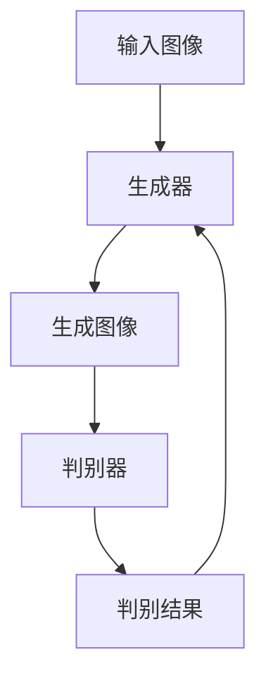

# 基于生成对抗网络的图像风格迁移的可解释性研究

## 1.背景介绍

图像风格迁移是一种将一种图像的风格应用到另一种图像上的技术。自从2015年Gatys等人提出基于卷积神经网络（CNN）的图像风格迁移方法以来，这一领域得到了广泛关注。然而，传统的图像风格迁移方法存在计算复杂度高、效果不稳定等问题。生成对抗网络（GAN）的引入为图像风格迁移提供了新的解决方案。GAN通过生成器和判别器的对抗训练，能够生成高质量的图像，并且在图像风格迁移中表现出色。

## 2.核心概念与联系

### 2.1 生成对抗网络（GAN）

生成对抗网络由生成器（Generator）和判别器（Discriminator）组成。生成器负责生成逼真的图像，而判别器则负责区分生成的图像和真实图像。两者通过对抗训练不断提升各自的能力。

### 2.2 图像风格迁移

图像风格迁移的目标是将一种图像的风格应用到另一种图像上。传统方法依赖于卷积神经网络的特征提取能力，而GAN则通过生成器直接生成具有目标风格的图像。

### 2.3 可解释性

可解释性是指模型的内部机制和决策过程能够被人类理解。在图像风格迁移中，可解释性有助于理解生成器如何将风格应用到图像上，从而提高模型的透明度和可信度。

## 3.核心算法原理具体操作步骤

### 3.1 生成器和判别器的设计

生成器通常采用U-Net结构，能够捕捉图像的全局和局部特征。判别器则采用PatchGAN结构，能够有效地判断图像的真实性。

### 3.2 损失函数的设计

损失函数是GAN训练的关键。常用的损失函数包括对抗损失、内容损失和风格损失。对抗损失用于生成器和判别器的对抗训练，内容损失用于保持图像的内容一致性，风格损失用于保持图像的风格一致性。

### 3.3 训练过程

训练过程包括生成器和判别器的交替训练。生成器生成图像，判别器判断图像的真实性，生成器根据判别器的反馈不断改进生成图像的质量。



## 4.数学模型和公式详细讲解举例说明

### 4.1 对抗损失

对抗损失用于生成器和判别器的对抗训练。生成器的目标是最小化对抗损失，而判别器的目标是最大化对抗损失。

$$
L_{GAN}(G, D) = \mathbb{E}_{x \sim p_{data}(x)}[\log D(x)] + \mathbb{E}_{z \sim p_z(z)}[\log(1 - D(G(z)))]
$$

### 4.2 内容损失

内容损失用于保持图像的内容一致性。常用的内容损失是基于VGG网络的特征提取。

$$
L_{content}(G) = \mathbb{E}_{x, y \sim p_{data}(x, y)}[\| \phi(x) - \phi(G(y)) \|_2^2]
$$

### 4.3 风格损失

风格损失用于保持图像的风格一致性。常用的风格损失是基于Gram矩阵的特征提取。

$$
L_{style}(G) = \mathbb{E}_{x, y \sim p_{data}(x, y)}[\| G_{\phi}(x) - G_{\phi}(G(y)) \|_2^2]
$$

## 5.项目实践：代码实例和详细解释说明

### 5.1 环境配置

首先，确保安装了必要的库，如TensorFlow或PyTorch。

```python
import tensorflow as tf
from tensorflow.keras import layers
```

### 5.2 生成器的实现

生成器采用U-Net结构，能够捕捉图像的全局和局部特征。

```python
def build_generator():
    inputs = layers.Input(shape=(256, 256, 3))
    # 编码器
    e1 = layers.Conv2D(64, (4, 4), strides=2, padding='same')(inputs)
    e2 = layers.Conv2D(128, (4, 4), strides=2, padding='same')(e1)
    # 解码器
    d1 = layers.Conv2DTranspose(128, (4, 4), strides=2, padding='same')(e2)
    d2 = layers.Conv2DTranspose(64, (4, 4), strides=2, padding='same')(d1)
    outputs = layers.Conv2DTranspose(3, (4, 4), strides=2, padding='same', activation='tanh')(d2)
    return tf.keras.Model(inputs, outputs)
```

### 5.3 判别器的实现

判别器采用PatchGAN结构，能够有效地判断图像的真实性。

```python
def build_discriminator():
    inputs = layers.Input(shape=(256, 256, 3))
    d1 = layers.Conv2D(64, (4, 4), strides=2, padding='same')(inputs)
    d2 = layers.Conv2D(128, (4, 4), strides=2, padding='same')(d1)
    outputs = layers.Conv2D(1, (4, 4), strides=1, padding='same')(d2)
    return tf.keras.Model(inputs, outputs)
```

### 5.4 训练过程

训练过程包括生成器和判别器的交替训练。

```python
generator = build_generator()
discriminator = build_discriminator()

# 定义损失函数和优化器
loss_fn = tf.keras.losses.BinaryCrossentropy(from_logits=True)
gen_optimizer = tf.keras.optimizers.Adam(2e-4, beta_1=0.5)
disc_optimizer = tf.keras.optimizers.Adam(2e-4, beta_1=0.5)

@tf.function
def train_step(real_images, target_images):
    with tf.GradientTape() as gen_tape, tf.GradientTape() as disc_tape:
        generated_images = generator(real_images, training=True)
        real_output = discriminator(target_images, training=True)
        fake_output = discriminator(generated_images, training=True)
        
        gen_loss = loss_fn(tf.ones_like(fake_output), fake_output)
        disc_loss = loss_fn(tf.ones_like(real_output), real_output) + loss_fn(tf.zeros_like(fake_output), fake_output)
    
    gradients_of_generator = gen_tape.gradient(gen_loss, generator.trainable_variables)
    gradients_of_discriminator = disc_tape.gradient(disc_loss, discriminator.trainable_variables)
    
    gen_optimizer.apply_gradients(zip(gradients_of_generator, generator.trainable_variables))
    disc_optimizer.apply_gradients(zip(gradients_of_discriminator, discriminator.trainable_variables))
```

## 6.实际应用场景

### 6.1 艺术创作

图像风格迁移可以用于艺术创作，将名画的风格应用到照片上，生成具有艺术感的图像。

### 6.2 图像增强

在医学图像处理、卫星图像分析等领域，图像风格迁移可以用于图像增强，提高图像的可读性和分析效果。

### 6.3 游戏和电影制作

在游戏和电影制作中，图像风格迁移可以用于生成具有特定风格的场景和角色，提高制作效率和效果。

## 7.工具和资源推荐

### 7.1 开源框架

- TensorFlow：一个广泛使用的深度学习框架，支持GAN的实现和训练。
- PyTorch：另一个流行的深度学习框架，具有灵活的动态计算图和强大的社区支持。

### 7.2 数据集

- COCO：一个常用的图像数据集，包含大量的标注图像，适用于图像风格迁移的训练。
- WikiArt：一个艺术作品数据集，包含各种风格的艺术作品，适用于艺术风格迁移。

### 7.3 参考文献

- Ian Goodfellow等人提出的GAN原始论文《Generative Adversarial Nets》。
- Gatys等人提出的基于CNN的图像风格迁移论文《A Neural Algorithm of Artistic Style》。

## 8.总结：未来发展趋势与挑战

### 8.1 未来发展趋势

随着深度学习技术的不断发展，图像风格迁移的效果和效率将不断提高。未来，图像风格迁移有望在更多领域得到应用，如虚拟现实、增强现实等。

### 8.2 挑战

尽管图像风格迁移取得了显著进展，但仍面临一些挑战，如生成图像的质量和稳定性、模型的可解释性等。未来的研究需要进一步提高模型的性能和可解释性，以满足实际应用的需求。

## 9.附录：常见问题与解答

### 9.1 为什么生成的图像质量不高？

生成的图像质量不高可能是由于生成器和判别器的训练不平衡、损失函数设计不合理等原因。可以尝试调整模型结构、优化器参数等。

### 9.2 如何提高模型的可解释性？

提高模型的可解释性可以通过可视化生成器的中间层特征、分析损失函数的贡献等方法。

### 9.3 如何选择合适的风格图像？

选择合适的风格图像可以通过实验比较不同风格图像的效果，选择生成效果最佳的风格图像。

---

作者：禅与计算机程序设计艺术 / Zen and the Art of Computer Programming