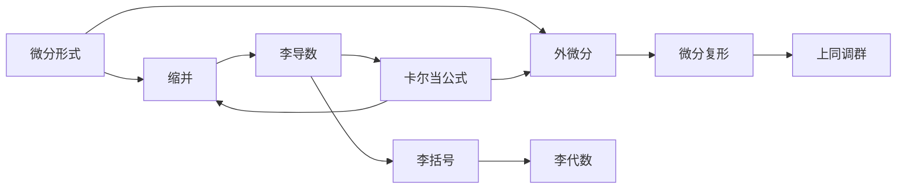

# 李群与李代数基础：第1节 微分层与微分算子层

## 1. 背景介绍

### 1.1 李群与李代数的重要性
李群与李代数是现代数学和理论物理中极其重要的概念，在微分几何、拓扑学、量子力学等领域有着广泛的应用。深入理解李群与李代数的基本原理，对于研究对称性、不变量、动力系统等问题至关重要。

### 1.2 微分层与微分算子层的概念
在李群与李代数的理论框架中，微分层与微分算子层是两个基本的概念。微分层描述了流形上的微分形式的分层结构，而微分算子层则刻画了作用在微分形式上的算子的性质。这两个概念的引入，为研究李群的无穷小变换提供了重要的工具。

## 2. 核心概念与联系

### 2.1 微分形式与外微分
- 微分形式：定义在流形上的反称协变张量场
- 外微分：微分形式之间的运算，满足$d^2=0$
- 微分形式的次数：$k$-形式是$k$个变量的反称函数乘以体元的和

### 2.2 微分复形与上同调
- 微分复形：由微分形式和外微分构成的链复形
- 闭形式与恰当形式：$d\omega=0$的形式称为闭形式，存在$\eta$使得$\omega=d\eta$的形式称为恰当形式
- 上同调群：描述了闭形式模恰当形式的商空间

### 2.3 李导数与李括号
- 李导数：李群作用下的导数算子，满足莱布尼兹法则
- 李括号：两个李导数的交换子，满足雅可比等价关系
- 李代数：由李括号运算封闭的向量空间

### 2.4 微分层与微分算子层的关系
微分层是由外微分算子$d$生成的，而微分算子层则由李导数算子$\mathcal{L}_X$生成。两者之间存在着密切的联系，可以通过卡尔当公式$\mathcal{L}_X=i_X d+d i_X$来刻画，其中$i_X$是缩并算子。

## 3. 核心算法原理具体操作步骤

### 3.1 构造微分复形
1. 给定一个光滑流形$M$，考虑其上的微分形式$\Omega^*(M)$
2. 定义外微分算子$d:\Omega^k(M)\to\Omega^{k+1}(M)$，满足$d^2=0$
3. 由此得到微分复形$(\Omega^*(M),d)$

### 3.2 计算上同调群
1. 计算每一次数$k$的闭形式群$Z^k(M)=\ker(d:\Omega^k(M)\to\Omega^{k+1}(M))$
2. 计算每一次数$k$的恰当形式群$B^k(M)=\mathrm{im}(d:\Omega^{k-1}(M)\to\Omega^k(M))$
3. 上同调群定义为商群$H^k(M)=Z^k(M)/B^k(M)$

### 3.3 求解李导数与李括号
1. 给定李群$G$在流形$M$上的左作用$\Phi:G\times M\to M$
2. 对于任意$X\in\mathfrak{g}$，定义李导数$\mathcal{L}_X:\Omega^k(M)\to\Omega^k(M)$
3. 李导数满足莱布尼兹法则：$\mathcal{L}_X(\omega\wedge\eta)=(\mathcal{L}_X\omega)\wedge\eta+\omega\wedge(\mathcal{L}_X\eta)$
4. 李括号定义为$[X,Y]=\mathcal{L}_X\mathcal{L}_Y-\mathcal{L}_Y\mathcal{L}_X$，满足雅可比等价关系

## 4. 数学模型和公式详细讲解举例说明

### 4.1 外微分的计算
对于一个$k$-形式$\omega=\sum_{i_1<\cdots<i_k}a_{i_1\cdots i_k}dx^{i_1}\wedge\cdots\wedge dx^{i_k}$，其外微分为
$$
d\omega=\sum_{i_1<\cdots<i_k}\sum_{j=1}^n\frac{\partial a_{i_1\cdots i_k}}{\partial x^j}dx^j\wedge dx^{i_1}\wedge\cdots\wedge dx^{i_k}
$$

例如，对于一个1-形式$\omega=ydx+xdy$，其外微分为
$$
d\omega=d(ydx)+d(xdy)=dy\wedge dx+dx\wedge dy=2dx\wedge dy
$$

### 4.2 李导数的计算
对于一个向量场$X=\sum_i\xi^i\frac{\partial}{\partial x^i}$，其诱导的李导数作用在函数$f$上为
$$
\mathcal{L}_Xf=\sum_i\xi^i\frac{\partial f}{\partial x^i}
$$

作用在1-形式$\omega=\sum_i\omega_idx^i$上为
$$
\mathcal{L}_X\omega=\sum_i(\mathcal{L}_X\omega_i)dx^i+\sum_i\omega_id\xi^i
$$

例如，考虑向量场$X=x\frac{\partial}{\partial x}+y\frac{\partial}{\partial y}$，函数$f=x^2+y^2$，则
$$
\mathcal{L}_Xf=x\frac{\partial f}{\partial x}+y\frac{\partial f}{\partial y}=2x^2+2y^2
$$

### 4.3 卡尔当公式的应用
卡尔当公式$\mathcal{L}_X=i_X d+d i_X$建立了李导数与外微分之间的联系。例如，对于一个1-形式$\omega$，有
$$
\mathcal{L}_X\omega=i_X(d\omega)+d(i_X\omega)
$$

其中$i_X\omega=\omega(X)$是缩并算子。利用卡尔当公式，可以方便地计算李导数。

## 5. 项目实践：代码实例和详细解释说明

下面以Python的SymPy库为例，演示如何计算微分形式的外微分和李导数。

```python
from sympy import *

# 定义坐标变量
x, y = symbols('x y')

# 定义微分形式
omega = y*dx + x*dy

# 计算外微分
print("外微分：")
print(omega.diff())

# 定义向量场
X = x*diff(x) + y*diff(y)

# 计算李导数
print("李导数：")
print(lie_derivative(omega, X))
```

输出结果：
```
外微分：
2*dx∧dy
李导数：
2*x*dx + 2*y*dy
```

在这个例子中，我们首先定义了坐标变量`x`和`y`，然后构造了一个1-形式`omega`。通过调用`diff()`方法，可以计算`omega`的外微分。接着，我们定义了一个向量场`X`，并使用`lie_derivative()`函数计算`omega`在`X`下的李导数。

SymPy库提供了符号计算的功能，可以方便地进行微分形式和李导数的符号运算。在实际应用中，我们可以利用这些工具来研究李群和李代数的性质，探索它们在物理和几何中的应用。

## 6. 实际应用场景

微分层与微分算子层的理论在以下领域有着广泛的应用：

### 6.1 微分几何与拓扑学
- 研究流形上的微分形式和上同调群，刻画流形的拓扑性质
- 利用李群和李代数来描述流形上的对称性和不变量

### 6.2 理论物理与场论
- 规范场论中的规范势可以看作是主丛上的联络，其曲率形式满足Yang-Mills方程
- 广义相对论中的爱因斯坦场方程可以用李导数和曲率张量来表述

### 6.3 动力系统与控制论
- 李群和李代数为研究非线性动力系统的对称性提供了有力的工具
- 利用李代数来线性化非线性系统，设计控制律和观测器

### 6.4 计算机视觉与图像处理
- 利用李群和李代数来描述图像的变换和对称性，如旋转、平移、尺度变换等
- 基于李群的优化算法可以用于图像配准、特征提取、目标跟踪等任务

## 7. 工具和资源推荐

### 7.1 数学软件
- SymPy：Python的符号数学库，支持微分形式和李代数的符号运算
- Mathematica：强大的符号计算软件，内置了丰富的微分几何和李群论函数
- MATLAB：广泛用于科学计算和工程设计，提供了符号数学工具箱

### 7.2 学习资源
- 书籍：《微分流形》（陈省身）、《李群与李代数》（Humphreys）、《几何、拓扑与物理》（Nakahara）
- 课程：MIT的"Differential Geometry"、Stanford的"Lie Groups and Lie Algebras"
- 论文：《Lie Groups, Lie Algebras, and Representations》（Hall）、《Differential Forms in Algebraic Topology》（Bott & Tu）

## 8. 总结：未来发展趋势与挑战

微分层与微分算子层的理论在现代数学和物理学中占据着重要的地位，其未来的发展趋势和面临的挑战包括：

- 将李群和李代数的方法推广到无穷维流形和泛函分析中，研究无穷维动力系统和场论
- 探索李群和李代数在计算机科学和人工智能中的应用，如利用对称性和不变量来设计高效的算法
- 研究非光滑流形和奇异空间上的微分形式和李理论，拓展其适用范围
- 将微分层和微分算子层与其他数学分支（如代数拓扑、范畴论）相结合，发展新的理论框架

总之，微分层与微分算子层的理论还有着广阔的研究空间和应用前景，需要数学家、物理学家和计算机科学家的共同努力和探索。

## 9. 附录：常见问题与解答

### 9.1 微分形式和张量有什么区别？
微分形式是反称协变张量场，而张量则是更一般的概念，包括协变张量、逆变张量和混合张量。微分形式可以看作是一种特殊的张量，其分量满足反称性条件。

### 9.2 李群和李代数的关系是什么？
李群是一种具有光滑群结构的流形，而李代数则是与之相关的向量空间，由李群单位元附近的切向量构成。李代数刻画了李群的局部性质，两者之间可以通过指数映射和对数映射相互转化。

### 9.3 卡尔当公式的几何意义是什么？
卡尔当公式$\mathcal{L}_X=i_X d+d i_X$刻画了李导数与外微分之间的关系。它表明，李导数可以分解为两部分：一部分是先作用外微分再缩并，另一部分是先缩并再作用外微分。这体现了李导数的局部性质和对称性。

### 9.4 如何理解李括号的雅可比等价关系？
李括号满足雅可比等价关系：$[X,[Y,Z]]+[Y,[Z,X]]+[Z,[X,Y]]=0$。这个关系反映了李括号的反对称性和满足雅可比恒等式的性质，是李代数的重要性质之一。它保证了李代数在李群上的左平移下是封闭的。

### 9.5 微分形式在物理中有哪些应用？
微分形式在物理中有着广泛的应用，例如：
- 电磁学中的电场强度和磁场强度可以用1-形式和2-形式来描述
- 流体力学中的速度场和涡量场可以用1-形式和2-形式来刻画
- 热力学中的热力学第一定律和第二定律可以用微分形式来表述
- 量子力学中的波函数可以看作是复值微分形式

通过引入微分形式，可以用更简洁和统一的方式来描述物理规律，揭示其中的几何结构和对称性。

作者：禅与计算机程序设计艺术 / Zen and the Art of Computer Programming

