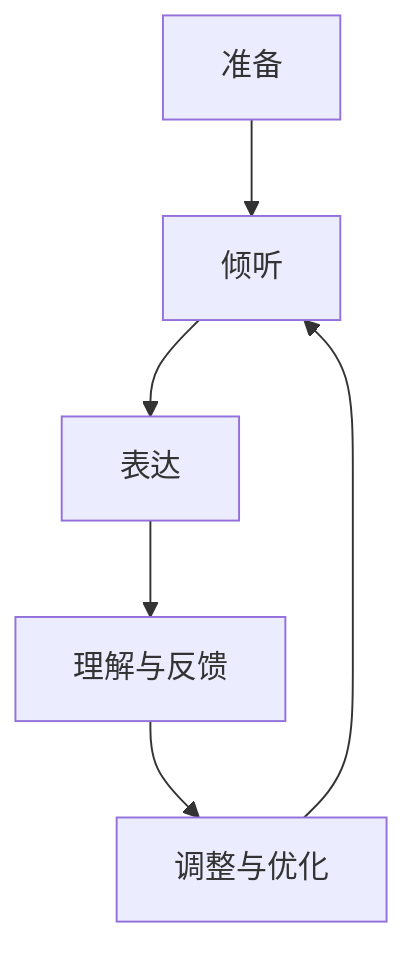

# 沟通能力培养：出色的沟通和人际交往能力，能够与内部利益相关者和外部供应商建立联系和协作

## 1.背景介绍

在当今快节奏的商业环境中，出色的沟通和人际交往能力已经成为成功的关键因素之一。无论是与内部团队成员、上级领导还是外部供应商和客户打交道,良好的沟通技巧都能帮助我们更有效地传递信息、建立信任、解决问题并达成共识。

事实上,缺乏沟通能力不仅会影响个人职业发展,还可能导致团队协作效率低下、决策失误、客户流失等严重后果。因此,培养出色的沟通和人际交往能力对于个人和组织的长期发展至关重要。

## 2.核心概念与联系

### 2.1 沟通的定义

沟通是指通过语言、文字、肢体语言等方式,在个人、团队或组织之间传递信息、想法、情感和意图的过程。有效的沟通需要发送者和接收者之间建立共同的理解和意义。

### 2.2 人际交往能力

人际交往能力是指与他人建立、维护和发展关系的能力。它包括以下几个方面:

1. 自我意识和情商管理
2. 积极倾听和理解他人
3. 清晰表达自己的想法
4. 建立信任和尊重
5. 解决冲突和达成共识

### 2.3 内部利益相关者

内部利益相关者是指组织内部的各个团队、部门和个人,他们对组织的成功和决策产生直接影响。有效的内部沟通有助于:

1. 提高团队协作效率
2. 促进信息共享和知识传递
3. 建立互信和凝聚力
4. 实现组织目标一致性

### 2.4 外部供应商

外部供应商是指为组织提供产品、服务或解决方案的外部合作伙伴。与供应商的良好沟通有助于:

1. 建立长期互利关系
2. 协调需求和期望
3. 解决问题和纠纷
4. 实现供应链高效运作

## 3.核心算法原理具体操作步骤

在沟通和人际交往领域,并没有固定的"算法",但是有一些通用的原则和技巧可以指导我们进行高效沟通。这些原则和技巧可以概括为以下几个步骤:



### 3.1 准备

在开始沟通之前,我们需要做好充分的准备:

1. 明确沟通目标和预期结果
2. 收集相关背景信息和数据
3. 组织内容结构和逻辑
4. 选择合适的沟通方式和渠道
5. 调整心态,保持开放和尊重

### 3.2 倾听

倾听是沟通过程中最重要的一个环节。良好的倾听技巧包括:

1. 全神贯注,集中注意力
2. 耐心等待,不打断对方
3. 观察非语言线索
4. 提出澄清性问题
5. 记录关键信息和要点

### 3.3 表达

在表达自己的想法和观点时,我们需要注意:

1. 使用清晰、简洁的语言
2. 结构合理,逻辑连贯
3. 举例说明,增加可理解性
4. 注意语气和肢体语言
5. 适当使用视觉辅助工具

### 3.4 理解与反馈

沟通是一个双向过程,我们需要确保对方理解我们的表达,同时也要理解对方的观点和反馈:

1. 总结和重述关键内容
2. 鼓励对方提出疑问和意见
3. 耐心解释和澄清误解
4. 尊重不同观点,寻求共识
5. 给予积极的反馈和肯定

### 3.5 调整与优化

根据对方的反馈和沟通效果,我们需要不断调整和优化沟通策略:

1. 反思沟通过程中的优缺点
2. 寻求改进的机会和方法
3. 适应不同的沟通对象和场景
4. 持续学习和提高沟通技巧
5. 建立良性的沟通习惯和文化

## 4.数学模型和公式详细讲解举例说明

虽然沟通和人际交往主要是一种软实力,但是我们也可以借助一些数学模型和公式来量化和优化沟通效果。

### 4.1 信息熵模型

信息熵是衡量信息量和不确定性的一种度量标准。在沟通过程中,我们希望传递的信息能够尽可能地减少接收者的不确定性和混淆。

信息熵的公式如下:

$$H(X) = -\sum_{i=1}^{n}P(x_i)\log_2P(x_i)$$

其中,$$X$$是一个离散随机变量,$$P(x_i)$$是$$x_i$$发生的概率。

通过计算和比较不同表达方式的信息熵,我们可以选择最优的表达方式,以提高信息传递的效率和准确性。

### 4.2 语义相似度模型

在沟通过程中,我们希望发送者和接收者对于关键概念和术语有相同的理解。语义相似度模型可以帮助我们量化不同词语或短语之间的相似程度。

一种常用的语义相似度计算方法是基于词向量的余弦相似度:

$$\text{sim}(A, B) = \cos(\theta) = \frac{A \cdot B}{\|A\|\|B\|} = \frac{\sum_{i=1}^{n}A_iB_i}{\sqrt{\sum_{i=1}^{n}A_i^2}\sqrt{\sum_{i=1}^{n}B_i^2}}$$

其中,$$A$$和$$B$$分别表示两个词语或短语的词向量表示。

通过计算关键词语之间的语义相似度,我们可以及时发现潜在的理解偏差,并进行必要的解释和澄清。

### 4.3 情感分析模型

在沟通过程中,我们不仅需要传递信息,还需要关注对方的情绪和情感状态。情感分析模型可以帮助我们自动识别和量化文本或语音中所蕴含的情感倾向。

一种常见的情感分析方法是基于词典的方法,它利用一个预先构建的情感词典,根据文本中出现的正面词语和负面词语的数量来计算情感极性值:

$$\text{sentiment} = \frac{\sum_{\text{pos}}\text{count}(\text{pos}) - \sum_{\text{neg}}\text{count}(\text{neg})}{\text{total}}$$

其中,$$\text{pos}$$和$$\text{neg}$$分别表示正面词语和负面词语,$$\text{count}(\cdot)$$表示词语出现的次数,$$\text{total}$$表示文本的总词数。

通过实时监测对方的情感变化,我们可以及时调整沟通策略,维护良好的人际关系。

## 5.项目实践:代码实例和详细解释说明

为了更好地理解和应用上述数学模型和公式,我们可以通过编写代码来实现一些实际的应用场景。以下是一些示例代码:

### 5.1 计算信息熵

```python
import math

def calculate_entropy(probabilities):
    entropy = 0
    for p in probabilities:
        if p > 0:
            entropy -= p * math.log2(p)
    return entropy

# 示例用法
probabilities = [0.2, 0.3, 0.1, 0.4]
entropy = calculate_entropy(probabilities)
print(f"Information entropy: {entropy:.2f}")
```

上述代码实现了一个简单的函数,用于计算给定概率分布的信息熵。我们可以将不同表达方式的概率分布作为输入,比较它们的信息熵值,从而选择最优的表达方式。

### 5.2 计算语义相似度

```python
import numpy as np

def cosine_similarity(vec1, vec2):
    dot_product = np.dot(vec1, vec2)
    norm_vec1 = np.linalg.norm(vec1)
    norm_vec2 = np.linalg.norm(vec2)
    return dot_product / (norm_vec1 * norm_vec2)

# 示例用法
word_vec1 = np.array([0.2, 0.5, -0.1])
word_vec2 = np.array([0.1, 0.6, -0.2])
similarity = cosine_similarity(word_vec1, word_vec2)
print(f"Semantic similarity: {similarity:.2f}")
```

这段代码实现了一个计算两个向量之间余弦相似度的函数。在自然语言处理领域,我们可以使用预训练的词向量模型来获取词语或短语的向量表示,然后计算它们之间的语义相似度。

### 5.3 情感分析

```python
from nltk.sentiment import SentimentIntensityAnalyzer

def analyze_sentiment(text):
    sia = SentimentIntensityAnalyzer()
    sentiment_scores = sia.polarity_scores(text)
    return sentiment_scores

# 示例用法
text = "This product is amazing! I love it so much."
sentiment_scores = analyze_sentiment(text)
print(f"Sentiment scores: {sentiment_scores}")
```

这段代码使用了NLTK (Natural Language Toolkit)库中的情感分析器,可以对给定的文本进行情感分析。输出结果包括了正面、负面、中性和复合情感分数,可以帮助我们了解对方的情绪状态。

通过将这些代码集成到实际的沟通系统或工具中,我们可以更好地量化和优化沟通效果。

## 6.实际应用场景

出色的沟通和人际交往能力在各个领域都有广泛的应用场景,包括但不限于:

### 6.1 团队协作

在团队协作中,良好的沟通是确保项目顺利进行的关键。团队成员需要清晰地交流任务要求、进度状况和潜在风险,并及时解决分歧和冲突。有效的沟通有助于建立互信、增强凝聚力,从而提高团队的整体效率和绩效。

### 6.2 客户服务

在客户服务领域,出色的沟通技巧可以帮助企业更好地了解客户需求,解决客户疑虑,提供优质的服务体验。良好的沟通不仅有助于保留现有客户,还可以吸引新客户,提高客户忠诚度和品牌形象。

### 6.3 销售和营销

在销售和营销领域,沟通能力是成功的关键。销售人员需要清晰地向潜在客户介绍产品或服务的价值主张,并有效地处理异议和反对意见。营销人员则需要与目标受众建立有效的沟通渠道,传递吸引人的信息和内容。

### 6.4 领导力发展

作为领导者,出色的沟通和人际交往能力是必备的技能。领导者需要清晰地传达组织的愿景和目标,激励团队成员,解决冲突,建立信任和尊重。良好的沟通有助于提高领导力的影响力和凝聚力。

### 6.5 跨文化交流

在全球化的商业环境中,跨文化交流变得越来越重要。出色的沟通和人际交往能力可以帮助我们更好地理解和尊重不同文化背景下的价值观和行为模式,避免文化冲突和误解,促进有效的合作和交流。

## 7.工具和资源推荐

为了提高沟通和人际交往能力,我们可以利用一些有用的工具和资源:

### 7.1 沟通技巧培训

参加专业的沟通技巧培训课程是提升沟通能力的有效途径。这些课程通常会涵盖有效倾听、清晰表达、冲突管理、演讲技巧等多个方面的内容,并提供实践练习和反馈。

### 7.2 在线学习资源

互联网上有大量免费的在线学习资源,如视频课程、电子书籍、博客文章和论坛社区。这些资源可以帮助我们自学和补充沟通和人际交往方面的知识和技能。

### 7.3 模拟练习和角色扮演

通过模拟练习和角色扮演,我们可以在安全的环境中练习沟通技巧,并获得反馈和建议。这种方式有助于我们识别自身的沟通弱点,并进行针对性的改进。

### 7.4 反馈和自我评估

主动