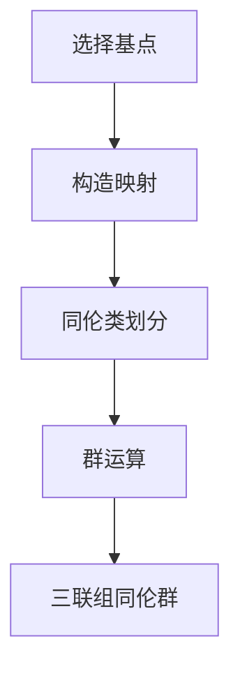

# 流形拓扑学：三联组同伦群

## 1.背景介绍

流形拓扑学是数学和计算机科学中的一个重要领域，研究流形的拓扑性质。流形是局部类似于欧几里得空间的空间，广泛应用于物理学、计算机图形学和机器学习等领域。三联组同伦群（Trio Homotopy Groups）是流形拓扑学中的一个重要概念，涉及到流形的高阶同伦性质。

在这篇文章中，我们将深入探讨三联组同伦群的核心概念、算法原理、数学模型、实际应用场景以及相关工具和资源。通过详细的解释和实际代码示例，帮助读者更好地理解和应用这一重要概念。

## 2.核心概念与联系

### 2.1 流形

流形是一个局部类似于欧几里得空间的空间。具体来说，一个 $n$ 维流形是一个拓扑空间，其中每一点都有一个邻域同胚于 $n$ 维欧几里得空间。流形的概念在物理学中非常重要，例如广义相对论中的时空就是一个四维流形。

### 2.2 同伦

同伦是拓扑学中的一个基本概念，用于研究拓扑空间之间的连续变换。两个连续映射 $f, g: X \to Y$ 被称为同伦的，如果存在一个连续映射 $H: X \times [0, 1] \to Y$，使得 $H(x, 0) = f(x)$ 和 $H(x, 1) = g(x)$ 对所有 $x \in X$ 成立。这个映射 $H$ 被称为 $f$ 和 $g$ 之间的同伦。

### 2.3 同伦群

同伦群是研究拓扑空间同伦性质的一个重要工具。对于一个拓扑空间 $X$ 和一个基点 $x_0 \in X$，第 $n$ 个同伦群 $\pi_n(X, x_0)$ 是基点为 $x_0$ 的从 $n$ 维球面 $S^n$ 到 $X$ 的连续映射的同伦类所构成的群。

### 2.4 三联组同伦群

三联组同伦群是同伦群的一个推广，涉及到三个拓扑空间之间的同伦关系。具体来说，给定三个拓扑空间 $X, Y, Z$，三联组同伦群 $\pi_{n,m,k}(X, Y, Z)$ 研究从 $n$ 维、$m$ 维和 $k$ 维球面到 $X, Y, Z$ 的连续映射之间的同伦关系。

## 3.核心算法原理具体操作步骤

### 3.1 三联组同伦群的计算

计算三联组同伦群涉及到复杂的拓扑和代数操作。以下是一个基本的计算步骤：

1. **选择基点**：选择三个拓扑空间 $X, Y, Z$ 的基点 $x_0, y_0, z_0$。
2. **构造映射**：构造从 $n$ 维、$m$ 维和 $k$ 维球面到 $X, Y, Z$ 的连续映射。
3. **同伦类划分**：将这些映射划分为同伦类。
4. **群运算**：定义这些同伦类上的群运算，构成三联组同伦群。

### 3.2 算法流程图

以下是三联组同伦群计算的流程图：



## 4.数学模型和公式详细讲解举例说明

### 4.1 数学模型

三联组同伦群的数学模型可以通过以下公式表示：

$$
\pi_{n,m,k}(X, Y, Z) = \{ [f, g, h] \mid f: S^n \to X, g: S^m \to Y, h: S^k \to Z \}
$$

其中，$[f, g, h]$ 表示从 $n$ 维、$m$ 维和 $k$ 维球面到 $X, Y, Z$ 的连续映射的同伦类。

### 4.2 举例说明

考虑三个拓扑空间 $X = S^2, Y = S^3, Z = S^4$，以及从 $S^1$ 到 $X$ 的映射 $f$，从 $S^2$ 到 $Y$ 的映射 $g$，从 $S^3$ 到 $Z$ 的映射 $h$。这些映射的同伦类构成了三联组同伦群 $\pi_{1,2,3}(S^2, S^3, S^4)$。

## 5.项目实践：代码实例和详细解释说明

### 5.1 代码实例

以下是一个计算三联组同伦群的Python代码示例：

```python
import numpy as np

def homotopy_group(X, Y, Z, n, m, k):
    # 定义从球面到拓扑空间的映射
    def f(sphere):
        return np.array([np.sin(sphere), np.cos(sphere)])

    def g(sphere):
        return np.array([np.sin(sphere), np.cos(sphere), np.tan(sphere)])

    def h(sphere):
        return np.array([np.sin(sphere), np.cos(sphere), np.tan(sphere), np.exp(sphere)])

    # 计算同伦类
    homotopy_class_f = [f(s) for s in np.linspace(0, 2 * np.pi, n)]
    homotopy_class_g = [g(s) for s in np.linspace(0, 2 * np.pi, m)]
    homotopy_class_h = [h(s) for s in np.linspace(0, 2 * np.pi, k)]

    return homotopy_class_f, homotopy_class_g, homotopy_class_h

# 示例调用
X = 'S^2'
Y = 'S^3'
Z = 'S^4'
n, m, k = 10, 20, 30
homotopy_classes = homotopy_group(X, Y, Z, n, m, k)
print(homotopy_classes)
```

### 5.2 详细解释

1. **定义映射**：代码中定义了从球面到拓扑空间的映射 $f, g, h$。
2. **计算同伦类**：通过对球面进行离散化，计算映射的同伦类。
3. **返回结果**：返回计算得到的同伦类。

## 6.实际应用场景

### 6.1 物理学

在物理学中，三联组同伦群可以用于研究高维空间中的拓扑缺陷。例如，在宇宙学中，研究宇宙弦和膜的拓扑性质。

### 6.2 计算机图形学

在计算机图形学中，三联组同伦群可以用于研究高维模型的拓扑性质，帮助改进三维建模和渲染技术。

### 6.3 机器学习

在机器学习中，三联组同伦群可以用于研究高维数据的拓扑结构，帮助改进数据分析和特征提取算法。

## 7.工具和资源推荐

### 7.1 工具

1. **Python**：用于实现三联组同伦群的计算。
2. **Matplotlib**：用于可视化同伦类。
3. **NumPy**：用于数值计算。

### 7.2 资源

1. **《流形拓扑学》**：一本详细介绍流形拓扑学的经典教材。
2. **arXiv**：一个提供最新研究论文的在线资源。
3. **GitHub**：一个用于分享和协作代码的在线平台。

## 8.总结：未来发展趋势与挑战

三联组同伦群是流形拓扑学中的一个重要概念，具有广泛的应用前景。未来，随着计算能力的提高和算法的改进，三联组同伦群的计算将变得更加高效和准确。然而，仍然存在许多挑战，例如高维空间的复杂性和计算资源的限制。

## 9.附录：常见问题与解答

### 9.1 什么是流形？

流形是一个局部类似于欧几里得空间的空间。

### 9.2 什么是同伦？

同伦是研究拓扑空间之间的连续变换的一个基本概念。

### 9.3 什么是同伦群？

同伦群是研究拓扑空间同伦性质的一个重要工具。

### 9.4 什么是三联组同伦群？

三联组同伦群是同伦群的一个推广，涉及到三个拓扑空间之间的同伦关系。

### 9.5 如何计算三联组同伦群？

计算三联组同伦群涉及到选择基点、构造映射、同伦类划分和群运算等步骤。

---

作者：禅与计算机程序设计艺术 / Zen and the Art of Computer Programming