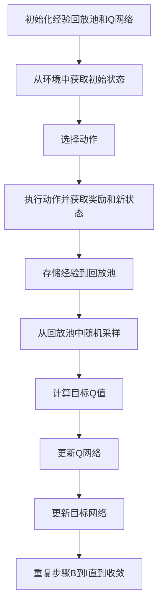

# 深度 Q-learning：在人工智能艺术创作中的应用

## 1.背景介绍

### 1.1 人工智能与艺术的交汇

人工智能（AI）在过去几十年中取得了显著的进展，从简单的规则系统到复杂的深度学习模型，AI的应用范围不断扩大。艺术创作作为人类文化的重要组成部分，也逐渐成为AI研究的热点领域。通过AI技术，艺术创作不仅可以实现自动化，还能探索出人类艺术家难以企及的新领域。

### 1.2 强化学习的崛起

强化学习（Reinforcement Learning, RL）是机器学习的一个重要分支，旨在通过与环境的交互来学习最优策略。RL在游戏、机器人控制等领域取得了显著成果。深度Q-learning作为RL的一个重要算法，结合了深度学习的强大表示能力和Q-learning的有效性，成为解决复杂问题的有力工具。

### 1.3 深度 Q-learning 在艺术创作中的潜力

深度Q-learning在艺术创作中的应用，既可以自动生成艺术作品，又能通过与环境的交互不断优化创作过程。本文将深入探讨深度Q-learning的核心概念、算法原理、数学模型、项目实践、实际应用场景、工具和资源推荐，并展望其未来发展趋势与挑战。

## 2.核心概念与联系

### 2.1 强化学习基础

强化学习的核心在于通过试错法（trial and error）来学习策略。一个RL系统通常由以下几个部分组成：
- **代理（Agent）**：执行动作的主体。
- **环境（Environment）**：代理与之交互的外部世界。
- **状态（State）**：环境在某一时刻的描述。
- **动作（Action）**：代理在某一状态下可以执行的操作。
- **奖励（Reward）**：代理执行动作后获得的反馈。

### 2.2 Q-learning 概述

Q-learning是一种无模型的RL算法，通过学习状态-动作值函数（Q函数）来找到最优策略。Q函数表示在某一状态下执行某一动作的预期回报。Q-learning的更新公式为：
$$
Q(s, a) \leftarrow Q(s, a) + \alpha [r + \gamma \max_{a'} Q(s', a') - Q(s, a)]
$$
其中，$s$ 和 $a$ 分别表示状态和动作，$r$ 是奖励，$\alpha$ 是学习率，$\gamma$ 是折扣因子。

### 2.3 深度 Q-learning 的引入

深度Q-learning结合了深度神经网络和Q-learning，通过神经网络来近似Q函数，从而处理高维状态空间。深度Q-learning的核心在于使用经验回放（Experience Replay）和目标网络（Target Network）来稳定训练过程。

### 2.4 深度 Q-learning 与艺术创作的联系

在艺术创作中，深度Q-learning可以通过与环境的交互，不断优化创作策略。例如，在生成音乐时，代理可以根据听众的反馈调整音符的选择，从而创作出更受欢迎的音乐作品。

## 3.核心算法原理具体操作步骤

### 3.1 深度 Q-learning 算法流程

深度Q-learning的算法流程如下：



### 3.2 经验回放

经验回放通过存储代理的经验（状态、动作、奖励、新状态）并在训练时随机采样，打破了数据的相关性，提高了训练的稳定性。

### 3.3 目标网络

目标网络是深度Q-learning中的一个关键组件，用于计算目标Q值。目标网络的参数每隔一段时间才更新一次，从而减少了训练过程中的振荡。

### 3.4 具体操作步骤

1. **初始化**：初始化经验回放池和Q网络。
2. **获取初始状态**：从环境中获取初始状态。
3. **选择动作**：根据$\epsilon$-贪婪策略选择动作。
4. **执行动作**：执行动作并获取奖励和新状态。
5. **存储经验**：将经验存储到回放池中。
6. **采样经验**：从回放池中随机采样一批经验。
7. **计算目标Q值**：使用目标网络计算目标Q值。
8. **更新Q网络**：通过最小化损失函数更新Q网络。
9. **更新目标网络**：每隔一段时间更新目标网络的参数。
10. **重复**：重复上述步骤直到收敛。

## 4.数学模型和公式详细讲解举例说明

### 4.1 Q函数的定义

Q函数$Q(s, a)$表示在状态$s$下执行动作$a$的预期回报。Q-learning的目标是找到最优Q函数$Q^*(s, a)$，使得在任意状态下选择最优动作的回报最大。

### 4.2 贝尔曼方程

贝尔曼方程是Q-learning的核心，描述了Q函数的递归关系：
$$
Q^*(s, a) = \mathbb{E}[r + \gamma \max_{a'} Q^*(s', a') | s, a]
$$
其中，$\mathbb{E}$表示期望，$r$是奖励，$\gamma$是折扣因子，$s'$是执行动作$a$后到达的新状态。

### 4.3 Q-learning 更新公式

Q-learning通过以下更新公式来迭代逼近最优Q函数：
$$
Q(s, a) \leftarrow Q(s, a) + \alpha [r + \gamma \max_{a'} Q(s', a') - Q(s, a)]
$$
其中，$\alpha$是学习率。

### 4.4 深度 Q-learning 的损失函数

在深度Q-learning中，使用神经网络来近似Q函数。损失函数定义为：
$$
L(\theta) = \mathbb{E}[(r + \gamma \max_{a'} Q(s', a'; \theta^-) - Q(s, a; \theta))^2]
$$
其中，$\theta$是Q网络的参数，$\theta^-$是目标网络的参数。

### 4.5 举例说明

假设我们有一个简单的艺术创作环境，代理可以选择不同的颜色来绘制图像。状态$s$表示当前图像的状态，动作$a$表示选择的颜色，奖励$r$表示观众的反馈。通过深度Q-learning，代理可以学习到在不同状态下选择哪种颜色可以获得更高的观众反馈。

## 5.项目实践：代码实例和详细解释说明

### 5.1 环境搭建

首先，我们需要搭建一个简单的艺术创作环境。可以使用OpenAI Gym来创建自定义环境。

```python
import gym
from gym import spaces
import numpy as np

class ArtEnv(gym.Env):
    def __init__(self):
        super(ArtEnv, self).__init__()
        self.action_space = spaces.Discrete(10)  # 10种颜色
        self.observation_space = spaces.Box(low=0, high=255, shape=(64, 64, 3), dtype=np.uint8)  # 64x64 RGB图像
        self.state = np.zeros((64, 64, 3), dtype=np.uint8)

    def reset(self):
        self.state = np.zeros((64, 64, 3), dtype=np.uint8)
        return self.state

    def step(self, action):
        # 根据动作更新图像
        self.state[:, :, :] = action * 25
        reward = self._get_reward()
        done = True  # 简单起见，每次动作后结束
        return self.state, reward, done, {}

    def _get_reward(self):
        # 简单的奖励函数
        return np.random.rand()
```

### 5.2 深度 Q-learning 代码实现

接下来，我们实现深度Q-learning算法。

```python
import torch
import torch.nn as nn
import torch.optim as optim
import random
from collections import deque

class QNetwork(nn.Module):
    def __init__(self):
        super(QNetwork, self).__init__()
        self.fc1 = nn.Linear(64*64*3, 512)
        self.fc2 = nn.Linear(512, 256)
        self.fc3 = nn.Linear(256, 10)

    def forward(self, x):
        x = x.view(-1, 64*64*3)
        x = torch.relu(self.fc1(x))
        x = torch.relu(self.fc2(x))
        x = self.fc3(x)
        return x

class DQNAgent:
    def __init__(self):
        self.q_network = QNetwork()
        self.target_network = QNetwork()
        self.optimizer = optim.Adam(self.q_network.parameters(), lr=0.001)
        self.memory = deque(maxlen=10000)
        self.batch_size = 64
        self.gamma = 0.99
        self.epsilon = 1.0
        self.epsilon_decay = 0.995
        self.epsilon_min = 0.01

    def act(self, state):
        if random.random() < self.epsilon:
            return random.randint(0, 9)
        state = torch.FloatTensor(state).unsqueeze(0)
        with torch.no_grad():
            q_values = self.q_network(state)
        return q_values.argmax().item()

    def remember(self, state, action, reward, next_state, done):
        self.memory.append((state, action, reward, next_state, done))

    def replay(self):
        if len(self.memory) < self.batch_size:
            return
        batch = random.sample(self.memory, self.batch_size)
        states, actions, rewards, next_states, dones = zip(*batch)
        states = torch.FloatTensor(states)
        actions = torch.LongTensor(actions)
        rewards = torch.FloatTensor(rewards)
        next_states = torch.FloatTensor(next_states)
        dones = torch.FloatTensor(dones)

        q_values = self.q_network(states).gather(1, actions.unsqueeze(1)).squeeze(1)
        next_q_values = self.target_network(next_states).max(1)[0]
        target_q_values = rewards + self.gamma * next_q_values * (1 - dones)

        loss = nn.MSELoss()(q_values, target_q_values)
        self.optimizer.zero_grad()
        loss.backward()
        self.optimizer.step()

        if self.epsilon > self.epsilon_min:
            self.epsilon *= self.epsilon_decay

    def update_target_network(self):
        self.target_network.load_state_dict(self.q_network.state_dict())

env = ArtEnv()
agent = DQNAgent()

for episode in range(1000):
    state = env.reset()
    done = False
    while not done:
        action = agent.act(state)
        next_state, reward, done, _ = env.step(action)
        agent.remember(state, action, reward, next_state, done)
        state = next_state
        agent.replay()
    agent.update_target_network()
```

### 5.3 代码解释

1. **环境搭建**：创建了一个简单的艺术创作环境，代理可以选择不同的颜色来绘制图像。
2. **Q网络**：使用一个简单的全连接神经网络来近似Q函数。
3. **DQN代理**：实现了深度Q-learning算法，包括经验回放、$\epsilon$-贪婪策略、Q网络和目标网络的更新。
4. **训练过程**：在每个回合中，代理与环境交互，存储经验并进行训练，定期更新目标网络。

## 6.实际应用场景

### 6.1 音乐创作

深度Q-learning可以用于自动生成音乐。代理可以根据听众的反馈调整音符的选择，从而创作出更受欢迎的音乐作品。

### 6.2 图像生成

在图像生成领域，深度Q-learning可以用于生成具有特定风格的图像。代理可以根据用户的反馈调整图像的风格和内容。

### 6.3 交互式艺术

深度Q-learning还可以用于交互式艺术创作。代理可以根据观众的实时反馈调整艺术作品，从而创造出更具互动性的艺术体验。

### 6.4 游戏设计

在游戏设计中，深度Q-learning可以用于生成游戏关卡和角色。代理可以根据玩家的反馈调整关卡的难度和角色的行为，从而提高游戏的可玩性。

## 7.工具和资源推荐

### 7.1 开发工具

- **Python**：深度Q-learning的实现通常使用Python编程语言。
- **PyTorch**：一个流行的深度学习框架，适用于实现深度Q-learning。
- **OpenAI Gym**：一个用于创建和测试RL环境的工具包。

### 7.2 学习资源

- **《深度强化学习》**：一本详细介绍深度强化学习的书籍，适合初学者和进阶学习者。
- **Coursera上的强化学习课程**：由知名大学提供的在线课程，涵盖了强化学习的基础和高级内容。
- **GitHub**：上面有许多开源的深度Q-learning项目，可以参考和学习。

### 7.3 实践资源

- **Kaggle**：一个数据科学竞赛平台，提供了许多RL相关的竞赛和数据集。
- **RLlib**：一个基于Ray的分布式RL库，适用于大规模RL训练。

## 8.总结：未来发展趋势与挑战

### 8.1 未来发展趋势

深度Q-learning在艺术创作中的应用前景广阔。随着算法的不断改进和计算资源的增加，深度Q-learning将能够处理更复杂的艺术创作任务，生成更高质量的艺术作品。

### 8.2 挑战

尽管深度Q-learning在艺术创作中展现了巨大的潜力，但仍面临一些挑战：
- **计算资源**：深度Q-learning的训练过程需要大量的计算资源，尤其是在处理高维状态空间时。
- **奖励设计**：在艺术创作中，设计合理的奖励函数是一个难题。奖励函数需要能够准确反映艺术作品的质量和观众的反馈。
- **稳定性**：深度Q-learning的训练过程可能会出现不稳定的情况，需要使用经验回放和目标网络等技术来稳定训练过程。

## 9.附录：常见问题与解答

### 9.1 深度Q-learning与其他RL算法的区别是什么？

深度Q-learning结合了深度学习和Q-learning，通过神经网络来近似Q函数，能够处理高维状态空间。相比于传统的Q-learning，深度Q-learning在处理复杂问题时具有更强的表示能力。

### 9.2 如何选择合适的奖励函数？

奖励函数的设计需要根据具体的应用场景来确定。在艺术创作中，奖励函数可以基于观众的反馈、作品的美学质量等因素来设计。

### 9.3 深度Q-learning的训练过程为什么会不稳定？

深度Q-learning的训练过程可能会出现不稳定的情况，主要原因是Q值的估计误差会不断累积。使用经验回放和目标网络等技术可以有效减少训练过程中的振荡，提高训练的稳定性。

### 9.4 如何提高深度Q-learning的训练效率？

可以通过以下几种方法提高深度Q-learning的训练效率：
- 使用更高效的神经网络架构。
- 增加经验回放池的大小。
- 使用优先经验回放（Prioritized Experience Replay）来提高采样效率。

### 9.5 深度Q-learning在实际应用中有哪些成功案例？

深度Q-learning在游戏、机器人控制等领域取得了显著成果。例如，DeepMind的DQN算法在Atari游戏中达到了超越人类的表现。此外，深度Q-learning还被应用于自动驾驶、金融交易等领域。

---

作者：禅与计算机程序设计艺术 / Zen and the Art of Computer Programming