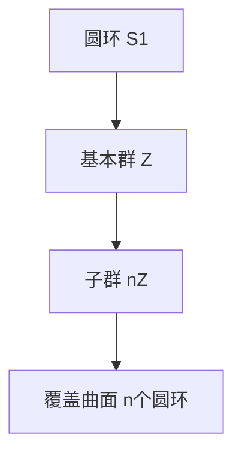

# 黎曼曲面：基本群的子群与覆盖曲面

## 1.背景介绍

黎曼曲面是复分析和代数几何中的一个重要概念。它们不仅在数学理论中占据重要地位，还在物理学、计算机科学等领域有广泛应用。基本群和覆盖曲面是理解黎曼曲面的关键工具。基本群描述了曲面的拓扑性质，而覆盖曲面则提供了研究这些性质的几何视角。

## 2.核心概念与联系

### 2.1 黎曼曲面

黎曼曲面是一个一维复流形，简单来说，它是一个可以局部看作复平面的拓扑空间。每个点都有一个邻域与复平面同胚。

### 2.2 基本群

基本群是一个拓扑不变量，描述了空间的基本环路结构。对于一个拓扑空间 $X$，其基本群 $\pi_1(X)$ 是基于某个基点的所有环路的同伦类所构成的群。

### 2.3 覆盖曲面

覆盖曲面是一个拓扑空间 $Y$，它通过一个连续映射 $p: Y \to X$ 覆盖另一个拓扑空间 $X$。每个点 $x \in X$ 都有一个邻域 $U$，使得 $p^{-1}(U)$ 是 $U$ 的不交并。

### 2.4 基本群的子群与覆盖曲面

基本群的子群与覆盖曲面之间有着深刻的联系。具体来说，基本群的每个子群都对应一个覆盖曲面。这个联系为我们提供了研究黎曼曲面的强大工具。

## 3.核心算法原理具体操作步骤

### 3.1 计算基本群

计算基本群通常涉及找到空间的基本环路，并确定它们的同伦类。对于简单的空间，如圆环或球面，这些计算相对简单。但对于复杂的空间，可能需要使用代数拓扑中的高级工具。

### 3.2 构造覆盖曲面

构造覆盖曲面通常涉及找到一个合适的子群，并使用这个子群来定义覆盖映射。具体步骤如下：

1. 选择一个基点 $x_0 \in X$。
2. 确定基本群 $\pi_1(X, x_0)$。
3. 选择一个子群 $H \subseteq \pi_1(X, x_0)$。
4. 构造覆盖空间 $Y$，使得 $p: Y \to X$ 是一个覆盖映射。

### 3.3 例子：圆环的覆盖

考虑圆环 $S^1$，其基本群是 $\mathbb{Z}$。选择子群 $n\mathbb{Z}$，对应的覆盖曲面是 $n$ 个圆环的覆盖。



## 4.数学模型和公式详细讲解举例说明

### 4.1 基本群的定义

基本群 $\pi_1(X, x_0)$ 是基于基点 $x_0$ 的所有环路的同伦类所构成的群。形式上，基本群定义为：

$$
\pi_1(X, x_0) = \{ [\gamma] \mid \gamma: [0, 1] \to X, \gamma(0) = \gamma(1) = x_0 \}
$$

### 4.2 覆盖映射的定义

覆盖映射 $p: Y \to X$ 是一个连续映射，使得每个点 $x \in X$ 都有一个邻域 $U$，使得 $p^{-1}(U)$ 是 $U$ 的不交并。形式上，覆盖映射满足：

$$
\forall x \in X, \exists U \subseteq X, p^{-1}(U) = \bigsqcup_{\alpha \in A} U_\alpha
$$

### 4.3 例子：圆环的基本群和覆盖

考虑圆环 $S^1$，其基本群是 $\mathbb{Z}$。选择子群 $n\mathbb{Z}$，对应的覆盖曲面是 $n$ 个圆环的覆盖。具体来说，覆盖映射 $p: \mathbb{R} \to S^1$ 定义为：

$$
p(t) = e^{2\pi it}
$$

这个映射是一个 $n$ 重覆盖。

## 5.项目实践：代码实例和详细解释说明

### 5.1 计算基本群的Python代码

我们可以使用Python和SymPy库来计算简单空间的基本群。以下是一个计算圆环基本群的示例代码：

```python
import sympy as sp

# 定义圆环的基本群
def fundamental_group_circle():
    # 圆环的基本群是整数群Z
    return sp.ZZ

# 计算圆环的基本群
pi_1_S1 = fundamental_group_circle()
print(f"圆环的基本群: {pi_1_S1}")
```

### 5.2 构造覆盖曲面的Python代码

我们可以使用Python来模拟覆盖曲面的构造。以下是一个构造圆环覆盖的示例代码：

```python
import numpy as np
import matplotlib.pyplot as plt

# 定义覆盖映射
def covering_map(t, n):
    return np.exp(2j * np.pi * t / n)

# 绘制覆盖曲面
def plot_covering(n):
    t = np.linspace(0, 2 * np.pi, 100)
    for i in range(n):
        plt.plot(np.real(covering_map(t + i * 2 * np.pi, n)), np.imag(covering_map(t + i * 2 * np.pi, n)))
    plt.gca().set_aspect('equal')
    plt.show()

# 绘制3重覆盖
plot_covering(3)
```

## 6.实际应用场景

### 6.1 复几何与代数几何

黎曼曲面在复几何和代数几何中有广泛应用。例如，复代数曲线的研究通常涉及黎曼曲面。

### 6.2 物理学中的应用

在物理学中，黎曼曲面用于研究弦理论和量子场论中的多重覆盖空间。

### 6.3 计算机科学中的应用

在计算机科学中，黎曼曲面和覆盖曲面用于图像处理、计算机视觉和复杂网络的研究。

## 7.工具和资源推荐

### 7.1 数学软件

- **SymPy**: 一个Python库，用于符号数学计算。
- **Mathematica**: 一个强大的数学软件，用于符号和数值计算。

### 7.2 在线资源

- **arXiv**: 一个提供数学和物理学论文的在线平台。
- **MathWorld**: 一个提供数学概念和定理的在线百科全书。

### 7.3 书籍推荐

- **《复分析》**: 作者：Lars Ahlfors
- **《代数拓扑》**: 作者：Allen Hatcher

## 8.总结：未来发展趋势与挑战

黎曼曲面和基本群的研究在未来仍有广阔的发展空间。随着计算机科学和物理学的发展，这些数学工具将继续在新领域中发挥重要作用。然而，理解和应用这些概念仍然面临许多挑战，需要进一步的研究和探索。

## 9.附录：常见问题与解答

### 9.1 什么是黎曼曲面？

黎曼曲面是一个一维复流形，可以局部看作复平面的拓扑空间。

### 9.2 什么是基本群？

基本群是一个拓扑不变量，描述了空间的基本环路结构。

### 9.3 什么是覆盖曲面？

覆盖曲面是一个拓扑空间，通过一个连续映射覆盖另一个拓扑空间。

### 9.4 如何计算基本群？

计算基本群通常涉及找到空间的基本环路，并确定它们的同伦类。

### 9.5 如何构造覆盖曲面？

构造覆盖曲面通常涉及找到一个合适的子群，并使用这个子群来定义覆盖映射。

---

作者：禅与计算机程序设计艺术 / Zen and the Art of Computer Programming