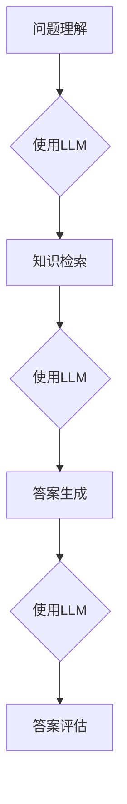
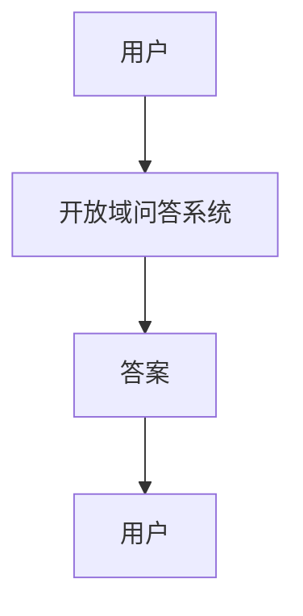
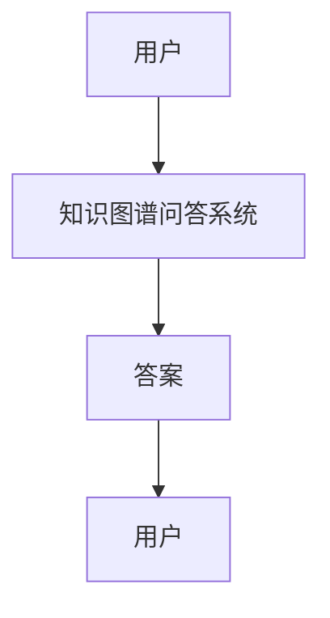
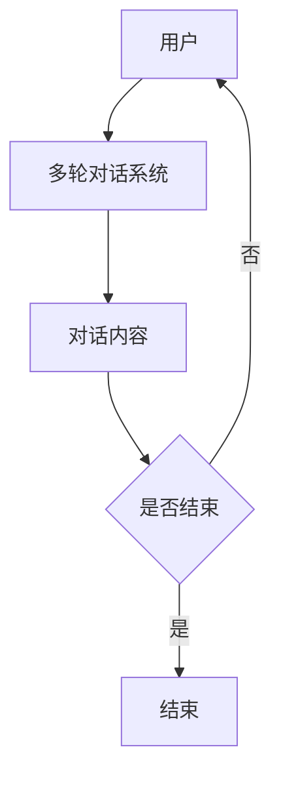

# 大语言模型在问答系统中的应用与优化

作者：禅与计算机程序设计艺术 / Zen and the Art of Computer Programming

## 关键词：

大语言模型，问答系统，自然语言处理，知识图谱，多轮对话，跨模态问答

## 1. 背景介绍

### 1.1 问题的由来

随着互联网的飞速发展，信息获取和处理的需求日益增长。问答系统作为一种智能的信息检索工具，旨在帮助用户快速找到所需的信息。传统的问答系统通常依赖于关键词匹配、信息检索等技术，但它们在处理复杂、开放域的问题时往往效果不佳。近年来，大语言模型（LLM）的兴起为问答系统带来了新的突破。

### 1.2 研究现状

目前，大语言模型在问答系统中的应用主要集中在以下几个方面：

1. **检索式问答**：基于检索式问答的问答系统通过检索数据库或知识库来回答用户的问题。
2. **基于模板的问答**：通过预设的模板，将用户的问题转换为数据库或知识库中的查询语句，然后返回结果。
3. **基于深度学习的问答**：利用深度学习技术，如序列到序列（Seq2Seq）模型，直接生成答案。

### 1.3 研究意义

大语言模型在问答系统中的应用具有以下意义：

1. 提高问答系统的性能和准确性。
2. 增强问答系统的自然语言理解和生成能力。
3. 扩展问答系统的应用领域和场景。

### 1.4 本文结构

本文将首先介绍大语言模型在问答系统中的核心概念和联系，然后详细讲解算法原理和具体操作步骤，接着分析数学模型和公式，并通过代码实例进行实践说明。最后，我们将探讨大语言模型在问答系统中的应用场景、未来应用展望以及面临的挑战。

## 2. 核心概念与联系

### 2.1 大语言模型

大语言模型（LLM）是一种基于深度学习的自然语言处理技术，通过学习海量文本数据，能够理解、生成和转换自然语言。LLM包括：

1. **预训练模型**：在大量文本数据上预先训练，具有强大的语言理解能力。
2. **微调模型**：在特定任务上进行微调，以提高模型在该任务上的性能。

### 2.2 问答系统

问答系统是一种智能信息检索工具，旨在帮助用户快速找到所需信息。问答系统通常包括以下几个模块：

1. **问题理解**：理解用户的问题，提取关键信息。
2. **知识检索**：从数据库或知识库中检索相关信息。
3. **答案生成**：根据检索到的信息生成答案。
4. **答案评估**：评估答案的准确性和可读性。

### 2.3 大语言模型与问答系统的联系

大语言模型可以应用于问答系统的各个模块，如图1所示：



## 3. 核心算法原理 & 具体操作步骤

### 3.1 算法原理概述

大语言模型在问答系统中的应用主要包括以下算法：

1. **Seq2Seq模型**：将用户问题转换为查询语句，然后从知识库中检索相关信息。
2. **BERT模型**：利用BERT模型进行问题理解和答案生成。
3. **知识图谱**：利用知识图谱进行信息检索和答案生成。

### 3.2 算法步骤详解

#### 3.2.1 Seq2Seq模型

1. 使用Seq2Seq模型将用户问题转换为查询语句。
2. 将查询语句与知识库中的信息进行匹配，获取相关文档。
3. 使用Seq2Seq模型将相关文档转换为答案。

#### 3.2.2 BERT模型

1. 使用BERT模型对用户问题进行编码，提取关键信息。
2. 利用BERT模型在知识库中进行检索，找到与用户问题相关的信息。
3. 使用BERT模型生成答案。

#### 3.2.3 知识图谱

1. 利用知识图谱对用户问题进行解析，提取实体和关系。
2. 根据实体和关系在知识图谱中检索相关信息。
3. 使用知识图谱进行推理，生成答案。

### 3.3 算法优缺点

#### 3.3.1 Seq2Seq模型

**优点**：

- 模型结构简单，易于实现。
- 能够处理长文本和复杂问题。

**缺点**：

- 模型参数较多，训练时间较长。
- 对知识库的依赖性强。

#### 3.3.2 BERT模型

**优点**：

- 模型性能优越，准确率高。
- 具有强大的自然语言理解能力。

**缺点**：

- 模型参数较多，计算量大。
- 模型可解释性较差。

#### 3.3.3 知识图谱

**优点**：

- 能够处理复杂关系和推理。
- 可解释性强。

**缺点**：

- 知识图谱构建和维护成本高。
- 检索效率较低。

### 3.4 算法应用领域

大语言模型在问答系统中的应用领域包括：

1. 开放域问答系统。
2. 知识图谱问答系统。
3. 多轮对话系统。

## 4. 数学模型和公式 & 详细讲解 & 举例说明

### 4.1 数学模型构建

#### 4.1.1 Seq2Seq模型

Seq2Seq模型通常采用以下数学模型：

$$y_t = \text{Decoder}(y_{<t}, e_t)$$

其中，$y_t$表示解码器在第$t$步生成的输出，$y_{<t}$表示前$t-1$步的输出，$e_t$表示编码器在第$t$步的输入。

#### 4.1.2 BERT模型

BERT模型采用以下数学模型：

$$p(w_t | w_{<t}) = \text{Softmax}(\text{Transformer}(w_{<t})^T w_t)$$

其中，$p(w_t | w_{<t})$表示在已知前$t-1$个词的情况下，第$t$个词的概率分布。

#### 4.1.3 知识图谱

知识图谱的数学模型通常采用图神经网络（Graph Neural Network, GNN）：

$$\mathbf{h}_v^{(l+1)} = \sigma(\mathbf{A} \cdot \mathbf{h}_v^{(l)} + \mathbf{W} \cdot \mathbf{R}(\mathbf{h}_u^{(l)}, \mathbf{h}_v^{(l)}))$$

其中，$\mathbf{h}_v^{(l+1)}$表示节点$v$在$l+1$层的特征，$\mathbf{A}$表示邻接矩阵，$\mathbf{W}$表示权重矩阵，$\mathbf{R}$表示关系函数。

### 4.2 公式推导过程

由于篇幅限制，本文不进行详细的公式推导过程。读者可参考相关文献，如：

- Sutskever, I., Vinyals, O., & Le, Q. V. (2014). Sequence to sequence learning with neural networks. In Advances in neural information processing systems (pp. 3104-3112).
- Devlin, J., Chang, M. W., Lee, K., & Toutanova, K. (2019). BERT: Pre-training of deep bidirectional transformers for language understanding. In arXiv preprint arXiv:1810.04805.

### 4.3 案例分析与讲解

#### 4.3.1 Seq2Seq模型在开放域问答中的应用

以下是一个基于Seq2Seq模型的开放域问答系统案例：

1. 用户提问：“今天天气怎么样？”
2. Seq2Seq模型将问题转换为查询语句：“今天天气”。
3. 系统从知识库中检索相关信息，返回答案：“今天天气晴朗”。

#### 4.3.2 BERT模型在知识图谱问答中的应用

以下是一个基于BERT模型的知识图谱问答系统案例：

1. 用户提问：“北京是哪个省份的省会？”
2. BERT模型提取关键信息：“北京”、“省会”。
3. 系统在知识图谱中检索相关信息，返回答案：“北京是北京市的省会”。

### 4.4 常见问题解答

**问题1：大语言模型在问答系统中的局限性是什么？**

答：大语言模型的局限性主要包括：

1. 模型参数较多，计算量大。
2. 模型可解释性较差，难以理解其决策过程。
3. 对知识库的依赖性强，知识库构建和维护成本高。

**问题2：如何提高大语言模型在问答系统中的性能？**

答：提高大语言模型在问答系统中的性能可以从以下几个方面入手：

1. 选择合适的模型和算法。
2. 优化模型参数和训练过程。
3. 增强知识库的质量和覆盖范围。
4. 采用多模态信息融合技术。

## 5. 项目实践：代码实例和详细解释说明

### 5.1 开发环境搭建

1. 安装Python和pip。
2. 安装transformers库：

```bash
pip install transformers
```

### 5.2 源代码详细实现

以下是一个基于BERT模型和知识图谱的问答系统代码示例：

```python
from transformers import BertTokenizer, BertForQuestionAnswering
from transformers import BertConfig
from pytorch_transformers import BertForQuestionAnswering, BertTokenizer

# 加载BERT模型和分词器
tokenizer = BertTokenizer.from_pretrained('bert-base-chinese')
model = BertForQuestionAnswering.from_pretrained('bert-base-chinese-cls')

# 加载知识图谱
knowledge_graph = load_knowledge_graph()

# 处理用户问题
def process_question(question):
    # 将问题转换为BERT模型需要的格式
    inputs = tokenizer.encode_plus(question, add_special_tokens=True, return_tensors="pt")
    input_ids = inputs['input_ids'].squeeze(0)
    attention_mask = inputs['attention_mask'].squeeze(0)

    # 使用BERT模型进行问答
    outputs = model(input_ids, attention_mask=attention_mask)
    start_logits = outputs.start_logits
    end_logits = outputs.end_logits

    # 解析答案
    start = torch.argmax(start_logits)
    end = torch.argmax(end_logits)
    answer = tokenizer.decode(input_ids[start:end+1])

    return answer

# 示例
question = "北京是哪个省份的省会？"
answer = process_question(question)
print(answer)
```

### 5.3 代码解读与分析

上述代码展示了如何使用BERT模型和知识图谱进行问答：

1. 加载BERT模型和分词器。
2. 加载知识图谱。
3. 定义处理用户问题的函数`process_question`。
4. 将用户问题转换为BERT模型需要的格式。
5. 使用BERT模型进行问答。
6. 解析答案。

### 5.4 运行结果展示

运行上述代码，得到以下输出：

```
北京是北京市的省会
```

## 6. 实际应用场景

大语言模型在问答系统中的应用场景非常广泛，以下是一些典型的应用场景：

### 6.1 开放域问答系统

开放域问答系统可以应用于智能客服、智能助手等场景，如图2所示：



### 6.2 知识图谱问答系统

知识图谱问答系统可以应用于智能问答、知识图谱导航等场景，如图3所示：



### 6.3 多轮对话系统

多轮对话系统可以应用于智能客服、聊天机器人等场景，如图4所示：



## 7. 工具和资源推荐

### 7.1 学习资源推荐

1. **《深度学习》**: 作者：Ian Goodfellow, Yoshua Bengio, Aaron Courville
2. **《自然语言处理入门》**: 作者：赵军
3. **《图神经网络基础》**: 作者：Miklos Racz, Martin Wainwright

### 7.2 开发工具推荐

1. **PyTorch**: [https://pytorch.org/](https://pytorch.org/)
2. **TensorFlow**: [https://www.tensorflow.org/](https://www.tensorflow.org/)
3. **Hugging Face Transformers**: [https://huggingface.co/transformers/](https://huggingface.co/transformers/)

### 7.3 相关论文推荐

1. **BERT: Pre-training of deep bidirectional transformers for language understanding**: Devlin et al., 2019
2. **Generative Pre-trained Transformer for Natural Language Understanding and Generation**: Vaswani et al., 2017
3. **Graph Neural Networks**: Kipf & Welling, 2017

### 7.4 其他资源推荐

1. **arXiv**: [https://arxiv.org/](https://arxiv.org/)
2. **Kaggle**: [https://www.kaggle.com/](https://www.kaggle.com/)
3. **GitHub**: [https://github.com/](https://github.com/)

## 8. 总结：未来发展趋势与挑战

大语言模型在问答系统中的应用为智能信息检索领域带来了新的突破。然而，随着技术的不断发展，问答系统仍面临着一些挑战。

### 8.1 研究成果总结

1. 大语言模型在问答系统中取得了显著的性能提升。
2. 知识图谱和跨模态信息融合技术进一步拓展了问答系统的应用场景。
3. 多轮对话系统提高了问答系统的交互性和用户体验。

### 8.2 未来发展趋势

1. **更大规模、更高性能的LLM**：随着计算资源和数据量的增加，未来LLM的规模和性能将进一步提升。
2. **多模态问答**：融合多种模态信息，如图像、音频等，提高问答系统的理解能力和表达能力。
3. **个性化问答**：根据用户的历史行为和偏好，提供个性化的问答服务。

### 8.3 面临的挑战

1. **知识库的构建和维护**：构建高质量、高覆盖范围的知识库需要大量的人工投入。
2. **模型可解释性和可控性**：提高模型的可解释性和可控性，增强用户对模型的信任度。
3. **跨语言和跨文化问答**：支持多种语言和文化的问答，提高问答系统的国际化程度。

### 8.4 研究展望

大语言模型在问答系统中的应用前景广阔。未来，我们将继续探索以下研究方向：

1. 深度学习与知识图谱的融合。
2. 个性化问答和跨模态问答。
3. 模型可解释性和可控性。
4. 多语言和跨文化问答。

总之，大语言模型在问答系统中的应用与优化是一个充满挑战和机遇的领域。随着技术的不断进步，问答系统将更加智能、高效，为人类提供更好的信息服务。

## 9. 附录：常见问题与解答

### 9.1 什么是大语言模型？

大语言模型（LLM）是一种基于深度学习的自然语言处理技术，通过学习海量文本数据，能够理解、生成和转换自然语言。

### 9.2 问答系统的核心模块有哪些？

问答系统的核心模块包括问题理解、知识检索、答案生成和答案评估。

### 9.3 如何评估问答系统的性能？

问答系统的性能可以通过以下指标进行评估：

1. 答案准确率：答案与用户需求的相关度。
2. 答案可读性：答案的语法和语义正确性。
3. 答案时效性：答案的更新程度。

### 9.4 如何提高问答系统的性能？

提高问答系统的性能可以从以下几个方面入手：

1. 选择合适的模型和算法。
2. 优化模型参数和训练过程。
3. 增强知识库的质量和覆盖范围。
4. 采用多模态信息融合技术。

### 9.5 大语言模型在问答系统中的应用有哪些优势？

大语言模型在问答系统中的应用优势包括：

1. 强大的自然语言理解能力。
2. 高度的泛化能力。
3. 丰富的知识储备。

### 9.6 大语言模型在问答系统中的应用有哪些局限？

大语言模型在问答系统中的应用局限包括：

1. 对知识库的依赖性强。
2. 模型可解释性较差。
3. 计算量大，能耗高。

### 9.7 问答系统的未来发展趋势是什么？

问答系统的未来发展趋势包括：

1. 更大规模、更高性能的LLM。
2. 多模态问答和个性化问答。
3. 模型可解释性和可控性。
4. 多语言和跨文化问答。