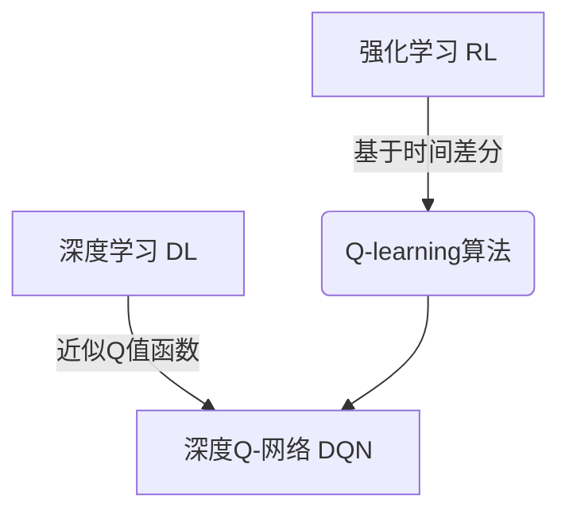

# 深度 Q-learning：DL、ML和AI的交集

## 1. 背景介绍

### 1.1 问题的由来

在强化学习(Reinforcement Learning, RL)领域中,Q-learning算法是一种广泛使用的无模型算法,它能够通过与环境的交互来学习最优策略。然而,传统的Q-learning算法在处理大规模状态空间和动作空间时,往往会遇到维数灾难(Curse of Dimensionality)的问题,导致学习效率低下。为了解决这一问题,研究人员将深度学习(Deep Learning, DL)技术引入到Q-learning算法中,形成了深度Q-learning(Deep Q-Learning, DQN)算法。

### 1.2 研究现状

深度Q-learning算法最早由DeepMind公司在2013年提出,并在2015年发表在Nature杂志上的论文《Human-level control through deep reinforcement learning》中展示了其在Atari游戏上的卓越表现。自此,深度Q-learning算法在各种强化学习任务中都取得了令人瞩目的成绩,如机器人控制、自动驾驶、对抗性游戏等。

### 1.3 研究意义

深度Q-learning算法将深度学习技术与强化学习相结合,充分利用了深度神经网络在高维数据处理和特征提取方面的优势,从而极大地提高了Q-learning算法的学习效率和性能。同时,深度Q-learning算法也推动了人工智能(Artificial Intelligence, AI)、机器学习(Machine Learning, ML)和深度学习(Deep Learning, DL)等领域的交叉融合,为解决复杂的决策问题提供了新的思路和方法。

### 1.4 本文结构

本文将从以下几个方面对深度Q-learning算法进行深入探讨:

1. 核心概念与联系
2. 核心算法原理与具体操作步骤
3. 数学模型和公式详细讲解与案例分析
4. 项目实践:代码实例和详细解释说明
5. 实际应用场景
6. 工具和资源推荐
7. 总结:未来发展趋势与挑战
8. 附录:常见问题与解答

## 2. 核心概念与联系

在深入探讨深度Q-learning算法之前,我们需要先了解几个核心概念:

1. **强化学习(Reinforcement Learning, RL)**: 强化学习是一种基于环境交互的机器学习范式,其目标是通过与环境的互动,学习到一个最优策略,使得在给定环境下能够获得最大的累积奖励。

2. **Q-learning算法**: Q-learning算法是一种基于时间差分(Temporal Difference, TD)的无模型强化学习算法,它通过不断更新Q值函数来逼近最优Q值函数,从而获得最优策略。

3. **深度学习(Deep Learning, DL)**: 深度学习是机器学习的一个子领域,它利用深度神经网络模型来模拟人类大脑的工作原理,从而实现对复杂数据的高效处理和特征提取。

4. **深度Q-网络(Deep Q-Network, DQN)**: 深度Q-网络是将深度学习技术引入Q-learning算法的一种方法,它使用深度神经网络来近似Q值函数,从而解决传统Q-learning算法在处理高维状态空间和动作空间时的困难。

这四个核心概念紧密相连,深度Q-learning算法正是将它们有机结合在一起,充分发挥各自的优势,从而实现了强大的决策能力。



## 3. 核心算法原理与具体操作步骤

### 3.1 算法原理概述

深度Q-learning算法的核心思想是利用深度神经网络来近似Q值函数,从而解决传统Q-learning算法在处理高维状态空间和动作空间时的困难。具体来说,深度Q-learning算法包括以下几个关键步骤:

1. **构建深度Q-网络(DQN)**: 使用深度神经网络来近似Q值函数,输入为当前状态,输出为每个可能动作对应的Q值。

2. **经验回放(Experience Replay)**: 将agent与环境的交互过程存储在经验回放池中,并从中随机采样数据批次,用于训练深度Q-网络。这种方法可以打破数据之间的相关性,提高训练效率。

3. **目标网络(Target Network)**: 为了增加训练的稳定性,引入一个目标网络,其权重是主网络权重的复制,但是更新频率较低。目标网络用于计算目标Q值,主网络则用于生成预测Q值。

4. **双网络(Double DQN)**: 为了减少过估计的影响,引入双网络结构。主网络用于选择动作,目标网络用于评估动作价值。

5. **优先经验回放(Prioritized Experience Replay)**: 根据经验的重要性对经验进行采样,重要的经验被采样的概率更高,从而提高了学习效率。

通过上述步骤,深度Q-learning算法能够有效地处理高维状态空间和动作空间,并且具有更好的收敛性和鲁棒性。

### 3.2 算法步骤详解

深度Q-learning算法的具体步骤如下:

1. 初始化深度Q-网络和目标网络,两个网络的权重相同。
2. 初始化经验回放池和优先级队列。
3. 对于每一个episode:
    - 初始化状态s
    - 对于每一个时间步:
        a. 从深度Q-网络中选择动作a,通常采用ε-greedy策略
        b. 执行动作a,获得新状态s'、奖励r和是否终止done
        c. 将(s, a, r, s', done)存入经验回放池
        d. 从经验回放池中随机采样一个批次数据
        e. 计算目标Q值,如果done=True,则目标Q值=r,否则目标Q值=r+γ*max(目标网络(s'))
        f. 计算损失函数,即(目标Q值 - 主网络(s)[a])^2
        g. 使用优化算法(如Adam)更新主网络的权重
        h. 每隔一定步数,将主网络的权重复制到目标网络
        i. 更新优先级队列中的优先级
4. 直到达到终止条件

上述算法步骤中,还涉及到一些超参数的设置,如ε-greedy策略中的ε值、折扣因子γ、学习率、批次大小等,这些参数的选择对算法的性能也有重要影响。

### 3.3 算法优缺点

**优点**:

1. 能够有效处理高维状态空间和动作空间,克服了传统Q-learning算法的维数灾难问题。
2. 通过经验回放和目标网络等技术,提高了算法的收敛性和稳定性。
3. 具有较强的泛化能力,能够从有限的训练数据中学习出通用的策略。
4. 算法的思想简单,易于理解和实现。

**缺点**:

1. 需要大量的训练数据和计算资源,训练过程耗时较长。
2. 算法的性能heavily依赖于神经网络的设计和超参数的选择。
3. 存在过拟合的风险,需要采取一些正则化措施。
4. 在连续控制任务中,需要进一步改进算法,如采用Actor-Critic架构。

### 3.4 算法应用领域

深度Q-learning算法由于其强大的决策能力,已经被广泛应用于多个领域,包括但不限于:

1. **游戏AI**: 深度Q-learning算法最初就是在Atari游戏中取得了突破性的成绩,后来也被应用于其他复杂的游戏,如国际象棋、围棋等。

2. **机器人控制**: 深度Q-learning算法可以用于机器人的路径规划、运动控制等任务,如机械臂控制、无人机导航等。

3. **自动驾驶**: 深度Q-learning算法可以应用于自动驾驶系统中,用于决策规划和控制。

4. **资源管理**: 在数据中心、无线通信网络等领域,深度Q-learning算法可以用于资源调度和优化。

5. **金融交易**: 深度Q-learning算法可以应用于自动化交易系统,进行投资组合管理和交易决策。

6. **医疗健康**: 深度Q-learning算法可以用于医疗诊断、治疗方案优化等任务。

7. **能源系统**: 深度Q-learning算法可以应用于智能电网、可再生能源管理等领域。

总的来说,深度Q-learning算法为解决复杂的序列决策问题提供了一种有效的方法,其应用前景广阔。

## 4. 数学模型和公式详细讲解与举例说明

### 4.1 数学模型构建

在深度Q-learning算法中,我们需要构建一个数学模型来描述强化学习过程。通常采用马尔可夫决策过程(Markov Decision Process, MDP)来建模,它可以用一个五元组(S, A, P, R, γ)来表示:

- S: 状态空间,表示环境可能的状态集合
- A: 动作空间,表示agent可以执行的动作集合
- P: 状态转移概率,P(s'|s,a)表示在状态s执行动作a后,转移到状态s'的概率
- R: 奖励函数,R(s,a)表示在状态s执行动作a后获得的即时奖励
- γ: 折扣因子,用于平衡即时奖励和长期奖励的权重

在MDP中,我们的目标是找到一个策略π,使得在该策略下的期望累积奖励最大化,即:

$$\max_\pi \mathbb{E}_\pi \left[\sum_{t=0}^\infty \gamma^t r_t\right]$$

其中,r_t表示在时间步t获得的即时奖励。

为了解决这个最优化问题,我们引入Q值函数Q(s,a),它表示在状态s执行动作a后,按照最优策略继续执行下去所能获得的期望累积奖励。Q值函数满足下面的Bellman方程:

$$Q(s,a) = \mathbb{E}_{s' \sim P(\cdot|s,a)} \left[R(s,a) + \gamma \max_{a'} Q(s',a')\right]$$

深度Q-learning算法的目标就是使用深度神经网络来近似这个Q值函数,从而获得最优策略。

### 4.2 公式推导过程

在深度Q-learning算法中,我们使用深度神经网络来近似Q值函数,即:

$$Q(s,a;\theta) \approx Q^*(s,a)$$

其中,θ表示神经网络的参数,Q*(s,a)表示真实的最优Q值函数。

为了训练神经网络,我们需要定义一个损失函数,使得神经网络的输出尽可能接近真实的Q值。通常采用均方误差(Mean Squared Error, MSE)作为损失函数:

$$L(\theta) = \mathbb{E}_{(s,a,r,s') \sim D} \left[(y - Q(s,a;\theta))^2\right]$$

其中,D表示经验回放池,y表示目标Q值,定义为:

$$y = r + \gamma \max_{a'} Q(s',a';\theta^-)$$

θ-表示目标网络的参数,用于计算目标Q值,以增加训练的稳定性。

通过最小化损失函数L(θ),我们可以更新神经网络的参数θ,使得Q(s,a;θ)逐渐逼近真实的Q*(s,a)。

### 4.3 案例分析与讲解

为了更好地理解深度Q-learning算法,我们以一个经典的强化学习环境"CartPole"为例进行案例分析。

CartPole环境是一个非常简单但又具有一定挑战性的控制问题。它包含一个小车和一根杆,小车可以在一条无限长的轨道上左右移动,杆则与小车的顶部通过一个铰链连接。我们的目标是通过对小车施加左右力,使得杆一直保持在垂直状态,并且小车不会移出轨道。

我们将使用PyTorch框架来实现深度Q-learning算法,解决这个CartPole问题。首先,我们定义深度Q-网络的结构:

```python
import torch
import torch.nn as nn

class DQN(nn.Module):
    def __init__(self, state_dim, action_dim):
        super(DQN, self).__init__()
        self.fc1 = nn.Linear(state_dim, 128)
        self.fc2 = nn