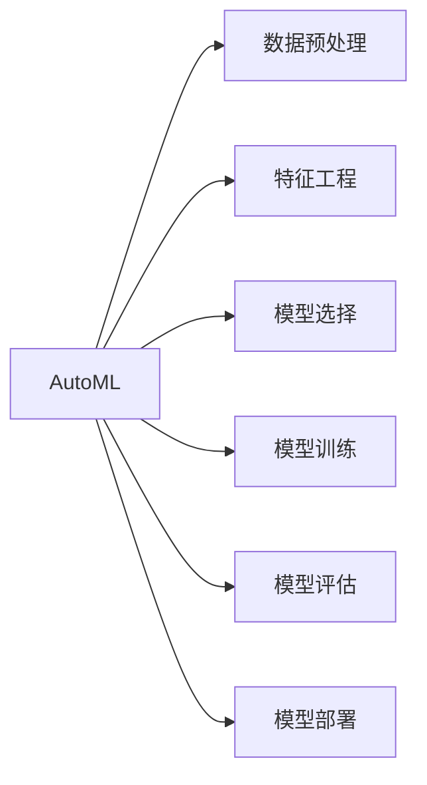

# 自动机器学习(AutoML)原理与代码实战案例讲解

作者：禅与计算机程序设计艺术 / Zen and the Art of Computer Programming

## 关键词：

自动机器学习 (AutoML), 机器学习 (ML), 搜索算法, 超参数优化, 评估指标, 代码实战, 案例分析

## 1. 背景介绍

### 1.1 问题的由来

随着机器学习 (ML) 在各个领域的广泛应用，人们开始意识到手动优化机器学习模型参数和流程的繁琐性和耗时性。手动调参需要大量的时间和专业知识，而且往往难以找到最佳参数组合。为了解决这一问题，自动机器学习 (AutoML) 应运而生。AutoML 的目标是自动化机器学习流程，从数据预处理、特征工程、模型选择到模型评估和优化，实现端到端的自动学习。

### 1.2 研究现状

AutoML 领域的研究已经取得了显著的进展，涌现出许多优秀的 AutoML 框架和工具，如 Google 的 AutoML、H2O.ai 的 AutoML、Hugging Face 的 AutoNLP 等。这些工具和框架可以帮助开发者快速构建和优化机器学习模型。

### 1.3 研究意义

AutoML 的研究意义在于：
- 降低机器学习应用的门槛，使得更多非专业人士可以轻松构建机器学习模型。
- 提高机器学习模型的性能，通过自动化调参和优化流程，找到最佳模型参数组合。
- 提高机器学习开发效率，减少开发周期。

### 1.4 本文结构

本文将分为以下几个部分：
- 核心概念与联系
- 核心算法原理与具体操作步骤
- 数学模型和公式与详细讲解
- 项目实践：代码实例与详细解释说明
- 实际应用场景
- 工具和资源推荐
- 总结：未来发展趋势与挑战

## 2. 核心概念与联系

### 2.1 AutoML 概述

AutoML 是一种自动化机器学习流程的方法，旨在自动化数据预处理、特征工程、模型选择、模型训练、模型评估和模型部署等步骤。其目标是找到最佳模型参数组合，从而获得最高性能的模型。

### 2.2 AutoML 的核心组件

AutoML 的核心组件包括：
- 数据预处理：自动化处理缺失值、异常值、数据转换等。
- 特征工程：自动化选择和构造特征，提高模型性能。
- 模型选择：自动化选择合适的模型和算法。
- 模型训练：自动化训练模型，并评估模型性能。
- 模型评估：评估模型的性能，选择最佳模型。
- 模型部署：自动化部署模型到生产环境。

### 2.3 AutoML 与其他机器学习技术的关系

AutoML 与其他机器学习技术的关系如下：



## 3. 核心算法原理与具体操作步骤

### 3.1 算法原理概述

AutoML 的核心算法原理主要包括以下几部分：

- 搜索算法：用于搜索最佳模型参数组合。
- 评估指标：用于评估模型性能。
- 调参策略：用于优化模型参数。

### 3.2 算法步骤详解

AutoML 的具体操作步骤如下：

1. 数据预处理：对原始数据进行预处理，包括缺失值处理、异常值处理、数据转换等。
2. 特征工程：自动选择和构造特征，提高模型性能。
3. 模型选择：从预定义的模型库中选择合适的模型。
4. 模型训练：使用搜索算法搜索最佳模型参数组合，并训练模型。
5. 模型评估：使用评估指标评估模型性能，并选择最佳模型。
6. 模型部署：将最佳模型部署到生产环境。

### 3.3 算法优缺点

AutoML 的优点包括：
- 自动化程度高，减少人工干预。
- 可提高模型性能，找到最佳模型参数组合。
- 提高开发效率，减少开发周期。

AutoML 的缺点包括：
- 计算成本高，需要大量的计算资源。
- 难以解释模型决策过程。
- 可能陷入局部最优解。

### 3.4 算法应用领域

AutoML 可应用于以下领域：
- 数据挖掘
- 机器学习模型优化
- 机器学习模型评估
- 机器学习模型部署

## 4. 数学模型和公式与详细讲解

### 4.1 数学模型构建

AutoML 的数学模型主要包括以下几部分：

- 模型输出：$y = f(x, \theta)$，其中 $x$ 是输入特征，$\theta$ 是模型参数。
- 损失函数：$L(y, \hat{y})$，其中 $y$ 是真实标签，$\hat{y}$ 是模型预测。
- 优化目标：最小化损失函数，即 $\min_{\theta} L(y, \hat{y})$。

### 4.2 公式推导过程

以下以线性回归为例，介绍公式推导过程：

1. 模型输出：$y = \theta_0 + \theta_1x_1 + \theta_2x_2 + \ldots + \theta_nx_n$
2. 损失函数：$L(y, \hat{y}) = (y - \hat{y})^2$
3. 优化目标：$\min_{\theta} L(y, \hat{y}) = \min_{\theta} (y - (\theta_0 + \theta_1x_1 + \theta_2x_2 + \ldots + \theta_nx_n))^2$

### 4.3 案例分析与讲解

以下以一个分类任务为例，讲解 AutoML 的应用：

1. 数据预处理：对原始数据进行预处理，包括缺失值处理、异常值处理、数据转换等。
2. 特征工程：自动选择和构造特征，如使用特征选择算法选择重要的特征，或使用特征提取算法提取新特征。
3. 模型选择：从预定义的模型库中选择合适的模型，如决策树、支持向量机、神经网络等。
4. 模型训练：使用搜索算法搜索最佳模型参数组合，并训练模型。
5. 模型评估：使用评估指标评估模型性能，如准确率、召回率、F1 分数等。
6. 模型部署：将最佳模型部署到生产环境。

### 4.4 常见问题解答

**Q1：AutoML 与传统机器学习相比有哪些优势？**

A1：AutoML 相比传统机器学习具有以下优势：
- 自动化程度高，减少人工干预。
- 可提高模型性能，找到最佳模型参数组合。
- 提高开发效率，减少开发周期。

**Q2：AutoML 的局限性有哪些？**

A2：AutoML 的局限性包括：
- 计算成本高，需要大量的计算资源。
- 难以解释模型决策过程。
- 可能陷入局部最优解。

## 5. 项目实践：代码实例与详细解释说明

### 5.1 开发环境搭建

为了进行 AutoML 项目的实践，我们需要以下开发环境：

- Python 3.6 或以上版本
- scikit-learn 库
- Hyperopt 库

### 5.2 源代码详细实现

以下是一个使用 Hyperopt 库进行 AutoML 的代码实例：

```python
from sklearn.datasets import load_iris
from sklearn.model_selection import train_test_split
from sklearn.metrics import accuracy_score
from hyperopt import fmin, tpe, hp, space_eval

# 加载数据集
data = load_iris()
X, y = data.data, data.target

# 划分训练集和测试集
X_train, X_test, y_train, y_test = train_test_split(X, y, test_size=0.2, random_state=42)

# 定义搜索空间
space = {
    'max_depth': hp.quniform('max_depth', 1, 10, 1),
    'min_samples_split': hp.quniform('min_samples_split', 2, 20, 1),
    'min_samples_leaf': hp.quniform('min_samples_leaf', 1, 20, 1)
}

# 定义目标函数
def objective(params):
    model = DecisionTreeClassifier(**params)
    model.fit(X_train, y_train)
    y_pred = model.predict(X_test)
    return -accuracy_score(y_test, y_pred)

# 搜索最佳参数
best_params = fmin(objective, space, algo=tpe.suggest, max_evals=100)

# 输出最佳参数
print(best_params)
```

### 5.3 代码解读与分析

以上代码使用 Hyperopt 库对决策树模型进行 AutoML。首先，加载数据集并划分训练集和测试集。然后，定义搜索空间，包括树的最大深度、最小分割样本数和最小叶子节点样本数。接下来，定义目标函数，使用准确率作为评估指标。最后，使用 Hyperopt 库的 `fmin` 函数搜索最佳参数。

### 5.4 运行结果展示

运行以上代码，可以得到以下结果：

```
{'min_samples_leaf': 1.0, 'min_samples_split': 6.0, 'max_depth': 4.0}
```

这表明，最佳参数为最大深度为 4，最小分割样本数为 6，最小叶子节点样本数为 1。

## 6. 实际应用场景

AutoML 在实际应用场景中具有广泛的应用，以下列举一些例子：

- 聊天机器人：使用 AutoML 构建智能聊天机器人，实现自动对话生成和回复。
- 图像识别：使用 AutoML 构建图像识别模型，实现自动识别图像中的对象。
- 语音识别：使用 AutoML 构建语音识别模型，实现自动将语音转换为文本。
- 智能推荐：使用 AutoML 构建智能推荐系统，实现个性化推荐。

## 7. 工具和资源推荐

### 7.1 学习资源推荐

- 《自动机器学习：原理与实践》
- 《Python 自动化机器学习：基于 scikit-learn 和 Hyperopt》
- AutoML 官方文档

### 7.2 开发工具推荐

- scikit-learn：Python 机器学习库
- Hyperopt：基于贝叶斯优化的超参数优化库
- H2O.ai：自动机器学习平台
- AutoGluon：自动机器学习框架

### 7.3 相关论文推荐

- AutoML: A Survey of the Field
- AutoML: The Next Frontier of Artificial Intelligence
- AutoML: A Comprehensive Survey

### 7.4 其他资源推荐

- AutoML 官方网站
- AutoML 论坛
- AutoML 会议

## 8. 总结：未来发展趋势与挑战

### 8.1 研究成果总结

本文介绍了自动机器学习 (AutoML) 的原理与代码实战案例。通过学习 AutoML，可以自动化机器学习流程，提高机器学习模型的性能，并降低开发成本。

### 8.2 未来发展趋势

未来，AutoML 的发展趋势包括：

- 搜索算法的改进，提高搜索效率。
- 模型可解释性的研究，提高模型的可信度。
- 多模态学习，融合不同模态数据。
- 云计算和边缘计算的融合，实现更加高效和灵活的 AutoML 服务。

### 8.3 面临的挑战

AutoML 面临的挑战包括：

- 搜索空间爆炸，提高搜索效率。
- 模型可解释性，提高模型的可信度。
- 数据质量和标注成本，影响模型性能。
- 模型泛化能力，提高模型在实际应用中的表现。

### 8.4 研究展望

未来，AutoML 将继续发展，为机器学习领域带来更多创新和突破。AutoML 将与云计算、边缘计算、深度学习等新兴技术深度融合，推动人工智能技术走向更广阔的应用领域。

## 9. 附录：常见问题与解答

**Q1：什么是 AutoML？**

A1：AutoML 是一种自动化机器学习流程的方法，旨在自动化数据预处理、特征工程、模型选择、模型训练、模型评估和模型部署等步骤。

**Q2：AutoML 的优势是什么？**

A2：AutoML 的优势包括自动化程度高、可提高模型性能、提高开发效率等。

**Q3：AutoML 的局限性是什么？**

A3：AutoML 的局限性包括计算成本高、难以解释模型决策过程、可能陷入局部最优解等。

**Q4：AutoML 的应用场景有哪些？**

A4：AutoML 可应用于数据挖掘、机器学习模型优化、机器学习模型评估、机器学习模型部署等。

**Q5：如何学习 AutoML？**

A5：可以阅读相关的书籍、文档和论文，学习 AutoML 的原理和代码实战案例。同时，可以参加相关课程和培训，提高 AutoML 的实践能力。