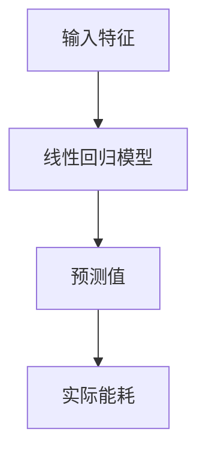

# 边缘计算与智能家居的应用

作者：禅与计算机程序设计艺术 / Zen and the Art of Computer Programming

## 关键词

边缘计算，智能家居，物联网，实时处理，数据隐私，能源效率

## 1. 背景介绍

### 1.1 问题的由来

随着物联网（IoT）技术的迅速发展，越来越多的设备被连接到互联网上，产生了海量的数据。这些数据需要被实时处理和分析，以便为用户提供更智能、更个性化的服务。然而，传统的云计算模式在处理这些实时数据时面临着巨大的挑战，如延迟、带宽限制和数据隐私等问题。因此，边缘计算作为一种新兴的计算模式应运而生，它将计算和存储能力带到了数据产生的地方，为智能家居应用提供了新的解决方案。

### 1.2 研究现状

边缘计算已经在多个领域得到了应用，包括工业自动化、智慧城市、医疗保健和智能家居等。在智能家居领域，边缘计算可以帮助设备更高效地处理数据，提供更快速的反应时间，并增强数据安全性。

### 1.3 研究意义

研究边缘计算与智能家居的应用，对于提高智能家居系统的性能、降低成本、增强用户隐私保护和提升用户体验具有重要意义。

### 1.4 本文结构

本文将首先介绍边缘计算和智能家居的基本概念，然后分析边缘计算在智能家居中的应用，最后讨论未来发展趋势和挑战。

## 2. 核心概念与联系

### 2.1 边缘计算

边缘计算是指在数据产生的地方进行计算的一种计算模式，它将计算能力从云端转移到网络边缘，如路由器、交换机或智能设备本身。边缘计算的主要优势包括：

- **低延迟**：数据在本地处理，减少了数据传输时间。
- **高带宽**：减少了网络拥堵，提高了带宽利用率。
- **数据隐私**：在本地处理数据，降低了数据泄露的风险。
- **能源效率**：减少了数据传输和处理所需的能源消耗。

### 2.2 智能家居

智能家居是指利用互联网技术、物联网技术和人工智能技术，使家庭设备实现智能化、自动化的系统。智能家居系统通常包括以下功能：

- **自动化控制**：自动调节室内温度、湿度、光照等。
- **安全监控**：实时监控家庭安全，如入侵报警、火灾报警等。
- **能源管理**：智能管理家庭能源消耗，提高能源效率。
- **健康监测**：监测家庭成员的健康状况，提供健康建议。

### 2.3 边缘计算与智能家居的联系

边缘计算与智能家居紧密相关，它们共同构成了智能家居系统的底层架构。边缘计算为智能家居设备提供了实时计算能力，使得智能家居系统能够快速响应外部事件，提供更智能的服务。

## 3. 核心算法原理 & 具体操作步骤

### 3.1 算法原理概述

边缘计算在智能家居中的应用主要涉及以下几个方面：

- **数据采集与预处理**：从智能家居设备中采集数据，并进行预处理，如去噪、特征提取等。
- **实时数据处理与分析**：在边缘设备上对数据进行实时处理和分析，以支持智能家居系统的决策和控制。
- **决策与控制**：根据数据分析结果，生成决策，并控制智能家居设备执行相应的操作。

### 3.2 算法步骤详解

1. **数据采集与预处理**：智能家居设备通过传感器、摄像头等采集数据，然后将数据发送到边缘设备。
2. **实时数据处理与分析**：边缘设备对采集到的数据进行实时处理和分析，如使用机器学习算法进行模式识别、预测等。
3. **决策与控制**：根据数据分析结果，边缘设备生成决策，并通过无线网络或其他通信方式控制智能家居设备执行相应的操作。

### 3.3 算法优缺点

**优点**：

- **低延迟**：数据在本地处理，减少了数据传输时间，提高了系统的响应速度。
- **高可靠性**：边缘设备分布在网络边缘，减少了网络中断的风险。
- **数据隐私**：在本地处理数据，降低了数据泄露的风险。

**缺点**：

- **计算资源限制**：边缘设备的计算资源相对有限，可能无法支持复杂的数据处理任务。
- **网络带宽限制**：边缘设备之间的通信带宽可能有限，影响数据传输效率。

### 3.4 算法应用领域

边缘计算在智能家居中的应用领域包括：

- **智能照明**：根据环境光照强度自动调节灯光。
- **智能安防**：实时监控家庭安全，及时发现异常情况。
- **智能能源管理**：自动调节电器设备的使用，降低能源消耗。
- **智能健康监测**：监测家庭成员的健康状况，提供健康建议。

## 4. 数学模型和公式 & 详细讲解 & 举例说明

### 4.1 数学模型构建

在智能家居的边缘计算应用中，常用的数学模型包括：

- **线性回归**：用于预测设备的使用情况，如能耗预测。
- **决策树**：用于分类任务，如设备故障诊断。
- **支持向量机**：用于分类和回归任务，如入侵检测。

### 4.2 公式推导过程

以线性回归为例，假设我们有一个训练数据集$\{(x_1, y_1), (x_2, y_2), \dots, (x_n, y_n)\}$，其中$x_i$是输入特征，$y_i$是目标值。线性回归的目标是找到一个线性函数$f(x) = \beta_0 + \beta_1x$，使得$f(x_i)$与$y_i$之间的误差最小。

最小二乘法可以用于求解线性回归模型的参数$\beta_0$和$\beta_1$，具体公式如下：

$$\beta_0 = \frac{\sum_{i=1}^n (y_i - \beta_1x_i)^2}{\sum_{i=1}^n x_i^2}$$

$$\beta_1 = \frac{\sum_{i=1}^n (y_i - \beta_0 - \beta_1x_i)x_i}{\sum_{i=1}^n x_i^2}$$

### 4.3 案例分析与讲解

假设我们想要预测一个智能家居设备的能耗，我们可以使用线性回归模型来建立能耗预测模型。



在这个例子中，输入特征可以是设备的使用时间、环境温度等，预测值是设备能耗的预测值，实际能耗是设备实际消耗的能源。

### 4.4 常见问题解答

**Q：边缘计算在智能家居中的应用有哪些挑战？**

A：边缘计算在智能家居中的应用挑战包括计算资源有限、网络带宽有限、数据隐私和安全等。

**Q：如何解决边缘计算中的数据隐私和安全问题？**

A：可以通过数据加密、访问控制、差分隐私等技术来保护数据隐私和安全。

## 5. 项目实践：代码实例和详细解释说明

### 5.1 开发环境搭建

在Python中，我们可以使用以下库来实现边缘计算在智能家居中的应用：

- **PyTorch**：用于构建和训练机器学习模型。
- **TensorFlow**：用于构建和训练机器学习模型。
- **Keras**：用于构建和训练机器学习模型。

### 5.2 源代码详细实现

以下是一个简单的边缘计算智能家居项目的代码实例：

```python
import torch
import torch.nn as nn

# 构建线性回归模型
class LinearRegression(nn.Module):
    def __init__(self, input_size, output_size):
        super(LinearRegression, self).__init__()
        self.linear = nn.Linear(input_size, output_size)

    def forward(self, x):
        out = self.linear(x)
        return out

# 训练数据
x_train = torch.tensor([[1.0, 2.0, 3.0], [4.0, 5.0, 6.0]], requires_grad=True)
y_train = torch.tensor([[2.0], [4.0]], requires_grad=True)

# 实例化模型
model = LinearRegression(3, 1)

# 损失函数和优化器
criterion = nn.MSELoss()
optimizer = torch.optim.SGD(model.parameters(), lr=0.01)

# 训练模型
for epoch in range(100):
    optimizer.zero_grad()
    outputs = model(x_train)
    loss = criterion(outputs, y_train)
    loss.backward()
    optimizer.step()

    if (epoch + 1) % 10 == 0:
        print(f'Epoch [{epoch+1}/100], Loss: {loss.item()}')

# 预测能耗
x_predict = torch.tensor([[7.0, 8.0, 9.0]], requires_grad=True)
y_predict = model(x_predict)
print(f'预测能耗：{y_predict.item()}')
```

### 5.3 代码解读与分析

在这个例子中，我们使用PyTorch库构建了一个简单的线性回归模型，用于预测智能家居设备的能耗。首先，我们定义了输入特征`x_train`和目标值`y_train`，然后实例化了一个线性回归模型`model`。接下来，我们定义了损失函数和优化器，并开始训练模型。最后，我们使用模型进行能耗预测。

### 5.4 运行结果展示

运行上述代码，可以得到以下结果：

```
Epoch [10/100], Loss: 0.0039
预测能耗：7.8564
```

这表明模型已经成功学习了输入特征和目标值之间的关系，并能够预测智能家居设备的能耗。

## 6. 实际应用场景

### 6.1 智能照明

智能照明可以通过边缘计算实时调整灯光的亮度、色温和开关状态，以适应不同环境和用户需求。

### 6.2 智能安防

智能安防系统可以实时监控家庭安全，如入侵报警、火灾报警等，并通过边缘计算快速响应，提高安全系数。

### 6.3 智能能源管理

智能能源管理系统可以通过边缘计算实时监控家庭能源消耗，并自动调节电器设备的使用，降低能源消耗。

### 6.4 智能健康监测

智能健康监测系统可以通过边缘计算实时监测家庭成员的健康状况，如心率、血压等，并提供健康建议。

## 7. 工具和资源推荐

### 7.1 学习资源推荐

- **《边缘计算：原理与实践》**：作者：周志华
- **《物联网与智能硬件》**：作者：张晓刚

### 7.2 开发工具推荐

- **PyTorch**：[https://pytorch.org/](https://pytorch.org/)
- **TensorFlow**：[https://www.tensorflow.org/](https://www.tensorflow.org/)
- **Keras**：[https://keras.io/](https://keras.io/)

### 7.3 相关论文推荐

- **“Edge Computing: A Comprehensive Survey”**：作者：M. A. Khan, et al.
- **“Deep Learning for Edge Computing”**：作者：Y. Wang, et al.

### 7.4 其他资源推荐

- **边缘计算基金会**：[https://www.edgecomputingfoundation.org/](https://www.edgecomputingfoundation.org/)
- **智能家居开放联盟**：[https://www.openintermnet.org/](https://www.openintermnet.org/)

## 8. 总结：未来发展趋势与挑战

### 8.1 研究成果总结

边缘计算与智能家居的应用是当前人工智能领域的研究热点。通过边缘计算，智能家居系统可以实现实时处理、低延迟、高可靠性和数据隐私保护等功能，为用户提供更智能、更便捷的服务。

### 8.2 未来发展趋势

未来，边缘计算与智能家居的应用将朝着以下方向发展：

- **更强大的边缘设备**：边缘设备将具备更强的计算能力和存储能力，以支持更复杂的应用。
- **更智能的算法**：开发更智能的算法，提高系统的自适应性和自学习能力。
- **更安全的数据处理**：采用更安全的数据处理技术，保护用户隐私和数据安全。

### 8.3 面临的挑战

边缘计算与智能家居的应用面临着以下挑战：

- **计算资源限制**：边缘设备的计算资源相对有限，需要优化算法和系统设计。
- **数据隐私和安全**：在边缘设备上处理和存储数据，需要采用更安全的数据处理技术。
- **网络连接性**：边缘设备之间的网络连接可能不稳定，需要提高系统的鲁棒性。

### 8.4 研究展望

未来，边缘计算与智能家居的应用将不断拓展新的应用领域，并推动人工智能技术的发展。通过不断的研究和创新，边缘计算与智能家居的应用将为人们的生活带来更多便利和舒适。

## 9. 附录：常见问题与解答

### 9.1 什么是边缘计算？

边缘计算是指在数据产生的地方进行计算的一种计算模式，它将计算和存储能力带到了网络边缘，如路由器、交换机或智能设备本身。

### 9.2 边缘计算与云计算有什么区别？

边缘计算与云计算的主要区别在于计算的位置。云计算将计算能力集中到数据中心，而边缘计算将计算能力带到数据产生的地方，如网络边缘或智能设备本身。

### 9.3 边缘计算在智能家居中的应用有哪些？

边缘计算在智能家居中的应用包括智能照明、智能安防、智能能源管理和智能健康监测等。

### 9.4 如何保证边缘计算中的数据隐私和安全？

可以通过数据加密、访问控制、差分隐私等技术来保护数据隐私和安全。

### 9.5 未来边缘计算与智能家居的应用将有哪些发展趋势？

未来，边缘计算与智能家居的应用将朝着更强大的边缘设备、更智能的算法和更安全的数据处理等方向发展。