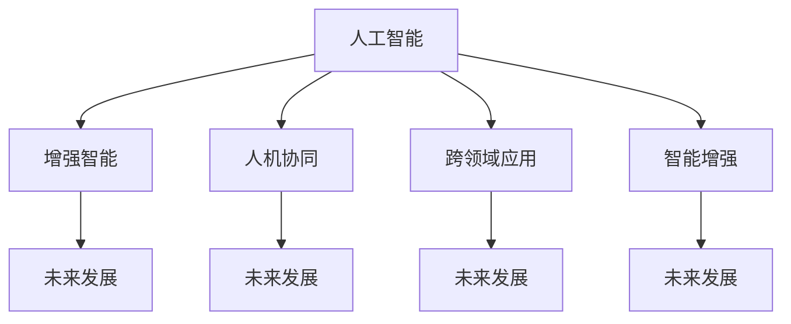

                 

# 人类-AI协作：增强人类潜能与AI能力的融合发展前景

> 关键词：人类-AI协作,增强人类潜能,智能增强,人机协同,机器学习,深度学习,神经网络,人工通用智能,跨领域应用,未来发展

## 1. 背景介绍

### 1.1 问题由来
随着人工智能(AI)技术的迅猛发展，人类与AI系统的互动和协作正在成为推动社会进步的重要力量。在工业制造、医疗健康、教育培训、金融服务等多个领域，AI技术的深入应用，不仅大幅提升了工作效率和质量，还创造了巨大的经济和社会价值。然而，AI技术的进步并非独立于人类智能存在，而是与人类智能密切相关，共同演进。

人类-AI协作的核心在于充分发挥各自的优势，通过互利共赢的方式，实现最优的整体性能提升。而AI能力的增强，不仅依赖于技术的持续进步，更在于如何与人类潜能深度融合，实现更广泛、更深入的协同应用。

### 1.2 问题核心关键点
本节将从几个关键点出发，深入探讨人类-AI协作在增强人类潜能与AI能力融合发展中的前景：

1. **跨领域应用**：AI技术在不同领域的广泛应用，如何实现与人类智能的协作，提升跨领域的协同效应。
2. **智能增强**：如何通过AI技术的辅助，增强人类的感知、决策和执行能力，实现智能增强。
3. **人机协同**：人机协作中的机制和策略，如何构建更高效、更灵活的协同系统。
4. **未来展望**：AI能力增强在教育、医疗、企业、社会治理等领域的未来应用前景。
5. **挑战与对策**：当前人机协作中存在的问题及解决策略。

## 2. 核心概念与联系

### 2.1 核心概念概述

为更好地理解人类-AI协作，本节将介绍几个密切相关的核心概念：

- **人工智能(AI)**：使用算法和数据驱动计算机系统进行智能任务处理的技术。
- **增强智能(AI-Enhanced Intelligence)**：通过AI技术增强人类感知、决策、执行等智能能力的过程。
- **人机协同**：将人类智能与AI技术相结合，形成高效协作的系统。
- **跨领域应用**：AI技术在多个领域的应用及与人类的协同提升。
- **智能增强**：利用AI技术提升人类的认知能力、创造力和判断力。
- **未来发展**：AI能力增强的长期趋势及其对社会进步的影响。

这些核心概念之间的关系可以通过以下Mermaid流程图来展示：



这个流程图展示的核心概念及其之间的联系：

1. **人工智能**：AI技术的发展是增强智能和跨领域应用的基础。
2. **增强智能**：通过AI技术，提升人类的感知、决策和执行能力。
3. **人机协同**：AI技术与人类智能的结合，实现高效协作。
4. **跨领域应用**：AI技术在多个领域的应用及与人类的协作。
5. **智能增强**：通过AI技术提升人类的智能水平。
6. **未来发展**：AI能力增强的长期趋势及其对社会进步的影响。

## 3. 核心算法原理 & 具体操作步骤

### 3.1 算法原理概述

人类-AI协作的核心算法原理，在于通过AI技术与人类智能的有机结合，实现更高效、更灵活、更智能的协同工作。具体来说，AI技术在以下几个方面对人类潜能进行增强：

1. **感知增强**：通过AI技术的辅助，提升人类的视觉、听觉、触觉等感官的感知能力。
2. **决策增强**：利用AI算法，帮助人类进行更快速、更准确的决策分析。
3. **执行增强**：借助AI技术，优化人类的执行效率，减少错误和延误。
4. **学习增强**：通过AI技术的辅助，加速人类的学习和知识获取过程。

### 3.2 算法步骤详解

基于上述原理，人类-AI协作的算法步骤可以总结如下：

**Step 1: 数据准备**
- 收集领域相关的数据集，包括标注数据、无标注数据、半标注数据等。
- 对数据进行清洗、标注和预处理，确保数据质量和可用性。

**Step 2: 模型选择与设计**
- 选择适合的AI模型，如神经网络、深度学习、强化学习等。
- 根据任务需求，设计模型结构和超参数，确保模型的泛化能力和性能。

**Step 3: 模型训练**
- 使用收集到的数据集，对AI模型进行训练。
- 采用监督学习、无监督学习、半监督学习等方法，提升模型的准确性和鲁棒性。

**Step 4: 协同系统设计**
- 设计人机交互界面，优化AI与人类之间的信息传递和反馈机制。
- 构建协同任务流程，明确各方的责任和协作方式。

**Step 5: 系统部署与评估**
- 将训练好的模型部署到实际应用场景中，进行性能测试和优化。
- 通过反馈机制不断调整和改进，确保系统稳定高效运行。

### 3.3 算法优缺点

人类-AI协作中的算法具有以下优点：

1. **高效协同**：AI技术与人类智能的结合，可以实现更高的工作效率和质量。
2. **灵活适应**：AI系统可以根据不同场景和任务，灵活调整和优化，适应性强。
3. **创新驱动**：AI技术的不断进步，推动人类思维模式的创新和变革。

同时，该算法也存在以下局限性：

1. **数据依赖**：AI模型的性能很大程度上依赖于数据的质量和数量，数据获取成本较高。
2. **复杂性高**：人机协同系统的设计和实现较为复杂，需要多学科的协作和知识整合。
3. **伦理风险**：AI系统的决策过程可能存在偏见和误导，影响人类对AI的信任和接受度。
4. **技术壁垒**：对技术门槛和专业技能的要求较高，一般需要多领域专家共同参与。

### 3.4 算法应用领域

人类-AI协作的算法在多个领域得到了广泛应用，例如：

- **工业制造**：在机器人控制、质量检测、工艺优化等方面，利用AI技术提升生产效率和产品质量。
- **医疗健康**：在医学影像分析、疾病诊断、个性化治疗等方面，通过AI技术辅助医生进行精准诊断和治疗。
- **教育培训**：在智能辅导、学习推荐、知识图谱等方面，利用AI技术提升教学质量和学生体验。
- **金融服务**：在风险评估、欺诈检测、投资分析等方面，通过AI技术提升金融服务的智能化水平。
- **社会治理**：在城市管理、公共安全、环境保护等方面，利用AI技术提升政府治理能力和社会福祉。

## 4. 数学模型和公式 & 详细讲解 & 举例说明

### 4.1 数学模型构建

人类-AI协作的数学模型，通常包括输入、输出、模型参数和损失函数等要素。以神经网络模型为例，其一般形式如下：

$$ y = f(x; \theta) $$

其中，$x$ 为输入数据，$y$ 为输出结果，$\theta$ 为模型参数，$f$ 为网络结构映射函数。

在实际应用中，神经网络模型通常使用监督学习方法进行训练，目标是最小化损失函数：

$$ \mathcal{L}(\theta) = \frac{1}{N} \sum_{i=1}^N \ell(y_i, f(x_i; \theta)) $$

其中，$\ell$ 为损失函数，通常包括交叉熵损失、均方误差损失等。

### 4.2 公式推导过程

以交叉熵损失函数为例，其推导过程如下：

假设模型输出为 $\hat{y} \in [0,1]$，真实标签为 $y \in \{0,1\}$，则二分类交叉熵损失函数定义为：

$$ \ell(y, \hat{y}) = -[y\log \hat{y} + (1-y)\log(1-\hat{y})] $$

将其代入经验风险公式，得：

$$ \mathcal{L}(\theta) = -\frac{1}{N}\sum_{i=1}^N [y_i\log \hat{y}_i+(1-y_i)\log(1-\hat{y}_i)] $$

根据链式法则，损失函数对参数 $\theta_k$ 的梯度为：

$$ \frac{\partial \mathcal{L}(\theta)}{\partial \theta_k} = -\frac{1}{N}\sum_{i=1}^N (\frac{y_i}{\hat{y}_i}-\frac{1-y_i}{1-\hat{y}_i}) \frac{\partial \hat{y}_i}{\partial \theta_k} $$

其中 $\frac{\partial \hat{y}_i}{\partial \theta_k}$ 可进一步递归展开，利用反向传播算法完成计算。

### 4.3 案例分析与讲解

以图像识别任务为例，使用卷积神经网络(CNN)对数据集进行训练。假设模型输入为 $x \in \mathbb{R}^d$，输出为 $y \in \{0,1\}$，模型结构为多层卷积-池化-全连接网络。模型训练的目标是最小化交叉熵损失函数：

$$ \mathcal{L}(\theta) = -\frac{1}{N}\sum_{i=1}^N [y_i\log f(x_i; \theta)+(1-y_i)\log(1-f(x_i; \theta))] $$

其中 $f(x_i; \theta)$ 为神经网络模型的输出结果。

使用随机梯度下降算法进行优化，更新模型参数 $\theta$：

$$ \theta \leftarrow \theta - \eta \nabla_{\theta}\mathcal{L}(\theta) $$

其中 $\eta$ 为学习率，$\nabla_{\theta}\mathcal{L}(\theta)$ 为损失函数对参数 $\theta$ 的梯度。

通过上述过程，模型能够在训练集上学习到图像分类的知识，并在测试集上实现高精度的图像识别。

## 5. 项目实践：代码实例和详细解释说明

### 5.1 开发环境搭建

在进行项目实践前，我们需要准备好开发环境。以下是使用Python进行TensorFlow开发的环境配置流程：

1. 安装Anaconda：从官网下载并安装Anaconda，用于创建独立的Python环境。

2. 创建并激活虚拟环境：
```bash
conda create -n tf-env python=3.8 
conda activate tf-env
```

3. 安装TensorFlow：根据CUDA版本，从官网获取对应的安装命令。例如：
```bash
conda install tensorflow=2.6.0 -c conda-forge
```

4. 安装各类工具包：
```bash
pip install numpy pandas scikit-learn matplotlib tqdm jupyter notebook ipython
```

完成上述步骤后，即可在`tf-env`环境中开始项目实践。

### 5.2 源代码详细实现

下面我们以图像识别任务为例，给出使用TensorFlow对CNN模型进行训练的PyTorch代码实现。

首先，定义CNN模型的输入、输出和损失函数：

```python
import tensorflow as tf
from tensorflow.keras import layers

# 定义模型输入
inputs = tf.keras.Input(shape=(32, 32, 3), name='inputs')

# 定义模型结构
x = layers.Conv2D(32, (3, 3), activation='relu', padding='same')(inputs)
x = layers.MaxPooling2D((2, 2))(x)
x = layers.Conv2D(64, (3, 3), activation='relu', padding='same')(x)
x = layers.MaxPooling2D((2, 2))(x)
x = layers.Flatten()(x)
x = layers.Dense(1024, activation='relu')(x)
outputs = layers.Dense(1, activation='sigmoid')(x)

# 定义损失函数
loss_fn = tf.keras.losses.BinaryCrossentropy(from_logits=True)
```

然后，定义模型训练函数：

```python
def train_step(x, y):
    with tf.GradientTape() as tape:
        logits = model(x, training=True)
        loss_value = loss_fn(y, logits)
    gradients = tape.gradient(loss_value, model.trainable_variables)
    optimizer.apply_gradients(zip(gradients, model.trainable_variables))

# 定义训练循环
for epoch in range(epochs):
    for x, y in train_dataset:
        train_step(x, y)
    for x, y in dev_dataset:
        val_loss = loss_fn(y, model(x, training=False)).numpy()
        print(f'Epoch {epoch+1}, validation loss: {val_loss:.4f}')
```

最后，启动训练流程并在测试集上评估：

```python
epochs = 10

for epoch in range(epochs):
    for x, y in train_dataset:
        train_step(x, y)
    for x, y in dev_dataset:
        val_loss = loss_fn(y, model(x, training=False)).numpy()
        print(f'Epoch {epoch+1}, validation loss: {val_loss:.4f}')
        
print('Finished training')
```

以上就是使用TensorFlow对CNN模型进行图像识别任务训练的完整代码实现。可以看到，借助TensorFlow的高效图形计算能力，模型的训练过程变得简洁高效。

### 5.3 代码解读与分析

让我们再详细解读一下关键代码的实现细节：

**model定义**：
- `inputs`：定义模型的输入，形状为(32, 32, 3)。
- `x`：依次经过卷积层、池化层和全连接层，构建模型结构。
- `outputs`：定义模型的输出，使用sigmoid激活函数。

**loss_fn定义**：
- `loss_fn`：定义二元交叉熵损失函数，从logits输出进行计算。

**train_step函数**：
- 在每个训练步骤中，使用`tf.GradientTape`对损失函数进行梯度计算。
- 计算损失梯度，并使用`optimizer`进行参数更新。

**训练循环**：
- 每个epoch中，对训练集进行一次完整训练。
- 对验证集进行损失计算，并输出验证集损失。

可以看到，TensorFlow的简洁高效的API设计，使得模型的构建、训练和评估变得非常直观。

## 6. 实际应用场景

### 6.1 智能制造

在智能制造领域，人类-AI协作的应用非常广泛。通过AI技术，可以实现从生产计划到物料管理、从质量检测到故障预测的全流程智能化。

具体来说，利用AI技术对生产数据进行实时分析和预测，可以优化生产计划、降低物料损耗、提高产品质量。在质量检测方面，AI技术可以自动检测产品缺陷，提高检测效率和准确性。在故障预测方面，AI技术可以分析设备运行数据，预测设备故障，预防生产中断。

### 6.2 医疗健康

在医疗健康领域，AI技术可以大幅提升诊断和治疗的准确性和效率。通过AI技术，可以实现从病历分析到诊断辅助、从个性化治疗到手术辅助的全流程智能化。

具体来说，AI技术可以对海量的病历数据进行深度学习和分析，提取疾病的特征和模式，辅助医生进行疾病诊断和治疗方案设计。在手术辅助方面，AI技术可以生成虚拟手术模拟器，帮助医生进行手术前的模拟和练习，提高手术成功率。

### 6.3 智能交通

在智能交通领域，AI技术可以实现从智能调度到事故预防、从交通管理到驾驶辅助的全流程智能化。

具体来说，AI技术可以对交通流量进行实时监测和分析，优化交通调度，缓解交通拥堵。在事故预防方面，AI技术可以通过摄像头和传感器，实时监测道路情况，预测潜在的交通事故，提前采取预防措施。在驾驶辅助方面，AI技术可以通过自动驾驶技术，提高驾驶安全性和舒适度。

## 7. 工具和资源推荐

### 7.1 学习资源推荐

为了帮助开发者系统掌握人类-AI协作的理论基础和实践技巧，这里推荐一些优质的学习资源：

1. 《深度学习基础》课程：斯坦福大学开设的深度学习入门课程，涵盖深度学习的基本概念和经典模型。
2. 《人工智能导论》书籍：吴恩达教授所著，全面介绍了人工智能的基本原理和应用场景。
3. 《神经网络与深度学习》书籍：Michael Nielsen所著，深入浅出地介绍了神经网络的工作原理和优化算法。
4. CS231n《卷积神经网络》课程：斯坦福大学开设的计算机视觉入门课程，介绍了卷积神经网络的原理和应用。
5. ArXiv和IEEE Xplore：全球领先的科研论文平台，可以获取最新的AI研究论文和代码实现。

通过对这些资源的学习实践，相信你一定能够快速掌握人类-AI协作的精髓，并用于解决实际的AI应用问题。

### 7.2 开发工具推荐

高效的开发离不开优秀的工具支持。以下是几款用于人类-AI协作开发的常用工具：

1. TensorFlow：由Google主导开发的开源深度学习框架，生产部署方便，适合大规模工程应用。
2. PyTorch：基于Python的开源深度学习框架，灵活动态的计算图，适合快速迭代研究。
3. Keras：高层API，便于构建和训练深度学习模型，是深度学习入门的最佳选择。
4. Jupyter Notebook：交互式编程环境，方便实时调试和可视化模型训练过程。
5. GitHub：代码托管平台，方便版本控制和代码共享。
6. HuggingFace Transformers库：提供多种预训练语言模型和微调框架，大大简化模型训练过程。

合理利用这些工具，可以显著提升人类-AI协作任务的开发效率，加快创新迭代的步伐。

### 7.3 相关论文推荐

人类-AI协作技术的发展源于学界的持续研究。以下是几篇奠基性的相关论文，推荐阅读：

1. AlphaGo：深度学习和蒙特卡洛树搜索的结合，实现了人类级围棋智能。
2. DeepMind AlphaStar：深度学习和强化学习的结合，实现了人类级星际争霸智能。
3. DALL·E：生成对抗网络(GAN)与深度学习的结合，实现了图像生成和理解的新突破。
4. GPT-3：Transformer架构与大规模预训练语言模型的结合，实现了自然语言处理的新高峰。
5. Human-AI Collaboration in Medicine：人类与AI在医疗领域的协同工作，展示了AI技术在医疗健康中的应用潜力。

这些论文代表了大规模AI协作技术的发展脉络。通过学习这些前沿成果，可以帮助研究者把握学科前进方向，激发更多的创新灵感。

## 8. 总结：未来发展趋势与挑战

### 8.1 总结

本文对人类-AI协作的增强人类潜能与AI能力的融合发展前景进行了全面系统的介绍。首先阐述了人类-AI协作的核心理念和实际应用场景，明确了其在提升人类智能、优化AI技术方面的独特价值。其次，从原理到实践，详细讲解了人机协同的数学模型和关键步骤，给出了具体的应用案例。同时，本文还广泛探讨了人类-AI协作技术在多个行业领域的应用前景，展示了其广阔的发展空间。此外，本文精选了人类-AI协作技术的各类学习资源，力求为读者提供全方位的技术指引。

通过本文的系统梳理，可以看到，人类-AI协作技术的进步，正在逐步推动社会生产力的提升和人类思维模式的变革。AI能力增强在多个领域的应用，不仅提高了生产效率和质量，还激发了人类创新和创造的潜力。未来，随着AI技术的不断进步和人类-AI协作的深入发展，AI能力增强的潜力将得到进一步释放，带来更多的社会价值和经济效益。

### 8.2 未来发展趋势

展望未来，人类-AI协作技术将呈现以下几个发展趋势：

1. **智能化水平提升**：AI技术将在更多领域实现智能化，提升生产效率和质量。
2. **协作方式多样化**：人机协作将变得更加灵活多样，适应更多复杂任务。
3. **跨领域应用拓展**：AI技术将在更多领域实现应用，推动社会进步。
4. **伦理道德重视**：随着AI技术的广泛应用，伦理道德问题将成为重要研究方向。
5. **标准化和规范化**：人机协作的标准化将逐渐形成，确保系统的稳定性和可互操作性。

这些趋势将引领人类-AI协作技术进入新的发展阶段，为社会进步和人类福祉带来更多价值。

### 8.3 面临的挑战

尽管人类-AI协作技术取得了显著进展，但在迈向更加智能化、普适化应用的过程中，仍面临诸多挑战：

1. **数据隐私和安全**：AI系统的数据处理涉及大量个人隐私，如何保护数据安全和隐私，是一个重要课题。
2. **算法透明性和可解释性**：AI系统的决策过程往往缺乏透明性和可解释性，影响人类对AI的信任。
3. **伦理和社会影响**：AI系统的广泛应用可能带来伦理和社会问题，如就业替代、社会不平等等。
4. **技术壁垒和资源限制**：AI技术的应用需要高水平的技术和资源支持，如何降低技术壁垒，扩大应用范围，是重要任务。
5. **人机协同问题**：如何构建高效的人机协同系统，提升协同效率和效果，是一个重要研究方向。

这些挑战需要我们认真对待，并在技术、伦理、社会等多个层面进行综合考虑和应对。只有解决好这些问题，才能真正实现人类-AI协作技术的普及和应用。

### 8.4 研究展望

未来，人类-AI协作技术的研究将从以下几个方面进行深入探索：

1. **跨领域协同研究**：推动不同领域AI技术的发展和融合，提升协同效能。
2. **智能增强技术**：开发更加智能化的增强手段，提升人类认知和执行能力。
3. **伦理和社会研究**：深入研究AI系统的伦理和社会影响，制定相关规范和标准。
4. **人机协同机制**：研究人机协同的机制和策略，构建高效协作系统。
5. **标准化和规范化**：推动人机协同技术标准化和规范化，提升系统互操作性和兼容性。

这些研究方向将引领人类-AI协作技术迈向新的高度，为社会进步和人类福祉提供更多价值。

## 9. 附录：常见问题与解答

**Q1：人类-AI协作技术在哪些领域有应用前景？**

A: 人类-AI协作技术在多个领域都有广泛的应用前景，例如：

1. **工业制造**：通过AI技术优化生产计划、质量检测和故障预测，提升生产效率和产品质量。
2. **医疗健康**：利用AI技术辅助诊断和治疗，提升医疗服务的智能化水平。
3. **教育培训**：通过AI技术提供个性化辅导和学习推荐，提升教育质量和学习体验。
4. **金融服务**：使用AI技术进行风险评估和欺诈检测，提升金融服务的智能化水平。
5. **智能交通**：通过AI技术实现智能调度和事故预防，提升交通管理的智能化水平。

**Q2：如何构建高效的人机协同系统？**

A: 构建高效的人机协同系统，需要考虑以下几个方面：

1. **任务定义清晰**：明确各方的任务和责任，确保协同过程有条不紊。
2. **数据和算法透明**：确保人机双方对数据和算法有充分理解和信任，避免误解和误导。
3. **反馈机制完善**：建立及时的反馈机制，确保人机双方能够及时沟通和调整。
4. **技术支撑强大**：提供强大的技术支持，确保人机协同系统的稳定性和可靠性。
5. **伦理和社会规范**：制定伦理和社会规范，确保人机协同系统符合社会价值观和法律法规。

**Q3：如何应对人类-AI协作中的伦理挑战？**

A: 应对人类-AI协作中的伦理挑战，需要从以下几个方面进行考虑：

1. **数据隐私保护**：确保AI系统的数据处理符合隐私保护法规，保护个人隐私。
2. **算法透明性**：确保AI系统的决策过程透明，便于人类理解和监督。
3. **伦理审查机制**：建立伦理审查机制，对AI系统进行伦理审查和监管。
4. **社会影响评估**：评估AI系统对社会的影响，制定相关规范和标准。
5. **人机协作训练**：训练人机协同系统，确保其符合社会价值观和伦理道德。

这些措施将有助于构建负责任、公正、透明的AI系统，保障人机协作的顺利进行。

**Q4：人类-AI协作的未来发展方向是什么？**

A: 人类-AI协作的未来发展方向可以从以下几个方面进行探讨：

1. **智能化水平提升**：推动AI技术在更多领域的智能化，提升生产效率和质量。
2. **协作方式多样化**：实现更加灵活多样的人机协作方式，适应更多复杂任务。
3. **跨领域应用拓展**：推动AI技术在不同领域的融合，推动社会进步。
4. **伦理和社会影响研究**：深入研究AI系统的伦理和社会影响，制定相关规范和标准。
5. **技术标准化和规范化**：推动人机协同技术标准化和规范化，提升系统互操作性和兼容性。

这些研究方向将引领人类-AI协作技术迈向新的高度，为社会进步和人类福祉提供更多价值。

**Q5：人类-AI协作中的数据隐私和安全问题如何解决？**

A: 解决人类-AI协作中的数据隐私和安全问题，需要从以下几个方面进行考虑：

1. **数据加密**：对敏感数据进行加密处理，防止数据泄露。
2. **访问控制**：建立严格的访问控制机制，确保只有授权人员可以访问敏感数据。
3. **匿名化处理**：对数据进行匿名化处理，保护个人隐私。
4. **安全协议**：使用安全协议，确保数据传输的安全性。
5. **隐私保护法规**：遵守相关隐私保护法规，确保数据处理符合法律要求。

这些措施将有助于保护数据隐私和安全，确保人类-AI协作的顺利进行。

---

作者：禅与计算机程序设计艺术 / Zen and the Art of Computer Programming

