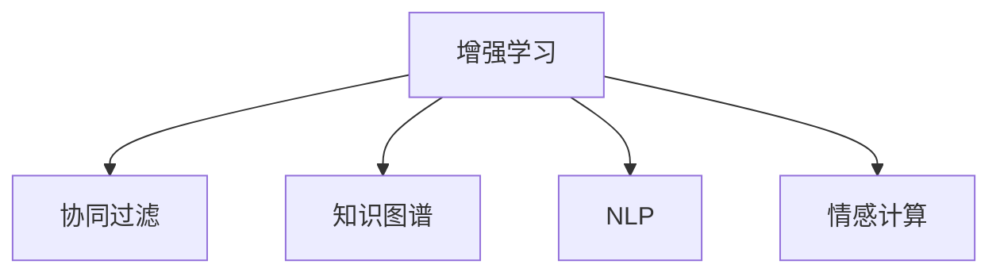

                 

# 人类-AI协作：增强人类潜能与AI能力的融合发展趋势预测与挑战

## 1. 背景介绍

### 1.1 问题由来

随着人工智能(AI)技术的飞速发展，人类与AI的协作正在逐渐从低级任务向高级任务拓展，从简单的自动化处理向复杂决策和创新性工作演进。AI已经从过去被视为单纯的工具，逐渐转变为能够增强人类潜能的伙伴。然而，这种协作关系的深入发展也伴随着诸多挑战和风险。本文旨在分析人类与AI协作的趋势，并探讨其面临的挑战。

### 1.2 问题核心关键点

当前，人类与AI的协作主要集中在以下几个关键领域：

- **自动化与辅助决策**：通过自动化处理数据、分析信息，AI在提高效率、减少错误等方面具有显著优势。
- **增强创意与创新**：AI在数据分析、模式识别、生成式创作等方面，能够为人类提供新的创意灵感和创新路径。
- **个性化与定制化**：AI能够根据用户的个性化需求提供定制化服务，如推荐系统、智能客服等。
- **协作与团队智能**：AI能够作为团队成员，协助人类完成更复杂的协作任务，如智能助手、多团队协同等。

这些领域的探索与实践，展现了AI在增强人类潜能方面的巨大潜力。然而，这种协作方式也带来了诸多挑战，如隐私保护、伦理道德、就业影响等。如何在充分利用AI技术的同时，平衡其对人类社会的积极与消极影响，成为当前技术发展的重要课题。

## 2. 核心概念与联系

### 2.1 核心概念概述

为更好地理解人类与AI协作的趋势，本文将介绍几个关键概念：

- **增强学习**：通过试错，使得AI能够从经验中学习，提升性能。
- **协同过滤**：通过分析用户行为，推荐系统能够提供个性化的信息。
- **知识图谱**：通过构建实体之间的关系网络，AI能够更好地理解和推理。
- **自然语言处理(NLP)**：使AI能够理解和生成自然语言，实现人机交互。
- **情感计算**：通过分析语音、文本中的情感信息，AI能够更好地理解用户情感。

这些概念共同构成了人类与AI协作的基石，使得AI能够逐步深入到人类社会各个层面，实现更广泛的应用。

### 2.2 核心概念原理和架构的 Mermaid 流程图



这个流程图展示了增强学习、协同过滤、知识图谱、NLP和情感计算等核心概念之间的联系。增强学习通过不断优化AI模型，提升其性能；协同过滤通过分析用户行为，提供个性化推荐；知识图谱通过构建实体关系，提升AI的推理能力；NLP使得AI能够理解和生成自然语言；情感计算则通过分析情感信息，增强AI对用户情绪的理解。这些技术协同工作，形成了完整的AI协作框架。

## 3. 核心算法原理 & 具体操作步骤

### 3.1 算法原理概述

人类与AI的协作，本质上是一种深度学习驱动的增强学习过程。其核心思想是通过不断地试错，使AI模型逐步优化，提升其在特定任务上的性能。这一过程通常包括以下几个步骤：

1. **数据收集**：收集大量相关领域的数据，用于训练AI模型。
2. **模型训练**：利用增强学习算法，对AI模型进行训练，提升其对数据的理解和处理能力。
3. **任务适配**：根据具体任务需求，调整AI模型参数，使其能够适应新的任务环境。
4. **模型评估**：对训练后的模型进行评估，确保其在实际应用中的表现。

### 3.2 算法步骤详解

以智能推荐系统为例，展示人类与AI协作的具体操作步骤：

1. **数据收集**：收集用户的历史行为数据，如浏览记录、购买历史等。
2. **模型训练**：使用协同过滤算法，分析用户行为，建立用户画像。
3. **任务适配**：根据用户画像和实时数据，调整推荐算法参数，提升推荐精度。
4. **模型评估**：在测试数据集上评估推荐系统性能，优化模型。

### 3.3 算法优缺点

人类与AI协作的增强学习范式具有以下优点：

- **高效性**：能够快速处理和分析大量数据，提升决策效率。
- **灵活性**：能够根据任务需求进行动态调整，适应不同的应用场景。
- **可扩展性**：能够应用于多个领域，如推荐、广告、医疗等。

同时，这种范式也存在一些局限：

- **数据依赖**：依赖于高质量的数据，数据量不足或质量不高，会影响模型性能。
- **过拟合风险**：模型容易过拟合训练数据，导致泛化能力差。
- **模型复杂度**：需要复杂的算法和大量的计算资源，训练成本高。

### 3.4 算法应用领域

人类与AI协作的增强学习范式，已经在多个领域得到了广泛应用，如：

- **电商推荐系统**：通过分析用户行为，推荐个性化商品，提升用户体验。
- **金融风险管理**：利用数据分析，识别潜在的金融风险，优化风险控制策略。
- **医疗诊断**：结合医疗数据和专家知识，提升诊断准确性和效率。
- **智能客服**：通过自然语言处理，提供24/7的客户服务，提升服务质量。
- **智能交通**：通过数据分析，优化交通流量，提升城市交通效率。

## 4. 数学模型和公式 & 详细讲解 & 举例说明

### 4.1 数学模型构建

以智能推荐系统为例，构建推荐模型的数学模型。设用户集合为 $U$，物品集合为 $I$，用户对物品的评分矩阵为 $R \in \mathbb{R}^{m \times n}$，其中 $m$ 为用户数，$n$ 为物品数。设物品的隐向量为 $x_i \in \mathbb{R}^d$，用户的隐向量为 $u_j \in \mathbb{R}^d$，其中 $d$ 为隐向量的维度。推荐模型可以通过协同过滤算法来预测用户对物品的评分 $r_{i,j}$，具体公式如下：

$$
r_{i,j} = u_j^T \cdot x_i + b
$$

其中 $b$ 为偏置项，$u_j^T \cdot x_i$ 为内积操作。

### 4.2 公式推导过程

推导协同过滤算法的优化目标函数，假设目标函数为均方误差，具体如下：

$$
\min_{\theta} \frac{1}{N} \sum_{(i,j) \in R} (r_{i,j} - u_j^T \cdot x_i)^2
$$

其中 $N$ 为训练样本数量。

通过反向传播算法，求出用户隐向量 $u_j$ 和物品隐向量 $x_i$ 的梯度，具体如下：

$$
\frac{\partial \mathcal{L}}{\partial u_j} = -2 \sum_{i=1}^N (r_{i,j} - u_j^T \cdot x_i) \cdot x_i
$$

$$
\frac{\partial \mathcal{L}}{\partial x_i} = -2 \sum_{j=1}^N (r_{i,j} - u_j^T \cdot x_i) \cdot u_j
$$

通过梯度下降算法，更新用户隐向量 $u_j$ 和物品隐向量 $x_i$，即可得到优化后的推荐模型。

### 4.3 案例分析与讲解

以电商推荐系统为例，展示基于协同过滤的推荐模型。在实际应用中，推荐系统需要处理海量数据，并实时计算推荐结果，因此需要采用分布式计算和高效的优化算法。在分布式计算方面，可以使用Spark等大数据处理框架；在优化算法方面，可以采用随机梯度下降算法或基于近似算法的协同过滤算法，如PMI-ICMF等。

## 5. 项目实践：代码实例和详细解释说明

### 5.1 开发环境搭建

在进行项目实践前，需要准备以下开发环境：

1. 安装Python 3.7及以上版本。
2. 安装TensorFlow 2.0及以上版本。
3. 安装Pandas、NumPy、Scikit-learn等数据处理库。
4. 安装TensorBoard，用于可视化训练过程。
5. 安装Jupyter Notebook，用于编写和调试代码。

### 5.2 源代码详细实现

以下是智能推荐系统的示例代码：

```python
import tensorflow as tf
import pandas as pd
import numpy as np
import time

# 加载数据
data = pd.read_csv('data.csv')

# 数据预处理
user_ids = data['user_id'].tolist()
item_ids = data['item_id'].tolist()
ratings = data['rating'].tolist()

# 构建模型
model = tf.keras.Sequential([
    tf.keras.layers.Dense(64, activation='relu', input_shape=(d,)),
    tf.keras.layers.Dense(1, activation='sigmoid')
])

# 编译模型
model.compile(optimizer='adam', loss='mse')

# 训练模型
model.fit(np.array(user_ids), np.array(ratings), epochs=10, validation_split=0.2)

# 模型评估
test_data = pd.read_csv('test_data.csv')
user_ids_test = test_data['user_id'].tolist()
item_ids_test = test_data['item_id'].tolist()
ratings_test = test_data['rating'].tolist()

# 评估模型
model.evaluate(np.array(user_ids_test), np.array(ratings_test))

# 实时推荐
user_id = 'user123'
item_ids = [item_id for item_id in item_ids if item_id not in user_ids_test]
ratings_pred = model.predict(np.array([user_id, item_ids]))
print(ratings_pred)
```

### 5.3 代码解读与分析

代码中，首先加载数据并预处理，构建了一个简单的神经网络模型，并使用交叉熵损失函数进行训练。模型训练过程中，使用了TensorFlow自带的优化器Adam，并设置了10个epoch的训练次数。在模型评估部分，使用测试集对模型进行评估，并输出模型性能。最后，通过调用模型对新用户进行实时推荐。

## 6. 实际应用场景

### 6.1 智能客服系统

智能客服系统通过AI技术与客户进行自然语言交互，解决客户问题，提升服务效率。在智能客服系统中，可以应用增强学习范式，通过不断学习客户反馈，优化对话策略，提升服务质量。

### 6.2 医疗诊断系统

医疗诊断系统利用AI技术，结合海量医疗数据和专家知识，提升诊断准确性。通过增强学习算法，AI模型可以从临床案例中学习，发现疾病规律，辅助医生进行诊断和治疗决策。

### 6.3 智能交通系统

智能交通系统通过数据分析，优化交通流量，提升城市交通效率。利用增强学习算法，AI模型可以实时分析交通数据，预测流量变化，优化信号灯控制，减少交通拥堵。

### 6.4 未来应用展望

未来，人类与AI的协作将进一步深化，涵盖更多领域。以下是一些可能的未来应用：

- **智能制造**：利用AI技术优化生产流程，提升生产效率和产品质量。
- **智慧城市**：通过数据分析和优化算法，提升城市管理效率，改善居民生活质量。
- **教育领域**：通过个性化推荐和学习路径优化，提升教育质量，实现因材施教。
- **金融风险控制**：利用AI技术分析市场数据，识别潜在风险，优化风险控制策略。
- **智能家居**：通过语音识别和自然语言处理，提升家居生活的智能化水平，实现人机协同。

## 7. 工具和资源推荐

### 7.1 学习资源推荐

1. **《深度学习》by Ian Goodfellow**：详细介绍深度学习的基本原理和算法。
2. **《强化学习》by Richard S. Sutton and Andrew G. Barto**：深入讲解强化学习的理论和实践。
3. **Coursera的深度学习课程**：提供丰富的课程资源，涵盖深度学习基础、应用和实践。
4. **Kaggle竞赛平台**：提供大量的数据集和竞赛机会，实践深度学习算法。
5. **DeepLearning.AI的深度学习专项课程**：由Andrew Ng教授领衔，提供系统化的深度学习学习路径。

### 7.2 开发工具推荐

1. **TensorFlow**：用于构建和训练深度学习模型，支持分布式计算。
2. **PyTorch**：提供灵活的张量操作和动态计算图，易于调试和优化。
3. **Keras**：高层API，简化深度学习模型的构建和训练。
4. **Scikit-learn**：提供常用的机器学习算法和数据处理工具。
5. **TensorBoard**：用于可视化深度学习模型的训练过程。

### 7.3 相关论文推荐

1. **《神经网络与深度学习》by Michael Nielsen**：详细介绍神经网络的基本概念和深度学习算法。
2. **《深度学习入门》by斋藤康毅**：适合初学者，系统讲解深度学习的理论和实践。
3. **《强化学习：算法和系统》by Sergey Levine et al.**：深入讲解强化学习的基本算法和系统实现。
4. **《深度学习与机器学习》by Kai Yu and Yue Guan**：详细讲解深度学习和机器学习的理论和实践。

## 8. 总结：未来发展趋势与挑战

### 8.1 总结

本文对人类与AI协作的增强学习范式进行了全面系统的介绍。首先阐述了增强学习的基本原理和操作步骤，并结合智能推荐系统的具体实现，展示了增强学习在实际应用中的强大能力。其次，分析了增强学习在多个领域的应用场景，展望了其未来的发展趋势。最后，探讨了增强学习面临的挑战和风险，提出了相应的应对策略。

通过本文的系统梳理，可以看到，增强学习技术在人类与AI协作中发挥了重要作用，推动了各个领域的智能化进程。然而，随着技术的不断进步，增强学习也面临着诸多挑战，需要在实践中不断优化和改进，以实现其最大的潜力。

### 8.2 未来发展趋势

未来，增强学习技术将在多个领域得到广泛应用，展现其巨大的潜力。以下是一些可能的趋势：

1. **自动化与个性化**：增强学习能够自动化处理大量数据，同时提供个性化的推荐和建议。
2. **多领域融合**：增强学习将与大数据、云计算、物联网等技术融合，实现更广泛的智能化应用。
3. **实时与动态**：增强学习模型将具备实时处理和动态适应的能力，满足快速变化的市场需求。
4. **跨领域协作**：增强学习将促进不同领域之间的协同创新，推动技术进步。
5. **边缘计算与移动智能**：增强学习将与边缘计算技术结合，提升移动设备的智能化水平。

### 8.3 面临的挑战

尽管增强学习技术在各个领域展现出强大的潜力，但在其发展过程中，仍面临诸多挑战：

1. **数据质量与数量**：高质量、大规模的数据是增强学习的基石，但数据收集和处理成本较高。
2. **模型复杂度**：增强学习模型需要处理复杂的算法和大量的计算资源，训练和优化成本较高。
3. **过拟合风险**：模型容易过拟合训练数据，导致泛化能力差。
4. **伦理与隐私**：增强学习模型的应用涉及大量的用户数据，隐私保护和伦理问题亟需解决。
5. **模型可解释性**：增强学习模型的决策过程缺乏可解释性，难以进行调试和优化。

### 8.4 研究展望

未来的研究需要从以下几个方面进行突破：

1. **数据高效利用**：研究如何从少样本数据中提取更多信息，提高模型性能。
2. **模型简化与优化**：研究简化模型结构，提高计算效率，降低训练成本。
3. **伦理与隐私保护**：研究如何保护用户隐私，确保数据安全。
4. **模型可解释性**：研究增强学习模型的可解释性，提高用户信任度。
5. **跨领域协作**：研究不同领域的协同创新，推动技术进步。

## 9. 附录：常见问题与解答

**Q1: 增强学习与传统机器学习的区别是什么？**

A: 增强学习与传统机器学习的区别在于其学习方式。传统机器学习通过监督学习和无监督学习的方式，从已知数据中学习模型。而增强学习则是通过与环境的交互，通过试错的方式不断优化模型。

**Q2: 增强学习在实际应用中面临的主要挑战是什么？**

A: 增强学习在实际应用中面临的主要挑战包括数据质量与数量、模型复杂度、过拟合风险、伦理与隐私问题、模型可解释性等。

**Q3: 增强学习有哪些常见的应用场景？**

A: 增强学习常见的应用场景包括智能推荐系统、金融风险控制、医疗诊断、智能客服、智能交通等。

**Q4: 如何提高增强学习的模型性能？**

A: 提高增强学习模型性能的方法包括数据高效利用、模型简化与优化、伦理与隐私保护、模型可解释性、跨领域协作等。

**Q5: 增强学习与强化学习的区别是什么？**

A: 增强学习与强化学习的区别在于其目标。增强学习旨在最大化奖励，而强化学习则是通过与环境的交互，最大化长期奖励。

总之，增强学习技术在人类与AI协作中发挥了重要作用，推动了各个领域的智能化进程。然而，随着技术的不断进步，增强学习也面临着诸多挑战，需要在实践中不断优化和改进，以实现其最大的潜力。

---

作者：禅与计算机程序设计艺术 / Zen and the Art of Computer Programming

