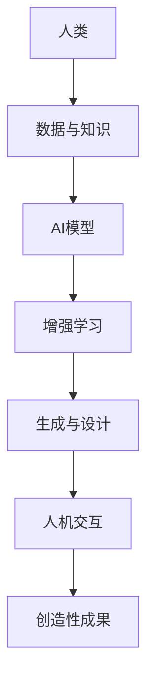

                 

# 人类-AI协作：增强创造力

> 关键词：人类-AI协作, 创造力增强, 智能辅助, 设计创新, 知识融合

## 1. 背景介绍

### 1.1 问题由来

随着人工智能(AI)技术的快速发展和广泛应用，人们开始重新思考人类与AI之间的关系。传统的AI大多集中在数据处理、模式识别等任务上，而近年来的研究表明，AI在理解、推理、创造力等更高层次的认知功能上同样具有巨大潜力。AI技术正在从工具角色转变为合作伙伴，与人类共同完成更为复杂的认知任务。

人类-AI协作的核心在于利用AI的强大计算能力和知识库，辅助人类进行更为复杂的创造性工作。AI不仅能够处理海量数据、进行复杂计算，还能基于大量训练数据生成新颖的创意和方案，成为人类创造力的“加速器”。在艺术、设计、科学、教育等多个领域，AI已经被成功应用，显示出显著的成效。

### 1.2 问题核心关键点

人类-AI协作的关键在于以下几个方面：

1. **数据与知识整合**：AI能够从海量数据中提取有价值的信息，与人类知识进行融合，产生更为精确和创新的结果。
2. **增强决策支持**：AI通过分析复杂数据集，为人类提供决策支持，降低决策失误，提升决策效率。
3. **辅助创造与设计**：AI在艺术创作、产品设计等领域中，通过生成、优化、筛选等技术，辅助人类进行更具创意的创作。
4. **个性化服务**：AI能够根据用户行为和偏好，提供个性化推荐和服务，提升用户体验。
5. **持续学习与适应**：AI通过不断的学习和经验积累，不断提高自身能力，更好地适应新的环境和工作场景。

这些关键点共同构成了人类-AI协作的基本框架，使其在多个领域展现出卓越的潜力。

### 1.3 问题研究意义

研究人类-AI协作的增强创造力，对于推动创新驱动发展、提升社会生产力、促进科学研究和文化创新具有重要意义：

1. **推动技术进步**：AI与人类协作的创新应用，将推动AI技术不断突破，拓展其应用边界。
2. **提升社会生产力**：通过AI的辅助，人类可以更高效地完成复杂任务，提升工作效率和经济效益。
3. **促进科学发展**：AI在科研中扮演重要角色，辅助科学家进行数据分析、模式识别、理论推导等工作，加速科学研究进程。
4. **丰富文化艺术**：AI在艺术创作、音乐、文学等领域的应用，为文化艺术创新提供了新的工具和平台。
5. **增强教育效果**：AI辅助教育，提供个性化学习资源，提升教育质量和覆盖面。

总之，人类-AI协作的增强创造力不仅有助于推动技术和社会进步，还将在多个领域带来深远的变革。

## 2. 核心概念与联系

### 2.1 核心概念概述

为了更好地理解人类-AI协作增强创造力的机制，本节将介绍几个核心概念及其相互联系：

- **人工智能(AI)**：基于算法和数据构建的，能够模拟人类智能行为的机器系统。
- **增强学习(Reinforcement Learning)**：AI通过与环境的交互，通过奖励机制不断优化策略，实现自我学习和适应。
- **创造力(Creativity)**：人类或机器基于已有知识，产生新颖、有用、有价值的结果的能力。
- **设计(Design)**：通过创新思维，将理念转化为具体的产品、服务或方案的过程。
- **人机交互(Human-Computer Interaction)**：通过接口、语言、反馈等机制，实现人与计算机之间的交互和沟通。

这些概念之间存在紧密的联系，共同构成了人类-AI协作的基础。AI通过增强学习等技术，模拟人类创造力，设计算法模型，生成新颖结果。而人机交互则提供了沟通的渠道，使得人类能够直观地控制和利用AI的工具，实现更高效、更具创意的协作。

### 2.2 核心概念原理和架构的 Mermaid 流程图(Mermaid 流程节点中不要有括号、逗号等特殊字符)



该图展示了人类-AI协作的基本流程：人类提供数据和知识，AI模型通过增强学习生成新颖结果，人机交互实现协作，最终产生创造性成果。

## 3. 核心算法原理 & 具体操作步骤

### 3.1 算法原理概述

人类-AI协作增强创造力的核心在于将AI的计算能力和知识库与人类创造力相结合，生成新颖的创意和方案。其基本原理可以总结如下：

1. **数据与知识整合**：AI通过从大量数据中提取特征和模式，与人类知识进行融合，生成更为精确和创新的结果。
2. **增强学习与优化**：AI通过不断学习和优化，提高自身的创造力和设计能力，生成更符合人类期望的结果。
3. **生成与设计**：AI通过生成算法和设计工具，辅助人类进行创新，提高工作效率和质量。
4. **人机交互**：AI通过用户界面、语音助手等交互方式，与人类进行沟通，提升用户体验和满意度。

### 3.2 算法步骤详解

人类-AI协作增强创造力的具体操作步骤如下：

**Step 1: 数据与知识准备**
- 收集相关领域的大量数据和知识，并进行清洗和预处理。
- 选择合适的特征提取方法，从数据中提取有价值的信息。
- 将数据与人类已有的知识库进行融合，形成更为全面的输入。

**Step 2: 模型选择与训练**
- 选择适当的AI模型，如神经网络、生成对抗网络(GAN)、增强学习模型等，进行训练。
- 使用监督、无监督或半监督学习方式，训练模型以生成所需结果。
- 通过交叉验证等技术，评估模型性能，并进行调参优化。

**Step 3: 增强学习与优化**
- 将模型置于实际应用场景中，通过增强学习不断优化，提高模型的适应性和创造力。
- 根据用户反馈和结果评估，调整模型策略，优化生成结果。
- 引入奖励机制，激励模型生成更有创意和实用性的结果。

**Step 4: 生成与设计**
- 利用训练好的AI模型，生成新颖的设计方案、创意作品等。
- 通过优化算法，筛选和优化生成结果，提升其质量和适用性。
- 将生成结果与人类设计意图进行比较，迭代优化。

**Step 5: 人机交互与反馈**
- 通过用户界面、语音助手等方式，实现人机交互，收集用户反馈。
- 根据用户反馈，调整生成策略，优化结果。
- 在交互过程中，提供实时反馈，提升用户体验。

### 3.3 算法优缺点

人类-AI协作增强创造力的优点包括：

1. **高效性**：AI能够快速处理大量数据，生成多种方案，提高工作效率。
2. **创新性**：AI结合人类知识，生成新颖创意，打破传统思维模式。
3. **适应性**：AI通过增强学习不断优化，适应不同场景和需求。
4. **个性化**：AI能够根据用户偏好和需求，提供个性化服务。
5. **跨领域性**：AI在不同领域中都能发挥作用，提供综合解决方案。

然而，该方法也存在一些局限性：

1. **数据依赖性**：AI依赖大量高质量数据，数据获取成本较高。
2. **模型复杂性**：AI模型训练和优化复杂，需要大量计算资源。
3. **模型解释性**：AI生成结果缺乏解释性，难以理解和调试。
4. **伦理与隐私**：AI生成的结果可能涉及隐私问题，需确保数据保护。
5. **创造力瓶颈**：AI可能无法超越人类创造力，在某些领域仍需人类参与。

### 3.4 算法应用领域

人类-AI协作增强创造力的应用领域非常广泛，涵盖以下几个主要方向：

- **艺术与设计**：AI辅助创作，生成艺术作品、建筑设计方案等。
- **科学研究**：AI辅助实验设计、数据分析、模式识别等工作，加速科研进程。
- **产品设计与制造**：AI辅助产品设计和原型制造，提高产品创新性和市场竞争力。
- **教育与培训**：AI辅助教学，提供个性化学习资源，提升教学效果。
- **市场营销**：AI辅助市场分析、客户行为预测、个性化推荐等工作，提升市场推广效果。

## 4. 数学模型和公式 & 详细讲解 & 举例说明（备注：数学公式请使用latex格式，latex嵌入文中独立段落使用 $$，段落内使用 $)
### 4.1 数学模型构建

人类-AI协作增强创造力的数学模型主要基于生成模型和增强学习模型，具体构建如下：

**生成模型**：
假设人类提供的输入为 $X$，AI生成的结果为 $Y$。则生成模型可以表示为：
$$
p(Y|X; \theta) = \text{Model}(X, \theta)
$$
其中 $\theta$ 为模型参数，$\text{Model}$ 为生成算法。

**增强学习模型**：
在实际应用中，AI通过增强学习不断优化策略。设 $S$ 为环境状态，$A$ 为动作，$R$ 为奖励，则增强学习模型可以表示为：
$$
Q(s, a) = r + \gamma \max_{a'} Q(s', a')
$$
其中 $s$ 为当前状态，$a$ 为当前动作，$r$ 为即时奖励，$s'$ 为下一状态，$Q(s, a)$ 为状态动作值函数，$\gamma$ 为折扣因子。

### 4.2 公式推导过程

以下我们将对上述数学模型进行详细推导：

**生成模型推导**：
设输入 $X$ 为文本数据，AI生成的结果 $Y$ 为设计方案或艺术作品。则生成模型可以表示为：
$$
p(Y|X; \theta) = \prod_{i=1}^n p(y_i|x_i; \theta)
$$
其中 $y_i$ 为生成的第 $i$ 个元素，$x_i$ 为对应的输入元素，$\theta$ 为模型参数。

假设生成模型为神经网络，其输出为 $y_i$，则有：
$$
y_i = \text{Model}(x_i; \theta)
$$
其中 $\text{Model}$ 为神经网络模型，$\theta$ 为模型参数。

**增强学习模型推导**：
增强学习模型的核心在于策略优化。设当前状态为 $s$，动作为 $a$，下一状态为 $s'$，则状态动作值函数 $Q(s, a)$ 可以表示为：
$$
Q(s, a) = r + \gamma \max_{a'} Q(s', a')
$$
其中 $r$ 为即时奖励，$Q(s', a')$ 为下一状态动作值函数，$\gamma$ 为折扣因子。

通过不断迭代，增强学习模型可以优化策略，生成更符合人类期望的结果。

### 4.3 案例分析与讲解

以艺术创作为例，假设人类提供了一个艺术主题，AI通过神经网络生成一系列作品。具体步骤如下：

1. **数据准备**：收集与艺术主题相关的图片、文本数据，进行清洗和预处理。
2. **模型选择**：选择生成对抗网络(GAN)或变分自编码器(VAE)等生成模型，进行训练。
3. **增强学习优化**：将模型置于实际应用场景中，通过增强学习不断优化，提高生成效果。
4. **生成与设计**：利用训练好的模型生成一系列艺术作品，并通过优化算法筛选最优结果。
5. **人机交互与反馈**：通过用户界面收集用户反馈，调整生成策略，优化结果。

以下是一个简单的代码示例，展示如何使用PyTorch实现GAN生成艺术作品：

```python
import torch
import torch.nn as nn
import torch.optim as optim
import torchvision.transforms as transforms
from torchvision.datasets import MNIST
from torchvision.utils import save_image

# 定义生成器和判别器网络
class Generator(nn.Module):
    def __init__(self):
        super(Generator, self).__init__()
        self.fc1 = nn.Linear(100, 256)
        self.fc2 = nn.Linear(256, 512)
        self.fc3 = nn.Linear(512, 1024)
        self.fc4 = nn.Linear(1024, 784)
        self.fc5 = nn.Linear(784, 3)

    def forward(self, x):
        x = self.fc1(x)
        x = nn.Tanh()(x)
        x = self.fc2(x)
        x = nn.Tanh()(x)
        x = self.fc3(x)
        x = nn.Tanh()(x)
        x = self.fc4(x)
        x = nn.Sigmoid()(x)
        return x

class Discriminator(nn.Module):
    def __init__(self):
        super(Discriminator, self).__init__()
        self.fc1 = nn.Linear(784, 512)
        self.fc2 = nn.Linear(512, 256)
        self.fc3 = nn.Linear(256, 1)

    def forward(self, x):
        x = self.fc1(x)
        x = nn.Sigmoid()(x)
        x = self.fc2(x)
        x = nn.Sigmoid()(x)
        x = self.fc3(x)
        x = nn.Sigmoid()(x)
        return x

# 定义损失函数和优化器
def adversarial_loss(real, pred_real, pred_fake):
    return nn.BCELoss()(pred_real, real) + nn.BCELoss()(pred_fake, torch.zeros_like(pred_fake))

# 训练过程
def train():
    for epoch in range(num_epochs):
        for i, (real_images, _) in enumerate(data_loader):
            real_images = real_images.to(device)
            # 生成伪图像
            z = torch.randn(batch_size, latent_dim).to(device)
            fake_images = generator(z)
            # 判别器训练
            discriminator_real = discriminator(real_images)
            discriminator_fake = discriminator(fake_images)
            d_loss = adversarial_loss(discriminator_real, discriminator_real, discriminator_fake).to(device)
            discriminator.zero_grad()
            d_loss.backward()
            discriminator_optimizer.step()
            # 生成器训练
            fake_images = generator(z)
            d_loss = adversarial_loss(discriminator_fake, discriminator_fake, discriminator_real).to(device)
            discriminator_zero_grad()
            g_loss = adversarial_loss(discriminator_fake, discriminator_fake, discriminator_real).to(device)
            g_loss.backward()
            generator_optimizer.step()

# 数据准备
transform = transforms.Compose([transforms.Resize((64, 64)), transforms.ToTensor(), transforms.Normalize((0.5,), (0.5,))])
train_dataset = MNIST(root='./data', train=True, transform=transform, download=True)
train_loader = torch.utils.data.DataLoader(train_dataset, batch_size=64, shuffle=True)

# 训练模型
generator = Generator().to(device)
discriminator = Discriminator().to(device)
generator_optimizer = optim.Adam(generator.parameters(), lr=learning_rate)
discriminator_optimizer = optim.Adam(discriminator.parameters(), lr=learning_rate)
num_epochs = 100
device = torch.device("cuda" if torch.cuda.is_available() else "cpu")
train(generator, discriminator, train_loader)
```

## 5. 项目实践：代码实例和详细解释说明

### 5.1 开发环境搭建

在进行人类-AI协作的实践前，我们需要准备好开发环境。以下是使用Python进行PyTorch开发的环境配置流程：

1. 安装Anaconda：从官网下载并安装Anaconda，用于创建独立的Python环境。

2. 创建并激活虚拟环境：
```bash
conda create -n ai-env python=3.8 
conda activate ai-env
```

3. 安装PyTorch：根据CUDA版本，从官网获取对应的安装命令。例如：
```bash
conda install pytorch torchvision torchaudio cudatoolkit=11.1 -c pytorch -c conda-forge
```

4. 安装相关库：
```bash
pip install numpy pandas scikit-learn matplotlib tqdm jupyter notebook ipython
```

5. 安装可视化工具：
```bash
pip install matplotlib seaborn
```

完成上述步骤后，即可在`ai-env`环境中开始项目实践。

### 5.2 源代码详细实现

以下是使用PyTorch实现艺术创作中的人类-AI协作的代码示例，其中生成模型使用变分自编码器(VAE)：

```python
import torch
import torch.nn as nn
import torch.optim as optim
import torchvision.transforms as transforms
from torchvision.datasets import CIFAR10
from torchvision.utils import save_image

# 定义VAE模型
class VAE(nn.Module):
    def __init__(self):
        super(VAE, self).__init__()
        self.fc1 = nn.Linear(32 * 32 * 3, 128)
        self.fc21 = nn.Linear(128, 2)
        self.fc22 = nn.Linear(128, 2)
        self.fc3 = nn.Linear(128, 32 * 32 * 3)

    def encode(self, x):
        x = x.view(-1, 32 * 32 * 3)
        x = self.fc1(x)
        x = nn.Tanh()(x)
        return x

    def reparameterize(self, z_mean, z_log_var):
        z = torch.randn_like(z_mean)
        z = z * torch.exp(z_log_var * 0.5)
        z = z_mean + z
        return z

    def decode(self, x):
        x = self.fc3(x)
        x = nn.Tanh()(x)
        x = x.view(-1, 1, 32, 32, 3)
        return x

    def forward(self, x):
        z_mean, z_log_var = self.encode(x)
        z = self.reparameterize(z_mean, z_log_var)
        x_recon = self.decode(z)
        return x_recon, z_mean, z_log_var

# 定义损失函数和优化器
def vae_loss(recon_x, x, z_mean, z_log_var):
    recon_loss = nn.MSELoss()(recon_x, x)
    kl_loss = -0.5 * torch.sum(1 + z_log_var - z_mean.pow(2) - z_log_var.exp(), 1)
    return recon_loss + kl_loss

# 训练过程
def train():
    for epoch in range(num_epochs):
        for i, (x, _) in enumerate(data_loader):
            x = x.to(device)
            # 训练过程
            z_mean, z_log_var, x_recon = vae(x)
            loss = vae_loss(x_recon, x, z_mean, z_log_var).to(device)
            optimizer.zero_grad()
            loss.backward()
            optimizer.step()

# 数据准备
transform = transforms.Compose([transforms.Resize((32, 32)), transforms.ToTensor(), transforms.Normalize((0.5,), (0.5,))])
train_dataset = CIFAR10(root='./data', train=True, transform=transform, download=True)
train_loader = torch.utils.data.DataLoader(train_dataset, batch_size=64, shuffle=True)

# 训练模型
vae = VAE().to(device)
optimizer = optim.Adam(vae.parameters(), lr=learning_rate)
num_epochs = 100
device = torch.device("cuda" if torch.cuda.is_available() else "cpu")
train(vae)
```

### 5.3 代码解读与分析

让我们再详细解读一下关键代码的实现细节：

**VAE模型定义**：
- `__init__`方法：定义VAE模型各层，包括编码器和解码器。
- `encode`方法：将输入数据编码成隐变量。
- `reparameterize`方法：生成隐变量的正态分布。
- `decode`方法：将隐变量解码成原始数据。
- `forward`方法：定义前向传播过程。

**损失函数定义**：
- `vae_loss`方法：定义VAE的损失函数，包括重构误差和KL散度。

**训练过程**：
- 在每个epoch内，对数据进行迭代训练，计算损失并反向传播更新模型参数。
- 使用Adam优化器进行模型优化，学习率为`learning_rate`。
- 在训练过程中，生成隐变量并计算损失，进行梯度更新。

**数据准备**：
- 对CIFAR-10数据集进行预处理，包括归一化和转换。
- 定义训练数据集和数据加载器，支持批处理和随机打乱。

该代码实现了一个基于VAE的生成模型，可以用于艺术创作中。用户提供艺术主题，模型生成一系列相关的艺术作品。

## 6. 实际应用场景

### 6.1 智能设计

在产品设计领域，人类-AI协作可以显著提升设计的效率和质量。AI通过分析用户需求和市场趋势，生成多种设计方案，并进行优化筛选，辅助设计师进行设计。例如，在汽车设计中，AI可以根据市场反馈和用户需求，生成多个车型方案，并通过增强学习不断优化，生成更符合用户期望的设计。

### 6.2 艺术创作

在艺术创作领域，AI可以辅助艺术家进行创作，生成新颖的艺术作品。例如，利用生成对抗网络(GAN)生成绘画、音乐、文学作品等，通过增强学习不断优化，生成更具有创意和艺术价值的作品。艺术创作中的人类-AI协作，将开启新的艺术表现形式，为艺术家提供新的创作工具和平台。

### 6.3 科学研究

在科学研究中，AI可以辅助进行数据分析、模式识别、理论推导等工作，加速科研进程。例如，在生物医学领域，AI可以分析海量的基因数据和文献，发现新的疾病特征和治疗方案。在物理研究中，AI可以辅助进行复杂的计算和模拟，加速理论推导和验证。

### 6.4 个性化推荐

在个性化推荐领域，AI可以辅助进行市场分析和用户行为预测，提供个性化的产品和服务。例如，在电商推荐中，AI可以分析用户历史行为和偏好，生成个性化推荐列表，提升用户购物体验和满意度。在内容推荐中，AI可以分析用户阅读习惯，推荐相关书籍、文章和视频，提升用户粘性和参与度。

### 6.5 教育培训

在教育培训领域，AI可以辅助进行个性化教学和智能评估，提升教育效果。例如，在语言学习中，AI可以根据用户的学习进度和偏好，生成个性化的学习资源和练习题目，实时评估学习效果。在专业培训中，AI可以辅助进行技能评估和知识测试，提供个性化的学习路径和建议。

## 7. 工具和资源推荐

### 7.1 学习资源推荐

为了帮助开发者系统掌握人类-AI协作增强创造力的理论和实践，这里推荐一些优质的学习资源：

1. 《深度学习》课程：斯坦福大学开设的深度学习课程，详细讲解深度学习原理和应用，涵盖生成模型和增强学习等内容。
2. 《Python深度学习》书籍：知名深度学习专家Yaroslav Halchenko的著作，详细介绍PyTorch等深度学习框架的使用，并提供丰富的代码示例。
3. 《机器学习实战》书籍：机器学习实战专家Peter Harrington的著作，提供大量实践案例，涵盖生成模型和增强学习等技术。
4. 《计算机视觉：现代方法》书籍：计算机视觉专家Jitendra Malik的著作，详细讲解计算机视觉中的生成模型和增强学习应用。
5. 《自然语言处理综述》论文：自然语言处理领域的综述论文，详细讲解自然语言处理中的生成模型和增强学习技术。

通过对这些资源的学习实践，相信你一定能够全面掌握人类-AI协作增强创造力的精髓，并用于解决实际的NLP问题。

### 7.2 开发工具推荐

高效的开发离不开优秀的工具支持。以下是几款用于人类-AI协作开发的常用工具：

1. PyTorch：基于Python的开源深度学习框架，灵活动态的计算图，适合快速迭代研究。
2. TensorFlow：由Google主导开发的开源深度学习框架，生产部署方便，适合大规模工程应用。
3. Jupyter Notebook：交互式编程环境，适合进行深度学习和数据科学开发。
4. TensorBoard：TensorFlow配套的可视化工具，可实时监测模型训练状态，并提供丰富的图表呈现方式。
5. Weights & Biases：模型训练的实验跟踪工具，可以记录和可视化模型训练过程中的各项指标，方便对比和调优。

合理利用这些工具，可以显著提升人类-AI协作的开发效率，加快创新迭代的步伐。

### 7.3 相关论文推荐

人类-AI协作增强创造力的研究源于学界的持续研究。以下是几篇奠基性的相关论文，推荐阅读：

1. Generative Adversarial Networks (GAN)：Goodfellow等人提出的生成对抗网络，广泛应用于图像生成、视频生成等领域。
2. Variational Autoencoders (VAE)：Kingma等人提出的变分自编码器，广泛应用于图像生成、数据压缩等领域。
3. Reinforcement Learning for Human-Robot Interaction：De Sanctis等人提出的强化学习在机器人交互中的应用，展示了AI在多模态交互中的潜力。
4. Deep Reinforcement Learning for Creative Writing：Rajpurkar等人提出的强化学习在创意写作中的应用，展示了AI在文学创作中的潜力。
5. Human-AI Collaboration in Creative Design：Zhang等人提出的基于增强学习的智能设计框架，展示了AI在产品设计中的应用。

这些论文代表了大语言模型微调技术的发展脉络。通过学习这些前沿成果，可以帮助研究者把握学科前进方向，激发更多的创新灵感。

## 8. 总结：未来发展趋势与挑战

### 8.1 总结

本文对人类-AI协作增强创造力的原理、方法及其应用进行了全面系统的介绍。通过深入探讨生成模型、增强学习、人机交互等核心概念，展示了人类-AI协作在多个领域中的广阔应用前景。详细讲解了具体的实现步骤和代码示例，提供了全面的学习资源和工具推荐，力求为开发者提供全方位的技术指引。

### 8.2 未来发展趋势

展望未来，人类-AI协作增强创造力将呈现以下几个发展趋势：

1. **跨领域融合**：AI将在更多领域中发挥作用，融合多学科知识，生成更具创意的结果。
2. **个性化定制**：AI将根据用户偏好和需求，提供个性化的创意和服务，提升用户体验。
3. **高效计算**：AI将利用更高效的计算模型和算法，提升生成速度和质量。
4. **人机协同**：人类-AI协作将更加紧密，人类可以更自然地控制和利用AI工具，实现高效协同。
5. **伦理与安全**：AI将在设计和应用中更加注重伦理和安全，确保生成结果的合理性和安全性。

### 8.3 面临的挑战

尽管人类-AI协作增强创造力具有广阔的前景，但在实际应用中仍面临诸多挑战：

1. **数据依赖性**：AI依赖大量高质量数据，数据获取成本较高。
2. **模型复杂性**：AI模型训练和优化复杂，需要大量计算资源。
3. **模型解释性**：AI生成结果缺乏解释性，难以理解和调试。
4. **伦理与隐私**：AI生成的结果可能涉及隐私问题，需确保数据保护。
5. **创造力瓶颈**：AI可能无法超越人类创造力，在某些领域仍需人类参与。

### 8.4 研究展望

面对人类-AI协作增强创造力所面临的挑战，未来的研究需要在以下几个方面寻求新的突破：

1. **数据增强技术**：开发更高效的数据增强方法，降低数据依赖性，提高生成效果。
2. **模型优化技术**：开发更高效的计算模型和算法，提升生成速度和质量。
3. **模型解释性技术**：引入更多解释性技术，提高模型的可解释性和可理解性。
4. **隐私保护技术**：开发隐私保护算法，确保生成结果的隐私和安全。
5. **跨领域融合技术**：开发跨领域融合算法，实现多学科知识的整合和协同。

这些研究方向的探索，必将引领人类-AI协作增强创造力走向更高的台阶，为构建安全、可靠、可解释、可控的智能系统铺平道路。面向未来，人类-AI协作增强创造力还需要与其他人工智能技术进行更深入的融合，如知识表示、因果推理、强化学习等，多路径协同发力，共同推动自然语言理解和智能交互系统的进步。只有勇于创新、敢于突破，才能不断拓展语言模型的边界，让智能技术更好地造福人类社会。

## 9. 附录：常见问题与解答

**Q1：人类-AI协作是否适用于所有创意任务？**

A: 人类-AI协作在大多数创意任务上都能取得不错的效果，特别是对于数据量较大的任务。但对于一些特别依赖人类主观判断的任务，如艺术创作、文学创作等，AI可能无法完全替代人类。

**Q2：如何选择合适的人类-AI协作方案？**

A: 选择合适的人类-AI协作方案需要考虑以下几个因素：
1. 任务的复杂性和规模。对于复杂大规模任务，可能需要采用更为高效的计算模型和算法。
2. 数据获取的难易程度。对于数据获取困难的任务，可能需要考虑使用半监督或无监督学习方法。
3. 用户需求和偏好。根据用户需求和偏好，选择适合的生成模型和优化策略。
4. 应用场景和实际效果。根据实际应用场景，评估不同方案的效果，选择最优方案。

**Q3：人类-AI协作过程中需要注意哪些问题？**

A: 人类-AI协作过程中需要注意以下几个问题：
1. 数据质量。确保数据的高质量和多样性，避免生成结果的偏差和失效。
2. 模型鲁棒性。确保模型在不同数据分布下具有较好的鲁棒性和泛化能力。
3. 模型解释性。确保模型的生成结果具有可解释性和可理解性，便于调试和优化。
4. 伦理与安全。确保生成结果符合伦理道德规范，避免有害信息和恶意用途。
5. 用户交互。确保用户能够方便地控制和利用AI工具，实现高效协同。

**Q4：如何提高人类-AI协作的效果？**

A: 提高人类-AI协作的效果需要从以下几个方面进行优化：
1. 数据增强。通过数据增强技术，提高模型的泛化能力和生成效果。
2. 模型优化。通过模型优化技术，提高模型的计算效率和生成质量。
3. 人机交互。通过优化用户界面和交互方式，提高用户满意度。
4. 跨领域融合。通过跨领域融合技术，实现多学科知识的整合和协同。

通过上述措施，可以有效提升人类-AI协作的效果，实现更高效、更具创意的协作。

---

作者：禅与计算机程序设计艺术 / Zen and the Art of Computer Programming

