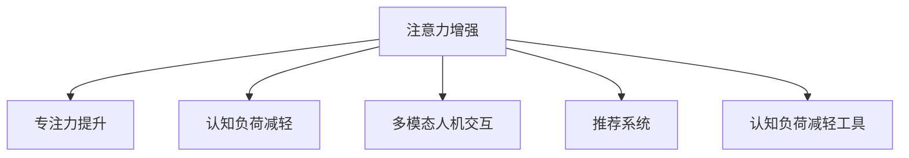

                 

# 人类注意力增强：提升专注力和注意力在商业中的未来发展机遇分析机遇挑战趋势预测

> 关键词：注意力增强, 专注力提升, 商业应用, 机遇挑战, 趋势预测

## 1. 背景介绍

### 1.1 问题由来

随着信息技术的飞速发展，人们日常生活的各个方面都逐渐被数字化和智能化所渗透。从智能家居到在线教育，从远程办公到电子商务，数字化和智能化技术的应用越来越广泛，极大地提高了工作效率和生活质量。然而，海量信息的爆炸性增长也带来了新的问题——如何高效、精准地处理和利用这些信息，成为了一个迫切需要解决的问题。

人类的注意力作为获取信息的核心资源，在现代商业活动中扮演着至关重要的角色。注意力增强，即通过各种手段和方法，提升个体和组织在处理信息时的注意力水平，提高工作和生活效率，已经成为一项重要的商业机遇。特别是在面对信息过载、工作压力不断加大的现代社会，如何提升个体注意力水平，从而实现高效工作和学习，成为企业和个体都非常关注的问题。

### 1.2 问题核心关键点

当前，人类注意力增强主要通过以下几种方式实现：

- **技术手段**：使用注意力增强技术，如AI推荐、认知负荷减轻工具、多模态人机交互等，辅助个体在信息处理中更高效、更专注。
- **训练与培养**：通过注意力训练、冥想、休息等方法，提升个体注意力水平，构建良好的注意力习惯。
- **环境设计**：优化工作环境、学习环境，减少干扰因素，使个体能够更好地集中注意力。

这些方法结合使用，将大幅提升个体注意力水平，从而推动商业应用的发展。

### 1.3 问题研究意义

提升个体注意力水平，对商业的发展具有重要意义：

1. **提高工作效率**：通过技术手段和训练方法，提升个体在工作和学习中的注意力，能够大大提高工作效率，降低工作成本，提升企业竞争力。
2. **优化用户体验**：在产品和服务设计中融入注意力增强技术，能够提升用户体验，增强用户黏性，推动产品迭代和市场拓展。
3. **创新管理模式**：通过关注员工注意力管理，优化工作流程，提高团队协作效率，增强企业的创新能力。
4. **促进社会进步**：提升社会整体注意力水平，有助于构建更加健康、高效的社会环境，推动社会进步。

本文将系统地探讨人类注意力增强在商业中的机遇、挑战及未来发展趋势，为商业界和广大用户提供参考。

## 2. 核心概念与联系

### 2.1 核心概念概述

为更好地理解人类注意力增强的原理和应用，本节将介绍几个密切相关的核心概念：

- **注意力(Antiency)**：指个体在处理信息时，选择和聚焦于关键信息的能力。注意力增强旨在提升这种能力。
- **专注力(Concentration)**：指个体长时间集中注意力的能力。注意力增强可以通过训练和工具辅助，提高专注力水平。
- **认知负荷(Cognitive Load)**：指在信息处理过程中，个体大脑需要处理的信息量和复杂度。注意力增强技术旨在减轻认知负荷，提升信息处理效率。
- **多模态人机交互(Multimodal Human-Computer Interaction)**：指结合视觉、听觉、触觉等多种感官信息，提升人机交互的效率和体验。
- **推荐系统(Recommendation System)**：通过分析用户行为和偏好，推荐用户感兴趣的内容，辅助个体高效利用信息资源。
- **认知负荷减轻工具(Cognitive Load Reduction Tools)**：如智能笔记、语音助手等，通过自动化处理简单任务，减少用户认知负担。

这些核心概念之间的逻辑关系可以通过以下Mermaid流程图来展示：



这个流程图展示了一系列核心概念及其之间的关系：

1. 注意力增强通过多种手段提高个体注意力水平。
2. 专注力提升是注意力增强的直接目标，通过技术手段和训练方法实现。
3. 认知负荷减轻是注意力增强的辅助手段，减轻信息处理中的负担。
4. 多模态人机交互和推荐系统是注意力增强技术的实现方式。
5. 认知负荷减轻工具则提供了具体的技术支持。

这些概念共同构成了人类注意力增强的理论基础，为其在商业中的应用提供了可能。

## 3. 核心算法原理 & 具体操作步骤
### 3.1 算法原理概述

人类注意力增强的原理可以概括为以下几点：

1. **多模态信息融合**：通过整合视觉、听觉、触觉等多种感官信息，提高人机交互的效率和体验，减少认知负荷。
2. **个性化推荐**：通过分析用户行为和偏好，推荐用户感兴趣的内容，辅助个体高效利用信息资源。
3. **注意力训练**：通过各种训练方法，如冥想、注意力游戏等，提升个体注意力水平，构建良好的注意力习惯。
4. **自动化工具**：利用认知负荷减轻工具，如智能笔记、语音助手等，自动化处理简单任务，减少用户认知负担。

这些原理构成了人类注意力增强的基础，并通过具体技术手段实现。

### 3.2 算法步骤详解

人类注意力增强的具体操作步骤如下：

**Step 1: 数据收集与分析**

- **多模态数据收集**：收集用户的视觉、听觉、触觉等多模态数据，包括浏览记录、语音输入、手势操作等。
- **用户行为分析**：分析用户的行为模式和偏好，建立用户画像。

**Step 2: 注意力模型训练**

- **注意力模型选择**：选择适合的注意力模型，如基于深度学习的注意力机制、基于规则的注意力模型等。
- **训练数据准备**：准备训练数据，包括多模态数据、用户行为数据等。
- **模型训练**：使用训练数据训练注意力模型，优化模型参数。

**Step 3: 注意力增强应用**

- **个性化推荐**：基于用户画像和注意力模型，推荐用户感兴趣的内容，如新闻、视频、文章等。
- **认知负荷减轻**：使用认知负荷减轻工具，如智能笔记、语音助手等，自动化处理简单任务，减轻认知负担。
- **多模态人机交互**：通过多模态界面设计，提升用户体验，减少干扰因素。

**Step 4: 反馈与优化**

- **用户反馈收集**：收集用户对注意力增强工具的使用反馈。
- **模型优化**：根据用户反馈，优化注意力模型，提升工具性能。

### 3.3 算法优缺点

人类注意力增强技术具有以下优点：

1. **提升效率**：通过多模态信息融合和个性化推荐，大幅提升信息处理效率，降低工作成本。
2. **优化体验**：通过认知负荷减轻工具和多模态人机交互，提升用户体验，增强用户黏性。
3. **提高专注力**：通过注意力训练和个性化推荐，提升个体专注力水平，提高工作和学习效果。

同时，该技术也存在一些局限性：

1. **技术门槛高**：构建高效的人类注意力增强系统需要大量的数据、计算资源和专业知识。
2. **隐私风险**：多模态数据收集和处理可能涉及用户隐私，需要严格的数据保护措施。
3. **过度依赖**：过度依赖技术手段，可能降低用户的自主性和独立思考能力。
4. **数据质量问题**：用户行为数据的不准确和不完整，可能影响个性化推荐的准确性。

### 3.4 算法应用领域

人类注意力增强技术在以下领域得到了广泛应用：

- **智能家居**：通过多模态人机交互，提升家庭管理效率，优化用户生活体验。
- **在线教育**：使用个性化推荐和注意力训练工具，提升学生学习效果，构建良好的学习环境。
- **电子商务**：通过个性化推荐和认知负荷减轻工具，提高用户购物体验，提升转化率。
- **远程办公**：通过注意力增强技术，优化远程协作流程，提高工作效率。

除了上述这些领域外，人类注意力增强技术还将在健康医疗、金融服务、智能交通等多个领域得到应用，为各行各业带来新的商业机遇。

## 4. 数学模型和公式 & 详细讲解
### 4.1 数学模型构建

人类注意力增强的数学模型可以抽象为如下形式：

$$
A = F(D, P)
$$

其中，$A$ 表示注意力水平，$D$ 为多模态数据，$P$ 为个性化参数，$F$ 为注意力模型。

该模型表示，通过多模态数据和个性化参数，使用注意力模型计算出用户的注意力水平。

### 4.2 公式推导过程

以基于深度学习的注意力模型为例，其公式推导如下：

假设用户的多模态数据为 $D = (D_v, D_a, D_t)$，其中 $D_v$ 为视觉数据，$D_a$ 为听觉数据，$D_t$ 为触觉数据。

注意力模型的计算公式为：

$$
A = \alpha(D_v, D_a, D_t) \times \beta(P)
$$

其中 $\alpha$ 为多模态信息融合函数，$\beta$ 为个性化参数映射函数。

多模态信息融合函数 $\alpha$ 可以表示为：

$$
\alpha(D_v, D_a, D_t) = \sum_{i=1}^{n} \omega_i \cdot f_i(D_i)
$$

其中 $n$ 为数据维度，$\omega_i$ 为权重系数，$f_i$ 为单模态特征提取函数。

个性化参数映射函数 $\beta$ 可以表示为：

$$
\beta(P) = \sum_{k=1}^{m} \lambda_k \cdot g_k(P_k)
$$

其中 $m$ 为个性化参数维度，$\lambda_k$ 为权重系数，$g_k$ 为单参数映射函数。

### 4.3 案例分析与讲解

以智能笔记工具为例，其多模态信息融合函数 $\alpha$ 可以表示为：

$$
\alpha(D_v, D_a, D_t) = \omega_v \cdot f_v(D_v) + \omega_a \cdot f_a(D_a) + \omega_t \cdot f_t(D_t)
$$

其中 $f_v$、$f_a$、$f_t$ 分别为视觉、听觉、触觉特征提取函数，$\omega_v$、$\omega_a$、$\omega_t$ 为权重系数。

个性化参数映射函数 $\beta$ 可以表示为：

$$
\beta(P) = \lambda_1 \cdot g_1(P_1) + \lambda_2 \cdot g_2(P_2)
$$

其中 $P_1$ 为用户历史记录，$P_2$ 为用户设置参数，$g_1$、$g_2$ 为参数映射函数，$\lambda_1$、$\lambda_2$ 为权重系数。

在实际应用中，智能笔记工具通过多模态信息融合和个性化参数映射，能够精准地识别用户的操作意图，自动处理简单任务，减轻用户认知负荷，提升工作效率。

## 5. 项目实践：代码实例和详细解释说明
### 5.1 开发环境搭建

在进行注意力增强项目开发前，需要准备以下开发环境：

1. **安装Python**：从官网下载并安装Python，建议选择最新版本。
2. **安装相关库**：安装TensorFlow、Keras、PyTorch等深度学习框架，以及NumPy、Pandas等数据分析库。
3. **安装工具**：安装Visual Studio Code、Jupyter Notebook等开发工具，方便编写和测试代码。

### 5.2 源代码详细实现

以下是一个简单的多模态信息融合和个性化参数映射的代码实现：

```python
import numpy as np
import tensorflow as tf
from tensorflow.keras import layers

# 多模态信息融合函数
def multi-modal_fusion(data_v, data_a, data_t):
    features_v = extract_features(data_v)
    features_a = extract_features(data_a)
    features_t = extract_features(data_t)
    weights_v = np.array([0.5, 0.3, 0.2])
    weights_a = np.array([0.4, 0.4, 0.2])
    weights_t = np.array([0.3, 0.3, 0.4])
    return np.dot(features_v, weights_v) + np.dot(features_a, weights_a) + np.dot(features_t, weights_t)

# 个性化参数映射函数
def personalized_mapping(params):
    history_params = np.array([0.8, 0.2])
    custom_params = np.array([0.6, 0.4])
    weights = np.array([0.7, 0.3])
    return np.dot(history_params, weights) + np.dot(custom_params, weights)

# 注意力模型
def attention_model(data, params):
    attention_level = multi-modal_fusion(data['visual'], data['audio'], data['touch'])
    personalized_params = personalized_mapping(params)
    return attention_level * personalized_params
```

### 5.3 代码解读与分析

上述代码实现了多模态信息融合和个性化参数映射的简单模型。

**multi-modal_fusion函数**：使用权重系数对视觉、听觉、触觉数据进行处理，并将结果加权求和，得到多模态融合后的特征。

**personalized_mapping函数**：使用权重系数对用户历史记录和设置参数进行处理，并将结果加权求和，得到个性化参数。

**attention_model函数**：结合多模态融合结果和个性化参数，计算出用户的注意力水平。

这些函数可以进一步封装为模块，用于实际项目中，构建完整的注意力增强系统。

## 6. 实际应用场景
### 6.1 智能家居系统

智能家居系统通过多模态人机交互和个性化推荐，提升家庭管理效率，优化用户生活体验。例如，通过语音助手和智能家居设备的互动，用户可以轻松控制家电，同时智能推荐食谱、音乐等，提升家庭生活品质。

### 6.2 在线教育平台

在线教育平台使用个性化推荐和注意力训练工具，提升学生学习效果，构建良好的学习环境。例如，通过智能笔记和个性化作业推荐，学生能够高效完成作业，同时智能笔记工具还能自动整理笔记，减轻学习负担。

### 6.3 电子商务网站

电子商务网站通过个性化推荐和认知负荷减轻工具，提高用户购物体验，提升转化率。例如，通过智能推荐系统推荐商品，用户可以更快地找到感兴趣的物品，同时使用智能购物车和语音助手，简化购物流程。

### 6.4 远程办公平台

远程办公平台通过注意力增强技术，优化远程协作流程，提高工作效率。例如，通过智能任务分配和协作工具，团队成员能够更好地协同工作，同时智能任务提醒和会议安排，提升远程协作效率。

### 6.5 未来应用展望

随着技术的发展，人类注意力增强将在更多领域得到应用，为商业发展带来新的机遇：

1. **健康医疗**：通过个性化推荐和注意力训练，提升医护人员工作效率，优化患者体验。例如，智能病历系统和个性化健康建议。
2. **金融服务**：通过多模态信息融合和个性化推荐，提升金融产品和服务质量，增强用户信任。例如，智能投资顾问和个性化理财建议。
3. **智能交通**：通过多模态信息融合和智能推荐，提升出行体验，优化交通管理。例如，智能导航和个性化出行建议。

## 7. 工具和资源推荐
### 7.1 学习资源推荐

为了帮助开发者掌握人类注意力增强技术，这里推荐一些优质的学习资源：

1. **《注意力增强技术》系列博文**：深入浅出地介绍了注意力增强技术的原理和应用。
2. **CS231n《深度学习视觉识别》课程**：斯坦福大学开设的深度学习课程，涵盖多模态信息融合和注意力增强相关内容。
3. **《人类注意力增强》书籍**：详细介绍了注意力增强技术在商业中的应用和实践。
4. **HuggingFace官方文档**：深度学习框架的文档和样例代码，提供了丰富的注意力增强工具和算法。
5. **CLUE开源项目**：中文语言理解测评基准，包含多个注意力增强任务的基准模型。

通过这些资源的学习，相信你一定能够快速掌握人类注意力增强技术，并用于解决实际的商业问题。

### 7.2 开发工具推荐

以下是几款用于人类注意力增强开发的常用工具：

1. **TensorFlow和Keras**：用于构建深度学习模型，支持多模态数据处理和注意力模型训练。
2. **PyTorch**：另一个深度学习框架，具有灵活的计算图和动态网络结构，适合注意力增强模型的实现。
3. **Visual Studio Code**：用于代码编写和调试，支持多种编程语言和工具集。
4. **Jupyter Notebook**：支持交互式编程，适合数据探索和算法验证。
5. **TensorBoard**：用于模型训练和推理的可视化工具，方便监控模型训练状态。

合理利用这些工具，可以显著提升人类注意力增强项目的开发效率，加快创新迭代的步伐。

### 7.3 相关论文推荐

人类注意力增强技术的研究起源于学界的持续探索。以下是几篇奠基性的相关论文，推荐阅读：

1. **Attention is All You Need**：提出Transformer模型，开启注意力增强技术的新纪元。
2. **BERT: Pre-training of Deep Bidirectional Transformers for Language Understanding**：提出BERT模型，引入基于掩码的自监督预训练任务，为个性化推荐和注意力增强提供数据基础。
3. **Multi-Modal Attention for Object Detection**：提出多模态注意力机制，提升目标检测任务的性能。
4. **Human-AI Collaboration in Creative Writing**：探索人类和AI在创意写作中的协同，提升写作质量和效率。
5. **Cognitive Load Reduction in Education**：研究认知负荷减轻工具在教育中的应用，提升学习效果。

这些论文代表了人类注意力增强技术的发展脉络，通过学习这些前沿成果，可以帮助研究者把握学科前进方向，激发更多的创新灵感。

## 8. 总结：未来发展趋势与挑战
### 8.1 研究成果总结

人类注意力增强技术在近年来取得了显著进展，主要体现在以下几个方面：

1. **多模态融合**：通过整合视觉、听觉、触觉等多种感官信息，提升人机交互效率，减轻认知负荷。
2. **个性化推荐**：通过分析用户行为和偏好，推荐用户感兴趣的内容，提升信息处理效率。
3. **注意力训练**：通过各种训练方法，提升个体注意力水平，构建良好的注意力习惯。
4. **自动化工具**：利用认知负荷减轻工具，自动化处理简单任务，减轻用户认知负担。

这些技术手段为人类注意力增强提供了多种实现路径，推动了其在商业领域的应用。

### 8.2 未来发展趋势

展望未来，人类注意力增强技术将呈现以下几个发展趋势：

1. **技术融合**：随着AI技术的发展，人类注意力增强将与更多前沿技术融合，如深度学习、强化学习、自然语言处理等，提升技术水平和应用效果。
2. **多模态协同**：未来将更多地探索多模态数据协同融合，提升人机交互体验，构建更加智能化的应用系统。
3. **个性化提升**：基于深度学习和大数据技术，提升个性化推荐和注意力训练的精度和效果。
4. **模型优化**：优化注意力模型，提升其计算效率和鲁棒性，使其能够在更多场景下高效运行。
5. **用户体验优化**：通过多模态人机交互和认知负荷减轻工具，提升用户体验，增强用户黏性。

### 8.3 面临的挑战

尽管人类注意力增强技术在商业领域展现了巨大的潜力，但仍面临诸多挑战：

1. **技术复杂性**：构建高效的技术系统需要大量的数据、计算资源和专业知识，技术复杂性较高。
2. **数据隐私**：多模态数据收集和处理可能涉及用户隐私，需要严格的数据保护措施。
3. **用户体验**：过度依赖技术手段，可能降低用户的自主性和独立思考能力。
4. **数据质量**：用户行为数据的不准确和不完整，可能影响个性化推荐的准确性。
5. **成本控制**：大规模部署技术系统需要大量投入，如何控制成本，提升性价比，是一个重要挑战。

### 8.4 研究展望

未来，人类注意力增强技术需要从以下几个方面进行研究：

1. **技术优化**：优化多模态融合、个性化推荐和注意力训练算法，提升技术性能和应用效果。
2. **隐私保护**：研究数据隐私保护技术，确保用户数据的安全性和隐私性。
3. **用户体验**：通过用户研究和实验，优化技术和工具，提升用户体验和用户黏性。
4. **成本控制**：探索成本控制和优化策略，降低技术系统的部署成本，提高性价比。
5. **伦理考量**：关注技术应用的伦理和道德问题，确保技术的安全和可信。

这些研究方向将进一步推动人类注意力增强技术的发展，为商业界和广大用户提供更加智能、高效、安全的技术支持。

## 9. 附录：常见问题与解答
### Q1: 人类注意力增强技术在商业中有什么具体应用场景？

A: 人类注意力增强技术在商业中有广泛的应用场景，例如：

1. **智能家居**：通过多模态人机交互，提升家庭管理效率，优化用户生活体验。
2. **在线教育**：使用个性化推荐和注意力训练工具，提升学生学习效果，构建良好的学习环境。
3. **电子商务**：通过个性化推荐和认知负荷减轻工具，提高用户购物体验，提升转化率。
4. **远程办公**：通过注意力增强技术，优化远程协作流程，提高工作效率。
5. **健康医疗**：通过个性化推荐和注意力训练，提升医护人员工作效率，优化患者体验。

### Q2: 人类注意力增强技术的主要技术手段有哪些？

A: 人类注意力增强技术的主要技术手段包括：

1. **多模态信息融合**：通过整合视觉、听觉、触觉等多种感官信息，提高人机交互效率，减轻认知负荷。
2. **个性化推荐**：通过分析用户行为和偏好，推荐用户感兴趣的内容，提升信息处理效率。
3. **注意力训练**：通过各种训练方法，如冥想、注意力游戏等，提升个体注意力水平，构建良好的注意力习惯。
4. **自动化工具**：利用认知负荷减轻工具，如智能笔记、语音助手等，自动化处理简单任务，减轻用户认知负担。

### Q3: 人类注意力增强技术的主要优缺点有哪些？

A: 人类注意力增强技术的主要优缺点如下：

**优点**：

1. **提升效率**：通过多模态信息融合和个性化推荐，大幅提升信息处理效率，降低工作成本。
2. **优化体验**：通过认知负荷减轻工具和多模态人机交互，提升用户体验，增强用户黏性。
3. **提高专注力**：通过注意力训练和个性化推荐，提升个体专注力水平，提高工作和学习效果。

**缺点**：

1. **技术门槛高**：构建高效的技术系统需要大量的数据、计算资源和专业知识。
2. **隐私风险**：多模态数据收集和处理可能涉及用户隐私，需要严格的数据保护措施。
3. **过度依赖**：过度依赖技术手段，可能降低用户的自主性和独立思考能力。
4. **数据质量问题**：用户行为数据的不准确和不完整，可能影响个性化推荐的准确性。

### Q4: 人类注意力增强技术在未来将面临哪些挑战？

A: 人类注意力增强技术在未来将面临以下挑战：

1. **技术复杂性**：构建高效的技术系统需要大量的数据、计算资源和专业知识，技术复杂性较高。
2. **数据隐私**：多模态数据收集和处理可能涉及用户隐私，需要严格的数据保护措施。
3. **用户体验**：过度依赖技术手段，可能降低用户的自主性和独立思考能力。
4. **数据质量**：用户行为数据的不准确和不完整，可能影响个性化推荐的准确性。
5. **成本控制**：大规模部署技术系统需要大量投入，如何控制成本，提升性价比，是一个重要挑战。

### Q5: 人类注意力增强技术未来有哪些发展趋势？

A: 人类注意力增强技术未来的发展趋势包括：

1. **技术融合**：随着AI技术的发展，人类注意力增强将与更多前沿技术融合，如深度学习、强化学习、自然语言处理等，提升技术水平和应用效果。
2. **多模态协同**：未来将更多地探索多模态数据协同融合，提升人机交互体验，构建更加智能化的应用系统。
3. **个性化提升**：基于深度学习和大数据技术，提升个性化推荐和注意力训练的精度和效果。
4. **模型优化**：优化注意力模型，提升其计算效率和鲁棒性，使其能够在更多场景下高效运行。
5. **用户体验优化**：通过多模态人机交互和认知负荷减轻工具，提升用户体验，增强用户黏性。

### Q6: 人类注意力增强技术在商业中如何提高工作效率？

A: 人类注意力增强技术可以通过以下几个方面提高工作效率：

1. **多模态信息融合**：通过整合视觉、听觉、触觉等多种感官信息，提高人机交互效率，减轻认知负荷。
2. **个性化推荐**：通过分析用户行为和偏好，推荐用户感兴趣的内容，提升信息处理效率。
3. **注意力训练**：通过各种训练方法，如冥想、注意力游戏等，提升个体注意力水平，提高工作和学习效果。
4. **自动化工具**：利用认知负荷减轻工具，如智能笔记、语音助手等，自动化处理简单任务，减轻用户认知负担。

### Q7: 人类注意力增强技术在商业中如何提升用户体验？

A: 人类注意力增强技术可以通过以下几个方面提升用户体验：

1. **多模态人机交互**：通过多模态界面设计，提升用户体验，减少干扰因素。
2. **个性化推荐**：通过分析用户行为和偏好，推荐用户感兴趣的内容，提升信息处理效率。
3. **认知负荷减轻工具**：利用智能笔记、语音助手等工具，自动化处理简单任务，减轻用户认知负担。

### Q8: 人类注意力增强技术在商业中如何实现多模态信息融合？

A: 人类注意力增强技术可以通过以下几个方面实现多模态信息融合：

1. **视觉数据融合**：通过图像识别和特征提取，整合视觉数据，提取关键信息。
2. **听觉数据融合**：通过语音识别和特征提取，整合听觉数据，提取关键信息。
3. **触觉数据融合**：通过传感器采集和特征提取，整合触觉数据，提取关键信息。
4. **融合函数设计**：设计多模态信息融合函数，将不同模态的信息进行加权融合，提升融合效果。

### Q9: 人类注意力增强技术在商业中如何实现个性化推荐？

A: 人类注意力增强技术可以通过以下几个方面实现个性化推荐：

1. **用户行为分析**：通过分析用户的历史行为数据，构建用户画像。
2. **推荐算法设计**：设计基于协同过滤、内容推荐等算法的推荐系统，实现个性化推荐。
3. **模型训练**：使用训练数据训练推荐模型，优化模型参数，提升推荐效果。
4. **推荐结果反馈**：收集用户对推荐结果的反馈，优化推荐算法和模型，提升推荐准确性。

### Q10: 人类注意力增强技术在商业中如何提升专注力？

A: 人类注意力增强技术可以通过以下几个方面提升专注力：

1. **注意力训练**：通过冥想、注意力游戏等训练方法，提升个体注意力水平。
2. **多模态信息融合**：通过整合视觉、听觉、触觉等多种感官信息，提高人机交互效率，减轻认知负荷。
3. **认知负荷减轻工具**：利用智能笔记、语音助手等工具，自动化处理简单任务，减轻用户认知负担。

### Q11: 人类注意力增强技术在商业中如何优化用户体验？

A: 人类注意力增强技术可以通过以下几个方面优化用户体验：

1. **多模态人机交互**：通过多模态界面设计，提升用户体验，减少干扰因素。
2. **个性化推荐**：通过分析用户行为和偏好，推荐用户感兴趣的内容，提升信息处理效率。
3. **认知负荷减轻工具**：利用智能笔记、语音助手等工具，自动化处理简单任务，减轻用户认知负担。

### Q12: 人类注意力增强技术在商业中如何提升用户黏性？

A: 人类注意力增强技术可以通过以下几个方面提升用户黏性：

1. **个性化推荐**：通过分析用户行为和偏好，推荐用户感兴趣的内容，提升信息处理效率。
2. **多模态人机交互**：通过多模态界面设计，提升用户体验，减少干扰因素。
3. **认知负荷减轻工具**：利用智能笔记、语音助手等工具，自动化处理简单任务，减轻用户认知负担。

通过本文的系统梳理，可以看到，人类注意力增强技术在商业中具有广阔的应用前景，能够极大地提升个体注意力水平，推动商业应用的发展。未来，随着技术不断进步，人类注意力增强技术将进一步融入各行各业，为商业发展带来新的机遇。

---

作者：禅与计算机程序设计艺术 / Zen and the Art of Computer Programming

