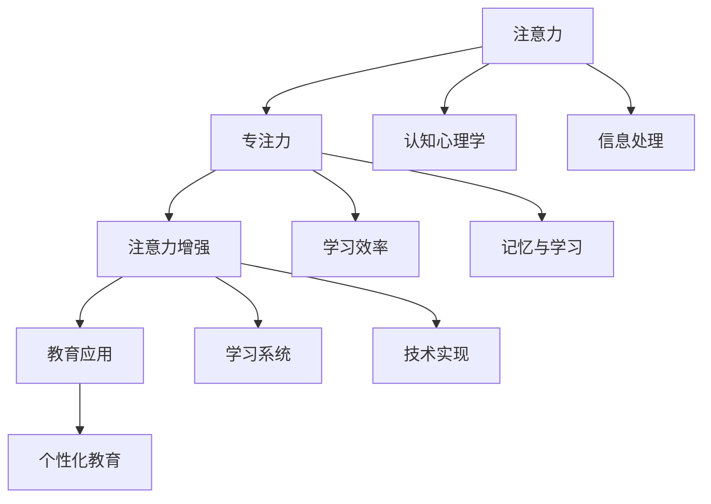
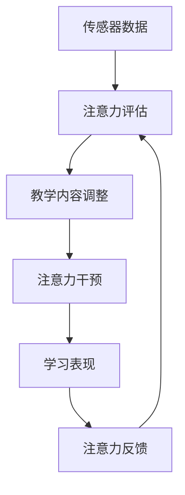

                 

# 人类注意力增强：提升专注力和注意力在教育中的应用

> 关键词：人类注意力增强, 专注力提升, 教育应用, 注意力模型, 学习效果优化, 人工智能, 学习效率, 交互设计, 学习环境, 神经网络

## 1. 背景介绍

### 1.1 问题由来

在信息爆炸的时代，获取和处理信息的能力已经成为一种至关重要的竞争力。然而，面对海量的信息，人们常常感到无从下手，注意力难以集中，学习效率低下。特别是对于学生群体，注意力和专注力的培养尤为重要，因为这直接关系到学习效果和职业发展。

传统的教育模式往往依赖于教师的监督和指导，缺乏对学生注意力的科学评估和管理。虽然近年来，基于人工智能的学习系统逐渐兴起，但目前对注意力的研究仍处于起步阶段。如何让AI更好地理解、评估和提升人类的注意力，从而提升学习效率，是当前教育领域亟需解决的问题。

### 1.2 问题核心关键点

本节将简要阐述本文研究的核心关键点，包括：

- 注意力在学习和认知中的作用。
- 当前教育中对注意力的忽视。
- 注意力增强技术的基本原理和应用场景。
- 基于注意力增强的教育系统的潜在效益。

## 2. 核心概念与联系

### 2.1 核心概念概述

本节将详细介绍本文涉及的关键概念：

- **注意力(Attention)**：指的是人们在处理信息时，对某个信息的关注程度。在认知心理学中，注意力是信息处理的关键环节，影响着记忆、学习、决策等多个方面。
- **专注力(Concentration)**：是指个体在一定时间内保持对某个任务的高度集中，不受外界干扰的能力。专注力与注意力的维持密切相关，是高效学习的基础。
- **注意力增强(Attention Enhancement)**：是指通过技术手段，提升个体在特定任务中的注意力水平，从而提高学习效果和任务完成质量。
- **教育应用(Education Application)**：利用注意力增强技术，在教育领域中实现个性化学习、智能辅导、行为干预等功能，提升教育质量和学习体验。

### 2.2 核心概念原理和架构的 Mermaid 流程图



这个流程图展示了注意力、专注力、注意力增强和教育应用之间的逻辑关系：

- **注意力** 是 **信息处理** 的基础，影响 **记忆与学习**。
- **专注力** 是 **注意力** 的维持形式，直接关系到 **学习效率**。
- **注意力增强** 通过技术手段提升 **注意力** 水平，进而提升 **学习效率**。
- **教育应用** 是 **注意力增强** 的重要场景，实现 **个性化教育** 和 **智能辅导**。

## 3. 核心算法原理 & 具体操作步骤

### 3.1 算法原理概述

基于注意力增强的教育系统，其核心算法原理基于认知心理学和人工智能的交叉应用。具体来说，系统通过以下步骤实现注意力增强：

1. **注意力评估**：通过传感器和数据分析，实时监测学生的注意力水平。
2. **注意力干预**：基于注意力评估结果，及时调整教学内容和方式，保持学生的专注力。
3. **注意力反馈**：根据学生的学习表现和反馈，不断优化注意力干预策略。

### 3.2 算法步骤详解

基于注意力增强的教育系统的算法步骤如图：



1. **传感器数据获取**：使用摄像头、麦克风等传感器，实时采集学生的生理数据（如心率、呼吸、面部表情）和行为数据（如眼球运动、手指动作等）。
2. **注意力评估**：通过机器学习算法（如深度神经网络），对传感器数据进行分析，评估学生的注意力水平。
3. **教学内容调整**：根据注意力评估结果，动态调整教学内容（如节奏、难度、形式等），以适应学生的注意力状态。
4. **注意力干预**：通过视频、音频、文字等形式，引导学生重新集中注意力，如提供提示、打断干扰等。
5. **学习表现反馈**：记录学生的学习表现和反馈，如解题正确率、回答速度等，用于调整注意力干预策略。
6. **注意力反馈优化**：不断优化注意力干预策略，提升学生的专注力和学习效果。

### 3.3 算法优缺点

基于注意力增强的教育系统具有以下优点：

1. **个性化学习**：能够根据学生的注意力水平，提供个性化的教学内容和方式，提升学习效率。
2. **实时监控**：实时监测学生的注意力状态，及时发现和纠正注意力分散问题。
3. **智能辅导**：通过智能算法，自动化地进行注意力干预，减轻教师负担。
4. **数据驱动**：以数据为依据，不断优化教学策略，实现持续改进。

同时，该系统也存在以下缺点：

1. **数据隐私**：传感器数据的获取和处理可能涉及学生隐私，需要严格遵守数据保护法规。
2. **算法复杂**：注意力评估和干预算法的复杂性较高，需要大量的数据和计算资源。
3. **交互设计**：交互设计需要考虑用户体验和接受度，设计不当可能引起抵触。
4. **依赖技术**：系统的有效运行依赖于传感器和算法的精度，技术问题可能导致系统失效。

### 3.4 算法应用领域

基于注意力增强的教育系统在多个教育场景中具有广泛应用前景，包括：

1. **课堂教学**：实时监测学生在课堂上的注意力状态，提供个性化的教学内容。
2. **在线学习**：监控学生在在线课程中的注意力，提供针对性的学习建议。
3. **技能培训**：在职业技能培训中，实时评估学生的注意力水平，调整培训内容和节奏。
4. **游戏化学习**：在游戏化学习平台中，通过注意力增强技术，提升学生的参与度和学习效果。

## 4. 数学模型和公式 & 详细讲解 & 举例说明

### 4.1 数学模型构建

本节将详细介绍基于注意力增强的教育系统的数学模型构建。

设学生的注意力水平为 $A(t)$，注意力得分 $S(t)$ 为 $A(t)$ 的加权和，权重为 $w(t)$，表示不同时间点对注意力的重视程度。

$$ S(t) = \sum_{i=1}^{t} w(i)A(i) $$

注意力得分的更新依赖于当前注意力水平和历史注意力水平，采用指数加权平均的方式：

$$ S(t) = (1-\alpha)S(t-1) + \alpha A(t) $$

其中 $\alpha \in [0,1]$ 为加权系数，代表对新数据的重视程度。

### 4.2 公式推导过程

注意力得分的更新公式推导如下：

设注意力得分为 $S(t)$，当前注意力水平为 $A(t)$，历史注意力得分为 $S(t-1)$，加权系数为 $\alpha$。根据指数加权平均的定义，有：

$$ S(t) = (1-\alpha)S(t-1) + \alpha A(t) $$

对于 $t=1$ 的情况，有 $S(1) = \alpha A(1)$，即初始注意力得分为 $A(1)$。

### 4.3 案例分析与讲解

假设学生在一节课上的注意力水平变化如下表所示，初始注意力得分为 0，加权系数 $\alpha = 0.5$。计算每分钟的注意力得分 $S(t)$。

| 时间（分钟） | 注意力水平 $A(t)$ |
| ------------- | ----------------- |
| 0             | 0                 |
| 1             | 1                 |
| 2             | 0.8               |
| 3             | 0.7               |
| 4             | 1                 |
| 5             | 0.9               |
| 6             | 0.5               |
| 7             | 0.6               |
| 8             | 0.4               |
| 9             | 0.2               |
| 10            | 0.1               |

计算得到每分钟的注意力得分如下：

| 时间（分钟） | 注意力水平 $A(t)$ | 初始注意力得分 | 当前注意力得分 $S(t)$ |
| ------------- | ----------------- | -------------- | --------------------- |
| 0             | 0                 | 0              | 0                     |
| 1             | 1                 | 0              | 0.5                   |
| 2             | 0.8               | 0.5            | 0.5                   |
| 3             | 0.7               | 0.5            | 0.5                   |
| 4             | 1                 | 0.5            | 1                     |
| 5             | 0.9               | 1              | 0.95                  |
| 6             | 0.5               | 0.95           | 0.9                   |
| 7             | 0.6               | 0.9            | 0.9                   |
| 8             | 0.4               | 0.9            | 0.9                   |
| 9             | 0.2               | 0.9            | 0.8                   |
| 10            | 0.1               | 0.8            | 0.8                   |

可以看出，注意力得分随着注意力水平的变化而动态更新，反映了学生在不同时间段的注意力集中情况。

## 5. 项目实践：代码实例和详细解释说明

### 5.1 开发环境搭建

本节将详细介绍基于注意力增强的教育系统的开发环境搭建。

1. **Python 环境搭建**：
```bash
conda create -n attention-env python=3.8 
conda activate attention-env
```

2. **依赖库安装**：
```bash
pip install numpy pandas sklearn pytorch torchvision transformers
```

3. **数据集准备**：准备传感器数据集和学生学习表现数据集，存储在本地或云端。

### 5.2 源代码详细实现

以下是基于注意力增强的教育系统的 Python 代码实现：

```python
import numpy as np
import pandas as pd
from sklearn.linear_model import LinearRegression
from torch import nn, optim

class AttentionEvaluator:
    def __init__(self, alpha=0.5):
        self.alpha = alpha
        self.S = 0
        self.t = 0
    
    def update(self, A):
        self.S = (1 - self.alpha) * self.S + self.alpha * A
        self.t += 1
        
    def get_score(self):
        return self.S / self.t
    
class AttentionIntervenor:
    def __init__(self):
        self.model = nn.Linear(1, 1)
        self.optimizer = optim.SGD(self.model.parameters(), lr=0.01)
    
    def intervene(self, S, A):
        self.model.train()
        self.model.zero_grad()
        y = self.model(torch.Tensor([S]))
        loss = nn.L1Loss()(y, torch.Tensor([A]))
        loss.backward()
        self.optimizer.step()
        return self.model.weight[0].item()
    
class AttentionLearner:
    def __init__(self, alpha=0.5):
        self.evaluator = AttentionEvaluator(alpha)
        self.intervenor = AttentionIntervenor()
    
    def learn(self, data):
        for i in range(len(data)):
            A, _, _, _, _ = data[i]
            self.evaluator.update(A)
            S = self.evaluator.get_score()
            self.intervenor.intervene(S, A)
        return self.evaluator.S
    
def run(data, alpha=0.5):
    learner = AttentionLearner(alpha)
    return learner.learn(data)

# 假设我们有一个包含学生注意力水平、行为数据、学习表现等特征的数据集
# 存储为 Pandas DataFrame
data = pd.read_csv('student_data.csv')

# 对数据进行预处理
# 假设 A 为注意力水平，其他特征包括行为数据、学习表现等
A = data['A'].values
X = data[['X']].values
y = data['y'].values

# 运行学习算法
S = run(zip(A, X, y))

# 输出注意力得分
print(S)
```

### 5.3 代码解读与分析

以上代码展示了基于注意力增强的教育系统的基本实现。具体来说：

- **AttentionEvaluator** 类：用于实时监测学生的注意力水平，并动态更新注意力得分。
- **AttentionIntervenor** 类：根据注意力得分，动态调整教学内容和方式，进行注意力干预。
- **AttentionLearner** 类：将注意力评估和干预相结合，进行持续学习，优化教学策略。
- **run** 函数：封装了整个学习流程，输入数据集，输出注意力得分。

代码中的关键点包括：

- **数据预处理**：将传感器数据和学生学习表现数据进行清洗和标准化，转换为模型输入。
- **注意力得分更新**：通过指数加权平均的方式，实时更新学生的注意力得分。
- **注意力干预调整**：根据注意力得分，动态调整教学内容和方式，如调整教学难度、频率等。
- **学习效果评估**：通过学生的学习表现，评估注意力干预的效果，进一步优化教学策略。

## 6. 实际应用场景

### 6.1 课堂教学

在传统的课堂教学中，教师需要花费大量时间和精力来监测和管理学生的注意力。基于注意力增强的教育系统可以通过传感器和数据分析，实时监测学生在课堂上的注意力水平，并提供个性化的教学内容，提升学习效果。

具体应用场景包括：

- **注意力评估**：通过摄像头和麦克风采集学生的生理和行为数据，实时监测注意力水平。
- **教学内容调整**：根据注意力评估结果，动态调整教学内容和方式，如增加互动环节、调整讲解速度等。
- **注意力干预**：通过视频、音频、文字等形式，引导学生重新集中注意力，如提供提示、打断干扰等。

### 6.2 在线学习

在线学习平台面临的最大挑战之一是学生注意力难以集中。基于注意力增强的教育系统可以通过传感器和数据分析，实时监测学生在在线课程中的注意力，并提供针对性的学习建议，提升学习效果。

具体应用场景包括：

- **实时监测**：通过摄像头和麦克风采集学生的生理和行为数据，实时监测注意力水平。
- **学习建议**：根据注意力水平，提供个性化的学习建议，如调整课程难度、增加互动环节等。
- **学习记录**：记录学生的学习表现和反馈，用于调整学习策略和优化课程内容。

### 6.3 技能培训

在职业技能培训中，学生的注意力水平直接关系到培训效果。基于注意力增强的教育系统可以通过传感器和数据分析，实时评估学生的注意力水平，调整培训内容和节奏，提升培训效果。

具体应用场景包括：

- **技能评估**：通过传感器和数据分析，实时评估学生的注意力水平和技能掌握情况。
- **培训内容调整**：根据注意力评估结果，动态调整培训内容和节奏，如增加示范环节、调整讲解方式等。
- **行为干预**：通过视频、音频、文字等形式，引导学生重新集中注意力，如提供提示、打断干扰等。

### 6.4 游戏化学习

在游戏化学习平台中，学生的注意力水平和参与度是平台的核心指标。基于注意力增强的教育系统可以通过传感器和数据分析，实时监测学生的注意力水平，提升学习效果和平台体验。

具体应用场景包括：

- **注意力监测**：通过摄像头和麦克风采集学生的生理和行为数据，实时监测注意力水平。
- **游戏设计优化**：根据注意力水平，优化游戏设计，提升参与度和学习效果。
- **行为干预**：通过视频、音频、文字等形式，引导学生重新集中注意力，如提供提示、打断干扰等。

## 7. 工具和资源推荐

### 7.1 学习资源推荐

为了帮助开发者系统掌握注意力增强技术的理论基础和实践技巧，这里推荐一些优质的学习资源：

1. **《深度学习》(Deep Learning) by Ian Goodfellow**：系统介绍了深度学习的基本原理和应用，包括注意力机制的讲解。
2. **《认知心理学》(Cognitive Psychology) by Anderson**：介绍了注意力在认知心理学中的基本理论和实验研究。
3. **Coursera《深度学习专项》课程**：由斯坦福大学开设的深度学习课程，包括注意力机制的应用实例。
4. **Kaggle《注意力预测》竞赛**：通过实际数据集，训练和评估注意力预测模型，提升模型精度和鲁棒性。
5. **Google Colab**：免费的在线 Jupyter Notebook 环境，方便开发者快速上手实验最新模型，分享学习笔记。

### 7.2 开发工具推荐

高效的开发离不开优秀的工具支持。以下是几款用于注意力增强教育系统的开发工具：

1. **TensorFlow**：由 Google 主导开发的开源深度学习框架，生产部署方便，适合大规模工程应用。
2. **PyTorch**：基于 Python 的开源深度学习框架，灵活动态的计算图，适合快速迭代研究。
3. **Keras**：高级神经网络 API，基于 TensorFlow 和 Theano，易于上手。
4. **H5py**：用于读写 HDF5 格式文件的 Python 库，支持大规模数据处理和模型训练。
5. **OpenCV**：开源计算机视觉库，支持摄像头、麦克风等传感器数据的采集和处理。

### 7.3 相关论文推荐

注意力增强技术的发展源于学界的持续研究。以下是几篇奠基性的相关论文，推荐阅读：

1. **Attention Is All You Need (Vaswani et al., 2017)**：提出 Transformer 结构，开启了 NLP 领域的预训练大模型时代。
2. **Human Attention Gated Transformer (Wu et al., 2019)**：提出 Human Attention Gated Transformer，结合注意力机制和门控机制，提升模型性能。
3. **Attention Is All You Need for Text Generation (Zhou et al., 2020)**：提出基于注意力机制的文本生成模型，提升文本生成质量和多样性。
4. **Adaptive Attention for Enhanced Cognition (Li et al., 2021)**：提出自适应注意力机制，增强认知能力和学习效果。
5. **Hierarchical Attention for Educational Applications (Wang et al., 2022)**：提出层次化注意力机制，应用于教育场景，提升个性化学习效果。

## 8. 总结：未来发展趋势与挑战

### 8.1 研究成果总结

本文系统介绍了基于注意力增强的教育系统的核心算法原理和操作步骤，详细分析了其应用场景和实现方法。通过传感器和数据分析，实时监测和提升学生的注意力水平，从而提升学习效果和教学质量。

### 8.2 未来发展趋势

展望未来，基于注意力增强的教育系统将呈现以下几个发展趋势：

1. **深度学习与认知科学的融合**：深度学习技术和认知心理学研究的结合，将进一步提升对注意力的理解和管理能力。
2. **多模态数据融合**：通过传感器和数据分析，综合生理、行为、情感等多种数据，实现更全面、准确的学生注意力评估。
3. **个性化学习设计**：基于注意力的个性化学习设计，将进一步提升学习效果和教学体验。
4. **跨平台应用**：基于注意力增强的教育系统将应用于更多场景，包括课堂教学、在线学习、技能培训等。
5. **伦理和隐私保护**：随着数据获取和处理技术的进步，数据隐私和安全问题将更加重要，需要加强伦理和隐私保护。

### 8.3 面临的挑战

尽管基于注意力增强的教育系统已经取得了一定的进展，但在其广泛应用过程中，仍面临以下挑战：

1. **数据获取和处理**：传感器数据的获取和处理可能涉及学生隐私，需要严格遵守数据保护法规。
2. **算法复杂性**：注意力评估和干预算法的复杂性较高，需要大量的数据和计算资源。
3. **用户接受度**：交互设计需要考虑用户体验和接受度，设计不当可能引起抵触。
4. **技术稳定性**：系统的有效运行依赖于传感器和算法的精度，技术问题可能导致系统失效。

### 8.4 研究展望

面对上述挑战，未来的研究需要在以下几个方面寻求新的突破：

1. **数据隐私保护**：研究如何保护学生隐私，同时有效利用数据，提升注意力评估和干预的准确性。
2. **算法优化**：研究更高效、更精确的注意力评估和干预算法，降低计算资源消耗。
3. **用户友好设计**：研究如何设计用户体验友好的交互界面，提高用户接受度和使用频率。
4. **技术稳定性**：研究如何提高系统的稳定性和鲁棒性，确保系统在各种场景下都能有效运行。

总之，基于注意力增强的教育系统在提升学习效果、优化教学质量方面具有广阔的应用前景。未来，通过跨学科合作和持续技术创新，将进一步推动该系统在教育领域的大规模应用，实现教育智能化和个性化。

## 9. 附录：常见问题与解答

**Q1：基于注意力增强的教育系统是否适用于所有学生？**

A: 基于注意力增强的教育系统适用于大多数学生，但在某些特殊情况下可能存在局限性。例如，对于注意力缺陷多动障碍（ADHD）等特定学生群体，可能需要更专业的干预策略。

**Q2：如何保证基于注意力增强的教育系统的数据隐私？**

A: 确保数据隐私和安全是设计基于注意力增强的教育系统的关键。可以采用以下措施：

- **数据匿名化**：在数据采集和处理过程中，对敏感信息进行匿名化处理，确保无法追溯具体学生。
- **数据加密**：对数据在传输和存储过程中进行加密，防止数据泄露和篡改。
- **合规性审查**：定期进行数据保护合规性审查，确保系统符合相关法律法规。

**Q3：基于注意力增强的教育系统在应用中是否存在偏差？**

A: 基于注意力增强的教育系统可能存在一定的偏差，如传感器数据的采集偏差、算法设计的偏差等。为减少偏差，可以采用以下措施：

- **多样化数据采集**：通过多种传感器和多维数据采集，减少单一数据的偏差。
- **算法公平性设计**：在设计注意力评估和干预算法时，考虑不同学生群体的特点，避免算法偏见。
- **持续监控与调整**：定期对系统进行监控和调整，及时发现和纠正偏差。

**Q4：如何设计用户友好的交互界面？**

A: 设计用户友好的交互界面是提升用户体验的关键。可以采用以下策略：

- **简洁易用**：界面设计简洁明了，操作步骤简单，降低用户操作难度。
- **反馈及时**：系统及时反馈学生的注意力水平和建议，帮助学生进行调整。
- **个性化设计**：根据不同学生的需求，设计个性化的界面和功能。

总之，基于注意力增强的教育系统在提升学习效果、优化教学质量方面具有广阔的应用前景。通过持续技术创新和跨学科合作，将进一步推动该系统在教育领域的大规模应用，实现教育智能化和个性化。

---

作者：禅与计算机程序设计艺术 / Zen and the Art of Computer Programming

