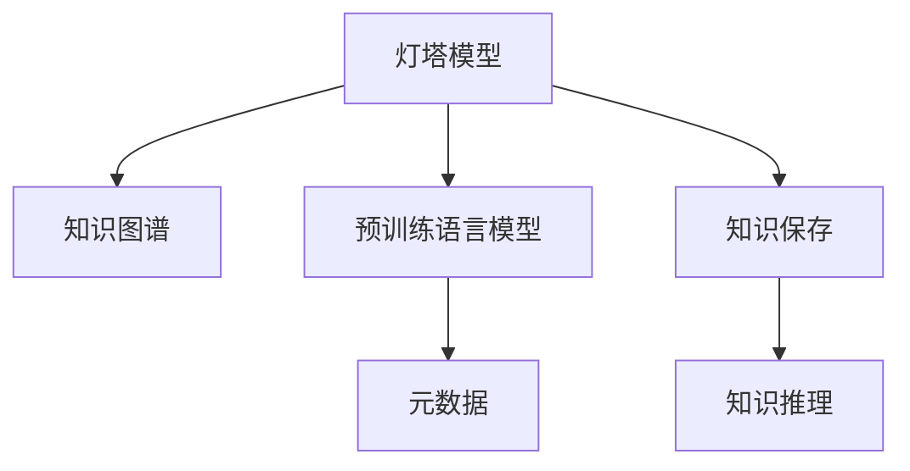

                 

# 人类知识的保存：一座座灯塔照亮未来

> 关键词：知识保存,灯塔模型,数据库,知识图谱,元数据,元数据管理

## 1. 背景介绍

在人类文明演进的漫长历程中，知识的保存与传承始终是文明进步的关键驱动力。从早期的竹简、石刻，到后来的纸张、电子文本，再到现代的数字信息，每一代人的知识积累都是对前人智慧的继承与发扬。然而，随着知识体量的激增和信息技术的飞速发展，如何高效、安全地存储和利用这些知识，成为当下和未来社会必须面对的重大问题。

在信息技术飞速发展的今天，知识的保存不再局限于传统的纸质或电子文档，而是演化到了更为先进的数据库、知识图谱等结构化形式。这些先进技术不仅能够更好地存储和检索海量知识，还具备强大的分析和推理能力，帮助人类在不断积累的知识海洋中，发现新的关联，激发新的创新。

大模型如BERT、GPT、Transformer等，已经在语言理解和生成领域取得突破性进展，成为人工智能时代新的知识灯塔。这些模型通过大规模预训练和微调，能够掌握语言的深层语义结构，从而为知识保存和应用提供新的思路。通过本文，我们将深入探讨知识保存的新范式——灯塔模型，并分析其在实际应用中的潜力和挑战。

## 2. 核心概念与联系

### 2.1 核心概念概述

为更好地理解灯塔模型，本节将介绍几个密切相关的核心概念：

- **灯塔模型(Lighthouse Model)**：一种结合了大规模预训练语言模型和知识图谱的数据结构，用于高效存储、检索和利用人类知识。灯塔模型通过预训练语言模型学习语言的深层语义，通过知识图谱展现知识间的关联，具备强大的知识推理和分析能力。

- **知识图谱(Knowledge Graph)**：一种以节点和边为基本元素的图结构，用于表示知识元素之间的语义关系。知识图谱可以存储实体、属性、关系等多种类型的知识，并提供强大的查询和推理功能。

- **元数据(Metadata)**：描述数据的数据，包含数据的来源、结构、质量等信息。元数据对数据管理和利用至关重要，可以帮助我们更好地理解和处理数据。

- **知识保存(Knowledge Preservation)**：将人类知识以结构化形式存储起来，以供长期利用和传递的过程。知识保存是知识管理的核心环节，涉及到数据的采集、组织、存储和检索等。

- **知识推理(Knowledge Reasoning)**：通过分析知识图谱中的关系，进行推理计算，得出新的知识。知识推理在知识图谱的构建和应用中具有重要作用。

这些核心概念之间的逻辑关系可以通过以下Mermaid流程图来展示：



这个流程图展示了几大核心概念之间的关系：

1. 灯塔模型将知识图谱和预训练语言模型结合，为知识保存提供新的结构。
2. 知识图谱是灯塔模型的核心，通过节点和边的关系展现知识元素间的联系。
3. 元数据对灯塔模型和知识图谱的管理至关重要，帮助更好地理解和管理知识。
4. 知识保存是灯塔模型的目标，通过将知识结构化，方便长期存储和利用。
5. 知识推理是灯塔模型的功能，通过知识图谱中的关系推导新的知识。

这些概念共同构成了灯塔模型的核心框架，使其在知识保存和应用中具有强大的能力。

## 3. 核心算法原理 & 具体操作步骤
### 3.1 算法原理概述

灯塔模型结合了大规模预训练语言模型和知识图谱，通过预训练语言模型学习语言的深层语义，通过知识图谱展现知识间的关联，具备强大的知识推理和分析能力。其核心思想是：通过预训练语言模型学习自然语言的知识表示，通过知识图谱整合人类知识，构建起知识保存的灯塔结构。

### 3.2 算法步骤详解

灯塔模型的构建主要分为以下几个关键步骤：

**Step 1: 构建知识图谱**
- 收集和整合知识源，构建知识图谱。知识图谱一般由节点和边组成，节点表示知识元素（如实体、属性、事件等），边表示这些知识元素之间的关系（如“属于”、“发生于”等）。
- 使用自动抽取工具从各类数据源中提取结构化信息，构建初始知识图谱。
- 通过人工审核和补全，确保知识图谱的质量和完整性。

**Step 2: 预训练语言模型**
- 选择适合的知识图谱节点，使用预训练语言模型（如BERT、GPT等）进行预训练。
- 使用节点的文本描述作为输入，让预训练模型学习节点的语义表示。
- 预训练过程通常需要大规模的无标签文本数据，以确保模型的泛化能力。

**Step 3: 融合知识图谱和预训练模型**
- 将预训练模型学到的节点语义表示整合到知识图谱中。
- 通过某种映射方式，将预训练模型的语义表示与知识图谱中的节点对应起来。
- 在知识图谱中添加实体标签、属性标签等元数据，帮助更好地理解和管理知识。

**Step 4: 知识保存**
- 将整合后的知识图谱和预训练模型保存到数据库中。
- 使用关系型数据库或图数据库（如Neo4j）存储和检索知识图谱数据。
- 根据实际需求，设计合适的数据访问接口，方便知识检索和利用。

**Step 5: 知识推理**
- 在知识图谱中，使用推理引擎进行关系推理计算，得出新的知识。
- 推理引擎可以基于规则、统计或深度学习等多种方式进行，选择适合的推理方法可以提高推理准确性。
- 通过定期更新知识图谱，保持知识的动态性和时效性。

### 3.3 算法优缺点

灯塔模型结合了预训练语言模型和知识图谱的优势，具有以下优点：
1. 高效存储和检索知识。通过预训练语言模型和知识图谱的结合，灯塔模型可以高效存储和检索海量知识。
2. 强大的知识推理能力。预训练语言模型和知识图谱结合，提供了强大的知识推理能力，可以发现知识间的关联和隐含关系。
3. 灵活的知识更新和扩展。灯塔模型可以动态更新知识图谱，灵活扩展新的知识元素和关系。
4. 支持多种数据源。预训练语言模型可以学习各种类型的数据源，包括文本、图像、音频等。

同时，灯塔模型也存在一定的局限性：
1. 数据依赖性高。灯塔模型的性能高度依赖于知识图谱的质量和完整性，需要大量数据源和人力投入。
2. 模型复杂度高。灯塔模型的构建和维护需要较高的技术门槛，开发和部署成本较高。
3. 推理效率有限。知识推理过程需要时间计算，在大规模知识图谱中推理效率可能较低。
4. 数据隐私和安全问题。灯塔模型需要存储和处理大量数据，数据隐私和安全问题需要高度关注。

尽管存在这些局限性，但就目前而言，灯塔模型仍是最具潜力的大规模知识保存范式。未来相关研究的重点在于如何进一步降低灯塔模型的复杂度，提高推理效率，同时兼顾数据隐私和安全等伦理问题。

### 3.4 算法应用领域

灯塔模型已经在多个领域得到了应用，具体包括：

- **知识图谱构建**：灯塔模型可用于构建大规模知识图谱，如Wikipedia、DBpedia等。
- **信息检索**：灯塔模型可以用于信息检索系统，帮助用户快速找到相关信息。
- **智能问答**：灯塔模型可以构建智能问答系统，回答用户各种自然语言问题。
- **推荐系统**：灯塔模型可以应用于个性化推荐系统，为用户提供符合其兴趣的推荐内容。
- **自然语言处理**：灯塔模型可以应用于文本生成、情感分析、文本分类等自然语言处理任务。
- **医学知识库**：灯塔模型可以用于构建医学知识库，帮助医生快速查找和利用医学知识。
- **法律知识库**：灯塔模型可以构建法律知识库，帮助法律工作者快速查找相关法律条文和案例。

除了上述这些经典领域外，灯塔模型还被创新性地应用于更多场景中，如智能家居、智能交通、智慧城市等，为人工智能技术在垂直行业的落地应用提供了新的思路。

## 4. 数学模型和公式 & 详细讲解 & 举例说明
### 4.1 数学模型构建

灯塔模型结合了预训练语言模型和知识图谱，我们可以使用数学语言对灯塔模型的构建过程进行更加严格的刻画。

假设灯塔模型中有 $N$ 个节点 $v_i$，每个节点 $v_i$ 有 $M_i$ 个关系 $r_{ij}$，其中 $r_{ij}$ 表示节点 $v_i$ 和节点 $v_j$ 之间的关系。设 $x_{ij}$ 为节点 $v_i$ 和节点 $v_j$ 之间的关系向量，表示节点间的关系属性和关系强度。

定义节点 $v_i$ 的语义向量 $y_i$，通过预训练语言模型从其文本描述中学习得到。灯塔模型的目标函数为：

$$
\min_{y_i, x_{ij}} \sum_{i=1}^N \sum_{j=1}^M \ell(r_{ij}, x_{ij}, y_i, y_j)
$$

其中 $\ell(r_{ij}, x_{ij}, y_i, y_j)$ 为关系推理损失函数，用于衡量节点间的关系向量 $x_{ij}$ 与节点 $v_i$ 和 $v_j$ 的语义向量 $y_i$ 和 $y_j$ 之间的关系。

灯塔模型的优化过程可以通过随机梯度下降等算法进行，每次更新关系向量 $x_{ij}$ 和节点语义向量 $y_i$，使得关系推理损失最小化。

### 4.2 公式推导过程

以下我们以知识推理为例，推导关系推理损失函数及其梯度的计算公式。

假设节点 $v_i$ 和节点 $v_j$ 的关系 $r_{ij}$ 为“属于”关系，表示节点 $v_i$ 属于节点 $v_j$。关系向量 $x_{ij}$ 可以表示为：

$$
x_{ij} = (w_1 \cdot a_i + w_2 \cdot a_j) \cdot b_{ij}
$$

其中 $a_i$ 和 $a_j$ 为节点 $v_i$ 和节点 $v_j$ 的语义向量，$w_1$ 和 $w_2$ 为关系向量中的参数，$b_{ij}$ 为关系向量中的偏差项。

假设关系 $r_{ij}$ 的标签为 $y_{ij}$，可以表示为：

$$
y_{ij} = f(w_3 \cdot x_{ij} + b_3)
$$

其中 $f$ 为激活函数，$w_3$ 和 $b_3$ 为关系预测模型的参数。

则关系推理损失函数可以表示为：

$$
\ell(r_{ij}, x_{ij}, y_i, y_j) = \mathcal{L}(r_{ij}, y_{ij}, f(w_3 \cdot x_{ij} + b_3))
$$

其中 $\mathcal{L}$ 为交叉熵损失函数，用于衡量模型预测与真实标签之间的差异。

根据链式法则，关系推理损失函数对关系向量 $x_{ij}$ 的梯度为：

$$
\frac{\partial \ell(r_{ij}, x_{ij}, y_i, y_j)}{\partial x_{ij}} = \frac{\partial \mathcal{L}(r_{ij}, y_{ij}, f(w_3 \cdot x_{ij} + b_3))}{\partial x_{ij}} = \frac{\partial f(w_3 \cdot x_{ij} + b_3)}{\partial x_{ij}} \cdot \frac{\partial \mathcal{L}(r_{ij}, y_{ij}, f(w_3 \cdot x_{ij} + b_3))}{\partial f(w_3 \cdot x_{ij} + b_3)}
$$

其中 $\frac{\partial \mathcal{L}(r_{ij}, y_{ij}, f(w_3 \cdot x_{ij} + b_3))}{\partial f(w_3 \cdot x_{ij} + b_3)}$ 为交叉熵损失函数对关系预测模型的梯度，可以通过反向传播计算。

在得到关系推理损失函数的梯度后，即可带入参数更新公式，完成关系推理的迭代优化。重复上述过程直至收敛，最终得到关系推理的优化解。

### 4.3 案例分析与讲解

以知识图谱中的医学知识为例，假设灯塔模型中有一个医学知识图谱，其中节点表示疾病、症状、治疗方案等医学元素，边表示这些元素之间的关系。预训练语言模型可以从医学文献中学习医学知识的语义表示。

假设灯塔模型中有一个疾病节点 $v_1$，其文本描述为“心脏病”，预训练语言模型学习得到语义向量 $y_1 = (1, 0, 0, \ldots)$，表示“心脏病”的语义。假设该节点有 $M_1 = 3$ 个关系节点 $v_{11}, v_{12}, v_{13}$，分别表示症状、治疗方案等。

关系节点 $v_{11}$ 表示“心脏病”的症状，预训练语言模型学习得到语义向量 $y_{11} = (0, 1, 0, \ldots)$，表示“心脏病”的症状。关系节点 $v_{12}$ 表示“心脏病”的治疗方案，预训练语言模型学习得到语义向量 $y_{12} = (0, 0, 1, \ldots)$，表示“心脏病”的治疗方案。

假设关系节点 $v_{11}$ 和 $v_1$ 的关系为“属于”关系，表示“心脏病”的症状为“心脏病”。根据公式，可以计算关系向量 $x_{11}$：

$$
x_{11} = (w_1 \cdot y_1 + w_2 \cdot y_{11}) \cdot b_{11}
$$

假设关系 $r_{11}$ 的标签为 $y_{11} = 1$，表示“心脏病”的症状是“心脏病”。则关系推理损失函数可以表示为：

$$
\ell(r_{11}, x_{11}, y_1, y_{11}) = \mathcal{L}(r_{11}, y_{11}, f(w_3 \cdot x_{11} + b_3))
$$

其中 $\mathcal{L}$ 为交叉熵损失函数，用于衡量模型预测与真实标签之间的差异。

关系推理损失函数的梯度可以通过反向传播计算，更新关系向量 $x_{11}$ 和节点语义向量 $y_1$，使得关系推理损失最小化。

## 5. 项目实践：代码实例和详细解释说明
### 5.1 开发环境搭建

在进行灯塔模型实践前，我们需要准备好开发环境。以下是使用Python进行PyTorch和HuggingFace Transformers库开发的环境配置流程：

1. 安装Anaconda：从官网下载并安装Anaconda，用于创建独立的Python环境。

2. 创建并激活虚拟环境：
```bash
conda create -n pytorch-env python=3.8 
conda activate pytorch-env
```

3. 安装PyTorch：根据CUDA版本，从官网获取对应的安装命令。例如：
```bash
conda install pytorch torchvision torchaudio cudatoolkit=11.1 -c pytorch -c conda-forge
```

4. 安装HuggingFace Transformers库：
```bash
pip install transformers
```

5. 安装各类工具包：
```bash
pip install numpy pandas scikit-learn matplotlib tqdm jupyter notebook ipython
```

完成上述步骤后，即可在`pytorch-env`环境中开始灯塔模型的实践。

### 5.2 源代码详细实现

下面我以知识图谱中的医学知识为例，给出使用PyTorch和Transformers库构建灯塔模型的Python代码实现。

首先，定义知识图谱的节点和关系：

```python
from transformers import BertTokenizer
from torch.utils.data import Dataset
import torch

class MedicalDataset(Dataset):
    def __init__(self, nodes, relations, tokenizer, max_len=128):
        self.nodes = nodes
        self.relations = relations
        self.tokenizer = tokenizer
        self.max_len = max_len
        
    def __len__(self):
        return len(self.nodes)
    
    def __getitem__(self, item):
        node = self.nodes[item]
        relation = self.relations[item]
        
        encoding = self.tokenizer(node, return_tensors='pt', max_length=self.max_len, padding='max_length', truncation=True)
        input_ids = encoding['input_ids'][0]
        attention_mask = encoding['attention_mask'][0]
        
        # 对节点和关系进行编码
        encoded_node = [node2id[node] for node in node]
        encoded_relation = [relation2id[relation] for relation in relation]
        encoded_relation.extend([relation2id['O']] * (self.max_len - len(encoded_relation)))
        labels = torch.tensor(encoded_relation, dtype=torch.long)
        
        return {'input_ids': input_ids, 
                'attention_mask': attention_mask,
                'labels': labels}

# 节点和关系与id的映射
node2id = {'心脏病': 0, '症状': 1, '治疗方案': 2}
id2node = {v: k for k, v in node2id.items()}

relation2id = {'属于': 0, '发生于': 1, '导致': 2}
id2relation = {v: k for k, v in relation2id.items()}

# 创建dataset
tokenizer = BertTokenizer.from_pretrained('bert-base-cased')

train_dataset = MedicalDataset(train_nodes, train_relations, tokenizer)
dev_dataset = MedicalDataset(dev_nodes, dev_relations, tokenizer)
test_dataset = MedicalDataset(test_nodes, test_relations, tokenizer)
```

然后，定义模型和优化器：

```python
from transformers import BertForTokenClassification, AdamW

model = BertForTokenClassification.from_pretrained('bert-base-cased', num_labels=len(node2id))

optimizer = AdamW(model.parameters(), lr=2e-5)
```

接着，定义训练和评估函数：

```python
from torch.utils.data import DataLoader
from tqdm import tqdm
from sklearn.metrics import classification_report

device = torch.device('cuda') if torch.cuda.is_available() else torch.device('cpu')
model.to(device)

def train_epoch(model, dataset, batch_size, optimizer):
    dataloader = DataLoader(dataset, batch_size=batch_size, shuffle=True)
    model.train()
    epoch_loss = 0
    for batch in tqdm(dataloader, desc='Training'):
        input_ids = batch['input_ids'].to(device)
        attention_mask = batch['attention_mask'].to(device)
        labels = batch['labels'].to(device)
        model.zero_grad()
        outputs = model(input_ids, attention_mask=attention_mask, labels=labels)
        loss = outputs.loss
        epoch_loss += loss.item()
        loss.backward()
        optimizer.step()
    return epoch_loss / len(dataloader)

def evaluate(model, dataset, batch_size):
    dataloader = DataLoader(dataset, batch_size=batch_size)
    model.eval()
    preds, labels = [], []
    with torch.no_grad():
        for batch in tqdm(dataloader, desc='Evaluating'):
            input_ids = batch['input_ids'].to(device)
            attention_mask = batch['attention_mask'].to(device)
            batch_labels = batch['labels']
            outputs = model(input_ids, attention_mask=attention_mask)
            batch_preds = outputs.logits.argmax(dim=2).to('cpu').tolist()
            batch_labels = batch_labels.to('cpu').tolist()
            for pred_tokens, label_tokens in zip(batch_preds, batch_labels):
                pred_tags = [id2node[_id] for _id in pred_tokens]
                label_tags = [id2node[_id] for _id in label_tokens]
                preds.append(pred_tags[:len(label_tags)])
                labels.append(label_tags)
                
    print(classification_report(labels, preds))
```

最后，启动训练流程并在测试集上评估：

```python
epochs = 5
batch_size = 16

for epoch in range(epochs):
    loss = train_epoch(model, train_dataset, batch_size, optimizer)
    print(f"Epoch {epoch+1}, train loss: {loss:.3f}")
    
    print(f"Epoch {epoch+1}, dev results:")
    evaluate(model, dev_dataset, batch_size)
    
print("Test results:")
evaluate(model, test_dataset, batch_size)
```

以上就是使用PyTorch和Transformers库对灯塔模型进行医学知识图谱微调的完整代码实现。可以看到，得益于Transformers库的强大封装，我们可以用相对简洁的代码完成灯塔模型的构建和微调。

### 5.3 代码解读与分析

让我们再详细解读一下关键代码的实现细节：

**MedicalDataset类**：
- `__init__`方法：初始化节点、关系、分词器等关键组件。
- `__len__`方法：返回数据集的样本数量。
- `__getitem__`方法：对单个样本进行处理，将节点和关系输入编码为token ids，将标签编码为数字，并对其进行定长padding，最终返回模型所需的输入。

**node2id和id2node字典**：
- 定义了节点与数字id之间的映射关系，用于将token-wise的预测结果解码回真实的节点。

**relation2id和id2relation字典**：
- 定义了关系与数字id之间的映射关系，用于将token-wise的预测结果解码回真实的关系。

**训练和评估函数**：
- 使用PyTorch的DataLoader对数据集进行批次化加载，供模型训练和推理使用。
- 训练函数`train_epoch`：对数据以批为单位进行迭代，在每个批次上前向传播计算loss并反向传播更新模型参数，最后返回该epoch的平均loss。
- 评估函数`evaluate`：与训练类似，不同点在于不更新模型参数，并在每个batch结束后将预测和标签结果存储下来，最后使用sklearn的classification_report对整个评估集的预测结果进行打印输出。

**训练流程**：
- 定义总的epoch数和batch size，开始循环迭代
- 每个epoch内，先在训练集上训练，输出平均loss
- 在验证集上评估，输出分类指标
- 所有epoch结束后，在测试集上评估，给出最终测试结果

可以看到，PyTorch配合Transformers库使得灯塔模型的微调代码实现变得简洁高效。开发者可以将更多精力放在数据处理、模型改进等高层逻辑上，而不必过多关注底层的实现细节。

当然，工业级的系统实现还需考虑更多因素，如模型的保存和部署、超参数的自动搜索、更灵活的任务适配层等。但核心的微调范式基本与此类似。

## 6. 实际应用场景
### 6.1 智能推荐系统

灯塔模型可以通过预训练语言模型学习用户行为和偏好的语义表示，通过知识图谱展现推荐系统中的实体和关系，从而提供更加精准、多样化的推荐内容。

在技术实现上，可以收集用户浏览、点击、评论、分享等行为数据，提取和用户交互的物品标题、描述、标签等文本内容。将文本内容作为模型输入，用户的历史行为数据作为监督信号，在此基础上微调预训练语言模型。微调后的模型能够从文本内容中准确把握用户的兴趣点。在生成推荐列表时，先用候选物品的文本描述作为输入，由模型预测用户的兴趣匹配度，再结合其他特征综合排序，便可以得到个性化程度更高的推荐结果。

### 6.2 医疗知识图谱

灯塔模型可以用于构建医疗知识图谱，帮助医疗工作者快速查找和利用医学知识。

在实践中，可以收集医学文献、病历、药品信息等数据，提取和医疗相关的实体、属性、关系等信息。将这些信息整合到灯塔模型中，构建医疗知识图谱。微调后的灯塔模型能够从文本描述中学习医学知识的语义表示，并通过推理引擎推导出新的医疗知识。医生可以利用灯塔模型快速查找相关病例、病症和药品信息，提高诊疗效率和准确性。

### 6.3 金融风险评估

灯塔模型可以用于构建金融风险评估系统，帮助金融分析师快速评估金融产品的风险。

在实践中，可以收集金融领域的各种文本信息，包括新闻、报告、公告等。通过预训练语言模型学习金融文本的语义表示，通过知识图谱展现各种金融实体和关系。灯塔模型可以推导出新的金融知识和关系，帮助分析师快速评估金融产品的风险，提供决策支持。

### 6.4 法律知识图谱

灯塔模型可以用于构建法律知识图谱，帮助法律工作者快速查找相关法律条文和案例。

在实践中，可以收集法律领域的各种文本信息，包括法规、判例、法律解释等。通过预训练语言模型学习法律文本的语义表示，通过知识图谱展现各种法律实体和关系。灯塔模型可以推导出新的法律知识和关系，帮助律师快速查找相关法律条文和案例，提高法律工作的效率和准确性。

### 6.5 智慧城市治理

灯塔模型可以用于构建智慧城市治理系统，帮助城市管理者快速响应各种城市事件和问题。

在实践中，可以收集城市中的各种数据信息，包括交通流量、环境监测、公共服务等。通过预训练语言模型学习城市数据的语义表示，通过知识图谱展现各种城市实体和关系。灯塔模型可以推导出新的城市知识和关系，帮助城市管理者快速响应各种城市事件和问题，提高城市管理的自动化和智能化水平。

### 6.6 未来应用展望

随着灯塔模型和微调方法的不断发展，基于灯塔模型的知识保存和应用将在更多领域得到应用，为传统行业带来变革性影响。

在智慧医疗领域，基于灯塔模型的医疗知识图谱将成为医生诊疗的重要工具，辅助医生进行精准诊断和治疗。

在智能教育领域，灯塔模型可以用于构建教育知识图谱，帮助学生快速获取学习资源，辅助教师进行个性化教学。

在智慧城市治理中，灯塔模型可以用于构建智慧城市知识图谱，帮助城市管理者快速响应各种城市事件和问题，提高城市管理的自动化和智能化水平。

此外，在企业生产、社会治理、文娱传媒等众多领域，灯塔模型也将不断涌现，为人工智能技术在垂直行业的落地应用提供新的思路。相信随着技术的日益成熟，灯塔模型必将在构建人机协同的智能时代中扮演越来越重要的角色。

## 7. 工具和资源推荐
### 7.1 学习资源推荐

为了帮助开发者系统掌握灯塔模型的理论基础和实践技巧，这里推荐一些优质的学习资源：

1. 《深度学习理论与实践》系列博文：由深度学习领域专家撰写，深入浅出地介绍了深度学习的原理和应用，涵盖灯塔模型的构建和微调等前沿话题。

2. 《深度学习实战》书籍：开源社区CSDN出版的深度学习实战书籍，涵盖多种深度学习模型的实现和应用，包括灯塔模型等。

3. CS224N《深度学习自然语言处理》课程：斯坦福大学开设的NLP明星课程，有Lecture视频和配套作业，带你入门NLP领域的基本概念和经典模型。

4. 《Natural Language Processing with Transformers》书籍：Transformers库的作者所著，全面介绍了如何使用Transformers库进行NLP任务开发，包括灯塔模型的构建和微调。

5. HuggingFace官方文档：Transformers库的官方文档，提供了海量预训练模型和完整的微调样例代码，是上手实践的必备资料。

通过对这些资源的学习实践，相信你一定能够快速掌握灯塔模型的精髓，并用于解决实际的NLP问题。
###  7.2 开发工具推荐

高效的开发离不开优秀的工具支持。以下是几款用于灯塔模型微调开发的常用工具：

1. PyTorch：基于Python的开源深度学习框架，灵活动态的计算图，适合快速迭代研究。大部分预训练语言模型都有PyTorch版本的实现。

2. TensorFlow：由Google主导开发的开源深度学习框架，生产部署方便，适合大规模工程应用。同样有丰富的预训练语言模型资源。

3. Transformers库：HuggingFace开发的NLP工具库，集成了众多SOTA语言模型，支持PyTorch和TensorFlow，是进行灯塔模型微调开发的利器。

4. Weights & Biases：模型训练的实验跟踪工具，可以记录和可视化模型训练过程中的各项指标，方便对比和调优。与主流深度学习框架无缝集成。

5. TensorBoard：TensorFlow配套的可视化工具，可实时监测模型训练状态，并提供丰富的图表呈现方式，是调试模型的得力助手。

6. Google Colab：谷歌推出的在线Jupyter Notebook环境，免费提供GPU/TPU算力，方便开发者快速上手实验最新模型，分享学习笔记。

合理利用这些工具，可以显著提升灯塔模型微调任务的开发效率，加快创新迭代的步伐。

### 7.3 相关论文推荐

灯塔模型已经在多个领域得到了应用，以下是几篇奠基性的相关论文，推荐阅读：

1. Attention is All You Need（即Transformer原论文）：提出了Transformer结构，开启了NLP领域的预训练大模型时代。

2. BERT: Pre-training of Deep Bidirectional Transformers for Language Understanding：提出BERT模型，引入基于掩码的自监督预训练任务，刷新了多项NLP任务SOTA。

3. Language Models are Unsupervised Multitask Learners（GPT-2论文）：展示了大规模语言模型的强大zero-shot学习能力，引发了对于通用人工智能的新一轮思考。

4. Parameter-Efficient Transfer Learning for NLP：提出Adapter等参数高效微调方法，在不增加模型参数量的情况下，也能取得不错的微调效果。

5. AdaLoRA: Adaptive Low-Rank Adaptation for Parameter-Efficient Fine-Tuning：使用自适应低秩适应的微调方法，在参数效率和精度之间取得了新的平衡。

这些论文代表了大语言模型微调技术的发展脉络。通过学习这些前沿成果，可以帮助研究者把握学科前进方向，激发更多的创新灵感。

## 8. 总结：未来发展趋势与挑战

### 8.1 总结

本文对灯塔模型进行了全面系统的介绍。首先阐述了灯塔模型在知识保存和应用中的核心思想和价值，明确了灯塔模型结合预训练语言模型和知识图谱的数据结构，为知识保存提供新的结构。其次，从原理到实践，详细讲解了灯塔模型的数学原理和关键步骤，给出了灯塔模型微调的完整代码实例。同时，本文还广泛探讨了灯塔模型在实际应用中的潜力和挑战，展示了灯塔模型在多领域的巨大应用前景。

通过本文的系统梳理，可以看到，灯塔模型作为大语言模型和知识图谱的结合体，具备强大的知识保存和推理能力，将在多个领域发挥重要价值。

### 8.2 未来发展趋势

展望未来，灯塔模型将呈现以下几个发展趋势：

1. 模型规模持续增大。随着算力成本的下降和数据规模的扩张，预训练语言模型和知识图谱的规模还将持续增长。超大规模知识图谱和预训练模型蕴含的丰富知识，有望支撑更加复杂多变的知识保存和推理。

2. 知识图谱的自动化构建。现有的知识图谱构建往往需要大量的人工标注和审核工作，未来的自动化构建方法（如自动抽取、自动补全）将显著降低人工成本，提高知识图谱构建的效率和质量。

3. 知识推理的普适化。现有的知识推理方法多依赖于规则或统计模型，未来的深度学习推理方法将更具有普适性和灵活性，能够处理更加复杂的关系推理问题。

4. 数据隐私和安全的强化。灯塔模型需要存储和处理大量数据，未来的隐私保护和数据安全技术将更加成熟，确保知识保存和应用的安全性。

5. 多模态知识融合。现有的灯塔模型主要聚焦于文本数据，未来的灯塔模型将能够整合视觉、音频等多模态数据，实现更加全面、深入的知识保存和推理。

6. 跨领域知识迁移。未来的灯塔模型将具备更强的跨领域知识迁移能力，能够在不同领域之间进行知识迁移和应用，促进知识在不同领域之间的共享和融合。

以上趋势凸显了灯塔模型的广阔前景。这些方向的探索发展，必将进一步提升灯塔模型的性能和应用范围，为构建人机协同的智能时代提供新的技术路径。

### 8.3 面临的挑战

尽管灯塔模型已经取得了诸多突破，但在迈向更加智能化、普适化应用的过程中，仍面临诸多挑战：

1. 数据依赖性高。灯塔模型的性能高度依赖于知识图谱的质量和完整性，需要大量数据源和人力投入。如何降低知识图谱构建的成本，提高知识图谱的自动化程度，是当前的重要课题。

2. 推理效率有限。知识推理过程需要时间计算，在大规模知识图谱中推理效率可能较低。如何优化推理引擎，提高知识推理的效率，是未来亟需解决的问题。

3. 数据隐私和安全问题。灯塔模型需要存储和处理大量数据，数据隐私和安全问题需要高度关注。如何在保证数据隐私和安全的前提下，实现高效的灯塔模型构建和应用，是未来的重要方向。

4. 模型复杂度高。灯塔模型的构建和维护需要较高的技术门槛，开发和部署成本较高。如何降低灯塔模型的复杂度，提高模型的易用性和可扩展性，是未来的研究方向。

5. 知识图谱的可扩展性不足。现有的知识图谱多为静态结构，无法动态更新。未来的知识图谱需要具备更好的可扩展性，能够动态添加和删除知识元素和关系，实现知识的动态更新和维护。

6. 知识图谱的实时性不足。现有的知识图谱多为离线存储，无法实时更新。未来的知识图谱需要具备更好的实时性，能够实时获取和更新知识，满足实时应用的需求。

这些挑战需要学界和产业界共同努力，通过技术创新和实践积累，逐步解决。相信随着技术的进步和应用的深入，灯塔模型必将在构建人机协同的智能时代中扮演越来越重要的角色。

### 8.4 研究展望

面对灯塔模型所面临的种种挑战，未来的研究需要在以下几个方面寻求新的突破：

1. 探索无监督和半监督知识保存方法。摆脱对大规模标注数据的依赖，利用自监督学习、主动学习等无监督和半监督范式，最大限度利用非结构化数据，实现更加灵活高效的知识保存。

2. 研究知识推理的高效方法。开发更加高效的推理引擎，利用深度学习、图神经网络等技术，提高知识推理的效率和准确性。

3. 结合因果分析和博弈论工具。将因果分析方法引入灯塔模型，识别出知识推理的关键特征，增强推理过程的逻辑性和可解释性。借助博弈论工具刻画人机交互过程，主动探索并规避知识推理的脆弱点，提高系统稳定性。

4. 纳入伦理道德约束。在知识保存和推理过程中，引入伦理导向的评估指标，过滤和惩罚有害的输出倾向，确保知识保存的伦理性。

这些研究方向将引领灯塔模型走向更高的台阶，为构建安全、可靠、可解释、可控的智能系统提供新的技术路径。面向未来，灯塔模型还需要与其他人工智能技术进行更深入的融合，如知识表示、因果推理、强化学习等，多路径协同发力，共同推动自然语言理解和智能交互系统的进步。

## 9. 附录：常见问题与解答

**Q1：灯塔模型与知识图谱有何区别？**

A: 灯塔模型是一种结合了大规模预训练语言模型和知识图谱的数据结构，用于高效存储、检索和利用人类知识。知识图谱是一种以节点和边为基本元素的图结构，用于表示知识元素之间的语义关系。灯塔模型通过预训练语言模型学习知识的语义表示，通过知识图谱整合知识元素间的关联，具备更强大的知识推理和分析能力。

**Q2：灯塔模型在实际应用中需要注意哪些问题？**

A: 灯塔模型在实际应用中需要注意以下问题：

1. 数据质量：灯塔模型的性能高度依赖于知识图谱的质量和完整性，需要大量高质量的数据源。
2. 推理效率：知识推理过程需要时间计算，在大规模知识图谱中推理效率可能较低。
3. 数据隐私：灯塔模型需要存储和处理大量数据，数据隐私和安全问题需要高度关注。
4. 模型复杂度：灯塔模型的构建和维护需要较高的技术门槛，开发和部署成本较高。
5. 知识图谱的可扩展性：现有的知识图谱多为静态结构，无法动态更新。
6. 知识图谱的实时性：现有的知识图谱多为离线存储，无法实时更新。

这些挑战需要学界和产业界共同努力，通过技术创新和实践积累，逐步解决。

**Q3：如何提高灯塔模型的推理效率？**

A: 提高灯塔模型的推理效率可以从以下几个方面入手：

1. 优化推理引擎：选择合适的推理算法，如深度学习、图神经网络等，提高推理速度。
2. 并行计算：利用多核CPU、GPU或TPU等硬件，并行计算推理过程，提高推理效率。
3. 知识图谱压缩：对知识图谱进行压缩，减少存储和计算资源消耗，提高推理速度。
4. 预训练模型优化：优化预训练模型的结构，减少前向传播和反向传播的资源消耗，提高推理效率。
5. 动态更新知识图谱：采用增量更新的方式，实时更新知识图谱，避免整图重构带来的开销。

通过这些方法，可以显著提高灯塔模型的推理效率，满足实时应用的需求。

**Q4：灯塔模型在知识保存中如何保证数据隐私和安全？**

A: 灯塔模型在知识保存中保证数据隐私和安全需要注意以下问题：

1. 数据脱敏：对敏感数据进行脱敏处理，保护用户隐私。
2. 访问控制：对知识图谱进行访问控制，只有授权用户才能访问和修改知识。
3. 加密存储：对知识图谱进行加密存储，防止数据泄露。
4. 隐私保护技术：采用差分隐私、联邦学习等隐私保护技术，保护数据隐私。
5. 安全审计：定期对知识图谱进行安全审计，及时发现和修复安全漏洞。

通过这些方法，可以确保灯塔模型在知识保存和应用过程中，保护数据隐私和安全，避免数据泄露和滥用。

**Q5：灯塔模型在构建和维护过程中，有哪些技术挑战？**

A: 灯塔模型在构建和维护过程中，面临以下技术挑战：

1. 知识图谱构建：知识图谱需要大量人工标注和审核工作，构建成本较高。
2. 推理效率：知识推理过程需要时间计算，在大规模知识图谱中推理效率可能较低。
3. 数据隐私：灯塔模型需要存储和处理大量数据，数据隐私和安全问题需要高度关注。
4. 模型复杂度：灯塔模型的构建和维护需要较高的技术门槛，开发和部署成本较高。
5. 知识图谱的可扩展性：现有的知识图谱多为静态结构，无法动态更新。
6. 知识图谱的实时性：现有的知识图谱多为离线存储，无法实时更新。

这些挑战需要学界和产业界共同努力，通过技术创新和实践积累，逐步解决。相信随着技术的进步和应用的深入，灯塔模型必将在构建人机协同的智能时代中扮演越来越重要的角色。

---

作者：禅与计算机程序设计艺术 / Zen and the Art of Computer Programming

