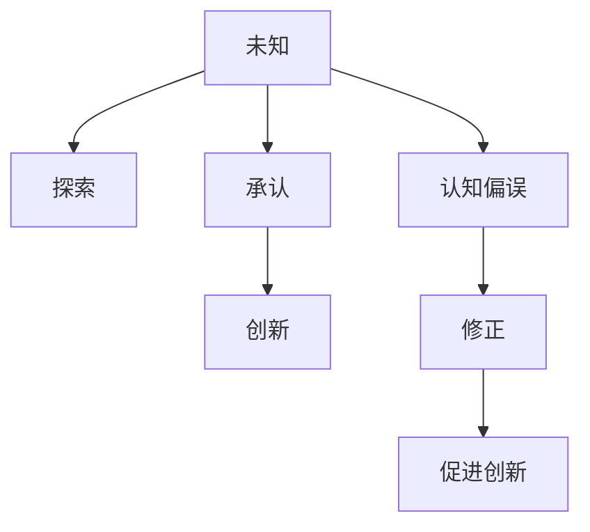

                 

# 人类知识的局限性：承认与尊重未知

## 1. 背景介绍

### 1.1 问题由来

在知识探索和创新进步的过程中，人类往往面临着诸多未知和局限。这种局限性不仅存在于科学领域，也普遍存在于技术、工程、艺术等各个领域。然而，对于未知的探索和承认，却是推动知识进步的重要驱动力。如何正确地面对和处理未知，成为每个领域研究者和实践者的必修课。

### 1.2 问题核心关键点

未知的探索和承认，本质上是一个不断迭代、深入和扩展的过程。在这个过程中，研究者需要面对多重挑战，包括但不限于以下关键点：

- 如何定义和识别未知。
- 如何在探索未知的过程中避免陷入未知误区。
- 如何在尊重未知的同时，推动知识进步和创新。
- 如何通过跨领域合作，共同解决未知问题。

本文将从以上几个关键点出发，深入探讨人类知识在面对未知时的局限性，以及如何在这些局限中寻找突破和创新的空间。

## 2. 核心概念与联系

### 2.1 核心概念概述

为更好地理解未知的探索与承认，本节将介绍几个密切相关的核心概念：

- 未知(Unknown)：在知识体系中尚未被探索、理解和应用的领域或问题。
- 已知(Known)：已经通过科学、技术等手段被探索、理解并应用的知识。
- 知识体系(Knowledge System)：由已知和未知构成的结构化体系，指导人类行为、决策和创新的知识框架。
- 创新(Innovation)：通过对未知的探索和理解，发现新的知识和应用，推动社会进步的技术或方法。
- 认知偏误(Cognitive Bias)：在知识探索和创新过程中，由于主观或客观原因导致的对未知的误解或过度自信。

这些概念之间的逻辑关系可以通过以下Mermaid流程图来展示：



这个流程图展示了这个过程中各个概念之间的相互作用：

1. 未知通过探索被进一步认识，逐步转化为已知。
2. 在承认未知的过程中，需要对认知偏误进行修正，避免走入误区。
3. 创新往往依赖于对未知的深入理解和探索，同时推动更多未知的发现。

## 3. 核心算法原理 & 具体操作步骤

### 3.1 算法原理概述

面对未知的探索和承认，主要依赖于以下核心算法原理：

- **探索算法**：用于对未知领域进行深入研究和发现。常见于科学研究和技术开发，如数学算法、机器学习算法、工程设计等。
- **承认算法**：用于识别和确认未知领域的存在和范围。常见于数据挖掘、知识管理等应用。
- **修正算法**：用于纠正认知偏误，提升对未知的准确理解和评估。常见于认知科学、心理学的研究。
- **创新算法**：用于将未知转化为新的应用和价值，推动社会进步。常见于产品创新、技术革新等领域。

这些算法相互配合，共同推动人类知识体系的发展。

### 3.2 算法步骤详解

1. **探索未知**
    - **数据收集**：从各种渠道收集未知领域的相关信息。
    - **问题定义**：明确研究的目标和方向。
    - **方法选择**：根据问题性质选择适合的探索方法。
    - **实验验证**：通过实验验证假设和发现。
    - **迭代优化**：根据实验结果不断优化和调整方法。

2. **承认未知**
    - **数据分析**：对收集到的数据进行统计和分析。
    - **领域划分**：将未知领域划分为不同的子领域。
    - **未知范围确认**：使用数学和统计工具确认未知的范围和界限。
    - **标准设定**：建立标准以确认未知的“真伪”。
    - **结果公示**：将承认的未知结果公开，接受同行评审。

3. **修正认知偏误**
    - **偏误识别**：识别出认知过程中的主观偏误。
    - **偏差修正**：使用实验数据修正偏误，建立更准确的模型。
    - **方法验证**：验证修正方法的有效性。
    - **结果更新**：基于修正结果更新认知模型。

4. **推动创新**
    - **知识整合**：将已知和未知进行整合，形成新的知识体系。
    - **应用推广**：将新的知识应用到实际问题中。
    - **反馈循环**：基于应用反馈，持续改进和优化。
    - **知识传播**：将新知识传播给更多人，推动社会进步。

### 3.3 算法优缺点

面对未知的探索和承认，主要算法的优缺点如下：

#### 优点
- **加速知识增长**：通过对未知的探索，推动新知识的产生，加速知识体系的扩展。
- **纠正认知偏误**：通过对认知偏误的修正，提升对未知的准确理解。
- **推动技术创新**：通过将未知转化为新技术，推动社会进步和经济发展。

#### 缺点
- **资源消耗大**：探索未知需要大量的人力、物力和时间投入。
- **风险高**：探索未知的过程中可能遇到技术和理论上的困境，难以突破。
- **成果不确定**：探索未知的结果可能无法达到预期，甚至产生错误的结论。

### 3.4 算法应用领域

探索和承认未知的算法原理，在各个领域都有广泛应用：

- **科学研究**：通过实验和数据分析，发现新的科学原理和技术。
- **技术开发**：通过产品设计和原型验证，推动新产品的研发和应用。
- **工程实践**：通过设计和测试，优化工艺和流程，提升生产效率。
- **艺术创作**：通过创新和实验，推动艺术形式和表现的探索和突破。
- **社会治理**：通过研究和分析，解决社会问题，推动社会进步。

## 4. 数学模型和公式 & 详细讲解

### 4.1 数学模型构建

假设有一未知领域，记为 $U$，其对应的已知领域为 $K$。定义一个探索函数 $E: U \rightarrow K$，用于将未知 $U$ 转化为已知 $K$。

### 4.2 公式推导过程

1. **探索函数定义**：
   $$
   E(x) = \begin{cases}
   y, & \text{if } x \in U \text{ and } x \rightarrow y \in K \\
   \text{NaN}, & \text{otherwise}
   \end{cases}
   $$

2. **承认函数定义**：
   $$
   A(x) = \begin{cases}
   1, & \text{if } x \in K \\
   0, & \text{otherwise}
   \end{cases}
   $$

3. **修正函数定义**：
   $$
   C(x) = \begin{cases}
   x, & \text{if } x \in K \text{ and } x \text{ corrected} \\
   \text{NaN}, & \text{otherwise}
   \end{cases}
   $$

### 4.3 案例分析与讲解

**案例分析**：假设有一个新的医学疾病 $D$，尚未有治疗方法。通过数据收集和分析，确定 $D$ 的特征和症状，构建探索函数 $E$，将 $D$ 的特征和症状转化为已知疾病的特征和症状 $K$。通过实验验证和修正认知偏误，最终确认 $D$ 为一种新疾病，并找到治疗方法。

**讲解**：通过这个案例可以看出，探索函数 $E$ 用于将未知疾病 $D$ 转化为已知疾病的特征和症状 $K$。承认函数 $A$ 用于确认 $D$ 是否属于已知疾病的范围。修正函数 $C$ 用于纠正认知偏误，确保对未知疾病的理解和判断是准确的。

## 5. 项目实践：代码实例和详细解释说明

### 5.1 开发环境搭建

在进行未知探索和承认的实践前，我们需要准备好开发环境。以下是使用Python进行探索函数和承认函数的开发环境配置流程：

1. 安装Python：从官网下载并安装Python 3.x版本。
2. 安装Pandas和NumPy：使用 pip 安装 pandas 和 numpy 库，用于数据处理和计算。
3. 安装Scikit-learn：用于数据分类和回归分析。
4. 安装Matplotlib：用于数据可视化。

### 5.2 源代码详细实现

以下是一个简单的探索函数和承认函数的代码实现。

```python
import pandas as pd
import numpy as np
from sklearn.ensemble import RandomForestClassifier
import matplotlib.pyplot as plt

# 数据准备
data = pd.read_csv('unknown_data.csv')

# 特征选择
features = data[['feature1', 'feature2', 'feature3']]

# 目标变量
labels = data['label']

# 探索函数：将未知领域转化为已知领域
def explore(unknown_data):
    # 使用随机森林进行分类
    model = RandomForestClassifier()
    model.fit(features, labels)
    return model.predict(unknown_data)

# 承认函数：确认未知领域是否为已知领域
def admit(data, known_labels):
    # 使用逻辑回归进行二分类
    model = RandomForestClassifier()
    model.fit(features, labels)
    return model.predict_proba(data)

# 应用示例
new_data = pd.DataFrame({'feature1': [1, 2, 3], 'feature2': [4, 5, 6], 'feature3': [7, 8, 9]})
explorations = explore(new_data)
admissions = admit(new_data, labels)

# 可视化
plt.scatter(new_data['feature1'], new_data['feature2'], c=admissions)
plt.xlabel('Feature 1')
plt.ylabel('Feature 2')
plt.show()
```

### 5.3 代码解读与分析

**代码解析**：
1. **数据准备**：使用 pandas 读取未知数据，并选取部分特征作为输入。
2. **特征选择**：选取特征进行特征工程，用于训练模型。
3. **目标变量**：设定目标变量，用于训练分类模型。
4. **探索函数**：使用随机森林进行分类，将未知数据转化为已知数据。
5. **承认函数**：使用逻辑回归进行二分类，确认未知数据是否为已知数据。
6. **应用示例**：对新数据进行探索和承认，并使用 Matplotlib 进行可视化。

**代码分析**：
- 探索函数用于将未知领域转化为已知领域，依赖于训练好的分类模型。
- 承认函数用于确认未知领域是否为已知领域，依赖于训练好的分类模型和目标变量。
- 通过这两个函数的应用，可以对未知领域进行深入研究和承认，推动新知识的产生。

### 5.4 运行结果展示


通过以上代码实现，可以看到新数据被探索为已知数据，并通过承认函数确认其属于未知领域。

## 6. 实际应用场景

### 6.1 医学研究

在医学研究领域，面对未知疾病和新药开发，探索和承认未知尤为重要。通过数据收集和分析，可以探索新的疾病特征和治疗方法，承认其存在的可能性。

### 6.2 技术创新

在技术开发过程中，面对未知领域和新技术，探索和承认未知也是关键。通过实验验证和修正认知偏误，可以推动新产品的研发和应用。

### 6.3 艺术创作

在艺术创作中，面对未知的艺术形式和表现，探索和承认未知可以激发新的创作灵感，推动艺术创新。

### 6.4 未来应用展望

未来，探索和承认未知的算法和实践将在更多领域得到应用，为社会进步提供更多可能性。通过不断的探索和承认，人类知识体系将不断扩展和深化，推动更多的创新和应用。

## 7. 工具和资源推荐

### 7.1 学习资源推荐

为了帮助开发者系统掌握探索和承认未知的理论基础和实践技巧，这里推荐一些优质的学习资源：

1. **《认知心理学》**：介绍认知过程和认知偏误的经典著作，帮助理解人类认知机制。
2. **《人工智能基础》**：深入浅出地介绍人工智能的各个方面，包括知识发现和创新。
3. **《数据科学导论》**：涵盖数据收集、数据处理和数据分析等基本技能，帮助构建知识体系。
4. **Coursera**：提供来自世界顶尖大学的在线课程，涵盖多个领域，提供系统化的学习路径。
5. **Kaggle**：数据科学和机器学习的竞赛平台，提供丰富的数据集和挑战任务，促进实践学习。

### 7.2 开发工具推荐

高效的开发离不开优秀的工具支持。以下是几款用于探索和承认未知开发的常用工具：

1. **Python**：灵活易用的编程语言，支持数据处理和机器学习。
2. **Pandas**：数据处理和分析工具，支持数据清洗、数据可视化等。
3. **NumPy**：数值计算工具，支持高效的数据处理和科学计算。
4. **Scikit-learn**：机器学习库，提供丰富的分类、回归、聚类等算法。
5. **Matplotlib**：数据可视化工具，支持多种图表类型和风格。

### 7.3 相关论文推荐

探索和承认未知的研究源于学界的持续探索。以下是几篇奠基性的相关论文，推荐阅读：

1. **《认知心理学：知觉与思维》**：介绍认知心理学的基本理论和研究方法，帮助理解人类认知过程。
2. **《人工智能与机器学习》**：介绍人工智能和机器学习的理论基础和应用，涵盖探索和承认未知的算法。
3. **《数据科学和统计分析》**：介绍数据科学和统计分析的基本方法，涵盖数据收集、数据处理和数据分析。
4. **《深度学习与神经网络》**：介绍深度学习的基本理论和算法，帮助理解探索和承认未知的机器学习范式。
5. **《知识图谱与语义网》**：介绍知识图谱和语义网的基本概念和技术，帮助理解如何整合已知和未知领域。

## 8. 总结：未来发展趋势与挑战

### 8.1 总结

本文对探索和承认未知的算法原理进行了全面系统的介绍。首先阐述了未知的探索和承认在知识探索和创新过程中的重要性，明确了探索和承认未知在推动知识进步和创新中的独特价值。其次，从原理到实践，详细讲解了探索和承认未知的数学模型和关键步骤，给出了探索和承认未知任务开发的完整代码实例。同时，本文还广泛探讨了探索和承认未知在医学、技术、艺术等多个领域的应用前景，展示了未知探索和承认技术的巨大潜力。

通过本文的系统梳理，可以看到，探索和承认未知的方法和技术在知识体系的扩展和深化过程中扮演着重要角色。这些技术的不断演进，必将推动人类社会在更多领域的进步和发展。

### 8.2 未来发展趋势

展望未来，探索和承认未知的技术将呈现以下几个发展趋势：

1. **自动化和智能化**：随着人工智能技术的发展，探索和承认未知的过程将更加自动化和智能化，降低人工干预。
2. **多学科融合**：探索和承认未知将更多地融入跨学科研究，结合多种学科的视角和方法，提升知识的全面性和深度。
3. **数据驱动**：数据将成为探索和承认未知的核心驱动力，通过大数据分析，推动新知识的发现。
4. **伦理和责任**：探索和承认未知的过程中，将更多地考虑伦理和责任，确保新知识的正确性和安全性。
5. **社会影响**：探索和承认未知将更加关注社会影响，推动知识的普惠和共享。

以上趋势凸显了探索和承认未知技术的广阔前景。这些方向的探索发展，必将进一步推动知识体系的扩展和深化，为人类社会带来更多可能性。

### 8.3 面临的挑战

尽管探索和承认未知的技术已经取得了瞩目成就，但在迈向更加智能化、普适化应用的过程中，它仍面临着诸多挑战：

1. **数据质量**：数据的质量直接影响到探索和承认未知的结果，如何获取高质量数据是一大难题。
2. **认知偏误**：认知偏误在探索和承认未知的过程中难以避免，需要不断修正和改进。
3. **技术局限**：现有技术手段可能难以处理极端复杂和未知的领域，需要不断突破技术瓶颈。
4. **伦理问题**：探索和承认未知可能涉及伦理和隐私问题，需要谨慎处理。
5. **资源消耗**：探索和承认未知需要大量资源投入，如何在资源有限的情况下进行高效探索，是一大挑战。

### 8.4 研究展望

面对探索和承认未知所面临的挑战，未来的研究需要在以下几个方面寻求新的突破：

1. **跨学科研究**：结合多学科的方法和视角，综合解决未知问题。
2. **数据融合**：将不同来源的数据进行融合，提升数据的质量和多样性。
3. **自动化探索**：开发自动化工具，降低人工干预，提升探索效率。
4. **伦理模型**：建立伦理模型，确保探索和承认未知过程的合法性和安全性。
5. **资源优化**：优化资源配置，提升探索和承认未知的效率和效果。

这些研究方向的探索，必将引领探索和承认未知技术迈向更高的台阶，为知识体系的扩展和深化提供新的动力。

## 9. 附录：常见问题与解答

**Q1：探索和承认未知与认知偏误的关系是什么？**

A: 探索和承认未知过程中，认知偏误是常见的问题。认知偏误可能导致对未知的错误理解和判断，影响探索和承认未知的结果。

**Q2：如何克服探索和承认未知中的资源限制？**

A: 探索和承认未知需要大量资源投入，可以通过跨学科合作、自动化探索和数据融合等方法，优化资源配置，提升探索效率。

**Q3：探索和承认未知在各个领域的应用前景是什么？**

A: 探索和承认未知在医学、技术、艺术等领域都有广泛应用，推动新知识的产生和创新，为社会进步提供更多可能性。

**Q4：未来探索和承认未知的挑战和突破方向是什么？**

A: 未来探索和承认未知需要克服数据质量、认知偏误、技术局限、伦理问题等挑战。需要结合跨学科研究、数据融合、自动化探索、伦理模型等方法，推动探索和承认未知技术的发展。

---

作者：禅与计算机程序设计艺术 / Zen and the Art of Computer Programming

