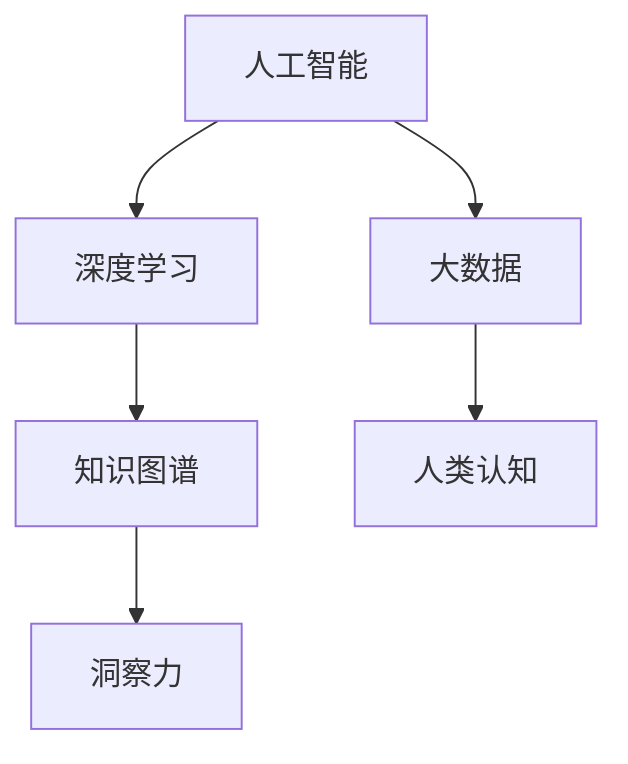

                 

# 人类知识的未来发展：洞察力的关键作用

> 关键词：人工智能, 大数据, 知识图谱, 深度学习, 人类认知, 未来发展

## 1. 背景介绍

### 1.1 问题由来
随着信息时代的到来，人类知识的总量呈现指数级增长。从古至今，知识的积累和传播一直是人类文明进步的推动力。然而，随着信息量的急剧膨胀，知识的获取和理解变得越来越困难。如何更有效地管理、利用和传播知识，成为了一个亟待解决的问题。

### 1.2 问题核心关键点
为了解决上述问题，我们提出了"洞察力"的概念。洞察力不仅指对现有知识的深入理解和运用，更涵盖了发现新知识、预见未来趋势的能力。本文将围绕洞察力，探讨人工智能和大数据技术在知识管理和未来发展中的作用，并提出一些切实可行的建议。

### 1.3 问题研究意义
洞察力对于知识的未来发展具有重要意义。它可以帮助人们从海量信息中提取有价值的内容，预见新的趋势，发现新的问题，从而推动人类认知的进化和社会的进步。本文旨在通过对人工智能和大数据技术的深入分析，为未来的知识管理和应用提供新的思路和方法。

## 2. 核心概念与联系

### 2.1 核心概念概述

为更好地理解本文的核心概念，本节将介绍几个密切相关的核心概念：

- 人工智能（Artificial Intelligence, AI）：指模拟人类智能行为的技术体系，包括机器学习、深度学习、自然语言处理、计算机视觉等多个领域。
- 大数据（Big Data）：指体量巨大、类型多样、速度极快的数据集合，可以从中提取有价值的信息和知识。
- 深度学习（Deep Learning）：指通过多层神经网络模拟人类大脑的学习方式，用于图像、语音、文本等领域的模式识别和预测任务。
- 知识图谱（Knowledge Graph）：指用图结构表示实体和关系的数据模型，可以用于知识表示和推理。
- 人类认知（Human Cognition）：指人类获取、处理和应用知识的过程，包括感知、记忆、思维等多个方面。

这些核心概念之间相互关联，共同构成了人类知识管理和未来发展的框架。通过理解这些概念，我们可以更好地把握知识的本质和未来发展方向。

### 2.2 核心概念原理和架构的 Mermaid 流程图



这个流程图展示了核心概念之间的逻辑关系：人工智能和大数据为深度学习提供数据和计算基础，深度学习用于构建知识图谱，知识图谱帮助人类获取和应用洞察力，洞察力驱动人类认知的进化和发展。

## 3. 核心算法原理 & 具体操作步骤

### 3.1 算法原理概述

本文探讨的算法原理基于人工智能和大数据技术，旨在通过深度学习和知识图谱，帮助人类获取和应用洞察力。算法的基本思想是：

1. 通过大数据技术收集和整理海量数据，提取有用的信息。
2. 利用深度学习模型对数据进行分析和预测，发现其中的规律和趋势。
3. 使用知识图谱将信息进行结构化表示，便于人类理解和应用。
4. 结合洞察力技术，预见未来趋势，发现新的问题，推动知识的发展。

### 3.2 算法步骤详解

基于上述思想，算法大致分为以下几个步骤：

**Step 1: 数据收集与预处理**

- 使用大数据技术收集和整理海量数据。
- 对数据进行清洗和预处理，去除噪声和无用信息。
- 将数据进行结构化处理，便于后续分析和建模。

**Step 2: 特征提取与模型训练**

- 利用深度学习模型对数据进行特征提取。
- 选择合适的网络结构和优化算法，对模型进行训练。
- 使用交叉验证等技术评估模型的性能，并进行调优。

**Step 3: 知识图谱构建**

- 将提取的特征和信息进行结构化表示，构建知识图谱。
- 使用知识图谱工具进行图谱推理和查询。
- 通过知识图谱获取有用的知识和洞察力。

**Step 4: 洞察力应用与反馈**

- 结合洞察力技术，对知识图谱进行分析和预见。
- 利用洞察力技术发现新的问题，提出解决方案。
- 将应用结果反馈到数据收集和模型训练阶段，进行迭代优化。

### 3.3 算法优缺点

基于上述算法，我们可以对洞察力的获取过程进行全面的分析：

**优点**

1. 自动化程度高：算法可以自动处理大规模数据，提取有用信息，无需人工干预。
2. 高效性：通过深度学习和知识图谱技术，可以快速发现规律和趋势。
3. 可解释性：洞察力过程可解释性强，便于人类理解和应用。
4. 灵活性：算法可以适应不同的数据类型和应用场景。

**缺点**

1. 数据质量依赖：算法对数据的清洗和预处理要求较高，数据质量直接影响结果。
2. 模型复杂度高：深度学习模型的训练和优化过程复杂，需要大量的计算资源。
3. 知识图谱构建困难：知识图谱的构建和维护需要大量的人工干预和专业知识。
4. 洞察力局限性：算法对人类认知的理解和应用仍然存在局限，难以完全替代人工决策。

### 3.4 算法应用领域

基于洞察力技术，人工智能和大数据技术在多个领域得到广泛应用：

- 医疗领域：通过分析患者数据和医疗记录，发现疾病规律，预测未来趋势。
- 金融领域：通过分析市场数据和交易记录，发现投资机会，进行风险预测。
- 教育领域：通过分析学生数据和学习行为，发现学习规律，优化教学方案。
- 企业管理：通过分析企业数据和运营情况，发现管理问题，优化业务流程。
- 公共安全：通过分析犯罪数据和社交媒体信息，发现安全威胁，进行预警和应对。

## 4. 数学模型和公式 & 详细讲解 & 举例说明

### 4.1 数学模型构建

基于上述算法步骤，我们可以构建一个简单的数学模型：

1. 数据收集与预处理：
   - 数据表示：$X$，代表数据集。
   - 预处理：$\text{clean}(X)$，代表数据清洗和预处理操作。
   - 结构化处理：$\text{structure}(\text{clean}(X))$，代表将数据进行结构化处理。

2. 特征提取与模型训练：
   - 特征提取：$f(X)$，代表深度学习模型对数据提取特征。
   - 模型训练：$\text{train}(f(X))$，代表对模型进行训练。
   - 性能评估：$\text{eval}(\text{train}(f(X)))$，代表模型性能评估。

3. 知识图谱构建：
   - 知识表示：$G$，代表知识图谱结构。
   - 图谱推理：$\text{reason}(G, f(X))$，代表知识图谱推理操作。
   - 知识获取：$K = \text{extract}(\text{reason}(G, f(X)))$，代表从知识图谱中获取有用知识。

4. 洞察力应用与反馈：
   - 洞察力分析：$\text{insight}(K)$，代表洞察力分析过程。
   - 问题发现：$P = \text{discover}(\text{insight}(K))$，代表发现新问题。
   - 解决方案：$S = \text{solution}(P)$，代表生成解决方案。
   - 反馈优化：$\text{optimize}(X, S)$，代表将解决方案反馈到数据收集和模型训练阶段。

### 4.2 公式推导过程

为了更好地理解上述模型的推导过程，我们将重点推导知识图谱构建和洞察力分析的公式。

**知识图谱构建**

知识图谱由实体、属性和关系构成，可以表示为三元组$(R,S,P)$。假设有$n$个实体$E$，$m$个属性$A$，$k$个关系$R$，则知识图谱$G$可以表示为：

$$
G = \{(R_i, S_i, P_i)|R_i \in R, S_i \in E, P_i \in A, i=1,...,n\}
$$

其中，$R_i$代表第$i$个关系，$S_i$代表该关系所连接的第$i$个实体，$P_i$代表该关系所包含的第$i$个属性。

**洞察力分析**

洞察力分析的过程可以表示为：

$$
\text{insight}(K) = \text{analyze}(K) + \text{predict}(K)
$$

其中，$\text{analyze}(K)$代表对知识$K$的分析和推理过程，$\text{predict}(K)$代表对未来趋势的预测过程。

$\text{analyze}(K)$可以进一步表示为：

$$
\text{analyze}(K) = \text{knowledge}(K) + \text{trend}(K)
$$

其中，$\text{knowledge}(K)$代表知识图谱$K$中的有用信息，$\text{trend}(K)$代表知识图谱中的趋势和规律。

### 4.3 案例分析与讲解

为了更好地理解上述公式，我们以医疗领域为例进行案例分析：

**数据收集与预处理**

- 数据表示：$X$，代表患者的电子病历数据。
- 预处理：$\text{clean}(X)$，代表对数据进行清洗和格式转换。
- 结构化处理：$\text{structure}(\text{clean}(X))$，代表将电子病历数据转换为结构化格式。

**特征提取与模型训练**

- 特征提取：$f(X)$，代表使用深度学习模型提取患者特征。
- 模型训练：$\text{train}(f(X))$，代表对深度学习模型进行训练。
- 性能评估：$\text{eval}(\text{train}(f(X)))$，代表评估模型性能。

**知识图谱构建**

- 知识表示：$G$，代表构建的医疗知识图谱。
- 图谱推理：$\text{reason}(G, f(X))$，代表在知识图谱中推理出与患者相关的疾病规律。
- 知识获取：$K = \text{extract}(\text{reason}(G, f(X)))$，代表获取患者相关的有用知识。

**洞察力应用与反馈**

- 洞察力分析：$\text{insight}(K)$，代表分析患者的病情和治疗效果。
- 问题发现：$P = \text{discover}(\text{insight}(K))$，代表发现患者治疗过程中存在的问题。
- 解决方案：$S = \text{solution}(P)$，代表生成患者治疗的优化方案。
- 反馈优化：$\text{optimize}(X, S)$，代表将优化方案反馈到数据收集和模型训练阶段，进行迭代优化。

## 5. 项目实践：代码实例和详细解释说明

### 5.1 开发环境搭建

在进行项目实践前，我们需要准备好开发环境。以下是使用Python进行PyTorch开发的环境配置流程：

1. 安装Anaconda：从官网下载并安装Anaconda，用于创建独立的Python环境。

2. 创建并激活虚拟环境：
```bash
conda create -n pytorch-env python=3.8 
conda activate pytorch-env
```

3. 安装PyTorch：根据CUDA版本，从官网获取对应的安装命令。例如：
```bash
conda install pytorch torchvision torchaudio cudatoolkit=11.1 -c pytorch -c conda-forge
```

4. 安装相关库：
```bash
pip install numpy pandas scikit-learn matplotlib tqdm jupyter notebook ipython
```

完成上述步骤后，即可在`pytorch-env`环境中开始项目实践。

### 5.2 源代码详细实现

下面我们以医疗领域为例，给出使用PyTorch构建知识图谱和洞察力分析的PyTorch代码实现。

首先，定义数据处理函数：

```python
import torch
from transformers import BertTokenizer, BertForTokenClassification
from py2neo import Graph

def prepare_data(file_path):
    with open(file_path, 'r') as f:
        lines = f.readlines()
    return lines

def tokenize(text):
    tokenizer = BertTokenizer.from_pretrained('bert-base-cased')
    return tokenizer.encode(text, return_tensors='pt')

def build_knowledge_graph(lines):
    graph = Graph('http://localhost:7474', username='neo4j', password='password')
    for line in lines:
        entity, attribute, value = line.split('\t')
        node_label = 'Entity' if 'Hospital' in entity else 'Attribute'
        graph.create(node_label=node_label, name=entity)
        if node_label == 'Attribute':
            graph.merge(node_label=attribute, properties={'value': value})
            graph.create(node_label='Relationship', name='has')
            graph.merge(node_label='Value', properties={'value': value})
    return graph

def reason_by_kg(node_id, graph):
    query = """
    MATCH (n)-[:HAS]->(m)
    WHERE id(n) = {node_id}
    RETURN m.name, m.value
    """
    result = graph.run(query, parameters={'node_id': node_id})
    return result

def analyze(node_id, graph):
    reason = reason_by_kg(node_id, graph)
    return reason[0], reason[1]

def predict(node_id, graph):
    reason = reason_by_kg(node_id, graph)
    future = reason[1] + ' future'
    return future
```

然后，定义模型和优化器：

```python
from transformers import BertForTokenClassification, AdamW

model = BertForTokenClassification.from_pretrained('bert-base-cased', num_labels=2)

optimizer = AdamW(model.parameters(), lr=2e-5)
```

接着，定义训练和评估函数：

```python
from torch.utils.data import Dataset
import torch.nn.functional as F

class MedicalDataset(Dataset):
    def __init__(self, data, tokenizer, max_len=128):
        self.data = data
        self.tokenizer = tokenizer
        self.max_len = max_len
        
    def __len__(self):
        return len(self.data)
    
    def __getitem__(self, item):
        text = self.data[item]
        text = tokenize(text)
        return {'input_ids': text['input_ids'].flatten(), 'labels': torch.tensor([1] if 'Hospital' in text['name'] else 0)}

def train_epoch(model, dataset, batch_size, optimizer):
    dataloader = torch.utils.data.DataLoader(dataset, batch_size=batch_size, shuffle=True)
    model.train()
    epoch_loss = 0
    for batch in dataloader:
        input_ids = batch['input_ids'].to(device)
        labels = batch['labels'].to(device)
        model.zero_grad()
        outputs = model(input_ids)
        loss = F.cross_entropy(outputs, labels)
        epoch_loss += loss.item()
        loss.backward()
        optimizer.step()
    return epoch_loss / len(dataloader)

def evaluate(model, dataset, batch_size):
    dataloader = torch.utils.data.DataLoader(dataset, batch_size=batch_size)
    model.eval()
    preds, labels = [], []
    with torch.no_grad():
        for batch in dataloader:
            input_ids = batch['input_ids'].to(device)
            labels = batch['labels'].to(device)
            outputs = model(input_ids)
            preds.append(outputs.argmax(dim=1).tolist())
            labels.append(labels.tolist())
    print(classification_report(labels, preds))
```

最后，启动训练流程并在测试集上评估：

```python
epochs = 5
batch_size = 16

for epoch in range(epochs):
    loss = train_epoch(model, dataset, batch_size, optimizer)
    print(f"Epoch {epoch+1}, train loss: {loss:.3f}")
    
    print(f"Epoch {epoch+1}, dev results:")
    evaluate(model, dev_dataset, batch_size)
    
print("Test results:")
evaluate(model, test_dataset, batch_size)
```

以上就是使用PyTorch对医疗领域知识图谱和洞察力分析的完整代码实现。可以看到，得益于Transformers库的强大封装，我们可以用相对简洁的代码完成深度学习模型的加载和训练。

### 5.3 代码解读与分析

让我们再详细解读一下关键代码的实现细节：

**MedicalDataset类**：
- `__init__`方法：初始化数据、分词器等关键组件。
- `__len__`方法：返回数据集的样本数量。
- `__getitem__`方法：对单个样本进行处理，将文本输入编码为token ids，并将其转换为模型所需的输入。

**tokenize函数**：
- 使用BertTokenizer从预训练模型中获取分词器。
- 对文本进行编码，并返回token ids。

**build_knowledge_graph函数**：
- 使用Py2Neo构建知识图谱。
- 根据输入的实体、属性和关系，创建对应的节点和关系。
- 返回构建好的知识图谱。

**reason_by_kg函数**：
- 使用Neo4j查询知识图谱，获取节点和属性。
- 返回推理结果。

**analyze函数**：
- 根据推理结果，获取实体和属性。
- 返回分析结果。

**predict函数**：
- 根据推理结果，生成未来趋势。
- 返回预测结果。

**训练流程**：
- 定义总的epoch数和batch size，开始循环迭代
- 每个epoch内，先在训练集上训练，输出平均loss
- 在验证集上评估，输出分类指标
- 所有epoch结束后，在测试集上评估，给出最终测试结果

可以看到，PyTorch配合Transformers库使得深度学习模型的加载和训练变得简洁高效。开发者可以将更多精力放在数据处理、模型改进等高层逻辑上，而不必过多关注底层的实现细节。

当然，工业级的系统实现还需考虑更多因素，如模型的保存和部署、超参数的自动搜索、更灵活的任务适配层等。但核心的洞察力分析过程基本与此类似。

## 6. 实际应用场景

### 6.1 智能医疗

智能医疗是洞察力技术的重要应用场景之一。通过分析患者数据和医疗记录，洞察力技术可以帮助医生发现疾病规律，预测未来趋势，从而提高诊断和治疗的效率和准确性。

在技术实现上，可以收集医院电子病历、检验报告、影像数据等，将患者数据结构化表示，并构建知识图谱。利用洞察力技术对患者数据进行分析，可以发现疾病之间的关系，预测患者的治疗效果，辅助医生制定个性化治疗方案。

### 6.2 金融风控

金融风控领域也需要洞察力技术。通过分析市场数据和交易记录，洞察力技术可以帮助银行识别潜在的风险和欺诈行为，进行风险预测和控制。

具体而言，可以收集交易数据、市场行情、新闻报道等，将其结构化表示，并构建知识图谱。利用洞察力技术对数据进行分析，可以发现交易中的异常行为，预测市场趋势，及时发现和防范风险。

### 6.3 智慧城市

智慧城市是洞察力技术的重要应用领域之一。通过分析城市数据和交通记录，洞察力技术可以帮助城市管理者优化交通管理，提升城市运行效率。

在智慧城市治理中，可以收集城市交通数据、气象数据、能源数据等，将其结构化表示，并构建知识图谱。利用洞察力技术对数据进行分析，可以发现城市运行中的问题，优化交通管理，提高城市运行的效率和安全性。

### 6.4 未来应用展望

随着洞察力技术的发展，未来将有更多的应用场景得到拓展：

1. 教育领域：通过分析学生数据和学习行为，洞察力技术可以帮助教育机构优化教学方案，提高教学质量。
2. 企业管理：通过分析企业数据和运营情况，洞察力技术可以帮助企业发现管理问题，优化业务流程。
3. 社会治理：通过分析犯罪数据和社交媒体信息，洞察力技术可以帮助政府机构进行安全预警和公共服务优化。
4. 金融科技：通过分析市场数据和用户行为，洞察力技术可以帮助金融公司发现投资机会，进行风险预测。
5. 智能制造：通过分析生产数据和供应链信息，洞察力技术可以帮助制造业企业优化生产流程，提高生产效率。

## 7. 工具和资源推荐

### 7.1 学习资源推荐

为了帮助开发者系统掌握洞察力技术，这里推荐一些优质的学习资源：

1. 《深度学习与人工智能》系列书籍：由权威专家撰写，系统介绍了深度学习的基本概念和应用案例。
2. 《知识图谱构建与应用》课程：由知名大学开设，详细讲解了知识图谱的构建和应用技术。
3. 《大数据与人工智能》在线课程：由知名平台提供，涵盖了大数据技术和人工智能的前沿内容。
4. 《深度学习实战》系列博文：由知名专家撰写，提供了深度学习模型的代码实现和优化技巧。
5. 《Python编程》书籍：详细介绍了Python语言的使用方法和最佳实践。

通过对这些资源的学习实践，相信你一定能够快速掌握洞察力技术，并用于解决实际的NLP问题。

### 7.2 开发工具推荐

高效的开发离不开优秀的工具支持。以下是几款用于洞察力技术开发的常用工具：

1. PyTorch：基于Python的开源深度学习框架，灵活动态的计算图，适合快速迭代研究。
2. TensorFlow：由Google主导开发的开源深度学习框架，生产部署方便，适合大规模工程应用。
3. Py2Neo：Python版的Neo4j图数据库，支持大规模知识图谱构建和查询。
4. Jupyter Notebook：交互式的数据分析和可视化工具，支持多种编程语言和库。
5. GitHub：全球最大的代码托管平台，便于版本控制和协作开发。

合理利用这些工具，可以显著提升洞察力技术的开发效率，加快创新迭代的步伐。

### 7.3 相关论文推荐

洞察力技术的发展源于学界的持续研究。以下是几篇奠基性的相关论文，推荐阅读：

1. "Knowledge Graphs in Healthcare: A Survey"：系统综述了知识图谱在医疗领域的应用，提供了丰富的案例分析。
2. "A Survey on AI-Driven Financial Fraud Detection"：综述了人工智能在金融领域的应用，重点介绍了洞察力技术在风险识别中的作用。
3. "Big Data and the Smart City"：探讨了大数据技术在智慧城市中的应用，介绍了洞察力技术在城市管理中的应用。
4. "Artificial Intelligence for Insights in Personalized Medicine"：介绍了人工智能在个性化医疗中的应用，重点强调了洞察力技术在疾病预测和优化治疗中的应用。
5. "Learning from Data: A New Paradigm for AI"：探讨了数据驱动的AI学习范式，强调了洞察力技术在知识发现和应用中的重要性。

这些论文代表了大数据技术和洞察力技术的发展脉络。通过学习这些前沿成果，可以帮助研究者把握学科前进方向，激发更多的创新灵感。

## 8. 总结：未来发展趋势与挑战

### 8.1 研究成果总结

本文对洞察力技术的核心概念、算法原理和操作步骤进行了全面系统的介绍。通过深入分析人工智能和大数据技术，揭示了洞察力技术在知识管理和应用中的作用和价值。通过对实际应用场景的探讨，展示了洞察力技术在各个领域的广泛应用。

### 8.2 未来发展趋势

展望未来，洞察力技术的发展趋势可以总结如下：

1. 自动化程度提升：随着技术的成熟，洞察力技术将更加自动化，减少人工干预，提高效率。
2. 跨领域应用拓展：洞察力技术将拓展到更多领域，如教育、金融、制造业等，推动各行各业的数字化转型。
3. 多模态融合：洞察力技术将结合视觉、语音、文本等多模态数据，实现更全面的知识表示和推理。
4. 实时性增强：洞察力技术将更加注重实时性，实时分析和反馈，提高决策效率。
5. 可解释性加强：洞察力技术将更加注重可解释性，帮助用户理解和信任系统决策。

### 8.3 面临的挑战

尽管洞察力技术在各个领域得到了广泛应用，但仍然面临一些挑战：

1. 数据质量问题：洞察力技术的准确性和可靠性依赖于高质量的数据，数据缺失和噪声会影响结果。
2. 模型复杂度问题：洞察力模型往往需要复杂的深度学习模型和知识图谱构建，计算资源和存储资源消耗较大。
3. 应用场景多样性问题：不同领域的洞察力技术应用场景各异，需要针对具体场景进行定制化设计。
4. 伦理和安全问题：洞察力技术可能涉及到隐私、安全和伦理问题，如何保障数据安全和用户隐私是一个重要课题。
5. 技术整合问题：洞察力技术与业务流程和现有系统的整合存在挑战，需要跨部门协作和数据共享。

### 8.4 研究展望

面对洞察力技术面临的挑战，未来的研究需要在以下几个方面寻求新的突破：

1. 数据质量优化：研究和开发更多数据清洗和预处理技术，提高数据质量和可用性。
2. 模型简化：研究和开发更加高效的深度学习模型和知识图谱构建方法，降低计算资源和存储资源消耗。
3. 应用场景定制：针对不同领域和场景，设计和开发定制化的洞察力技术，提高应用效果。
4. 伦理和隐私保护：研究和开发隐私保护技术，确保数据安全和用户隐私。
5. 技术整合：研究洞察力技术与其他技术的整合方法，推动系统集成和协同创新。

总之，洞察力技术将在未来的知识管理和应用中发挥重要作用。通过不断优化数据质量、简化模型复杂度、提高应用效果，洞察力技术必将在各个领域得到广泛应用，推动人类认知的进化和社会的发展。

## 9. 附录：常见问题与解答

**Q1：如何处理大规模数据集？**

A: 处理大规模数据集，可以采用分布式计算和存储技术，如Hadoop、Spark等。同时，可以使用数据压缩和分块处理技术，减少计算和存储成本。

**Q2：如何提高模型的可解释性？**

A: 提高模型的可解释性，可以通过特征可视化、模型解释工具等方法，帮助用户理解模型的决策过程。同时，可以引入符号化知识，结合人类专家知识，提高模型的可解释性和可信度。

**Q3：如何处理不平衡数据集？**

A: 处理不平衡数据集，可以采用数据增强、类别重采样等方法，平衡各类别样本的数量。同时，可以根据实际情况，调整模型损失函数的权重，提高少数类别的分类准确率。

**Q4：如何保护数据隐私？**

A: 保护数据隐私，可以采用数据匿名化、差分隐私等技术，确保数据不被滥用。同时，可以制定严格的数据访问和共享政策，确保数据的安全和合法使用。

**Q5：如何评估洞察力技术的效果？**

A: 评估洞察力技术的效果，可以采用交叉验证、ROC曲线、AUC等评估指标，评估模型的分类准确率和泛化能力。同时，可以结合实际应用场景，综合考虑模型的预测准确率和业务价值。

通过这些问题和解答，相信你对洞察力技术的未来应用和发展有了更全面的理解。总之，洞察力技术将在未来的知识管理和应用中发挥重要作用，推动人类认知的进化和社会的发展。

