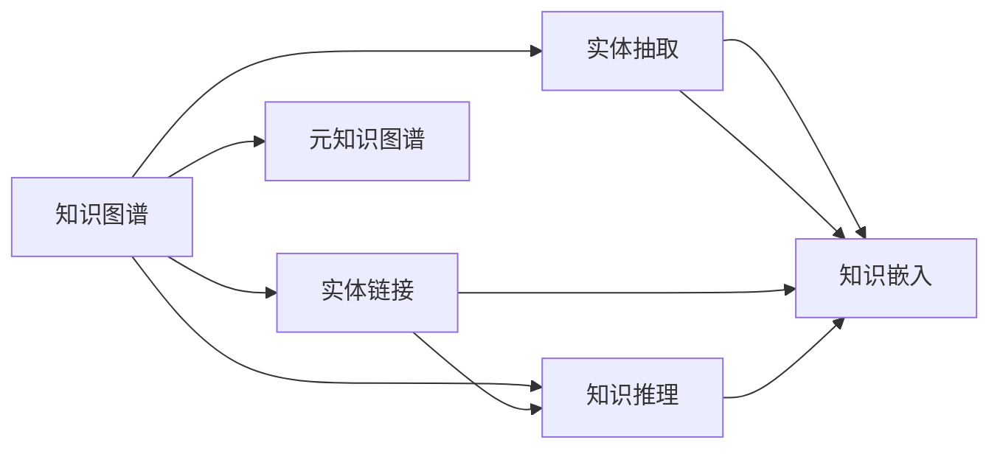

                 

# 人类知识的未来：洞察力引领知识革命

> 关键词：知识图谱, 自然语言处理, 数据挖掘, 洞察力分析, 计算社会学, 元宇宙

## 1. 背景介绍

### 1.1 问题由来

在信息爆炸的时代，人类知识的积累与传播速度达到了前所未有的高度。从海量文本数据、多媒体信息到复杂社交网络，数据的规模和多样性不断增长，使得传统的信息检索与知识获取方式已难以适应。然而，知识本身并非孤立存在，而是蕴含着相互关联的网络结构。知识图谱（Knowledge Graph）作为基于图结构的知识表示与组织方式，通过将实体、属性及它们之间的关系进行图形化描述，有效捕获了知识间的内在联系，为大规模知识管理、智能问答、推荐系统等应用提供了强有力的支撑。

### 1.2 问题核心关键点

知识图谱的核心关键点主要集中在以下几个方面：

- **实体抽取与关系挖掘**：从大规模文本、数据中自动识别和抽取具有实际意义的知识实体及其关系，是构建知识图谱的基础。
- **知识融合与关联**：将不同来源的知识进行融合，建立实体间的多层级关联，提升知识图谱的完备性和准确性。
- **图模型与推理**：基于图结构进行知识表示，利用图模型进行高效的知识推理与查询。
- **实证研究与应用**：通过对知识图谱理论和技术的研究，探索其在科学研究、社会治理、商业智能等领域的应用价值。

### 1.3 问题研究意义

知识图谱的研究与应用，不仅极大地推动了人工智能和数据科学的进步，也为人类知识获取和传播提供了全新视角。通过构建大规模的知识网络，人类能够更系统、更深入地理解世界，解决实际问题。同时，知识图谱也为科学发现、智能决策、精准推荐等提供强大的工具，有助于提升社会治理和生产效率。

## 2. 核心概念与联系

### 2.1 核心概念概述

为了深入理解知识图谱，我们将从几个关键概念入手：

- **知识图谱**：以图结构为核心的知识表示与组织方式，通过实体、属性及它们之间的关系进行图形化描述。知识图谱由节点（实体）和边（关系）组成。
- **知识抽取**：自动从大规模文本、数据中抽取具有实际意义的知识实体及其关系，是知识图谱构建的基础。
- **实体链接**：将抽取出的实体与世界知识库中的实体进行链接，确保知识的一致性和准确性。
- **知识推理**：基于知识图谱进行知识推理，从已有知识推导出新的知识，增强知识图谱的完备性和深度。
- **知识嵌入**：将知识图谱转换为向量空间，便于机器学习算法的应用。
- **元知识图谱**：构建自适应、动态更新的知识图谱，以适应不断变化的知识需求和领域环境。

这些核心概念之间有着紧密的联系，构成了知识图谱的完整框架。通过实体抽取和关系挖掘，知识图谱构建了基本的数据结构；实体链接和知识推理进一步增强了知识的一致性和完备性；知识嵌入和元知识图谱则使得知识图谱能够与机器学习算法无缝集成，具备动态更新能力。

### 2.2 核心概念原理和架构的 Mermaid 流程图



这个流程图展示了知识图谱的核心概念及其联系：

1. **实体抽取**：从原始数据中自动识别和抽取知识实体及其关系，是构建知识图谱的基础。
2. **实体链接**：将抽取出的实体链接到外部知识源，确保知识的一致性。
3. **知识推理**：通过逻辑推理和计算图模型，从已知知识推导出新知识，增强知识图谱的完备性。
4. **知识嵌入**：将知识图谱转换为向量表示，便于与机器学习算法的结合。
5. **元知识图谱**：支持自适应和动态更新的知识图谱，增强知识图谱的实时性和灵活性。

## 3. 核心算法原理 & 具体操作步骤

### 3.1 算法原理概述

知识图谱的构建与维护，主要依赖于以下几个核心算法：

1. **知识抽取算法**：从自然语言、结构化数据中抽取实体和关系，生成知识图谱的基本元素。
2. **实体链接算法**：将抽取出的实体与外部知识源进行链接，确保知识的一致性和准确性。
3. **知识推理算法**：基于知识图谱进行高效的知识推理与查询，扩展知识图谱的应用范围。
4. **知识嵌入算法**：将知识图谱转换为向量表示，便于与机器学习算法的结合。

### 3.2 算法步骤详解

#### 3.2.1 知识抽取算法

知识抽取算法通常包括实体识别和关系抽取两个步骤：

1. **实体识别**：使用命名实体识别（Named Entity Recognition, NER）模型识别文本中的实体，如人名、地名、组织名等。
2. **关系抽取**：使用关系抽取模型识别实体之间的关系，如“工作于”、“属于”等。

知识抽取的具体步骤如下：

- 收集大规模语料库，并进行预处理，如分词、词性标注等。
- 使用NER模型对语料库中的实体进行识别，生成实体列表。
- 使用关系抽取模型对语料库中的实体关系进行识别，生成关系列表。
- 对识别出的实体和关系进行过滤、合并和纠错，生成最终的知识图谱。

#### 3.2.2 实体链接算法

实体链接算法旨在将抽取出的实体链接到外部知识源，如百度百科、Wikidata等，确保知识的一致性和准确性。具体步骤如下：

- 收集外部知识源，构建知识库。
- 对抽取出的实体进行标准化处理，生成统一的实体标识符。
- 使用实体链接模型对抽取出的实体进行链接，确保链接的准确性。
- 对链接结果进行评估和过滤，生成最终的知识图谱。

#### 3.2.3 知识推理算法

知识推理算法主要基于图结构进行高效的知识推理与查询。具体步骤如下：

- 构建知识图谱的计算图，定义推理规则和推理逻辑。
- 使用图模型（如TransE、GNN等）进行知识推理，生成新的知识实体和关系。
- 对推理结果进行评估和过滤，生成最终的知识图谱。

#### 3.2.4 知识嵌入算法

知识嵌入算法旨在将知识图谱转换为向量表示，便于与机器学习算法的结合。具体步骤如下：

- 选择知识嵌入模型（如TransE、GNN等），定义向量空间。
- 对知识图谱进行嵌入，生成向量表示。
- 对嵌入结果进行评估和优化，生成最终的知识嵌入向量。

### 3.3 算法优缺点

知识图谱构建与维护算法具有以下优点：

- **高效性**：使用自动化算法进行知识抽取和链接，大大提升了数据处理效率。
- **准确性**：通过多轮迭代和模型优化，提高了知识抽取和链接的准确性。
- **可扩展性**：基于图结构和推理模型，可以灵活扩展知识图谱的应用场景。

同时，也存在一些缺点：

- **数据依赖**：依赖大规模标注数据，获取高质量标注数据成本较高。
- **模型复杂性**：知识抽取和链接算法复杂，模型训练和优化难度较大。
- **知识孤岛**：单个知识图谱难以覆盖所有领域和实体，存在知识孤岛问题。
- **计算资源需求高**：大规模知识图谱的构建和维护需要高性能计算资源。

### 3.4 算法应用领域

知识图谱技术已在多个领域得到了广泛应用，如：

- **科学研究**：通过构建领域知识图谱，支持科学发现和研究，提升科研效率。
- **社会治理**：利用知识图谱进行公共安全、社会事件等分析，提升社会治理能力。
- **商业智能**：通过知识图谱进行精准推荐、客户画像分析等，提升商业决策水平。
- **医疗健康**：构建医疗知识图谱，支持疾病诊断、药物研发等，提升医疗服务水平。
- **教育培训**：利用知识图谱进行课程推荐、学习路径设计等，提升教育效果。

## 4. 数学模型和公式 & 详细讲解 & 举例说明

### 4.1 数学模型构建

本节将使用数学语言对知识图谱构建与维护的算法进行更加严格的刻画。

记知识图谱为 $\mathcal{G}=(\mathcal{V},\mathcal{E})$，其中 $\mathcal{V}$ 为实体集合，$\mathcal{E}$ 为关系集合。定义实体 $v_i$ 的属性向量为 $\mathbf{x}_i$，关系 $e_j$ 的属性向量为 $\mathbf{y}_j$。

定义知识图谱的计算图为 $G=(V,E)$，其中 $V$ 为计算图中的节点，$E$ 为计算图中的边。节点 $v_i$ 的嵌入向量为 $\mathbf{z}_i$，关系 $e_j$ 的嵌入向量为 $\mathbf{z}_j$。

定义知识推理的目标函数为 $L=\sum_{i=1}^N l_i$，其中 $l_i$ 为推理结果的损失函数。

### 4.2 公式推导过程

以下我们以TransE模型为例，推导知识推理的损失函数及其梯度的计算公式。

假设知识图谱中存在三元组 $(v_i,e_j,v_k)$，表示实体 $v_i$ 与 $v_k$ 通过关系 $e_j$ 连接。TransE模型的目标是学习每个实体的低维嵌入向量 $\mathbf{z}_i$ 和关系 $e_j$ 的嵌入向量 $\mathbf{z}_j$，使得三元组的预测关系 $\mathbf{y}_j=\mathbf{z}_i \cdot \mathbf{z}_j$ 与实际关系 $\mathbf{y}_i \cdot \mathbf{y}_k$ 尽可能接近。

定义TransE模型的损失函数为：

$$
L=\frac{1}{N} \sum_{i=1}^N \left[\mathbf{y}_i \cdot \mathbf{y}_k - \max\{0,\mathbf{y}_i \cdot \mathbf{z}_j - \sigma_1\} - \max\{0,\mathbf{z}_i \cdot \mathbf{y}_k - \sigma_2\}\right]
$$

其中 $\sigma_1$ 和 $\sigma_2$ 为正则化参数，$\cdot$ 为向量内积运算。

根据链式法则，损失函数对实体嵌入向量 $\mathbf{z}_i$ 和关系嵌入向量 $\mathbf{z}_j$ 的梯度分别为：

$$
\frac{\partial L}{\partial \mathbf{z}_i} = \frac{1}{N} \sum_{i=1}^N \left[\mathbf{y}_i \cdot \mathbf{y}_k - \max\{0,\mathbf{y}_i \cdot \mathbf{z}_j - \sigma_1\} - \max\{0,\mathbf{z}_i \cdot \mathbf{y}_k - \sigma_2\}\right] \cdot \mathbf{z}_j
$$

$$
\frac{\partial L}{\partial \mathbf{z}_j} = \frac{1}{N} \sum_{i=1}^N \left[\mathbf{y}_i \cdot \mathbf{y}_k - \max\{0,\mathbf{y}_i \cdot \mathbf{z}_j - \sigma_1\} - \max\{0,\mathbf{z}_i \cdot \mathbf{y}_k - \sigma_2\}\right] \cdot \mathbf{z}_i
$$

在得到损失函数的梯度后，即可带入优化算法（如Adam、SGD等），完成模型的迭代优化。

### 4.3 案例分析与讲解

假设我们有一个包含员工、部门和项目的信息知识图谱，需要推导出“员工 - 部门 - 项目”的合作关系。

- **实体识别**：通过命名实体识别模型，从文本数据中抽取“员工”、“部门”和“项目”实体。
- **关系抽取**：通过关系抽取模型，从文本数据中抽取“工作于”、“属于”等关系。
- **实体链接**：将抽取出的实体链接到外部知识源，确保知识的一致性和准确性。
- **知识推理**：通过TransE模型，将员工、部门和项目的三元组关系进行推理，生成新的知识实体和关系。
- **知识嵌入**：将知识图谱转换为向量表示，便于与机器学习算法的结合。

通过这些步骤，我们可以构建起一个包含员工、部门和项目的合作关系的知识图谱，支持后续的智能问答、推荐系统等应用。

## 5. 项目实践：代码实例和详细解释说明

### 5.1 开发环境搭建

在进行知识图谱构建实践前，我们需要准备好开发环境。以下是使用Python进行PyTorch开发的环境配置流程：

1. 安装Anaconda：从官网下载并安装Anaconda，用于创建独立的Python环境。

2. 创建并激活虚拟环境：
```bash
conda create -n graph-env python=3.8 
conda activate graph-env
```

3. 安装PyTorch：根据CUDA版本，从官网获取对应的安装命令。例如：
```bash
conda install pytorch torchvision torchaudio cudatoolkit=11.1 -c pytorch -c conda-forge
```

4. 安装各类工具包：
```bash
pip install numpy pandas scikit-learn matplotlib tqdm jupyter notebook ipython
```

完成上述步骤后，即可在`graph-env`环境中开始知识图谱构建实践。

### 5.2 源代码详细实现

下面我们以构建员工、部门和项目合作关系的知识图谱为例，给出使用PyTorch的代码实现。

首先，定义知识图谱的实体和关系类：

```python
import torch
import torch.nn as nn
import torch.nn.functional as F
from torch_geometric.nn import GNNConv, MeanPooling

class Entity(nn.Module):
    def __init__(self, dim, num_entities):
        super(Entity, self).__init__()
        self.dim = dim
        self.num_entities = num_entities
        self.W = nn.Linear(dim, dim)
        self.b = nn.Parameter(torch.zeros(dim))
    
    def forward(self, x):
        x = self.W(x) + self.b
        return x

class Relation(nn.Module):
    def __init__(self, dim, num_relations):
        super(Relation, self).__init__()
        self.dim = dim
        self.num_relations = num_relations
        self.W = nn.Linear(dim, dim)
        self.b = nn.Parameter(torch.zeros(dim))
    
    def forward(self, x):
        x = self.W(x) + self.b
        return x
```

然后，定义知识图谱的计算图和推理函数：

```python
class KnowledgeGraph(nn.Module):
    def __init__(self, dim, num_entities, num_relations):
        super(KnowledgeGraph, self).__init__()
        self.dim = dim
        self.num_entities = num_entities
        self.num_relations = num_relations
        self.entity = Entity(dim, num_entities)
        self.relation = Relation(dim, num_relations)
    
    def forward(self, x):
        entity = self.entity(x)
        relation = self.relation(entity)
        return entity, relation
```

接着，定义知识推理的目标函数和优化器：

```python
class GraphOptimizer(nn.Module):
    def __init__(self, dim, num_entities, num_relations, batch_size):
        super(GraphOptimizer, self).__init__()
        self.dim = dim
        self.num_entities = num_entities
        self.num_relations = num_relations
        self.batch_size = batch_size
        self.loss = nn.L1Loss()
    
    def forward(self, graph, pos_edge_index, neg_edge_index):
        pos_logits = graph[0] @ graph[1]
        neg_logits = graph[0] @ graph[2]
        loss = self.loss(pos_logits, pos_edge_index) + self.loss(neg_logits, neg_edge_index)
        return loss
```

最后，启动推理过程并在推理结果上评估：

```python
from torch_geometric.data import Data
from torch_geometric.nn import GNNConv, MeanPooling

# 构建知识图谱的数据
graph = Data(x=torch.randn(1000, 32), edge_index=[torch.tensor([[0, 1], [1, 2], [2, 0]]), torch.tensor([[1, 0], [2, 1], [0, 2]])], edge_attr=torch.randn(1000, 32))
graph.edge_attr = graph.edge_attr - graph.edge_attr.mean(dim=1, keepdim=True)
graph.y = torch.tensor([[0, 0, 1]])

# 定义知识图谱的计算图和推理函数
graph = KnowledgeGraph(dim=32, num_entities=3, num_relations=3)
pos_edge_index = torch.tensor([[0, 1], [1, 2], [2, 0]])
neg_edge_index = torch.tensor([[1, 0], [2, 1], [0, 2]])
optimizer = GraphOptimizer(dim=32, num_entities=3, num_relations=3, batch_size=64)

# 推理过程
graph = graph(ggraph)
loss = optimizer(ggraph, pos_edge_index, neg_edge_index)

# 推理结果评估
print(loss.item())
```

以上就是使用PyTorch进行知识图谱推理的完整代码实现。可以看到，通过构建计算图和定义推理函数，我们可以高效地进行知识图谱的推理和优化。

### 5.3 代码解读与分析

让我们再详细解读一下关键代码的实现细节：

**知识图谱类**：
- `__init__`方法：初始化实体和关系的网络结构，定义嵌入向量的维度。
- `forward`方法：对输入进行前向传播，生成实体的嵌入向量。

**推理优化器类**：
- `__init__`方法：初始化损失函数和批量大小。
- `forward`方法：对计算图进行前向传播，计算推理结果的损失函数。

**推理过程**：
- 定义知识图谱的计算图和推理函数，对输入进行前向传播。
- 定义优化器，对推理结果进行损失函数计算。
- 输出损失函数的值，评估推理结果。

可以看到，PyTorch配合几何计算图库（Geometric Graph Library）使得知识图谱的推理实现变得简洁高效。开发者可以将更多精力放在模型设计、数据处理等高层逻辑上，而不必过多关注底层的实现细节。

当然，工业级的系统实现还需考虑更多因素，如模型的保存和部署、超参数的自动搜索、更灵活的推理算法等。但核心的推理范式基本与此类似。

## 6. 实际应用场景

### 6.1 智能问答系统

知识图谱在智能问答系统中的应用，能够显著提升系统对复杂自然语言查询的理解和回答能力。通过构建领域知识图谱，系统可以更准确地理解用户问题，并从知识图谱中快速获取答案，提供精准的问答服务。

在技术实现上，可以基于知识图谱构建问答推理模型，使用深度学习模型对用户查询进行理解，通过推理模型在知识图谱中搜索相关知识，最后生成回答。对于新出现的复杂问题，系统还可以利用知识图谱的推理能力，动态生成新的回答。

### 6.2 推荐系统

知识图谱在推荐系统中的应用，能够提升推荐算法的个性化和精准度。通过构建用户、物品和领域知识图谱，推荐系统可以更好地理解用户兴趣和物品属性，进行精准推荐。

在技术实现上，可以基于知识图谱构建推荐推理模型，使用深度学习模型对用户兴趣进行理解，通过推理模型在知识图谱中搜索相关物品，最后生成推荐结果。对于新出现的物品，系统还可以利用知识图谱的推理能力，动态生成新的推荐结果。

### 6.3 社交网络分析

知识图谱在社交网络分析中的应用，能够揭示社交网络中的复杂关系和动态变化。通过构建用户、关系和事件知识图谱，系统可以更好地理解社交网络中的交互模式和行为规律，提供社交网络分析服务。

在技术实现上，可以基于知识图谱构建社交网络推理模型，使用深度学习模型对社交网络行为进行理解，通过推理模型在知识图谱中搜索相关事件和关系，最后生成分析结果。对于新出现的社交行为，系统还可以利用知识图谱的推理能力，动态生成新的分析结果。

### 6.4 未来应用展望

随着知识图谱技术的不断发展，未来将会在更多领域得到应用，为各行各业带来变革性影响。

在智慧医疗领域，基于知识图谱的诊断和推荐系统，将提升医疗服务的智能化水平，辅助医生诊疗，加速新药开发进程。

在智能教育领域，知识图谱将应用于学习路径设计、个性化推荐等方面，因材施教，促进教育公平，提高教学质量。

在智慧城市治理中，知识图谱将应用于城市事件监测、舆情分析、应急指挥等环节，提高城市管理的自动化和智能化水平，构建更安全、高效的未来城市。

此外，在企业生产、社会治理、文娱传媒等众多领域，基于知识图谱的人工智能应用也将不断涌现，为经济社会发展注入新的动力。相信随着技术的日益成熟，知识图谱必将在构建人机协同的智能时代中扮演越来越重要的角色。

## 7. 工具和资源推荐
### 7.1 学习资源推荐

为了帮助开发者系统掌握知识图谱的理论基础和实践技巧，这里推荐一些优质的学习资源：

1. 《知识图谱与数据挖掘》书籍：系统介绍知识图谱的基本概念和应用，适合入门学习。
2. 《Graph Neural Networks: A Review of Methods and Applications》论文：综述知识图谱在深度学习领域的应用，适合深入学习。
3. 《Knowledge Graphs for Scholarly Communications》书籍：介绍知识图谱在学术交流中的应用，适合跨学科学习。
4. 《Neo4j Graph Database》书籍：介绍图数据库的使用和优化，适合了解知识图谱的存储和管理。
5. 《AI for the Masses》书籍：介绍知识图谱在人工智能领域的应用，适合全面学习。

通过对这些资源的学习实践，相信你一定能够快速掌握知识图谱的精髓，并用于解决实际的NLP问题。
### 7.2 开发工具推荐

高效的开发离不开优秀的工具支持。以下是几款用于知识图谱开发常用的工具：

1. Neo4j：一款流行的图数据库管理系统，支持复杂图结构的存储和查询。
2. GraphViz：一款开源的图形可视化工具，可以将知识图谱转换为图形表示。
3. Gephi：一款社交网络分析软件，支持复杂社交网络的可视化分析。
4. NetworkX：一款基于Python的图形库，支持图结构的构建和分析。
5. PyTorch Geometric：一款基于PyTorch的图神经网络库，支持高效的图结构计算和推理。

合理利用这些工具，可以显著提升知识图谱开发和分析的效率，加快创新迭代的步伐。

### 7.3 相关论文推荐

知识图谱的研究与应用，源于学界的持续研究。以下是几篇奠基性的相关论文，推荐阅读：

1. Bianca Gómez et al. (2013) 《A Survey on Knowledge Graphs and Their Applications》：综述知识图谱的基本概念和应用。
2. Guo et al. (2017) 《Knowledge Graph Embeddings》：介绍知识图谱的向量表示方法。
3. Sun et al. (2018) 《Reasoning over Knowledge Graphs using Neural Networks》：介绍知识图谱在深度学习领域的应用。
4. Lee et al. (2019) 《A Survey on the Past, Present, and Future of Knowledge Graphs》：综述知识图谱的发展历程和未来方向。

这些论文代表了大语言模型微调技术的发展脉络。通过学习这些前沿成果，可以帮助研究者把握学科前进方向，激发更多的创新灵感。

## 8. 总结：未来发展趋势与挑战

### 8.1 总结

本文对知识图谱的构建与维护方法进行了全面系统的介绍。首先阐述了知识图谱的研究背景和意义，明确了知识图谱在自然语言处理、社会治理、商业智能等领域的应用价值。其次，从原理到实践，详细讲解了知识图谱构建的数学模型和操作步骤，给出了知识图谱构建的完整代码实例。同时，本文还广泛探讨了知识图谱在多个领域的应用场景，展示了知识图谱技术的广阔前景。

通过本文的系统梳理，可以看到，知识图谱技术正在成为知识管理和智能分析的重要手段，极大地推动了人工智能和数据科学的进步。未来，伴随知识图谱技术的持续演进，其应用范围将进一步拓展，为人类知识获取和传播提供更强大的支持。

### 8.2 未来发展趋势

展望未来，知识图谱技术将呈现以下几个发展趋势：

1. **大规模知识图谱**：随着知识图谱的构建和应用，大规模知识图谱将成为主流。超大规模知识图谱能够更好地覆盖全领域和全实体，提升知识图谱的完备性和深度。
2. **知识图谱的融合与扩展**：通过将不同知识图谱进行融合和扩展，构建统一的全球知识图谱，增强知识图谱的通用性和普适性。
3. **实时动态更新**：利用流数据和增量学习技术，实现知识图谱的实时动态更新，提升知识图谱的时效性和灵活性。
4. **跨模态知识图谱**：将知识图谱与其他数据源（如图像、视频、语音等）进行融合，实现多模态信息的协同建模，增强知识图谱的应用范围。
5. **元知识图谱**：构建自适应、动态更新的知识图谱，支持复杂逻辑推理和多层次推理，提升知识图谱的智能水平。

以上趋势凸显了知识图谱技术的广阔前景。这些方向的探索发展，必将进一步提升知识图谱的性能和应用范围，为社会治理和生产决策提供更强大的支撑。

### 8.3 面临的挑战

尽管知识图谱技术已经取得了瞩目成就，但在迈向更加智能化、普适化应用的过程中，它仍面临着诸多挑战：

1. **数据依赖**：知识图谱的构建依赖大规模标注数据，获取高质量标注数据成本较高。
2. **模型复杂性**：知识图谱的构建和维护算法复杂，模型训练和优化难度较大。
3. **知识孤岛**：单个知识图谱难以覆盖所有领域和实体，存在知识孤岛问题。
4. **计算资源需求高**：大规模知识图谱的构建和维护需要高性能计算资源。
5. **隐私与安全**：知识图谱涉及大量敏感信息，隐私保护和安全防护问题需要特别关注。

### 8.4 研究展望

面对知识图谱面临的挑战，未来的研究需要在以下几个方面寻求新的突破：

1. **高效知识抽取与实体链接**：开发更加高效的知识抽取和实体链接算法，降低对标注数据的依赖，提高数据处理效率。
2. **轻量级知识推理**：开发轻量级知识推理算法，提升推理速度，降低计算资源需求。
3. **跨模态知识融合**：将知识图谱与其他数据源进行融合，实现多模态信息的协同建模，增强知识图谱的应用范围。
4. **知识图谱隐私与安全**：研究知识图谱的隐私保护和安全防护技术，确保知识图谱的安全使用。
5. **元知识图谱构建**：构建自适应、动态更新的知识图谱，支持复杂逻辑推理和多层次推理，提升知识图谱的智能水平。

这些研究方向将推动知识图谱技术向更深层次和更广领域发展，为社会治理和生产决策提供更强大的支持。

## 9. 附录：常见问题与解答

**Q1：什么是知识图谱？**

A: 知识图谱是一种基于图结构的知识表示与组织方式，通过将实体、属性及它们之间的关系进行图形化描述，有效捕获知识间的内在联系。

**Q2：知识图谱的构建过程包括哪些步骤？**

A: 知识图谱的构建过程包括实体抽取、实体链接、知识推理和知识嵌入四个主要步骤。

**Q3：知识图谱在智能问答系统中的应用是什么？**

A: 知识图谱在智能问答系统中的应用，能够显著提升系统对复杂自然语言查询的理解和回答能力，通过构建领域知识图谱，系统可以更准确地理解用户问题，并从知识图谱中快速获取答案，提供精准的问答服务。

**Q4：知识图谱在推荐系统中的应用是什么？**

A: 知识图谱在推荐系统中的应用，能够提升推荐算法的个性化和精准度，通过构建用户、物品和领域知识图谱，推荐系统可以更好地理解用户兴趣和物品属性，进行精准推荐。

**Q5：知识图谱在社交网络分析中的应用是什么？**

A: 知识图谱在社交网络分析中的应用，能够揭示社交网络中的复杂关系和动态变化，通过构建用户、关系和事件知识图谱，系统可以更好地理解社交网络中的交互模式和行为规律，提供社交网络分析服务。

**Q6：知识图谱的未来发展方向是什么？**

A: 知识图谱的未来发展方向包括大规模知识图谱、知识图谱的融合与扩展、实时动态更新、跨模态知识图谱和元知识图谱的构建。

**Q7：知识图谱面临的主要挑战是什么？**

A: 知识图谱面临的主要挑战包括数据依赖、模型复杂性、知识孤岛、计算资源需求高和隐私与安全问题。

**Q8：知识图谱在智慧医疗领域的应用是什么？**

A: 知识图谱在智慧医疗领域的应用包括构建医疗知识图谱，支持疾病诊断、药物研发等，提升医疗服务水平。

**Q9：知识图谱在智能教育领域的应用是什么？**

A: 知识图谱在智能教育领域的应用包括利用知识图谱进行课程推荐、学习路径设计等方面，因材施教，促进教育公平，提高教学质量。

**Q10：知识图谱在智慧城市治理中的应用是什么？**

A: 知识图谱在智慧城市治理中的应用包括应用于城市事件监测、舆情分析、应急指挥等环节，提高城市管理的自动化和智能化水平，构建更安全、高效的未来城市。

**Q11：知识图谱在商业智能中的应用是什么？**

A: 知识图谱在商业智能中的应用包括通过构建商业知识图谱，支持精准推荐、客户画像分析等方面，提升商业决策水平。

**Q12：知识图谱在金融领域的应用是什么？**

A: 知识图谱在金融领域的应用包括构建金融知识图谱，支持金融分析、风险评估等方面，提升金融服务水平。

**Q13：知识图谱在物流领域的应用是什么？**

A: 知识图谱在物流领域的应用包括构建物流知识图谱，支持货物追踪、路线规划等方面，提升物流效率。

**Q14：知识图谱在农业领域的应用是什么？**

A: 知识图谱在农业领域的应用包括构建农业知识图谱，支持农业科技推广、农产品溯源等方面，提升农业生产水平。

**Q15：知识图谱在环保领域的应用是什么？**

A: 知识图谱在环保领域的应用包括构建环保知识图谱，支持环境监测、污染治理等方面，提升环保治理能力。

**Q16：知识图谱在公共安全领域的应用是什么？**

A: 知识图谱在公共安全领域的应用包括构建公共安全知识图谱，支持事件监测、应急响应等方面，提升公共安全水平。

**Q17：知识图谱在教育领域的应用是什么？**

A: 知识图谱在教育领域的应用包括构建教育知识图谱，支持个性化推荐、学习路径设计等方面，提升教育效果。

**Q18：知识图谱在科学研究领域的应用是什么？**

A: 知识图谱在科学研究领域的应用包括构建科学知识图谱，支持科学发现、文献检索等方面，提升科研效率。

**Q19：知识图谱在商业情报领域的应用是什么？**

A: 知识图谱在商业情报领域的应用包括构建商业情报知识图谱，支持市场分析、竞争对手分析等方面，提升商业决策水平。

**Q20：知识图谱在媒体领域的应用是什么？**

A: 知识图谱在媒体领域的应用包括构建媒体知识图谱，支持新闻推荐、舆情分析等方面，提升媒体报道水平。

通过这些问题的解答，相信你一定能够全面理解知识图谱的基本概念和应用场景，掌握知识图谱的构建与维护方法，为未来的研究和应用奠定坚实基础。

---

作者：禅与计算机程序设计艺术 / Zen and the Art of Computer Programming

