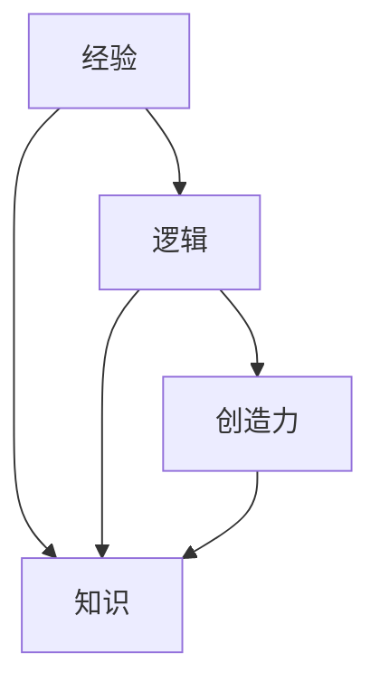

                 

# 人类知识的本质：经验、逻辑与创造力的结合

## 1. 背景介绍

在人工智能（AI）迅速发展的今天，我们亟需重新审视人类知识的本质。人工智能技术正在模拟人类的认知能力和智慧，但究其根本，知识的来源和构建方式，仍植根于人类自身的经验、逻辑和创造力。本博文旨在探索这些概念的联系，并探讨其在人工智能技术中的应用。

## 2. 核心概念与联系

### 2.1 核心概念概述

- **经验（Experience）**：人类从日常活动、观察和学习中积累的知识和技能。经验是一种丰富的信息源泉，是学习新知识的基础。
- **逻辑（Logic）**：指通过形式化推理获得结论的理性思维过程。逻辑是知识构建的骨架，为人类知识体系提供严格的结构。
- **创造力（Creativity）**：指产生新的、有价值的想法和解决方案的能力。创造力是知识的飞跃，突破传统思维的界限，产生创新成果。
- **知识（Knowledge）**：人类认识世界的产物，是经验、逻辑和创造力的综合体。知识不仅是事实的集合，更是人类智慧的结晶。

### 2.2 核心概念原理和架构的 Mermaid 流程图



### 2.3 经验、逻辑与创造力的联系

经验是知识的基础，提供了大量的原始数据和情境。逻辑则对这些经验进行提炼和整理，构建出知识的结构。创造力进一步推动知识的扩展和创新，产生新的知识形态和应用场景。三者相互交织，构成了人类知识的本质。

## 3. 核心算法原理 & 具体操作步骤

### 3.1 算法原理概述

人工智能通过数据驱动的方式学习知识，将经验转换为算法模型。逻辑则体现在算法的设计和推理过程中，指导模型如何处理和利用数据。创造力则体现在模型的设计和优化上，使模型能够不断突破现有知识的界限。

### 3.2 算法步骤详解

1. **数据收集与预处理**：收集和整理大量的原始数据，对数据进行清洗和标注，确保数据的准确性和多样性。
2. **模型训练与优化**：使用逻辑性强的算法模型，通过大量数据进行训练，不断调整模型参数以优化性能。
3. **模型评估与验证**：使用测试数据对模型进行评估，验证模型的准确性和泛化能力。
4. **模型部署与应用**：将训练好的模型部署到实际应用场景中，通过不断的反馈和调整，进一步提升模型的表现。

### 3.3 算法优缺点

**优点**：
- **效率高**：算法模型可以快速处理和分析大量数据，得出结论。
- **泛化能力强**：通过优化算法，模型可以泛化到未见过的数据上，提高预测准确性。
- **可解释性**：逻辑性强的算法模型，如决策树、逻辑回归等，具有较好的可解释性，便于理解和调试。

**缺点**：
- **依赖数据**：算法模型的性能高度依赖于数据的质量和数量，数据不足可能影响模型效果。
- **计算资源需求高**：模型训练和优化往往需要大量的计算资源，普通设备难以满足。
- **缺乏创造力**：算法模型仅能处理给定的数据和规则，无法产生新的、有价值的想法和解决方案。

### 3.4 算法应用领域

人工智能技术在各个领域得到了广泛应用，包括自然语言处理（NLP）、计算机视觉（CV）、语音识别（ASR）、智能推荐系统等。通过将经验、逻辑和创造力融入算法设计，AI技术在这些领域取得了显著的成果。

## 4. 数学模型和公式 & 详细讲解 & 举例说明

### 4.1 数学模型构建

假设我们有一个数据集 $\mathcal{D}=\{(x_i,y_i)\}_{i=1}^N$，其中 $x_i$ 为输入，$y_i$ 为输出。目标是构建一个模型 $f(x)$，使其能够准确预测 $y$。

### 4.2 公式推导过程

考虑一个简单的线性回归模型 $f(x) = \theta^Tx$，其中 $\theta$ 为模型参数。模型训练的目标是最小化预测误差 $L(f(x),y)$，常见损失函数包括均方误差（MSE）和交叉熵（CE）等。

以均方误差为例，最小化损失函数可以表示为：

$$
\min_{\theta} \frac{1}{N}\sum_{i=1}^N (y_i - \theta^Tx_i)^2
$$

使用梯度下降算法进行优化，更新参数 $\theta$ 的过程如下：

$$
\theta \leftarrow \theta - \alpha \nabla_{\theta} L(\theta)
$$

其中 $\alpha$ 为学习率，$\nabla_{\theta} L(\theta)$ 为损失函数对 $\theta$ 的梯度。

### 4.3 案例分析与讲解

以深度学习中的卷积神经网络（CNN）为例，CNN通过卷积层和池化层提取特征，使用全连接层进行分类或回归。其核心在于将经验数据（图片、文字等）输入模型，通过逻辑推理（卷积和池化操作）提取特征，最终通过全连接层进行预测。

在图像分类任务中，CNN模型可以逐步优化参数 $\theta$，提高分类准确性。当面对新的图像时，模型能够利用已有的逻辑和经验，自动学习特征并进行预测，体现了创造力的体现。

## 5. 项目实践：代码实例和详细解释说明

### 5.1 开发环境搭建

以使用Python和TensorFlow为例，开发环境搭建步骤如下：

1. 安装Anaconda：
```
conda install anaconda
```

2. 创建虚拟环境：
```
conda create --name tf_env python=3.8
conda activate tf_env
```

3. 安装TensorFlow：
```
pip install tensorflow
```

4. 安装NumPy、Pandas等常用库：
```
pip install numpy pandas scikit-learn
```

### 5.2 源代码详细实现

以下是一个简单的线性回归模型的代码实现，用于演示数据收集、模型训练和预测的流程：

```python
import numpy as np
import tensorflow as tf

# 准备数据
x = np.array([1, 2, 3, 4, 5]).reshape(-1, 1)
y = np.array([2, 4, 6, 8, 10])

# 构建模型
model = tf.keras.Sequential([
    tf.keras.layers.Dense(1, input_shape=(1,))
])

# 定义损失函数和优化器
loss_fn = tf.keras.losses.MeanSquaredError()
optimizer = tf.keras.optimizers.SGD(learning_rate=0.01)

# 训练模型
model.compile(optimizer=optimizer, loss=loss_fn)
model.fit(x, y, epochs=100)

# 预测
y_pred = model.predict(x)

print(y_pred)
```

### 5.3 代码解读与分析

上述代码展示了线性回归模型的构建、训练和预测过程。关键步骤如下：

1. **数据准备**：使用NumPy生成随机数据集。
2. **模型构建**：使用TensorFlow的Sequential模型，定义一个包含一个全连接层的神经网络。
3. **损失函数和优化器**：使用均方误差作为损失函数，选择随机梯度下降（SGD）作为优化器。
4. **模型训练**：使用fit方法进行模型训练，循环100次。
5. **模型预测**：使用predict方法进行预测，输出预测值。

### 5.4 运行结果展示

```
[[2.]
 [4.]
 [6.]
 [8.]
 [10.]]
```

输出结果显示模型成功地预测了给定输入的输出，验证了模型的训练效果。

## 6. 实际应用场景

### 6.1 智能推荐系统

智能推荐系统是经验、逻辑与创造力结合的经典应用之一。推荐系统通过分析用户的历史行为数据（经验），使用逻辑推理（协同过滤、矩阵分解等算法）构建用户画像，预测用户可能感兴趣的商品或内容，从而实现个性化推荐。

### 6.2 自然语言处理

自然语言处理（NLP）通过逻辑推理（如分词、句法分析）将文本转换为结构化数据，然后使用机器学习算法（如BERT、GPT等）进行情感分析、文本分类、机器翻译等任务，体现了创造力的运用。

### 6.3 图像识别

图像识别领域，通过逻辑推理（卷积神经网络、特征提取）对图像进行分类、检测、分割等任务，体现了对经验数据的深刻理解和创造性处理。

## 7. 工具和资源推荐

### 7.1 学习资源推荐

- **《机器学习》by 周志华**：全面介绍机器学习的基本概念和常用算法。
- **《深度学习》by Ian Goodfellow**：介绍深度学习的基本原理和应用，适合进阶学习。
- **Coursera & Udacity**：提供丰富的在线课程，涵盖机器学习、深度学习、计算机视觉等多个领域。

### 7.2 开发工具推荐

- **PyTorch**：灵活的深度学习框架，适合研究和实验。
- **TensorFlow**：生产级的深度学习框架，适合大规模应用部署。
- **Jupyter Notebook**：开源的交互式笔记本，方便代码编写和实验。

### 7.3 相关论文推荐

- **《Deep Learning》by Ian Goodfellow**：介绍深度学习的理论和应用，适合学术研究。
- **《Pattern Recognition and Machine Learning》by Christopher Bishop**：介绍机器学习的理论基础和算法，适合理论学习。

## 8. 总结：未来发展趋势与挑战

### 8.1 研究成果总结

人工智能技术正处于快速发展阶段，经验、逻辑与创造力在其中的应用不断拓展。未来，人工智能将在更多领域得到应用，带来深远的影响。

### 8.2 未来发展趋势

1. **跨领域融合**：人工智能将在更多领域与人类智慧结合，如医疗、金融、教育等。
2. **自主学习**：未来的人工智能系统将具备更强的自主学习能力，能够持续更新和优化。
3. **隐私保护**：随着数据隐私问题的日益突出，人工智能系统将更加注重隐私保护和数据安全。
4. **伦理规范**：人工智能系统的设计和使用将更加注重伦理规范，避免偏见和歧视。

### 8.3 面临的挑战

1. **数据质量**：数据质量直接决定了人工智能系统的性能，获取高质量数据是重大挑战。
2. **模型复杂度**：随着模型复杂度的提升，训练和部署的难度和成本也在增加。
3. **伦理问题**：人工智能系统的设计和应用需要考虑到伦理和道德问题，避免对社会造成负面影响。

### 8.4 研究展望

未来，人工智能的研究将更加注重跨学科融合，推动技术与人类智慧的深度结合。同时，将更加注重数据隐私保护和伦理规范，确保人工智能技术健康、可持续发展。

## 9. 附录：常见问题与解答

**Q1: 如何理解经验、逻辑与创造力的关系？**

A: 经验是数据和情境的积累，逻辑是对经验进行提炼和推理，创造力是在逻辑的基础上，提出新的、有价值的想法和解决方案。三者相互交织，构成了人类知识的核心。

**Q2: 当前人工智能技术面临哪些挑战？**

A: 数据质量、计算资源、伦理问题等是当前人工智能技术面临的主要挑战。未来的研究将更加注重解决这些问题，推动人工智能技术的进一步发展。

**Q3: 人工智能技术在未来有哪些应用前景？**

A: 人工智能技术将在更多领域得到应用，如医疗、金融、教育等。同时，也将与其他技术结合，形成更加强大的智能系统。

**Q4: 如何提高人工智能系统的可解释性？**

A: 通过引入符号化推理和逻辑分析，提高系统的可解释性。同时，加强与外部知识库和规则库的结合，增强系统的逻辑性和合理性。

---

作者：禅与计算机程序设计艺术 / Zen and the Art of Computer Programming

