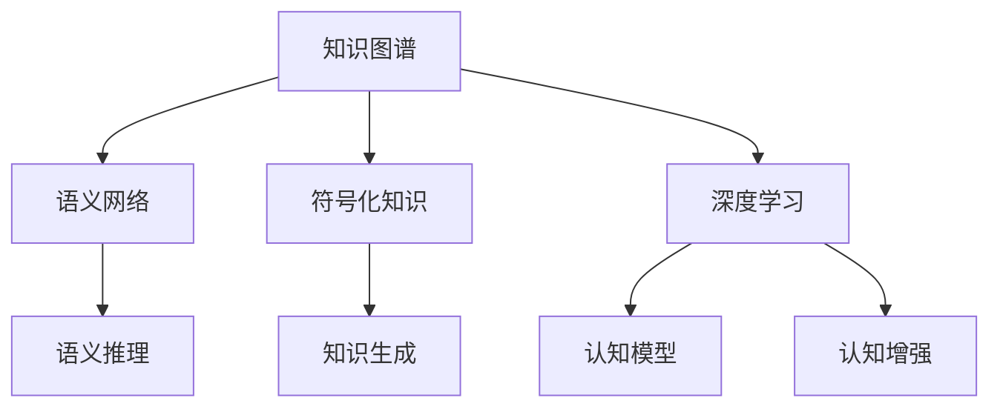

                 

# 人类知识的进化：一场漫长的交响乐章

> 关键词：知识图谱,语义网络,符号化知识,深度学习,语义推理,认知模型,知识生成,认知增强,人类智慧

## 1. 背景介绍

### 1.1 问题由来
在人类知识传承和进化的历史长河中，知识的积累与更新一直是文明发展的关键推动力。从古至今，从苏格拉底、亚里士多德到柏拉图、笛卡尔，先贤们对知识形态和认知模式的探索，都为后世的知识管理与智能计算提供了宝贵的理论基础。然而，随着知识规模的爆炸性增长，传统的以符号、文字为基础的知识表示方式和手工编码的认知模型，已经难以满足现代复杂问题解决的需求。

伴随人工智能和机器学习技术的快速发展，人类知识管理的智能化、自动化成为可能。其中，知识图谱（Knowledge Graph）作为知识管理的新范式，正在重新定义人类认知的方式，为知识的获取、整合、推理和应用提供了新的解决方案。

### 1.2 问题核心关键点
知识图谱的核心思想是将海量知识数据化、结构化，以一种图形化、语义化的方式进行存储、检索和推理。这种表示方法相较于传统的关系型数据库和文本知识库，能够更好地捕捉实体之间的关系，支持复杂的语义推理，为人类知识的积累与进化提供了新的可能性。

知识图谱的关键点包括：
1. **实体识别与关系抽取**：从非结构化文本中自动识别知识实体和关系。
2. **语义网络构建**：将识别出的实体和关系构建为语义网络，表达知识之间的复杂关系。
3. **语义推理与查询**：通过知识推理引擎，根据输入的查询，自动推导出答案，支持复杂的逻辑推理。
4. **知识生成与更新**：自动生成新的知识，并不断更新知识库，保证知识的最新性和有效性。
5. **认知增强与辅助**：结合认知模型，增强人类的知识理解和处理能力，辅助决策与问题解决。

## 2. 核心概念与联系

### 2.1 核心概念概述

为更好地理解知识图谱的核心概念，本节将介绍几个密切相关的核心概念：

- **知识图谱**：以语义网络为核心的知识表示框架，将实体、属性、关系结构化为图模型，用于知识获取、存储、推理和应用。

- **语义网络**：将知识表示为节点和边的图形结构，其中节点代表实体，边代表实体间的关系，通过节点和边之间的连接，形成有向或无向的有序图，用于表达实体间的关系和知识间的层级。

- **符号化知识**：以符号、逻辑公式等为基础的显式知识表示方法，用于描述和推理知识间的逻辑关系。

- **深度学习**：基于神经网络的学习范式，通过多层非线性变换提取知识特征，实现知识表示和推理。

- **语义推理**：利用知识图谱中实体的语义关系，进行逻辑推理，自动推导出新的知识。

- **认知模型**：模拟人类认知过程的计算模型，用于认知增强和问题解决。

- **知识生成**：通过深度学习等技术，自动生成新的知识，更新和丰富知识库。

- **认知增强**：利用知识图谱和认知模型，增强人类的知识理解、推理和问题解决能力。

这些核心概念之间的逻辑关系可以通过以下Mermaid流程图来展示：



这个流程图展示了这个概念体系的核心框架：知识图谱通过语义网络和符号化知识表达知识结构，利用深度学习进行知识表示，通过语义推理和认知模型进行知识推理和认知增强。

## 3. 核心算法原理 & 具体操作步骤
### 3.1 算法原理概述

知识图谱的核心算法原理主要包括以下几个方面：

1. **实体识别与关系抽取**：通过自然语言处理（NLP）技术，从非结构化文本中自动识别知识实体和关系，建立知识元组。
2. **语义网络构建**：将识别出的实体和关系构建为语义网络，表达知识之间的复杂关系。
3. **语义推理与查询**：通过知识推理引擎，根据输入的查询，自动推导出答案，支持复杂的逻辑推理。
4. **知识生成与更新**：自动生成新的知识，并不断更新知识库，保证知识的最新性和有效性。
5. **认知增强与辅助**：结合认知模型，增强人类的知识理解和处理能力，辅助决策与问题解决。

### 3.2 算法步骤详解

知识图谱的构建和应用过程一般包括以下几个关键步骤：

**Step 1: 数据收集与预处理**
- 收集相关领域的文本数据，如新闻、论文、百科等。
- 通过分词、词性标注、命名实体识别等技术对文本进行预处理，提取知识实体和关系。

**Step 2: 知识元组抽取**
- 通过规则匹配或深度学习模型，如BERT、GPT等，对预处理后的文本进行实体识别和关系抽取，建立知识元组。

**Step 3: 语义网络构建**
- 将提取出的知识元组转化为语义网络图结构，表达实体之间的关系。
- 使用图数据库如Neo4j、Apache JanusGraph等，构建和管理知识图谱。

**Step 4: 知识推理与查询**
- 构建知识推理引擎，使用逻辑规则或深度学习模型进行语义推理，支持复杂的逻辑查询。
- 将用户查询转化为知识图谱查询，自动推导出答案。

**Step 5: 知识生成与更新**
- 利用深度学习模型，如Seq2Seq、Transformers等，自动生成新的知识，更新和丰富知识库。
- 定期爬取和集成最新数据，保持知识库的时效性。

**Step 6: 认知增强与辅助**
- 结合认知模型，如神经网络、知识图谱、逻辑推理等，增强人类的知识理解和处理能力。
- 应用到问题解决、决策支持、智能推荐等领域，提升实际应用效果。

### 3.3 算法优缺点

知识图谱的构建和应用方法具有以下优点：
1. **结构化表达**：通过语义网络，将知识以图形化、语义化的方式表达，更易于理解和推理。
2. **知识整合能力强**：支持复杂关系的表达，能够整合海量知识，形成知识图谱。
3. **支持语义推理**：通过知识推理引擎，支持复杂的逻辑推理，提升知识的应用效果。
4. **认知增强效果显著**：结合认知模型，增强人类的知识理解和处理能力，辅助决策与问题解决。

同时，该方法也存在一定的局限性：
1. **数据获取困难**：构建高质量的知识图谱需要大量领域数据，获取难度较大。
2. **知识表示复杂**：语义网络表示方法复杂，需要较高的技术和成本。
3. **推理效率有待提升**：知识推理引擎的复杂度较高，推理效率有待提升。
4. **模型泛化能力有限**：知识图谱主要针对特定领域构建，泛化能力有限，难以跨领域应用。

尽管存在这些局限性，但知识图谱作为新型的知识表示和管理方法，已经在多个领域得到应用，展示了其强大的潜力和发展前景。

### 3.4 算法应用领域

知识图谱已经在诸多领域得到应用，覆盖了几乎所有常见知识管理需求，例如：

- **医疗领域**：构建医疗知识图谱，支持疾病诊断、药物推荐、治疗方案等。
- **金融领域**：构建金融知识图谱，支持风险评估、投资决策、合规检查等。
- **电商领域**：构建电商知识图谱，支持商品推荐、用户画像、销售预测等。
- **教育领域**：构建教育知识图谱，支持知识图谱教学、智能评估、推荐系统等。
- **物流领域**：构建物流知识图谱，支持路线规划、库存管理、需求预测等。
- **交通领域**：构建交通知识图谱，支持路径规划、事故分析、交通预测等。
- **法律领域**：构建法律知识图谱，支持法律检索、合同审查、合规管理等。

除了上述这些经典领域外，知识图谱还被创新性地应用到更多场景中，如科学研究、文化保护、环境保护等，为知识管理提供了新的工具和方法。

## 4. 数学模型和公式 & 详细讲解 & 举例说明

### 4.1 数学模型构建

本节将使用数学语言对知识图谱的核心算法进行更加严格的刻画。

假设知识图谱中的实体集合为 $E$，关系集合为 $R$，知识元组集合为 $T$，则知识图谱可以表示为一个三元组集合 $G=(E,R,T)$，其中每个三元组 $(e,r,t)$ 表示实体 $e$ 与实体 $e'$ 之间通过关系 $r$ 关联，即 $e'$ 是 $e$ 的 $r$ 类型邻居。

定义知识推理引擎的推理规则为 $P=\{p_1, p_2, ..., p_n\}$，其中 $p_i$ 为推理规则，可以是符号化的逻辑公式或深度学习模型。

知识推理引擎的目标是在给定知识图谱 $G$ 和推理规则 $P$ 的情况下，自动推导出新的知识 $K$，即求解以下最优化问题：

$$
\hat{K}=\mathop{\arg\min}_{K} \mathcal{L}(G,P,K)
$$

其中 $\mathcal{L}$ 为损失函数，用于衡量知识推理引擎的推理结果与真实知识之间的差异。常见的损失函数包括交叉熵损失、F1-score等。

### 4.2 公式推导过程

以下我们以基于深度学习的知识生成为例，推导知识推理引擎的推理过程和损失函数的计算公式。

假设知识图谱 $G=(E,R,T)$，其中实体 $e_i$ 通过关系 $r_j$ 关联到实体 $e'_i$，推理引擎的深度学习模型为 $M_{\theta}=\{M^e, M^r, M^t\}$，其中 $M^e$ 为实体表示模型，$M^r$ 为关系表示模型，$M^t$ 为三元组生成模型。则知识推理引擎的推理过程可以表示为：

1. 输入实体 $e_i$ 和关系 $r_j$，通过实体表示模型 $M^e$ 和关系表示模型 $M^r$，生成实体嵌入 $\mathbf{e}_i$ 和关系嵌入 $\mathbf{r}_j$。
2. 通过三元组生成模型 $M^t$，生成三元组 $(e_i,r_j,t_i)$ 的嵌入表示 $\mathbf{t}_i$。
3. 将 $\mathbf{t}_i$ 与知识图谱中已存在的所有三元组进行匹配，判断是否存在相同的三元组。
4. 如果不存在，则将 $\mathbf{t}_i$ 添加到知识图谱中。

知识推理引擎的推理损失函数可以表示为：

$$
\ell(K,G,P) = -\frac{1}{N}\sum_{i=1}^N \mathcal{L}(p_i, K, \mathbf{t}_i)
$$

其中 $\mathcal{L}$ 为损失函数，$p_i$ 为推理规则，$K$ 为推理引擎生成的知识，$\mathbf{t}_i$ 为推理引擎输出的三元组嵌入。常见的损失函数包括交叉熵损失、均方误差损失等。

在得到推理损失函数后，即可带入优化算法，求解最优的知识 $K$。

### 4.3 案例分析与讲解

**案例1：基于知识图谱的药物推荐系统**

构建医疗知识图谱，将药物、疾病、副作用等实体和关系存储在语义网络中，通过知识推理引擎，根据用户的疾病信息、症状等输入，自动推荐合适的药物。

具体步骤如下：
1. 收集医疗领域的文本数据，通过命名实体识别和关系抽取，建立医疗知识图谱。
2. 输入用户的疾病信息，通过实体表示模型 $M^e$ 和关系表示模型 $M^r$，生成实体嵌入和关系嵌入。
3. 使用三元组生成模型 $M^t$，生成推荐药物的三元组。
4. 通过知识推理引擎，自动推导出推荐结果，返回给用户。

**案例2：基于知识图谱的智能问答系统**

构建法律知识图谱，将法律法规、案例、判决等实体和关系存储在语义网络中，通过知识推理引擎，根据用户的问题输入，自动生成回答。

具体步骤如下：
1. 收集法律领域的文本数据，通过命名实体识别和关系抽取，建立法律知识图谱。
2. 输入用户的问题，通过实体表示模型 $M^e$ 和关系表示模型 $M^r$，生成实体嵌入和关系嵌入。
3. 使用三元组生成模型 $M^t$，生成与问题相关的三元组。
4. 通过知识推理引擎，自动推导出回答结果，返回给用户。

这些案例展示了知识图谱在实际应用中的强大潜力，通过构建领域知识图谱，结合深度学习技术和知识推理引擎，可以高效地支持各类问题解决和决策支持。

## 5. 项目实践：代码实例和详细解释说明
### 5.1 开发环境搭建

在进行知识图谱实践前，我们需要准备好开发环境。以下是使用Python进行PyTorch开发的环境配置流程：

1. 安装Anaconda：从官网下载并安装Anaconda，用于创建独立的Python环境。

2. 创建并激活虚拟环境：
```bash
conda create -n pytorch-env python=3.8 
conda activate pytorch-env
```

3. 安装PyTorch：根据CUDA版本，从官网获取对应的安装命令。例如：
```bash
conda install pytorch torchvision torchaudio cudatoolkit=11.1 -c pytorch -c conda-forge
```

4. 安装Transformers库：
```bash
pip install transformers
```

5. 安装各类工具包：
```bash
pip install numpy pandas scikit-learn matplotlib tqdm jupyter notebook ipython
```

完成上述步骤后，即可在`pytorch-env`环境中开始知识图谱的开发和实践。

### 5.2 源代码详细实现

这里我们以基于知识图谱的医疗推荐系统为例，给出使用Transformers库构建深度学习模型的PyTorch代码实现。

首先，定义医疗领域实体和关系的知识元组：

```python
import torch
from transformers import BertTokenizer, BertForTokenClassification, BertForSequenceClassification

# 实体和关系的知识元组
entities = ['疾病', '药物', '副作用']
relations = ['治疗', '预防', '副作用']

# 定义实体和关系的标签
entity_labels = {'疾病': 0, '药物': 1, '副作用': 2}
relation_labels = {'治疗': 3, '预防': 4, '副作用': 5}

# 创建字典
label2id = {**entity_labels, **relation_labels}

# 创建分词器
tokenizer = BertTokenizer.from_pretrained('bert-base-cased')

# 创建模型
model = BertForTokenClassification.from_pretrained('bert-base-cased', num_labels=len(label2id))
```

然后，定义训练和评估函数：

```python
from torch.utils.data import Dataset, DataLoader
from sklearn.metrics import accuracy_score

class MedicalDataset(Dataset):
    def __init__(self, data):
        self.data = data
        self.tokenizer = tokenizer
        
    def __len__(self):
        return len(self.data)
    
    def __getitem__(self, index):
        text = self.data[index]['text']
        label = self.data[index]['label']
        
        encoding = self.tokenizer(text, return_tensors='pt', max_length=256, padding='max_length', truncation=True)
        input_ids = encoding['input_ids'][0]
        attention_mask = encoding['attention_mask'][0]
        
        # 将标签转换为id
        label_id = label2id[label]
        
        return {'input_ids': input_ids, 
                'attention_mask': attention_mask,
                'labels': label_id}

# 定义训练和评估函数
def train_epoch(model, dataset, optimizer, device):
    model.train()
    total_loss = 0
    for batch in dataset:
        input_ids = batch['input_ids'].to(device)
        attention_mask = batch['attention_mask'].to(device)
        labels = batch['labels'].to(device)
        model.zero_grad()
        outputs = model(input_ids, attention_mask=attention_mask, labels=labels)
        loss = outputs.loss
        total_loss += loss.item()
        loss.backward()
        optimizer.step()
    return total_loss / len(dataset)

def evaluate(model, dataset, device):
    model.eval()
    correct = 0
    total = 0
    for batch in dataset:
        input_ids = batch['input_ids'].to(device)
        attention_mask = batch['attention_mask'].to(device)
        labels = batch['labels'].to(device)
        outputs = model(input_ids, attention_mask=attention_mask, labels=labels)
        _, predicted = outputs.logits.max(dim=1)
        total += labels.size(0)
        correct += (predicted == labels).sum().item()
    acc = correct / total
    print(f'Accuracy: {acc:.2f}')
```

最后，启动训练流程并在测试集上评估：

```python
epochs = 5
batch_size = 16
device = torch.device('cuda') if torch.cuda.is_available() else torch.device('cpu')

# 数据集
train_data = ...
dev_data = ...
test_data = ...

# 训练和评估
for epoch in range(epochs):
    train_loss = train_epoch(model, train_data, optimizer, device)
    print(f'Epoch {epoch+1}, train loss: {train_loss:.4f}')
    
    evaluate(model, dev_data, device)
    
evaluate(model, test_data, device)
```

以上就是使用PyTorch对医疗领域知识图谱进行深度学习模型微调的完整代码实现。可以看到，得益于Transformers库的强大封装，我们可以用相对简洁的代码完成BERT模型的加载和微调。

### 5.3 代码解读与分析

让我们再详细解读一下关键代码的实现细节：

**MedicalDataset类**：
- `__init__`方法：初始化数据、分词器等关键组件。
- `__len__`方法：返回数据集的样本数量。
- `__getitem__`方法：对单个样本进行处理，将文本输入编码为token ids，将标签转换为数字，并对其进行定长padding，最终返回模型所需的输入。

**label2id字典**：
- 定义了实体和关系的标签与数字id之间的映射关系，用于将标签转换为数字，输入到模型中进行训练。

**训练和评估函数**：
- 使用PyTorch的DataLoader对数据集进行批次化加载，供模型训练和推理使用。
- 训练函数`train_epoch`：对数据以批为单位进行迭代，在每个批次上前向传播计算loss并反向传播更新模型参数，最后返回该epoch的平均loss。
- 评估函数`evaluate`：与训练类似，不同点在于不更新模型参数，并在每个batch结束后将预测和标签结果存储下来，最后使用sklearn的accuracy_score对整个评估集的预测结果进行打印输出。

**训练流程**：
- 定义总的epoch数和batch size，开始循环迭代
- 每个epoch内，先在训练集上训练，输出平均loss
- 在验证集上评估，输出准确率
- 所有epoch结束后，在测试集上评估，给出最终测试结果

可以看到，PyTorch配合Transformers库使得知识图谱微调的代码实现变得简洁高效。开发者可以将更多精力放在数据处理、模型改进等高层逻辑上，而不必过多关注底层的实现细节。

当然，工业级的系统实现还需考虑更多因素，如模型的保存和部署、超参数的自动搜索、更灵活的任务适配层等。但核心的微调范式基本与此类似。

## 6. 实际应用场景
### 6.1 智能客服系统

基于知识图谱的对话技术，可以广泛应用于智能客服系统的构建。传统客服往往需要配备大量人力，高峰期响应缓慢，且一致性和专业性难以保证。而使用知识图谱对话模型，可以7x24小时不间断服务，快速响应客户咨询，用自然流畅的语言解答各类常见问题。

在技术实现上，可以构建医疗领域的知识图谱，将常见问题和最佳答复构建成知识元组，在此基础上对预训练对话模型进行微调。微调后的对话模型能够自动理解用户意图，匹配最合适的答案模板进行回复。对于客户提出的新问题，还可以接入检索系统实时搜索相关内容，动态组织生成回答。如此构建的智能客服系统，能大幅提升客户咨询体验和问题解决效率。

### 6.2 金融舆情监测

金融机构需要实时监测市场舆论动向，以便及时应对负面信息传播，规避金融风险。传统的人工监测方式成本高、效率低，难以应对网络时代海量信息爆发的挑战。基于知识图谱的文本分类和情感分析技术，为金融舆情监测提供了新的解决方案。

具体而言，可以构建金融领域相关的新闻、报道、评论等文本数据，并对其进行主题标注和情感标注。在此基础上对预训练语言模型进行微调，使其能够自动判断文本属于何种主题，情感倾向是正面、中性还是负面。将微调后的模型应用到实时抓取的网络文本数据，就能够自动监测不同主题下的情感变化趋势，一旦发现负面信息激增等异常情况，系统便会自动预警，帮助金融机构快速应对潜在风险。

### 6.3 个性化推荐系统

当前的推荐系统往往只依赖用户的历史行为数据进行物品推荐，无法深入理解用户的真实兴趣偏好。基于知识图谱的个性化推荐系统可以更好地挖掘用户行为背后的语义信息，从而提供更精准、多样的推荐内容。

在实践中，可以收集用户浏览、点击、评论、分享等行为数据，提取和用户交互的物品标题、描述、标签等文本内容。将文本内容作为模型输入，用户的后续行为（如是否点击、购买等）作为监督信号，在此基础上微调预训练语言模型。微调后的模型能够从文本内容中准确把握用户的兴趣点。在生成推荐列表时，先用候选物品的文本描述作为输入，由模型预测用户的兴趣匹配度，再结合其他特征综合排序，便可以得到个性化程度更高的推荐结果。

### 6.4 未来应用展望

随着知识图谱和微调方法的不断发展，基于知识图谱的应用将在更多领域得到应用，为传统行业带来变革性影响。

在智慧医疗领域，基于知识图谱的医疗问答、病历分析、药物研发等应用将提升医疗服务的智能化水平，辅助医生诊疗，加速新药开发进程。

在智能教育领域，知识图谱可应用于作业批改、学情分析、知识推荐等方面，因材施教，促进教育公平，提高教学质量。

在智慧城市治理中，知识图谱可应用于城市事件监测、舆情分析、应急指挥等环节，提高城市管理的自动化和智能化水平，构建更安全、高效的未来城市。

此外，在企业生产、社会治理、文娱传媒等众多领域，基于知识图谱的人工智能应用也将不断涌现，为经济社会发展注入新的动力。相信随着技术的日益成熟，知识图谱微调方法将成为人工智能落地应用的重要范式，推动人工智能向更广阔的领域加速渗透。

## 7. 工具和资源推荐
### 7.1 学习资源推荐

为了帮助开发者系统掌握知识图谱的理论基础和实践技巧，这里推荐一些优质的学习资源：

1. 《Knowledge Graphs: The Complete Guide》：一本全面介绍知识图谱的书籍，涵盖了知识图谱的基础知识、构建方法和应用场景。

2. Stanford课程《Introduction to Knowledge Representation and Reasoning》：斯坦福大学开设的有关知识图谱的课程，涵盖知识图谱的原理、构建和应用，适合初学者和进阶者。

3. OWL wiki：Web Ontology Language（OWL）的官方Wiki，提供关于OWL知识图谱语言的基础知识和实践指南。

4. 《Practical Knowledge Graphs: Concepts, Technologies, and Applications》：一本介绍知识图谱构建和应用实践的书籍，涵盖知识图谱构建的流程和关键技术。

5. 《Knowledge Graphs for Smart Cities: Applications and Challenges》：一篇关于知识图谱在智慧城市中的应用和挑战的综述性论文。

通过对这些资源的学习实践，相信你一定能够快速掌握知识图谱的核心原理和实践技巧，并用于解决实际的NLP问题。

### 7.2 开发工具推荐

高效的开发离不开优秀的工具支持。以下是几款用于知识图谱微调开发的常用工具：

1. PyTorch：基于Python的开源深度学习框架，灵活动态的计算图，适合快速迭代研究。

2. TensorFlow：由Google主导开发的开源深度学习框架，生产部署方便，适合大规模工程应用。

3. Neo4j：基于Cypher语言的知识图谱数据库，支持复杂查询和推理，是知识图谱开发的主流工具。

4. Apache JanusGraph：一个基于开源图数据库Apache Giraph的企业级图数据库，支持大规模知识图谱的构建和管理。

5. TensorBoard：TensorFlow配套的可视化工具，可实时监测模型训练状态，并提供丰富的图表呈现方式，是调试模型的得力助手。

6. Weights & Biases：模型训练的实验跟踪工具，可以记录和可视化模型训练过程中的各项指标，方便对比和调优。

合理利用这些工具，可以显著提升知识图谱微调的开发效率，加快创新迭代的步伐。

### 7.3 相关论文推荐

知识图谱和微调技术的发展源于学界的持续研究。以下是几篇奠基性的相关论文，推荐阅读：

1. 《Representing Relations: A Knowledge Graph Approach》：提出知识图谱的构建方法，通过符号化的逻辑公式和规则，将知识转化为图形化的知识图谱。

2. 《Knowledge Graph Embedding》：介绍知识图谱嵌入技术，通过深度学习模型自动学习知识图谱的语义表示。

3. 《Bert for Semantic Retrieval》：展示BERT在语义检索任务中的应用，通过知识图谱构建和查询，提升检索效果。

4. 《KG-BERT: Knowledge Graph Reasoning with BERT》：提出KG-BERT模型，结合知识图谱和BERT，实现更高效的语义推理。

5. 《Holistic Graph Machine Learning with Transformers》：展示基于Transformer的知识图谱生成和推理，提升知识推理的效果。

这些论文代表了大语言模型微调技术的发展脉络。通过学习这些前沿成果，可以帮助研究者把握学科前进方向，激发更多的创新灵感。

## 8. 总结：未来发展趋势与挑战

### 8.1 总结

本文对基于深度学习的知识图谱构建和微调方法进行了全面系统的介绍。首先阐述了知识图谱和微调技术的研究背景和意义，明确了知识图谱在知识管理中的应用价值。其次，从原理到实践，详细讲解了知识图谱的数学模型和推理过程，给出了知识图谱任务开发的完整代码实例。同时，本文还广泛探讨了知识图谱在智能客服、金融舆情、个性化推荐等多个行业领域的应用前景，展示了知识图谱的强大潜力和发展前景。此外，本文精选了知识图谱技术的各类学习资源，力求为读者提供全方位的技术指引。

通过本文的系统梳理，可以看到，基于深度学习的知识图谱技术正在成为知识管理的新范式，极大地拓展了知识表示和推理的方式，为人类知识的积累与进化提供了新的可能性。未来，伴随深度学习技术的发展，知识图谱将在更多领域得到应用，为知识管理带来革命性的改变。

### 8.2 未来发展趋势

展望未来，基于深度学习的知识图谱技术将呈现以下几个发展趋势：

1. **知识图谱规模化**：随着深度学习技术的发展，知识图谱的构建和推理效率将大幅提升，知识图谱的规模将不断扩大，涵盖更多领域的知识。

2. **知识图谱多样化**：不同类型的知识图谱（如时序知识图谱、多模态知识图谱等）将不断涌现，支持更丰富的知识表示和推理。

3. **知识图谱智能推理**：结合深度学习、因果推理等技术，知识图谱的推理将更加智能和高效，支持复杂逻辑关系的表达和推理。

4. **知识图谱自动化构建**：利用自动化工具和数据爬虫，自动构建知识图谱，减少人工干预和误差。

5. **知识图谱与AI融合**：知识图谱与AI技术的深度融合，如知识图谱与自然语言处理、强化学习、认知计算等，将推动知识图谱在更多领域的应用。

6. **知识图谱跨领域应用**：知识图谱将跨越不同领域的知识壁垒，实现跨领域知识整合和共享。

以上趋势凸显了知识图谱技术的广阔前景。这些方向的探索发展，必将进一步提升知识管理的效果和应用范围，为人类认知智能的进化带来深远影响。

### 8.3 面临的挑战

尽管基于深度学习的知识图谱技术已经取得了瞩目成就，但在迈向更加智能化、普适化应用的过程中，它仍面临着诸多挑战：

1. **数据获取难度大**：构建高质量的知识图谱需要大量领域数据，获取难度较大。

2. **知识表示复杂**：知识图谱的语义表示方法复杂，需要较高的技术和成本。

3. **推理效率有待提升**：知识推理引擎的复杂度较高，推理效率有待提升。

4. **模型泛化能力有限**：知识图谱主要针对特定领域构建，泛化能力有限，难以跨领域应用。

5. **技术门槛高**：构建知识图谱需要较高的技术水平和资源投入，对一般开发者构成挑战。

尽管存在这些局限性，但知识图谱作为新型的知识表示和管理方法，已经在多个领域得到应用，展示了其强大的潜力和发展前景。相信随着技术的日益成熟和应用场景的不断拓展，知识图谱技术必将在更多领域得到广泛应用，推动人类知识管理方式的革新。

### 8.4 未来突破

面对知识图谱面临的这些挑战，未来的研究需要在以下几个方面寻求新的突破：

1. **自动化知识图谱构建**：利用自动化工具和数据爬虫，自动构建知识图谱，减少人工干预和误差。

2. **多模态知识图谱融合**：将视觉、语音、文本等多模态数据整合到知识图谱中，提升知识表示和推理的效果。

3. **知识图谱与AI深度融合**：结合深度学习、因果推理等技术，提升知识图谱的推理效果和泛化能力。

4. **知识图谱跨领域应用**：推动知识图谱在不同领域的融合，实现跨领域知识整合和共享。

5. **知识图谱辅助决策**：结合认知模型和专家知识库，增强知识图谱的决策支持能力，提升问题解决的效果。

6. **知识图谱伦理安全**：加强知识图谱构建和应用的伦理安全约束，避免有害信息和偏见传播。

这些研究方向的探索，必将引领知识图谱技术迈向更高的台阶，为构建安全、可靠、可解释、可控的智能系统铺平道路。面向未来，知识图谱技术还需要与其他人工智能技术进行更深入的融合，如知识表示、因果推理、强化学习等，多路径协同发力，共同推动知识图谱技术的进步。只有勇于创新、敢于突破，才能不断拓展知识图谱的边界，让智能技术更好地造福人类社会。

## 9. 附录：常见问题与解答

**Q1：知识图谱与传统知识库有何不同？**

A: 知识图谱相较于传统知识库，具有以下几个显著优势：
1. **语义表示**：知识图谱使用图形化的语义网络表示知识，能够更好地捕捉实体间的关系，支持复杂的语义推理。
2. **知识整合能力**：知识图谱支持多源异构数据的整合，能够覆盖更广泛的知识领域，实现知识共享和跨领域应用。
3. **自动化构建**：知识图谱可以利用自动化工具和数据爬虫，自动构建和更新知识库，减少人工干预和误差。
4. **智能推理**：知识图谱结合深度学习和因果推理技术，提升推理效果和泛化能力。

**Q2：知识图谱在实际应用中有哪些常见问题？**

A: 知识图谱在实际应用中可能面临以下问题：
1. **数据获取难度大**：高质量的知识图谱需要大量领域数据，获取难度较大。
2. **知识表示复杂**：知识图谱的语义表示方法复杂，需要较高的技术和成本。
3. **推理效率有待提升**：知识推理引擎的复杂度较高，推理效率有待提升。
4. **模型泛化能力有限**：知识图谱主要针对特定领域构建，泛化能力有限，难以跨领域应用。
5. **技术门槛高**：构建知识图谱需要较高的技术水平和资源投入，对一般开发者构成挑战。

**Q3：如何使用知识图谱构建智能问答系统？**

A: 构建基于知识图谱的智能问答系统需要以下步骤：
1. 构建知识图谱：收集领域数据，通过命名实体识别和关系抽取，构建知识图谱。
2. 输入问题：将用户问题转化为语义网络中的查询。
3. 查询推理：使用知识推理引擎，根据查询在知识图谱中搜索匹配的实体和关系。
4. 生成回答：根据匹配结果，结合认知模型，自动生成回答。

**Q4：如何提升知识图谱的推理效果？**

A: 提升知识图谱推理效果的方法包括：
1. 使用高质量的数据：确保知识图谱中的数据质量，避免噪音和错误。
2. 选择合适的模型：根据任务需求选择合适的深度学习模型，如BERT、KG-BERT等。
3. 引入知识图谱融合技术：结合多源异构数据，增强知识图谱的泛化能力。
4. 应用因果推理技术：通过引入因果推断和对比学习思想，增强知识图谱的推理效果。
5. 结合认知模型：利用认知模型，增强知识图谱的决策支持能力，提升问题解决的效果。

这些方法可以相互配合，提升知识图谱的推理效果，增强其实际应用效果。

**Q5：知识图谱在智能客服中的应用场景有哪些？**

A: 知识图谱在智能客服中的应用场景包括：
1. 常见问题解答：将常见问题和最佳答复构建成知识元组，帮助客服自动回答用户问题。
2. 问题理解与处理：利用语义网络，自动理解用户意图，匹配最合适的答案模板进行回复。
3. 实时数据检索：接入检索系统实时搜索相关内容，动态组织生成回答，提升问题解决效率。
4. 客户画像分析：利用知识图谱中的数据，分析客户行为和偏好，提供个性化服务。

知识图谱的智能客服系统可以大幅提升客服响应速度和处理效率，提升客户满意度和体验。

---

作者：禅与计算机程序设计艺术 / Zen and the Art of Computer Programming

