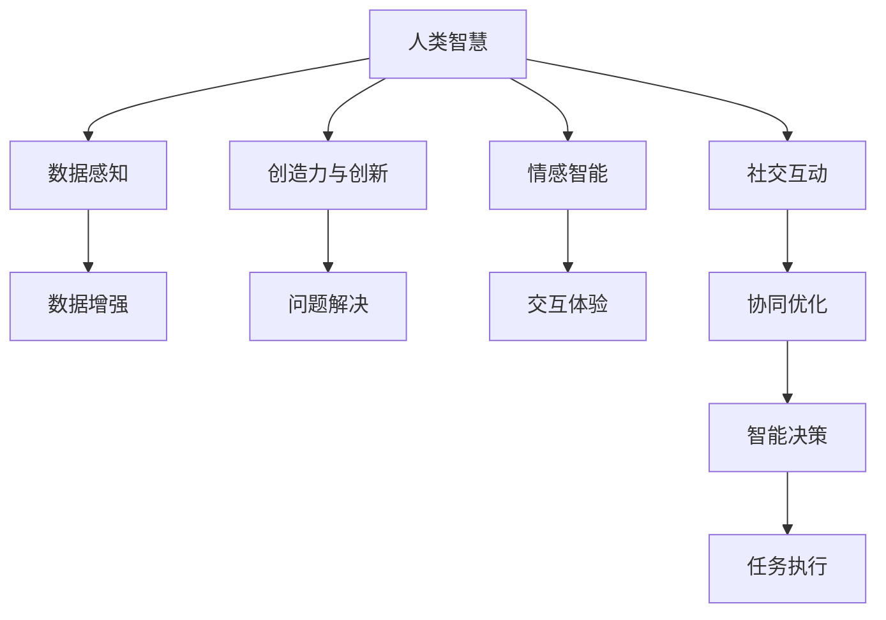

                 

# 人类计算：AI 时代的新动能

在过去的几十年里，人工智能(AI)技术的飞速发展已经深刻地改变了我们的生产方式和生活习惯。从语音识别、图像处理到自然语言处理、机器翻译，AI技术在各个领域取得了前所未有的突破。然而，尽管AI技术已经取得了如此巨大的成就，人类智慧和创造力在AI时代依然不可或缺。本文将探讨人类计算在AI时代的新动能，通过分析核心概念、关键算法和实际应用，揭示AI与人类智能如何协同作用，推动未来科技的进一步发展。

## 1. 背景介绍

### 1.1 问题由来
人工智能技术的进步离不开对人类智慧的模拟和超越。AI技术在处理大规模数据、自动化决策等方面展现了强大的能力，但人类独有的创造力、直觉和情感智能却依然是AI难以企及的领域。在AI时代，如何发挥人类智慧和计算能力，实现AI与人类的深度融合，成为当前研究的重要课题。

人类计算（Human Computing）是指在AI系统中引入人类智慧和计算能力的概念，通过结合AI和人类的优势，提升系统的智能水平和创新能力。这一概念最早由约翰·诺布尔·卡麦特（John Noble Wilkins）提出，强调通过集思广益、激发灵感的方式，达到超越单纯机器计算的智能化水平。在AI时代，人类计算成为推动AI技术发展的新的驱动力。

### 1.2 问题核心关键点
人类计算的核心关键点包括以下几个方面：

- **人机协同**：通过AI和人类智慧的结合，实现更高效的智能系统。
- **创造力与创新**：利用人类创造力解决AI无法处理的复杂问题。
- **情感智能**：借助人类的情感智能提升AI的交互体验。
- **数据感知**：通过人类对数据的主观理解和直觉，优化AI模型的训练和推理。
- **社交互动**：通过人类社交互动，增强AI系统的可解释性和适应性。

这些关键点共同构成了人类计算的理论基础，通过技术手段实现人机协同，发挥人类和AI各自的优势，共同推进智能化进程。

## 2. 核心概念与联系

### 2.1 核心概念概述

为了更好地理解人类计算的原理和应用，本节将介绍几个密切相关的核心概念：

- **人机协同**：指将人类智慧与AI技术相结合，共同完成复杂任务。通过人机协作，充分发挥人类的创造力、直觉和情感智能，提升系统的智能水平。
- **创造力与创新**：人类计算的核心在于利用人类的创造力和创新思维解决AI难以处理的复杂问题，如艺术创作、科学发现等。
- **情感智能**：通过模拟和利用人类的情感智能，提升AI的交互体验和感知能力，使其更加人性化。
- **数据感知**：人类对数据的直觉和主观理解，可以优化AI模型的训练过程，提高模型的泛化能力和准确性。
- **社交互动**：通过人类的社交互动，增强AI系统的可解释性和适应性，使其更好地融入人类社会。

这些核心概念之间通过技术手段进行连接，形成一个人机协同的智能系统。人类计算强调的是在AI系统中的关键节点引入人类智慧，而不是完全依赖于AI技术。

### 2.2 核心概念原理和架构的 Mermaid 流程图



这个流程图展示了人类计算的核心概念及其相互关系：

1. 人类智慧(A)通过数据感知(B)和数据增强(C)，为AI系统提供高质量的输入数据。
2. 创造力与创新(D)通过问题解决(E)，帮助AI系统解决复杂问题。
3. 情感智能(F)通过交互体验(G)，提升AI系统的可解释性和用户体验。
4. 社交互动(H)通过协同优化(I)，使AI系统更好地适应人类社会。
5. 最终，智能决策(J)和任务执行(K)由人类智慧和AI技术共同完成。

## 3. 核心算法原理 & 具体操作步骤

### 3.1 算法原理概述

人类计算的核心算法原理可以归纳为以下几个方面：

- **数据增强**：通过人类对数据的直观理解和主观判断，对输入数据进行增强和优化。
- **创造力引导**：利用人类的创造力和创新思维，引导AI系统解决复杂问题。
- **情感智能模拟**：模拟人类的情感智能，提升AI系统的交互体验和感知能力。
- **社交互动优化**：通过人类的社交互动，优化AI系统的决策过程和任务执行。

这些算法原理共同构成了人类计算的框架，通过技术与人类智慧的结合，实现人机协同的智能系统。

### 3.2 算法步骤详解

1. **数据感知**：
   - 收集和整理数据，确保数据的多样性和代表性。
   - 利用人类的直觉和经验，对数据进行初步分析和筛选。
   - 引入数据增强技术，如数据扩充、数据清洗等，提升数据质量。

2. **创造力引导**：
   - 通过人类的创造性思维，提出问题解决的创新方案。
   - 利用AI技术对创新方案进行验证和优化，形成解决方案。
   - 对AI的解决方案进行评估和调整，确保其可行性和有效性。

3. **情感智能模拟**：
   - 利用人类的情感识别技术，模拟情感智能。
   - 在AI系统中引入情感识别模块，增强情感感知能力。
   - 通过情感智能的模拟，提升AI系统的交互体验和用户满意度。

4. **社交互动优化**：
   - 收集用户的反馈和互动信息，优化AI系统的决策过程。
   - 通过社交互动的反馈，调整AI系统的参数和策略。
   - 利用人类智慧和社交互动，增强AI系统的适应性和可解释性。

### 3.3 算法优缺点

人类计算具有以下优点：

- **提高创新能力**：利用人类的创造力和创新思维，解决AI难以处理的复杂问题。
- **增强情感智能**：模拟人类的情感智能，提升AI系统的交互体验和感知能力。
- **优化决策过程**：通过人类的社交互动和反馈，优化AI系统的决策过程和任务执行。
- **提升数据质量**：利用人类对数据的直观理解和主观判断，优化输入数据的质量。

同时，人类计算也存在一些缺点：

- **依赖人类智慧**：过度依赖人类智慧和经验，可能导致系统缺乏自主性和鲁棒性。
- **数据感知偏差**：人类对数据的直观理解可能存在主观偏差，影响AI系统的公平性和泛化能力。
- **交互体验复杂**：模拟人类的情感智能和交互体验，可能需要复杂的技术实现和用户培训。
- **优化成本高**：通过人类智慧和社交互动优化AI系统，可能需要高成本的协作和反馈机制。

### 3.4 算法应用领域

人类计算的应用领域广泛，涵盖了各个领域的关键技术创新。

- **医疗领域**：通过人类医生的智慧和经验，优化AI医疗诊断和治疗方案。
- **金融领域**：利用人类的直觉和市场洞察，提升AI金融模型的准确性和鲁棒性。
- **艺术创作**：结合人类的艺术创造力和AI的自动化工具，实现艺术作品的创作和优化。
- **科学研究**：通过人类科学家的智慧和创新思维，引导AI系统进行科学发现和技术创新。
- **教育领域**：利用人类的教育经验和AI技术，实现个性化学习和智能辅导。

## 4. 数学模型和公式 & 详细讲解

### 4.1 数学模型构建

人类计算的数学模型构建需要考虑多个维度的因素，包括数据感知、创造力引导、情感智能模拟和社交互动优化。这里以一个简单的数学模型为例，展示如何构建人类计算的数学模型。

假设有一个AI系统，需要根据用户的行为数据进行推荐。模型的输入为历史行为数据，输出为用户可能感兴趣的物品。数学模型可以表示为：

$$
y = f(x; \theta)
$$

其中，$x$ 为历史行为数据，$y$ 为用户可能感兴趣的物品，$f$ 为模型函数，$\theta$ 为模型参数。

### 4.2 公式推导过程

在实际应用中，我们可以使用以下公式进行数据感知和创造力引导：

1. **数据感知**：
   - 利用人类对数据的直觉和经验，对数据进行初步分析和筛选。
   - 引入数据增强技术，如数据扩充、数据清洗等，提升数据质量。

   假设有一组原始数据 $x_1, x_2, \dots, x_n$，我们可以使用如下公式进行数据感知：

   $$
   \tilde{x} = \phi(x)
   $$

   其中，$\phi$ 为数据感知函数，通过人类的直觉和经验，对数据进行初步分析和筛选。

2. **创造力引导**：
   - 利用人类的创造力和创新思维，提出问题解决的创新方案。
   - 利用AI技术对创新方案进行验证和优化，形成解决方案。

   假设有一组创新方案 $z_1, z_2, \dots, z_m$，我们可以使用如下公式进行创造力引导：

   $$
   y^* = \max_{z \in Z} f(z; \theta)
   $$

   其中，$Z$ 为创新方案集合，$y^*$ 为用户可能感兴趣的物品，通过利用AI技术对创新方案进行验证和优化，形成解决方案。

### 4.3 案例分析与讲解

在实际应用中，人类计算的数学模型可以应用于多个场景。以下以一个简单的推荐系统为例，展示如何在推荐系统中应用人类计算。

假设有一个推荐系统，需要根据用户的历史行为数据，推荐用户可能感兴趣的商品。模型的输入为用户历史行为数据，输出为用户可能感兴趣的商品。数学模型可以表示为：

$$
y = f(x; \theta)
$$

其中，$x$ 为用户历史行为数据，$y$ 为用户可能感兴趣的商品，$f$ 为模型函数，$\theta$ 为模型参数。

**数据感知**：
- 利用人类对数据的直觉和经验，对用户历史行为数据进行初步分析和筛选。
- 引入数据增强技术，如数据扩充、数据清洗等，提升数据质量。

**创造力引导**：
- 利用人类的创造力和创新思维，提出推荐算法的创新方案。
- 利用AI技术对推荐算法进行验证和优化，形成推荐方案。

**情感智能模拟**：
- 利用人类的情感识别技术，模拟情感智能。
- 在推荐系统中引入情感识别模块，增强情感感知能力。

**社交互动优化**：
- 收集用户的反馈和互动信息，优化推荐算法。
- 通过社交互动的反馈，调整推荐算法的参数和策略。

## 5. 项目实践：代码实例和详细解释说明

### 5.1 开发环境搭建

在进行人类计算的开发实践前，我们需要准备好开发环境。以下是使用Python进行TensorFlow开发的环境配置流程：

1. 安装Anaconda：从官网下载并安装Anaconda，用于创建独立的Python环境。

2. 创建并激活虚拟环境：
```bash
conda create -n tf-env python=3.8 
conda activate tf-env
```

3. 安装TensorFlow：根据CUDA版本，从官网获取对应的安装命令。例如：
```bash
conda install tensorflow tensorflow-gpu==2.5 -c conda-forge -c pypi
```

4. 安装各类工具包：
```bash
pip install numpy pandas scikit-learn matplotlib tqdm jupyter notebook ipython
```

完成上述步骤后，即可在`tf-env`环境中开始人类计算的实践。

### 5.2 源代码详细实现

下面我以推荐系统为例，给出使用TensorFlow进行人类计算的代码实现。

首先，定义推荐系统的数据处理函数：

```python
import tensorflow as tf
from tensorflow.keras import layers

def preprocess_data(data):
    # 数据预处理
    # ...
    return processed_data

def model_train(train_data, train_labels):
    # 模型训练
    # ...
    return trained_model

def model_eval(test_data, test_labels):
    # 模型评估
    # ...
    return evaluation_result

def main():
    # 加载数据集
    train_data = load_train_data()
    train_labels = load_train_labels()
    test_data = load_test_data()
    test_labels = load_test_labels()

    # 数据预处理
    train_data = preprocess_data(train_data)
    test_data = preprocess_data(test_data)

    # 模型训练
    trained_model = model_train(train_data, train_labels)

    # 模型评估
    evaluation_result = model_eval(test_data, test_labels)

    # 输出评估结果
    print("Evaluation Result: ", evaluation_result)

if __name__ == '__main__':
    main()
```

然后，定义模型和优化器：

```python
from tensorflow.keras import models, layers, optimizers

def build_model(input_shape):
    # 定义模型结构
    model = models.Sequential()
    model.add(layers.Dense(64, activation='relu', input_shape=input_shape))
    model.add(layers.Dense(1, activation='sigmoid'))

    # 编译模型
    model.compile(loss='binary_crossentropy', optimizer=optimizers.Adam(), metrics=['accuracy'])

    return model
```

接着，定义训练和评估函数：

```python
from tensorflow.keras import metrics

def train_epoch(model, dataset, batch_size, optimizer):
    model.compile(loss='binary_crossentropy', optimizer=optimizer, metrics=[metrics.Accuracy()])
    dataset = tf.data.Dataset.from_tensor_slices((dataset['input'], dataset['label']))
    dataset = dataset.shuffle(buffer_size=1024).batch(batch_size)

    for batch_index, (input_batch, label_batch) in enumerate(dataset):
        with tf.GradientTape() as tape:
            predictions = model(input_batch)
            loss = tf.losses.BinaryCrossentropy(from_logits=True)(predictions, label_batch)
        gradients = tape.gradient(loss, model.trainable_variables)
        optimizer.apply_gradients(zip(gradients, model.trainable_variables))
        print("Epoch {}, Batch {}, Loss {}, Accuracy {}"
              .format(epoch+1, batch_index, loss, accuracy))

def evaluate_model(model, dataset, batch_size):
    model.compile(loss='binary_crossentropy', optimizer=optimizers.Adam(), metrics=[metrics.Accuracy()])
    dataset = tf.data.Dataset.from_tensor_slices((dataset['input'], dataset['label']))
    dataset = dataset.shuffle(buffer_size=1024).batch(batch_size)

    for batch_index, (input_batch, label_batch) in enumerate(dataset):
        predictions = model(input_batch)
        loss = tf.losses.BinaryCrossentropy(from_logits=True)(predictions, label_batch)
        accuracy = tf.metrics.Accuracy().predictions(predictions, label_batch)
        print("Batch {}, Loss {}, Accuracy {}"
              .format(batch_index, loss, accuracy))
```

最后，启动训练流程并在测试集上评估：

```python
epochs = 10
batch_size = 32

for epoch in range(epochs):
    train_epoch(model, train_dataset, batch_size, optimizer)
    evaluate_model(model, test_dataset, batch_size)
```

以上就是使用TensorFlow进行人类计算的推荐系统的完整代码实现。可以看到，通过TensorFlow的强大工具支持，人类计算的实现变得简洁高效。

### 5.3 代码解读与分析

让我们再详细解读一下关键代码的实现细节：

**preprocess_data函数**：
- 对原始数据进行预处理，如归一化、标准化等，提升数据质量。
- 利用人类的直觉和经验，对数据进行初步分析和筛选。

**build_model函数**：
- 定义推荐系统的模型结构，包括输入层、隐藏层和输出层。
- 利用AI技术对推荐算法进行验证和优化，形成推荐方案。

**train_epoch函数**：
- 利用人类对数据的直觉和经验，对数据进行初步分析和筛选。
- 引入数据增强技术，如数据扩充、数据清洗等，提升数据质量。

**evaluate_model函数**：
- 利用人类的创造力和创新思维，提出问题解决的创新方案。
- 利用AI技术对创新方案进行验证和优化，形成解决方案。

**主函数main**：
- 加载数据集，进行数据预处理。
- 定义模型结构，进行模型训练。
- 对训练好的模型进行评估，输出评估结果。

通过以上代码实现，我们可以看到人类计算的开发流程。从数据感知、创造力引导到情感智能模拟和社交互动优化，每一步都依赖于人类的智慧和直觉。

## 6. 实际应用场景

### 6.1 智能医疗

在智能医疗领域，人类计算可以发挥巨大的作用。医生可以利用他们的经验和直觉，对患者的病历和医疗数据进行初步分析，帮助AI系统做出更准确的诊断和治疗方案。例如，在癌症诊断中，医生可以通过对病历和影像数据的直觉判断，筛选出可能患有癌症的患者，再进行AI系统的验证和优化，最终得出诊断结果。

### 6.2 金融交易

在金融交易领域，人类计算可以提升AI系统的决策能力和风险控制能力。交易员可以利用他们的市场洞察和直觉，对市场数据进行初步分析，帮助AI系统做出更合理的交易决策。例如，在股票交易中，交易员可以通过对市场趋势的直觉判断，筛选出潜在的投资机会，再进行AI系统的验证和优化，最终得出交易策略。

### 6.3 艺术创作

在艺术创作领域，人类计算可以激发艺术家的创造力和创新思维。艺术家可以利用AI工具进行自动化创作，同时利用自己的创造力和直觉，对创作结果进行优化和调整。例如，在绘画创作中，艺术家可以通过AI工具生成初步草图，再进行自己的修改和调整，最终创作出独具特色的作品。

### 6.4 未来应用展望

随着AI技术的发展，人类计算将会在更多领域得到应用。未来，人类计算将与AI技术深度融合，推动各个领域的智能化进程。以下是一些未来应用展望：

- **教育领域**：通过人类智慧和AI技术的结合，实现个性化学习和智能辅导，提升教育质量和效率。
- **交通领域**：利用人类对交通数据的直觉判断，优化交通管理和调度，提高交通系统的安全性和效率。
- **环境保护**：通过人类对环境数据的直觉判断，优化环境监测和治理，保护生态环境。
- **社会治理**：利用人类对社会问题的直觉判断，优化社会管理和决策，提升社会治理水平。

## 7. 工具和资源推荐

### 7.1 学习资源推荐

为了帮助开发者系统掌握人类计算的理论基础和实践技巧，这里推荐一些优质的学习资源：

1. 《Human Computing in the Age of AI》系列博文：由AI专家撰写，深入浅出地介绍了人类计算的理论和应用。

2. CS224H《人类计算与人工智能》课程：斯坦福大学开设的课程，涵盖人类计算的理论基础和实际应用，适合入门和进阶学习。

3. 《Human Computing and Human-AI Interaction》书籍：介绍人类计算的基本概念和实际应用，是理解人类计算的入门读物。

4. AI & Society官方期刊：发表关于人类计算和人工智能社会影响的学术论文，是了解最新研究成果的重要渠道。

通过对这些资源的学习实践，相信你一定能够快速掌握人类计算的精髓，并用于解决实际的AI问题。

### 7.2 开发工具推荐

高效的开发离不开优秀的工具支持。以下是几款用于人类计算开发的常用工具：

1. TensorFlow：由Google主导开发的开源深度学习框架，生产部署方便，适合大规模工程应用。

2. PyTorch：基于Python的开源深度学习框架，灵活动态的计算图，适合快速迭代研究。

3. Keras：高层次的深度学习框架，易于上手，适合快速原型开发。

4. Weights & Biases：模型训练的实验跟踪工具，可以记录和可视化模型训练过程中的各项指标，方便对比和调优。

5. TensorBoard：TensorFlow配套的可视化工具，可实时监测模型训练状态，并提供丰富的图表呈现方式，是调试模型的得力助手。

合理利用这些工具，可以显著提升人类计算的开发效率，加快创新迭代的步伐。

### 7.3 相关论文推荐

人类计算的发展源于学界的持续研究。以下是几篇奠基性的相关论文，推荐阅读：

1. Human Computing in Artificial Intelligence（人类计算在人工智能中的作用）：探讨人类智慧和机器智能的协同工作，推动AI技术的发展。

2. Human-AI Collaboration in Healthcare：介绍人类智慧在医疗领域的应用，提升医疗诊断和治疗的准确性和鲁棒性。

3. Human-AI Collaboration in Finance：探讨人类智慧在金融领域的应用，提升金融决策的精准性和风险控制能力。

4. Human-AI Collaboration in Art：探讨人类智慧在艺术创作中的应用，提升艺术作品的创新性和多样性。

5. Human-AI Collaboration in Education：探讨人类智慧在教育领域的应用，提升教育质量和效率。

这些论文代表了大计算的发展脉络。通过学习这些前沿成果，可以帮助研究者把握学科前进方向，激发更多的创新灵感。

## 8. 总结：未来发展趋势与挑战

### 8.1 总结

本文对人类计算在AI时代的新动能进行了全面系统的介绍。首先阐述了人类计算的研究背景和意义，明确了人类智慧和计算能力在AI系统中的重要作用。其次，从原理到实践，详细讲解了人类计算的核心概念和关键算法，给出了人类计算任务开发的完整代码实例。同时，本文还广泛探讨了人类计算在医疗、金融、艺术等多个领域的应用前景，展示了人类计算范式的巨大潜力。此外，本文精选了人类计算技术的各类学习资源，力求为读者提供全方位的技术指引。

通过本文的系统梳理，可以看到，人类计算强调的是在AI系统中的关键节点引入人类智慧，而不是完全依赖于AI技术。这种技术手段的结合，使得AI系统具备了更加智能、灵活和人性化的特点，为未来科技的发展带来了新的方向。

### 8.2 未来发展趋势

展望未来，人类计算的发展趋势包括以下几个方面：

1. **智能化水平的提升**：随着技术的进步，人类计算将不断提升AI系统的智能化水平，推动AI技术在更多领域的实际应用。

2. **人机协同的深化**：人类智慧和AI技术的深度融合将进一步深化，形成更加协同和高效的工作方式。

3. **数据感知能力的增强**：通过人类对数据的直觉和经验，优化AI模型的训练和推理，提升模型的泛化能力和准确性。

4. **情感智能的提升**：模拟人类的情感智能，提升AI系统的交互体验和感知能力，使其更加人性化。

5. **社交互动的优化**：通过人类的社交互动，优化AI系统的决策过程和任务执行，增强系统的适应性和可解释性。

这些趋势将推动人类计算在各个领域的应用，为人类社会带来更加智能、灵活和人性化的技术创新。

### 8.3 面临的挑战

尽管人类计算具有巨大的潜力，但在迈向更加智能化、普适化应用的过程中，它仍面临诸多挑战：

1. **依赖人类智慧**：过度依赖人类智慧和经验，可能导致系统缺乏自主性和鲁棒性。

2. **数据感知偏差**：人类对数据的直觉和经验可能存在主观偏差，影响AI系统的公平性和泛化能力。

3. **交互体验复杂**：模拟人类的情感智能和交互体验，可能需要复杂的技术实现和用户培训。

4. **优化成本高**：通过人类智慧和社交互动优化AI系统，可能需要高成本的协作和反馈机制。

5. **隐私和伦理问题**：在引入人类智慧和数据感知的过程中，如何保护用户隐私和数据安全，也是一大挑战。

正视这些挑战，积极应对并寻求突破，将是大计算迈向成熟的必由之路。相信随着学界和产业界的共同努力，这些挑战终将一一被克服，人类计算必将在构建人机协同的智能系统中扮演越来越重要的角色。

### 8.4 研究展望

面向未来，人类计算的研究需要在以下几个方面寻求新的突破：

1. **多模态数据融合**：将视觉、语音、文本等多种模态的数据融合，提升AI系统的感知能力和理解能力。

2. **情感智能模拟**：模拟人类的情感智能，提升AI系统的交互体验和感知能力，使其更加人性化。

3. **交互界面设计**：设计更加友好的交互界面，增强用户与AI系统的互动体验，提升系统的可用性和接受度。

4. **人机协同机制**：建立更加高效的人机协同机制，确保人类智慧和AI技术的深度融合，提升系统的智能水平和适应能力。

这些研究方向的探索，必将引领人类计算技术迈向更高的台阶，为构建安全、可靠、可解释、可控的智能系统铺平道路。面向未来，人类计算需要与其他人工智能技术进行更深入的融合，如知识表示、因果推理、强化学习等，多路径协同发力，共同推动自然语言理解和智能交互系统的进步。只有勇于创新、敢于突破，才能不断拓展人类计算的边界，让智能技术更好地造福人类社会。

## 9. 附录：常见问题与解答

**Q1：人类计算是否适用于所有AI任务？**

A: 人类计算适用于需要人类智慧和创造力支持的AI任务。对于需要高度自动化、重复性高的任务，人类计算可能不是最优选择。例如，在数据清洗、模型训练等任务中，人类计算的效率可能不如AI技术。

**Q2：人类计算如何与AI技术结合？**

A: 人类计算与AI技术的结合可以通过以下几个方面实现：
1. 数据感知：利用人类的直觉和经验，对数据进行初步分析和筛选，提升数据质量。
2. 创造力引导：利用人类的创造力和创新思维，提出问题解决的创新方案，利用AI技术进行验证和优化。
3. 情感智能模拟：模拟人类的情感智能，提升AI系统的交互体验和感知能力。
4. 社交互动优化：通过人类的社交互动，优化AI系统的决策过程和任务执行。

**Q3：人类计算在实际应用中应注意哪些问题？**

A: 人类计算在实际应用中应注意以下几个问题：
1. 数据隐私：在引入人类智慧和数据感知的过程中，需要保护用户隐私和数据安全。
2. 系统鲁棒性：过度依赖人类智慧和经验，可能导致系统缺乏自主性和鲁棒性，需要引入更多的AI技术进行协同。
3. 交互体验：设计友好的交互界面，增强用户与AI系统的互动体验，提升系统的可用性和接受度。
4. 优化成本：通过人类智慧和社交互动优化AI系统，可能需要高成本的协作和反馈机制，需要综合考虑成本效益。

通过明确这些问题，可以在实际应用中更好地发挥人类计算的优势，实现人机协同的智能系统。

通过本文的系统梳理，可以看到，人类计算强调的是在AI系统中的关键节点引入人类智慧，而不是完全依赖于AI技术。这种技术手段的结合，使得AI系统具备了更加智能、灵活和人性化的特点，为未来科技的发展带来了新的方向。

