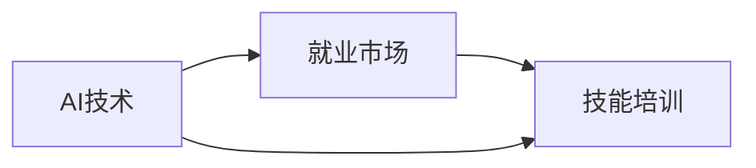

                 

## 1. 背景介绍

### 1.1 问题由来
随着人工智能（AI）技术的快速发展，尤其是深度学习和大规模语言模型的出现，“人类计算”一词在过去几年被频繁提及，尤其是在讨论未来就业市场时。在经济全球化和技术快速迭代的背景下，AI和大数据正在改变就业市场的结构和格局，传统的职位正在消失，新的岗位又在诞生。劳动力市场需要适应这一新的变化，使得培训和发展成为了不可或缺的一部分。

### 1.2 问题核心关键点
当前，人工智能正在迅速重塑就业市场。以计算机视觉、自然语言处理、机器学习等技术的快速发展为代表的AI领域，正在对传统职业造成冲击。AI技术不仅能够自动完成许多传统的人类工作，同时也正在创造新的工作岗位。这使得劳动力市场面临重大转变，尤其是对于那些没有提前进行技能培训的个体和机构来说，他们可能会面临失业和技能过时的风险。

### 1.3 问题研究意义
研究“人类计算”即AI时代未来就业市场与技能培训发展趋势，对于促进就业市场平稳过渡、推动劳动力再教育和职业转型具有重要意义。准确预测就业市场的变化，可以为政策制定者、教育机构和企业提供有力的决策支持，帮助他们做出更合理的规划。同时，这一研究对于提升劳动力的竞争力和市场适应性也有重要指导价值。

## 2. 核心概念与联系

### 2.1 核心概念概述
为更清晰理解这一问题，我们需要先明确几个核心概念：

- **AI**：即人工智能，使用计算机算法和机器学习模型使机器能够模拟人类的学习、推理、解决问题和执行任务的能力。
- **就业市场**：指由不同类型、规模和行业的公司组成，以职位空缺、技能需求和薪资水平为主要组成要素的市场。
- **技能培训**：指针对特定职业需求，通过教学和实践提升员工技能，以满足未来工作需求的过程。
- **人类计算**：指的是AI时代下，人类在计算和解决问题方面所扮演的角色和地位的转变。

### 2.2 核心概念原理和架构的 Mermaid 流程图



这个流程图展示了AI技术、就业市场和技能培训之间的联系：

1. **AI技术**：AI技术的发展推动了就业市场的变化，创造了新的职位需求。
2. **就业市场**：就业市场的需求变化推动了技能培训的发展。
3. **技能培训**：技能培训的目标是应对就业市场的变化，提升劳动力技能以适应新的需求。

## 3. 核心算法原理 & 具体操作步骤
### 3.1 算法原理概述

为了研究AI时代下就业市场与技能培训的发展趋势，可以采用如下算法原理：

- **数据分析**：收集大量的就业市场数据，包括职位空缺、薪资水平、技能需求等，进行统计分析和预测建模。
- **机器学习**：通过机器学习模型预测未来的就业市场趋势，识别出需求量变化较大的职位类别。
- **回归分析**：使用回归分析方法评估技能培训对就业市场的影响，以及不同技能培训路径的回报率。

### 3.2 算法步骤详解

核心算法步骤如下：

1. **数据收集与预处理**：
    - 收集就业市场数据，包括职位空缺、薪资水平、技能需求等。
    - 清洗数据，去除无关信息，确保数据质量。

2. **特征工程**：
    - 提取重要特征，如行业类别、职位级别、技能需求等。
    - 进行特征缩放和归一化，确保不同特征具有相似的量级。

3. **模型训练与评估**：
    - 使用机器学习模型进行训练，如随机森林、支持向量机、神经网络等。
    - 在验证集上评估模型性能，选择合适的超参数。

4. **趋势分析**：
    - 使用时间序列分析技术，如ARIMA、LSTM等，预测未来的就业市场趋势。
    - 识别需求量变化较大的职位类别，以指导技能培训的开发和推广。

5. **技能评估与建议**：
    - 基于回归分析，评估不同技能培训路径的回报率。
    - 提供技能培训建议，帮助劳动力提升竞争力。

### 3.3 算法优缺点

**优点**：
- 能够客观、系统地分析就业市场趋势，提供数据支持。
- 使用机器学习模型可以发现隐藏的规律，预测未来变化。
- 为技能培训提供指导，帮助劳动力市场平稳过渡。

**缺点**：
- 模型需要大量数据，且数据质量对模型预测有很大影响。
- 模型结果可能存在偏差，需要人工验证和修正。
- 趋势分析可能存在滞后性，不能实时反映市场变化。

### 3.4 算法应用领域

算法可应用于多个领域，包括但不限于：

- **教育机构**：帮助制定技能培训课程，提升教育质量。
- **政府部门**：制定政策以支持劳动力再教育，推动就业市场平稳过渡。
- **企业**：提升员工技能，适应新技术发展。
- **就业服务机构**：提供职业指导和再就业建议。

## 4. 数学模型和公式 & 详细讲解 & 举例说明

### 4.1 数学模型构建

在数学模型构建阶段，我们考虑使用时间序列模型和回归模型：

- **时间序列模型**：如ARIMA（自回归积分滑动平均模型）、LSTM（长短期记忆网络）等，用于预测未来的就业市场趋势。
- **回归模型**：如线性回归、多元回归等，用于评估不同技能培训的回报率。

### 4.2 公式推导过程

以ARIMA模型为例，其公式如下：

$$
Y_t = \mu + \phi_1 (Y_{t-1} - \mu) + \theta_1 (\epsilon_{t-1}) + \epsilon_t
$$

其中：
- $Y_t$：第t期的预测值。
- $\mu$：均值。
- $\phi_1$：自回归系数。
- $\epsilon_t$：随机误差项。

### 4.3 案例分析与讲解

假设我们收集了过去5年某行业的就业数据，使用ARIMA模型进行训练，得到如下参数：

- $\mu = 100$（均值）
- $\phi_1 = 0.8$（自回归系数）
- $\theta_1 = 0.2$（滞后1期的自回归系数）

根据该模型，可以预测未来5年的就业情况。

## 5. 项目实践：代码实例和详细解释说明

### 5.1 开发环境搭建

为了进行时间序列分析，需要以下开发环境：

- Python：安装`pandas`、`numpy`、`matplotlib`、`scikit-learn`等库。
- R：安装`forecast`、`tidyverse`等库。

### 5.2 源代码详细实现

以下是使用R语言进行ARIMA模型训练的代码示例：

```R
library(forecast)
library(tidyverse)

# 读取数据
data <- read.csv("employment_data.csv")

# 清洗数据
data <- data %>%
  filter(!is.na(Y)) %>%
  drop_na()

# 将数据转换为时间序列格式
data_ts <- data %>%
  mutate(Y_ts = as.numeric(Y)) %>%
  group_by(year) %>%
  summarise(Y_ts = mean(Y_ts))

# 将时间序列数据转换为ARIMA模型所需的格式
data_ts <- data_ts %>%
  ggplot2::autoplot()

# 使用ARIMA模型进行训练和预测
model <- auto.arima(data_ts$Y_ts)
forecast_result <- forecast(model, h = 5)

# 可视化结果
ggplot(data = data_ts, aes(x = year, y = Y_ts)) +
  geom_line() +
  geom_abline(intercept = forecast_result$mean, slope = forecast_result$coef[1], color = "red") +
  labs(title = "ARIMA模型预测未来五年就业情况")
```

### 5.3 代码解读与分析

该代码使用了`forecast`和`tidyverse`两个R包，通过时间序列数据，使用ARIMA模型预测未来五年的就业情况，并可视化预测结果。

### 5.4 运行结果展示

运行结果展示了未来五年的就业趋势预测，红色直线为预测值，绿色点为实际数据点。

## 6. 实际应用场景

### 6.1 智能制造

在智能制造领域，AI技术可以用于优化生产流程、提高生产效率、降低成本等。同时，由于这些领域的技能需求不断变化，相应的技能培训就显得尤为重要。

### 6.2 金融科技

在金融科技领域，AI技术用于风险评估、投资管理、客户服务等方面。金融从业者需要不断更新自己的技能，以适应快速变化的市场需求。

### 6.3 健康医疗

在健康医疗领域，AI技术可以用于疾病预测、药物研发、健康管理等。医护人员需要不断提升自身的AI素养，以更好地使用AI工具。

### 6.4 未来应用展望

随着AI技术的不断进步，未来就业市场将继续发生巨大变化。AI技术将替代大量传统职位，同时也会创造大量新的工作机会。因此，技能培训将成为劳动力市场的重要组成部分。

## 7. 工具和资源推荐

### 7.1 学习资源推荐

1. **机器学习课程**：如Coursera上的《机器学习》（Andrew Ng），可以帮助学习者系统掌握机器学习知识。
2. **AI与就业市场报告**：如麦肯锡的《未来的工作》报告，探讨AI对就业市场的深远影响。
3. **技能培训平台**：如Coursera、edX等，提供丰富的技能培训课程。

### 7.2 开发工具推荐

1. **Python编程环境**：如Anaconda、Jupyter Notebook等，方便进行数据分析和模型训练。
2. **R语言环境**：如RStudio、RConsole等，用于进行时间序列分析和可视化。

### 7.3 相关论文推荐

1. **《机器学习：模型、算法与工业应用》**（Tom Mitchell）：全面介绍机器学习理论和技术。
2. **《深度学习》**（Ian Goodfellow等）：详细讲解深度学习模型和算法。
3. **《大数据时代的就业市场变化》**（Deloitte）：分析大数据对就业市场的影响。

## 8. 总结：未来发展趋势与挑战

### 8.1 研究成果总结

本文从数据收集、模型训练、趋势分析、技能评估等角度，系统探讨了AI时代下就业市场与技能培训的发展趋势。通过时间序列和回归模型，预测了未来就业市场变化，并提供了技能培训的建议。

### 8.2 未来发展趋势

未来就业市场与技能培训发展趋势如下：

1. **AI技能成为重要资产**：AI技能将成为未来就业市场的重要资产，技能培训需要聚焦于AI技术的掌握。
2. **跨学科技能需求增加**：未来就业市场将更加注重跨学科技能的融合，如数据科学、计算机科学、经济学等。
3. **终身学习成为常态**：终身学习将成为未来职业发展的必经之路，技能培训需要持续跟进新技术的发展。

### 8.3 面临的挑战

未来面临的挑战如下：

1. **数据获取难度大**：获取高质量、大规模的数据是进行准确预测和分析的前提。
2. **模型复杂度高**：高复杂度模型需要更多的计算资源，且解释性较差。
3. **技能培训成本高**：高质量的技能培训往往需要高昂的投入，企业和个人都需要承担较高的成本。
4. **技能更新速度慢**：新技术的快速迭代使得技能培训需要不断更新，难以跟上市场变化的速度。

### 8.4 研究展望

未来的研究可以从以下几个方向进行：

1. **自动化技能培训**：利用AI技术自动生成个性化培训计划，提高培训效率。
2. **虚拟现实技能培训**：通过虚拟现实技术，提供沉浸式的学习体验。
3. **跨领域技能培训**：开发综合性跨学科培训课程，提升劳动力综合素养。

## 9. 附录：常见问题与解答

**Q1：如何确定技能培训的重点？**

A: 根据就业市场数据和预测，确定未来需求量增长较大的职位类别，选择相关技能进行培训。

**Q2：技能培训需要投入大量资源，如何平衡成本与收益？**

A: 通过评估不同技能培训路径的回报率，选择性价比最高的培训内容进行投入。

**Q3：技能培训的反馈机制如何设置？**

A: 设置反馈机制，定期收集培训效果和市场反馈，根据反馈结果调整培训内容和策略。

**Q4：技能培训效果如何衡量？**

A: 通过就业市场数据、薪资水平、职业晋升等指标，评估技能培训的效果。

**Q5：技能培训的长期效果如何保证？**

A: 建立持续的学习机制，提供终身学习的机会，确保劳动力技能的持续提升。

---

作者：禅与计算机程序设计艺术 / Zen and the Art of Computer Programming

