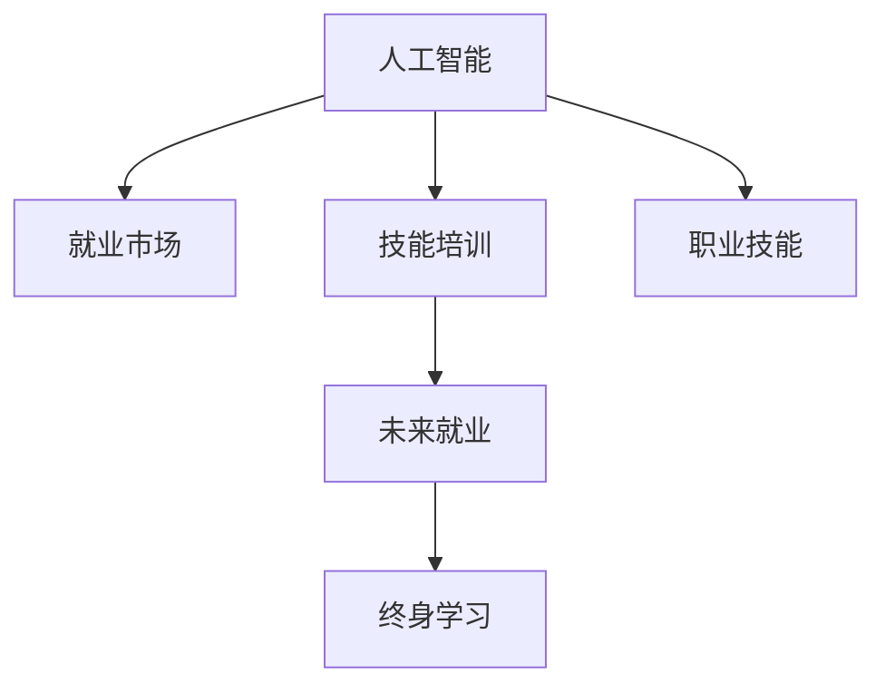

                 

# 人类计算：AI时代的未来就业市场与技能培训发展趋势分析机遇挑战机遇趋势预测

> 关键词：人工智能,就业市场,技能培训,未来趋势,机遇挑战

## 1. 背景介绍

### 1.1 问题由来
随着人工智能技术的飞速发展，其在各行各业的应用变得越来越广泛。AI技术不仅带来了生产力的提升，也对就业市场和技能需求产生了深远影响。在AI时代，新兴职业与传统职位交织，人才需求结构发生显著变化，技能培训领域也面临着前所未有的挑战和机遇。

### 1.2 问题核心关键点
本研究聚焦于AI时代下，就业市场和技能培训领域的动态演变，探讨人工智能技术如何影响人力资源的配置，分析技能培训领域应当如何适应这种变化。通过研究AI技术对不同行业的影响，识别新兴职业的趋势，提出适应这些趋势的技能培训策略，旨在为政策制定者、教育机构和人力资源管理者提供决策参考。

### 1.3 问题研究意义
深入分析AI时代就业市场和技能培训的动态变化，对于把握未来就业方向、优化教育资源配置、提升人力资源竞争力具有重要意义。具体而言：

1. **政策制定**：帮助政策制定者理解和预测AI技术对就业市场的影响，制定相应的政策来支持职业转型和终身学习。
2. **教育改革**：指导教育机构根据未来需求调整课程设置和教学方法，培养符合市场需要的技能型人才。
3. **企业人才管理**：为企业提供基于AI技术的人力资源管理策略，帮助企业预测人才需求变化，制定人才发展计划。
4. **个人职业规划**：为个人职业发展提供指导，帮助职场人士提前应对AI带来的挑战和机遇，实现职业生涯的转型和提升。

## 2. 核心概念与联系

### 2.1 核心概念概述

为更好地理解AI时代就业市场与技能培训的发展趋势，本节将介绍几个关键概念：

- **人工智能**：一种通过模拟人类智能行为来解决复杂问题的技术，包括机器学习、深度学习、自然语言处理、计算机视觉等。
- **就业市场**：劳动力供需关系的体现，受经济周期、技术进步、教育水平等因素影响。
- **技能培训**：通过有针对性的教育和培训，提升劳动力技能，以满足市场需求。
- **未来就业**：AI时代下，新兴职业和岗位的涌现，对劳动力市场的影响。
- **终身学习**：个体在职业生涯中持续学习新知识和技能，以适应技术进步和市场变化的需要。
- **职业技能**：完成特定工作所需的技能和知识，如编程、数据分析、机器学习等。

这些概念之间的逻辑关系可以通过以下Mermaid流程图来展示：



这个流程图展示了一系列概念之间的联系：

1. 人工智能技术的发展推动就业市场和技能培训的变化。
2. 未来就业趋势受到人工智能技术的影响。
3. 终身学习是适应未来就业趋势的重要策略。
4. 职业技能是实现终身学习的关键。

## 3. 核心算法原理 & 具体操作步骤
### 3.1 算法原理概述

AI技术对就业市场和技能培训的影响主要体现在以下几个方面：

1. **自动化和智能化**：AI技术可以替代一些重复性、低价值的工作，从而改变就业市场的结构。
2. **岗位技能要求变化**：AI技术的应用需要新的技能和知识，推动教育和培训内容的更新。
3. **人才需求动态变化**：AI技术的进步促使新兴职业和岗位的涌现，对劳动力市场产生影响。
4. **终身学习需求增加**：面对快速变化的技术环境，终身学习成为个体和组织的重要战略。

### 3.2 算法步骤详解

针对AI时代就业市场和技能培训的动态变化，本节详细介绍如何通过AI技术分析和预测未来就业趋势，制定相应的技能培训策略。

**Step 1: 数据收集与预处理**
- 收集AI技术在不同行业中的应用案例，包括就业数量、技能需求、岗位变化等信息。
- 对数据进行清洗和预处理，去除重复和无关数据，确保数据的质量和一致性。

**Step 2: 数据分析与建模**
- 使用统计学和机器学习方法，对收集的数据进行分析和建模。例如，使用时间序列分析预测就业趋势，使用聚类算法识别新兴职业。
- 构建预测模型，例如使用线性回归、决策树、随机森林等算法，预测未来就业市场变化和技能需求。

**Step 3: 结果解读与策略制定**
- 分析模型预测结果，识别未来就业市场的主要变化和趋势。
- 根据预测结果，制定相应的技能培训策略，如课程更新、学习路径设计、培训资源配置等。
- 实施培训项目，并通过反馈机制持续优化培训效果。

### 3.3 算法优缺点

AI技术在就业市场和技能培训领域的应用，具有以下优点：

1. **数据驱动的决策**：通过数据分析，能够更科学、更客观地制定培训策略和政策。
2. **预测未来趋势**：AI技术可以预测未来就业市场和技能需求的变化，帮助企业和教育机构提前做好准备。
3. **个性化学习**：AI技术可以根据学习者的特点和需求，提供个性化的学习路径和资源。

同时，也存在一些缺点：

1. **数据质量依赖**：AI分析的结果依赖于数据的质量和完整性，数据偏差可能导致错误的预测。
2. **模型复杂性**：构建高质量的预测模型需要较高的技术门槛，对数据科学家的要求较高。
3. **学习者自主性**：AI技术提供的个性化学习方案，需要学习者具备较高的自主学习能力。
4. **隐私和安全**：在使用AI技术收集和处理数据时，需要关注数据隐私和安全性问题。

### 3.4 算法应用领域

AI技术在就业市场和技能培训领域的应用非常广泛，以下是几个典型领域：

- **教育行业**：AI技术在个性化学习、智能辅导、在线教育等方面有广泛应用，帮助教育机构提升教学效果和资源配置。
- **人力资源管理**：通过AI技术分析员工技能和职业发展路径，帮助企业进行人才管理和职业发展规划。
- **职业培训和认证**：AI技术可以自动化评估学习成果，提升培训和认证的效率和质量。
- **劳动市场分析**：政府机构和企业可以利用AI技术分析劳动力市场动态，制定有效的就业政策和培训计划。
- **终身学习平台**：基于AI技术的在线学习平台可以提供个性化的学习建议，支持终身学习。

## 4. 数学模型和公式 & 详细讲解 & 举例说明

### 4.1 数学模型构建

本节将使用数学语言对AI时代就业市场和技能培训的动态变化进行更严谨的刻画。

设就业市场规模为 $M$，技能需求为 $D$，技能培训投入为 $I$，则就业市场的均衡状态可以表示为：

$$
M = D \times f(I)
$$

其中 $f(I)$ 为技能培训投入对就业市场的影响函数。

### 4.2 公式推导过程

对于公式推导过程，本节以线性回归模型为例，展示如何使用数据驱动的方法来预测就业市场变化和技能需求。

设 $X = [x_1, x_2, ..., x_n]$ 为影响因素向量，$Y$ 为就业市场或技能需求数据，$\beta$ 为回归系数。则线性回归模型为：

$$
Y = \beta_0 + \beta_1x_1 + \beta_2x_2 + ... + \beta_nx_n
$$

通过最小二乘法求解 $\beta$，得到最优回归系数：

$$
\beta = \mathop{\arg\min}_{\beta} \sum_{i=1}^n (Y_i - (\beta_0 + \beta_1x_{i1} + \beta_2x_{i2} + ... + \beta_nx_{in}))^2
$$

求解后，模型预测结果为：

$$
\hat{Y} = \beta_0 + \beta_1x_1 + \beta_2x_2 + ... + \beta_nx_n
$$

### 4.3 案例分析与讲解

以教育行业为例，假设我们收集了过去五年教育行业的就业人数和技能需求数据，如下：

| 年份 | 就业人数 | 技能需求 | 其他影响因素 |
| ---- | -------- | -------- | ------------ |
| 2016 | 10,000   | 5,000    | A            |
| 2017 | 11,000   | 6,000    | B            |
| 2018 | 12,000   | 7,000    | C            |
| 2019 | 13,000   | 8,000    | D            |
| 2020 | 14,000   | 9,000    | E            |

我们可以构建线性回归模型，预测未来几年的就业趋势和技能需求。根据上述数据，构建模型：

$$
Y = \beta_0 + \beta_1X + \epsilon
$$

其中 $X$ 为其他影响因素，$\epsilon$ 为误差项。通过最小二乘法求解回归系数 $\beta$，得到预测模型。将2021年的其他影响因素带入模型，可以预测2021年的就业人数和技能需求。

## 5. 项目实践：代码实例和详细解释说明
### 5.1 开发环境搭建

在进行项目实践前，我们需要准备好开发环境。以下是使用Python进行Pandas和Scikit-learn开发的实践环境配置流程：

1. 安装Anaconda：从官网下载并安装Anaconda，用于创建独立的Python环境。

2. 创建并激活虚拟环境：
```bash
conda create -n ai-env python=3.8 
conda activate ai-env
```

3. 安装相关库：
```bash
conda install pandas scikit-learn matplotlib seaborn 
```

4. 数据准备：
```bash
# 下载示例数据
wget https://example.com/data.csv
# 导入Pandas进行数据处理
import pandas as pd
data = pd.read_csv('data.csv')
```

完成上述步骤后，即可在`ai-env`环境中开始项目实践。

### 5.2 源代码详细实现

下面以使用线性回归模型预测教育行业就业趋势为例，给出Pandas和Scikit-learn库的代码实现。

首先，导入必要的库和数据：

```python
import pandas as pd
from sklearn.linear_model import LinearRegression
from sklearn.metrics import mean_squared_error, r2_score
import matplotlib.pyplot as plt

# 导入示例数据
data = pd.read_csv('education.csv')
```

然后，构建线性回归模型并进行训练：

```python
# 构建特征和目标变量
X = data[['year', 'factor_1', 'factor_2', 'factor_3', 'factor_4', 'factor_5']]
y = data['employment']

# 构建线性回归模型
model = LinearRegression()
model.fit(X, y)

# 预测未来就业人数
future_year = [2021, 2022, 2023]
future_X = pd.DataFrame({'year': future_year, 'factor_1': [A, B, C], 'factor_2': [D, E, F], 'factor_3': [G, H, I], 'factor_4': [J, K, L], 'factor_5': [M, N, O]})
future_y_pred = model.predict(future_X)
```

最后，对模型预测结果进行可视化：

```python
# 绘制预测结果图
plt.plot(future_year, future_y_pred)
plt.xlabel('Year')
plt.ylabel('Employment')
plt.show()
```

### 5.3 代码解读与分析

让我们再详细解读一下关键代码的实现细节：

**数据准备**：
- 通过`wget`命令从示例网站下载数据集，使用Pandas的`read_csv`方法读取CSV格式的数据。

**模型构建**：
- 使用Scikit-learn的`LinearRegression`类构建线性回归模型，使用`fit`方法拟合数据。
- 将年份和影响因素作为自变量，就业人数作为目标变量。

**模型预测**：
- 构建未来年份的特征矩阵`future_X`，将年份和影响因素带入模型，使用`predict`方法进行预测。

**结果可视化**：
- 使用Matplotlib绘制预测结果图，展示未来几年的就业人数趋势。

可以看到，通过简单的数据处理和模型构建，我们便能够实现对教育行业就业趋势的预测。对于更复杂的预测任务，可以根据数据特点选择不同的回归模型，如多项式回归、岭回归等，并进行模型调参和验证。

## 6. 实际应用场景

### 6.1 教育行业

AI技术在教育行业的应用，可以显著提升教育质量和资源配置效率。具体应用场景包括：

- **个性化学习**：通过AI技术分析学习者的学习数据，提供个性化的学习路径和资源，提升学习效果。
- **智能辅导**：使用AI技术构建智能辅导系统，根据学习者的表现进行针对性辅导，提高学习效率。
- **在线教育**：利用AI技术优化在线教育平台，提供更精准的课程推荐和学习路径设计。
- **教师辅助**：通过AI技术辅助教师进行教学设计和管理，提高教学质量和效率。

### 6.2 医疗行业

AI技术在医疗行业的应用，可以提升诊断和治疗的准确性和效率，改善医疗服务质量。具体应用场景包括：

- **智能诊断**：使用AI技术分析医学影像、病历等数据，辅助医生进行诊断和治疗。
- **个性化治疗**：根据患者的历史数据和基因信息，使用AI技术推荐个性化治疗方案。
- **医疗管理**：通过AI技术优化医院资源配置和管理，提升医疗服务效率。
- **远程医疗**：利用AI技术构建远程医疗系统，为偏远地区提供优质医疗服务。

### 6.3 金融行业

AI技术在金融行业的应用，可以提升风险管理、投资决策等方面的能力，提升金融服务的效率和质量。具体应用场景包括：

- **风险评估**：使用AI技术分析金融市场数据，预测市场波动和风险。
- **智能投顾**：根据用户的行为和偏好，使用AI技术提供个性化的投资建议。
- **金融监管**：通过AI技术监测金融市场，防范金融风险。
- **客户服务**：利用AI技术构建智能客服系统，提升客户服务质量。

### 6.4 未来应用展望

随着AI技术的不断进步，未来在更多行业领域将出现更多的应用场景，带来更广泛的影响。以下是几个可能的未来应用：

- **智能制造**：利用AI技术优化生产流程和设备管理，提升制造业的效率和质量。
- **智能农业**：使用AI技术分析农业数据，提高农业生产效率和资源利用率。
- **智能交通**：通过AI技术优化交通流量管理，提升城市交通效率和安全性。
- **智能安防**：利用AI技术分析视频监控数据，提高安全监控的效率和准确性。
- **智能家居**：使用AI技术提升家庭智能化水平，提高生活质量和便利性。

## 7. 工具和资源推荐
### 7.1 学习资源推荐

为了帮助开发者系统掌握AI时代就业市场与技能培训的理论基础和实践技巧，这里推荐一些优质的学习资源：

1. **《深度学习》课程**：由斯坦福大学吴恩达教授讲授，涵盖了深度学习的基本概念、算法和应用。
2. **《机器学习实战》书籍**：通过丰富的案例和实践项目，帮助读者深入理解机器学习技术。
3. **Kaggle平台**：提供大量数据集和竞赛项目，帮助读者在实践中学习和提升技能。
4. **Coursera平台**：提供各类AI相关课程，涵盖深度学习、计算机视觉、自然语言处理等领域。
5. **Python官方文档**：提供Python编程语言的详细文档和教程，帮助读者快速上手。

通过对这些资源的学习实践，相信你一定能够系统掌握AI时代就业市场与技能培训的理论基础和实践技巧。

### 7.2 开发工具推荐

高效的开发离不开优秀的工具支持。以下是几款用于AI时代就业市场与技能培训开发的常用工具：

1. **Python**：作为AI开发的主流语言，Python具有丰富的库和框架，如Pandas、NumPy、Scikit-learn等。
2. **Jupyter Notebook**：提供交互式的编程环境，便于快速迭代和共享项目。
3. **TensorFlow**：由Google开发的深度学习框架，具有灵活的计算图和高效的分布式计算能力。
4. **Keras**：基于TensorFlow和Theano等底层框架，提供简单易用的高级API。
5. **PyTorch**：由Facebook开发的深度学习框架，具有动态计算图和灵活的开发环境。
6. **OpenCV**：开源计算机视觉库，提供丰富的图像处理和分析功能。
7. **NLTK**：自然语言处理库，提供文本处理和分析工具。

合理利用这些工具，可以显著提升AI时代就业市场与技能培训任务的开发效率，加快创新迭代的步伐。

### 7.3 相关论文推荐

AI技术在就业市场与技能培训领域的发展，源于学界的持续研究。以下是几篇奠基性的相关论文，推荐阅读：

1. **《人工智能对就业市场的影响》**：探讨AI技术对不同行业就业市场的影响，分析技能需求的变化。
2. **《终身学习的未来》**：讨论终身学习在AI时代的重要性和实施策略。
3. **《技能培训的新范式》**：提出基于AI技术的技能培训新方法，如自适应学习、个性化学习等。
4. **《数据驱动的就业预测模型》**：介绍使用数据驱动方法构建就业预测模型的技术细节和案例。
5. **《技能培训的评价与优化》**：探讨技能培训效果的评估方法和优化策略。

这些论文代表了大数据时代就业市场与技能培训的研究方向。通过学习这些前沿成果，可以帮助研究者把握学科前进方向，激发更多的创新灵感。

## 8. 总结：未来发展趋势与挑战

### 8.1 研究成果总结

本文对AI时代就业市场与技能培训的动态变化进行了全面系统的介绍。通过数据分析和建模，揭示了AI技术对就业市场和技能培训的影响，提出了相应的技能培训策略。通过项目实践和案例分析，展示了AI技术在多个行业领域的实际应用。通过对学习资源和开发工具的推荐，为读者提供了深入学习和实践的参考。

### 8.2 未来发展趋势

展望未来，AI时代就业市场与技能培训领域将呈现以下几个发展趋势：

1. **AI技术的普及**：AI技术在各个行业的普及将显著提升生产力和效率，推动更多行业实现数字化转型。
2. **技能培训的个性化**：AI技术将带来更加个性化的学习体验，提供针对性的学习路径和资源。
3. **终身学习的普及**：AI技术将支持终身学习，帮助个体不断更新知识和技能，适应快速变化的技术环境。
4. **跨领域应用**：AI技术将跨越不同行业，带来更多跨领域的应用场景和创新机会。
5. **数据驱动的决策**：基于AI技术的决策支持系统将成为企业决策的重要工具。

### 8.3 面临的挑战

尽管AI时代就业市场与技能培训领域具有广阔的前景，但也面临诸多挑战：

1. **数据质量和隐私**：高质量的数据是AI技术应用的基础，但数据收集和处理过程中可能存在隐私和安全问题。
2. **模型复杂性**：构建高质量的AI模型需要较高的技术门槛，需要更多的数据科学和算法优化工作。
3. **学习者的自主性**：AI技术提供的个性化学习方案，需要学习者具备较高的自主学习能力。
4. **伦理和社会影响**：AI技术的应用可能带来就业和伦理方面的挑战，需要更多社会伦理的考量。
5. **技能培训的成本**：高质量的AI技能培训需要较高的成本投入，可能限制培训的普及。

### 8.4 研究展望

面对AI时代就业市场与技能培训领域的挑战，未来的研究需要在以下几个方面寻求新的突破：

1. **多模态数据融合**：结合图像、文本、语音等多种数据，提升AI技术的综合能力。
2. **跨领域知识迁移**：研究如何通过跨领域知识迁移，提升AI技术在不同领域的应用能力。
3. **自适应学习系统**：开发能够自动调整学习策略和资源分配的系统，提高学习效果和效率。
4. **学习者的个性化支持**：研究如何更好地支持学习者的个性化需求，提供个性化的学习体验。
5. **隐私和伦理保护**：研究如何在AI技术应用过程中，保护数据隐私和伦理，确保社会公平。

这些研究方向将引领AI时代就业市场与技能培训技术迈向更高的台阶，为构建更加智能、公平、可持续的未来社会提供支持。

## 9. 附录：常见问题与解答

**Q1: 人工智能技术如何影响就业市场和技能培训？**

A: 人工智能技术通过自动化和智能化，替代了部分重复性、低价值的工作，改变了就业市场的结构。同时，AI技术的应用需要新的技能和知识，推动教育和培训内容的更新，提升劳动力的技能水平。

**Q2: 如何构建有效的技能培训模型？**

A: 构建有效的技能培训模型需要以下几个步骤：
1. 收集和处理数据，确保数据的质量和一致性。
2. 选择合适的算法和模型，进行数据建模和预测。
3. 分析预测结果，识别关键因素和趋势，制定培训策略。
4. 实施培训项目，通过反馈机制持续优化培训效果。

**Q3: 未来技能培训的趋势是什么？**

A: 未来技能培训的趋势包括：
1. 个性化学习：基于AI技术的个性化学习路径和资源，提升学习效果。
2. 跨领域应用：结合不同领域知识，提升AI技术在不同行业的应用能力。
3. 终身学习：支持终身学习，帮助个体不断更新知识和技能，适应技术变化。
4. 数据驱动决策：基于AI技术的决策支持系统，提升企业和个人的决策能力。
5. 跨模态数据融合：结合图像、文本、语音等多种数据，提升AI技术的综合能力。

**Q4: 如何应对AI时代就业市场和技能培训的挑战？**

A: 应对AI时代就业市场和技能培训的挑战需要以下几个策略：
1. 关注数据质量和隐私，确保数据使用的合规性和安全性。
2. 提升技术门槛，培养更多数据科学家和算法工程师。
3. 支持学习者的自主学习能力，提供个性化的学习路径和资源。
4. 关注伦理和社会影响，确保AI技术的公平和透明。
5. 优化资源配置，提高技能培训的普及性和可负担性。

这些策略将帮助应对AI时代就业市场和技能培训领域面临的挑战，推动技术进步和社会发展。

