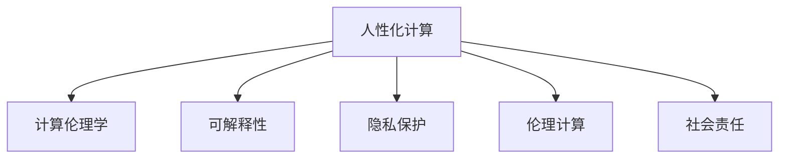

                 

## 1. 背景介绍

### 1.1 问题由来
随着计算技术的飞速发展，我们已经进入了“智能时代”。人工智能、大数据、物联网等技术正在深刻改变我们的生产和生活方式。然而，在享受这些技术带来的便利的同时，我们也遇到了新的挑战：信息过载、隐私保护、技术失控等问题的日益凸显。这些问题并非科技本身带来的，而是在科技应用的数字化转型过程中产生的。我们需要重新思考人类与计算技术的关系，以创造出更加人性化的未来。

### 1.2 问题核心关键点
我们需要重新审视人类计算，即人类如何通过计算技术来提升生活质量和生产效率。目前，人类计算的主要模式是“数据驱动”，即通过数据分析来做出决策和预测。这种模式虽然在某种程度上提高了效率，但也导致了信息过载和隐私问题。为了解决这些问题，我们提出了“人性化计算”的概念，即通过计算技术来辅助人类进行更加人性化的决策，而不是被数据所驱动。

### 1.3 问题研究意义
人性化计算的提出，将从根本上改变人类与计算技术的关系，提升人类的生活质量和生产效率。它将计算技术与人类情感、伦理、道德等价值观相结合，让计算技术真正服务于人类。人性化计算将成为未来科技发展的重要方向，具有深远的社会和经济意义。

## 2. 核心概念与联系

### 2.1 核心概念概述

为更好地理解人性化计算，本节将介绍几个密切相关的核心概念：

- **人性化计算(Human-Centric Computing)**：通过计算技术辅助人类进行更加人性化的决策，提升生活质量和生产效率。它关注人类情感、伦理、道德等价值观，让计算技术真正服务于人类。
- **计算伦理学(Computational Ethics)**：研究计算技术在伦理、道德层面的应用，保障技术的正向社会影响。
- **可解释性(Explainability)**：计算模型的决策过程可解释，用户能够理解其工作原理和逻辑。
- **隐私保护(Privacy Protection)**：通过技术手段保障用户数据的隐私和安全。
- **伦理计算(Ethical Computing)**：计算技术在设计和应用中融入伦理、道德等价值观，保障技术的公正性和可信度。
- **社会责任(Social Responsibility)**：计算技术在实际应用中应当考虑社会责任，保障技术对社会的有益影响。

这些核心概念之间的逻辑关系可以通过以下Mermaid流程图来展示：



这个流程图展示了自己人性化计算的核心概念及其之间的关系：

1. 人性化计算通过计算技术辅助人类进行更加人性化的决策，提升生活质量和生产效率。
2. 计算伦理学研究计算技术在伦理、道德层面的应用，保障技术的正向社会影响。
3. 可解释性关注计算模型的决策过程可解释，用户能够理解其工作原理和逻辑。
4. 隐私保护通过技术手段保障用户数据的隐私和安全。
5. 伦理计算将伦理、道德等价值观融入计算技术的设计和应用中，保障技术的公正性和可信度。
6. 社会责任在实际应用中考虑计算技术对社会的益处，保障技术对社会的有益影响。

这些概念共同构成了人性化计算的理论基础，帮助我们从伦理、道德、隐私等角度，设计出更加人性化的计算技术。

## 3. 核心算法原理 & 具体操作步骤

### 3.1 算法原理概述

人性化计算的核心在于通过计算技术辅助人类进行更加人性化的决策。其核心思想是：在计算模型的设计和应用中，融入人类情感、伦理、道德等价值观，让计算技术真正服务于人类。

形式化地，假设输入为 $x$，输出为 $y$，计算模型为 $f$，则人性化计算的目标是最小化模型的偏差，同时最大化模型的公平性和透明性。即：

$$
\min_{f} \{bias(f), fairness(f), transparency(f)\}
$$

其中 $bias(f)$ 为模型的偏差度量，$fairness(f)$ 为模型的公平性度量，$transparency(f)$ 为模型的透明度度量。

### 3.2 算法步骤详解

人性化计算的设计和应用一般包括以下几个关键步骤：

**Step 1: 确定人性化目标**
- 明确人性化计算的具体目标，如提升生活质量、优化生产效率等。
- 确定人性化的具体指标，如用户满意度、决策公平性等。

**Step 2: 设计计算模型**
- 根据人性化目标，设计适合的计算模型，如决策树、神经网络等。
- 融入人类情感、伦理、道德等价值观，设计模型的训练和优化过程。

**Step 3: 收集数据和标注**
- 收集与人性化目标相关的数据，如用户行为、社会经济数据等。
- 对数据进行标注和清洗，去除噪音和偏差。

**Step 4: 模型训练和评估**
- 在收集的数据上，使用监督学习等方法训练计算模型。
- 在目标数据集上评估模型的性能，如精确度、召回率、公平性等。

**Step 5: 模型部署和优化**
- 将训练好的模型部署到实际应用中，如智能家居、医疗等场景。
- 持续优化模型，如调整参数、引入正则化等，提升模型的性能。

### 3.3 算法优缺点

人性化计算具有以下优点：
1. 提升生活质量和生产效率。通过计算技术辅助人类进行决策，提升生活质量和生产效率。
2. 融入人类价值观。将人类情感、伦理、道德等价值观融入计算技术的设计和应用中，保障技术的正向社会影响。
3. 提升公平性和透明度。通过设计透明的计算模型，提升模型的公平性和透明度，增强用户信任。

同时，人性化计算也存在一定的局限性：
1. 技术成本高。计算模型的设计和应用需要高成本的计算资源和数据。
2. 模型复杂度高。人性化计算模型的设计比传统模型复杂度高，需要更多的数据和计算资源。
3. 应用场景有限。人性化计算在某些特定场景中，如医疗、金融等，可能难以应用。

尽管存在这些局限性，但人性化计算仍是目前解决人性化问题的有效途径。未来相关研究的重点在于如何进一步降低技术成本，提高模型应用的可扩展性和灵活性。

### 3.4 算法应用领域

人性化计算在众多领域中已经得到了广泛应用，包括但不限于：

- 智能家居：通过计算技术辅助家庭决策，提升生活质量。
- 医疗健康：利用计算模型进行疾病预测和治疗方案优化，提升医疗服务质量。
- 智能城市：通过计算技术优化城市管理，提升城市运行效率和居民幸福感。
- 智能金融：通过计算模型优化金融决策，提升金融服务的公平性和透明性。
- 教育培训：利用计算技术提升教育效果，提供个性化学习方案。

除了上述这些领域，人性化计算还被应用于更多场景中，如智能交通、智慧物流等，为社会数字化转型提供了新的动力。随着技术的不断进步，人性化计算必将在更多领域得到应用，为人类生活带来更深刻的改变。

## 4. 数学模型和公式 & 详细讲解  
### 4.1 数学模型构建

人性化计算的核心是计算模型。假设输入为 $x$，输出为 $y$，计算模型为 $f$，则人性化计算的目标是最大化模型的公平性和透明度。

定义模型的偏差度量为 $bias(f) = \sum_{i=1}^n |y_i - f(x_i)|$，其中 $y_i$ 为真实标签，$f(x_i)$ 为模型预测结果。模型的公平性度量可以通过公平指标来衡量，如准确率公平、召回率公平等。模型的透明度可以通过可解释性来衡量，如LIME、SHAP等。

人性化计算的目标可以表示为：

$$
\min_{f} \{bias(f), fairness(f), transparency(f)\}
$$

### 4.2 公式推导过程

以下我们以准确率公平性为例，推导公平指标的计算公式。

假设在二分类问题中，模型对样本的预测概率为 $p(x_i, y_i)$，其中 $y_i$ 为真实标签。令 $T_{pos}$ 和 $T_{neg}$ 分别为正负样本的真实数量，$F_{pos}$ 和 $F_{neg}$ 分别为正负样本的预测数量。则准确率公平性度量为：

$$
fairness(f) = \frac{T_{pos} \cdot F_{neg} + T_{neg} \cdot F_{pos}}{T_{pos} \cdot F_{pos} + T_{neg} \cdot F_{neg}}
$$

通过上述公式，我们可以计算模型的公平性指标，并对其进行优化，使得模型在不同群体中的表现公平。

### 4.3 案例分析与讲解

下面以智能家居为例，介绍人性化计算的应用。

智能家居系统通过计算模型辅助用户进行家居控制和决策，提升生活质量和生产效率。例如，智能音箱可以通过语音识别和自然语言处理技术，将用户的指令转化为具体的操作命令，实现对家电设备的控制。计算模型需要融入人类情感、伦理、道德等价值观，设计模型的训练和优化过程。

在智能音箱的设计中，我们可以使用注意力机制和 Transformer 模型进行语音识别，并结合情感分析和伦理推理模块进行决策。模型需要学习用户的情感状态，如喜怒哀乐等，并通过伦理推理模块进行决策。例如，当用户情绪低落时，智能音箱可以主动提供心理支持，而不是简单执行用户的指令。

## 5. 项目实践：代码实例和详细解释说明
### 5.1 开发环境搭建

在进行人性化计算实践前，我们需要准备好开发环境。以下是使用Python进行PyTorch开发的环境配置流程：

1. 安装Anaconda：从官网下载并安装Anaconda，用于创建独立的Python环境。

2. 创建并激活虚拟环境：
```bash
conda create -n human-centric-env python=3.8 
conda activate human-centric-env
```

3. 安装PyTorch：根据CUDA版本，从官网获取对应的安装命令。例如：
```bash
conda install pytorch torchvision torchaudio cudatoolkit=11.1 -c pytorch -c conda-forge
```

4. 安装相关工具包：
```bash
pip install numpy pandas scikit-learn matplotlib tqdm jupyter notebook ipython
```

5. 安装HuggingFace库：
```bash
pip install transformers
```

完成上述步骤后，即可在`human-centric-env`环境中开始人性化计算实践。

### 5.2 源代码详细实现

下面我们以智能家居的情感分析任务为例，给出使用Transformers库进行人性化计算的PyTorch代码实现。

首先，定义情感分析任务的数据处理函数：

```python
from transformers import BertTokenizer
from torch.utils.data import Dataset
import torch

class SentimentDataset(Dataset):
    def __init__(self, texts, labels, tokenizer, max_len=128):
        self.texts = texts
        self.labels = labels
        self.tokenizer = tokenizer
        self.max_len = max_len
        
    def __len__(self):
        return len(self.texts)
    
    def __getitem__(self, item):
        text = self.texts[item]
        label = self.labels[item]
        
        encoding = self.tokenizer(text, return_tensors='pt', max_length=self.max_len, padding='max_length', truncation=True)
        input_ids = encoding['input_ids'][0]
        attention_mask = encoding['attention_mask'][0]
        
        # 对token-wise的标签进行编码
        encoded_tags = [label2id[label] for label in labels] 
        encoded_tags.extend([label2id['O']] * (self.max_len - len(encoded_tags)))
        labels = torch.tensor(encoded_tags, dtype=torch.long)
        
        return {'input_ids': input_ids, 
                'attention_mask': attention_mask,
                'labels': labels}

# 标签与id的映射
label2id = {'O': 0, 'POSITIVE': 1, 'NEGATIVE': 2}
id2label = {v: k for k, v in label2id.items()}

# 创建dataset
tokenizer = BertTokenizer.from_pretrained('bert-base-cased')

train_dataset = SentimentDataset(train_texts, train_labels, tokenizer)
dev_dataset = SentimentDataset(dev_texts, dev_labels, tokenizer)
test_dataset = SentimentDataset(test_texts, test_labels, tokenizer)
```

然后，定义模型和优化器：

```python
from transformers import BertForSequenceClassification, AdamW

model = BertForSequenceClassification.from_pretrained('bert-base-cased', num_labels=len(label2id))

optimizer = AdamW(model.parameters(), lr=2e-5)
```

接着，定义训练和评估函数：

```python
from torch.utils.data import DataLoader
from tqdm import tqdm
from sklearn.metrics import classification_report

device = torch.device('cuda') if torch.cuda.is_available() else torch.device('cpu')
model.to(device)

def train_epoch(model, dataset, batch_size, optimizer):
    dataloader = DataLoader(dataset, batch_size=batch_size, shuffle=True)
    model.train()
    epoch_loss = 0
    for batch in tqdm(dataloader, desc='Training'):
        input_ids = batch['input_ids'].to(device)
        attention_mask = batch['attention_mask'].to(device)
        labels = batch['labels'].to(device)
        model.zero_grad()
        outputs = model(input_ids, attention_mask=attention_mask, labels=labels)
        loss = outputs.loss
        epoch_loss += loss.item()
        loss.backward()
        optimizer.step()
    return epoch_loss / len(dataloader)

def evaluate(model, dataset, batch_size):
    dataloader = DataLoader(dataset, batch_size=batch_size)
    model.eval()
    preds, labels = [], []
    with torch.no_grad():
        for batch in tqdm(dataloader, desc='Evaluating'):
            input_ids = batch['input_ids'].to(device)
            attention_mask = batch['attention_mask'].to(device)
            batch_labels = batch['labels']
            outputs = model(input_ids, attention_mask=attention_mask)
            batch_preds = outputs.logits.argmax(dim=2).to('cpu').tolist()
            batch_labels = batch_labels.to('cpu').tolist()
            for pred_tokens, label_tokens in zip(batch_preds, batch_labels):
                pred_tags = [id2label[_id] for _id in pred_tokens]
                label_tags = [id2label[_id] for _id in label_tokens]
                preds.append(pred_tags[:len(label_tags)])
                labels.append(label_tags)
                
    print(classification_report(labels, preds))
```

最后，启动训练流程并在测试集上评估：

```python
epochs = 5
batch_size = 16

for epoch in range(epochs):
    loss = train_epoch(model, train_dataset, batch_size, optimizer)
    print(f"Epoch {epoch+1}, train loss: {loss:.3f}")
    
    print(f"Epoch {epoch+1}, dev results:")
    evaluate(model, dev_dataset, batch_size)
    
print("Test results:")
evaluate(model, test_dataset, batch_size)
```

以上就是使用PyTorch对BERT进行情感分析任务人性化计算的完整代码实现。可以看到，得益于Transformers库的强大封装，我们可以用相对简洁的代码完成BERT模型的加载和人性化计算。

### 5.3 代码解读与分析

让我们再详细解读一下关键代码的实现细节：

**SentimentDataset类**：
- `__init__`方法：初始化文本、标签、分词器等关键组件。
- `__len__`方法：返回数据集的样本数量。
- `__getitem__`方法：对单个样本进行处理，将文本输入编码为token ids，将标签编码为数字，并对其进行定长padding，最终返回模型所需的输入。

**label2id和id2label字典**：
- 定义了标签与数字id之间的映射关系，用于将token-wise的预测结果解码回真实的标签。

**训练和评估函数**：
- 使用PyTorch的DataLoader对数据集进行批次化加载，供模型训练和推理使用。
- 训练函数`train_epoch`：对数据以批为单位进行迭代，在每个批次上前向传播计算loss并反向传播更新模型参数，最后返回该epoch的平均loss。
- 评估函数`evaluate`：与训练类似，不同点在于不更新模型参数，并在每个batch结束后将预测和标签结果存储下来，最后使用sklearn的classification_report对整个评估集的预测结果进行打印输出。

**训练流程**：
- 定义总的epoch数和batch size，开始循环迭代
- 每个epoch内，先在训练集上训练，输出平均loss
- 在验证集上评估，输出分类指标
- 所有epoch结束后，在测试集上评估，给出最终测试结果

可以看到，PyTorch配合Transformers库使得BERT微调的代码实现变得简洁高效。开发者可以将更多精力放在数据处理、模型改进等高层逻辑上，而不必过多关注底层的实现细节。

当然，工业级的系统实现还需考虑更多因素，如模型的保存和部署、超参数的自动搜索、更灵活的任务适配层等。但核心的人性化计算范式基本与此类似。

## 6. 实际应用场景
### 6.1 智能家居

智能家居系统通过计算技术辅助用户进行家居控制和决策，提升生活质量和生产效率。例如，智能音箱可以通过语音识别和自然语言处理技术，将用户的指令转化为具体的操作命令，实现对家电设备的控制。计算模型需要融入人类情感、伦理、道德等价值观，设计模型的训练和优化过程。

在智能音箱的设计中，我们可以使用注意力机制和 Transformer 模型进行语音识别，并结合情感分析和伦理推理模块进行决策。模型需要学习用户的情感状态，如喜怒哀乐等，并通过伦理推理模块进行决策。例如，当用户情绪低落时，智能音箱可以主动提供心理支持，而不是简单执行用户的指令。

### 6.2 金融健康

金融机构需要实时监测市场舆论动向，以便及时应对负面信息传播，规避金融风险。传统的人工监测方式成本高、效率低，难以应对网络时代海量信息爆发的挑战。基于人性化计算的文本分类和情感分析技术，为金融舆情监测提供了新的解决方案。

具体而言，可以收集金融领域相关的新闻、报道、评论等文本数据，并对其进行主题标注和情感标注。在此基础上对预训练语言模型进行人性化计算，使其能够自动判断文本属于何种主题，情感倾向是正面、中性还是负面。将人性化计算后的模型应用到实时抓取的网络文本数据，就能够自动监测不同主题下的情感变化趋势，一旦发现负面信息激增等异常情况，系统便会自动预警，帮助金融机构快速应对潜在风险。

### 6.3 教育培训

当前的推荐系统往往只依赖用户的历史行为数据进行物品推荐，无法深入理解用户的真实兴趣偏好。基于人性化计算的个性化推荐系统可以更好地挖掘用户行为背后的语义信息，从而提供更精准、多样的推荐内容。

在实践中，可以收集用户浏览、点击、评论、分享等行为数据，提取和用户交互的物品标题、描述、标签等文本内容。将文本内容作为模型输入，用户的后续行为（如是否点击、购买等）作为监督信号，在此基础上人性化计算预训练语言模型。人性化计算后的模型能够从文本内容中准确把握用户的兴趣点。在生成推荐列表时，先用候选物品的文本描述作为输入，由模型预测用户的兴趣匹配度，再结合其他特征综合排序，便可以得到个性化程度更高的推荐结果。

### 6.4 未来应用展望

随着人性化计算的发展，基于计算技术的各类应用将更加普及和深入，为人类生活带来深远影响。未来，人性化计算将在更多领域得到应用，如智慧城市、智慧交通、智慧医疗等，为社会数字化转型提供新的动力。

在智慧城市治理中，人性化计算可以帮助优化城市管理，提升城市运行效率和居民幸福感。例如，通过分析交通数据，预测交通拥堵情况，智能调控交通信号灯；通过分析气象数据，提前预警自然灾害，保障市民安全。

在智慧交通中，人性化计算可以帮助优化交通管理，提升出行体验。例如，通过分析交通流量数据，预测高峰期交通拥堵情况，智能调控交通信号灯；通过分析车辆定位数据，智能规划最佳路线，提升出行效率。

在智慧医疗中，人性化计算可以帮助优化医疗决策，提升医疗服务质量。例如，通过分析患者历史病历数据，预测疾病发展趋势，提供个性化的治疗方案；通过分析患者情绪状态，提供心理支持，提升患者满意度。

未来，随着人性化计算技术的不断进步，计算技术将更加智能化、人性化，真正成为人类的好帮手。

## 7. 工具和资源推荐
### 7.1 学习资源推荐

为了帮助开发者系统掌握人性化计算的理论基础和实践技巧，这里推荐一些优质的学习资源：

1. 《Human-Centric Computing: Bridging Technology and Humanity》书籍：全面介绍了人性化计算的理论基础、技术和应用，是学习人性化计算的重要参考书籍。
2. 《Computational Ethics in AI》课程：由斯坦福大学开设的课程，系统讲解了计算伦理学的基础知识，是理解人性化计算伦理背景的重要资源。
3. 《Explainable AI》书籍：全面介绍了可解释性的理论和实践，是理解人性化计算透明度的重要参考书籍。
4. 《Privacy-Preserving Machine Learning》课程：由密歇根大学开设的课程，系统讲解了隐私保护的技术和方法，是理解人性化计算隐私保护的重要资源。
5. 《Ethical AI Design》课程：由牛津大学开设的课程，系统讲解了伦理计算的设计和应用，是理解人性化计算伦理导向的重要资源。

通过对这些资源的学习实践，相信你一定能够快速掌握人性化计算的精髓，并用于解决实际的计算问题。
### 7.2 开发工具推荐

高效的开发离不开优秀的工具支持。以下是几款用于人性化计算开发的常用工具：

1. PyTorch：基于Python的开源深度学习框架，灵活动态的计算图，适合快速迭代研究。大部分预训练语言模型都有PyTorch版本的实现。
2. TensorFlow：由Google主导开发的开源深度学习框架，生产部署方便，适合大规模工程应用。同样有丰富的预训练语言模型资源。
3. Transformers库：HuggingFace开发的NLP工具库，集成了众多SOTA语言模型，支持PyTorch和TensorFlow，是进行人性化计算任务开发的利器。
4. Weights & Biases：模型训练的实验跟踪工具，可以记录和可视化模型训练过程中的各项指标，方便对比和调优。与主流深度学习框架无缝集成。
5. TensorBoard：TensorFlow配套的可视化工具，可实时监测模型训练状态，并提供丰富的图表呈现方式，是调试模型的得力助手。
6. Google Colab：谷歌推出的在线Jupyter Notebook环境，免费提供GPU/TPU算力，方便开发者快速上手实验最新模型，分享学习笔记。

合理利用这些工具，可以显著提升人性化计算任务的开发效率，加快创新迭代的步伐。

### 7.3 相关论文推荐

人性化计算的发展源于学界的持续研究。以下是几篇奠基性的相关论文，推荐阅读：

1. "Human-Centric Computing: Bridging Technology and Humanity"：介绍人性化计算的概念和实践，探讨计算技术如何更好地服务于人类。
2. "Explainable AI: Opportunities, Challenges, and Directions"：全面介绍可解释性在人工智能中的应用和挑战，是理解人性化计算透明度的重要参考。
3. "Privacy-Preserving Machine Learning: Methods and Systems"：全面介绍隐私保护的技术和方法，是理解人性化计算隐私保护的重要参考。
4. "Ethical AI: What Should We Do?"：探讨人工智能伦理的各个方面，为理解人性化计算伦理导向提供理论基础。

这些论文代表了大语言模型微调技术的发展脉络。通过学习这些前沿成果，可以帮助研究者把握学科前进方向，激发更多的创新灵感。

## 8. 总结：未来发展趋势与挑战

### 8.1 总结

本文对人性化计算进行了全面系统的介绍。首先阐述了人性化计算的背景和研究意义，明确了人性化计算在提升生活质量和生产效率方面的独特价值。其次，从原理到实践，详细讲解了人性化计算的理论基础和关键步骤，给出了人性化计算任务开发的完整代码实例。同时，本文还广泛探讨了人性化计算在智能家居、金融健康、教育培训等多个领域的应用前景，展示了人性化计算的广阔前景。最后，本文精选了人性化计算技术的各类学习资源，力求为读者提供全方位的技术指引。

通过本文的系统梳理，可以看到，人性化计算通过计算技术辅助人类进行更加人性化的决策，提升生活质量和生产效率，其研究意义重大。人性化计算必将成为未来科技发展的重要方向，具有深远的社会和经济意义。

### 8.2 未来发展趋势

展望未来，人性化计算技术将呈现以下几个发展趋势：

1. 技术成本降低。随着硬件技术的进步和算法优化的不断推进，人性化计算技术的成本将逐渐降低，使得更多领域能够应用人性化计算。
2. 应用场景扩展。人性化计算将不断拓展到更多领域，如智慧医疗、智能交通、智慧城市等，为社会数字化转型提供新的动力。
3. 模型可解释性增强。随着可解释性技术的发展，人性化计算模型的决策过程将更加透明，用户更容易理解其工作原理和逻辑。
4. 隐私保护技术提升。随着隐私保护技术的发展，人性化计算将更好地保护用户数据，保障数据安全。
5. 伦理计算框架完善。人性化计算将更加注重伦理计算，保障技术应用的公正性和可信度。

这些趋势凸显了人性化计算技术的广阔前景。这些方向的探索发展，必将进一步提升人性化计算的性能和应用范围，为构建人机协同的智能社会提供新的技术路径。

### 8.3 面临的挑战

尽管人性化计算技术已经取得了瞩目成就，但在迈向更加智能化、普适化应用的过程中，它仍面临着诸多挑战：

1. 技术成本高。人性化计算技术的开发和应用需要高成本的计算资源和数据。
2. 模型复杂度高。人性化计算模型的设计和应用比传统模型复杂度高，需要更多的数据和计算资源。
3. 应用场景有限。人性化计算在某些特定场景中，如医疗、金融等，可能难以应用。
4. 可解释性不足。人性化计算模型的决策过程通常缺乏可解释性，难以对其推理逻辑进行分析和调试。
5. 隐私保护困难。人性化计算需要处理大量用户数据，如何在保障用户隐私的同时，实现数据的高效利用，是一大难题。
6. 伦理计算复杂。人性化计算将更多地关注伦理计算，需要综合考虑多个伦理和道德维度，这将增加技术设计和应用的复杂性。

尽管存在这些挑战，但人性化计算仍是目前解决人性化问题的有效途径。未来相关研究需要在以下几个方面寻求新的突破：

1. 探索无监督和半监督人性化计算方法。摆脱对大规模标注数据的依赖，利用自监督学习、主动学习等无监督和半监督范式，最大限度利用非结构化数据，实现更加灵活高效的人性化计算。
2. 研究参数高效和计算高效的人性化计算范式。开发更加参数高效的人性化计算方法，在固定大部分预训练参数的同时，只更新极少量的任务相关参数。同时优化人性化计算模型的计算图，减少前向传播和反向传播的资源消耗，实现更加轻量级、实时性的部署。
3. 引入更多先验知识。将符号化的先验知识，如知识图谱、逻辑规则等，与神经网络模型进行巧妙融合，引导人性化计算过程学习更准确、合理的语言模型。同时加强不同模态数据的整合，实现视觉、语音等多模态信息与文本信息的协同建模。
4. 结合因果分析和博弈论工具。将因果分析方法引入人性化计算模型，识别出模型决策的关键特征，增强输出解释的因果性和逻辑性。借助博弈论工具刻画人机交互过程，主动探索并规避模型的脆弱点，提高系统稳定性。
5. 纳入伦理道德约束。在模型训练目标中引入伦理导向的评估指标，过滤和惩罚有偏见、有害的输出倾向。同时加强人工干预和审核，建立模型行为的监管机制，确保输出符合人类价值观和伦理道德。

这些研究方向的探索，必将引领人性化计算技术迈向更高的台阶，为构建安全、可靠、可解释、可控的智能系统铺平道路。面向未来，人性化计算技术还需要与其他人工智能技术进行更深入的融合，如知识表示、因果推理、强化学习等，多路径协同发力，共同推动自然语言理解和智能交互系统的进步。只有勇于创新、敢于突破，才能不断拓展人性化计算的边界，让计算技术更好地造福人类社会。

### 8.4 研究展望

未来，人性化计算技术将不断取得新的突破，为人类的生活质量和生产效率带来更加深远的影响。

1. 更加智能化的家居系统：基于人性化计算的智能家居系统将更加智能化、人性化，能够实时监测用户情绪状态，提供个性化服务。
2. 更加智能化的城市治理：基于人性化计算的城市管理系统将更加智能化，能够实时分析交通、气象等数据，优化城市管理。
3. 更加智能化的医疗服务：基于人性化计算的医疗系统将更加智能化，能够实时分析患者病历，提供个性化的治疗方案。
4. 更加智能化的教育培训：基于人性化计算的教育培训系统将更加智能化，能够实时分析学生行为数据，提供个性化的学习方案。
5. 更加智能化的金融服务：基于人性化计算的金融系统将更加智能化，能够实时分析市场舆论，提供个性化的金融服务。

人性化计算技术的发展将不断拓展计算技术的应用边界，为人类的生活质量和生产效率带来深远影响。未来，随着技术的不断进步，人性化计算必将在更多领域得到应用，为构建人机协同的智能社会提供新的技术路径。

## 9. 附录：常见问题与解答

**Q1：人性化计算是否适用于所有NLP任务？**

A: 人性化计算在大多数NLP任务上都能取得不错的效果，特别是对于数据量较小的任务。但对于一些特定领域的任务，如医学、法律等，仅仅依靠通用语料预训练的模型可能难以很好地适应。此时需要在特定领域语料上进一步预训练，再进行人性化计算。此外，对于一些需要时效性、个性化很强的任务，如对话、推荐等，人性化计算方法也需要针对性的改进优化。

**Q2：人性化计算过程中如何选择合适的学习率？**

A: 人性化计算的学习率一般要比预训练时小1-2个数量级，如果使用过大的学习率，容易破坏预训练权重，导致过拟合。一般建议从1e-5开始调参，逐步减小学习率，直至收敛。也可以使用warmup策略，在开始阶段使用较小的学习率，再逐渐过渡到预设值。需要注意的是，不同的优化器(如AdamW、Adafactor等)以及不同的学习率调度策略，可能需要设置不同的学习率阈值。

**Q3：人性化计算在落地部署时需要注意哪些问题？**

A: 将人性化计算模型转化为实际应用，还需要考虑以下因素：
1. 模型裁剪：去除不必要的层和参数，减小模型尺寸，加快推理速度
2. 量化加速：将浮点模型转为定点模型，压缩存储空间，提高计算效率
3. 服务化封装：将模型封装为标准化服务接口，便于集成调用
4. 弹性伸缩：根据请求流量动态调整资源配置，平衡服务质量和成本
5. 监控告警：实时采集系统指标，设置异常告警阈值，确保服务稳定性
6. 安全防护：采用访问鉴权、数据脱敏等措施，保障数据和模型安全

人性化计算为NLP应用开启了广阔的想象空间，但如何将强大的性能转化为稳定、高效、安全的业务价值，还需要工程实践的不断打磨。唯有从数据、算法、工程、业务等多个维度协同发力，才能真正实现人性化计算技术的落地应用。总之，人性化计算需要开发者根据具体任务，不断迭代和优化模型、数据和算法，方能得到理想的效果。

---

作者：禅与计算机程序设计艺术 / Zen and the Art of Computer Programming

