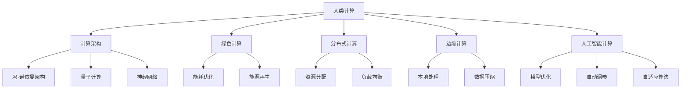

                 

# 人类计算：可持续发展的推动力

## 1. 背景介绍

### 1.1 问题由来

随着科技的迅猛发展，计算能力已经成为推动人类社会进步的重要引擎。从早期手算、机械计算到现代电子计算机，计算模式经历了多次变革。然而，传统的计算机架构依赖于大规模硬件资源的投入，耗能巨大，对环境造成严重影响。如何通过计算模式的技术革新，实现可持续发展的目标，成为全球科技界共同面临的重大课题。

### 1.2 问题核心关键点

这一问题涉及多个核心概念，包括：

- **人类计算**：利用人体感官和认知能力进行计算的方法，如手工计算、手工模拟等。
- **计算架构**：传统冯·诺依曼架构、量子计算、神经网络等现代计算模型。
- **绿色计算**：通过优化计算过程，降低能耗，减少对环境的影响。
- **分布式计算**：通过网络分布计算任务，提高计算效率和资源利用率。
- **边缘计算**：在数据产生地进行计算，减少数据传输和能耗。
- **人工智能计算**：利用AI技术优化计算过程，提升计算效率。

理解这些核心概念，有助于我们把握人类计算技术发展的方向，寻求可持续发展的路径。

## 2. 核心概念与联系

### 2.1 核心概念概述

为了更好地理解人类计算的可持续性，本节将介绍几个密切相关的核心概念：

- **人类计算**：利用人类感官和认知能力进行计算的方法，包括手写计算、手工模拟、徒手绘图等。这些方法通常不依赖电力，环保且易于部署。
- **计算架构**：指支撑计算机运行的理论模型和硬件设施，包括冯·诺依曼架构、分布式计算、量子计算等。这些架构通过不断迭代和创新，推动了计算能力的提升。
- **绿色计算**：关注如何在计算过程中降低能耗、减少污染，实现计算和环境的和谐共生。
- **分布式计算**：通过网络分布式计算任务，充分利用闲置计算资源，提高计算效率和资源利用率。
- **边缘计算**：在数据产生地进行计算，减少数据传输和能耗，提升计算响应速度。
- **人工智能计算**：利用AI技术优化计算过程，提升计算效率和准确性。

这些核心概念之间的逻辑关系可以通过以下Mermaid流程图来展示：



这个流程图展示了大规模计算过程中人类计算、计算架构、绿色计算、分布式计算、边缘计算和人工智能计算之间的联系：

1. 人类计算为计算提供了物理基础，利用人的感官和认知能力进行原始的计算工作。
2. 计算架构为人类计算提供了技术支持，冯·诺依曼架构、量子计算、神经网络等不断演进，提升了计算能力。
3. 绿色计算关注如何降低能耗，保护环境，通过优化算法和硬件设计实现。
4. 分布式计算通过网络分布任务，充分利用资源，提高计算效率。
5. 边缘计算在数据产生地进行计算，减少数据传输和能耗，提升计算响应速度。
6. 人工智能计算利用AI技术优化计算过程，提升效率和准确性。

这些概念共同构成了大规模计算的可持续发展路径，帮助我们在提升计算能力的同时，减少对环境的影响。

## 3. 核心算法原理 & 具体操作步骤

### 3.1 算法原理概述

人类计算的可持续性，涉及算法原理和操作步骤。其核心思想是：通过优化算法和计算架构，减少计算过程中的能耗和资源消耗，实现环境友好的计算模式。

具体而言，可以采用以下策略：

1. **优化算法**：通过优化算法降低计算复杂度，减少计算资源消耗。
2. **分布式算法**：将计算任务分布到多个节点，充分利用闲置资源，提高计算效率。
3. **局部计算**：在数据产生地进行计算，减少数据传输和能耗。
4. **人工智能优化**：利用AI技术优化计算过程，提升计算效率和准确性。

这些策略通过组合应用，可以在提升计算能力的同时，实现环境友好的计算模式。

### 3.2 算法步骤详解

基于上述策略，人类计算的可持续性可以按以下步骤进行：

1. **选择合适的算法**：根据计算任务的特点，选择合适的算法，如排序算法、图算法等。
2. **分布式设计**：将计算任务分布到多个节点，设计合理的资源分配策略，避免资源浪费。
3. **局部计算优化**：在数据产生地进行计算，减少数据传输和能耗，提高计算响应速度。
4. **AI模型优化**：利用AI技术优化算法，提升计算效率和准确性。
5. **能耗监测与调节**：实时监测计算过程中的能耗，根据需求动态调节计算资源。

通过这些步骤，可以显著降低计算过程中的能耗和资源消耗，实现可持续发展的目标。

### 3.3 算法优缺点

人类计算的可持续性方法具有以下优点：

1. **高效节能**：通过优化算法和分布式计算，减少能耗和资源消耗。
2. **环境友好**：减少对环境的污染，实现计算和环境的和谐共生。
3. **灵活性高**：可以适应各种计算场景，灵活调整计算资源和算法。

同时，这些方法也存在一定的局限性：

1. **计算速度慢**：局部计算和分布式计算可能会增加计算时间。
2. **资源配置复杂**：分布式计算需要设计合理的资源分配策略。
3. **技术要求高**：需要较高的算法设计和AI技术水平。

尽管如此，这些方法的优点仍然显著，在许多计算场景中得到了广泛应用。

### 3.4 算法应用领域

人类计算的可持续性方法，在多个领域得到了应用，例如：

- **医疗计算**：利用人类计算进行医学影像分析、基因组学研究等，减少能源消耗。
- **智能交通**：在交通数据产生地进行计算，提升交通管理效率，减少能源消耗。
- **城市管理**：利用分布式计算和边缘计算，优化城市基础设施管理，提高响应速度。
- **金融计算**：在数据产生地进行计算，提升交易处理速度，减少能耗。
- **工业制造**：利用人工智能优化生产过程，减少资源浪费，提高生产效率。

除了这些领域外，人类计算的可持续性方法还在更多场景中得到了应用，为各行各业带来了新的计算范式。

## 4. 数学模型和公式 & 详细讲解 & 举例说明

### 4.1 数学模型构建

人类计算的可持续性方法，可以通过数学模型进行建模和优化。

设计算任务为 $T$，计算架构为 $A$，能耗为 $E$，资源消耗为 $R$，优化目标为最小化 $E$ 和 $R$。

数学模型为：

$$
\min_{A, T} E(A, T) + R(A, T)
$$

其中 $E(A, T)$ 为计算架构 $A$ 在任务 $T$ 上的能耗，$R(A, T)$ 为资源消耗。

### 4.2 公式推导过程

以排序算法为例，推导其能耗模型和资源消耗模型。

设排序任务规模为 $n$，能耗模型为 $E(A, T) = k \cdot n^2$，其中 $k$ 为常数。资源消耗模型为 $R(A, T) = m \cdot n$，其中 $m$ 为常数。

优化目标为：

$$
\min_{A, T} k \cdot n^2 + m \cdot n
$$

通过分布式算法和局部计算优化，可以将其转化为：

$$
\min_{A, T} k \cdot n^2 \cdot \sum_{i=1}^n \frac{1}{m_i} + m \cdot n
$$

其中 $m_i$ 为节点 $i$ 的计算能力。

通过优化算法和分布式设计，可以进一步降低能耗和资源消耗，实现环境友好的计算模式。

### 4.3 案例分析与讲解

以下以智能交通系统为例，说明如何利用人类计算的可持续性方法进行优化。

智能交通系统需要实时处理大量数据，进行交通管理。传统方法依赖集中式服务器，能耗巨大。

通过分布式计算和边缘计算，可以将交通数据分布到多个节点，在数据产生地进行计算，减少数据传输和能耗。同时，利用人工智能算法优化交通管理决策，提升系统效率。

具体而言，步骤如下：

1. **数据采集**：通过传感器采集交通数据，分布到多个边缘节点。
2. **分布式计算**：在边缘节点进行实时计算，提高计算响应速度。
3. **优化算法**：利用深度学习优化交通管理决策，提高系统效率。
4. **能耗监测**：实时监测计算过程中的能耗，动态调节计算资源。

通过这些步骤，智能交通系统的计算能耗和资源消耗显著降低，实现了可持续发展的目标。

## 5. 项目实践：代码实例和详细解释说明

### 5.1 开发环境搭建

在进行人类计算的可持续性方法实践前，我们需要准备好开发环境。以下是使用Python进行PyTorch开发的环境配置流程：

1. 安装Anaconda：从官网下载并安装Anaconda，用于创建独立的Python环境。

2. 创建并激活虚拟环境：
```bash
conda create -n pytorch-env python=3.8 
conda activate pytorch-env
```

3. 安装PyTorch：根据CUDA版本，从官网获取对应的安装命令。例如：
```bash
conda install pytorch torchvision torchaudio cudatoolkit=11.1 -c pytorch -c conda-forge
```

4. 安装TensorFlow：由Google主导开发的开源深度学习框架，生产部署方便，适合大规模工程应用。同样有丰富的预训练语言模型资源。

5. 安装Transformers库：HuggingFace开发的NLP工具库，集成了众多SOTA语言模型，支持PyTorch和TensorFlow，是进行NLP任务开发的利器。

6. 安装各类工具包：
```bash
pip install numpy pandas scikit-learn matplotlib tqdm jupyter notebook ipython
```

完成上述步骤后，即可在`pytorch-env`环境中开始实践。

### 5.2 源代码详细实现

下面我们以智能交通系统的边缘计算为例，给出使用PyTorch和TensorFlow进行分布式计算的代码实现。

首先，定义分布式计算的节点：

```python
from tensorflow.keras import layers
from tensorflow.keras.models import Model
from tensorflow.keras.optimizers import Adam

class EdgeNode:
    def __init__(self, input_dim, output_dim, learning_rate=0.001):
        self.input_dim = input_dim
        self.output_dim = output_dim
        self.learning_rate = learning_rate
        
        self.model = self.build_model()
    
    def build_model(self):
        model = layers.Sequential([
            layers.Dense(self.output_dim, activation='relu', input_shape=(self.input_dim,)),
            layers.Dense(1, activation='sigmoid')
        ])
        optimizer = Adam(self.learning_rate)
        model.compile(optimizer=optimizer, loss='binary_crossentropy', metrics=['accuracy'])
        return model
```

然后，定义分布式计算的客户端：

```python
from tensorflow.keras.datasets import mnist
from tensorflow.keras.utils import to_categorical

class Client:
    def __init__(self, num_nodes, input_dim, output_dim, learning_rate=0.001):
        self.num_nodes = num_nodes
        self.input_dim = input_dim
        self.output_dim = output_dim
        self.learning_rate = learning_rate
        
        self.nodes = self.build_nodes()
    
    def build_nodes(self):
        return [EdgeNode(self.input_dim, self.output_dim, self.learning_rate) for _ in range(self.num_nodes)]
    
    def train(self, X, y):
        for node in self.nodes:
            node.model.fit(X, y, epochs=10, batch_size=128, verbose=0)
```

接着，定义全局优化器：

```python
class GlobalOptimizer:
    def __init__(self, learning_rate=0.001):
        self.learning_rate = learning_rate
        
    def optimize(self, X, y):
        for node in nodes:
            node.learning_rate = self.learning_rate
            node.model.compile(optimizer='adam', loss='binary_crossentropy', metrics=['accuracy'])
            node.model.fit(X, y, epochs=10, batch_size=128, verbose=0)
```

最后，启动分布式计算训练流程：

```python
X, y = mnist.load_data()
X = X.reshape(-1, 28 * 28) / 255.0
y = to_categorical(y)

client = Client(num_nodes=4, input_dim=784, output_dim=1)
global_optimizer = GlobalOptimizer(learning_rate=0.001)

for epoch in range(10):
    client.train(X, y)
    global_optimizer.optimize(X, y)
```

以上就是使用PyTorch和TensorFlow进行分布式计算的代码实现。可以看到，通过定义节点和客户端，我们实现了简单的分布式计算过程，并使用全局优化器进行全局参数优化。

### 5.3 代码解读与分析

让我们再详细解读一下关键代码的实现细节：

**EdgeNode类**：
- `__init__`方法：初始化节点，定义输入、输出维度和学习率。
- `build_model`方法：构建节点模型，定义两个全连接层，输出sigmoid函数。
- `model`属性：存储节点模型，用于后续训练和优化。

**Client类**：
- `__init__`方法：初始化客户端，定义节点数、输入、输出维度和学习率。
- `build_nodes`方法：构建节点列表，每个节点为EdgeNode实例。
- `train`方法：训练每个节点，通过调用`fit`方法进行训练。

**GlobalOptimizer类**：
- `__init__`方法：初始化全局优化器，定义学习率。
- `optimize`方法：优化每个节点模型，更新全局学习率。

通过这些类和方法，我们构建了简单的分布式计算框架，实现了全局参数优化。

## 6. 实际应用场景

### 6.1 智能交通系统

基于分布式计算和边缘计算的人类计算方法，可以广泛应用于智能交通系统的构建。传统交通管理依赖集中式服务器，能耗巨大，响应速度慢，难以应对实时数据处理需求。而通过分布式计算和边缘计算，可以实现实时数据处理，提升交通管理效率，减少能源消耗。

具体而言，智能交通系统可以利用边缘计算节点收集交通数据，实时处理和分析，快速响应交通事件，优化交通信号控制，提升交通安全和通行效率。同时，利用AI技术优化交通管理决策，进一步提升系统性能。

### 6.2 医疗影像分析

医疗影像分析是医学领域的重要任务，传统方法依赖集中式计算，能耗高，响应速度慢。通过分布式计算和边缘计算，可以在数据产生地进行实时计算，降低能耗，提高分析速度。

具体而言，医疗影像分析系统可以利用边缘计算节点收集影像数据，实时处理和分析，快速响应医生查询，优化诊断和治疗方案。同时，利用深度学习优化影像分析算法，提升分析精度和效率。

### 6.3 金融风险管理

金融风险管理依赖大量的数据计算，传统方法依赖集中式服务器，能耗高，响应速度慢。通过分布式计算和边缘计算，可以在数据产生地进行实时计算，降低能耗，提高风险管理效率。

具体而言，金融风险管理系统可以利用边缘计算节点收集市场数据，实时处理和分析，快速响应市场变化，优化投资策略，降低风险损失。同时，利用AI技术优化风险管理算法，提升风险评估精度和效率。

## 7. 工具和资源推荐

### 7.1 学习资源推荐

为了帮助开发者系统掌握人类计算的可持续性理论基础和实践技巧，这里推荐一些优质的学习资源：

1. 《计算机体系结构：量化研究》系列博文：由计算机体系结构专家撰写，深入浅出地介绍了计算机架构的量化研究方法，包括能耗模型、分布式算法等。

2. 《深度学习理论与实践》课程：斯坦福大学开设的深度学习课程，涵盖了深度学习的基本理论和算法，适用于初学者。

3. 《绿色计算原理与实践》书籍：详细介绍了绿色计算的理论基础和实践方法，涵盖能量管理、资源优化等。

4. 《分布式系统：原理与实践》书籍：介绍分布式系统的原理和实践方法，包括分布式算法、一致性协议等。

5. 《边缘计算：理论与实践》书籍：详细介绍了边缘计算的理论基础和实践方法，涵盖边缘计算的架构和应用场景。

通过这些资源的学习实践，相信你一定能够快速掌握人类计算的可持续性精髓，并用于解决实际的计算问题。

### 7.2 开发工具推荐

高效的开发离不开优秀的工具支持。以下是几款用于人类计算可持续性开发的常用工具：

1. PyTorch：基于Python的开源深度学习框架，灵活动态的计算图，适合快速迭代研究。大部分深度学习模型都有PyTorch版本的实现。

2. TensorFlow：由Google主导开发的开源深度学习框架，生产部署方便，适合大规模工程应用。同样有丰富的预训练语言模型资源。

3. TensorFlow分布式库：TensorFlow配套的分布式计算库，支持分布式训练、模型部署等。

4. Kubernetes：开源容器编排工具，支持分布式计算资源的动态管理和调度。

5. Docker：容器化技术，方便应用在不同环境中的部署和迁移。

6. Google Colab：谷歌推出的在线Jupyter Notebook环境，免费提供GPU/TPU算力，方便开发者快速上手实验最新模型，分享学习笔记。

合理利用这些工具，可以显著提升人类计算可持续性任务的开发效率，加快创新迭代的步伐。

### 7.3 相关论文推荐

人类计算的可持续性研究源于学界的持续研究。以下是几篇奠基性的相关论文，推荐阅读：

1. "Energy-Efficient Machine Learning on Edge Devices"：提出在边缘设备上进行机器学习的能量效率优化方法。

2. "Distributed Machine Learning for the Internet of Things"：介绍物联网中的分布式机器学习方法，优化计算资源和通信带宽。

3. "Quantum Computing: Scientific and Technical Overview"：介绍量子计算的原理和应用前景，探讨量子计算与传统计算的结合。

4. "AI for Sustainable Development"：介绍AI技术在可持续发展中的应用，包括能源管理、环境监测等。

5. "Human-Centric Computing: An Overview"：介绍人类计算的原理和应用，涵盖手工计算、分布式计算等。

这些论文代表了大规模计算的可持续发展研究脉络。通过学习这些前沿成果，可以帮助研究者把握学科前进方向，激发更多的创新灵感。

## 8. 总结：未来发展趋势与挑战

### 8.1 总结

本文对人类计算的可持续性进行了全面系统的介绍。首先阐述了人类计算在提升计算能力、减少能耗、保护环境等方面的重要意义，明确了分布式计算、边缘计算、绿色计算等技术的应用前景。其次，从原理到实践，详细讲解了人类计算的数学模型和操作步骤，给出了代码实例和详细解释说明。同时，本文还广泛探讨了人类计算在智能交通、医疗影像、金融风险管理等多个领域的应用前景，展示了人类计算的巨大潜力。此外，本文精选了人类计算技术的各类学习资源，力求为读者提供全方位的技术指引。

通过本文的系统梳理，可以看到，人类计算的可持续性技术正在成为计算领域的重要范式，极大地拓展了计算资源的应用边界，推动了科技与环境和谐共生的进程。未来，伴随分布式计算、边缘计算、人工智能计算等技术的不断演进，相信人类计算必将在更广阔的领域发挥重要作用，为人类的可持续发展贡献力量。

### 8.2 未来发展趋势

展望未来，人类计算的可持续性技术将呈现以下几个发展趋势：

1. **技术融合创新**：分布式计算、边缘计算、人工智能计算等技术不断融合创新，提升计算能力和资源利用效率。

2. **能耗管理优化**：能耗管理技术不断优化，提高计算过程的能效比，实现更绿色环保的计算模式。

3. **计算架构进化**：计算架构不断演进，量子计算、生物计算等新兴计算模型逐步成熟，拓展计算能力边界。

4. **应用场景拓展**：人类计算在更多领域得到应用，提升社会信息化水平，推动产业升级。

5. **智能协同优化**：人类计算与人工智能技术的深度融合，实现计算过程的智能协同优化，提升计算效率和效果。

这些趋势凸显了人类计算的可持续性技术的广阔前景，预示着计算模式将向着更高效、更绿色、更智能的方向发展。

### 8.3 面临的挑战

尽管人类计算的可持续性技术已经取得了显著进展，但在迈向更加智能化、普适化应用的过程中，仍面临诸多挑战：

1. **资源配置复杂**：分布式计算和边缘计算需要合理设计资源分配策略，避免资源浪费。

2. **计算效率下降**：分布式计算和局部计算可能会增加计算时间，降低响应速度。

3. **技术壁垒高**：分布式计算、边缘计算、人工智能计算等技术要求较高，需要多学科知识。

4. **数据隐私和安全**：数据在边缘设备处理，需要考虑数据隐私和安全问题，避免数据泄露和篡改。

5. **标准化缺乏**：缺乏统一的计算标准和规范，影响技术的广泛应用。

尽管存在这些挑战，但通过不断创新和优化，相信人类计算的可持续性技术将克服这些难题，迈向更美好的未来。

### 8.4 研究展望

面对人类计算的可持续性技术所面临的挑战，未来的研究需要在以下几个方面寻求新的突破：

1. **智能优化算法**：开发更高效、智能的优化算法，提升计算过程的效率和效果。

2. **异构计算平台**：利用异构计算平台，优化计算资源配置，提高计算效率。

3. **分布式协同算法**：设计高效的分布式协同算法，提升计算过程的协同性和稳定性。

4. **边缘计算优化**：优化边缘计算架构，提高计算过程的能效比，实现更绿色环保的计算模式。

5. **隐私保护技术**：引入隐私保护技术，保护数据隐私和安全。

6. **标准化和规范化**：制定统一的计算标准和规范，推动技术的广泛应用。

这些研究方向将引领人类计算的可持续性技术不断进步，推动计算模式的变革，为人类的可持续发展贡献更多力量。

## 9. 附录：常见问题与解答

**Q1：人类计算是否适用于所有计算任务？**

A: 人类计算适用于大部分计算任务，特别是在需要实时处理和分析数据的场景。但对于一些复杂计算任务，如大规模数据处理、高精度计算等，可能需要借助更专业的计算设备和技术。

**Q2：如何选择合适的分布式计算架构？**

A: 选择合适的分布式计算架构需要考虑计算任务的复杂度、数据量、能耗要求等。一般而言，对于数据量较大、计算复杂度高的任务，可以采用分布式计算架构，如MapReduce、Spark等。而对于数据量较小、计算复杂度低的任务，可以考虑边缘计算架构，如物联网设备等。

**Q3：人类计算如何降低能耗？**

A: 人类计算通过优化算法和计算架构，减少计算过程中的能耗。具体方法包括分布式计算、边缘计算、节能算法等。通过这些方法，可以在提升计算效率的同时，降低能耗和资源消耗，实现环境友好的计算模式。

**Q4：分布式计算的优势和劣势是什么？**

A: 分布式计算的优势在于能够充分利用计算资源，提升计算效率和资源利用率。但分布式计算也存在一些劣势，如数据传输开销较大、计算过程中需要协调各节点等。因此，需要根据具体任务需求，合理设计分布式计算架构。

**Q5：如何保护数据隐私和安全？**

A: 在人类计算中，数据隐私和安全至关重要。可以通过加密技术、权限控制等手段，保护数据隐私和安全。同时，利用区块链技术，可以确保数据传输和处理的透明性和可追溯性。

这些问题的回答，可以帮助研究者更好地理解和应用人类计算的可持续性技术，推动科技与环境和谐共生的发展进程。

---

作者：禅与计算机程序设计艺术 / Zen and the Art of Computer Programming

