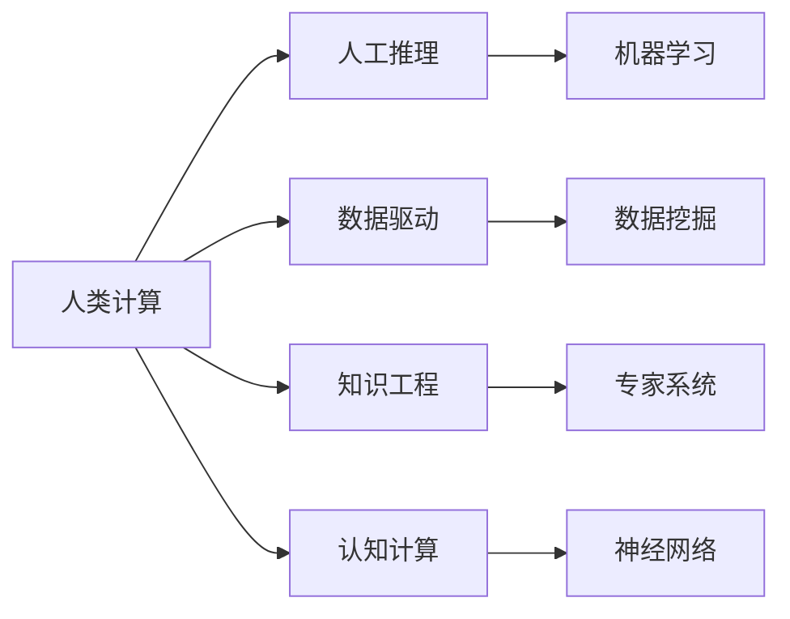

                 

## 1. 背景介绍

### 1.1 问题由来

随着计算机科学的蓬勃发展，人类计算（Human Computation）在当今社会中扮演着越来越重要的角色。无论是科学研究、工程设计、还是日常决策，人类计算的能力和应用都得到了前所未有的重视。人类计算与人工智能（AI）、大数据、云计算等技术的结合，使得复杂问题的解决变得更加高效和精确。然而，人类计算的具体应用场景、方法、工具和挑战仍然缺乏系统性的研究和总结。

### 1.2 问题核心关键点

人类计算的核心在于利用人类的逻辑思维、直觉和创造力来解决计算机难以解决的问题。这些问题通常涉及复杂的因果关系、模糊逻辑和上下文理解，难以通过简单的算法和模型自动化解决。以下是人类计算研究的主要关键点：

1. **问题定义**：如何准确定义和描述需要计算的问题。
2. **数据处理**：如何高效地从海量数据中提取有用的信息。
3. **知识整合**：如何将人类知识、经验和直觉与计算模型结合。
4. **模型构建**：如何构建适合特定问题的计算模型。
5. **结果解释**：如何解释计算结果，确保结果的可信度和可解释性。

### 1.3 问题研究意义

研究人类计算的应用和案例分析，对于推动科学、工程、艺术等多个领域的发展具有重要意义：

1. **提升效率**：通过结合人类和计算资源，解决复杂问题，大幅提升工作效率。
2. **增强创新**：利用人类计算，拓展思维边界，促进技术创新和应用。
3. **促进教育**：通过案例分析，提供学习参考，提升教育水平和人才培养。
4. **改善决策**：通过深入分析，提供决策支持，优化决策过程和结果。
5. **推动跨学科合作**：促进计算机科学与其他学科的融合，推动交叉学科发展。

## 2. 核心概念与联系

### 2.1 核心概念概述

为了更好地理解人类计算的应用与案例分析，我们首先需要明确以下几个核心概念：

- **人类计算（Human Computation）**：利用人类逻辑思维和创造力解决计算问题的过程。
- **人工推理（Artificial Reasoning）**：计算机通过算法和模型进行的推理。
- **数据驱动（Data-Driven）**：通过数据挖掘和机器学习，自动提取和利用数据。
- **知识工程（Knowledge Engineering）**：将专家知识转化为可计算的形式。
- **认知计算（Cognitive Computing）**：结合心理学、认知科学和计算技术，模拟人类认知过程。

这些概念之间存在紧密的联系，共同构成了人类计算的基础框架。通过理解这些概念，我们可以更好地把握人类计算的应用场景和方法。

### 2.2 核心概念原理和架构的 Mermaid 流程图



该流程图展示了人类计算与其他概念之间的联系：

1. **人工推理**：计算机通过算法和模型进行逻辑推理。
2. **数据驱动**：利用数据挖掘和机器学习自动提取和利用数据。
3. **知识工程**：将专家知识转化为可计算的形式。
4. **认知计算**：结合心理学和认知科学，模拟人类认知过程。

这些概念共同支撑了人类计算的实现，并在实际应用中相互交织，形成了一个动态的计算模型。

## 3. 核心算法原理 & 具体操作步骤

### 3.1 算法原理概述

人类计算的算法原理主要围绕着以下几个方面展开：

1. **问题定义**：将需要解决的问题明确表达，并转化为计算形式。
2. **数据获取**：从各种来源获取相关数据。
3. **知识整合**：将人类知识和经验整合到计算模型中。
4. **模型构建**：选择和设计适合问题的计算模型。
5. **结果解释**：对计算结果进行解释和验证，确保结果的可信度和可解释性。

### 3.2 算法步骤详解

人类计算的具体操作步骤如下：

1. **问题定义**：
   - 收集相关领域的专业知识，对问题进行清晰的定义和描述。
   - 确定问题的计算目标和指标，如效率、精度、可解释性等。

2. **数据获取**：
   - 确定数据源，包括文献、实验结果、市场数据等。
   - 进行数据清洗和预处理，确保数据的质量和可用性。

3. **知识整合**：
   - 将专家知识和经验转化为计算模型中的规则和假设。
   - 利用知识图谱、符号逻辑等工具，构建知识表示系统。

4. **模型构建**：
   - 选择合适的计算模型，如神经网络、逻辑推理、模拟系统等。
   - 设计模型结构，包括输入、输出、中间层等。

5. **结果解释**：
   - 对计算结果进行解释，确保结果的可理解性和可信度。
   - 利用可视化工具，展示计算过程和结果。

### 3.3 算法优缺点

人类计算的算法优点在于其灵活性和创新性，能够处理复杂的因果关系和模糊逻辑。然而，也存在一些缺点：

1. **效率问题**：相比于自动算法，人类计算的效率较低，需要大量时间和资源。
2. **依赖专家**：对专家的依赖较强，专家的水平和经验对结果的准确性有较大影响。
3. **主观性**：人类计算存在主观性和情感因素，可能导致结果的偏差。
4. **缺乏标准化**：缺乏统一的标准和流程，可能导致结果不一致。

### 3.4 算法应用领域

人类计算在多个领域中得到了广泛应用，以下是几个典型的应用场景：

1. **科学研究**：在生物信息学、天文学、材料科学等领域，利用人类计算解决复杂的理论问题和实验设计问题。
2. **工程设计**：在航空航天、机械设计、软件工程等领域，利用人类计算进行创新设计和技术优化。
3. **金融分析**：在风险评估、市场预测、投资决策等领域，利用人类计算进行深度分析和决策支持。
4. **医疗诊断**：在疾病诊断、治疗方案制定、药物研发等领域，利用人类计算提供专业建议和解决方案。
5. **艺术创作**：在音乐创作、绘画设计、文学创作等领域，利用人类计算进行灵感启发和创作支持。

## 4. 数学模型和公式 & 详细讲解 & 举例说明

### 4.1 数学模型构建

在人类计算中，数学模型的构建是关键步骤之一。通常包括以下几个方面：

1. **问题建模**：将问题转化为数学表达式或方程。
2. **假设设定**：设定问题的假设条件，简化问题模型。
3. **模型验证**：验证模型的正确性和完备性，确保模型的合理性。

### 4.2 公式推导过程

以一个简单的例子来说明数学模型的构建过程。假设我们需要计算两个数的平均值：

1. 问题定义：计算两个数的平均值。
2. 数据获取：输入两个数 $x_1$ 和 $x_2$。
3. 知识整合：平均值是两个数的总和除以2。
4. 模型构建：设定 $y = \frac{x_1 + x_2}{2}$。
5. 结果解释：$y$ 是 $x_1$ 和 $x_2$ 的平均值。

在公式推导过程中，需要注意以下几点：

- 确保公式的正确性和完备性。
- 利用符号和公式进行精确表达，避免歧义。
- 进行公式的验证和测试，确保公式的合理性。

### 4.3 案例分析与讲解

以神经网络为例，分析人类计算在模型构建中的应用。

1. **问题定义**：构建一个神经网络模型，用于图像分类。
2. **数据获取**：获取图像数据集，并进行预处理。
3. **知识整合**：了解神经网络的基本原理，如神经元、激活函数、反向传播等。
4. **模型构建**：设计神经网络的结构，包括输入层、隐藏层、输出层等。
5. **结果解释**：解释神经网络的计算过程和输出结果，确保模型的可解释性和可信度。

通过人类计算，我们可以更好地理解神经网络的工作原理，进行更精确的模型设计和优化。

## 5. 项目实践：代码实例和详细解释说明

### 5.1 开发环境搭建

在项目实践中，开发环境搭建是第一步。以下是一个基于Python的开发环境搭建流程：

1. **安装Python**：
   - 从官网下载并安装Python。
   - 使用pip安装相关库和工具。

2. **安装相关库**：
   - 安装NumPy、SciPy、Matplotlib等科学计算库。
   - 安装Pandas、Scikit-learn、TensorFlow等机器学习库。

3. **安装开发工具**：
   - 安装Jupyter Notebook，方便编写和运行代码。
   - 安装PyCharm、Visual Studio Code等IDE工具，提升开发效率。

4. **安装数据集**：
   - 安装相关领域的数据集，如MNIST、CIFAR-10等。
   - 进行数据预处理和清洗，确保数据的质量和可用性。

### 5.2 源代码详细实现

以下是一个简单的神经网络模型构建和训练的代码实现：

```python
import numpy as np
import matplotlib.pyplot as plt

# 定义神经网络模型
class NeuralNetwork:
    def __init__(self, input_size, hidden_size, output_size):
        self.input_size = input_size
        self.hidden_size = hidden_size
        self.output_size = output_size
        
        # 初始化权重和偏置
        self.weights1 = np.random.randn(self.input_size, self.hidden_size)
        self.bias1 = np.zeros(self.hidden_size)
        self.weights2 = np.random.randn(self.hidden_size, self.output_size)
        self.bias2 = np.zeros(self.output_size)
        
    def forward(self, x):
        # 前向传播
        self.z1 = np.dot(x, self.weights1) + self.bias1
        self.a1 = self.sigmoid(self.z1)
        self.z2 = np.dot(self.a1, self.weights2) + self.bias2
        self.a2 = self.sigmoid(self.z2)
        return self.a2
    
    def sigmoid(self, x):
        return 1 / (1 + np.exp(-x))
    
    def sigmoid_derivative(self, x):
        return x * (1 - x)
    
    def backward(self, x, y, a2, loss):
        # 反向传播
        delta2 = (a2 - y) * self.sigmoid_derivative(a2)
        d_weights2 = np.dot(self.a1.T, delta2)
        d_bias2 = delta2
        
        delta1 = np.dot(delta2, self.weights2.T) * self.sigmoid_derivative(self.a1)
        d_weights1 = np.dot(x.T, delta1)
        d_bias1 = delta1
        
        # 更新权重和偏置
        self.weights1 -= learning_rate * d_weights1
        self.bias1 -= learning_rate * d_bias1
        self.weights2 -= learning_rate * d_weights2
        self.bias2 -= learning_rate * d_bias2
        
        # 计算梯度
        grads = {
            'd_weights1': d_weights1,
            'd_bias1': d_bias1,
            'd_weights2': d_weights2,
            'd_bias2': d_bias2,
            'loss': loss
        }
        return grads
    
    def train(self, x_train, y_train, epochs, learning_rate):
        # 训练神经网络
        n_samples = len(x_train)
        losses = []
        for epoch in range(epochs):
            for i in range(n_samples):
                x = x_train[i].reshape(1, -1)
                y = y_train[i].reshape(1, -1)
                
                a2 = self.forward(x)
                loss = np.mean(np.square(a2 - y))
                
                grads = self.backward(x, y, a2, loss)
                self.weights1 -= learning_rate * grads['d_weights1']
                self.bias1 -= learning_rate * grads['d_bias1']
                self.weights2 -= learning_rate * grads['d_weights2']
                self.bias2 -= learning_rate * grads['d_bias2']
                
                losses.append(grads['loss'])
        
        return losses
```

### 5.3 代码解读与分析

- **NeuralNetwork类**：定义神经网络模型，包含前向传播、反向传播、训练等方法。
- **forward方法**：实现前向传播，计算输出结果。
- **sigmoid方法**：实现激活函数，将神经元的输出进行归一化。
- **backward方法**：实现反向传播，更新权重和偏置。
- **train方法**：实现训练过程，逐步更新模型参数。

## 6. 实际应用场景

### 6.1 科学研究

在科学研究中，人类计算常常用于解决复杂的理论问题和实验设计问题。例如，在天体物理学中，科学家利用人类计算模拟黑洞的引力场，分析其对附近恒星的运动影响。

### 6.2 工程设计

在工程设计中，人类计算可用于创新设计和技术优化。例如，在航空航天领域，工程师利用人类计算模拟飞机在不同飞行条件下的性能，优化飞机设计方案。

### 6.3 金融分析

在金融分析中，人类计算可用于风险评估和市场预测。例如，分析师利用人类计算评估股票市场的波动性和趋势，制定投资策略。

### 6.4 医疗诊断

在医疗诊断中，人类计算可用于疾病诊断和治疗方案制定。例如，医生利用人类计算分析患者病历，制定个性化的治疗方案。

### 6.5 艺术创作

在艺术创作中，人类计算可用于灵感启发和创作支持。例如，艺术家利用人类计算生成音乐旋律，进行创作实验。

## 7. 工具和资源推荐

### 7.1 学习资源推荐

为了帮助开发者掌握人类计算的应用与案例分析，这里推荐一些优质的学习资源：

1. **《人类计算》系列书籍**：详细介绍了人类计算的基本概念和应用案例。
2. **Coursera《人类计算》课程**：由斯坦福大学教授讲授，涵盖人类计算的多个方面。
3. **Arxiv.org**：获取最新的人类计算研究成果和论文。
4. **IEEE Xplore**：查找人类计算领域的专利和技术文档。

### 7.2 开发工具推荐

以下是几款用于人类计算开发的常用工具：

1. **Python**：基于Python的科学计算和数据分析库，如NumPy、SciPy、Pandas等。
2. **MATLAB**：用于数学建模和数据可视化的强大工具。
3. **Simulink**：用于系统建模和仿真的工程工具。
4. **OpenOffice Calc**：用于电子表格计算和数据分析的工具。

### 7.3 相关论文推荐

人类计算的研究涉及多个领域，以下几篇论文是值得阅读的：

1. **《人类计算：过去、现在和未来》**：一篇综述性论文，介绍了人类计算的发展历程和应用案例。
2. **《人类计算与人工智能的融合》**：讨论了人类计算与人工智能的结合，探索未来发展方向。
3. **《认知计算与人类计算的比较》**：比较了认知计算和人类计算的异同，探讨了各自的优缺点。

## 8. 总结：未来发展趋势与挑战

### 8.1 研究成果总结

人类计算作为人工智能的重要组成部分，在多个领域得到了广泛应用，取得了显著的成果。人类计算与人工智能的结合，推动了科学、工程、金融、医疗等多个领域的创新和发展。

### 8.2 未来发展趋势

未来，人类计算的发展趋势包括：

1. **智能化升级**：通过结合人工智能技术，提升人类计算的自动化和智能化水平。
2. **多学科融合**：与其他学科的深度融合，推动跨学科研究和发展。
3. **工业化应用**：推动人类计算在工业界的广泛应用，提升生产效率和质量。
4. **全球化合作**：加强国际合作，促进人类计算的全球化发展。

### 8.3 面临的挑战

尽管人类计算取得了显著进展，但仍面临诸多挑战：

1. **数据获取**：大规模、高质量数据获取的难度较大。
2. **模型优化**：模型复杂性和计算资源的限制，导致优化困难。
3. **结果验证**：结果的可信度和可解释性，需要进一步验证和改进。
4. **知识共享**：专家知识的共享和传承，仍需加强。

### 8.4 研究展望

未来的研究需要在以下几个方面进行突破：

1. **数据获取与预处理**：探索高效的数据获取和预处理技术，提升数据质量。
2. **模型优化与验证**：研发更加高效、精确的模型，确保结果的可靠性。
3. **知识工程与整合**：构建知识图谱、符号逻辑等工具，提升知识整合能力。
4. **人工智能融合**：结合人工智能技术，提升人类计算的自动化和智能化。
5. **多学科合作**：加强与其他学科的合作，推动跨学科研究和发展。

## 9. 附录：常见问题与解答

**Q1: 什么是人类计算？**

A: 人类计算是指利用人类的逻辑思维和创造力解决复杂问题的过程，通常需要结合计算机技术进行辅助。

**Q2: 人类计算与人工智能的区别是什么？**

A: 人类计算强调人类智慧在解决问题中的作用，而人工智能强调机器算法和模型的应用。两者相辅相成，共同推动问题的解决。

**Q3: 人类计算在哪些领域得到了应用？**

A: 人类计算在科学研究、工程设计、金融分析、医疗诊断、艺术创作等领域得到了广泛应用。

**Q4: 人类计算有哪些挑战？**

A: 数据获取、模型优化、结果验证、知识共享等是人类计算面临的主要挑战。

**Q5: 未来人类计算的发展趋势是什么？**

A: 智能化升级、多学科融合、工业化应用、全球化合作等是未来人类计算的发展趋势。

---

作者：禅与计算机程序设计艺术 / Zen and the Art of Computer Programming

